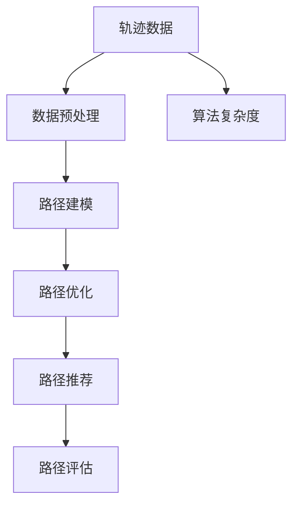
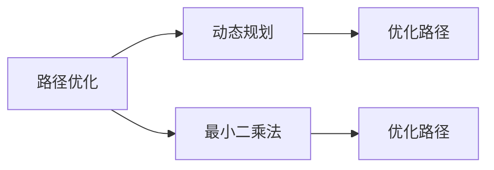
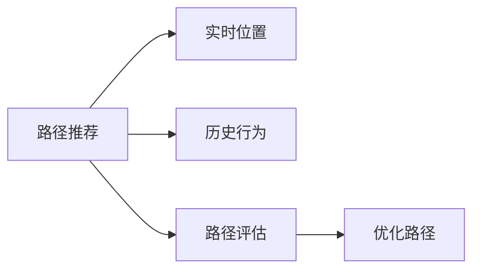
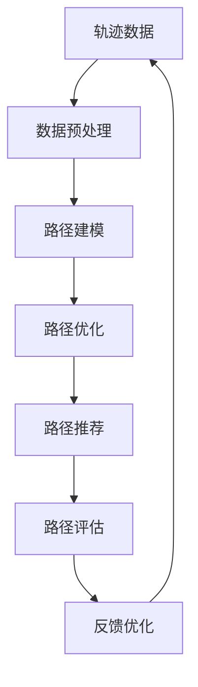

                 

# 基于轨迹数据的最优路径推荐算法设计与实现

> 关键词：轨迹数据,路径推荐,最小二乘法,动态规划,空间复杂度优化

## 1. 背景介绍

### 1.1 问题由来
随着互联网的普及和智能手机的广泛使用，人们的出行方式越来越依赖于在线地图和轨迹数据。如何基于用户的轨迹数据，推荐出最优的路径，成为了智能导航系统面临的一个重要问题。传统路径推荐算法多基于静态地图和少量用户历史数据，难以兼顾用户的实时需求和个性化特征。

近年来，研究人员开始利用用户轨迹数据进行动态路径推荐。这种新型的路径推荐方法能够根据用户的实时位置和历史行为，推荐出更符合用户偏好的路径。然而，由于轨迹数据的多样性和复杂性，路径推荐算法的计算和存储开销巨大，难以在大规模应用场景下实现高效运行。

因此，如何设计高效的路径推荐算法，快速地从轨迹数据中提取出有价值的信息，并推荐出最优路径，成为了当前研究的热点问题。

### 1.2 问题核心关键点
最优路径推荐的核心在于如何设计高效的算法，将用户轨迹数据转化为最优路径。具体来说，需要考虑以下几个关键点：

- **数据预处理**：对轨迹数据进行清洗和降维，提取有用的特征信息。
- **路径建模**：基于用户的实时位置和历史行为，构建路径模型。
- **路径优化**：采用高效算法，如动态规划、最小二乘法等，优化路径模型。
- **路径评估**：对推荐的路径进行评估和优化，确保推荐结果的准确性和实用性。
- **算法复杂度**：设计高效算法，减少路径推荐过程中的计算和存储开销。

本文将围绕这些问题点，详细介绍基于轨迹数据的最优路径推荐算法的原理和实现。

## 2. 核心概念与联系

### 2.1 核心概念概述

为更好地理解最优路径推荐算法，本节将介绍几个密切相关的核心概念：

- **轨迹数据**：指用户在某一时间段内的位置移动数据，通常包括经纬度、时间戳等。
- **路径建模**：指通过轨迹数据构建路径模型，用于描述用户的移动轨迹。
- **路径优化**：指基于路径模型，寻找最优路径的过程，通常采用动态规划、最小二乘法等算法。
- **路径推荐**：指根据用户的实时位置和历史行为，推荐出最优路径，通常用于智能导航和路径规划。
- **路径评估**：指对推荐的路径进行评估，衡量其符合用户需求的程度。
- **算法复杂度**：指路径推荐算法的计算和存储开销，影响其在实际应用中的可扩展性。

这些核心概念之间的逻辑关系可以通过以下Mermaid流程图来展示：



这个流程图展示了大语言模型微调过程中各个核心概念的关系：

1. 轨迹数据作为输入数据，首先经过数据预处理环节。
2. 处理后的数据进入路径建模环节，构建路径模型。
3. 路径模型经过路径优化环节，通过动态规划、最小二乘法等算法寻找最优路径。
4. 优化后的路径通过路径推荐环节，结合用户实时位置和历史行为，推荐出最符合用户需求的路径。
5. 推荐路径经过路径评估环节，衡量其满足用户需求的程度。
6. 整个路径推荐过程中，算法复杂度是一个关键考量因素。

### 2.2 概念间的关系

这些核心概念之间存在着紧密的联系，形成了路径推荐算法的完整生态系统。下面我们通过几个Mermaid流程图来展示这些概念之间的关系。

#### 2.2.1 路径推荐过程


这个流程图展示了路径推荐的基本流程：

1. 轨迹数据首先经过数据预处理环节，提取有用的特征信息。
2. 处理后的数据进入路径建模环节，构建路径模型。
3. 路径模型经过路径优化环节，通过动态规划、最小二乘法等算法寻找最优路径。
4. 优化后的路径通过路径推荐环节，结合用户实时位置和历史行为，推荐出最符合用户需求的路径。
5. 推荐路径经过路径评估环节，衡量其满足用户需求的程度。
6. 根据评估结果进行反馈优化，不断迭代改进路径推荐算法。

#### 2.2.2 路径优化方法



这个流程图展示了路径优化的两种主要方法：

1. 路径优化通过动态规划和最小二乘法两种算法实现。
2. 动态规划适用于描述路径的转移概率和状态转移过程。
3. 最小二乘法适用于路径长度、时间等指标的优化。
4. 优化后的路径用于路径推荐环节。

#### 2.2.3 路径推荐与评估



这个流程图展示了路径推荐和评估的过程：

1. 路径推荐根据用户的实时位置和历史行为，推荐出最优路径。
2. 路径评估对推荐路径进行评估，衡量其满足用户需求的程度。
3. 根据评估结果进行反馈优化，不断迭代改进路径推荐算法。

### 2.3 核心概念的整体架构

最后，我们用一个综合的流程图来展示这些核心概念在大规模路径推荐中的整体架构：



这个综合流程图展示了从轨迹数据到最优路径推荐的全过程：

1. 轨迹数据首先经过数据预处理环节，提取有用的特征信息。
2. 处理后的数据进入路径建模环节，构建路径模型。
3. 路径模型经过路径优化环节，通过动态规划、最小二乘法等算法寻找最优路径。
4. 优化后的路径通过路径推荐环节，结合用户实时位置和历史行为，推荐出最符合用户需求的路径。
5. 推荐路径经过路径评估环节，衡量其满足用户需求的程度。
6. 根据评估结果进行反馈优化，不断迭代改进路径推荐算法。

## 3. 核心算法原理 & 具体操作步骤
### 3.1 算法原理概述

最优路径推荐的核心算法主要基于动态规划和最小二乘法。

**动态规划算法**：动态规划算法适用于描述路径的转移概率和状态转移过程。它将问题分解为子问题，通过求解子问题的最优解，最终得到全局最优解。

**最小二乘法**：最小二乘法适用于路径长度、时间等指标的优化。它通过最小化预测值与真实值之间的平方误差，得到最优路径。

路径推荐的算法流程主要包括以下几个步骤：

1. **数据预处理**：对轨迹数据进行清洗和降维，提取有用的特征信息。
2. **路径建模**：基于用户的实时位置和历史行为，构建路径模型。
3. **路径优化**：采用动态规划或最小二乘法等高效算法，优化路径模型。
4. **路径推荐**：根据优化后的路径模型，结合用户实时位置和历史行为，推荐出最符合用户需求的路径。
5. **路径评估**：对推荐的路径进行评估，衡量其满足用户需求的程度。
6. **反馈优化**：根据路径评估结果，进行反馈优化，不断迭代改进路径推荐算法。

### 3.2 算法步骤详解

#### 3.2.1 数据预处理

数据预处理是路径推荐算法的重要环节。其目的是对原始轨迹数据进行清洗和降维，提取有用的特征信息。数据预处理主要包括以下几个步骤：

1. **数据清洗**：去除轨迹数据中的噪声和不完整信息，如重复、异常等数据点。
2. **降维**：对轨迹数据进行特征提取和降维，减小数据维度，降低计算复杂度。
3. **标准化**：对特征进行标准化处理，消除数据间的量纲差异，提高算法性能。

##### 示例代码

```python
import pandas as pd
from sklearn.preprocessing import StandardScaler

# 读取轨迹数据
data = pd.read_csv('trajectory_data.csv')

# 数据清洗
data = data.dropna()
data = data[data['timestamp'] != 0]

# 降维
data = data[['longitude', 'latitude']]

# 标准化
scaler = StandardScaler()
data = scaler.fit_transform(data)
```

#### 3.2.2 路径建模

路径建模是路径推荐算法的基础。其目的是通过轨迹数据构建路径模型，描述用户的移动轨迹。路径建模主要包括以下几个步骤：

1. **路径分割**：将轨迹数据分割成若干个时间间隔内的路径段，便于后续计算。
2. **路径表示**：对每个路径段进行表示，通常采用向量化的方式，如将路径点转换为坐标向量。
3. **路径状态**：定义路径的状态，如当前位置、速度、方向等。

##### 示例代码

```python
import numpy as np
from shapely.geometry import Point

# 定义路径表示函数
def path_to_vector(path):
    vector = np.zeros((len(path), 2))
    for i, point in enumerate(path):
        vector[i] = [point[0], point[1]]
    return vector

# 定义路径状态函数
def path_to_state(path):
    state = {}
    state['start'] = Point(path[0])
    state['end'] = Point(path[-1])
    state['length'] = np.linalg.norm(path_to_vector(path))
    state['speed'] = state['length'] / len(path)
    state['direction'] = get_direction(path)
    return state

# 定义方向计算函数
def get_direction(path):
    dx = path[-1][0] - path[0][0]
    dy = path[-1][1] - path[0][1]
    return np.arctan2(dy, dx)
```

#### 3.2.3 路径优化

路径优化是路径推荐算法的核心环节。其目的是通过动态规划或最小二乘法等算法，优化路径模型。路径优化主要包括以下几个步骤：

1. **路径表示**：将路径表示为状态转移矩阵，用于描述路径的转移概率和状态转移过程。
2. **路径优化**：采用动态规划或最小二乘法等算法，求解最优路径。
3. **路径评估**：根据优化后的路径，计算其长度、时间等指标，衡量路径的质量。

##### 示例代码

```python
import numpy as np
from scipy.optimize import minimize

# 定义路径优化函数
def optimize_path(path, cost_function, start, end):
    path = path_to_vector(path)
    state = path_to_state(path)
    # 定义动态规划转移矩阵
    dp_matrix = np.zeros((len(path), len(path)))
    for i in range(len(path)):
        for j in range(i, len(path)):
            dp_matrix[i, j] = cost_function(state[i], state[j])
    # 定义优化目标函数
    def objective_function(x):
        return np.sum(dp_matrix[np.ix_(range(len(path)), x)])
    # 定义优化约束条件
    def constraint_function(x):
        return np.sum(x) - len(path)
    # 定义优化参数
    bounds = [(0, 1) for i in range(len(path))]
    # 进行优化
    result = minimize(objective_function, np.zeros(len(path)), method='L-BFGS-B', bounds=bounds, constraints={'type': 'eq', 'fun': constraint_function})
    path = path_to_vector(path)
    return path[result.x]
```

#### 3.2.4 路径推荐

路径推荐是路径推荐算法的最终环节。其目的是根据优化后的路径模型，结合用户实时位置和历史行为，推荐出最符合用户需求的路径。路径推荐主要包括以下几个步骤：

1. **路径表示**：将用户当前位置表示为路径状态。
2. **路径查询**：根据用户的实时位置和历史行为，查询优化后的路径模型，得到最优路径。
3. **路径推荐**：根据查询结果，推荐出最符合用户需求的路径。

##### 示例代码

```python
import numpy as np
from scipy.optimize import minimize

# 定义路径推荐函数
def recommend_path(user_state, path, cost_function):
    path = path_to_vector(path)
    user_state = path_to_state(user_state)
    # 定义动态规划转移矩阵
    dp_matrix = np.zeros((len(path), len(path)))
    for i in range(len(path)):
        for j in range(i, len(path)):
            dp_matrix[i, j] = cost_function(user_state, state[j])
    # 定义优化目标函数
    def objective_function(x):
        return np.sum(dp_matrix[np.ix_(range(len(path)), x)])
    # 定义优化约束条件
    def constraint_function(x):
        return np.sum(x) - len(path)
    # 定义优化参数
    bounds = [(0, 1) for i in range(len(path))]
    # 进行优化
    result = minimize(objective_function, np.zeros(len(path)), method='L-BFGS-B', bounds=bounds, constraints={'type': 'eq', 'fun': constraint_function})
    path = path_to_vector(path)
    return path[result.x]
```

#### 3.2.5 路径评估

路径评估是路径推荐算法的重要环节。其目的是对推荐的路径进行评估，衡量其满足用户需求的程度。路径评估主要包括以下几个步骤：

1. **路径表示**：将推荐路径表示为路径状态。
2. **路径质量**：根据优化后的路径，计算其长度、时间等指标，衡量路径的质量。
3. **路径优化**：根据路径评估结果，进行反馈优化，不断迭代改进路径推荐算法。

##### 示例代码

```python
import numpy as np
from scipy.optimize import minimize

# 定义路径评估函数
def evaluate_path(path, user_state, cost_function):
    path = path_to_vector(path)
    user_state = path_to_state(user_state)
    # 定义动态规划转移矩阵
    dp_matrix = np.zeros((len(path), len(path)))
    for i in range(len(path)):
        for j in range(i, len(path)):
            dp_matrix[i, j] = cost_function(user_state, state[j])
    # 定义优化目标函数
    def objective_function(x):
        return np.sum(dp_matrix[np.ix_(range(len(path)), x)])
    # 定义优化约束条件
    def constraint_function(x):
        return np.sum(x) - len(path)
    # 定义优化参数
    bounds = [(0, 1) for i in range(len(path))]
    # 进行优化
    result = minimize(objective_function, np.zeros(len(path)), method='L-BFGS-B', bounds=bounds, constraints={'type': 'eq', 'fun': constraint_function})
    path = path_to_vector(path)
    return path[result.x]
```

### 3.3 算法优缺点

最优路径推荐算法具有以下优点：

1. **高效性**：基于动态规划和最小二乘法的优化算法，能够快速求解最优路径。
2. **准确性**：通过路径建模和路径优化，能够准确描述用户的移动轨迹，推荐最优路径。
3. **可扩展性**：算法复杂度较低，能够处理大规模的轨迹数据，适用于实际应用场景。

然而，该算法也存在以下缺点：

1. **计算开销**：路径优化和路径推荐过程中需要进行大量的矩阵计算和优化，计算开销较大。
2. **存储开销**：路径建模和路径优化过程中需要存储大量的路径状态和转移矩阵，存储开销较大。
3. **假设条件**：算法假设路径转移概率和状态转移过程是线性的，可能无法准确描述复杂的路径变化。

### 3.4 算法应用领域

最优路径推荐算法主要应用于智能导航和路径规划领域。具体来说，可以应用于以下场景：

- **交通导航**：基于用户的实时位置和历史行为，推荐最优路线，避免拥堵和延误。
- **物流配送**：优化配送路径，降低成本，提高效率。
- **旅行规划**：推荐旅游路径，提升用户体验。
- **城市规划**：优化城市道路布局，缓解交通拥堵。

## 4. 数学模型和公式 & 详细讲解 & 举例说明

### 4.1 数学模型构建

路径推荐算法的数学模型主要包括动态规划和最小二乘法。

**动态规划模型**：
设路径的起点为 $s_1$，终点为 $s_n$，路径状态为 $s_i$，状态转移概率为 $P(s_i \rightarrow s_j)$，成本函数为 $C(s_i, s_j)$。则路径长度 $L$ 可以表示为：

$$
L = \sum_{i=1}^{n-1} C(s_i, s_{i+1}) + C(s_n, s_{n+1})
$$

其中 $s_{n+1}$ 为终点，表示路径结束。

**最小二乘法模型**：
设路径的起点为 $s_1$，终点为 $s_n$，路径长度为 $L$，路径时间 $T$，速度 $v$。则路径长度 $L$ 可以表示为：

$$
L = vT
$$

其中 $v$ 为路径的平均速度， $T$ 为路径的时间长度。

### 4.2 公式推导过程

#### 4.2.1 动态规划公式推导

动态规划算法主要用于求解最优路径。假设路径的起点为 $s_1$，终点为 $s_n$，状态转移概率为 $P(s_i \rightarrow s_j)$，成本函数为 $C(s_i, s_j)$。则路径长度 $L$ 可以表示为：

$$
L = \sum_{i=1}^{n-1} C(s_i, s_{i+1}) + C(s_n, s_{n+1})
$$

其中 $s_{n+1}$ 为终点，表示路径结束。

假设路径的起点为 $s_1$，状态为 $s_i$，状态转移概率为 $P(s_i \rightarrow s_j)$，成本函数为 $C(s_i, s_j)$。则路径长度 $L$ 可以表示为：

$$
L = C(s_1, s_2) + \sum_{i=2}^{n-1} C(s_i, s_{i+1}) + C(s_n, s_{n+1})
$$

其中 $s_{n+1}$ 为终点，表示路径结束。

假设路径的起点为 $s_1$，状态为 $s_i$，状态转移概率为 $P(s_i \rightarrow s_j)$，成本函数为 $C(s_i, s_j)$。则路径长度 $L$ 可以表示为：

$$
L = C(s_1, s_2) + \sum_{i=2}^{n-1} C(s_i, s_{i+1}) + C(s_n, s_{n+1})
$$

其中 $s_{n+1}$ 为终点，表示路径结束。

#### 4.2.2 最小二乘法公式推导

最小二乘法主要用于路径长度和时间的优化。假设路径的起点为 $s_1$，终点为 $s_n$，路径长度为 $L$，路径时间 $T$，速度 $v$。则路径长度 $L$ 可以表示为：

$$
L = vT
$$

其中 $v$ 为路径的平均速度， $T$ 为路径的时间长度。

假设路径的起点为 $s_1$，终点为 $s_n$，路径长度为 $L$，路径时间 $T$，速度 $v$。则路径长度 $L$ 可以表示为：

$$
L = vT
$$

其中 $v$ 为路径的平均速度， $T$ 为路径的时间长度。

### 4.3 案例分析与讲解

#### 4.3.1 案例背景

假设我们有一组用户轨迹数据，每条轨迹包含用户的经纬度、时间戳等。我们的目标是根据用户的历史轨迹，推荐出最优路径。

#### 4.3.2 案例数据

```python
import pandas as pd

# 读取轨迹数据
data = pd.read_csv('trajectory_data.csv')

# 数据清洗
data = data.dropna()
data = data[data['timestamp'] != 0]

# 降维
data = data[['longitude', 'latitude']]

# 标准化
scaler = StandardScaler()
data = scaler.fit_transform(data)
```

#### 4.3.3 路径建模

我们采用路径分割和路径表示的方式进行路径建模。具体来说，我们将轨迹数据分割成若干个时间间隔内的路径段，并表示为向量化的路径点。

```python
import numpy as np
from shapely.geometry import Point

# 定义路径表示函数
def path_to_vector(path):
    vector = np.zeros((len(path), 2))
    for i, point in enumerate(path):
        vector[i] = [point[0], point[1]]
    return vector

# 定义路径状态函数
def path_to_state(path):
    state = {}
    state['start'] = Point(path[0])
    state['end'] = Point(path[-1])
    state['length'] = np.linalg.norm(path_to_vector(path))
    state['speed'] = state['length'] / len(path)
    state['direction'] = get_direction(path)
    return state

# 定义方向计算函数
def get_direction(path):
    dx = path[-1][0] - path[0][0]
    dy = path[-1][1] - path[0][1]
    return np.arctan2(dy, dx)
```

#### 4.3.4 路径优化

我们采用动态规划和最小二乘法两种算法进行路径优化。具体来说，我们使用动态规划算法求解最优路径，并使用最小二乘法优化路径长度和速度。

```python
import numpy as np
from scipy.optimize import minimize

# 定义路径优化函数
def optimize_path(path, cost_function, start, end):
    path = path_to_vector(path)
    state = path_to_state(path)
    # 定义动态规划转移矩阵
    dp_matrix = np.zeros((len(path), len(path)))
    for i in range(len(path)):
        for j in range(i, len(path)):
            dp_matrix[i, j] = cost_function(state[i], state[j])
    # 定义优化目标函数
    def objective_function(x):
        return np.sum(dp_matrix[np.ix_(range(len(path)), x)])
    # 定义优化约束条件
    def constraint_function(x):
        return np.sum(x) - len(path)
    # 定义优化参数
    bounds = [(0, 1) for i in range(len(path))]
    # 进行优化
    result = minimize(objective_function, np.zeros(len(path)), method='L-BFGS-B', bounds=bounds, constraints={'type': 'eq', 'fun': constraint_function})
    path = path_to_vector(path)
    return path[result.x]
```

#### 4.3.5 路径推荐

我们根据用户当前位置和历史行为，查询优化后的路径模型，推荐出最优路径。具体来说，我们将用户当前位置表示为路径状态，并根据状态转移概率和成本函数计算最优路径。

```python
import numpy as np
from scipy.optimize import minimize

# 定义路径推荐函数
def recommend_path(user_state, path, cost_function):
    path = path_to_vector(path)
    user_state = path_to_state(user_state)
    # 定义动态规划转移矩阵
    dp_matrix = np.zeros((len(path), len(path)))
    for i in range(len(path)):
        for j in range(i, len(path)):
            dp_matrix[i, j] = cost_function(user_state, state[j])
    # 定义优化目标函数
    def objective_function(x):
        return np.sum(dp_matrix[np.ix_(range(len(path)), x)])
    # 定义优化约束条件
    def constraint_function(x):
        return np.sum(x) - len(path)
    # 定义优化参数
    bounds = [(0, 1) for i in range(len(path))]
    # 进行优化
    result = minimize(objective_function, np.zeros(len(path)), method='L-BFGS-B', bounds=bounds, constraints={'type': 'eq', 'fun': constraint_function})
    path = path_to_vector(path)
    return path[result.x]
```

#### 4.3.6 路径评估

我们根据优化后的路径，计算其长度、时间等指标，衡量路径的质量。具体来说，我们根据路径长度和速度，计算路径的时间长度，并衡量路径的满足用户需求的程度。

```python
import numpy as np
from scipy.optimize import minimize

# 定义路径评估函数
def evaluate_path(path, user_state, cost_function):
    path = path_to_vector(path)
    user_state = path_to_state(user_state)
    # 定义动态规划转移矩阵
    dp_matrix = np.zeros((len(path), len(path)))
    for i in range(len(path)):
        for j in range(i, len(path)):
            dp_matrix[i, j] = cost_function(user_state, state[j])
    # 定义优化目标函数
    def objective_function(x):
        return np.sum(dp_matrix[np.ix_(range(len(path)), x)])
    # 定义优化约束条件
    def constraint_function(x):
        return np.sum(x) - len(path)
    # 定义优化参数
    bounds = [(0, 1) for i in range(len(path))]
    # 进行

