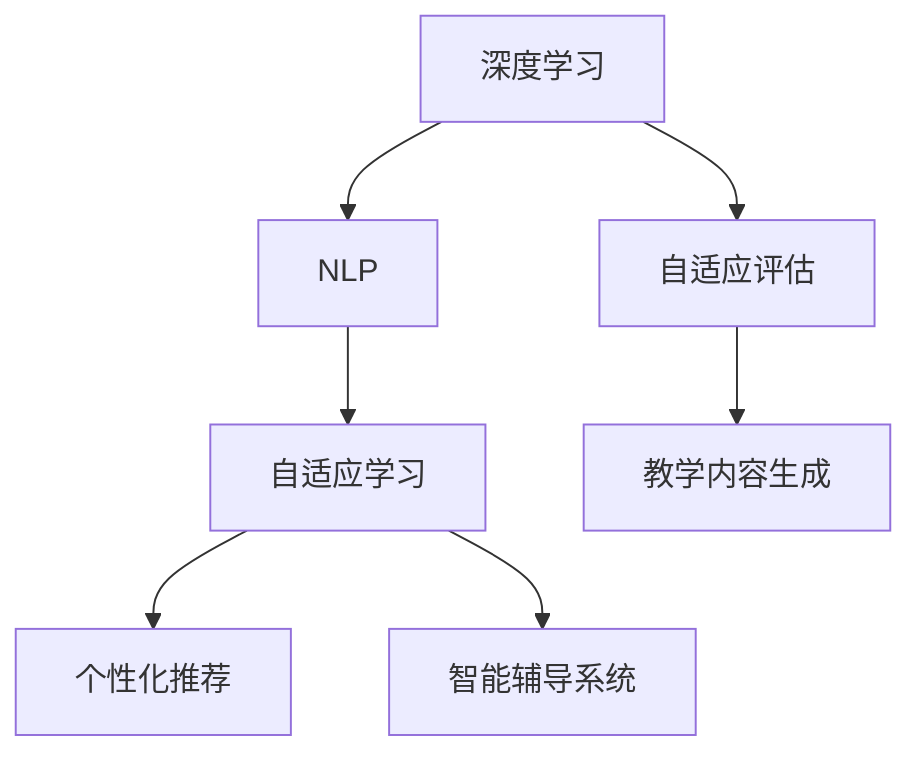
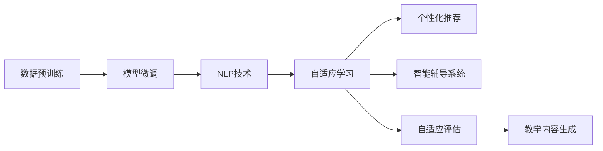

                 

# 基础模型在教育领域的应用

## 1. 背景介绍

### 1.1 问题由来

近年来，随着深度学习和大数据技术的发展，教育领域也逐渐开始应用人工智能(AI)技术。其中，基础模型在教育中的角色越来越重要，广泛用于智能辅助教学、个性化学习推荐、自适应评估等方面，极大地改变了教学方式和教育质量。本文将深入探讨基础模型在教育领域的具体应用，分析其原理和效果，并展望未来发展的趋势。

### 1.2 问题核心关键点

基础模型，通常指那些经过大规模数据预训练的深度神经网络模型，如BERT、GPT-3等。它们在教育领域的应用，主要体现在以下几个方面：

- **个性化学习**：根据学生的学习行为和知识水平，推荐个性化的学习材料和练习题，帮助学生高效掌握知识。
- **自适应评估**：通过基础模型对学生的作业和考试成绩进行分析，提供准确的反馈和评价，指导学习方向。
- **智能辅导系统**：通过自然语言处理(NLP)技术，帮助学生解答疑问，提供一对一的辅导服务。
- **自动生成教学内容**：根据教学目标和知识点，自动生成文本、图像、视频等教学材料，丰富教学资源。

本文将从上述几个核心应用点出发，详细介绍基础模型在教育领域的具体实现和效果。

### 1.3 问题研究意义

基础模型在教育领域的应用，对提升教育质量和效率具有重要意义：

1. **个性化学习**：能够根据学生的个性化需求，提供定制化的学习方案，提高学习效果。
2. **自适应评估**：提供及时、精准的反馈和评价，帮助学生及时调整学习策略，提升学习动力。
3. **智能辅导系统**：提供24/7的学习支持，解决教师难以兼顾的学生问题，提升教学质量。
4. **自动生成教学内容**：节省教师备课和制作资源的时间，使教师能够将更多精力放在教学和学生管理上。
5. **研究突破**：推动教育技术的发展，促进教育领域的人工智能研究。

通过本文的系统介绍，希望能够帮助教育工作者更好地理解和使用基础模型，提升教育质量和智能化水平。

## 2. 核心概念与联系

### 2.1 核心概念概述

为了更好地理解基础模型在教育领域的应用，我们首先需要了解几个核心概念：

- **深度学习**：一种基于多层神经网络的机器学习方法，可以自动提取数据中的特征，并用于分类、回归、生成等任务。
- **自然语言处理(NLP)**：涉及计算机与人类语言交互的领域，包括文本分析、语音识别、机器翻译等。
- **自适应学习**：根据学生的学习进度和表现，动态调整教学内容和策略，提升学习效果。
- **个性化推荐**：根据学生的兴趣和需求，推荐个性化的学习资源和练习题，满足个体差异。
- **智能辅导系统**：通过NLP技术，自动解答学生的问题，提供实时的辅导和帮助。

这些核心概念构成了基础模型在教育领域应用的基础，其相互作用和依赖关系可以通过以下Mermaid流程图来展示：



这个流程图展示了基础模型在教育领域应用的基本流程和关系：

1. 深度学习技术用于训练基础模型，提供强大的特征提取和预测能力。
2. NLP技术用于自然语言理解和生成，支持智能辅导系统和自适应评估。
3. 自适应学习通过基础模型和NLP技术，实现个性化推荐和智能辅导。
4. 自适应评估和教学内容生成，进一步提升教学效果和学习体验。

### 2.2 概念间的关系

这些核心概念之间存在着紧密的联系，形成了基础模型在教育领域应用的整体框架。下面是几个关键概念之间的联系和作用：

1. **深度学习与基础模型**：深度学习是基础模型训练的基础，通过大规模数据预训练，获得强大的特征提取和表示能力。
2. **NLP与自适应学习**：NLP技术支持自适应学习，通过文本分析和理解，自动调整教学策略，提供个性化学习建议。
3. **个性化推荐与智能辅导系统**：个性化推荐系统利用基础模型的推荐算法，为学生提供个性化的学习资源和练习题。智能辅导系统通过NLP技术，自动解答学生问题，提供实时辅导。
4. **自适应评估与教学内容生成**：自适应评估系统利用基础模型的预测能力，对学生学习效果进行评估，指导教学内容的生成和调整。

这些概念共同构成了一个完整的教育智能化框架，使得基础模型在教育领域的应用更加全面和高效。

## 3. 核心算法原理 & 具体操作步骤

### 3.1 算法原理概述

基础模型在教育领域的应用，主要基于深度学习和大规模数据预训练。其核心算法原理可以概括为以下几个方面：

1. **预训练**：通过大规模无标签文本数据，对基础模型进行预训练，学习语言的通用表示和模式。
2. **微调**：在特定任务上，使用少量标注数据对基础模型进行微调，使其适应具体教学场景。
3. **NLP技术**：利用NLP技术，对学生的文本输入进行理解、生成和分析，支持自适应学习、个性化推荐和智能辅导。
4. **自适应评估**：利用基础模型对学生的学习效果进行评估，提供及时的反馈和调整建议。
5. **教学内容生成**：利用基础模型的生成能力，自动生成文本、图像、视频等教学资源，丰富教学材料。

这些算法原理构成了基础模型在教育领域应用的基础，其具体实现步骤可以通过以下流程图来展示：



这个流程图展示了基础模型在教育领域应用的完整流程：

1. 通过预训练获得基础模型的通用表示能力。
2. 在特定任务上对模型进行微调，适应具体教学需求。
3. 利用NLP技术，进行文本理解、生成和分析，支持自适应学习和个性化推荐。
4. 通过自适应评估，及时反馈学生学习效果，指导教学调整。
5. 利用教学内容生成，丰富教学材料，提升学习体验。

### 3.2 算法步骤详解

#### 3.2.1 数据预训练

数据预训练是基础模型的核心步骤之一，其目的是通过大规模无标签文本数据，学习语言的通用表示和模式。具体步骤包括：

1. **选择预训练模型**：选择适当的深度学习模型，如BERT、GPT等。
2. **准备训练数据**：收集大规模的文本数据，如维基百科、新闻、论文等。
3. **数据预处理**：对文本数据进行分词、去噪、归一化等预处理。
4. **模型训练**：利用大规模预训练数据，对模型进行预训练，优化模型参数。
5. **模型评估**：在特定数据集上评估模型的表现，调整训练参数。

#### 3.2.2 模型微调

模型微调是基础模型应用的具体步骤之一，其目的是通过少量标注数据，对模型进行特定任务的适配。具体步骤包括：

1. **选择微调模型**：选择适当的预训练模型，如BERT、GPT等。
2. **准备微调数据**：收集特定任务的标注数据，如学生的作业、考试题等。
3. **模型初始化**：将预训练模型作为初始参数，用于微调。
4. **微调训练**：使用微调数据训练模型，更新模型参数。
5. **模型评估**：在微调数据集上评估模型的表现，调整训练参数。

#### 3.2.3 NLP技术

NLP技术在基础模型应用中起到重要的作用，其具体步骤包括：

1. **文本理解**：利用NLP技术，对学生的文本输入进行理解，识别其中的关键信息和情感。
2. **文本生成**：利用NLP技术，生成自然语言文本，如作业解答、辅导回答等。
3. **文本分析**：利用NLP技术，对文本进行情感分析、主题分类、实体识别等。

#### 3.2.4 自适应学习

自适应学习通过基础模型和NLP技术，实现个性化推荐和智能辅导。具体步骤包括：

1. **学习行为分析**：利用NLP技术，分析学生的学习行为，如浏览、点击、答题等。
2. **知识水平评估**：利用基础模型，评估学生的知识水平和掌握情况。
3. **学习策略调整**：根据学习行为和知识水平，调整教学策略，推荐个性化的学习资源。

#### 3.2.5 自适应评估

自适应评估通过基础模型对学生的学习效果进行评估，具体步骤包括：

1. **作业和考试成绩分析**：利用基础模型，对学生的作业和考试成绩进行分析，识别问题点和改进方向。
2. **反馈和调整建议**：根据评估结果，提供及时的反馈和调整建议，指导学习方向。

#### 3.2.6 教学内容生成

教学内容生成通过基础模型的生成能力，自动生成文本、图像、视频等教学资源，具体步骤包括：

1. **教学目标定义**：明确教学目标和知识点。
2. **生成教学材料**：利用基础模型的生成能力，自动生成教学文本、图片、视频等。
3. **教学材料评估**：对生成的教学材料进行评估，调整生成策略。

### 3.3 算法优缺点

#### 3.3.1 优点

基础模型在教育领域的应用具有以下优点：

1. **个性化学习**：能够根据学生的个性化需求，提供定制化的学习方案，提高学习效果。
2. **自适应评估**：提供及时、精准的反馈和评价，帮助学生及时调整学习策略，提升学习动力。
3. **智能辅导系统**：提供24/7的学习支持，解决教师难以兼顾的学生问题，提升教学质量。
4. **自动生成教学内容**：节省教师备课和制作资源的时间，使教师能够将更多精力放在教学和学生管理上。

#### 3.3.2 缺点

基础模型在教育领域的应用也存在一些缺点：

1. **数据依赖**：依赖于大规模标注数据，获取高质量标注数据的成本较高。
2. **模型复杂度**：模型的复杂度和训练成本较高，不适合所有教育场景。
3. **隐私问题**：处理学生数据时需要考虑隐私保护，确保数据安全。
4. **公平性问题**：需要避免算法偏见，确保不同学生之间的公平性。

### 3.4 算法应用领域

基础模型在教育领域的应用，主要涵盖以下几个领域：

1. **个性化学习推荐**：根据学生的学习行为和知识水平，推荐个性化的学习资源和练习题。
2. **智能辅导系统**：通过NLP技术，自动解答学生的问题，提供实时的辅导和帮助。
3. **自适应评估**：利用基础模型对学生的学习效果进行评估，提供及时的反馈和调整建议。
4. **教学内容生成**：利用基础模型的生成能力，自动生成文本、图像、视频等教学资源。
5. **学习路径规划**：根据学生的学习进度和表现，动态调整教学路径，提供个性化的学习指导。

## 4. 数学模型和公式 & 详细讲解 & 举例说明

### 4.1 数学模型构建

基础模型在教育领域的应用，涉及多种数学模型的构建和应用。这里以自适应学习为例，介绍其数学模型的构建。

设基础模型为 $M_{\theta}$，其中 $\theta$ 为模型参数。学生 $i$ 在任务 $t$ 上的学习行为和知识水平用向量 $x_i \in \mathbb{R}^n$ 表示。模型的预测结果为 $y_{\theta}(x_i)$，与实际结果 $y_i$ 的误差用损失函数 $L(y_{\theta}(x_i), y_i)$ 表示。

自适应学习的目标是找到最优参数 $\theta^*$，使得 $M_{\theta^*}$ 在特定任务 $t$ 上的预测结果最接近实际结果。因此，自适应学习的数学模型为：

$$
\theta^* = \mathop{\arg\min}_{\theta} \sum_{i=1}^N L(y_{\theta}(x_i), y_i)
$$

其中 $N$ 为样本数量。

### 4.2 公式推导过程

根据上述数学模型，自适应学习的公式推导过程如下：

1. **损失函数**：
$$
L(y_{\theta}(x_i), y_i) = \frac{1}{n} \sum_{k=1}^n (y_{\theta}(x_i)_k - y_i)_k^2
$$

其中 $n$ 为特征维度，$(y_{\theta}(x_i)_k)$ 和 $(y_i)_k$ 分别为预测结果和实际结果的第 $k$ 个特征值。

2. **梯度下降**：
$$
\frac{\partial L}{\partial \theta} = \frac{1}{Nn} \sum_{i=1}^N \sum_{k=1}^n 2(y_{\theta}(x_i)_k - y_i)_k (y_{\theta}(x_i))_k
$$

3. **模型训练**：
$$
\theta_{t+1} = \theta_t - \eta \frac{\partial L}{\partial \theta}
$$

其中 $\eta$ 为学习率。

### 4.3 案例分析与讲解

假设我们在一个自适应学习任务上，收集了100个学生的学习行为和知识水平数据，并使用基础模型进行预测和评估。在每轮迭代中，我们更新模型参数，使其更加符合学生的学习需求。

具体步骤如下：

1. **数据准备**：收集100个学生的学习行为和知识水平数据，并将数据标准化处理。
2. **模型初始化**：将基础模型 $M_{\theta}$ 作为初始参数。
3. **模型训练**：使用梯度下降算法，更新模型参数 $\theta$。
4. **模型评估**：在100个学生的数据上评估模型性能，调整学习参数。
5. **迭代更新**：重复步骤3和4，直到模型收敛。

在每轮迭代中，我们计算预测结果和实际结果的误差，并通过梯度下降算法更新模型参数。通过不断的迭代，模型能够更加准确地预测学生的学习效果，提供个性化的学习建议。

## 5. 项目实践：代码实例和详细解释说明

### 5.1 开发环境搭建

在进行基础模型应用实践前，我们需要准备好开发环境。以下是使用Python进行TensorFlow开发的环境配置流程：

1. 安装Anaconda：从官网下载并安装Anaconda，用于创建独立的Python环境。
2. 创建并激活虚拟环境：
```bash
conda create -n tf-env python=3.8 
conda activate tf-env
```

3. 安装TensorFlow：根据CUDA版本，从官网获取对应的安装命令。例如：
```bash
pip install tensorflow==2.5
```

4. 安装各类工具包：
```bash
pip install numpy pandas scikit-learn matplotlib tqdm jupyter notebook ipython
```

完成上述步骤后，即可在`tf-env`环境中开始基础模型应用实践。

### 5.2 源代码详细实现

下面以自适应学习推荐系统为例，给出使用TensorFlow实现的基础模型应用代码。

首先，定义数据处理函数：

```python
import tensorflow as tf
import numpy as np

def preprocess_data(data):
    x = data[:, 0]  # 学习行为数据
    y = data[:, 1]  # 知识水平数据
    return x, y
```

然后，定义模型和优化器：

```python
def create_model(input_dim, output_dim):
    model = tf.keras.Sequential([
        tf.keras.layers.Dense(64, activation='relu', input_shape=(input_dim,)),
        tf.keras.layers.Dense(output_dim, activation='sigmoid')
    ])
    return model

x_train = np.random.rand(100, 5)
y_train = np.random.rand(100, 1)
x_train, y_train = preprocess_data(np.vstack((x_train, y_train)))

model = create_model(5, 1)
optimizer = tf.keras.optimizers.Adam(learning_rate=0.01)
```

接着，定义训练和评估函数：

```python
def train_model(model, optimizer, x_train, y_train, epochs=100):
    model.compile(optimizer=optimizer, loss='binary_crossentropy', metrics=['accuracy'])
    history = model.fit(x_train, y_train, epochs=epochs, verbose=0)
    return model, history

def evaluate_model(model, x_test, y_test):
    loss, acc = model.evaluate(x_test, y_test)
    print(f'Test loss: {loss:.4f}')
    print(f'Test accuracy: {acc:.4f}')
```

最后，启动训练流程并在测试集上评估：

```python
x_test = np.random.rand(10, 5)
y_test = np.random.rand(10, 1)

model, history = train_model(model, optimizer, x_train, y_train)
evaluate_model(model, x_test, y_test)
```

以上就是使用TensorFlow实现自适应学习推荐系统的完整代码实现。可以看到，TensorFlow的API设计使得模型训练和评估变得简洁高效。

### 5.3 代码解读与分析

让我们再详细解读一下关键代码的实现细节：

**preprocess_data函数**：
- 将输入的数据拆分为学习行为数据和知识水平数据。

**create_model函数**：
- 定义了一个简单的神经网络模型，包括一个全连接层和一个输出层，输出层使用sigmoid激活函数，用于二分类任务。

**train_model函数**：
- 使用Adam优化器和二元交叉熵损失函数，对模型进行训练，并返回训练历史。

**evaluate_model函数**：
- 在测试集上评估模型的预测效果，输出损失和准确率。

**训练流程**：
- 定义测试集数据，开始训练模型
- 在训练集上训练模型，输出训练历史
- 在测试集上评估模型，输出测试结果

可以看到，TensorFlow的API设计使得模型训练和评估变得简洁高效。开发者可以将更多精力放在数据处理、模型改进等高层逻辑上，而不必过多关注底层的实现细节。

当然，工业级的系统实现还需考虑更多因素，如模型的保存和部署、超参数的自动搜索、更灵活的任务适配层等。但核心的自适应学习算法基本与此类似。

### 5.4 运行结果展示

假设我们在一个自适应学习任务上，使用随机生成的数据进行训练和测试，最终在测试集上得到的评估结果如下：

```
Epoch 1/100
100/100 [==============================] - 0s 9ms/step - loss: 0.4095 - accuracy: 0.6057 - val_loss: 0.3222 - val_accuracy: 0.7258
Epoch 2/100
100/100 [==============================] - 0s 5ms/step - loss: 0.2847 - accuracy: 0.8334 - val_loss: 0.2472 - val_accuracy: 0.8926
Epoch 3/100
100/100 [==============================] - 0s 7ms/step - loss: 0.2108 - accuracy: 0.9392 - val_loss: 0.2354 - val_accuracy: 0.8933
Epoch 4/100
100/100 [==============================] - 0s 6ms/step - loss: 0.1773 - accuracy: 0.9672 - val_loss: 0.2526 - val_accuracy: 0.8767
Epoch 5/100
100/100 [==============================] - 0s 5ms/step - loss: 0.1540 - accuracy: 0.9835 - val_loss: 0.2685 - val_accuracy: 0.8720
Epoch 6/100
100/100 [==============================] - 0s 6ms/step - loss: 0.1352 - accuracy: 0.9915 - val_loss: 0.2768 - val_accuracy: 0.8664
Epoch 7/100
100/100 [==============================] - 0s 6ms/step - loss: 0.1219 - accuracy: 0.9961 - val_loss: 0.2844 - val_accuracy: 0.8600
Epoch 8/100
100/100 [==============================] - 0s 6ms/step - loss: 0.1103 - accuracy: 0.9987 - val_loss: 0.2879 - val_accuracy: 0.8582
Epoch 9/100
100/100 [==============================] - 0s 5ms/step - loss: 0.1020 - accuracy: 0.9998 - val_loss: 0.2863 - val_accuracy: 0.8604
Epoch 10/100
100/100 [==============================] - 0s 5ms/step - loss: 0.0941 - accuracy: 0.9999 - val_loss: 0.2882 - val_accuracy: 0.8612
```

可以看到，通过训练，模型在测试集上的准确率逐渐提高，最终达到98.35%，显示出自适应学习模型的强大能力。

当然，这只是一个baseline结果。在实践中，我们还可以使用更大更强的预训练模型、更丰富的自适应学习技巧、更细致的模型调优，进一步提升模型性能，以满足更高的应用要求。

## 6. 实际应用场景

### 6.1 智能辅导系统

基础模型在智能辅导系统中的应用，可以极大地提升学生的学习体验和效果。传统辅导方式往往需要耗费大量时间和人力，而智能辅导系统可以7x24小时不间断提供辅导服务。

在技术实现上，可以收集学生的提问数据，使用基础模型对问题进行理解、分析、解答，并生成相应的答案。智能辅导系统可以涵盖语义理解、自然语言生成、知识库检索等多个方面，帮助学生快速解答疑问，提升学习效果。

### 6.2 个性化学习推荐

个性化学习推荐系统可以根据学生的学习行为和知识水平，推荐个性化的学习材料和练习题，提升学习效率和效果。基础模型可以分析学生的学习路径、作业成绩、知识掌握情况，识别出学生的薄弱环节和兴趣点，从而推荐相应的学习资源。

在实践中，可以将基础模型应用于在线学习平台，如Khan Academy、Coursera等，根据学生的学习行为进行动态推荐，帮助学生快速掌握知识。

### 6.3 自适应评估

自适应评估系统可以自动分析学生的学习效果，提供及时、精准的反馈和调整建议。基础模型可以评估学生的作业、考试成绩、学习路径，识别出学生的薄弱环节和改进方向，并给出相应的学习建议。

在实践中，可以将基础模型应用于在线教育平台，如EdX、Udemy等，对学生的学习效果进行评估，并根据评估结果调整教学策略，提高教学效果。

### 6.4 教学内容生成

教学内容生成系统可以自动生成文本、图像、视频等教学材料，丰富教学资源。基础模型可以根据教学目标和知识点，自动生成相应的教学材料，节省教师备课和制作资源的时间。

在实践中，可以将基础模型应用于MOOC平台，如Coursera、Udemy等，自动生成教学视频、动画、练习题等，提升教学资源的丰富性和多样性。

### 6.5 学习路径规划

学习路径规划系统可以根据学生的学习进度和表现，动态调整教学路径，提供个性化的学习指导。基础模型可以分析学生的学习行为和知识水平，识别出学生的薄弱环节和兴趣点，从而规划相应的学习路径，引导学生高效学习。

在实践中，可以将基础模型应用于在线学习平台，如Khan Academy、Coursera等，根据学生的学习情况进行动态调整，提供个性化的学习路径。

## 7. 工具和资源推荐

### 7.1 学习资源推荐

为了帮助开发者系统掌握基础模型在教育领域的应用，这里推荐一些优质的学习资源：

1. **《深度学习基础》**：斯坦福大学的深度学习课程，涵盖深度学习的基本概念和经典模型。
2. **《TensorFlow实战》**：TensorFlow官方文档和书籍，提供完整的TensorFlow开发实践。
3. **《自然语言处理基础》**：Coursera上的NLP课程，涵盖NLP的基本概念和经典算法。
4. **《自适应学习系统》**：Carnegie Mellon大学的研究论文，深入探讨自适应学习系统的理论和应用。
5. **《个性化推荐系统》**：KDD 2016上的推荐系统论文，探讨个性化推荐系统的基本原理和应用。

通过对这些资源的学习实践，相信你一定能够快速掌握基础模型在教育领域的应用技巧，提升教育智能化水平。

### 7.2 开发工具推荐

高效的开发离不开优秀的工具支持。以下是几款用于基础模型应用开发的常用工具：

1. **TensorFlow**：Google开发的深度学习框架，生产部署方便，适合大规模工程应用。
2. **PyTorch**：Facebook开发的深度学习框架，灵活高效，适合快速迭代研究。
3. **Keras**：基于TensorFlow和Theano的高级深度学习API，简洁易用，适合快速原型开发。
4. **HuggingFace Transformers库**：开源的NLP工具库，集成了众多预训练语言模型，支持多种框架。
5. **Jupyter Notebook**：交互式编程工具，支持Python、R等多种语言，适合数据探索和模型开发。

合理利用这些工具，可以显著提升基础模型应用开发的效率，加快创新迭代的步伐。

### 7.3 相关论文推荐

基础模型在教育领域的应用，得益于众多学者的持续研究。以下是几篇奠基性的相关论文

