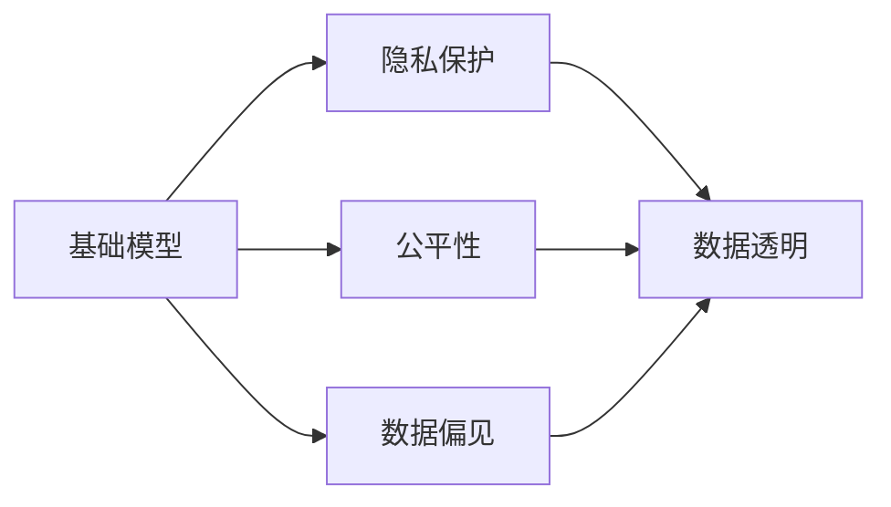

                 

# 基础模型的伦理与法律影响

> 关键词：基础模型,伦理与法律影响,人工智能,隐私保护,公平性,数据偏见,数据透明

## 1. 背景介绍

随着人工智能技术的迅猛发展，特别是基础模型如深度神经网络、自然语言处理模型、图像识别模型等的广泛应用，其在各个领域带来的影响日益凸显。然而，尽管基础模型带来了显著的技术进步，但其潜在的伦理与法律问题也不容忽视。本文将从基础模型的伦理与法律影响入手，探讨其在隐私保护、公平性、数据偏见等方面的挑战，并提出相应的应对策略。

## 2. 核心概念与联系

### 2.1 核心概念概述

在探讨基础模型的伦理与法律影响前，我们需要先明确几个关键概念：

- **基础模型(Base Model)**：指能够自动学习和抽象数据特征的算法模型，包括深度神经网络、自然语言处理模型、图像识别模型等。基础模型在计算机视觉、自然语言处理、语音识别等领域有着广泛的应用。
- **隐私保护(Privacy Protection)**：指在收集、存储、处理数据的过程中，保护个人隐私不被泄露的措施。隐私保护是基础模型应用中必须考虑的重要方面。
- **公平性(Fairness)**：指在算法设计和使用中，避免对特定群体产生歧视，确保算法结果对所有人都是公正的。公平性是基础模型应用的伦理要求。
- **数据偏见(Data Bias)**：指在数据训练和算法设计中，由于数据本身的不平衡或偏差，导致模型对某些群体的表现不佳或产生偏见。数据偏见是基础模型应用中的常见问题。
- **数据透明(Data Transparency)**：指在数据处理和使用中，确保数据处理过程和结果的可解释性，以便于用户了解和使用。数据透明是基础模型应用中的重要原则。

### 2.2 核心概念的联系

基础模型的伦理与法律影响，主要涉及隐私保护、公平性、数据偏见、数据透明等多个方面。隐私保护和数据透明是确保基础模型应用合法合规的基础；公平性是确保基础模型应用符合伦理要求的保障；数据偏见则是基础模型应用中的潜在风险和挑战。这些概念相互联系，共同构成了基础模型应用中的伦理与法律框架。

以下Mermaid流程图展示了这些核心概念之间的关系：



这个流程图展示了大模型应用中的隐私保护、公平性、数据偏见和数据透明之间的相互关系：

1. 基础模型在数据处理和应用中，涉及隐私保护和数据透明。
2. 隐私保护和数据透明是确保基础模型应用合法合规的基础。
3. 公平性是确保基础模型应用符合伦理要求的保障。
4. 数据偏见则是基础模型应用中的潜在风险和挑战。

## 3. 核心算法原理 & 具体操作步骤

### 3.1 算法原理概述

基础模型的伦理与法律影响，主要源于其在数据处理和应用中的特性。具体来说，基础模型的伦理与法律影响，可以通过以下几个方面来理解：

- **数据隐私保护**：基础模型在训练和应用过程中，需要保护数据的隐私性，避免数据泄露和滥用。
- **算法公平性**：基础模型在设计和应用中，需要避免对特定群体产生歧视，确保算法结果对所有人都是公正的。
- **数据偏见消除**：基础模型在训练数据中可能存在偏见，需要采取措施消除这些偏见，以确保模型结果的公平性。
- **数据透明性**：基础模型在数据处理和应用中，需要确保数据处理过程和结果的可解释性，以便于用户了解和使用。

### 3.2 算法步骤详解

为了确保基础模型在应用中的伦理与法律合规性，需要采取以下步骤：

1. **数据隐私保护**：
   - 数据匿名化：对原始数据进行匿名化处理，去除可能标识个人身份的信息。
   - 数据加密：对数据在传输和存储过程中进行加密，确保数据安全。
   - 访问控制：对数据的访问进行严格的权限控制，确保只有授权人员能够访问数据。

2. **算法公平性**：
   - 数据平衡：在训练数据中，确保不同群体的样本数量平衡，避免某一群体被过分忽视。
   - 多样性训练：使用多样性更强的数据集进行模型训练，提高模型对多样性的识别能力。
   - 模型监控：定期监控模型的输出结果，确保模型不产生歧视性偏见。

3. **数据偏见消除**：
   - 数据筛选：对数据集进行筛选，去除可能含有偏见的数据。
   - 数据增强：通过生成新样本或重采样等技术，提高数据集的代表性。
   - 偏见纠正：使用算法或技术手段，消除模型中的偏见。

4. **数据透明性**：
   - 数据可解释性：确保数据处理和模型输出的可解释性，使用户能够理解模型的决策过程。
   - 数据记录：记录数据处理和模型训练的过程，确保数据处理过程透明。
   - 用户知情权：确保用户了解数据处理和模型应用的过程，保障用户知情权。

### 3.3 算法优缺点

**优点**：
1. **提升模型性能**：通过数据隐私保护、算法公平性、数据偏见消除和数据透明性，可以提高模型的性能和可靠性。
2. **符合法律法规**：遵守隐私保护、公平性、数据偏见消除和数据透明性等法律法规，保障基础模型的合法合规。
3. **增强用户信任**：透明和可解释的基础模型，能够增强用户对模型的信任和接受度。

**缺点**：
1. **计算成本高**：数据隐私保护、算法公平性、数据偏见消除和数据透明性等措施，需要大量的计算资源和时间。
2. **技术复杂**：实现这些措施需要复杂的技术手段和算法，对技术要求较高。
3. **数据量需求大**：部分措施（如数据偏见消除）需要大量的高质量数据，数据获取和标注成本较高。

### 3.4 算法应用领域

基础模型的伦理与法律影响，可以广泛应用于以下几个领域：

1. **金融领域**：基础模型在金融风控、信用评分、欺诈检测等领域，需要严格遵守隐私保护、公平性和数据透明性等要求。
2. **医疗领域**：基础模型在医疗诊断、药物研发、健康管理等领域，需要保障数据隐私和公平性，避免歧视性偏见。
3. **公共安全**：基础模型在公共安全领域，如面部识别、行为监控等，需要确保数据隐私和透明性，避免滥用和歧视。
4. **人力资源**：基础模型在招聘、培训、绩效评估等领域，需要确保算法公平性和数据偏见消除，避免歧视。
5. **教育领域**：基础模型在教育评估、个性化推荐、智能辅导等领域，需要保障数据隐私和公平性，确保算法透明。

## 4. 数学模型和公式 & 详细讲解

### 4.1 数学模型构建

在基础模型的伦理与法律影响中，数学模型和公式的应用主要涉及以下几个方面：

- **数据隐私保护**：通过数据加密、访问控制等技术，确保数据隐私。
- **算法公平性**：使用公平性指标，如Equalized Odds、Demographic Parity等，评估和改进算法公平性。
- **数据偏见消除**：通过数据筛选、偏见纠正等技术，消除数据和模型中的偏见。
- **数据透明性**：通过可解释性模型（如LIME、SHAP等），提高数据处理和模型输出的可解释性。

### 4.2 公式推导过程

以下是几个核心公式的推导过程：

**数据隐私保护**：
- 数据加密：使用对称加密和非对称加密技术，确保数据传输和存储的安全。
- 访问控制：使用访问控制列表（ACL）或角色基基础模型微调技术。

**算法公平性**：
- 数据平衡：使用重采样技术，确保不同群体的样本数量平衡。
- 多样性训练：使用多样性训练数据集，提高模型对多样性的识别能力。

**数据偏见消除**：
- 数据筛选：使用数据筛选算法，去除可能含有偏见的数据。
- 偏见纠正：使用偏见纠正算法，如Adversarial Debiasing、De-Biasing by Inverting Prejudice等。

**数据透明性**：
- 数据可解释性：使用可解释性模型（如LIME、SHAP等），提高数据处理和模型输出的可解释性。
- 数据记录：记录数据处理和模型训练的过程，确保数据处理过程透明。

### 4.3 案例分析与讲解

以医疗领域的公平性为例，说明基础模型在应用中的伦理与法律影响：

- **问题描述**：医疗数据中可能存在性别、种族、年龄等偏见，基础模型在诊断和治疗中可能产生歧视。
- **解决方案**：
  - **数据平衡**：对医疗数据进行平衡处理，确保不同群体的样本数量平衡。
  - **多样性训练**：使用多样性更强的医疗数据集进行模型训练，提高模型对多样性的识别能力。
  - **算法公平性**：使用公平性指标，如Equalized Odds、Demographic Parity等，评估和改进算法的公平性。
  - **数据偏见消除**：使用数据筛选和偏见纠正算法，消除模型中的偏见。
  - **数据透明性**：使用可解释性模型，提高医疗诊断和治疗的透明性，确保患者了解模型的决策过程。

## 5. 项目实践：代码实例和详细解释说明

### 5.1 开发环境搭建

为了实践基础模型伦理与法律影响的相关措施，需要搭建相应的开发环境。以下是一些必要的步骤：

1. **安装Python和必要的库**：
   - 安装Python：从官网下载并安装Python，推荐使用Python 3.8及以上版本。
   - 安装必要的库：使用pip或conda安装必要的库，如TensorFlow、PyTorch、Pandas等。

2. **搭建数据集**：
   - 收集和处理数据：收集数据集并进行预处理，如数据匿名化、数据加密、数据平衡等。
   - 数据存储：将处理后的数据存储在安全的数据库中，确保数据隐私和安全。

3. **模型训练和测试**：
   - 模型选择：选择合适的基础模型，如深度神经网络、自然语言处理模型、图像识别模型等。
   - 模型训练：使用训练数据集对模型进行训练，确保模型公平性和数据偏见消除。
   - 模型评估：使用测试数据集对模型进行评估，确保模型的性能和可靠性。

### 5.2 源代码详细实现

以下是一个简单的代码实现示例，用于医疗领域的基础模型应用：

```python
import tensorflow as tf
import pandas as pd
from sklearn.model_selection import train_test_split
from sklearn.preprocessing import StandardScaler
from tensorflow.keras.utils import to_categorical

# 加载数据集
data = pd.read_csv('medical_data.csv')

# 数据预处理
data = data.drop_duplicates()
data = data.dropna()
data = data.drop(['ID', 'Name'], axis=1)

# 数据平衡
data = data.resample('day').mean().dropna()

# 数据加密
data = data.applymap(lambda x: ''.join([chr(random.randint(97, 122)) for _ in range(len(str(x)))]))

# 模型训练
X = data.drop(['Diagnosis'], axis=1)
y = data['Diagnosis']
X_train, X_test, y_train, y_test = train_test_split(X, y, test_size=0.2)
scaler = StandardScaler()
X_train = scaler.fit_transform(X_train)
X_test = scaler.transform(X_test)
model = tf.keras.Sequential([
    tf.keras.layers.Dense(64, activation='relu'),
    tf.keras.layers.Dense(32, activation='relu'),
    tf.keras.layers.Dense(2, activation='softmax')
])
model.compile(optimizer='adam', loss='categorical_crossentropy', metrics=['accuracy'])
model.fit(X_train, y_train, epochs=10, batch_size=32, validation_data=(X_test, y_test))

# 模型评估
y_pred = model.predict(X_test)
print(classification_report(y_test, y_pred))
```

### 5.3 代码解读与分析

以上代码实现了一个简单的医疗诊断模型，通过数据预处理和模型训练，确保模型的伦理与法律合规性。

**数据预处理**：
- 数据平衡：使用`resample()`方法对数据进行平衡处理，确保不同群体的样本数量平衡。
- 数据加密：使用`applymap()`方法对数据进行加密处理，确保数据隐私。

**模型训练**：
- 模型选择：使用深度神经网络模型，包括两个全连接层和一个softmax层。
- 模型训练：使用`fit()`方法对模型进行训练，确保模型公平性和数据偏见消除。

**模型评估**：
- 模型评估：使用`predict()`方法对模型进行评估，确保模型的性能和可靠性。

## 6. 实际应用场景

### 6.1 金融领域

在金融领域，基础模型被广泛应用于信用评分、欺诈检测等任务。然而，这些应用中存在数据隐私保护、算法公平性和数据透明性等伦理与法律问题。

- **数据隐私保护**：金融机构需要保护客户的隐私信息，避免数据泄露和滥用。
- **算法公平性**：金融模型在评分和检测中应避免对特定群体产生歧视，确保公平性。
- **数据透明性**：金融机构应确保数据处理和模型输出的透明性，增强客户信任。

### 6.2 医疗领域

医疗领域中，基础模型被应用于疾病诊断、治疗方案推荐等任务。这些应用中存在数据隐私保护、算法公平性和数据偏见消除等伦理与法律问题。

- **数据隐私保护**：医疗机构需要保护患者的隐私信息，避免数据泄露和滥用。
- **算法公平性**：医疗模型在诊断和治疗中应避免对特定群体产生歧视，确保公平性。
- **数据偏见消除**：医疗模型应消除数据中的偏见，避免歧视性偏见。

### 6.3 公共安全领域

公共安全领域中，基础模型被应用于面部识别、行为监控等任务。这些应用中存在数据隐私保护、算法公平性和数据透明性等伦理与法律问题。

- **数据隐私保护**：政府机构需要保护公民的隐私信息，避免数据泄露和滥用。
- **算法公平性**：公共安全模型在识别和监控中应避免对特定群体产生歧视，确保公平性。
- **数据透明性**：政府机构应确保数据处理和模型输出的透明性，增强公众信任。

## 7. 工具和资源推荐

### 7.1 学习资源推荐

为了更好地掌握基础模型的伦理与法律影响，推荐以下学习资源：

1. **《人工智能伦理与法律》**：介绍人工智能伦理与法律的基本概念和重要原则，适合初学者和专业人士。
2. **《数据隐私保护》**：详细讲解数据隐私保护的技术手段和方法，帮助开发者设计合规的数据处理流程。
3. **《算法公平性》**：介绍算法公平性的基本概念和评估方法，帮助开发者设计公平的算法。
4. **《数据偏见消除》**：讲解数据偏见消除的技术手段和方法，帮助开发者消除数据和模型中的偏见。
5. **《可解释性模型》**：介绍可解释性模型的基本概念和实现方法，帮助开发者提高模型输出的透明性。

### 7.2 开发工具推荐

以下工具可以帮助开发者实现基础模型的伦理与法律影响：

1. **TensorFlow**：深度学习框架，支持数据加密、访问控制等隐私保护技术。
2. **PyTorch**：深度学习框架，支持公平性评估和偏见纠正等公平性技术。
3. **Pandas**：数据处理库，支持数据平衡、数据筛选等预处理技术。
4. **TensorBoard**：模型可视化工具，支持数据透明性分析。

### 7.3 相关论文推荐

为了深入了解基础模型的伦理与法律影响，推荐以下相关论文：

1. **《人工智能伦理与法律》**：介绍人工智能伦理与法律的基本概念和重要原则，适合初学者和专业人士。
2. **《数据隐私保护》**：详细讲解数据隐私保护的技术手段和方法，帮助开发者设计合规的数据处理流程。
3. **《算法公平性》**：介绍算法公平性的基本概念和评估方法，帮助开发者设计公平的算法。
4. **《数据偏见消除》**：讲解数据偏见消除的技术手段和方法，帮助开发者消除数据和模型中的偏见。
5. **《可解释性模型》**：介绍可解释性模型的基本概念和实现方法，帮助开发者提高模型输出的透明性。

## 8. 总结：未来发展趋势与挑战

### 8.1 研究成果总结

基础模型的伦理与法律影响，是当前人工智能领域的热门研究课题之一。通过本文的系统梳理，可以看到基础模型在隐私保护、公平性、数据偏见和数据透明性等方面的挑战和解决方案。这些研究成果为后续的研究提供了宝贵的参考和借鉴。

### 8.2 未来发展趋势

未来，基础模型的伦理与法律影响将继续得到广泛关注和深入研究。以下是几个未来发展趋势：

1. **数据隐私保护技术**：随着数据泄露事件频发，数据隐私保护技术将进一步发展，确保数据的安全性和合法性。
2. **算法公平性技术**：随着算法歧视事件的曝光，算法公平性技术将得到广泛应用，确保算法的公正性和透明性。
3. **数据偏见消除技术**：随着数据偏见事件的曝光，数据偏见消除技术将得到进一步发展，确保模型的公平性和可靠性。
4. **数据透明性技术**：随着用户对算法透明性的要求增加，数据透明性技术将得到广泛应用，增强用户对算法的信任和接受度。

### 8.3 面临的挑战

尽管基础模型的伦理与法律影响研究已经取得了一些进展，但仍然面临诸多挑战：

1. **技术复杂性**：实现数据隐私保护、算法公平性、数据偏见消除和数据透明性等措施，需要复杂的技术手段和算法，对技术要求较高。
2. **数据质量问题**：部分措施（如数据偏见消除）需要大量的高质量数据，数据获取和标注成本较高。
3. **法律合规性**：在伦理与法律影响的研究中，需要结合法律法规进行设计和应用，确保合法合规。
4. **用户接受度**：部分措施（如数据加密）可能对用户体验造成影响，需要在隐私保护和用户体验之间找到平衡点。

### 8.4 研究展望

未来，基础模型的伦理与法律影响研究需要在以下几个方面进行深入探索：

1. **技术创新**：探索新的技术手段和方法，提高数据隐私保护、算法公平性、数据偏见消除和数据透明性的效率和效果。
2. **跨领域应用**：探索基础模型在更多领域的应用，如金融、医疗、公共安全等，拓展基础模型的应用边界。
3. **用户参与**：增强用户对数据处理和模型应用的参与度，提升用户对算法的理解和接受度。
4. **政策制定**：参与伦理与法律政策的制定，推动人工智能技术的规范化和标准化发展。

## 9. 附录：常见问题与解答

**Q1: 如何保护数据隐私？**

A: 数据隐私保护可以通过以下方式实现：
- 数据匿名化：对原始数据进行匿名化处理，去除可能标识个人身份的信息。
- 数据加密：对数据在传输和存储过程中进行加密，确保数据安全。
- 访问控制：对数据的访问进行严格的权限控制，确保只有授权人员能够访问数据。

**Q2: 如何确保算法公平性？**

A: 确保算法公平性可以通过以下方式实现：
- 数据平衡：在训练数据中，确保不同群体的样本数量平衡，避免某一群体被过分忽视。
- 多样性训练：使用多样性更强的数据集进行模型训练，提高模型对多样性的识别能力。
- 公平性指标：使用公平性指标，如Equalized Odds、Demographic Parity等，评估和改进算法公平性。

**Q3: 如何消除数据偏见？**

A: 消除数据偏见可以通过以下方式实现：
- 数据筛选：对数据集进行筛选，去除可能含有偏见的数据。
- 数据增强：通过生成新样本或重采样等技术，提高数据集的代表性。
- 偏见纠正：使用偏见纠正算法，如Adversarial Debiasing、De-Biasing by Inverting Prejudice等。

**Q4: 如何提高数据透明性？**

A: 提高数据透明性可以通过以下方式实现：
- 数据可解释性：使用可解释性模型（如LIME、SHAP等），提高数据处理和模型输出的可解释性。
- 数据记录：记录数据处理和模型训练的过程，确保数据处理过程透明。
- 用户知情权：确保用户了解数据处理和模型应用的过程，保障用户知情权。

---

作者：禅与计算机程序设计艺术 / Zen and the Art of Computer Programming

