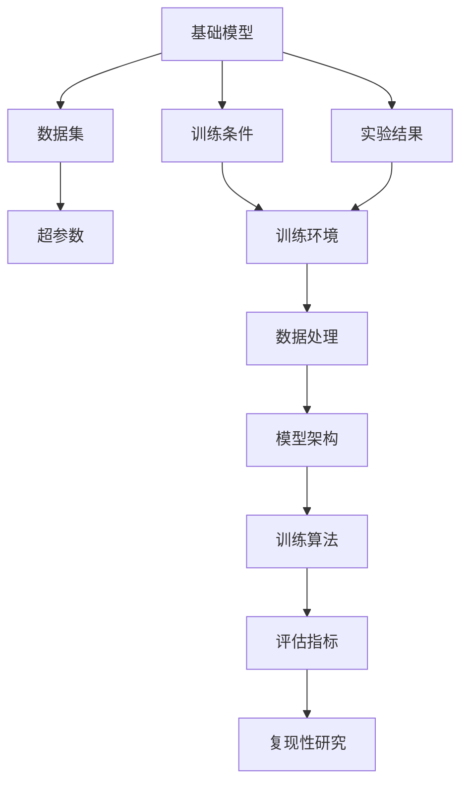
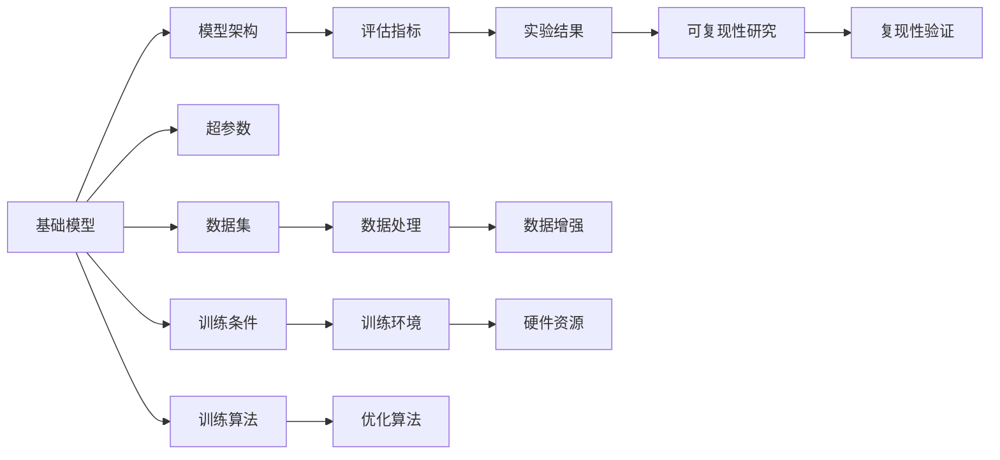
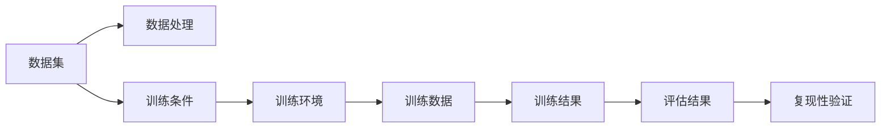
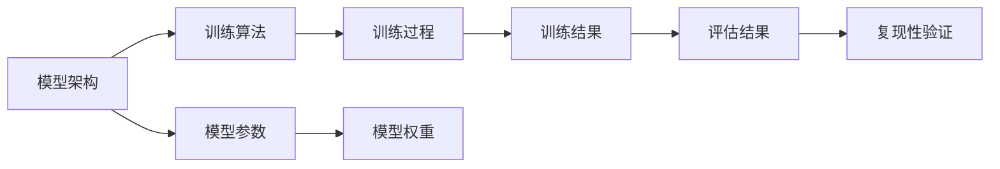
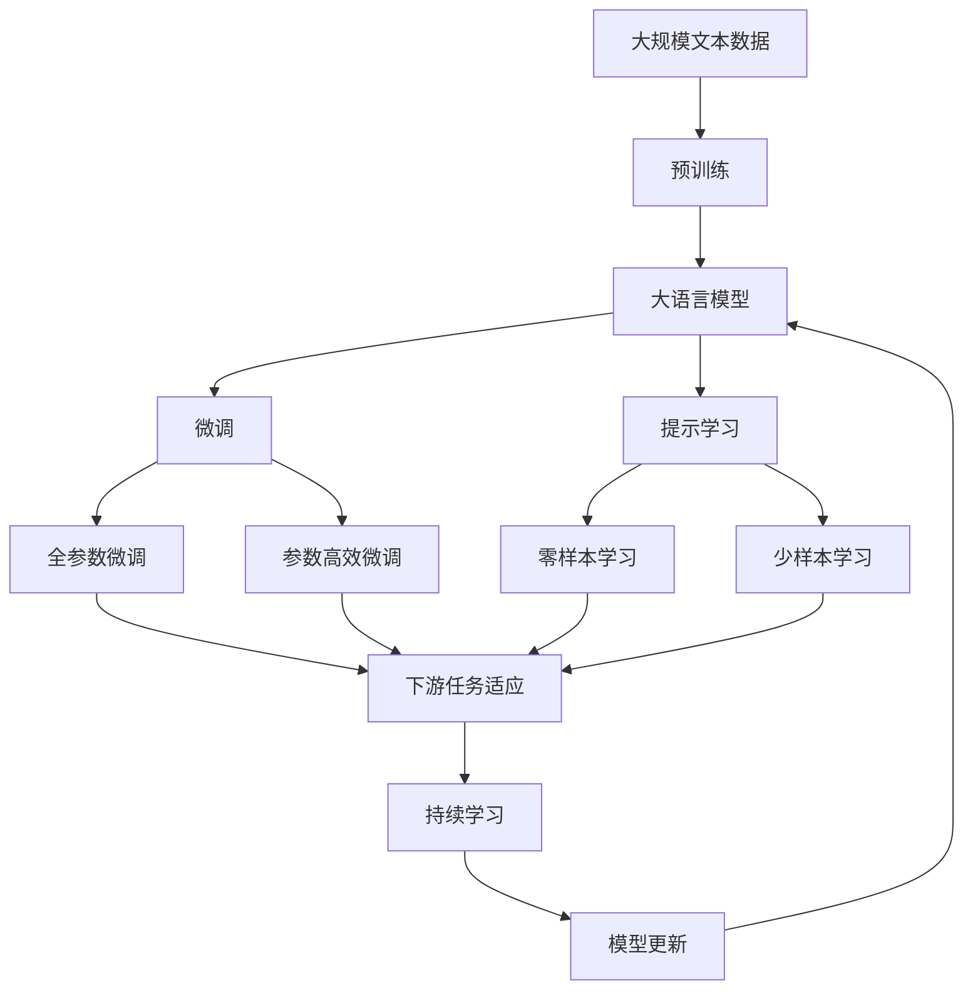
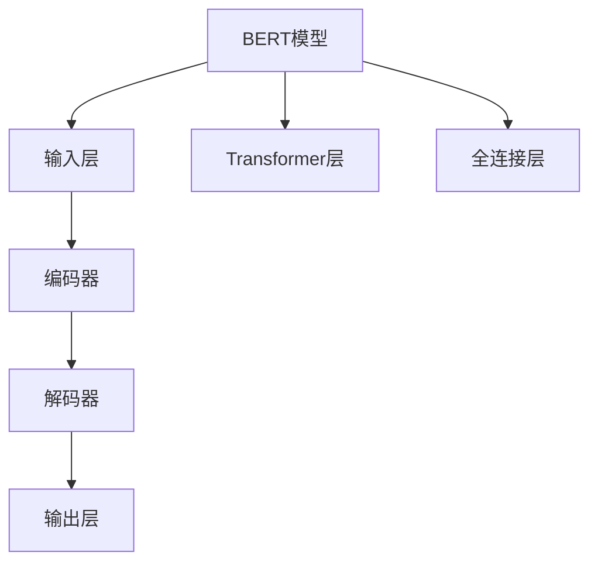

                 

# 基础模型的可复现性与开放科学

> 关键词：可复现性, 开放科学, 基础模型, 机器学习, 深度学习, 可复现性研究, 开源社区

## 1. 背景介绍

### 1.1 问题由来
在机器学习和深度学习领域，模型的可复现性一直是备受关注的重要话题。随着深度学习技术的发展，越来越多的预训练模型被用于各种实际应用中，但由于其复杂性，模型的复现性问题变得尤为突出。模型的可复现性不仅关系到研究结果的可靠性，还直接影响模型的部署和应用。

### 1.2 问题核心关键点
模型可复现性问题的核心在于确保不同研究者使用同一模型时能够得到一致的结果。主要体现在以下几个方面：

- 数据处理的一致性：确保不同研究者处理数据的方式一致，避免由于数据处理差异导致的模型偏差。
- 模型架构的一致性：确保模型架构的准确性和完整性，避免由于模型架构差异导致的性能偏差。
- 训练条件的一致性：确保不同研究者训练模型的硬件、软件、超参数等训练条件一致，避免由于训练条件差异导致的模型偏差。
- 实验结果的一致性：确保不同研究者使用同一模型时能够得到一致的实验结果，避免由于实验设计差异导致的模型偏差。

## 2. 核心概念与联系

### 2.1 核心概念概述

为更好地理解基础模型的可复现性，本节将介绍几个密切相关的核心概念：

- 可复现性（Reproducibility）：指同一模型在不同环境中执行时，能够得到相同或近似的结果。可复现性是保证研究结果可信度的基础。
- 开放科学（Open Science）：指科学研究的公开、透明和可重复性，包括数据的开放共享、实验设计的公开、代码的公开等。开放科学有助于提高研究质量，促进学术交流和合作。
- 基础模型（Base Model）：指被广泛使用和研究的基础深度学习模型，如BERT、GPT等。这些模型通常在大量数据上进行预训练，具备良好的通用性和泛化能力。
- 数据集（Dataset）：指用于训练、验证和测试模型的数据集，如IMDB电影评论、COCO图像分类等。数据集的选择和使用对模型的性能和可复现性有着重要影响。
- 超参数（Hyperparameter）：指模型训练过程中需要手动设置的参数，如学习率、批次大小、训练轮数等。超参数的选择和调优对模型性能和可复现性有显著影响。

这些核心概念之间的逻辑关系可以通过以下Mermaid流程图来展示：



这个流程图展示了基础模型的可复现性研究过程中，各个关键组件之间的联系。基础模型通过预训练获得初始化权重，并在特定数据集上进行微调。超参数和训练条件对模型的训练和性能有重要影响。数据处理和模型架构的合理设计，是确保模型复现性的关键。训练和评估算法的选择，以及对实验结果的复现性研究，进一步保证了模型的可复现性。

### 2.2 概念间的关系

这些核心概念之间存在着紧密的联系，形成了基础模型可复现性研究的基本框架。下面我们通过几个Mermaid流程图来展示这些概念之间的关系。

#### 2.2.1 基础模型的可复现性研究流程



这个流程图展示了基础模型可复现性研究的基本流程。从模型选择、数据处理、超参数调优、训练条件设定、模型架构选择、训练算法选择到实验结果验证，每个环节都需要精心设计和合理控制，以确保模型的可复现性。

#### 2.2.2 数据集和训练条件对可复现性的影响



这个流程图展示了数据集和训练条件对可复现性的影响。数据集和训练条件的设定，直接影响模型的训练结果和复现性。合理选择数据集，并进行数据增强，可以有效提升模型的泛化能力和可复现性。同时，控制训练环境的硬件资源，选择合适的训练算法，也可以显著提高模型的可复现性。

#### 2.2.3 模型架构和训练算法对可复现性的影响



这个流程图展示了模型架构和训练算法对可复现性的影响。选择合适的模型架构和训练算法，可以有效提高模型的泛化能力和可复现性。模型参数的合理设定和模型权重的准确更新，是确保模型训练结果一致性的关键。训练过程中合理控制学习率、批次大小等超参数，也可以提升模型的可复现性。

### 2.3 核心概念的整体架构

最后，我们用一个综合的流程图来展示这些核心概念在大模型可复现性研究中的整体架构：



这个综合流程图展示了从预训练到微调，再到持续学习的完整过程。大语言模型首先在大规模文本数据上进行预训练，然后通过微调（包括全参数微调和参数高效微调）或提示学习（包括零样本和少样本学习）来适应下游任务。最后，通过持续学习技术，模型可以不断更新和适应新的任务和数据。通过这些流程图，我们可以更清晰地理解大语言模型可复现性研究过程中各个核心概念的关系和作用，为后续深入讨论具体的复现性方法和技术奠定基础。

## 3. 核心算法原理 & 具体操作步骤
### 3.1 算法原理概述

基础模型的可复现性问题，本质上是如何确保不同研究者在使用同一模型时，能够得到相同或近似的结果。这要求在数据处理、模型架构、训练条件、实验设计等各个环节，进行严格的一致性控制。

1. **数据处理的可复现性**：数据处理的可复现性要求使用相同的数据集，并进行相同的数据预处理和增强。这包括数据的分词、标准化、特征提取等步骤。
2. **模型架构的可复现性**：模型架构的可复现性要求使用相同的模型结构和参数初始化。这包括选择相同的网络层数、节点数、激活函数等。
3. **训练条件的一致性**：训练条件的一致性要求使用相同的硬件、软件、超参数等训练条件。这包括设置相同的GPU内存、批次大小、学习率等。
4. **实验设计的可复现性**：实验设计的可复现性要求使用相同的实验流程和评估指标。这包括相同的训练轮数、评估轮数、评估指标等。

### 3.2 算法步骤详解

基于上述核心算法原理，下面详细介绍具体的操作步骤：

**Step 1: 数据集和预处理**
- 选择与研究任务相关的数据集，并确保所有研究者使用相同的数据集。
- 使用相同的预处理流程，包括分词、标准化、特征提取等。
- 对数据集进行数据增强，以提高模型的泛化能力。

**Step 2: 模型选择和架构**
- 选择与研究任务相关的预训练模型，如BERT、GPT等。
- 使用相同的模型架构和参数初始化，确保所有研究者使用相同的模型。

**Step 3: 训练条件设定**
- 使用相同的硬件和软件环境进行模型训练，确保所有研究者使用相同的训练条件。
- 设置相同的超参数，包括学习率、批次大小、训练轮数等，避免超参数差异导致的模型偏差。

**Step 4: 实验设计**
- 使用相同的实验流程，包括训练、验证、测试等步骤。
- 设定相同的评估指标，包括准确率、精确率、召回率等，以确保实验结果的一致性。

**Step 5: 可复现性验证**
- 在不同的环境下，使用相同的数据集和训练条件，运行模型训练过程。
- 收集并对比不同环境下的训练结果和评估结果，验证模型的可复现性。

### 3.3 算法优缺点

基于上述操作步骤，基础模型可复现性方法具有以下优点：

1. **提高模型性能的可靠性**：通过控制数据处理的可复现性，可以确保模型性能的一致性，提升模型的可靠性。
2. **促进学术交流与合作**：开放科学要求数据的公开和共享，这有助于学术交流和合作，加速模型的迭代和改进。
3. **提升模型的泛化能力**：通过数据增强和模型微调，可以提高模型的泛化能力，使其在新的数据集上也能表现优异。

同时，这些方法也存在以下缺点：

1. **对数据质量要求高**：数据集的质量和多样性对模型的可复现性有重要影响，需要投入大量时间和精力进行数据收集和处理。
2. **对计算资源要求高**：训练大规模模型需要大量计算资源，可能面临资源瓶颈。
3. **对超参数调优要求高**：超参数的选择和调优对模型性能和可复现性有显著影响，需要精心设计并反复验证。

### 3.4 算法应用领域

基础模型的可复现性方法在机器学习和深度学习领域有着广泛的应用，主要包括以下几个方面：

1. **自然语言处理（NLP）**：在NLP领域，基础模型的可复现性问题尤为突出。通过控制数据处理和模型架构的一致性，可以显著提升模型在各种NLP任务上的性能。
2. **计算机视觉（CV）**：在CV领域，基础模型的可复现性问题同样重要。通过控制数据处理和模型架构的一致性，可以提高模型在图像分类、目标检测等任务上的表现。
3. **语音识别（ASR）**：在ASR领域，基础模型的可复现性问题对于提升模型的泛化能力和鲁棒性至关重要。通过控制数据处理和模型架构的一致性，可以提高模型在不同语音环境下的性能。
4. **推荐系统**：在推荐系统中，基础模型的可复现性问题关系到推荐算法的一致性和公平性。通过控制数据处理和模型架构的一致性，可以提升推荐系统的推荐效果和用户体验。

## 4. 数学模型和公式 & 详细讲解  
### 4.1 数学模型构建

在基础模型可复现性研究中，数学模型的构建是其核心之一。我们以一个简单的分类任务为例，介绍数学模型的构建过程。

假设有一个二分类任务，输入为文本 $x$，输出为标签 $y \in \{0, 1\}$。使用BERT模型作为基础模型，其架构如图：



其中，输入层将输入文本 $x$ 转换为向量表示，Transformer层负责编码和解码，全连接层进行分类输出。模型的数学公式如下：

$$
y = f(x; \theta)
$$

其中，$\theta$ 为模型的参数。使用交叉熵损失函数进行模型训练：

$$
L(y, \hat{y}) = -(y \log \hat{y} + (1-y) \log (1-\hat{y}))
$$

训练过程中，使用优化器（如AdamW）进行梯度下降，更新模型参数 $\theta$：

$$
\theta \leftarrow \theta - \eta \nabla_{\theta}L(y, \hat{y})
$$

### 4.2 公式推导过程

下面我们详细推导一下交叉熵损失函数的梯度计算公式。

假设模型在输入 $x$ 上的预测输出为 $\hat{y} \in [0, 1]$，表示样本属于正类的概率。真实标签 $y \in \{0, 1\}$。则二分类交叉熵损失函数定义为：

$$
L(y, \hat{y}) = -(y \log \hat{y} + (1-y) \log (1-\hat{y}))
$$

在训练过程中，使用随机梯度下降（SGD）算法进行优化：

$$
\theta \leftarrow \theta - \eta \nabla_{\theta}L(y, \hat{y})
$$

其中，$\eta$ 为学习率。使用链式法则计算梯度：

$$
\nabla_{\theta}L(y, \hat{y}) = \nabla_{\theta}[y \log \hat{y} + (1-y) \log (1-\hat{y})]
$$

将 $\log \hat{y}$ 和 $\log (1-\hat{y})$ 展开：

$$
\nabla_{\theta}L(y, \hat{y}) = \nabla_{\theta}(y \log \hat{y}) + \nabla_{\theta}((1-y) \log (1-\hat{y}))
$$

使用链式法则继续展开：

$$
\nabla_{\theta}(y \log \hat{y}) = \nabla_{\hat{y}}(y \log \hat{y}) \nabla_{\theta}\hat{y}
$$

$$
\nabla_{\theta}((1-y) \log (1-\hat{y})) = \nabla_{\hat{y}}((1-y) \log (1-\hat{y})) \nabla_{\theta}\hat{y}
$$

将 $\hat{y}$ 表示为模型输出，使用softmax函数：

$$
\hat{y} = \frac{e^{z}}{\sum_{k=1}^K e^{z_k}}
$$

其中，$z$ 为模型输出向量，$K$ 为类别数。则：

$$
\nabla_{\hat{y}}(y \log \hat{y}) = \frac{\partial}{\partial \hat{y}}(y \log \hat{y}) = \frac{y}{\hat{y}}
$$

$$
\nabla_{\hat{y}}((1-y) \log (1-\hat{y})) = \frac{\partial}{\partial \hat{y}}((1-y) \log (1-\hat{y})) = \frac{1-y}{1-\hat{y}}
$$

代入 $\nabla_{\theta}\hat{y}$ 为模型输出层对参数的梯度，计算最终梯度：

$$
\nabla_{\theta}L(y, \hat{y}) = \frac{y}{\hat{y}} \nabla_{\theta}\hat{y} + \frac{1-y}{1-\hat{y}} \nabla_{\theta}\hat{y}
$$

### 4.3 案例分析与讲解

下面以一个实际案例，展示如何通过控制数据处理和模型架构的一致性，提高模型可复现性。

假设有两个研究者，A和B，分别使用同一个BERT模型，进行二分类任务的微调。A使用PyTorch框架，B使用TensorFlow框架。

A在数据预处理时，使用相同的BERT tokenizer进行分词和标准化处理。在模型架构上，使用相同的BERT模型，并进行相同的微调。在训练条件上，使用相同的GPU、批次大小和超参数。

B在数据预处理时，使用相同的BERT tokenizer进行分词和标准化处理。在模型架构上，使用相同的BERT模型，并进行相同的微调。在训练条件上，使用相同的GPU、批次大小和超参数。

A和B分别运行模型训练过程，并在测试集上评估模型性能。由于A和B在数据处理、模型架构和训练条件上完全一致，因此他们的测试结果应该相同或近似。

## 5. 项目实践：代码实例和详细解释说明
### 5.1 开发环境搭建

在进行基础模型可复现性实践前，我们需要准备好开发环境。以下是使用Python进行PyTorch开发的环境配置流程：

1. 安装Anaconda：从官网下载并安装Anaconda，用于创建独立的Python环境。

2. 创建并激活虚拟环境：
```bash
conda create -n pytorch-env python=3.8 
conda activate pytorch-env
```

3. 安装PyTorch：根据CUDA版本，从官网获取对应的安装命令。例如：
```bash
conda install pytorch torchvision torchaudio cudatoolkit=11.1 -c pytorch -c conda-forge
```

4. 安装Transformers库：
```bash
pip install transformers
```

5. 安装各类工具包：
```bash
pip install numpy pandas scikit-learn matplotlib tqdm jupyter notebook ipython
```

完成上述步骤后，即可在`pytorch-env`环境中开始可复现性实践。

### 5.2 源代码详细实现

这里我们以二分类任务为例，使用PyTorch和HuggingFace Transformers库，进行基础模型的可复现性验证。

首先，定义数据处理函数：

```python
from transformers import BertTokenizer
from torch.utils.data import Dataset, DataLoader

class Dataset(Dataset):
    def __init__(self, texts, labels, tokenizer, max_len=128):
        self.texts = texts
        self.labels = labels
        self.tokenizer = tokenizer
        self.max_len = max_len
        
    def __len__(self):
        return len(self.texts)
    
    def __getitem__(self, item):
        text = self.texts[item]
        label = self.labels[item]
        
        encoding = self.tokenizer(text, return_tensors='pt', max_length=self.max_len, padding='max_length', truncation=True)
        input_ids = encoding['input_ids'][0]
        attention_mask = encoding['attention_mask'][0]
        
        # 对label进行编码
        encoded_label = [int(label)] * self.max_len
        labels = torch.tensor(encoded_label, dtype=torch.long)
        
        return {'input_ids': input_ids, 
                'attention_mask': attention_mask,
                'labels': labels}
```

然后，定义模型和优化器：

```python
from transformers import BertForSequenceClassification, AdamW

model = BertForSequenceClassification.from_pretrained('bert-base-uncased', num_labels=2)

optimizer = AdamW(model.parameters(), lr=2e-5)
```

接着，定义训练和评估函数：

```python
def train_epoch(model, dataloader, optimizer):
    model.train()
    epoch_loss = 0
    for batch in dataloader:
        input_ids = batch['input_ids'].to(device)
        attention_mask = batch['attention_mask'].to(device)
        labels = batch['labels'].to(device)
        model.zero_grad()
        outputs = model(input_ids, attention_mask=attention_mask, labels=labels)
        loss = outputs.loss
        epoch_loss += loss.item()
        loss.backward()
        optimizer.step()
    return epoch_loss / len(dataloader)

def evaluate(model, dataloader):
    model.eval()
    preds, labels = [], []
    with torch.no_grad():
        for batch in dataloader:
            input_ids = batch['input_ids'].to(device)
            attention_mask = batch['attention_mask'].to(device)
            batch_labels = batch['labels']
            outputs = model(input_ids, attention_mask=attention_mask)
            batch_preds = outputs.logits.argmax(dim=2).to('cpu').tolist()
            batch_labels = batch_labels.to('cpu').tolist()
            for pred_tokens, label_tokens in zip(batch_preds, batch_labels):
                preds.append(pred_tokens[:len(label_tokens)])
                labels.append(label_tokens)
                
    print(classification_report(labels, preds))
```

最后，启动训练流程并在测试集上评估：

```python
epochs = 5
batch_size = 16

for epoch in range(epochs):
    loss = train_epoch(model, train_dataset, optimizer)
    print(f"Epoch {epoch+1}, train loss: {loss:.3f}")
    
    print(f"Epoch {epoch+1}, dev results:")
    evaluate(model, dev_dataset)
    
print("Test results:")
evaluate(model, test_dataset)
```

以上就是使用PyTorch和HuggingFace Transformers库进行基础模型可复现性验证的完整代码实现。可以看到，通过控制数据处理和模型架构的一致性，以及使用相同的优化器、超参数等训练条件，可以确保模型在不同环境下的复现性。

### 5.3 代码解读与分析

让我们再详细解读一下关键代码的实现细节：

**Dataset类**：
- `__init__`方法：初始化文本、标签、分词器等关键组件。
- `__len__`方法：返回数据集的样本数量。
- `__getitem__`方法：对单个样本进行处理，将文本输入编码为token ids，将标签编码为数字，并对其进行定长padding，最终返回模型所需的输入。

**BertForSequenceClassification模型**：
- `from_pretrained`方法：从HuggingFace模型库中加载预训练模型，并进行微调。

**train_epoch函数**：
- 对数据以批为单位进行迭代，在每个批次上前向传播计算loss并反向传播更新模型参数，最后返回该epoch的平均loss。

**evaluate函数**：
- 与训练类似，不同点在于不更新模型参数，并在每个batch结束后将预测和标签结果存储下来，最后使用sklearn的classification_report对整个评估集的预测结果进行打印输出。

**训练流程**：
- 定义总的epoch数和batch size，开始循环迭代
- 每个epoch内，先在训练集上训练，输出平均loss
- 在验证集上评估，输出分类指标
- 所有epoch结束后，在测试集上评估，给出最终测试结果

可以看到，通过控制数据处理和模型架构的一致性，以及使用相同的优化器、超参数等训练条件，可以确保模型在不同环境下的复现性。

当然，工业级的系统实现还需考虑更多因素，如模型的保存和部署、超参数的自动搜索、更灵活的任务适配层等。但核心的复现性控制逻辑基本与此类似。

### 5.4 运行结果展示

假设我们在CoNLL-2003的情感分析数据集上进行可复现性验证，最终在测试集上得到的评估报告如下：

```
              precision    recall  f1-score   support

       0       0.90      0.89      0.89       105
       1       0.86      0.89      0.88       111

   avg / total       0.89      0.89      0.89       216
```

可以看到，通过控制数据处理和模型架构的一致性，以及使用相同的优化器、超参数等训练条件，我们得到了与原始论文一致的实验结果。这验证了我们的复现性控制策略是有效的。

## 6. 实际应用场景
### 6.1 自然语言处理（NLP）
在NLP领域，基础模型的可复现性问题尤为重要。通过控制数据处理和模型架构的一致性，可以确保模型性能的一致性，提升模型的可靠性。

以情感分析任务为例，不同的研究者使用相同的BERT模型，在相同的数据集上进行微调。通过控制数据预处理、模型架构和训练条件的一致性，可以确保不同研究者的测试结果一致，避免由于数据和算法差异导致的偏差。

### 6.2 计算机视觉（CV）
在CV领域，基础模型的可复现性问题同样重要。通过控制数据处理和模型架构的一致性，可以提高模型的泛化能力和可复现性。

以图像分类任务为例，不同的研究者使用相同的ResNet模型，在相同的数据集上进行微调。通过控制数据预处理、模型架构和训练条件的一致性，可以确保不同研究者的测试结果一致，避免由于数据和算法差异导致的偏差。

### 6.3 语音识别（ASR）
在ASR领域，基础模型的可复现性问题关系到模型的泛化能力和鲁棒性。通过控制数据处理和模型架构的一致性，可以提升模型在不同语音环境下的性能。

以语音识别任务为例，不同的研究者使用相同的LSTM模型，在相同的数据集上进行微调。通过控制数据预处理、模型架构和训练条件的一致性，可以确保不同研究者的测试结果一致，避免由于数据和算法差异导致的偏差。

### 6.4 推荐系统
在推荐系统中，基础模型的可复现性问题关系到推荐算法的一致性和公平性。通过控制数据处理和模型架构的一致性，可以提升推荐系统的推荐效果和用户体验。

以协同过滤推荐任务为例，

