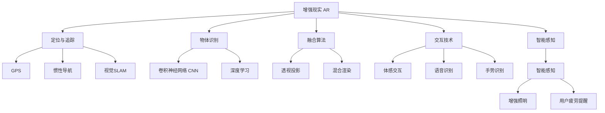
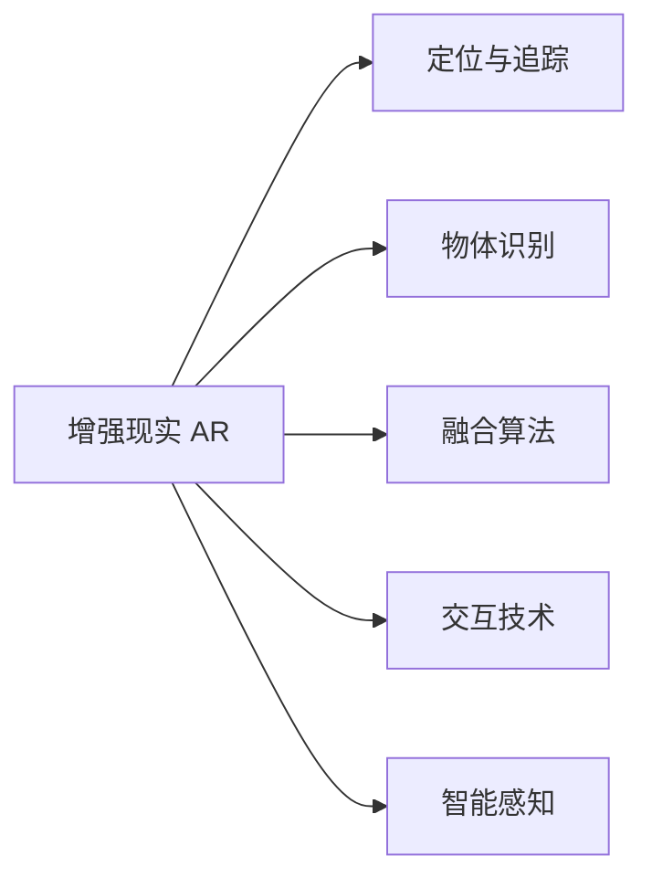
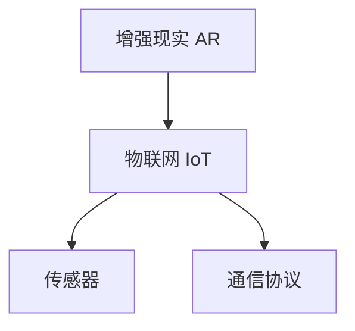
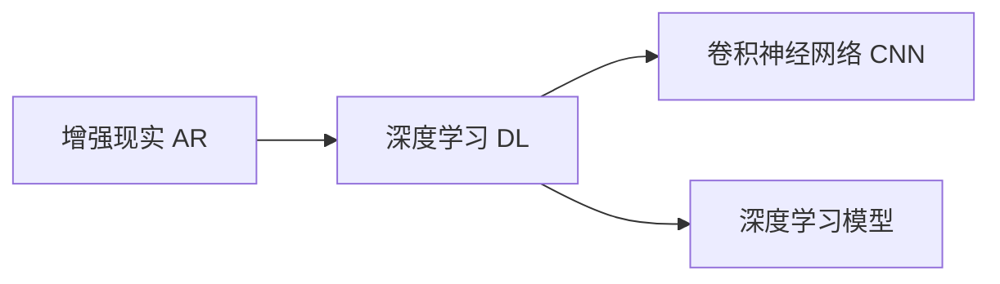
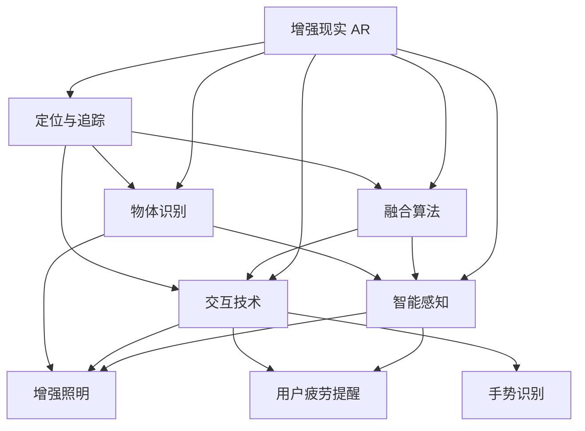

                 

# 增强现实 (Augmented Reality)

> 关键词：增强现实,AR,混合现实,计算机视觉,深度学习,交互技术,物联网(IoT)

## 1. 背景介绍

### 1.1 问题由来
增强现实（Augmented Reality, AR）技术通过将虚拟信息叠加在现实世界中，使用户能够在现实环境中获得更多的信息和互动体验。随着智能手机、平板电脑的普及，以及虚拟现实（Virtual Reality, VR）和混合现实（Mixed Reality, MR）技术的发展，AR技术已经从实验室走进了人们的日常生活。

增强现实技术的应用场景广泛，涵盖教育、娱乐、医学、工业、军事等多个领域。例如，在医学领域，AR技术可以辅助医生进行手术，通过虚拟解剖模型和实时反馈，提高手术的准确性和安全性；在教育领域，AR技术可以通过虚拟教室和互动教学工具，提供沉浸式的学习体验；在工业领域，AR技术可以帮助工人通过虚拟指导进行复杂操作，提升生产效率。

然而，尽管AR技术已经在多个领域展现了巨大的潜力，但其实现和应用仍面临诸多技术挑战。例如，如何在不同环境中准确地定位和跟踪用户，如何将虚拟信息与现实环境无缝融合，如何提升用户交互的自然性和实时性，如何应对用户操作的不确定性等。这些问题都需要通过深化AR核心技术的研究和优化来解决。

### 1.2 问题核心关键点
增强现实技术的关键点在于如何实现虚拟信息与现实环境的精确融合，具体包括以下几个方面：

1. **定位与追踪**：AR系统需要能够准确地定位用户和虚拟物体的位置和姿态，以便在现实环境中显示虚拟信息。常见的定位技术包括GPS、惯性导航、视觉SLAM等。

2. **物体识别**：AR系统需要对现实环境中的物体进行识别和分类，以便在虚拟信息中显示相应的内容。常用的识别技术包括卷积神经网络（CNN）、深度学习等。

3. **融合算法**：AR系统需要能够在虚拟信息与现实环境之间建立准确的映射关系，使得虚拟信息能够自然地叠加在现实环境中。常见的融合算法包括透视投影、混合渲染等。

4. **交互技术**：AR系统需要支持用户通过手势、语音等方式与虚拟信息进行自然交互。常见的交互技术包括体感交互、语音识别、手势识别等。

5. **智能感知**：AR系统需要具备一定的智能感知能力，能够根据环境变化动态调整虚拟信息的显示。例如，在光线不足的环境中自动开启增强照明，或者在用户疲劳时提醒休息。

这些关键技术共同构成了增强现实技术的核心框架，使得AR系统能够在多种场景下提供丰富、自然的交互体验。

### 1.3 问题研究意义
增强现实技术的研究和应用，对于推动计算机视觉、人机交互、物联网等领域的进展具有重要意义：

1. **推动计算机视觉发展**：增强现实技术需要对现实环境进行精确的视觉识别和理解，这促使计算机视觉技术不断发展，提升了视觉识别的准确性和鲁棒性。

2. **提升人机交互自然性**：增强现实技术通过自然的手势、语音等方式与用户进行互动，推动了自然交互技术的发展，使得人机交互更加友好和高效。

3. **拓展物联网应用场景**：增强现实技术可以将虚拟信息与物联网设备无缝融合，拓展了物联网在医疗、教育、工业等领域的应用。

4. **提升用户沉浸感**：增强现实技术通过将虚拟信息叠加在现实环境中，提升了用户的沉浸感和体验感，推动了虚拟现实技术的发展。

5. **推动全息计算发展**：增强现实技术需要在虚拟信息与现实环境之间进行实时、高效的计算和渲染，这推动了全息计算技术的研究和发展。

总之，增强现实技术的研究和应用，不仅能够带来革命性的交互体验，还能推动相关技术的全面进步，具有广泛的应用前景和重要的研究价值。

## 2. 核心概念与联系

### 2.1 核心概念概述

为更好地理解增强现实技术，本节将介绍几个关键核心概念：

- **增强现实 (Augmented Reality, AR)**：通过将虚拟信息叠加在现实环境中，增强用户的感知体验。AR技术覆盖了视觉定位、物体识别、融合算法、交互技术等多个子领域。

- **虚拟现实 (Virtual Reality, VR)**：通过完全沉浸的虚拟环境，使用户在虚拟世界中完全隔离现实环境。VR技术包括头显设备、控制器、空间定位等关键组件。

- **混合现实 (Mixed Reality, MR)**：结合AR和VR技术，创建混合的现实体验，使得虚拟信息与现实环境可以互相交互。

- **计算机视觉 (Computer Vision, CV)**：通过算法和模型，从图像和视频中提取有用的信息，实现对现实世界的理解和感知。计算机视觉技术包括图像处理、特征检测、物体识别等。

- **深度学习 (Deep Learning, DL)**：基于深度神经网络，通过大量数据训练，实现对复杂问题的处理和预测。深度学习技术在图像识别、语音识别等领域应用广泛。

- **交互技术 (Interaction Technology)**：通过手势、语音、体感等方式，实现用户与虚拟信息的自然交互。交互技术包括体感交互、语音识别、手势识别等。

- **物联网 (Internet of Things, IoT)**：通过传感器、通信协议等技术，实现物与物、物与人的互联互通。物联网在增强现实中的应用，使得虚拟信息可以与现实世界中的物理对象进行交互。

这些核心概念之间的逻辑关系可以通过以下Mermaid流程图来展示：

这个流程图展示了增强现实技术的核心组件及其相互关系：

1. **定位与追踪**：通过GPS、惯性导航和视觉SLAM等技术，实现对用户和虚拟物体的精确定位和跟踪。
2. **物体识别**：使用卷积神经网络（CNN）和深度学习等技术，实现对现实物体的精确识别和分类。
3. **融合算法**：通过透视投影和混合渲染等技术，实现虚拟信息与现实环境的无缝融合。
4. **交互技术**：通过体感交互、语音识别和手势识别等技术，实现用户与虚拟信息的自然交互。
5. **智能感知**：通过增强照明和用户疲劳提醒等技术，提升用户沉浸感和交互体验。

这些组件共同构成了增强现实技术的完整框架，使得AR系统能够在多种场景下提供丰富、自然的交互体验。

### 2.2 概念间的关系

这些核心概念之间存在着紧密的联系，形成了增强现实技术的完整生态系统。下面我通过几个Mermaid流程图来展示这些概念之间的关系：

#### 2.2.1 增强现实的核心组件

这个流程图展示了增强现实技术的核心组件及其相互关系：

1. **定位与追踪**：AR系统需要能够准确地定位用户和虚拟物体的位置和姿态。
2. **物体识别**：AR系统需要对现实环境中的物体进行识别和分类，以便在虚拟信息中显示相应的内容。
3. **融合算法**：AR系统需要能够在虚拟信息与现实环境之间建立准确的映射关系，使得虚拟信息能够自然地叠加在现实环境中。
4. **交互技术**：AR系统需要支持用户通过手势、语音等方式与虚拟信息进行自然交互。
5. **智能感知**：AR系统需要具备一定的智能感知能力，能够根据环境变化动态调整虚拟信息的显示。

#### 2.2.2 增强现实与物联网

这个流程图展示了增强现实技术在物联网中的应用及其相关组件：

1. **传感器**：通过传感器技术，增强现实系统可以获取环境中的多维信息，如温度、湿度、光线等。
2. **通信协议**：通过通信协议，增强现实系统可以将获取的传感器数据传输到云端或移动设备中。
3. **智能感知**：增强现实系统需要具备一定的智能感知能力，能够根据传感器数据动态调整虚拟信息的显示。

#### 2.2.3 增强现实与深度学习

这个流程图展示了深度学习在增强现实技术中的应用及其相关组件：

1. **卷积神经网络 (CNN)**：通过卷积神经网络，增强现实系统可以对图像和视频进行精确的物体识别和分类。
2. **深度学习模型**：通过深度学习模型，增强现实系统可以实现对复杂问题的处理和预测。

### 2.3 核心概念的整体架构

最后，我们用一个综合的流程图来展示这些核心概念在增强现实技术中的整体架构：

这个综合流程图展示了增强现实技术在各个方面的核心组件及其相互关系：

1. **定位与追踪**：通过GPS、惯性导航和视觉SLAM等技术，实现对用户和虚拟物体的精确定位和跟踪。
2. **物体识别**：使用卷积神经网络（CNN）和深度学习等技术，实现对现实物体的精确识别和分类。
3. **融合算法**：通过透视投影和混合渲染等技术，实现虚拟信息与现实环境的无缝融合。
4. **交互技术**：通过体感交互、语音识别和手势识别等技术，实现用户与虚拟信息的自然交互。
5. **智能感知**：通过增强照明和用户疲劳提醒等技术，提升用户沉浸感和交互体验。

这些组件共同构成了增强现实技术的完整框架，使得AR系统能够在多种场景下提供丰富、自然的交互体验。

## 3. 核心算法原理 & 具体操作步骤
### 3.1 算法原理概述

增强现实技术的核心算法原理主要集中在定位与追踪、物体识别、融合算法、交互技术等方面。以下将分别介绍这些关键算法的原理。

#### 3.1.1 定位与追踪算法

增强现实系统的定位与追踪算法主要依赖于GPS、惯性导航、视觉SLAM等技术，实现对用户和虚拟物体的精确定位和跟踪。

1. **GPS定位**：GPS通过接收卫星信号，实现对用户位置的精确定位。GPS定位的精度和可靠性主要受环境条件影响，如地形、建筑物遮挡等。

2. **惯性导航**：惯性导航通过集成加速度计和陀螺仪等传感器，结合卡尔曼滤波等算法，实现对用户姿态的精确测量。惯性导航的精度和鲁棒性主要受传感器精度和环境干扰影响。

3. **视觉SLAM**：视觉SLAM通过摄像头获取环境图像，结合特征检测和匹配算法，实现对用户和虚拟物体的精确定位和跟踪。视觉SLAM的精度和鲁棒性主要受环境光线、纹理等因素影响。

#### 3.1.2 物体识别算法

增强现实系统的物体识别算法主要依赖于卷积神经网络（CNN）和深度学习等技术，实现对现实物体的精确识别和分类。

1. **卷积神经网络 (CNN)**：CNN通过多层卷积和池化操作，提取图像中的特征，实现对物体的高效识别和分类。CNN模型通常包括卷积层、池化层和全连接层等组件。

2. **深度学习模型**：深度学习模型通过大量数据训练，实现对复杂问题的处理和预测。常用的深度学习模型包括ResNet、Inception等。

#### 3.1.3 融合算法

增强现实系统的融合算法主要依赖于透视投影和混合渲染等技术，实现虚拟信息与现实环境的无缝融合。

1. **透视投影**：透视投影通过将虚拟信息投影到真实环境中，实现虚拟信息与现实环境的融合。透视投影的实现需要获取现实环境的深度信息，常见的方法包括立体匹配、结构光等。

2. **混合渲染**：混合渲染通过将虚拟信息与现实环境进行合成渲染，实现虚拟信息与现实环境的融合。混合渲染的实现需要考虑光照、阴影等效果，确保虚拟信息与现实环境的一致性。

#### 3.1.4 交互技术算法

增强现实系统的交互技术算法主要依赖于体感交互、语音识别、手势识别等技术，实现用户与虚拟信息的自然交互。

1. **体感交互**：体感交互通过体感摄像头和深度传感器等技术，实现对用户的手势和动作的精确识别。体感交互的实现需要考虑手势的识别精度和鲁棒性。

2. **语音识别**：语音识别通过麦克风获取用户的语音输入，结合语音识别模型，实现对语音指令的识别和处理。语音识别的实现需要考虑噪声、口音等因素。

3. **手势识别**：手势识别通过摄像头获取用户的手势动作，结合深度学习等技术，实现对手势的精确识别。手势识别的实现需要考虑手势的多样性和复杂性。

#### 3.1.5 智能感知算法

增强现实系统的智能感知算法主要依赖于增强照明和用户疲劳提醒等技术，提升用户沉浸感和交互体验。

1. **增强照明**：增强照明通过调整环境光照，提升用户对虚拟信息的可读性和可识别性。增强照明的实现需要考虑环境光照的动态变化。

2. **用户疲劳提醒**：用户疲劳提醒通过监测用户的姿势、视线等指标，提醒用户休息或调整姿势，提升用户的舒适度和交互体验。用户疲劳提醒的实现需要考虑用户的行为模式和疲劳程度。

### 3.2 算法步骤详解

增强现实技术的实现步骤主要包括以下几个环节：

1. **环境采集与预处理**：通过摄像头、传感器等设备，采集现实环境的多维信息，并进行预处理，如去噪、滤波等。

2. **物体识别**：使用卷积神经网络（CNN）和深度学习等技术，对采集的图像和视频进行物体识别和分类。

3. **定位与追踪**：通过GPS、惯性导航和视觉SLAM等技术，实现对用户和虚拟物体的精确定位和跟踪。

4. **融合算法**：通过透视投影和混合渲染等技术，实现虚拟信息与现实环境的无缝融合。

5. **交互技术**：通过体感交互、语音识别、手势识别等技术，实现用户与虚拟信息的自然交互。

6. **智能感知**：通过增强照明和用户疲劳提醒等技术，提升用户沉浸感和交互体验。

7. **实时渲染与渲染优化**：通过GPU加速、并行计算等技术，实现对虚拟信息的实时渲染和渲染优化。

### 3.3 算法优缺点

增强现实技术的实现算法具有以下优点：

1. **精确定位与追踪**：通过GPS、惯性导航和视觉SLAM等技术，实现对用户和虚拟物体的精确定位和跟踪，使得虚拟信息能够准确地叠加在现实环境中。

2. **高效物体识别**：使用卷积神经网络（CNN）和深度学习等技术，实现对现实物体的精确识别和分类，提升了虚拟信息显示的准确性和鲁棒性。

3. **无缝融合**：通过透视投影和混合渲染等技术，实现虚拟信息与现实环境的无缝融合，提升了用户体验的自然性和沉浸感。

4. **自然交互**：通过体感交互、语音识别、手势识别等技术，实现用户与虚拟信息的自然交互，提升了用户的参与度和互动性。

5. **智能感知**：通过增强照明和用户疲劳提醒等技术，提升用户沉浸感和交互体验，提升了系统的可靠性和实用性。

6. **实时渲染**：通过GPU加速、并行计算等技术，实现对虚拟信息的实时渲染和渲染优化，提升了系统的响应速度和流畅度。

然而，增强现实技术的实现算法也存在以下缺点：

1. **环境限制**：GPS和惯性导航受环境条件影响较大，难以在室内等复杂环境中实现精确定位和跟踪。

2. **数据需求高**：深度学习和物体识别算法需要大量的标注数据进行训练，数据获取成本较高。

3. **计算资源需求高**：深度学习模型的训练和推理需要大量的计算资源，硬件成本较高。

4. **用户体验不稳定**：用户操作的不确定性和环境变化会导致虚拟信息的显示不稳定，影响用户体验。

5. **隐私和安全问题**：增强现实技术需要采集用户的地理位置、行为模式等信息，存在隐私和安全风险。

### 3.4 算法应用领域

增强现实技术的应用领域广泛，涵盖教育、娱乐、医学、工业、军事等多个领域。以下是几个典型的应用场景：

1. **医疗领域**：在手术中，AR系统可以显示虚拟解剖模型和实时反馈，辅助医生进行精确操作，提升手术成功率和安全性。

2. **教育领域**：在虚拟教室中，AR系统可以通过互动教学工具，提供沉浸式的学习体验，增强学生的学习兴趣和效果。

3. **工业领域**：在生产中，AR系统可以通过虚拟指导和实时反馈，帮助工人进行复杂操作，提升生产效率和质量。

4. **军事领域**：在训练和作战中，AR系统可以通过虚拟环境进行模拟和演练，提升士兵的实战能力和决策能力。

5. **娱乐领域**：在游戏和社交中，AR系统可以通过虚拟现实和混合现实，提供更加丰富和互动的娱乐体验。

6. **商业领域**：在零售和旅游中，AR系统可以通过虚拟信息展示产品和服务，提升用户体验和销售效果。

总之，增强现实技术的应用领域广泛，具备巨大的市场潜力和社会价值，需要不断推动技术进步和应用创新，才能真正实现其广阔的应用前景。

## 4. 数学模型和公式 & 详细讲解  
### 4.1 数学模型构建

增强现实技术的实现涉及到多个数学模型，包括物体识别、定位与追踪、融合算法等。以下是几个核心模型的数学模型构建：

#### 4.1.1 物体识别模型

物体识别模型主要通过卷积神经网络（CNN）和深度学习等技术，实现对现实物体的精确识别和分类。物体识别模型的输入为现实环境的图像和视频数据，输出为物体的类别标签。

物体识别模型的数学模型构建如下：

$$
y = f(x; \theta)
$$

其中，$x$表示输入的图像和视频数据，$y$表示输出物体的类别标签，$\theta$表示模型的参数。

物体识别模型的训练过程通常使用反向传播算法，通过大量的标注数据进行监督学习。常用的训练策略包括数据增强、正则化等。

#### 4.1.2 定位与追踪模型

定位与追踪模型主要通过GPS、惯性导航和视觉SLAM等技术，实现对用户和虚拟物体的精确定位和跟踪。定位与追踪模型的输入为传感器数据和环境图像，输出为用户和虚拟物体的位姿信息。

定位与追踪模型的数学模型构建如下：

$$
(x, y, z, \theta) = g(t, (x_0, y_0, z_0, \theta_0), u(t))
$$

其中，$(x, y, z, \theta)$表示用户和虚拟物体的位姿信息，$(x_0, y_0, z_0, \theta_0)$表示初始位姿信息，$u(t)$表示传感器数据和环境图像，$g$表示定位与追踪算法。

定位与追踪模型的训练过程通常使用卡尔曼滤波等算法，通过融合传感器数据和环境图像进行实时定位和跟踪。常用的训练策略包括迭代优化、滤波等。

#### 4.1.3 融合算法模型

融合算法模型主要通过透视投影和混合渲染等技术，实现虚拟信息与现实环境的无缝融合。融合算法模型的输入为虚拟信息和现实环境的信息，输出为融合后的图像和视频数据。

融合算法模型的数学模型构建如下：

$$
F = h(V, R, D, I)
$$

其中，$F$表示融合后的图像和视频数据，$V$表示虚拟信息，$R$表示现实环境的信息，$D$表示虚拟信息的深度信息，$I$表示现实环境的深度信息，$h$表示融合算法。

融合算法模型的训练过程通常使用深度学习等技术，通过大量数据进行监督学习。常用的训练策略包括生成对抗网络（GAN）、自监督学习等。

#### 4.1.4 交互技术模型

交互技术模型主要通过体感交互、语音识别、手势识别等技术，实现用户与虚拟信息的自然交互。交互技术模型的输入为用户的手势、语音和体感数据，输出为虚拟信息的显示和处理。

交互技术模型的数学模型构建如下：

$$
O = g(P, S, L, A)
$$

其中，$O$表示虚拟信息的显示和处理，$P$表示用户的手势、语音和体感数据，$S$表示传感器数据，$L$表示语音识别模型，$A$表示手势识别模型，$g$表示交互技术算法。

交互技术模型的训练过程通常使用深度学习等技术，通过大量数据进行监督学习。常用的训练策略包括数据增强、正则化等。

#### 4.1.5 智能感知模型

智能感知模型主要通过增强照明和用户疲劳提醒等技术，提升用户沉浸感和交互体验。智能感知模型的输入为环境信息和用户行为数据，输出为智能感知结果。

智能感知模型的数学模型构建如下：

$$
S = f(E, U, C)
$$

其中，$S$表示智能感知结果，$E$表示环境信息，$U$表示用户行为数据，$C$表示智能感知算法，$f$表示智能感知模型。

智能感知模型的训练过程通常使用深度学习等技术，通过大量数据进行监督学习。常用的训练策略包括数据增强、正则化等。

### 4.2 公式推导过程

以下对几个核心模型的公式推导过程进行详细讲解：

#### 4.2.1 物体识别模型的公式推导

物体识别模型的输出为物体的类别标签，通过卷积神经网络（CNN）和深度学习等技术实现。

假设物体识别模型的输入为$x \in \mathbb{R}^n$，输出为$y \in \{1, 2, \ldots, k\}$，其中$k$为物体的类别数。物体识别模型的输出公式如下：

$$
y = f(x; \theta) = \arg\max_{i}(x; \theta)
$$

其中，$f(x; \theta)$表示物体识别模型的输出函数，$\theta$表示模型的参数。

物体识别模型的训练过程通常使用反向传播算法，通过大量标注数据进行监督学习。假设训练样本为$(x_i, y_i)$，损失函数为交叉熵损失函数：

$$
L(y, y') = -\frac{1}{N}\sum_{i=1}^N \log y'
$$

其中，$y'$表示模型预测的类别概率分布，$N$表示训练样本的数量。

物体识别模型的优化目标是最小化损失函数，即：

$$
\theta^* = \arg\min_{\theta} L(y, y')
$$

通过梯度下降等优化算法，不断更新模型参数$\theta$，最小化损失函数$L$，从而提升物体识别的准确性和鲁棒性。

#### 4.2.2 定位与追踪模型的公式推导

定位与追踪模型的输出为用户和虚拟物体的位姿信息，通过GPS、惯性导航和视觉SLAM等技术实现。

假设定位与追踪模型的输入为$t \in \mathbb{R}$，初始位姿信息为$(x_0, y_0, z_0, \theta_0) \in \mathbb{R}^4$，传感器数据和环境图像为$u(t) \in \mathbb{R}^m$，位姿信息为$(x, y, z, \theta) \in \mathbb{R}^4$。定位与追踪模型的输出公式如下：

$$
(x, y, z, \theta) = g(t, (x_0, y_0, z_0, \theta_0), u(t))
$$

其中，$g$表示定位与追踪算法，$t$表示时间。

定位与追踪模型的训练过程通常使用卡尔曼滤波等算法，通过融合传感器数据和环境图像进行实时定位和跟踪。假设训练样本为$(t_i, (x_{i_0}, y_{i_0}, z_{i_0}, \theta_{i_0}), u(t_i)$，损失函数为均方误差损失函数：

$$
L(x, y, z, \theta) = \frac{1}{N}\sum_{i=1}^N (x_i - x_0)^2 + (y_i - y_0)^2 + (z_i - z_0)^2 + (\theta_i - \theta_0)^2
$$

其中，$N$表示训练样本的数量。

定位与追踪模型的优化目标是最小化损失函数，即：

$$
\theta^* = \arg\min_{\theta} L(x, y, z, \theta)
$$

通过梯度下降等优化算法，不断

