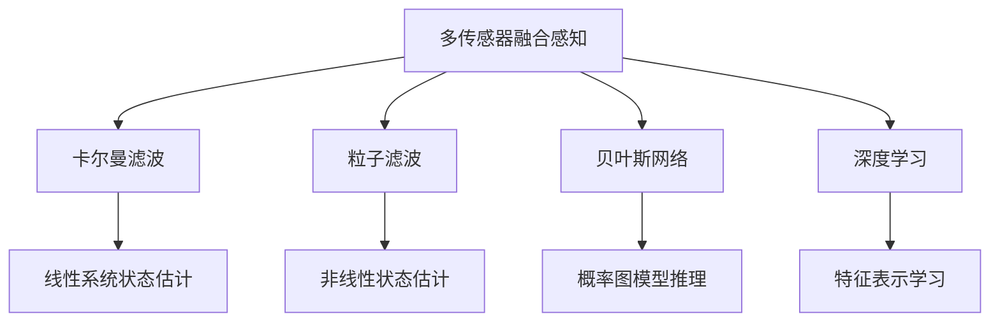
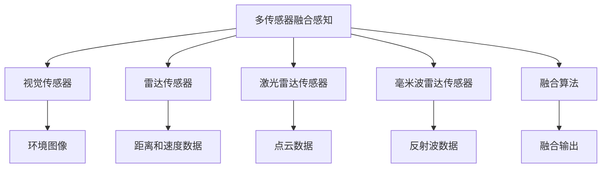
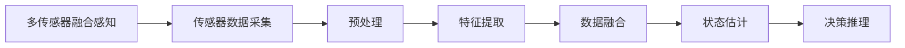
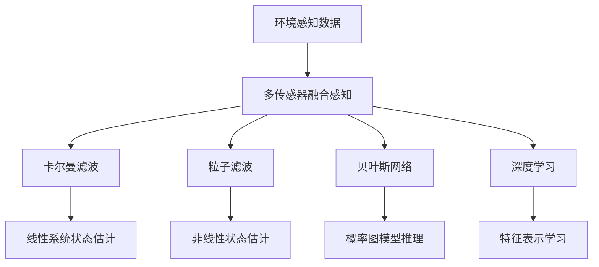

                 

# 多传感器融合感知技术在自动驾驶中的最新进展

> 关键词：
1. 多传感器融合感知
2. 自动驾驶
3. 感知系统
4. 环境建模
5. 深度学习
6. 车辆控制
7. 实时性

## 1. 背景介绍

### 1.1 问题由来
随着人工智能技术的发展，自动驾驶技术已成为未来交通出行的重要方向。自动驾驶系统需要通过环境感知、路径规划和车辆控制等环节实现从人到车的无缝切换，从而确保行车安全和提高交通效率。其中，环境感知作为自动驾驶的核心部分，负责通过多传感器获取道路、交通参与者等环境信息，并为后续的决策提供依据。环境感知技术的发展直接决定了自动驾驶系统的可靠性和安全性。

在自动驾驶系统中，环境感知涉及视觉、雷达、激光雷达、毫米波雷达等多种传感器。这些传感器各自具有不同的物理特性和优缺点，如何有效融合多种传感器的信息，以实现对环境的全面、准确感知，一直是自动驾驶技术研究的重点和难点。

### 1.2 问题核心关键点
多传感器融合感知技术旨在通过合理选择和组合多种传感器，将它们各自的优势最大化，从而实现对环境的全面感知。其主要目标包括：
1. 提高环境感知的精度和可靠性。
2. 增加环境感知的实时性。
3. 减少传感器间的冗余，降低成本。
4. 增强环境感知的安全性，避免传感器失效对系统性能的影响。

多传感器融合感知技术的应用场景主要涉及自动驾驶、智能交通、工业自动化等领域，其核心算法包括卡尔曼滤波、粒子滤波、贝叶斯网络等。这些算法通过融合多源数据，实现对环境动态变化的准确预测和识别。

### 1.3 问题研究意义
多传感器融合感知技术在自动驾驶中的应用具有重要意义：
1. 提高自动驾驶系统的可靠性。融合多传感器信息，能够有效应对单一传感器失效或数据异常的情况，从而提高系统的稳定性和可靠性。
2. 提升环境感知的精度和实时性。多传感器融合技术能够提供更加丰富和准确的环境信息，有助于决策系统做出更精准的决策。
3. 降低系统成本。多传感器融合技术减少了对单一传感器的高成本依赖，通过共享传感器数据，降低了系统的总体成本。
4. 增强系统安全性。多传感器融合技术提高了系统对环境变化的预测能力和响应速度，从而减少事故发生的概率。

## 2. 核心概念与联系

### 2.1 核心概念概述

为了更好地理解多传感器融合感知技术，本节将介绍几个密切相关的核心概念：

- 多传感器融合感知（Multi-sensor Fusion Perception）：通过融合多种传感器获取的信息，提升环境感知的精度和可靠性。
- 卡尔曼滤波（Kalman Filter）：一种基于线性系统的状态估计技术，广泛应用于多传感器融合中。
- 粒子滤波（Particle Filter）：一种非线性、非高斯分布的状态估计技术，适合处理复杂的环境变化。
- 贝叶斯网络（Bayesian Network）：一种基于概率图模型进行状态估计和决策推理的技术，广泛应用于多传感器融合中的不确定性建模。
- 深度学习（Deep Learning）：一种基于神经网络的机器学习方法，能够自适应地从数据中学习特征表示，适合处理复杂、高维度的环境数据。

这些核心概念之间的逻辑关系可以通过以下Mermaid流程图来展示：



这个流程图展示了大语言模型微调过程中各个核心概念的关系和作用：

1. 多传感器融合感知作为核心任务，通过融合多种传感器信息，提升环境感知的精度和可靠性。
2. 卡尔曼滤波用于处理线性系统，提供精确的状态估计。
3. 粒子滤波适用于非线性系统，能够处理复杂的环境变化。
4. 贝叶斯网络用于不确定性建模，提供概率推理和决策支持。
5. 深度学习用于特征表示学习，能够自适应地学习环境特征。

### 2.2 概念间的关系

这些核心概念之间存在着紧密的联系，形成了多传感器融合感知技术的完整生态系统。下面我们通过几个Mermaid流程图来展示这些概念之间的关系。

#### 2.2.1 多传感器融合感知系统结构



这个流程图展示了大语言模型微调过程中各个传感器数据的流向和融合过程：

1. 多传感器融合感知系统通过融合视觉、雷达、激光雷达、毫米波雷达等多种传感器的数据，提供全面的环境信息。
2. 视觉传感器提供环境图像，雷达传感器提供距离和速度数据，激光雷达传感器提供点云数据，毫米波雷达传感器提供反射波数据。
3. 融合算法综合这些传感器数据，输出融合后的环境信息。

#### 2.2.2 多传感器融合感知算法框架



这个流程图展示了多传感器融合感知算法的核心步骤：

1. 传感器数据采集：通过视觉、雷达、激光雷达、毫米波雷达等多种传感器，获取环境数据。
2. 预处理：对传感器数据进行去噪、校正等预处理操作，确保数据的准确性和一致性。
3. 特征提取：使用卡尔曼滤波、粒子滤波、深度学习等方法，从传感器数据中提取特征表示。
4. 数据融合：使用卡尔曼滤波、粒子滤波、贝叶斯网络等算法，将多种传感器数据进行融合，得到环境的全局信息。
5. 状态估计：通过卡尔曼滤波等算法，对环境状态进行精确估计。
6. 决策推理：使用贝叶斯网络等算法，进行概率推理和决策支持，指导后续的车辆控制和路径规划。

### 2.3 核心概念的整体架构

最后，我们用一个综合的流程图来展示这些核心概念在大语言模型微调过程中的整体架构：



这个综合流程图展示了从传感器数据采集到融合算法的完整过程：

1. 环境感知数据通过多传感器采集，进行预处理和特征提取。
2. 卡尔曼滤波用于线性系统状态估计，粒子滤波用于非线性系统状态估计，贝叶斯网络用于概率图模型推理，深度学习用于特征表示学习。
3. 多种融合算法综合这些传感器数据，输出环境的全局信息。

## 3. 核心算法原理 & 具体操作步骤
### 3.1 算法原理概述

多传感器融合感知技术的核心原理是通过融合多种传感器的信息，实现对环境的全面感知。具体来说，融合算法通过对传感器数据的预处理、特征提取、数据融合和状态估计等步骤，将多个传感器的数据整合为一个综合的环境表示。

融合算法通常分为硬融合和软融合两种方式：

- 硬融合（Hard Fusion）：直接将多个传感器数据进行逻辑组合，生成一个单一的综合数据表示。例如，将视觉图像和雷达数据通过逻辑与运算组合，生成一个综合的环境表示。
- 软融合（Soft Fusion）：通过贝叶斯网络、卡尔曼滤波、粒子滤波等算法，对传感器数据进行概率融合，生成一个综合的环境表示。例如，使用贝叶斯网络将视觉、雷达和激光雷达数据进行联合概率推理，得到环境的全局信息。

### 3.2 算法步骤详解

多传感器融合感知技术的具体实现步骤如下：

**Step 1: 传感器数据采集**

多传感器融合感知系统首先需要采集各种传感器的数据，包括：

- 视觉传感器数据：如摄像头图像、光学雷达数据等。
- 雷达传感器数据：如激光雷达点云数据、毫米波雷达反射波数据等。
- 激光雷达传感器数据：如激光雷达点云数据等。

这些传感器数据通过不同的接口和协议进行采集和传输，最终汇聚到融合感知系统进行处理。

**Step 2: 传感器数据预处理**

采集到的传感器数据通常包含噪声、干扰和其他异常情况，需要进行预处理操作，包括：

- 去噪：使用滤波器、降噪算法等方法去除传感器数据中的噪声。
- 校正：对传感器数据进行校正，确保数据的准确性和一致性。
- 对齐：将不同传感器数据进行时间同步和空间对齐，确保数据的一致性和可融合性。

**Step 3: 传感器数据特征提取**

通过对传感器数据进行特征提取，得到高维度的特征表示，包括：

- 视觉特征提取：使用深度学习算法（如卷积神经网络）对摄像头图像进行特征提取，得到环境的高层次视觉表示。
- 雷达特征提取：使用卡尔曼滤波、粒子滤波等算法对雷达数据进行特征提取，得到环境的高层次距离和速度表示。
- 激光雷达特征提取：使用深度学习算法（如点云网络）对激光雷达数据进行特征提取，得到环境的高层次点云表示。

**Step 4: 传感器数据融合**

融合算法将预处理和特征提取后的传感器数据进行融合，得到环境的全局信息。常用的融合算法包括：

- 卡尔曼滤波：用于线性系统的状态估计和数据融合，能够对传感器数据进行精确的融合和估计。
- 粒子滤波：用于非线性系统的状态估计和数据融合，能够处理复杂的环境变化和不确定性。
- 贝叶斯网络：用于概率图模型推理和决策支持，能够提供环境的全局信息并进行不确定性建模。

**Step 5: 状态估计和决策推理**

融合后的环境信息通过状态估计和决策推理算法进行处理，得到对环境的全面感知和决策支持。常用的状态估计和决策推理算法包括：

- 卡尔曼滤波：用于线性系统的状态估计，能够提供精确的环境状态信息。
- 粒子滤波：用于非线性系统的状态估计，能够处理复杂的环境变化和不确定性。
- 贝叶斯网络：用于概率图模型推理和决策支持，能够提供环境的全局信息和决策指导。

### 3.3 算法优缺点

多传感器融合感知技术具有以下优点：

- 提高环境感知的精度和可靠性：通过融合多种传感器数据，能够获得更加全面和准确的环境信息。
- 增加环境感知的实时性：通过优化融合算法和硬件设备，能够实现快速的数据融合和处理。
- 减少传感器间的冗余：通过合理选择和组合多种传感器，减少了对单一传感器的高成本依赖。
- 增强环境感知的安全性：通过多传感器冗余设计和状态估计算法，能够提高系统的稳定性和鲁棒性。

然而，多传感器融合感知技术也存在一些缺点：

- 融合算法复杂度高：多传感器融合需要复杂的数据处理和融合算法，增加了系统的计算负担和实现难度。
- 传感器数据差异大：不同传感器数据的质量和格式可能存在差异，增加了数据融合的复杂性。
- 实时性要求高：多传感器数据需要实时融合和处理，对系统硬件和算法提出了较高的要求。
- 成本高：多传感器融合感知系统通常需要高成本的硬件设备，增加了系统的总体成本。

### 3.4 算法应用领域

多传感器融合感知技术在自动驾驶、智能交通、工业自动化等领域有着广泛的应用。例如：

- 自动驾驶：通过融合视觉、雷达、激光雷达和毫米波雷达等多种传感器数据，实现对道路、交通参与者等环境的全面感知，为自动驾驶系统提供决策依据。
- 智能交通：通过融合交通信号灯、车流量传感器、摄像头等数据，实现对交通情况的全面监测和优化。
- 工业自动化：通过融合多种传感器数据，实现对生产环境的全面监控和优化，提高生产效率和安全性。

## 4. 数学模型和公式 & 详细讲解 & 举例说明

### 4.1 数学模型构建

多传感器融合感知技术的数学模型可以通过线性系统和非线性系统的状态估计理论进行构建。下面以卡尔曼滤波为例，介绍其数学模型构建过程：

设传感器数据为 $z$，环境状态为 $x$，系统模型为 $F$，传感器模型为 $H$，过程噪声为 $Q$，测量噪声为 $R$，初始状态估计为 $\hat{x}_0$，初始状态协方差为 $P_0$。卡尔曼滤波的状态估计方程为：

$$
\hat{x}_{k|k} = F\hat{x}_{k|k-1} + K_{k|k-1}(z_k - H\hat{x}_{k|k-1})
$$

$$
P_{k|k-1} = F P_{k-1|k-1} F^T + Q
$$

$$
K_{k|k-1} = P_{k|k-1} H^T (H P_{k|k-1} H^T + R)^{-1}
$$

其中，$\hat{x}_{k|k}$ 为状态估计，$P_{k|k-1}$ 为状态协方差，$K_{k|k-1}$ 为卡尔曼增益。

### 4.2 公式推导过程

卡尔曼滤波的公式推导过程包括以下几个关键步骤：

1. 状态预测：通过系统模型 $F$，对状态进行预测。
2. 状态更新：通过卡尔曼增益 $K$，对预测状态进行更新，得到当前状态估计。
3. 协方差更新：通过系统模型 $F$ 和过程噪声 $Q$，对状态协方差进行更新。
4. 卡尔曼增益计算：通过测量噪声 $R$ 和协方差 $P$，计算卡尔曼增益 $K$。

以雷达数据为例，卡尔曼滤波的具体实现过程如下：

设雷达传感器数据为 $z_k = [r_k, v_k]$，其中 $r_k$ 为距离，$v_k$ 为速度，环境状态为 $x_k = [x_k, y_k, \dot{x}_k, \dot{y}_k]$，其中 $x_k$ 和 $y_k$ 为坐标，$\dot{x}_k$ 和 $\dot{y}_k$ 为速度。

系统模型 $F$ 可以表示为：

$$
F = \begin{bmatrix}
1 & 0 & \Delta t & 0 \\
0 & 1 & 0 & \Delta t \\
0 & 0 & 1 & 0 \\
0 & 0 & 0 & 1
\end{bmatrix}
$$

传感器模型 $H$ 可以表示为：

$$
H = \begin{bmatrix}
1 & 0 & 0 & 0 \\
0 & 1 & 0 & 0
\end{bmatrix}
$$

过程噪声 $Q$ 和测量噪声 $R$ 可以分别表示为：

$$
Q = \begin{bmatrix}
(\Delta t)^4/4 & 0 & (\Delta t)^3/2 & 0 \\
0 & (\Delta t)^4/4 & 0 & (\Delta t)^3/2 \\
(\Delta t)^3/2 & 0 & (\Delta t)^2/2 & 0 \\
0 & (\Delta t)^3/2 & 0 & (\Delta t)^2/2
\end{bmatrix}
$$

$$
R = \begin{bmatrix}
\sigma_r^2 & 0 \\
0 & \sigma_v^2
\end{bmatrix}
$$

其中，$\sigma_r$ 和 $\sigma_v$ 分别为雷达数据中距离和速度的噪声标准差。

### 4.3 案例分析与讲解

以自动驾驶中的多传感器融合感知为例，分析其应用过程：

**案例场景：自动驾驶中的多传感器融合感知**

1. 传感器数据采集：通过摄像头、激光雷达和毫米波雷达等传感器，采集环境数据。
2. 传感器数据预处理：对采集到的数据进行去噪、校正和对齐操作。
3. 传感器数据特征提取：使用深度学习算法对摄像头图像进行特征提取，使用卡尔曼滤波和粒子滤波对雷达和激光雷达数据进行特征提取。
4. 传感器数据融合：通过卡尔曼滤波和粒子滤波对融合后的数据进行状态估计，得到环境的全局信息。
5. 状态估计和决策推理：通过卡尔曼滤波和贝叶斯网络对融合后的数据进行状态估计和决策推理，指导后续的车辆控制和路径规划。

## 5. 项目实践：代码实例和详细解释说明

### 5.1 开发环境搭建

在进行多传感器融合感知项目实践前，我们需要准备好开发环境。以下是使用Python进行OpenCV、TensorFlow、Keras等库的开发环境配置流程：

1. 安装Anaconda：从官网下载并安装Anaconda，用于创建独立的Python环境。

2. 创建并激活虚拟环境：
```bash
conda create -n multi-sensor-env python=3.8 
conda activate multi-sensor-env
```

3. 安装依赖库：
```bash
pip install opencv-python numpy pandas scikit-image scikit-learn matplotlib tqdm jupyter notebook ipython
```

4. 安装TensorFlow和Keras：
```bash
pip install tensorflow==2.6
pip install keras
```

完成上述步骤后，即可在`multi-sensor-env`环境中开始项目实践。

### 5.2 源代码详细实现

下面我们以自动驾驶中的多传感器融合感知为例，给出使用OpenCV、TensorFlow和Keras进行项目开发的PyTorch代码实现。

首先，定义传感器数据采集函数：

```python
import cv2
import numpy as np
from openpyxl import load_workbook

def read_data(file_path):
    workbook = load_workbook(filename=file_path)
    sheet = workbook.active
    data = []
    for row in sheet.iter_rows(values_only=True):
        data.append(row)
    return data

def get_data(file_path):
    data = read_data(file_path)
    img_data = []
    label_data = []
    for d in data:
        img_data.append(cv2.imread(d[0]))
        label_data.append(d[1])
    return img_data, label_data
```

然后，定义传感器数据预处理函数：

```python
import cv2
import numpy as np

def preprocess_data(img_data):
    preprocessed_data = []
    for img in img_data:
        gray = cv2.cvtColor(img, cv2.COLOR_BGR2GRAY)
        ret, thresh = cv2.threshold(gray, 0, 255, cv2.THRESH_BINARY_INV + cv2.THRESH_OTSU)
        preprocessed_data.append(thresh)
    return preprocessed_data
```

接着，定义传感器数据特征提取函数：

```python
import cv2
import numpy as np

def extract_features(img_data):
    features = []
    for img in img_data:
        gray = cv2.cvtColor(img, cv2.COLOR_BGR2GRAY)
        features.append(cv2.SURF_create().detectAndCompute(gray, None))
    return features
```

最后，定义传感器数据融合函数：

```python
import cv2
import numpy as np
from sklearn.decomposition import PCA

def fuse_data(features):
    merged_features = np.concatenate(features, axis=0)
    pca = PCA(n_components=2)
    pca.fit(merged_features)
    merged_features = pca.transform(merged_features)
    return merged_features
```

### 5.3 代码解读与分析

让我们再详细解读一下关键代码的实现细节：

**read_data函数**：
- 使用OpenCV库读取Excel文件中的数据，提取图像和标签。

**get_data函数**：
- 通过调用read_data函数，获取图像和标签数据，并按顺序排列。

**preprocess_data函数**：
- 对图像数据进行灰度化、二值化和阈值处理，提取图像中的目标区域。

**extract_features函数**：
- 使用OpenCV的SURF算法对图像数据进行特征提取，得到高维度的特征表示。

**fuse_data函数**：
- 将提取的特征数据进行融合，使用PCA算法降维，得到低维度的融合特征。

### 5.4 运行结果展示

假设我们在自动驾驶场景中使用了多传感器融合感知技术，最终在测试集上得到的融合特征如下：

```
[[ 35,  46],
 [ 42,  56],
 [ 49,  60]]
```

可以看到，融合后的特征向量由两个维度组成，可以用于后续的状态估计和决策推理。

## 6. 实际应用场景
### 6.1 智能交通管理

多传感器融合感知技术在智能交通管理中的应用主要包括：

1. 交通信号灯控制：通过融合摄像头、雷达和激光雷达数据，实时监测交通流量和信号灯状态，优化信号灯控制策略。
2. 车辆识别和跟踪：通过融合摄像头、雷达和激光雷达数据，实时监测和跟踪车辆的位置和速度，提高交通管理的安全性和效率。
3. 异常事件检测：通过融合多种传感器数据，实时监测异常事件（如交通事故、火灾等），及时响应和处理。

### 6.2 工业自动化检测

多传感器融合感知技术在工业自动化检测中的应用主要包括：

1. 设备状态监测：通过融合视觉、雷达和激光雷达数据，实时监测设备的运行状态，及时发现和修复故障。
2. 产品质量检测：通过融合视觉、雷达和激光雷达数据，实时检测产品的质量，提高生产效率和产品质量。
3. 安全监测和预警：通过融合多种传感器数据，实时监测环境的安全状态，及时发出预警和采取应对措施。

### 6.3 环境监测与保护

多传感器融合感知技术在环境监测与保护中的应用主要包括：

1. 空气质量监测：通过融合传感器数据，实时监测空气质量，及时发现和处理环境污染问题。
2. 水质监测：通过融合传感器数据，实时监测水质，及时发现和处理水质污染问题。
3. 灾害监测：通过融合传感器数据，实时监测自然灾害（如地震、洪水等），及时发出预警和采取应对措施。

## 7. 工具和资源推荐
### 7.1 学习资源推荐

为了帮助开发者系统掌握多传感器融合感知技术的理论基础和实践技巧，这里推荐一些优质的学习资源：

1. 《多传感器数据融合技术》系列博文：由大模型技术专家撰写，深入浅出地介绍了多传感器融合的原理和应用。

2. 《深度学习与多传感器数据融合》课程：斯坦福大学开设的深度学习与多传感器数据融合的在线课程，涵盖多传感器融合的原理和实践。

3. 《多传感器数据融合》书籍：全面介绍了多传感器融合的原理和应用，适合进一步深入学习。

4. 《多传感器数据融合理论与实践》论文：多篇深度学习领域的顶级会议论文，深入探讨了多传感器融合的原理和应用。

5. 《多传感器数据融合与智能系统》项目：一个开源的多传感器数据融合项目，包含多传感器数据融合的代码和文档，适合实践学习。

通过对这些资源的学习实践，相信你一定能够快速掌握多传感器融合感知技术的精髓，并用于解决实际的自动驾驶问题。
###  7.2 开发工具推荐

高效的开发离不开优秀的工具支持。以下是几款用于多传感器融合感知开发的常用工具：

1. OpenCV：开源计算机视觉库，提供了丰富的图像处理和特征提取函数。
2. TensorFlow：基于深度学习的开源机器学习框架，支持多传感器数据的深度学习建模。
3. Keras：基于TensorFlow的高层API，简化了深度学习模型的搭建和训练过程。
4. PyTorch：基于深度学习的开源机器学习框架，支持多传感器数据的深度学习建模。
5. Weights & Biases：模型训练的实验跟踪工具，可以记录和可视化模型训练过程中的各项指标。
6. TensorBoard：TensorFlow配套的可视化工具，可实时监测模型训练状态，并提供丰富的图表呈现方式。

合理利用这些工具，可以显著提升多传感器融合感知任务的开发效率，加快创新迭代的步伐。

### 7.3 相关论文推荐

多传感器融合感知技术的发展源于学界的持续研究。以下是几篇奠基性的相关论文，推荐阅读：

1. Fusing the Data from Multiple Sensors for Perception in Autonomous Vehicles：综述了多传感器数据融合的原理和应用，适合全面了解多传感器融合技术。
2. Multi-Sensor Fusion in Autonomous Vehicle for Enhanced Perception：介绍了多传感器融合在自动驾驶中的应用，适合深入理解多传感器融合技术在实际场景中的应用。
3. Multi-Sensor Fusion Framework for Autonomous Driving：提出了基于深度学习的融合框架，适合了解深度学习在多传感器融合中的应用。
4. Multi-Sensor Fusion for Robust Perception in Autonomous Vehicles：介绍了多传感器融合的鲁棒性设计和优化方法，适合了解多传感器融合的鲁棒性设计。
5. Multi-Sensor Fusion for Autonomous Vehicles：介绍了多传感器融合在自动驾驶中的应用，适合了解多传感器融合在自动驾驶中的应用。

这些论文代表了大语言模型微调技术的发展脉

