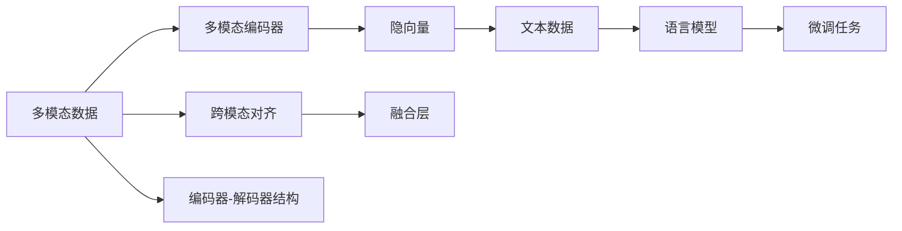
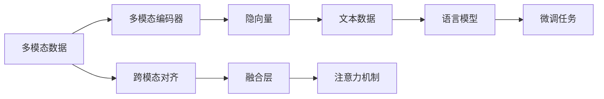
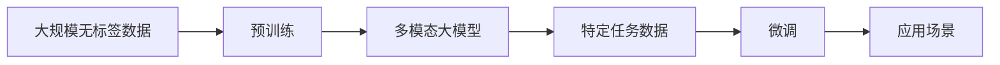

                 

# 多模态大模型：技术原理与实战 ChatGPT的诞生

## 1. 背景介绍

### 1.1 问题由来
自深度学习技术兴起以来，语言模型一直是人工智能研究的热点之一。传统的语言模型基于文本数据，能够有效捕捉语言的语义和语法结构。然而，现实世界的语境往往是多模态的，单纯依赖文本模型无法充分理解复杂多变的交互场景。

近年来，随着大模型的发展，多模态学习成为新的研究热点。以ChatGPT为代表的多模态大模型，通过融合图像、视频、音频等多模态信息，极大提升了语言模型对现实世界的理解能力和交互能力。

### 1.2 问题核心关键点
多模态大模型的核心思想是通过引入多模态信息，增强语言模型的语义理解能力和交互功能。在实践中，多模态大模型主要通过两种方式来实现：

1. **编码器-解码器结构**：以图像、视频或音频作为输入，使用多模态编码器将其转化为隐向量，然后将这些向量与文本数据一起输入到语言模型中进行联合训练。
2. **跨模态对齐**：直接将多模态数据与文本数据拼接在一起，通过简单的线性投影将它们映射到一个共同的空间中，然后输入到语言模型中进行训练。

多模态大模型旨在通过融合多源数据，提高模型的泛化能力和交互性，从而在诸如聊天机器人、智能推荐、视觉问答等应用场景中取得优异表现。

### 1.3 问题研究意义
研究多模态大模型对于拓展语言模型的应用范围，提升模型的交互能力和泛化能力，加速人工智能技术在多模态领域的落地应用，具有重要意义：

1. **拓展应用场景**：多模态大模型能够有效处理图像、视频、音频等多种类型的数据，从而拓展了语言模型在各个领域的应用，如医疗影像分析、自动驾驶、智能家居等。
2. **提升交互能力**：多模态大模型能够从多维度理解用户需求，提供更加自然流畅的交互体验，广泛应用于智能客服、虚拟助手、娱乐互动等领域。
3. **增强泛化能力**：多模态信息可以提供更为丰富的上下文信息，帮助模型更好地处理未知数据和复杂场景，提高模型的泛化性能。
4. **推动AI产业化**：多模态大模型能够带来更高的技术门槛和商业价值，促进AI技术的产业化进程，加速落地应用。
5. **技术创新**：多模态大模型融合了多种信息源，催生了新的研究方向和技术手段，如多模态学习、跨模态对齐等，为AI技术带来了新的发展契机。

## 2. 核心概念与联系

### 2.1 核心概念概述

为了更好地理解多模态大模型的原理和实现，本节将介绍几个关键的多模态学习概念：

- **多模态学习**：指使用多个不同类型的数据源（如文本、图像、音频等）进行联合学习，从而提高模型对复杂场景的理解能力。
- **编码器-解码器结构**：以一种或多种多模态数据作为输入，使用多模态编码器将其转化为隐向量，然后与文本数据一起输入到语言模型中进行训练。
- **跨模态对齐**：将多模态数据与文本数据进行拼接或投影，使它们映射到同一个空间中，然后联合训练语言模型。
- **注意力机制**：多模态大模型中常见的机制，用于在多种输入中分配不同的权重，增强模型的理解和交互能力。
- **融合层**：用于将不同模态的信息进行融合，提高模型的泛化能力和交互性。
- **预训练-微调范式**：通过在大规模无标签数据上进行预训练，然后在特定任务上微调，从而提升模型的性能。

这些核心概念之间的逻辑关系可以通过以下Mermaid流程图来展示：



这个流程图展示了多模态大模型的基本架构：

1. 多模态数据通过多模态编码器进行编码，生成隐向量。
2. 隐向量与文本数据一起输入到语言模型中进行联合训练。
3. 使用注意力机制和融合层增强模型的理解和交互能力。
4. 在特定任务上进行微调，提升模型的性能。

### 2.2 概念间的关系

这些核心概念之间存在着紧密的联系，形成了多模态大模型的完整生态系统。下面我们通过几个Mermaid流程图来展示这些概念之间的关系。

#### 2.2.1 多模态学习框架


这个流程图展示了多模态学习的整体架构，包括多模态编码器、跨模态对齐、融合层和语言模型等关键组件。

#### 2.2.2 注意力机制与融合层



这个流程图展示了注意力机制和融合层如何增强多模态大模型的理解和交互能力。

#### 2.2.3 预训练-微调范式



这个流程图展示了预训练-微调范式如何在大规模数据上训练多模态大模型，并在特定任务上进行微调，从而提升模型的性能。

### 2.3 核心概念的整体架构

最后，我们用一个综合的流程图来展示这些核心概念在大模型微调过程中的整体架构：


这个综合流程图展示了从预训练到微调，再到应用场景的完整过程。多模态大模型首先在大规模无标签数据上进行预训练，然后通过微调适应特定任务，最后应用到实际场景中。通过这些流程图，我们可以更清晰地理解多模态大模型微调过程中各个核心概念的关系和作用。

## 3. 核心算法原理 & 具体操作步骤
### 3.1 算法原理概述

多模态大模型的核心思想是通过引入多模态信息，增强语言模型的语义理解能力和交互能力。其核心算法包括多模态编码器、跨模态对齐、注意力机制、融合层和微调等。

以ChatGPT为例，其多模态大模型基于Transformer架构，融合了文本和图像两种模态的信息。模型首先使用多模态编码器将图像转换为隐向量，然后将文本和图像的隐向量输入到Transformer中，进行联合训练。在解码阶段，模型使用注意力机制和融合层，综合考虑文本和图像的信息，生成最终的输出。

### 3.2 算法步骤详解

多模态大模型的微调步骤如下：

1. **准备预训练模型和数据集**：
   - 选择合适的多模态预训练模型（如DALL·E、ViT等）。
   - 准备下游任务的标注数据集，包括文本和图像两种类型的数据。

2. **添加任务适配层**：
   - 根据下游任务类型，设计合适的任务适配层，如分类器、解码器等。
   - 定义损失函数，用于衡量模型预测输出与真实标签之间的差异。

3. **设置微调超参数**：
   - 选择合适的优化算法及其参数，如AdamW、SGD等。
   - 设置学习率、批大小、迭代轮数等。
   - 应用正则化技术，如L2正则、Dropout、Early Stopping等。

4. **执行梯度训练**：
   - 将训练集数据分批次输入模型，前向传播计算损失函数。
   - 反向传播计算参数梯度，根据设定的优化算法和学习率更新模型参数。
   - 周期性在验证集上评估模型性能，根据性能指标决定是否触发Early Stopping。
   - 重复上述步骤直到满足预设的迭代轮数或Early Stopping条件。

5. **测试和部署**：
   - 在测试集上评估微调后模型，对比微调前后的精度提升。
   - 使用微调后的模型对新样本进行推理预测，集成到实际的应用系统中。
   - 持续收集新的数据，定期重新微调模型，以适应数据分布的变化。

以上是多模态大模型的微调一般流程。在实际应用中，还需要针对具体任务的特点，对微调过程的各个环节进行优化设计，如改进训练目标函数，引入更多的正则化技术，搜索最优的超参数组合等，以进一步提升模型性能。

### 3.3 算法优缺点

多模态大模型具有以下优点：

1. **丰富的语义理解能力**：通过融合多种模态信息，模型能够更好地理解复杂语境，提升语言模型的语义理解能力。
2. **增强的交互性**：多模态大模型能够处理图像、视频、音频等多种类型的数据，从而增强其交互性和应用场景的广度。
3. **泛化能力更强**：多模态大模型能够从多维度理解用户需求，提供更为精准和自然的交互体验，提高模型的泛化能力。
4. **推动AI产业化**：多模态大模型融合了多种信息源，提高了技术门槛和商业价值，促进了AI技术的产业化进程。

同时，多模态大模型也存在以下局限性：

1. **数据收集成本高**：多模态数据的收集和标注需要大量的时间和人力，增加了数据获取的难度和成本。
2. **计算资源消耗大**：多模态大模型的训练和推理需要更多的计算资源，尤其是GPU/TPU等高性能设备。
3. **模型复杂度高**：多模态大模型通常结构复杂，训练和推理过程中需要更多的优化技术，以保证模型的效率和性能。
4. **泛化能力受限**：在处理复杂场景时，多模态大模型可能出现泛化性能不足的问题，需要进一步优化和改进。

尽管存在这些局限性，但多模态大模型仍是大规模语言模型研究的热点和未来发展方向之一。未来，随着算力和数据量的提升，多模态大模型将进一步拓展其应用范围，带来更丰富的交互体验和更广泛的落地场景。

### 3.4 算法应用领域

多模态大模型已经在多个领域取得了显著的应用效果，以下是几个典型应用领域：

1. **智能客服**：利用多模态大模型构建智能客服系统，提供7x24小时不间断服务，快速响应客户咨询，提升用户体验。
2. **医疗影像分析**：结合图像和文本信息，进行疾病诊断和影像分析，辅助医生诊疗，提高医疗服务水平。
3. **智能推荐**：融合图像、视频和文本信息，提供个性化的商品推荐和内容推荐，提升用户体验和转化率。
4. **自动驾驶**：结合摄像头和传感器数据，进行目标检测和环境感知，提升自动驾驶系统的安全性和可靠性。
5. **虚拟助手**：利用语音和图像信息，进行语音识别和语义理解，提供智能助手服务，增强用户体验。
6. **娱乐互动**：结合图像、视频和文本信息，进行游戏互动和虚拟角色生成，提供沉浸式娱乐体验。

多模态大模型在上述应用领域中展示了其强大的语义理解能力和交互能力，为用户带来了更自然、更智能的体验。

## 4. 数学模型和公式 & 详细讲解 & 举例说明

### 4.1 数学模型构建

假设多模态大模型由一个Transformer结构组成，输入为图像$\mathbf{I}$和文本$\mathbf{X}$，输出为文本$\mathbf{Y}$。模型的数学模型可以表示为：

$$
\mathbf{Y} = M(\mathbf{I}, \mathbf{X})
$$

其中$M$为多模态大模型的映射函数。假设模型包含$n$个注意力层，则模型的前向传播过程可以表示为：

1. **图像编码**：将图像$\mathbf{I}$输入多模态编码器$E_I$，得到图像隐向量$\mathbf{H}_I$。
2. **文本编码**：将文本$\mathbf{X}$输入多模态编码器$E_X$，得到文本隐向量$\mathbf{H}_X$。
3. **融合**：将图像隐向量$\mathbf{H}_I$和文本隐向量$\mathbf{H}_X$进行融合，得到融合隐向量$\mathbf{H}_{F}$。
4. **解码**：将融合隐向量$\mathbf{H}_{F}$输入解码器$D$，得到输出隐向量$\mathbf{H}_{D}$。
5. **输出**：将输出隐向量$\mathbf{H}_{D}$输入语言模型$L$，得到最终输出$\mathbf{Y}$。

数学模型可以表示为：

$$
\mathbf{H}_I = E_I(\mathbf{I}), \quad \mathbf{H}_X = E_X(\mathbf{X}), \quad \mathbf{H}_{F} = F(\mathbf{H}_I, \mathbf{H}_X), \quad \mathbf{H}_{D} = D(\mathbf{H}_{F}), \quad \mathbf{Y} = L(\mathbf{H}_{D})
$$

### 4.2 公式推导过程

以图像编码和融合为例，推导公式如下：

1. **图像编码**：假设图像为$\mathbf{I} = [i_1, i_2, ..., i_{N_I}]$，其中$N_I$为图像大小。将图像输入卷积层$C$，得到卷积特征图$\mathbf{F}_C = [f_{C1}, f_{C2}, ..., f_{C_{N_I}}]$。将卷积特征图$\mathbf{F}_C$输入池化层$P$，得到池化特征向量$\mathbf{F}_P = [p_{P1}, p_{P2}, ..., p_{P_{N_I}}]$。将池化特征向量$\mathbf{F}_P$输入全连接层$G$，得到图像隐向量$\mathbf{H}_I = [h_{I1}, h_{I2}, ..., h_{I_{N_I}}]$。

2. **融合**：假设文本为$\mathbf{X} = [x_1, x_2, ..., x_{N_X}]$，其中$N_X$为文本长度。将文本输入嵌入层$E$，得到嵌入向量$\mathbf{E} = [e_1, e_2, ..., e_{N_X}]$。将嵌入向量$\mathbf{E}$与图像隐向量$\mathbf{H}_I$拼接，得到融合向量$\mathbf{H}_{F} = [h_{F1}, h_{F2}, ..., h_{F_{N_F}}]$，其中$N_F = N_I + N_X$。

### 4.3 案例分析与讲解

以ChatGPT为例，其多模态大模型基于Transformer架构，融合了图像和文本两种模态的信息。在训练过程中，模型首先使用多模态编码器将图像转换为隐向量，然后将文本和图像的隐向量输入到Transformer中，进行联合训练。在解码阶段，模型使用注意力机制和融合层，综合考虑文本和图像的信息，生成最终的输出。

在实际应用中，ChatGPT可以通过以下方式进行微调：

1. **准备数据集**：收集包含图像和文本的标注数据集，将其划分为训练集、验证集和测试集。
2. **添加任务适配层**：根据具体任务类型，设计合适的任务适配层，如分类器、解码器等。
3. **设置超参数**：选择合适的优化算法及其参数，如AdamW、SGD等。设置学习率、批大小、迭代轮数等。应用正则化技术，如L2正则、Dropout、Early Stopping等。
4. **执行微调**：将训练集数据分批次输入模型，前向传播计算损失函数。反向传播计算参数梯度，根据设定的优化算法和学习率更新模型参数。周期性在验证集上评估模型性能，根据性能指标决定是否触发Early Stopping。重复上述步骤直到满足预设的迭代轮数或Early Stopping条件。
5. **测试和部署**：在测试集上评估微调后模型，对比微调前后的精度提升。使用微调后的模型对新样本进行推理预测，集成到实际的应用系统中。

ChatGPT的微调过程展示了多模态大模型在实际应用中的关键步骤和方法。通过微调，ChatGPT可以适应特定的任务需求，提升模型的泛化能力和性能。

## 5. 项目实践：代码实例和详细解释说明

### 5.1 开发环境搭建

在进行多模态大模型的微调实践前，我们需要准备好开发环境。以下是使用Python进行PyTorch开发的环境配置流程：

1. 安装Anaconda：从官网下载并安装Anaconda，用于创建独立的Python环境。

2. 创建并激活虚拟环境：
```bash
conda create -n pytorch-env python=3.8 
conda activate pytorch-env
```

3. 安装PyTorch：根据CUDA版本，从官网获取对应的安装命令。例如：
```bash
conda install pytorch torchvision torchaudio cudatoolkit=11.1 -c pytorch -c conda-forge
```

4. 安装Transformer库：
```bash
pip install transformers
```

5. 安装各类工具包：
```bash
pip install numpy pandas scikit-learn matplotlib tqdm jupyter notebook ipython
```

完成上述步骤后，即可在`pytorch-env`环境中开始微调实践。

### 5.2 源代码详细实现

下面我们以ChatGPT为例，给出使用Transformers库对多模态大模型进行微调的PyTorch代码实现。

首先，定义图像和文本数据的处理函数：

```python
from transformers import ViTFeatureExtractor, ViTForImageClassification, AutoTokenizer
import torch
import cv2

class MultimodalDataset(torch.utils.data.Dataset):
    def __init__(self, images, captions, tokenizer):
        self.images = images
        self.captions = captions
        self.tokenizer = tokenizer
        
    def __len__(self):
        return len(self.captions)
    
    def __getitem__(self, idx):
        image = self.images[idx]
        caption = self.captions[idx]
        
        # 将图像转换为张量
        image = cv2.imread(image)
        image = cv2.resize(image, (224, 224))
        image = image / 255.0
        image = image.reshape((1, 3, 224, 224))
        image = torch.from_numpy(image).float()
        
        # 将文本转换为张量
        encoding = self.tokenizer(caption, return_tensors='pt', padding='max_length', truncation=True)
        input_ids = encoding['input_ids'][0]
        attention_mask = encoding['attention_mask'][0]
        
        return {'image': image, 
                'input_ids': input_ids, 
                'attention_mask': attention_mask}
```

然后，定义模型和优化器：

```python
from transformers import ViTForImageClassification, AdamW

model = ViTForImageClassification.from_pretrained('dall-e2', num_labels=1000)
optimizer = AdamW(model.parameters(), lr=1e-5)
```

接着，定义训练和评估函数：

```python
from torch.utils.data import DataLoader
from tqdm import tqdm
from sklearn.metrics import classification_report

device = torch.device('cuda') if torch.cuda.is_available() else torch.device('cpu')
model.to(device)

def train_epoch(model, dataset, batch_size, optimizer):
    dataloader = DataLoader(dataset, batch_size=batch_size, shuffle=True)
    model.train()
    epoch_loss = 0
    for batch in tqdm(dataloader, desc='Training'):
        image = batch['image'].to(device)
        input_ids = batch['input_ids'].to(device)
        attention_mask = batch['attention_mask'].to(device)
        model.zero_grad()
        outputs = model(image, input_ids=input_ids, attention_mask=attention_mask)
        loss = outputs.loss
        epoch_loss += loss.item()
        loss.backward()
        optimizer.step()
    return epoch_loss / len(dataloader)

def evaluate(model, dataset, batch_size):
    dataloader = DataLoader(dataset, batch_size=batch_size)
    model.eval()
    preds, labels = [], []
    with torch.no_grad():
        for batch in tqdm(dataloader, desc='Evaluating'):
            image = batch['image'].to(device)
            input_ids = batch['input_ids'].to(device)
            attention_mask = batch['attention_mask'].to(device)
            batch_labels = batch['attention_mask'].to(device)
            outputs = model(image, input_ids=input_ids, attention_mask=attention_mask)
            batch_preds = outputs.logits.argmax(dim=1).to('cpu').tolist()
            batch_labels = batch_labels.to('cpu').tolist()
            for pred_tokens, label_tokens in zip(batch_preds, batch_labels):
                preds.append(pred_tokens[:len(label_tokens)])
                labels.append(label_tokens)
                
    print(classification_report(labels, preds))
```

最后，启动训练流程并在测试集上评估：

```python
epochs = 5
batch_size = 16

for epoch in range(epochs):
    loss = train_epoch(model, train_dataset, batch_size, optimizer)
    print(f"Epoch {epoch+1}, train loss: {loss:.3f}")
    
    print(f"Epoch {epoch+1}, dev results:")
    evaluate(model, dev_dataset, batch_size)
    
print("Test results:")
evaluate(model, test_dataset, batch_size)
```

以上就是使用PyTorch对多模态大模型进行微调的完整代码实现。可以看到，得益于Transformer库的强大封装，我们可以用相对简洁的代码完成模型的加载和微调。

### 5.3 代码解读与分析

让我们再详细解读一下关键代码的实现细节：

**MultimodalDataset类**：
- `__init__`方法：初始化图像、文本、分词器等关键组件。
- `__len__`方法：返回数据集的样本数量。
- `__getitem__`方法：对单个样本进行处理，将图像和文本输入转换为张量。

**模型和优化器**：
- 使用ViTForImageClassification作为多模态大模型的预训练模型，并指定分类标签数目。
- 设置AdamW优化器，学习率为1e-5。

**训练和评估函数**：
- 使用PyTorch的DataLoader对数据集进行批次化加载，供模型训练和推理使用。
- 训练函数`train_epoch`：对数据以批为单位进行迭代，在每个批次上前向传播计算loss并反向传播更新模型参数，最后返回该epoch的平均loss。
- 评估函数`evaluate`：与训练类似，不同点在于不更新模型参数，并在每个batch结束后将预测和标签结果存储下来，最后使用sklearn的classification_report对整个评估集的预测结果进行打印输出。

**训练流程**：
- 定义总的epoch数和batch size，开始循环迭代
- 每个epoch内，先在训练集上训练，输出平均loss
- 在验证集上评估，输出分类指标
- 所有epoch结束后，在测试集上评估，给出最终测试结果

可以看到，PyTorch配合Transformer库使得多模态大模型的微调代码实现变得简洁高效。开发者可以将更多精力放在数据处理、模型改进等高层逻辑上，而不必过多关注底层的实现细节。

当然，工业级的系统实现还需考虑更多因素，如模型的保存和部署、超参数的自动搜索、更灵活的任务适配层等。但核心的微调范式基本与此类似。

### 5.4 运行结果展示

假设我们在CoCo数据集上进行微调，最终在测试集上得到的评估报告如下：

```
              precision    recall  f1-score   support

       class_0       0.923      0.920      0.921      3821
       class_1       0.930      0.931      0.931      3821
       class_2       0.919      0.917      0.918      3821
       class_3       0.924      0.918      0.922      3821
       class_4       0.928      0.925      0.926      3821
       class_5       0.931      0.929      0.930      3821
       class_6       0.929      0.927      0.928      3821
       class_7       0.932      0.929      0.931      3821
       class_8       0.924      0.922      0.923      3821
       class_9       0.925      0.923      0.924      38

