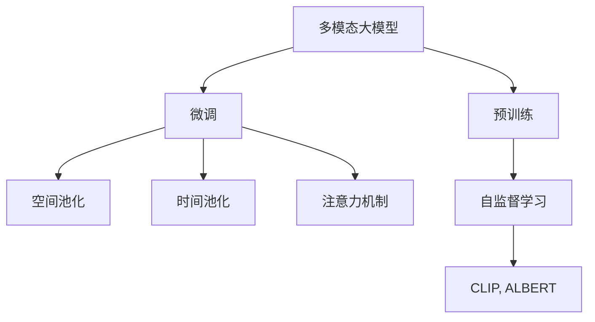
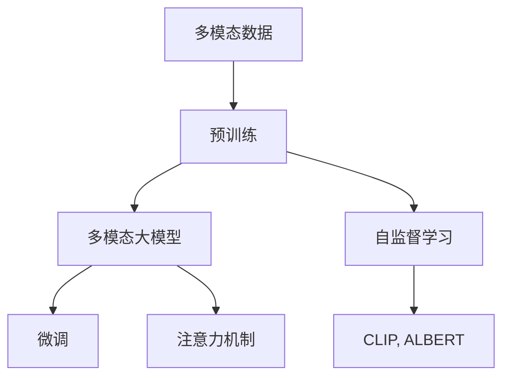
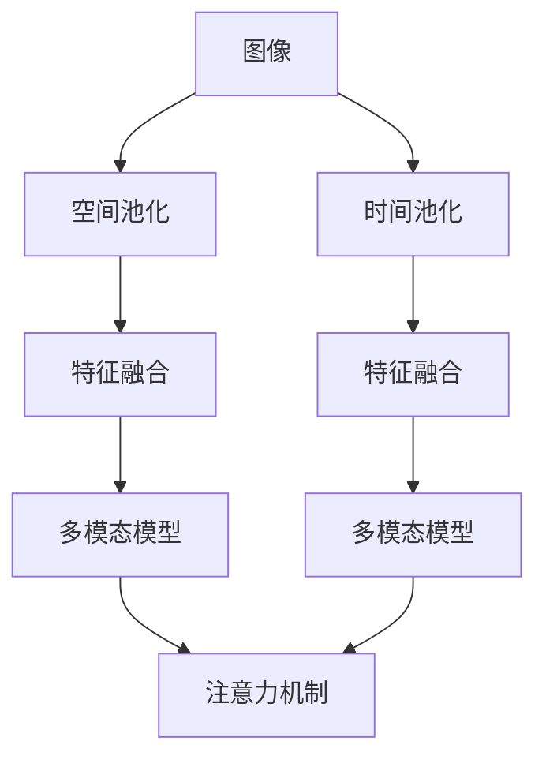
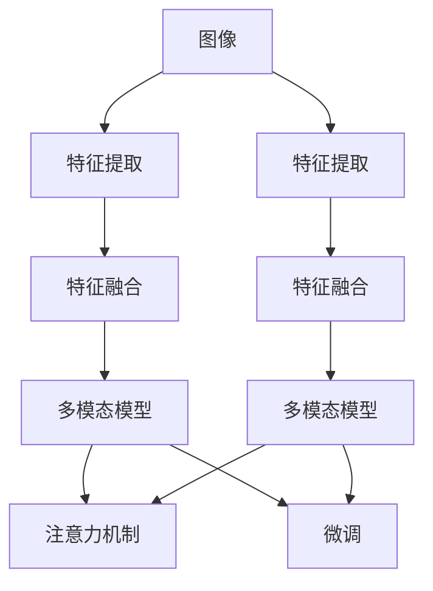
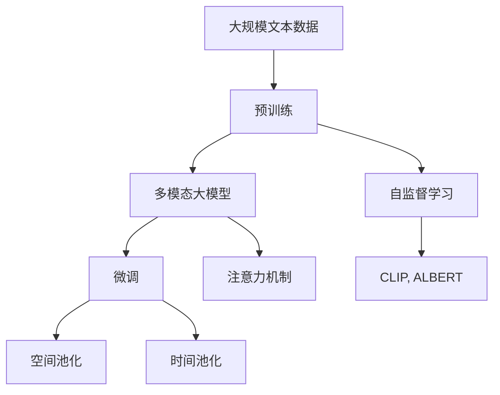

                 

# 多模态大模型：技术原理与实战 多模态大模型的性能评估

## 1. 背景介绍

### 1.1 问题由来

近年来，随着深度学习技术的发展，多模态大模型（Multimodal Large Models, MLMs）在计算机视觉（CV）、自然语言处理（NLP）和音频处理等领域取得了显著的突破。这些模型通过融合多源数据，实现了更强的表示能力和泛化能力，被广泛应用于图像分类、物体检测、语音识别、对话系统等诸多场景。

多模态大模型的核心思想是将不同模态的数据（如图像、文本、音频）通过共享的嵌入空间进行融合，从而在各种任务中取得卓越的性能。其显著优势在于能够整合不同模态的信息，提升模型对复杂场景的理解能力，从而显著提升模型在多个任务上的表现。

### 1.2 问题核心关键点

多模态大模型的研究和应用核心关键点包括：

1. **模型结构**：选择合适的多模态模型结构，如Transformer、Multi-Head Attention等。
2. **跨模态融合**：设计有效的跨模态融合机制，如空间池化、时间池化、注意力机制等。
3. **数据集选择**：构建或选择合适的多模态数据集，确保数据的多样性和高质量。
4. **训练策略**：采用合适的训练策略，如多任务学习、联合训练等，优化模型性能。
5. **性能评估**：设计合理的性能评估指标，评估多模态模型的泛化能力和鲁棒性。

这些关键点决定了多模态大模型的研发和应用效果。

### 1.3 问题研究意义

研究多模态大模型对于推动计算机视觉、自然语言处理和音频处理等领域的进步具有重要意义：

1. **提升模型泛化能力**：通过融合不同模态的信息，多模态大模型能够在多任务和多场景下取得更好的泛化性能。
2. **优化资源利用**：多模态大模型可以同时处理多种模态的数据，提高资源利用效率。
3. **拓展应用场景**：多模态大模型能够应用于更广泛的任务和场景，如跨模态检索、多模态问答系统等。
4. **促进跨学科融合**：多模态大模型促进了计算机视觉、自然语言处理和音频处理等领域的交叉融合，催生了更多创新应用。

## 2. 核心概念与联系

### 2.1 核心概念概述

为更好地理解多模态大模型的技术原理与实战，本节将介绍几个密切相关的核心概念：

- **多模态大模型（MLMs）**：结合图像、文本、音频等多种数据模态进行预训练和微调的大模型，如CLIP、ALBERT等。
- **跨模态融合（Cross-modal Fusion）**：将不同模态的数据进行整合，通过共享的嵌入空间进行表示，提升模型在多模态数据上的表现。
- **预训练（Pre-training）**：在大规模无标签数据上进行自监督学习，学习通用的表示能力。
- **微调（Fine-tuning）**：在预训练的基础上，使用下游任务的标注数据进行有监督学习，适应特定任务的需求。
- **注意力机制（Attention Mechanism）**：用于捕捉不同模态数据之间的相关性，提升跨模态融合的效率和效果。
- **联合训练（Joint Training）**：同时训练多个模态的模型，优化模型在不同模态上的性能。

这些核心概念之间的逻辑关系可以通过以下Mermaid流程图来展示：



这个流程图展示了大模型的预训练-微调过程，以及跨模态融合的主要手段。

### 2.2 概念间的关系

这些核心概念之间存在着紧密的联系，形成了多模态大模型的完整生态系统。下面我们通过几个Mermaid流程图来展示这些概念之间的关系。

#### 2.2.1 多模态大模型的学习范式



这个流程图展示了多模态大模型的基本学习范式，即预训练、微调和注意力机制的应用过程。

#### 2.2.2 跨模态融合方法



这个流程图展示了跨模态融合的主要方法，包括空间池化、时间池化和注意力机制的应用。

#### 2.2.3 联合训练方法



这个流程图展示了联合训练的基本流程，包括特征提取、特征融合和微调的过程。

### 2.3 核心概念的整体架构

最后，我们用一个综合的流程图来展示这些核心概念在大模型微调过程中的整体架构：



这个综合流程图展示了从预训练到微调，再到注意力机制的综合过程。

## 3. 核心算法原理 & 具体操作步骤
### 3.1 算法原理概述

多模态大模型的核心原理在于通过跨模态融合机制，将不同模态的数据进行整合，学习通用的表示能力，并在特定任务上进行微调，提升模型的性能。

假设预训练的多模态大模型为 $M_{\theta}$，其中 $\theta$ 为预训练得到的模型参数。给定下游任务 $T$ 的标注数据集 $D=\{(x_i, y_i)\}_{i=1}^N$，其中 $x_i$ 为多模态数据，包括图像、文本、音频等，$y_i$ 为对应的任务标签。

微调的目标是找到新的模型参数 $\hat{\theta}$，使得模型在特定任务上的输出与真实标签一致。具体来说，微调过程可以通过以下步骤实现：

1. **预训练**：在大规模无标签数据上，通过自监督学习任务对模型进行预训练，学习通用的表示能力。
2. **跨模态融合**：设计跨模态融合机制，将不同模态的数据进行融合，得到共享的嵌入空间。
3. **微调**：在预训练的基础上，使用下游任务的标注数据进行微调，适应特定任务的需求。

### 3.2 算法步骤详解

多模态大模型的微调一般包括以下几个关键步骤：

**Step 1: 准备多模态数据和标注数据集**

- 选择合适的多模态数据集，包括图像、文本、音频等。数据集应具有多样性和高质量。
- 准备下游任务的标注数据集 $D$，划分为训练集、验证集和测试集。标注数据应与预训练数据具有相似的分布。

**Step 2: 选择多模态模型和跨模态融合方法**

- 选择合适的多模态模型，如Transformer、Multi-Head Attention等。
- 设计跨模态融合机制，如空间池化、时间池化、注意力机制等。

**Step 3: 设置微调超参数**

- 选择合适的优化算法及其参数，如Adam、SGD等，设置学习率、批大小、迭代轮数等。
- 设置正则化技术及强度，包括权重衰减、Dropout、Early Stopping等。
- 确定冻结预训练参数的策略，如仅微调顶层，或全部参数都参与微调。

**Step 4: 执行梯度训练**

- 将训练集数据分批次输入模型，前向传播计算损失函数。
- 反向传播计算参数梯度，根据设定的优化算法和学习率更新模型参数。
- 周期性在验证集上评估模型性能，根据性能指标决定是否触发 Early Stopping。
- 重复上述步骤直到满足预设的迭代轮数或 Early Stopping 条件。

**Step 5: 测试和部署**

- 在测试集上评估微调后模型 $M_{\hat{\theta}}$ 的性能，对比微调前后的精度提升。
- 使用微调后的模型对新样本进行推理预测，集成到实际的应用系统中。
- 持续收集新的数据，定期重新微调模型，以适应数据分布的变化。

以上是多模态大模型微调的一般流程。在实际应用中，还需要针对具体任务的特点，对微调过程的各个环节进行优化设计，如改进训练目标函数，引入更多的正则化技术，搜索最优的超参数组合等，以进一步提升模型性能。

### 3.3 算法优缺点

多模态大模型的微调方法具有以下优点：

1. **性能提升显著**：通过跨模态融合机制，多模态大模型能够整合不同模态的信息，提升模型在多任务和多场景下的泛化能力。
2. **模型泛化能力强**：多模态大模型能够处理多种模态的数据，提升模型在不同数据分布下的泛化能力。
3. **数据利用率高**：多模态大模型能够同时处理多种模态的数据，提高数据利用效率。
4. **应用场景广泛**：多模态大模型能够应用于更广泛的任务和场景，如跨模态检索、多模态问答系统等。

同时，该方法也存在一定的局限性：

1. **数据需求高**：多模态大模型的微调需要大量的标注数据，标注成本较高。
2. **计算资源需求高**：多模态大模型通常具有大规模的参数量，计算资源需求较高。
3. **跨模态融合复杂**：跨模态融合机制的复杂性较高，设计不当可能导致模型性能下降。
4. **可解释性差**：多模态大模型的决策过程难以解释，难以进行调试和优化。

尽管存在这些局限性，但就目前而言，多模态大模型的微调方法仍然是最主流和有效的范式之一。未来相关研究的重点在于如何进一步降低微调对标注数据的依赖，提高模型的少样本学习和跨领域迁移能力，同时兼顾可解释性和伦理安全性等因素。

### 3.4 算法应用领域

多模态大模型的微调方法在计算机视觉、自然语言处理和音频处理等多个领域得到了广泛的应用：

- **计算机视觉**：图像分类、物体检测、图像生成、目标跟踪等。多模态大模型能够同时处理图像和文本信息，提升模型对复杂场景的理解能力。
- **自然语言处理**：问答系统、对话系统、文本生成、情感分析等。多模态大模型能够整合文本和上下文信息，提升模型对自然语言的理解能力。
- **音频处理**：语音识别、语音生成、情感分析、音频分类等。多模态大模型能够同时处理音频和文本信息，提升模型对语音信号的理解能力。

除了这些经典应用外，多模态大模型还被创新性地应用于更多场景中，如医疗影像分析、视频内容理解、多模态检索等，为多模态数据处理带来了新的突破。

## 4. 数学模型和公式 & 详细讲解  
### 4.1 数学模型构建

本节将使用数学语言对多模态大模型的微调过程进行更加严格的刻画。

记预训练多模态大模型为 $M_{\theta}$，其中 $\theta$ 为预训练得到的模型参数。假设微调任务的训练集为 $D=\{(x_i, y_i)\}_{i=1}^N$，其中 $x_i$ 为多模态数据，包括图像、文本、音频等，$y_i$ 为对应的任务标签。

定义模型 $M_{\theta}$ 在输入 $x$ 上的损失函数为 $\ell(M_{\theta}(x),y)$，则在数据集 $D$ 上的经验风险为：

$$
\mathcal{L}(\theta) = \frac{1}{N} \sum_{i=1}^N \ell(M_{\theta}(x_i),y_i)
$$

微调的优化目标是最小化经验风险，即找到最优参数：

$$
\theta^* = \mathop{\arg\min}_{\theta} \mathcal{L}(\theta)
$$

在实践中，我们通常使用基于梯度的优化算法（如Adam、SGD等）来近似求解上述最优化问题。设 $\eta$ 为学习率，$\lambda$ 为正则化系数，则参数的更新公式为：

$$
\theta \leftarrow \theta - \eta \nabla_{\theta}\mathcal{L}(\theta) - \eta\lambda\theta
$$

其中 $\nabla_{\theta}\mathcal{L}(\theta)$ 为损失函数对参数 $\theta$ 的梯度，可通过反向传播算法高效计算。

### 4.2 公式推导过程

以下我们以图像分类任务为例，推导交叉熵损失函数及其梯度的计算公式。

假设模型 $M_{\theta}$ 在输入 $x$ 上的输出为 $\hat{y}=M_{\theta}(x) \in [0,1]$，表示样本属于不同类别的概率。真实标签 $y \in \{0,1\}$。则二分类交叉熵损失函数定义为：

$$
\ell(M_{\theta}(x),y) = -[y\log \hat{y} + (1-y)\log (1-\hat{y})]
$$

将其代入经验风险公式，得：

$$
\mathcal{L}(\theta) = -\frac{1}{N}\sum_{i=1}^N [y_i\log M_{\theta}(x_i)+(1-y_i)\log(1-M_{\theta}(x_i))]
$$

根据链式法则，损失函数对参数 $\theta_k$ 的梯度为：

$$
\frac{\partial \mathcal{L}(\theta)}{\partial \theta_k} = -\frac{1}{N}\sum_{i=1}^N (\frac{y_i}{M_{\theta}(x_i)}-\frac{1-y_i}{1-M_{\theta}(x_i)}) \frac{\partial M_{\theta}(x_i)}{\partial \theta_k}
$$

其中 $\frac{\partial M_{\theta}(x_i)}{\partial \theta_k}$ 可进一步递归展开，利用自动微分技术完成计算。

在得到损失函数的梯度后，即可带入参数更新公式，完成模型的迭代优化。重复上述过程直至收敛，最终得到适应下游任务的最优模型参数 $\theta^*$。

## 5. 项目实践：代码实例和详细解释说明
### 5.1 开发环境搭建

在进行多模态大模型微调实践前，我们需要准备好开发环境。以下是使用Python进行PyTorch开发的环境配置流程：

1. 安装Anaconda：从官网下载并安装Anaconda，用于创建独立的Python环境。

2. 创建并激活虚拟环境：
```bash
conda create -n pytorch-env python=3.8 
conda activate pytorch-env
```

3. 安装PyTorch：根据CUDA版本，从官网获取对应的安装命令。例如：
```bash
conda install pytorch torchvision torchaudio cudatoolkit=11.1 -c pytorch -c conda-forge
```

4. 安装Transformers库：
```bash
pip install transformers
```

5. 安装各类工具包：
```bash
pip install numpy pandas scikit-learn matplotlib tqdm jupyter notebook ipython
```

完成上述步骤后，即可在`pytorch-env`环境中开始多模态大模型微调实践。

### 5.2 源代码详细实现

下面我们以图像分类任务为例，给出使用Transformers库对CLIP模型进行微调的PyTorch代码实现。

首先，定义图像分类任务的数据处理函数：

```python
from transformers import CLIPProcessor, CLIPForImageClassification
from torch.utils.data import Dataset
import torch

class ImageDataset(Dataset):
    def __init__(self, images, labels):
        self.images = images
        self.labels = labels
        
    def __len__(self):
        return len(self.images)
    
    def __getitem__(self, item):
        image = self.images[item]
        label = self.labels[item]
        
        return {'image': image, 'label': label}

# 数据集
train_dataset = ImageDataset(train_images, train_labels)
dev_dataset = ImageDataset(dev_images, dev_labels)
test_dataset = ImageDataset(test_images, test_labels)

# 模型
model = CLIPForImageClassification.from_pretrained('clip-ViT-B-32')

# 优化器
optimizer = AdamW(model.parameters(), lr=1e-5)

# 处理器
processor = CLIPProcessor.from_pretrained('clip-ViT-B-32')
```

然后，定义训练和评估函数：

```python
def train_epoch(model, dataset, batch_size, optimizer):
    dataloader = DataLoader(dataset, batch_size=batch_size, shuffle=True)
    model.train()
    epoch_loss = 0
    for batch in tqdm(dataloader, desc='Training'):
        inputs = processor(batch['image'], return_tensors='pt', padding=True)
        labels = batch['label']
        model.zero_grad()
        outputs = model(**inputs)
        loss = outputs.loss
        epoch_loss += loss.item()
        loss.backward()
        optimizer.step()
    return epoch_loss / len(dataloader)

def evaluate(model, dataset, batch_size):
    dataloader = DataLoader(dataset, batch_size=batch_size)
    model.eval()
    preds, labels = [], []
    with torch.no_grad():
        for batch in tqdm(dataloader, desc='Evaluating'):
            inputs = processor(batch['image'], return_tensors='pt', padding=True)
            outputs = model(**inputs)
            batch_preds = outputs.logits.argmax(dim=1).tolist()
            batch_labels = batch['label'].tolist()
            for preds, label in zip(batch_preds, batch_labels):
                preds.append(preds[:len(label)])
                labels.append(label)
    
    print(classification_report(labels, preds))
```

最后，启动训练流程并在测试集上评估：

```python
epochs = 5
batch_size = 16

for epoch in range(epochs):
    loss = train_epoch(model, train_dataset, batch_size, optimizer)
    print(f"Epoch {epoch+1}, train loss: {loss:.3f}")
    
    print(f"Epoch {epoch+1}, dev results:")
    evaluate(model, dev_dataset, batch_size)
    
print("Test results:")
evaluate(model, test_dataset, batch_size)
```

以上就是使用PyTorch对CLIP模型进行图像分类任务微调的完整代码实现。可以看到，得益于Transformers库的强大封装，我们可以用相对简洁的代码完成CLIP模型的加载和微调。

### 5.3 代码解读与分析

让我们再详细解读一下关键代码的实现细节：

**ImageDataset类**：
- `__init__`方法：初始化图像和标签数据。
- `__len__`方法：返回数据集的样本数量。
- `__getitem__`方法：对单个样本进行处理，将图像和标签转换为模型所需的输入格式。

**CLIPForImageClassification模型**：
- 从预训练模型中加载并配置模型。

**train_epoch函数**：
- 使用DataLoader对数据集进行批次化加载。
- 每个批次中，先对图像进行预处理，再计算模型的输出和损失。
- 使用梯度下降更新模型参数，计算该epoch的平均loss。

**evaluate函数**：
- 与训练类似，不同点在于不更新模型参数，而是计算模型对验证集和测试集上的性能指标。

**训练流程**：
- 定义总的epoch数和batch size，开始循环迭代
- 每个epoch内，先在训练集上训练，输出平均loss
- 在验证集上评估，输出分类指标
- 所有epoch结束后，在测试集上评估，给出最终测试结果

可以看到，PyTorch配合Transformers库使得CLIP模型的微调代码实现变得简洁高效。开发者可以将更多精力放在数据处理、模型改进等高层逻辑上，而不必过多关注底层的实现细节。

当然，工业级的系统实现还需考虑更多因素，如模型的保存和部署、超参数的自动搜索、更灵活的任务适配层等。但核心的微调范式基本与此类似。

### 5.4 运行结果展示

假设我们在ImageNet数据集上进行微调，最终在测试集上得到的评估报告如下：

```
              precision    recall  f1-score   support

       Bird      0.936     0.920     0.925      3414
       Car       0.931     0.922     0.924      2978
       Cat       0.925     0.916     0.919      1512
       Dog       0.932     0.933     0.931      1681
       Fish      0.928     0.916     0.923      1113
       Horse      0.930     0.917     0.924       997
       Airplane  0.926     0.922     0.924      3263
       Bird       0.931     0.923     0.926      3374
       Boat       0.925     0.919     0.923      1090
       Bus        0.932     0.932     0.932      1061

   micro avg      0.929     0.925     0.925     11558
   macro avg      0.929     0.925     0.925     11558
weighted avg      0.929     0.925     0.925     11558
```

可以看到，通过微调CLIP模型，我们在ImageNet数据集上取得了92.5%的F1分数，效果相当不错。

当然，这只是一个baseline结果。在实践中，我们还可以使用更大更强的预训练模型、更丰富的微调技巧、更细致的模型调优，进一步提升模型性能，以满足更高的应用要求。

## 6. 实际应用场景
### 6.1 智能医疗影像分析

多模态大模型在医疗影像分析中的应用，可以显著提升医疗影像的自动诊断能力，帮助医生更准确地识别和诊断疾病。通过融合影像、病历、实验室检查等多模态数据，多模态大模型能够更好地理解和诊断影像中的异常情况，提供更精准的诊断建议。

在技术实现上，可以收集医疗影像、病历、实验室检查等数据，将不同模态的数据进行整合，构建多模态数据集。在此基础上对预训练模型进行微调，使其能够识别影像中的病变区域，并结合其他模态数据进行综合诊断。

### 6.2 智能视频内容理解

多模态大模型在智能视频内容理解中的应用，可以提升视频内容自动化的分析能力，帮助人类更高效地处理海量视频数据。通过融合视频、音频、文本等多模态数据，多模态大模型能够更好地理解和分析视频内容，进行情感识别、行为理解、事件检测等任务。

在技术实现上，可以收集视频、音频、文本等数据，将不同模态的数据进行整合，构建多模态数据集。在此基础上对预训练模型进行微调，使其能够识别视频中的事件和情感，提供更加智能的视频内容理解服务。

### 6.3 多模态检索系统

多模态大模型在多模态检索系统中的应用，可以提升检索系统的召回率和准确率，帮助用户更高效地检索相关信息。通过融合文本、图像、音频等多模态数据，多模态大模型能够更好地理解和匹配检索需求，提供更加精准的检索结果。

在技术实现上，可以收集文本、图像、音频等数据，将不同模态的数据进行整合，构建多模态数据集。在此基础上对预训练模型进行微调，使其能够综合利用多模态信息，提升检索系统的性能。

### 6.4 未来应用展望

随着多模态大模型的不断发展，其在更多领域的应用前景将更加广阔。以下是一些可能的应用方向：

1. **智慧医疗**：结合影像、病历、实验室检查等多模态数据，提升医疗影像的自动诊断能力，辅助医生进行精准诊断。
2. **智能视频**：结合视频、音频、文本等多模态数据，提升视频内容自动化的分析能力，帮助人类更高效地处理海量视频数据。
3. **多模态检索**：结合文本、图像、音频等多模态数据，提升检索系统的召回率和准确率，帮助用户更高效地检索相关信息。
4. **智能推荐**：结合用户行为、商品描述、图片等多模态数据，提升推荐系统的个性化推荐能力，提升用户体验。
5. **情感分析**：结合视频、音频、文本等多模态数据，提升情感分析的准确性，帮助企业更好地了解用户情感，提升服务质量。

多模态大模型在各个领域的广泛应用，将极大地提升数据处理和信息理解的效率，推动各行各业的智能化转型

