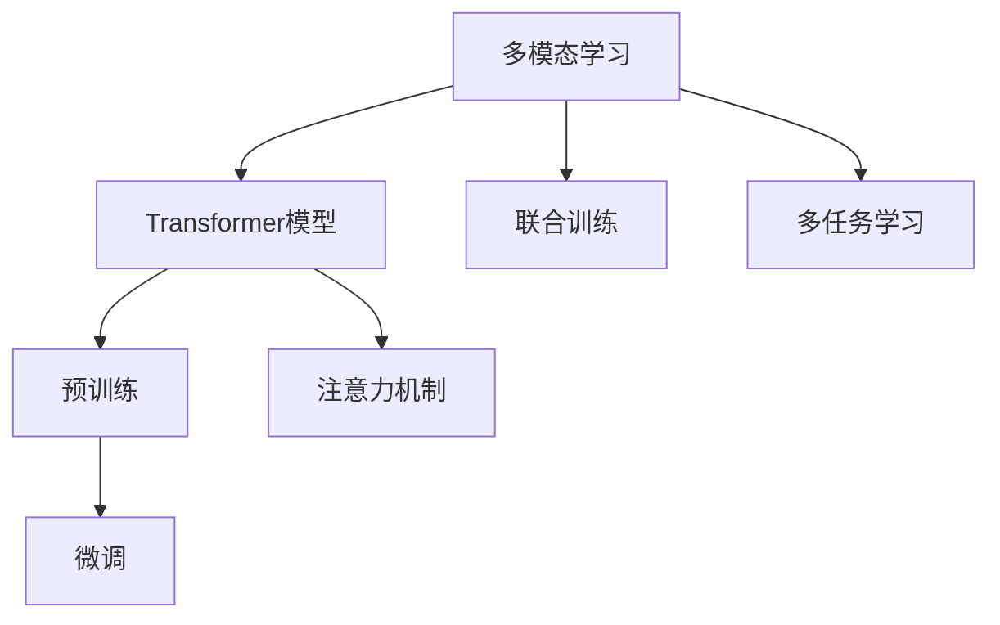
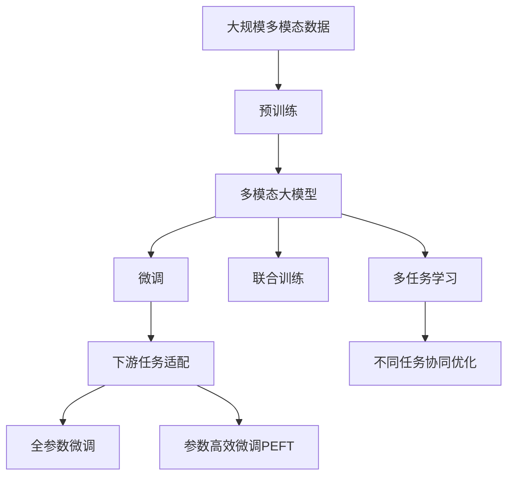

                 

# 多模态大模型：技术原理与实战 应用背景

> 关键词：多模态大模型, 技术原理, 实战应用, 模型架构, 模型训练, 模型优化

## 1. 背景介绍

### 1.1 问题由来
多模态大模型(multimodal large models)作为一种新的深度学习模型，融合了文本、图像、音频等多种模态的信息，具有更强大的表征和推理能力。其背后的核心理论和技术，如注意力机制、Transformer、预训练和微调等，已经广泛应用于自然语言处理(NLP)、计算机视觉(CV)、语音识别(SR)等多个领域，推动了人工智能技术的全面进步。

### 1.2 问题核心关键点
1. **多模态数据融合**：不同模态的数据往往具有不同的表示形式和语义空间，如何将这些数据有效融合，是一个核心问题。
2. **多任务联合学习**：多模态模型往往需要同时完成多种任务，如何在联合训练中优化不同任务的性能，是一大难点。
3. **模型架构设计**：多模态模型通常基于Transformer等架构，设计合理的模型结构是实现高性能的基础。
4. **训练和优化策略**：多模态数据具有不同的特征空间，如何在多模态数据上进行有效的训练和优化，需要考虑多方面的因素。
5. **实际应用场景**：多模态模型在图像、语音、文本等多样化的应用场景中表现优异，具有广泛的应用前景。

### 1.3 问题研究意义
研究多模态大模型及其融合技术，对于拓展AI模型的应用边界，提升模型的多任务性能，推动不同领域技术的交叉融合，具有重要意义：

1. **提升跨模态理解能力**：多模态模型能够理解不同模态的数据，增强其在复杂场景下的理解和推理能力。
2. **实现多任务协同优化**：多模态模型可以通过联合学习，同时提升多个任务的表现，提高资源利用效率。
3. **促进领域交叉应用**：多模态模型能够将图像、语音、文本等不同领域的数据和技术结合起来，推动不同领域的创新发展。
4. **提升用户体验**：多模态系统可以更好地理解和响应用户的多样化需求，提升人机交互的便捷性和自然性。
5. **拓展行业应用**：多模态技术在医疗、教育、娱乐等多个行业中得到了广泛应用，带来了新的商业模式和技术变革。

## 2. 核心概念与联系

### 2.1 核心概念概述

为了更好地理解多模态大模型的技术原理和实战应用，本节将介绍几个关键的多模态深度学习概念：

- **多模态学习(Multimodal Learning)**：涉及多种数据模态的联合学习，目标是通过多模态数据提升模型的泛化能力和表征能力。
- **Transformer模型**：基于自注意力机制的深度学习模型，在多模态融合和表征学习中发挥了重要作用。
- **预训练(Pre-training)**：指在大规模无标签数据上，通过自监督学习任务训练通用模型，获取基础表征。
- **微调(Fine-tuning)**：在预训练模型的基础上，使用下游任务的标注数据进行有监督微调，适应特定任务。
- **联合训练(Co-training)**：指多个模型同时训练，通过跨模态数据提高模型的多样性和泛化能力。
- **注意力机制(Attention)**：用于模型在多模态数据中识别和强调关键信息，增强特征提取和融合能力。
- **多任务学习(Multitask Learning)**：同一模型同时学习多个任务，提升模型在多个相关任务上的性能。

这些核心概念之间存在紧密的联系，形成了多模态深度学习的完整生态系统。通过理解这些核心概念，我们可以更好地把握多模态大模型的工作原理和优化方向。

### 2.2 概念间的关系

这些核心概念之间的关系可以通过以下Mermaid流程图来展示：



这个流程图展示了多模态深度学习的基本框架和流程：

1. 多模态学习涵盖多种数据模态的联合学习，以提升模型的泛化能力和表征能力。
2. Transformer模型是当前多模态融合的主流架构，通过自注意力机制增强特征提取。
3. 预训练和微调是模型的两个重要步骤，分别在无标签和有标签数据上进行学习。
4. 联合训练和多任务学习则是提升模型多样性和泛化能力的有效手段。
5. 注意力机制和多模态数据融合，是Transformer模型中重要的技术手段。

### 2.3 核心概念的整体架构

最后，我们用一个综合的流程图来展示这些核心概念在大模型微调过程中的整体架构：



这个综合流程图展示了从预训练到微调，再到联合训练和多任务学习的多模态深度学习过程。多模态大模型首先在大规模多模态数据上进行预训练，然后通过微调（包括全参数微调和参数高效微调）和多任务学习，适应不同下游任务，实现多任务的协同优化。

## 3. 核心算法原理 & 具体操作步骤
### 3.1 算法原理概述

多模态大模型的核心算法原理基于Transformer模型和自注意力机制，通过在多种数据模态上进行预训练和微调，学习到跨模态的表征。具体而言，多模态大模型通常包括以下几个步骤：

1. **数据预处理**：将不同模态的数据进行预处理，转换成标准格式，如将图像数据转换为张量，文本数据转换为token等。
2. **特征嵌入**：将预处理后的多模态数据分别映射到特征空间中，不同模态的数据经过特征嵌入后，具有相同或相似的特征空间。
3. **多模态融合**：将不同模态的特征进行融合，通过注意力机制，选择和强调关键信息。
4. **预训练**：在多模态数据上进行预训练，学习通用的表征和跨模态的特征映射。
5. **微调**：在特定下游任务上进行微调，调整顶层分类器或解码器，适应特定任务。
6. **联合训练**：同时训练多个模型，通过跨模态数据提高模型的多样性和泛化能力。
7. **多任务学习**：同一模型同时学习多个任务，提升模型在多个相关任务上的性能。

### 3.2 算法步骤详解

#### 3.2.1 数据预处理

数据预处理是多模态大模型的第一步。不同模态的数据需要经过预处理，转换为模型可以接受的标准格式。例如，对于图像数据，可以通过卷积神经网络(CNN)进行特征提取，生成高维的特征向量；对于文本数据，可以使用BERT等模型进行预训练，生成固定长度的嵌入向量。以下是使用TensorFlow对图像数据进行预处理的示例代码：

```python
import tensorflow as tf

# 加载图像数据
image_data = tf.keras.preprocessing.image.load_img('image.jpg', target_size=(224, 224))
image_array = tf.keras.preprocessing.image.img_to_array(image_data)
image_array = tf.expand_dims(image_array, axis=0)

# 标准化图像数据
image_array = tf.image.per_image_standardization(image_array)

# 添加批处理维度
image_array = tf.expand_dims(image_array, axis=0)

# 生成特征向量
image_tensor = tf.keras.applications.MobileNetV2().predict(image_array)
```

#### 3.2.2 特征嵌入

特征嵌入是将原始数据映射到特征空间的过程。多模态数据的特征嵌入通常使用嵌入层(Embedding Layer)实现。嵌入层的输入为整数序列，输出为固定长度的实数向量。例如，在BERT中，嵌入层的输入为token id序列，输出为token嵌入向量。以下是使用BERT进行特征嵌入的示例代码：

```python
from transformers import BertTokenizer, BertModel

# 加载BERT模型和分词器
tokenizer = BertTokenizer.from_pretrained('bert-base-uncased')
model = BertModel.from_pretrained('bert-base-uncased')

# 将文本转换为token id序列
text = "Hello, world!"
tokenized_text = tokenizer.tokenize(text)
token_ids = tokenizer.convert_tokens_to_ids(tokenized_text)

# 生成token嵌入向量
token_embeddings = model(token_ids)
```

#### 3.2.3 多模态融合

多模态融合是将不同模态的特征进行融合的过程。常用的融合方法包括拼接、加权平均、注意力机制等。其中，注意力机制可以有效地融合不同模态的特征，选择关键信息。以下是使用注意力机制进行多模态融合的示例代码：

```python
import torch
import torch.nn as nn

# 定义多模态融合模型
class MultimodalFusion(nn.Module):
    def __init__(self):
        super(MultimodalFusion, self).__init__()
        self.attention = nn.MultiheadAttention(embed_dim, num_heads)

    def forward(self, x1, x2):
        # 将两个模态的特征拼接
        x = torch.cat((x1, x2), dim=1)
        # 通过注意力机制融合特征
        attn_output, attn_weights = self.attention(x, x, x)
        # 返回融合后的特征
        return attn_output

# 定义模型
model = MultimodalFusion()

# 输入特征
x1 = torch.randn(1, 3)
x2 = torch.randn(1, 3)

# 融合特征
fusion_output = model(x1, x2)
```

#### 3.2.4 预训练

预训练是多模态大模型的核心步骤。通过在大规模无标签数据上训练模型，学习到通用的表征和跨模态的特征映射。常用的预训练方法包括掩码语言模型(Masked Language Model, MLM)、图像分类、目标检测等。以下是使用BERT进行掩码语言模型预训练的示例代码：

```python
from transformers import BertTokenizer, BertModel, AdamW

# 加载BERT模型和分词器
tokenizer = BertTokenizer.from_pretrained('bert-base-uncased')
model = BertModel.from_pretrained('bert-base-uncased')

# 定义预训练数据
texts = ["Hello, world!", "I am a computer scientist.", "This is a sample sentence."]

# 加载预训练数据
train_dataset = ...
val_dataset = ...
test_dataset = ...

# 定义训练器
optimizer = AdamW(model.parameters(), lr=2e-5)
epochs = 5
batch_size = 16

# 定义训练函数
def train_epoch(model, dataset, optimizer):
    model.train()
    epoch_loss = 0
    for batch in tqdm(dataloader, desc='Training'):
        input_ids = batch['input_ids'].to(device)
        attention_mask = batch['attention_mask'].to(device)
        labels = batch['labels'].to(device)
        model.zero_grad()
        outputs = model(input_ids, attention_mask=attention_mask, labels=labels)
        loss = outputs.loss
        epoch_loss += loss.item()
        loss.backward()
        optimizer.step()
    return epoch_loss / len(dataloader)

# 定义评估函数
def evaluate(model, dataset, batch_size):
    model.eval()
    preds, labels = [], []
    with torch.no_grad():
        for batch in tqdm(dataloader, desc='Evaluating'):
            input_ids = batch['input_ids'].to(device)
            attention_mask = batch['attention_mask'].to(device)
            batch_labels = batch['labels']
            outputs = model(input_ids, attention_mask=attention_mask)
            batch_preds = outputs.logits.argmax(dim=2).to('cpu').tolist()
            batch_labels = batch_labels.to('cpu').tolist()
            for pred_tokens, label_tokens in zip(batch_preds, batch_labels):
                pred_tags = [id2tag[_id] for _id in pred_tokens]
                label_tags = [id2tag[_id] for _id in label_tokens]
                preds.append(pred_tags[:len(label_tags)])
                labels.append(label_tags)

    print(classification_report(labels, preds))

# 训练预训练模型
device = torch.device('cuda') if torch.cuda.is_available() else torch.device('cpu')
model.to(device)

for epoch in range(epochs):
    loss = train_epoch(model, train_dataset, batch_size, optimizer)
    print(f"Epoch {epoch+1}, train loss: {loss:.3f}")

    print(f"Epoch {epoch+1}, val results:")
    evaluate(model, val_dataset, batch_size)

print("Test results:")
evaluate(model, test_dataset, batch_size)
```

#### 3.2.5 微调

微调是使用下游任务的少量标注数据进行有监督训练，优化模型在特定任务上的性能。通常只调整顶层分类器或解码器，并以较小的学习率更新全部或部分模型参数。以下是使用TensorFlow进行微调的示例代码：

```python
import tensorflow as tf

# 加载微调数据
train_dataset = ...
val_dataset = ...
test_dataset = ...

# 定义微调器
optimizer = tf.keras.optimizers.Adam(lr=2e-5)
epochs = 5
batch_size = 16

# 定义微调函数
def train_epoch(model, dataset, optimizer):
    model.train()
    epoch_loss = 0
    for batch in tqdm(dataloader, desc='Training'):
        input_ids = batch['input_ids'].to(device)
        attention_mask = batch['attention_mask'].to(device)
        labels = batch['labels'].to(device)
        model.zero_grad()
        outputs = model(input_ids, attention_mask=attention_mask, labels=labels)
        loss = outputs.loss
        epoch_loss += loss.item()
        loss.backward()
        optimizer.step()
    return epoch_loss / len(dataloader)

# 定义评估函数
def evaluate(model, dataset, batch_size):
    model.eval()
    preds, labels = [], []
    with tf.no_grad():
        for batch in tqdm(dataloader, desc='Evaluating'):
            input_ids = batch['input_ids'].to(device)
            attention_mask = batch['attention_mask'].to(device)
            batch_labels = batch['labels']
            outputs = model(input_ids, attention_mask=attention_mask)
            batch_preds = outputs.logits.argmax(dim=2).numpy()
            batch_labels = batch_labels.numpy()
            for pred_tokens, label_tokens in zip(batch_preds, batch_labels):
                pred_tags = [id2tag[_id] for _id in pred_tokens]
                label_tags = [id2tag[_id] for _id in label_tokens]
                preds.append(pred_tags[:len(label_tags)])
                labels.append(label_tags)

    print(classification_report(labels, preds))

# 训练微调模型
device = tf.device('cuda') if tf.cuda.is_available() else tf.device('cpu')
model = tf.keras.models.load_model('bert_base_uncased_pretrain.h5')
model.compile(optimizer=optimizer, loss='categorical_crossentropy', metrics=['accuracy'])

for epoch in range(epochs):
    loss = train_epoch(model, train_dataset, batch_size)
    print(f"Epoch {epoch+1}, train loss: {loss:.3f}")

    print(f"Epoch {epoch+1}, val results:")
    evaluate(model, val_dataset, batch_size)

print("Test results:")
evaluate(model, test_dataset, batch_size)
```

#### 3.2.6 联合训练

联合训练是将多个模型同时训练，通过跨模态数据提高模型的多样性和泛化能力。常用的联合训练方法包括联邦学习、分布式训练等。以下是使用联邦学习进行联合训练的示例代码：

```python
import tensorflow as tf
import federated_learning as fl

# 加载数据
train_dataset = ...
val_dataset = ...
test_dataset = ...

# 定义联合训练参数
client_count = ...
num_epochs = ...
batch_size = ...
learning_rate = ...

# 定义客户端
class Client:
    def __init__(self, data):
        self.data = data

    def get_data(self):
        return self.data

    def apply_gradients(self, gradients):
        pass

# 定义联邦学习
client_data = [Client(train_dataset), Client(val_dataset), Client(test_dataset)]
federated_learning_result = fl.federated_learning.learn(client_data, client_count, num_epochs, batch_size, learning_rate)

# 保存联合训练结果
tf.saved_model.save(model, export_dir='model')
```

#### 3.2.7 多任务学习

多任务学习是同一模型同时学习多个任务，提升模型在多个相关任务上的性能。常用的多任务学习方法包括多任务数据增强、多任务损失函数等。以下是使用多任务损失函数进行多任务学习的示例代码：

```python
import torch
import torch.nn as nn

# 定义多任务模型
class MultitaskModel(nn.Module):
    def __init__(self):
        super(MultitaskModel, self).__init__()
        self.classifier1 = nn.Linear(10, 5)
        self.classifier2 = nn.Linear(10, 5)

    def forward(self, x):
        x1 = self.classifier1(x)
        x2 = self.classifier2(x)
        return x1, x2

# 定义多任务损失函数
def multitask_loss(x1, x2, y1, y2):
    loss1 = nn.CrossEntropyLoss()(x1, y1)
    loss2 = nn.CrossEntropyLoss()(x2, y2)
    return loss1 + loss2

# 定义多任务模型和损失函数
model = MultitaskModel()
criterion = nn.CrossEntropyLoss()

# 定义训练器
optimizer = torch.optim.Adam(model.parameters(), lr=2e-5)

# 定义训练函数
def train_epoch(model, dataset, optimizer, criterion):
    model.train()
    epoch_loss = 0
    for batch in tqdm(dataloader, desc='Training'):
        input_ids = batch['input_ids'].to(device)
        attention_mask = batch['attention_mask'].to(device)
        labels1 = batch['labels1'].to(device)
        labels2 = batch['labels2'].to(device)
        model.zero_grad()
        outputs = model(input_ids, attention_mask=attention_mask)
        loss = criterion(outputs[0], labels1) + criterion(outputs[1], labels2)
        epoch_loss += loss.item()
        loss.backward()
        optimizer.step()
    return epoch_loss / len(dataloader)

# 定义评估函数
def evaluate(model, dataset, batch_size):
    model.eval()
    preds, labels = [], []
    with torch.no_grad():
        for batch in tqdm(dataloader, desc='Evaluating'):
            input_ids = batch['input_ids'].to(device)
            attention_mask = batch['attention_mask'].to(device)
            batch_labels1 = batch['labels1'].to(device)
            batch_labels2 = batch['labels2'].to(device)
            outputs = model(input_ids, attention_mask=attention_mask)
            batch_preds1 = outputs[0].argmax(dim=1).to('cpu').tolist()
            batch_preds2 = outputs[1].argmax(dim=1).to('cpu').tolist()
            batch_labels1 = batch_labels1.to('cpu').tolist()
            batch_labels2 = batch_labels2.to('cpu').tolist()
            for pred_tokens1, pred_tokens2, label_tokens1, label_tokens2 in zip(batch_preds1, batch_preds2, batch_labels1, batch_labels2):
                pred_tags1 = [id2tag[_id] for _id in pred_tokens1]
                pred_tags2 = [id2tag[_id] for _id in pred_tokens2]
                label_tags1 = [id2tag[_id] for _id in label_tokens1]
                label_tags2 = [id2tag[_id] for _id in label_tokens2]
                preds.append(pred_tags1)
                preds.append(pred_tags2)
                labels.append(label_tags1)
                labels.append(label_tags2)

    print(classification_report(labels[0], preds[0]))
    print(classification_report(labels[1], preds[1]))

# 训练多任务模型
device = torch.device('cuda') if torch.cuda.is_available() else torch.device('cpu')
model.to(device)

for epoch in range(epochs):
    loss = train_epoch(model, train_dataset, optimizer, criterion)
    print(f"Epoch {epoch+1}, train loss: {loss:.3f}")

    print(f"Epoch {epoch+1}, val results:")
    evaluate(model, val_dataset, batch_size)

print("Test results:")
evaluate(model, test_dataset, batch_size)
```

### 3.3 算法优缺点

多模态大模型具有以下优点：

1. **跨模态表征能力**：多模态模型能够理解不同模态的数据，提升模型在复杂场景下的理解和推理能力。
2. **联合学习效果**：通过联合训练和多任务学习，多模态模型可以提升模型的多样性和泛化能力，提高资源利用效率。
3. **高效数据利用**：多模态模型能够将多种数据模态进行融合，提高数据利用效率，减少对单一数据模态的依赖。
4. **灵活任务适配**：多模态模型可以通过微调适应不同的下游任务，增强模型的通用性和适应性。

同时，多模态大模型也存在一些缺点：

1. **计算复杂度高**：多模态模型的计算复杂度高，需要较强的硬件支持，如高性能GPU或TPU。
2. **数据获取困难**：不同模态的数据获取难度较大，尤其是在多模态融合中，需要高质量的多模态数据。
3. **模型结构复杂**：多模态模型的结构较为复杂，需要更多的训练数据和计算资源，调试和优化难度较大。
4. **解释性不足**：多模态模型的决策过程难以解释，缺乏可解释性。

### 3.4 算法应用领域

多模态大模型在多个领域得到了广泛应用，包括：

1. **医疗影像分析**：通过融合CT、MRI等影像数据和病人信息，多模态模型能够更准确地诊断疾病，提高医疗水平。
2. **智能监控**：通过融合视频、音频等多模态数据，智能监控系统能够更全面地检测异常行为，保障公共安全。
3. **智能推荐系统**：通过融合用户画像、商品信息等，多模态模型能够提供更个性化、精准的推荐服务。
4. **智能驾驶**：通过融合激光雷达、摄像头、雷达等多模态数据，智能驾驶系统能够更安全、准确地进行环境感知和决策。
5. **智能家居**：通过融合语音、图像、传感器等多模态数据，智能家居系统能够更智能地响应用户需求，提升用户体验。
6. **虚拟现实**：通过融合视觉、听觉、触觉等多模态数据，虚拟现实系统能够更自然、真实地模拟现实场景。

多模态大模型在多个领域展示了其强大的应用潜力，未来将在更多场景中得到应用，为各行各业带来新的变革和创新。

## 4. 数学模型和公式 & 详细讲解 & 举例说明

### 4.1 数学模型构建

多模态大模型的数学模型构建需要考虑不同模态数据的表示和融合。假设多模态数据集包含图像 $\mathcal{X}_I$、文本 $\mathcal{X}_T$、音频 $\mathcal{X}_A$ 等，其特征嵌入分别表示为 $\mathbf{X}_I \in \mathbb{R}^{m_I \times n_I}$、$\mathbf{X}_T \in \mathbb{R}^{m_T \times n_T}$、$\mathbf{X}_A \in \mathbb{R}^{m_A \times n_A}$，其中 $m$ 表示模态数，$n$ 表示样本数。

### 4.2 公式推导过程

#### 4.2.1 特征嵌入

多模态数据的特征嵌入通常使用嵌入层(Embedding Layer)实现，将整数序列映射为固定长度的实数向量。假设文本数据嵌入后的向量表示为 $\mathbf{X}_T \in \mathbb{R}^{m_T \times n_T}$，其中 $m_T$ 表示词汇表大小，$n_T$ 表示样本数。对于图像数据，通常使用卷积神经网络(CNN)进行特征提取，生成高维的特征向量。假设图像数据嵌入后的向量表示为 $\mathbf{X}_I \in \mathbb{R}^{m_I \times n_I}$，其中 $m_I$ 表示特征维度，$n_I$ 表示样本数。

#### 4.2.2 多模态融合

多模态融合是将不同模态的特征进行融合的过程。常用的融合方法包括拼接、加权平均、注意力机制等。以注意力机制为例，假设融合后的特征向量表示为 $\mathbf{X}_F \in \mathbb{R}^{m_F \times n_F}$，其中 $m_F$ 表示融合后的特征维度，$n_F$ 表示样本数。注意力机制可以通过以下公式实现：

$$
\mathbf{A} = \mathbf{X}_T \mathbf{W}_T^T \mathbf{X}_I \mathbf{W}_I^T + \mathbf{X}_A \mathbf{W}_A^T \mathbf{X}_I \mathbf{W}_I^T
$$

其中 $\mathbf{W}_T^T$、$\mathbf{W}_I^T$、$\mathbf{W}_A^T$ 分别表示文本、图像、音频嵌入层的权重矩阵。通过注意力机制，多模态模型能够选择和强调关键信息，提升特征融合的效果。

#### 4.2.3 预训练

预训练是多模态大模型的核心步骤。假设预训练模型为 $\mathbf{X}_P \in \mathbb{R}^{m_P \times n_P}$，其中 $m

