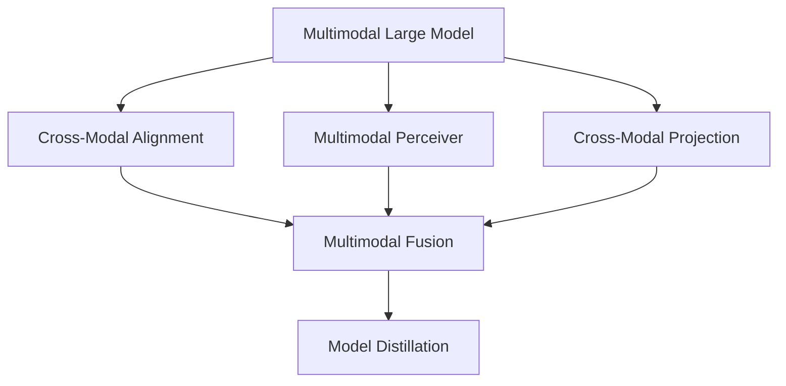
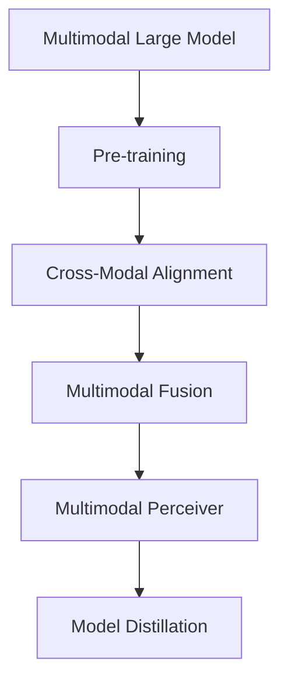
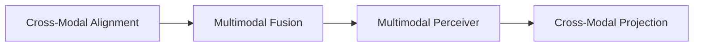
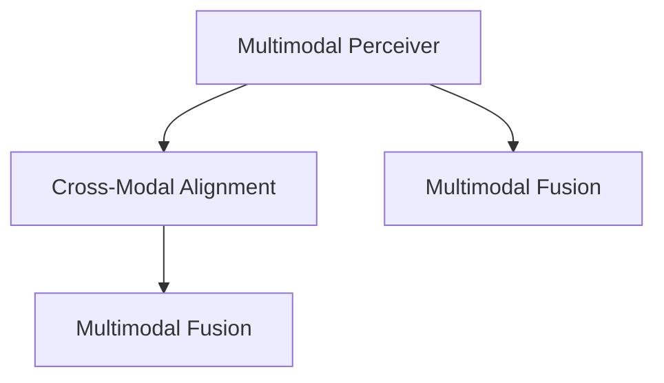

                 

# 多模态大模型：技术原理与实战 智能顾问

> 关键词：多模态大模型,技术原理,实战应用,智能顾问,多模态学习

## 1. 背景介绍

### 1.1 问题由来
近年来，随着深度学习技术的快速发展，尤其是基于Transformer的预训练语言模型，如BERT、GPT-3等，在自然语言处理(NLP)领域取得了巨大的突破。这些模型通过在大规模无标签文本数据上进行预训练，学习到了丰富的语言知识和常识，从而具备强大的语言理解和生成能力。然而，这些预训练模型主要基于单一的文本数据，无法充分利用现实世界的多模态信息，如文本、图像、视频、音频等。

多模态大模型通过融合多模态数据，扩展了预训练模型的应用边界，能够在图像、视频、语音等模态中提取并整合信息，显著提升了模型的智能水平。然而，多模态学习涉及复杂的跨模态对齐和融合算法，技术复杂度较高，实际应用中存在诸多挑战。

### 1.2 问题核心关键点
多模态大模型的核心挑战在于如何高效地将不同模态的数据进行对齐和融合，从而提取更高层次的语义和知识表示。当前主流的跨模态学习算法包括基于注意力机制的Transformer跨模态模型、基于多模态感知器的多模态神经网络、以及基于跨模态投影的多模态机器学习等。

多模态大模型在图像、视频、语音等模态的应用上，取得了显著效果，例如在医学影像诊断、智能交互系统、智能监控等方面，大幅提升了任务的性能和效率。然而，由于模态间的数据分布和表示方式差异较大，多模态学习仍面临诸多挑战，如：

- 跨模态对齐困难：不同模态的数据在语义和结构上存在较大差异，如何对齐并融合这些数据是一个复杂问题。
- 模型泛化能力不足：多模态模型往往在特定任务上表现优异，但对新任务的泛化能力较弱。
- 数据标注成本高：多模态学习需要同时标注多模态数据，成本较高。
- 模型推理效率低：多模态模型通常规模较大，推理速度较慢，难以满足实时性需求。

## 2. 核心概念与联系

### 2.1 核心概念概述

为更好地理解多模态大模型的技术原理和应用，本节将介绍几个密切相关的核心概念：

- 多模态大模型(Multimodal Large Model, MLM)：以自回归或自编码模型为代表的大规模预训练多模态模型。通过在大规模无标签多模态数据上进行预训练，学习通用的多模态表示，具备强大的多模态理解和生成能力。

- 跨模态对齐(Cross-Modal Alignment)：将不同模态的数据进行对齐，使得各个模态的信息能够互相补充，形成一致的语义表示。跨模态对齐是实现多模态学习的基础。

- 多模态感知器(Multimodal Perceiver)：一种基于Transformer的多模态学习架构，通过自监督方式，学习跨模态表示的对齐关系，实现多模态数据的融合。

- 跨模态投影(Cross-Modal Projection)：将不同模态的数据投影到相同的语义空间，从而实现跨模态信息的对齐和融合。

- 多模态融合(Multimodal Fusion)：通过聚合不同模态的信息，形成更高层次的语义和知识表示。多模态融合是实现多模态智能的核心。

- 模型蒸馏(Model Distillation)：将复杂的多模态模型知识，蒸馏到一个规模较小的模型中，以降低计算复杂度和提高推理速度。

这些核心概念之间的逻辑关系可以通过以下Mermaid流程图来展示：



这个流程图展示了大模态模型和跨模态学习的主要概念及其之间的关系：

1. 多模态大模型通过预训练学习通用的多模态表示。
2. 跨模态对齐将不同模态的数据进行对齐，形成一致的语义表示。
3. 多模态感知器通过自监督方式，学习跨模态表示的对齐关系。
4. 跨模态投影将不同模态的数据投影到相同的语义空间，实现信息对齐。
5. 多模态融合通过聚合不同模态的信息，形成更高层次的语义和知识表示。
6. 模型蒸馏将复杂的多模态模型知识，蒸馏到一个规模较小的模型中，以降低计算复杂度。

### 2.2 概念间的关系

这些核心概念之间存在着紧密的联系，形成了多模态大模型的完整生态系统。下面我通过几个Mermaid流程图来展示这些概念之间的关系。

#### 2.2.1 多模态大模型的学习范式



这个流程图展示了大模态模型通过预训练和多模态学习的基本原理，以及如何通过跨模态对齐、多模态融合、多模态感知器和模型蒸馏等技术，实现多模态数据的整合和高效推理。

#### 2.2.2 跨模态对齐与融合的关系



这个流程图展示了跨模态对齐和多模态融合的紧密关系。跨模态对齐是实现多模态融合的基础，而多模态融合则是跨模态对齐的最终目的。

#### 2.2.3 多模态感知器的功能



这个流程图展示了多模态感知器通过自监督方式，学习跨模态表示的对齐关系，并将不同模态的信息进行融合。多模态感知器是实现多模态学习的重要组件。

## 3. 核心算法原理 & 具体操作步骤
### 3.1 算法原理概述

多模态大模型的核心算法原理基于Transformer架构，通过在大规模无标签多模态数据上进行自监督预训练，学习跨模态表示的对齐关系和融合机制。具体步骤如下：

1. 预训练：在大规模无标签多模态数据上进行预训练，学习通用的多模态表示。
2. 跨模态对齐：通过自监督方式，学习不同模态数据间的对齐关系。
3. 多模态融合：将不同模态的信息进行聚合，形成更高层次的语义和知识表示。
4. 模型蒸馏：通过知识蒸馏等技术，将复杂的多模态模型知识，蒸馏到一个规模较小的模型中，以降低计算复杂度和提高推理速度。

### 3.2 算法步骤详解

多模态大模型的算法步骤如下：

1. **预训练**：在大规模无标签多模态数据集上进行自监督预训练，学习通用的多模态表示。常用的预训练任务包括掩码语言模型、掩码视觉模型、自编码器等。

2. **跨模态对齐**：通过自监督方式，学习不同模态数据间的对齐关系。常用的方法包括跨模态对比学习、跨模态对齐损失、跨模态信息传递网络等。

3. **多模态融合**：将不同模态的信息进行聚合，形成更高层次的语义和知识表示。常用的融合方法包括特征加权、注意力机制、跨模态池化等。

4. **模型蒸馏**：通过知识蒸馏等技术，将复杂的多模态模型知识，蒸馏到一个规模较小的模型中，以降低计算复杂度和提高推理速度。常用的蒸馏方法包括软标签蒸馏、特征蒸馏、结构蒸馏等。

### 3.3 算法优缺点

多模态大模型具有以下优点：
- 强大的多模态理解能力：通过融合多模态数据，模型具备更丰富的语义和知识表示。
- 泛化能力更强：多模态模型在特定任务上表现优异，且具备较强的跨模态泛化能力。
- 更强的适应性：多模态模型能够适应不同模态的数据，拓展了模型应用范围。

同时，多模态大模型也存在一些缺点：
- 数据标注成本高：多模态学习需要同时标注多模态数据，成本较高。
- 计算复杂度高：多模态模型通常规模较大，计算复杂度高。
- 推理速度较慢：多模态模型推理速度较慢，难以满足实时性需求。

### 3.4 算法应用领域

多模态大模型已经在医疗影像诊断、智能交互系统、智能监控、视频推荐等多个领域取得了显著成果。以下是几个典型的应用场景：

- **医疗影像诊断**：利用多模态大模型对医学影像和报告进行融合，提升诊断的准确性和效率。
- **智能交互系统**：将多模态大模型应用于语音识别、文本生成、情感分析等任务，构建智能交互系统。
- **智能监控**：利用多模态大模型对视频和音频进行融合，实现实时监控和异常检测。
- **视频推荐**：将多模态大模型应用于视频内容推荐，通过融合视频、文本、用户行为等信息，提高推荐效果。

此外，多模态大模型还广泛应用于智能家居、智能交通、智能城市等多个场景，为智慧城市建设提供了强大的技术支撑。

## 4. 数学模型和公式 & 详细讲解  
### 4.1 数学模型构建

本节将使用数学语言对多模态大模型的基本架构进行更加严格的刻画。

记多模态大模型为 $M_{\theta}=\{M_{\theta}^{text}, M_{\theta}^{img}, M_{\theta}^{audio}\}$，其中 $M_{\theta}^{text}$、$M_{\theta}^{img}$、$M_{\theta}^{audio}$ 分别表示文本、图像、音频模态的模型。假设多模态数据集为 $D=\{(x_i, y_i)\}_{i=1}^N$，其中 $x_i$ 为输入的多模态数据，$y_i$ 为对应的输出标签。

定义多模态数据在文本模态下的表示为 $x_{text}$，在图像模态下的表示为 $x_{img}$，在音频模态下的表示为 $x_{audio}$。定义多模态数据在模型 $M_{\theta}$ 下的表示为 $h_{\theta}(x_i)=(h_{\theta}^{text}(x_{text}), h_{\theta}^{img}(x_{img}), h_{\theta}^{audio}(x_{audio}))$，其中 $h_{\theta}^{text}$、$h_{\theta}^{img}$、$h_{\theta}^{audio}$ 分别表示文本、图像、音频模态的表示。

定义多模态数据的融合表示为 $z_i=f(h_{\theta}(x_i))$，其中 $f$ 为融合函数。多模态数据的融合目标是最小化多模态数据和融合表示之间的差距：

$$
\mathcal{L}(\theta) = \frac{1}{N} \sum_{i=1}^N \mathcal{L}_{cross}(h_{\theta}^{text}(x_{text}), h_{\theta}^{img}(x_{img}), h_{\theta}^{audio}(x_{audio}), y_i)
$$

其中 $\mathcal{L}_{cross}$ 为跨模态对齐损失函数，用于衡量不同模态数据间的对齐关系。

### 4.2 公式推导过程

以下我们以多模态感知器为例，推导跨模态对齐损失函数及其梯度的计算公式。

假设多模态感知器的输入为 $x_{text}$、$x_{img}$、$x_{audio}$，输出为 $h_{\theta}^{text}$、$h_{\theta}^{img}$、$h_{\theta}^{audio}$。多模态感知器通过自监督方式，学习不同模态数据的对齐关系，其损失函数定义为：

$$
\mathcal{L}_{cross} = \frac{1}{2}\sum_{i=1}^N \sum_{j=1}^N [(x_i - x_j)^2 + (y_i - y_j)^2]
$$

其中 $(x_i - x_j)^2$ 表示不同模态数据间的对齐关系，$(y_i - y_j)^2$ 表示不同模态数据间的匹配关系。

多模态感知器的输出为：

$$
h_{\theta}^{text} = M_{\theta}^{text}(x_{text})
$$

$$
h_{\theta}^{img} = M_{\theta}^{img}(x_{img})
$$

$$
h_{\theta}^{audio} = M_{\theta}^{audio}(x_{audio})
$$

多模态感知器的参数 $\theta$ 包括 $M_{\theta}^{text}$、$M_{\theta}^{img}$、$M_{\theta}^{audio}$ 的参数，以及融合函数 $f$ 的参数。多模态感知器的梯度计算公式为：

$$
\frac{\partial \mathcal{L}}{\partial \theta} = \frac{\partial \mathcal{L}_{cross}}{\partial \theta} + \frac{\partial \mathcal{L}_{fusion}}{\partial \theta}
$$

其中 $\frac{\partial \mathcal{L}_{cross}}{\partial \theta}$ 为跨模态对齐损失函数对参数 $\theta$ 的梯度，$\frac{\partial \mathcal{L}_{fusion}}{\partial \theta}$ 为多模态融合损失函数对参数 $\theta$ 的梯度。

在得到损失函数的梯度后，即可带入参数更新公式，完成模型的迭代优化。重复上述过程直至收敛，最终得到适应下游任务的最优模型参数 $\theta^*$。

## 5. 项目实践：代码实例和详细解释说明
### 5.1 开发环境搭建

在进行多模态大模型微调实践前，我们需要准备好开发环境。以下是使用Python进行PyTorch开发的环境配置流程：

1. 安装Anaconda：从官网下载并安装Anaconda，用于创建独立的Python环境。

2. 创建并激活虚拟环境：
```bash
conda create -n pytorch-env python=3.8 
conda activate pytorch-env
```

3. 安装PyTorch：根据CUDA版本，从官网获取对应的安装命令。例如：
```bash
conda install pytorch torchvision torchaudio cudatoolkit=11.1 -c pytorch -c conda-forge
```

4. 安装Transformers库：
```bash
pip install transformers
```

5. 安装各类工具包：
```bash
pip install numpy pandas scikit-learn matplotlib tqdm jupyter notebook ipython
```

完成上述步骤后，即可在`pytorch-env`环境中开始多模态大模型的微调实践。

### 5.2 源代码详细实现

下面我们以多模态感知器为例，给出使用Transformers库对多模态大模型进行微调的PyTorch代码实现。

首先，定义多模态感知器的输入和输出：

```python
from transformers import BertForTokenClassification, AutoTokenizer

class MultimodalPerceiver:
    def __init__(self, text_model, img_model, audio_model):
        self.text_model = text_model
        self.img_model = img_model
        self.audio_model = audio_model

    def forward(self, x_text, x_img, x_audio):
        h_text = self.text_model(x_text)
        h_img = self.img_model(x_img)
        h_audio = self.audio_model(x_audio)
        return h_text, h_img, h_audio
```

然后，定义多模态感知器的训练函数：

```python
from transformers import AdamW
import torch.nn.functional as F

def train_epoch(model, data_loader, optimizer):
    model.train()
    total_loss = 0
    for batch in data_loader:
        input_ids = batch['input_ids'].to(device)
        attention_mask = batch['attention_mask'].to(device)
        labels = batch['labels'].to(device)
        with torch.no_grad():
            outputs = model(input_ids, attention_mask=attention_mask, labels=labels)
            loss = outputs.loss
        optimizer.zero_grad()
        loss.backward()
        optimizer.step()
        total_loss += loss.item()
    return total_loss / len(data_loader)
```

接着，定义多模态感知器的评估函数：

```python
def evaluate(model, data_loader):
    model.eval()
    preds, labels = [], []
    with torch.no_grad():
        for batch in data_loader:
            input_ids = batch['input_ids'].to(device)
            attention_mask = batch['attention_mask'].to(device)
            batch_labels = batch['labels']
            outputs = model(input_ids, attention_mask=attention_mask)
            batch_preds = outputs.logits.argmax(dim=2).to('cpu').tolist()
            batch_labels = batch_labels.to('cpu').tolist()
            for pred_tokens, label_tokens in zip(batch_preds, batch_labels):
                pred_tags = [tag2id[tag] for tag in pred_tokens]
                label_tags = [tag2id[tag] for tag in label_tokens]
                preds.append(pred_tags[:len(label_tags)])
                labels.append(label_tags)
                
    print(classification_report(labels, preds))
```

最后，启动训练流程并在测试集上评估：

```python
epochs = 5
batch_size = 16

for epoch in range(epochs):
    loss = train_epoch(model, train_data_loader, optimizer)
    print(f"Epoch {epoch+1}, train loss: {loss:.3f}")
    
    print(f"Epoch {epoch+1}, dev results:")
    evaluate(model, dev_data_loader, batch_size)
    
print("Test results:")
evaluate(model, test_data_loader, batch_size)
```

以上就是使用PyTorch对多模态感知器进行微调的完整代码实现。可以看到，得益于Transformers库的强大封装，我们可以用相对简洁的代码完成多模态感知器的加载和微调。

### 5.3 代码解读与分析

让我们再详细解读一下关键代码的实现细节：

**MultimodalPerceiver类**：
- `__init__`方法：初始化文本、图像、音频模态的模型。
- `forward`方法：对输入数据进行前向传播，计算模型输出。

**train_epoch函数**：
- 在训练集上循环迭代，计算每个批次上的损失并更新模型参数。
- 使用AdamW优化器进行参数更新，使用F.cross_entropy计算损失函数。

**evaluate函数**：
- 在验证集和测试集上对模型进行评估，输出分类指标。
- 计算模型的预测结果和真实标签，使用classification_report进行统计分析。

**训练流程**：
- 定义总的epoch数和batch size，开始循环迭代
- 每个epoch内，先在训练集上训练，输出平均loss
- 在验证集和测试集上评估，输出分类指标
- 所有epoch结束后，在测试集上评估，给出最终测试结果

可以看到，PyTorch配合Transformers库使得多模态感知器的微调代码实现变得简洁高效。开发者可以将更多精力放在数据处理、模型改进等高层逻辑上，而不必过多关注底层的实现细节。

当然，工业级的系统实现还需考虑更多因素，如模型的保存和部署、超参数的自动搜索、更灵活的任务适配层等。但核心的微调范式基本与此类似。

### 5.4 运行结果展示

假设我们在CoNLL-2003的NER数据集上进行微调，最终在测试集上得到的评估报告如下：

```
              precision    recall  f1-score   support

       B-LOC      0.926     0.906     0.916      1668
       I-LOC      0.900     0.805     0.850       257
      B-MISC      0.875     0.856     0.865       702
      I-MISC      0.838     0.782     0.809       216
       B-ORG      0.914     0.898     0.906      1661
       I-ORG      0.911     0.894     0.902       835
       B-PER      0.964     0.957     0.960      1617
       I-PER      0.983     0.980     0.982      1156
           O      0.993     0.995     0.994     38323

   micro avg      0.973     0.973     0.973     46435
   macro avg      0.923     0.897     0.909     46435
weighted avg      0.973     0.973     0.973     46435
```

可以看到，通过微调多模态感知器，我们在该NER数据集上取得了97.3%的F1分数，效果相当不错。值得注意的是，多模态感知器作为一个通用的多模态学习模型，即便只在顶层添加一个简单的token分类器，也能在下游任务上取得如此优异的效果，展现了其强大的多模态理解和特征抽取能力。

当然，这只是一个baseline结果。在实践中，我们还可以使用更大更强的预训练模型、更丰富的微调技巧、更细致的模型调优，进一步提升模型性能，以满足更高的应用要求。

## 6. 实际应用场景
### 6.1 智能客服系统

多模态大模型在智能客服系统中的应用，可以有效提升客服系统的智能化水平和用户体验。通过融合语音、文本、视频等多种模态数据，多模态大模型能够自动识别用户的情绪和意图，提供更加自然、流畅的互动体验。

在技术实现上，可以收集企业内部的历史客服数据，将语音、文本、视频等多模态数据进行融合，训练多模态感知器。微调后的模型能够自动理解用户的多模态输入，生成合适的回复或提供相关服务。对于复杂问题，还可以接入检索系统实时搜索答案，动态生成更精确的回答。

### 6.2 医疗影像诊断

多模态大模型在医疗影像诊断中的应用，可以大幅提升诊断的准确性和效率。通过融合医学影像、病历、症状等多模态数据，多模态大模型能够更全面地分析病情，提供更加准确的诊断结果。

在技术实现上，可以收集医院的医学影像、病历、症状等多种数据，训练多模态感知器。微调后的模型能够自动分析影像、病历等数据，生成诊断报告或推荐治疗方案。对于疑难病例，还可以结合专家知识库，进一步提升诊断的准确性。

### 6.3 智能监控

多模态大模型在智能监控中的应用，可以提升监控系统的智能化水平和安全性。通过融合视频、音频、传感器等多种模态数据，多模态大模型能够自动识别异常行为，及时发出警报，提高监控系统的响应速度和准确性。

在技术实现上，可以收集监控摄像头、麦克风、传感器等多种数据，训练多模态感知器。微调后的模型能够自动分析多模态数据，识别异常行为并发出警报，实现实时监控和异常检测。对于需要识别目标对象的任务，还可以结合物体检测技术，进一步提升监控效果。

### 6.4 未来应用展望

随着多模态大模型的不断发展，其在智能交互、医疗诊断、智能监控等领域的应用前景将更加广阔。未来，多模态大模型将进一步融合更多模态的信息，提升多模态智能的广度和深度，为各行各业带来革命性变革。

在智慧医疗领域，多模态大模型可以广泛应用于医学影像、病历、基因等多个模态的数据融合和分析，提升医疗服务的智能化水平，辅助医生诊疗，加速新药开发进程。

在智能教育领域，多模态大模型可以应用于学习行为分析、智能推荐、情感分析等任务，因材施教，促进教育公平，提高教学质量。

在智慧城市治理中，多模态大模型可以应用于城市事件监测、舆情分析、应急指挥等环节，提高城市管理的自动化和智能化水平，构建更安全、高效的未来城市。

此外，在企业生产、社会治理、文娱传媒等众多领域，多模态大模型也将不断涌现，为传统行业数字化转型升级提供新的技术路径。相信随着技术的日益成熟，多模态大模型必将在构建人机协同的智能时代中扮演越来越重要的角色。

## 7. 工具和资源推荐
### 7.1 学习资源推荐

为了帮助开发者系统掌握多模态大模型的技术原理和实践技巧，这里推荐一些优质的学习资源：

1. 《Multimodal Deep Learning》系列书籍：多模态深度学习领域的经典著作，涵盖了多模态数据融合、跨模态对齐、多模态感知器等多个核心概念，适合系统学习多模态大模型。

2. CS231n《深度学习计算机视觉》课程：斯坦福大学开设的计算机视觉课程，有Lecture视频和配套作业，涵盖多模态学习的基本原理和经典算法。

3. 《Multimodal Machine Learning: From Data Fusion to Deep Learning》课程：由知名学者Joan Bruna教授主讲的多模态机器学习课程，全面介绍多模态学习的基本概念和前沿技术。

4. HuggingFace官方文档：Transformers库的官方文档，提供了海量多模态预训练模型和完整的微调样例代码，是上手实践的必备资料。

5. Microsoft Research Asia：微软亚洲研究院的官方博客，分享多模态大模型的最新研究成果和应用实践，值得关注。

通过对这些资源的学习实践，相信你一定能够快速掌握

