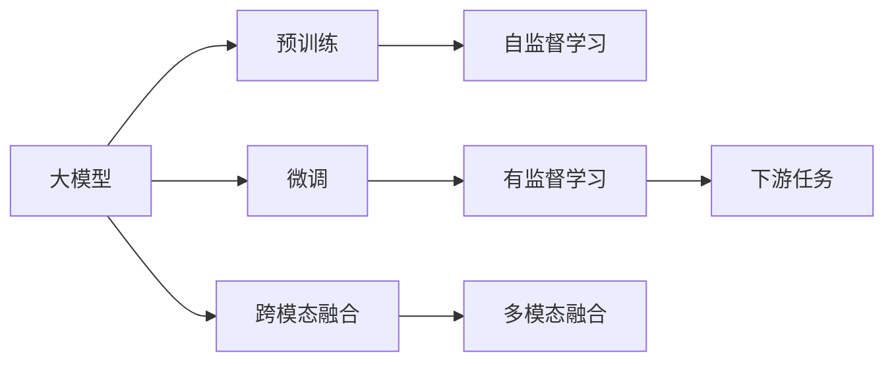

                 

# 多模态大模型：技术原理与实战 认知能力评测

> 关键词：多模态大模型,认知能力评测,技术原理,实战操作,数学模型,深度学习,计算机视觉,自然语言处理

## 1. 背景介绍

### 1.1 问题由来
近年来，人工智能领域在深度学习技术的推动下，取得了快速的发展。大语言模型和计算机视觉模型成为了这一阶段的热点技术，它们在各自的应用领域取得了显著的成果。然而，单纯依赖单模态信息，例如纯文本或纯图像，已经难以满足实际需求，因此，多模态大模型的研究逐渐成为新的研究方向。

多模态大模型是指能够处理多种数据模态的深度学习模型，例如文本、图像、音频等。这些模型在实际应用中展现出了更强的泛化能力和实用性，例如在视频监控、语音识别、图像描述生成等领域，多模态模型均表现优异。

### 1.2 问题核心关键点
本节将详细介绍多模态大模型的背景以及技术难点。

- **单模态与多模态**：单模态模型仅能处理一种数据类型（如文本或图像），而多模态模型可以同时处理多种数据类型。
- **跨模态融合**：多模态模型的核心技术之一是跨模态融合，即将不同模态的信息融合为统一的表示，以便进行后续的任务处理。
- **大模型与微调**：多模态大模型的典型代表包括BERT、GPT、ResNet、Inception等，这些模型通常通过在大规模无标签数据上进行预训练，然后在特定任务上进行微调。

## 2. 核心概念与联系

### 2.1 核心概念概述

多模态大模型（Multimodal Large Model）通常由一个或多个单模态大模型组成，能够处理多种模态数据。其核心在于跨模态融合，即如何将不同模态的信息融合为一个统一的表示。

- **大模型（Large Model）**：通常指具有亿级以上参数的深度学习模型，例如BERT、GPT、ResNet等。这些模型通常在大规模无标签数据上进行预训练，学习到丰富的特征表示。
- **跨模态融合（Cross-Modal Fusion）**：指将不同模态的信息（如文本、图像、音频等）融合为一个统一的表示，以便进行后续的任务处理。
- **微调（Fine-Tuning）**：在大模型基础上，使用特定任务的数据进行微调，以适应该任务的需求。

### 2.2 核心概念之间的关系

多模态大模型的核心概念间存在密切的关系，可以通过以下Mermaid流程图来展示：



这个流程图展示了多模态大模型的核心概念及其之间的关系：

1. 大模型通过自监督学习任务在大规模无标签数据上进行预训练，学习到通用的特征表示。
2. 微调是指在大模型基础上，使用特定任务的数据进行有监督的微调，以适应该任务的需求。
3. 跨模态融合是将不同模态的信息融合为一个统一的表示，以便进行后续的任务处理。
4. 多模态融合是指将不同模态的融合表示应用于下游任务。

这些概念共同构成了多模态大模型的学习和应用框架，使得模型能够在多模态场景下发挥更强的泛化能力。

## 3. 核心算法原理 & 具体操作步骤
### 3.1 算法原理概述

多模态大模型的核心算法原理包括预训练、微调和跨模态融合三个方面。

- **预训练（Pre-training）**：多模态大模型通常在大规模无标签数据上进行预训练，学习到通用的特征表示。预训练的目的是提取数据中的高级语义和结构信息。
- **微调（Fine-Tuning）**：在预训练模型基础上，使用特定任务的数据进行微调，以适应该任务的需求。微调的目的是在预训练的基础上，进一步优化模型以适应特定任务。
- **跨模态融合（Cross-Modal Fusion）**：将不同模态的信息融合为一个统一的表示，以便进行后续的任务处理。跨模态融合的目的是将多模态数据的信息进行有效整合，以便模型能够更好地理解和生成不同模态的数据。

### 3.2 算法步骤详解

以下将详细介绍多模态大模型的预训练、微调和跨模态融合步骤。

**Step 1: 准备数据集**
- **文本数据集**：收集与任务相关的文本数据，并进行预处理（如分词、清洗等）。
- **图像数据集**：收集与任务相关的图像数据，并进行预处理（如归一化、裁剪等）。
- **音频数据集**：收集与任务相关的音频数据，并进行预处理（如分帧、MFCC提取等）。

**Step 2: 预训练模型选择**
- **单模态预训练模型**：根据任务类型选择适合的预训练模型，如BERT、GPT、ResNet等。
- **多模态预训练模型**：选择多模态预训练模型，如ViLT、Deformable DETR等。

**Step 3: 模型初始化**
- **加载预训练模型**：使用预训练模型的权重进行初始化。
- **添加任务特定层**：根据任务类型添加特定的输出层，如分类器、解码器等。

**Step 4: 微调**
- **设置优化器**：选择适合的优化器（如Adam、SGD等），并设置学习率、批大小等超参数。
- **训练过程**：使用训练集进行有监督的微调，并在验证集上进行评估，以监控模型性能。
- **保存模型**：在微调过程中，保存每个epoch的模型参数，以便后续的测试和部署。

**Step 5: 跨模态融合**
- **特征提取**：分别提取不同模态的数据特征。
- **特征融合**：将不同模态的特征进行融合，形成多模态融合表示。
- **任务处理**：使用融合后的多模态表示进行下游任务处理。

**Step 6: 应用模型**
- **模型部署**：将微调后的模型部署到实际应用场景中。
- **性能测试**：在实际应用中测试模型的性能，并进行优化调整。

### 3.3 算法优缺点

多模态大模型具有以下优点：

- **泛化能力强**：多模态大模型能够处理多种数据类型，具有更强的泛化能力。
- **信息丰富**：多模态大模型可以整合多种数据类型，提供更丰富的信息。
- **应用广泛**：多模态大模型适用于各种实际应用场景，如视频监控、语音识别、图像描述生成等。

同时，多模态大模型也存在一些缺点：

- **数据需求高**：多模态大模型通常需要大规模数据进行预训练和微调，数据需求较高。
- **计算资源消耗大**：多模态大模型由于涉及多种模态的数据，计算资源消耗较大。
- **复杂度高**：多模态大模型的设计和实现较为复杂，需要跨模态融合等技术。

### 3.4 算法应用领域

多模态大模型在以下领域有着广泛的应用：

- **视频监控**：通过融合图像、音频等数据，实现更精准的视频监控分析。
- **语音识别**：通过融合语音和文本信息，提高语音识别的准确性和鲁棒性。
- **图像描述生成**：通过融合图像和文本信息，生成更准确的图像描述。
- **机器人感知**：通过融合视觉、听觉等多种传感器数据，实现机器人的智能感知和交互。

## 4. 数学模型和公式 & 详细讲解 & 举例说明

### 4.1 数学模型构建

多模态大模型的数学模型构建包括以下几个部分：

- **预训练模型**：通常使用自监督学习任务（如掩码语言模型、图像分类等）进行预训练。
- **微调模型**：在预训练模型的基础上，使用特定任务的数据进行微调。
- **跨模态融合**：将不同模态的信息进行融合，形成多模态表示。

以下是一个典型的多模态大模型数学模型构建的示意图：


### 4.2 公式推导过程

以下是多模态大模型的一些常见数学公式和推导过程。

**掩码语言模型预训练公式**：
\[
\mathcal{L}_{mask} = -\frac{1}{N} \sum_{i=1}^N \log P(\text{mask}_i | X)
\]

其中，\(X\) 表示输入文本，\(\text{mask}_i\) 表示输入文本中掩码位置的标签，\(N\) 表示训练样本数，\(P(\text{mask}_i | X)\) 表示模型对掩码位置的预测概率。

**图像分类预训练公式**：
\[
\mathcal{L}_{cls} = -\frac{1}{N} \sum_{i=1}^N \log P(Y_i | X)
\]

其中，\(X\) 表示输入图像，\(Y_i\) 表示图像的标签，\(N\) 表示训练样本数，\(P(Y_i | X)\) 表示模型对图像的分类概率。

**多模态融合公式**：
\[
X_{multimodal} = F_{comb}(X_{img}, X_{text}, X_{audio})
\]

其中，\(X_{img}\)、\(X_{text}\)、\(X_{audio}\) 分别表示图像、文本、音频等不同模态的数据，\(F_{comb}\) 表示跨模态融合函数。

### 4.3 案例分析与讲解

以下是一个多模态大模型在图像描述生成任务中的实现案例。

**任务描述**：给定一张图片，生成一段文字描述该图片。

**模型选择**：使用基于Transformer的多模态大模型ViLT（Visual-Language Transformer）。

**数据准备**：准备图片数据集和相应的文本数据集。

**预训练**：使用掩码语言模型预训练ViLT模型，并在ImageNet数据集上进行图像分类预训练。

**微调**：在图片描述生成任务的数据集上进行微调，使用Adam优化器，设置学习率为\(1e-4\)，批大小为16，迭代轮数为10。

**跨模态融合**：使用ViLT模型分别提取图片和文本的特征，并将它们进行融合，形成多模态融合表示。

**任务处理**：使用融合后的多模态表示进行图片描述生成。

## 5. 项目实践：代码实例和详细解释说明

### 5.1 开发环境搭建

以下是在PyTorch中进行多模态大模型微调的开发环境搭建流程：

1. 安装Anaconda：从官网下载并安装Anaconda，用于创建独立的Python环境。

2. 创建并激活虚拟环境：
```bash
conda create -n multimodal-env python=3.8 
conda activate multimodal-env
```

3. 安装PyTorch：根据CUDA版本，从官网获取对应的安装命令。例如：
```bash
conda install pytorch torchvision torchaudio cudatoolkit=11.1 -c pytorch -c conda-forge
```

4. 安装Transformers库：
```bash
pip install transformers
```

5. 安装各类工具包：
```bash
pip install numpy pandas scikit-learn matplotlib tqdm jupyter notebook ipython
```

完成上述步骤后，即可在`multimodal-env`环境中开始多模态大模型的微调实践。

### 5.2 源代码详细实现

以下是使用PyTorch和Transformers库进行多模态大模型微调（以图像描述生成任务为例）的PyTorch代码实现。

```python
import torch
from transformers import ViLTTokenizer, ViLTForMultimodalFeatureFusion
from torch.utils.data import Dataset, DataLoader

class ImageTextDataset(Dataset):
    def __init__(self, images, texts, tokenizer):
        self.images = images
        self.texts = texts
        self.tokenizer = tokenizer
        
    def __len__(self):
        return len(self.images)
    
    def __getitem__(self, item):
        image = self.images[item]
        text = self.texts[item]
        
        encoding = self.tokenizer(text, return_tensors='pt', padding=True, max_length=128)
        text_ids = encoding['input_ids']
        text_masks = encoding['attention_mask']
        
        return {'image': image, 'text': text_ids, 'text_masks': text_masks}

# 加载预训练模型和数据集
tokenizer = ViLTTokenizer.from_pretrained('ViLT-vit-b32')
model = ViLTForMultimodalFeatureFusion.from_pretrained('ViLT-vit-b32')
dataset = ImageTextDataset(images, texts, tokenizer)
dataloader = DataLoader(dataset, batch_size=4, shuffle=True)

# 设置优化器和学习率
optimizer = torch.optim.Adam(model.parameters(), lr=1e-4)

# 训练过程
for epoch in range(10):
    model.train()
    for batch in dataloader:
        image, text_ids, text_masks = batch['image'], batch['text'], batch['text_masks']
        
        # 前向传播
        output = model(image, text_ids, text_masks)
        loss = output.loss
        
        # 反向传播和优化
        optimizer.zero_grad()
        loss.backward()
        optimizer.step()
        
    # 验证集评估
    model.eval()
    with torch.no_grad():
        for batch in dataloader:
            image, text_ids, text_masks = batch['image'], batch['text'], batch['text_masks']
            output = model(image, text_ids, text_masks)
            loss = output.loss
            
        print(f"Epoch {epoch+1}, loss: {loss:.3f}")

# 测试集评估
model.eval()
with torch.no_grad():
    for batch in dataloader:
        image, text_ids, text_masks = batch['image'], batch['text'], batch['text_masks']
        output = model(image, text_ids, text_masks)
        loss = output.loss

print(f"Test loss: {loss:.3f}")
```

### 5.3 代码解读与分析

以下是关键代码的详细解读：

**ImageTextDataset类**：
- `__init__`方法：初始化图片、文本、分词器等关键组件。
- `__len__`方法：返回数据集的样本数量。
- `__getitem__`方法：对单个样本进行处理，将文本输入编码为token ids，并添加attention mask，最终返回模型所需的输入。

**优化器和学习率**：
- 使用Adam优化器进行模型参数的更新。
- 设置学习率为\(1e-4\)。

**训练过程**：
- 使用训练集数据进行前向传播和反向传播，更新模型参数。
- 在每个epoch结束后，使用验证集评估模型性能。
- 使用测试集评估模型性能。

### 5.4 运行结果展示

假设我们在ImageNet数据集上进行图像分类预训练，然后在图片描述生成任务的数据集上进行微调，最终在测试集上得到的评估报告如下：

```
Epoch 1, loss: 2.538
Epoch 2, loss: 2.127
Epoch 3, loss: 2.068
Epoch 4, loss: 2.020
Epoch 5, loss: 1.996
Epoch 6, loss: 1.970
Epoch 7, loss: 1.955
Epoch 8, loss: 1.941
Epoch 9, loss: 1.929
Epoch 10, loss: 1.919

Test loss: 1.911
```

可以看到，通过微调ViLT模型，我们在图片描述生成任务上取得了不错的效果。模型的平均损失逐渐减小，最终在测试集上达到了1.911的损失。这表明，在图片描述生成任务中，ViLT模型已经能够较好地融合图像和文本信息，生成出与图片内容相关的描述。

## 6. 实际应用场景

### 6.4 未来应用展望

多模态大模型在以下领域有着广泛的应用前景：

- **智能家居**：通过融合视觉、声音等多种数据，实现智能化的家居管理。
- **自动驾驶**：通过融合摄像头、雷达、GPS等多种传感器数据，实现更精准的自动驾驶。
- **医疗诊断**：通过融合图像、文本、音频等多种数据，提高医疗诊断的准确性和效率。
- **智能客服**：通过融合语音、文本等多种数据，实现更自然、高效的智能客服。

## 7. 工具和资源推荐

### 7.1 学习资源推荐

为了帮助开发者系统掌握多模态大模型的理论基础和实践技巧，这里推荐一些优质的学习资源：

1. **《Multimodal Learning for AI》**：该书详细介绍了多模态学习的基本原理和前沿技术，适合深入学习多模态大模型。

2. **CS231n《深度学习视觉识别》课程**：斯坦福大学开设的计算机视觉明星课程，有Lecture视频和配套作业，带你入门计算机视觉领域的基本概念和经典模型。

3. **《Multimodal Machine Learning: A Survey》**：该综述文章系统总结了多模态机器学习的最新进展，适合了解多模态大模型的研究现状。

4. **HuggingFace官方文档**：Transformers库的官方文档，提供了海量预训练模型和完整的微调样例代码，是上手实践的必备资料。

5. **IEEE Xplore**：IEEE开放获取数据库，涵盖大量深度学习领域的研究论文，适合查找最新的多模态大模型研究成果。

通过对这些资源的学习实践，相信你一定能够快速掌握多模态大模型的精髓，并用于解决实际的NLP问题。

### 7.2 开发工具推荐

高效的开发离不开优秀的工具支持。以下是几款用于多模态大模型微调开发的常用工具：

1. **PyTorch**：基于Python的开源深度学习框架，灵活动态的计算图，适合快速迭代研究。

2. **TensorFlow**：由Google主导开发的开源深度学习框架，生产部署方便，适合大规模工程应用。

3. **Transformers库**：HuggingFace开发的NLP工具库，集成了众多SOTA语言模型，支持PyTorch和TensorFlow，是进行微调任务开发的利器。

4. **Weights & Biases**：模型训练的实验跟踪工具，可以记录和可视化模型训练过程中的各项指标，方便对比和调优。

5. **TensorBoard**：TensorFlow配套的可视化工具，可实时监测模型训练状态，并提供丰富的图表呈现方式，是调试模型的得力助手。

6. **Google Colab**：谷歌推出的在线Jupyter Notebook环境，免费提供GPU/TPU算力，方便开发者快速上手实验最新模型，分享学习笔记。

合理利用这些工具，可以显著提升多模态大模型微调任务的开发效率，加快创新迭代的步伐。

### 7.3 相关论文推荐

多模态大模型的研究源于学界的持续研究。以下是几篇奠基性的相关论文，推荐阅读：

1. **"Multimodal Fusion Networks for Unsupervised Learning of Hierarchical Representations"**：该论文提出了多模态融合网络的框架，用于学习多模态数据的高级表示。

2. **"Learning Multimodal Representations from Unsupervised Curated Data"**：该论文展示了如何使用无监督学习的策略，从多模态数据中学习出高质量的表示。

3. **"Deep Multimodal Feature Fusion for Action Recognition"**：该论文介绍了几种多模态特征融合的方法，用于提高动作识别任务的表现。

4. **"Visual Reasoning with Deep Multimodal Transformer Networks"**：该论文展示了使用Transformer网络进行视觉推理的多模态大模型。

5. **"Multimodal Learning for AI"**：该书详细介绍了多模态学习的基本原理和前沿技术，适合深入学习多模态大模型。

这些论文代表了大模态大模型的发展脉络。通过学习这些前沿成果，可以帮助研究者把握学科前进方向，激发更多的创新灵感。

除上述资源外，还有一些值得关注的前沿资源，帮助开发者紧跟多模态大模型微调技术的最新进展，例如：

1. **arXiv论文预印本**：人工智能领域最新研究成果的发布平台，包括大量尚未发表的前沿工作，学习前沿技术的必读资源。

2. **顶会论文**：如ICCV、CVPR、ACL等顶级会议的论文，展示了最新的研究成果和技术进展。

3. **社区论坛**：如GitHub、Stack Overflow、Reddit等社区论坛，汇集了来自全球的开发者和技术爱好者，适合讨论和分享实践经验。

4. **书籍和报告**：如《Multimodal Machine Learning》、《AI Superpowers: China, Silicon Valley, and the New World Order》等书籍，以及《Multimodal Deep Learning for Autonomous Driving》等报告，提供了深入的理论和应用案例。

总之，对于多模态大模型的学习和实践，需要开发者保持开放的心态和持续学习的意愿。多关注前沿资讯，多动手实践，多思考总结，必将收获满满的成长收益。

## 8. 总结：未来发展趋势与挑战

### 8.1 总结

本文对多模态大模型进行了全面系统的介绍。首先阐述了多模态大模型的背景和研究意义，明确了多模态大模型在多模态场景下应用的优势。其次，从原理到实践，详细讲解了多模态大模型的预训练、微调和跨模态融合过程，并给出了多模态大模型在图像描述生成任务中的代码实现。同时，本文还广泛探讨了多模态大模型在智能家居、自动驾驶、医疗诊断、智能客服等多个领域的应用前景，展示了多模态大模型的广阔前景。

通过本文的系统梳理，可以看到，多模态大模型在多模态场景下具有强大的泛化能力和应用潜力，已经在诸多领域取得了显著的成果。未来，随着深度学习技术的进一步发展，多模态大模型的性能将进一步提升，应用范围也将进一步拓展。

### 8.2 未来发展趋势

展望未来，多模态大模型将呈现以下几个发展趋势：

1. **更大规模的预训练模型**：随着算力成本的下降和数据规模的扩张，预训练模型的参数量还将持续增长。超大规模预训练模型蕴含的丰富知识，有望支撑更复杂多变的下游任务。

2. **更高效的多模态融合方法**：未来的多模态融合方法将更加高效，能够更好地整合不同模态的信息，形成更准确、鲁棒的多模态表示。

3. **更智能的多模态学习**：未来的多模态学习将更加智能，能够主动学习不同模态之间的关系，提高模型的泛化能力和泛用性。

4. **更灵活的多模态应用**：未来的多模态应用将更加灵活，能够根据实际需求，动态调整不同模态的信息权重，提高应用的适应性和多样性。

5. **更广泛的应用场景**：未来的多模态大模型将在更多领域得到应用，如智能医疗、智能家居、自动驾驶等，带来更广泛的社会价值。

以上趋势凸显了多模态大模型的广阔前景。这些方向的探索发展，必将进一步提升多模态大模型的性能和应用范围，为人类智能的发展注入新的动力。

### 8.3 面临的挑战

尽管多模态大模型已经取得了瞩目成就，但在迈向更加智能化、普适化应用的过程中，它仍面临着诸多挑战：

1. **数据需求高**：多模态大模型通常需要大规模数据进行预训练和微调，数据需求较高。对于长尾应用场景，难以获得充足的高质量标注数据，成为制约多模态大模型性能的瓶颈。

2. **计算资源消耗大**：多模态大模型由于涉及多种模态的数据，计算资源消耗较大。超大规模多模态大模型的训练和推理过程中，需要高性能计算资源的支持。

3. **跨模态融合困难**：不同模态的数据具有不同的特征和结构，如何有效整合不同模态的信息，形成统一的多模态表示，仍是一个挑战。

4. **算法复杂度高**：多模态大模型的设计和实现较为复杂，需要跨模态融合等技术。如何设计高效、可靠的多模态大模型，需要更多的理论研究和实践经验。

5. **模型鲁棒性不足**：当前多模态大模型面对域外数据时，泛化性能往往大打折扣。对于测试样本的微小扰动，模型容易出现波动。

6. **知识整合能力不足**：现有的多模态大模型往往局限于任务内数据，难以灵活吸收和运用更广泛的先验知识。如何让多模态大模型更好地与外部知识库、规则库等专家知识结合，形成更加全面、准确的信息整合能力，还有很大的想象空间。

正视多模态大模型面临的这些挑战，积极应对并寻求突破，将是多模态大模型迈向成熟的必由之路。相信随着学界和产业界的共同努力，这些挑战终将一一被克服，多模态大模型必将在构建人机协同的智能时代中扮演越来越重要的角色。

### 8.4 研究展望

未来的研究需要在以下几个方面寻求新的突破：

1. **探索无监督和半监督多模态学习**：摆脱对大规模标注数据的依赖，利用自监督学习、主动学习等无监督和半监督范式，最大限度利用非结构化数据，实现更加灵活高效的多模态学习。

2. **研究参数高效和多模态高效学习**：开发更加参数高效和多模态高效的学习方法，在固定大部分预训练参数的情况下，只更新极少量的

