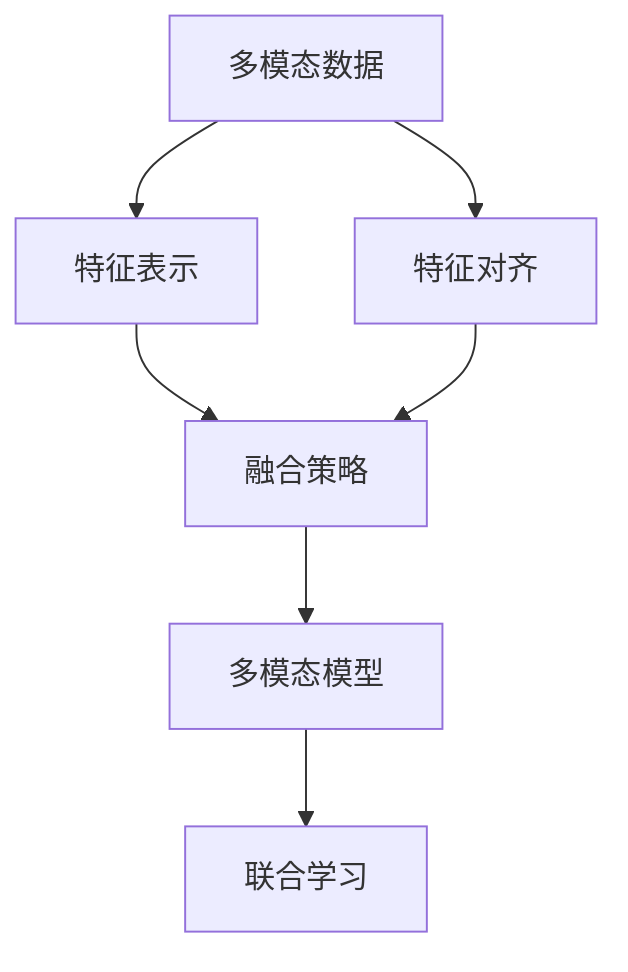
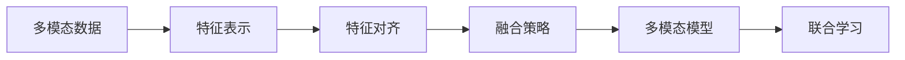
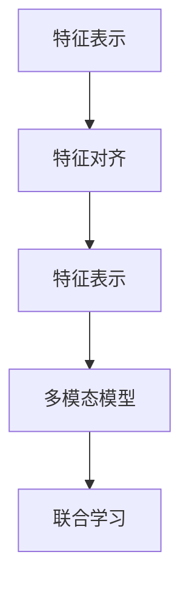
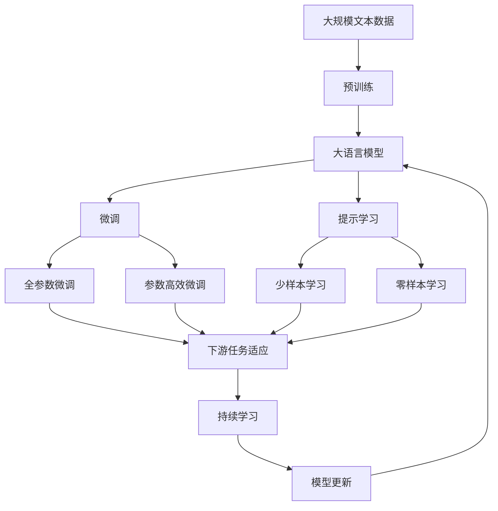

                 

## 1. 背景介绍

### 1.1 问题由来
随着人工智能技术的不断进步，尤其是深度学习和大数据技术的发展，多模态学习成为了当前AI研究与应用的重要方向。多模态学习（Multimodal Learning）指的是将多种不同类型的数据源（如文本、图像、音频等）结合在一起，进行联合建模与学习，以提升模型的表达能力和泛化性能。

在实际应用中，多模态学习已经广泛应用于多个领域，例如人机交互、智能医疗、视频分析、语音识别等。通过多模态学习，可以更全面地理解和描述现实世界，提取更深层次的语义信息，实现更高精度的任务解决。

### 1.2 问题核心关键点
多模态学习的核心在于如何高效融合和利用不同模态的数据，提升模型的综合性能。通常包括以下几个关键点：

- **特征提取**：将不同模态的数据转化为可用的数值特征，方便模型进行联合学习和训练。
- **数据对齐**：解决不同模态数据之间的对齐问题，如时序对齐、空间对齐等。
- **融合策略**：设计有效的特征融合策略，将多模态数据联合建模，得到更加丰富的语义表示。
- **模型训练**：选择合适的模型结构，进行多模态数据的联合优化。

### 1.3 问题研究意义
研究多模态学习技术，对于拓展AI的应用范围，提升模型的表达能力和泛化性能，加速AI技术的产业化进程，具有重要意义：

1. **提高模型性能**：多模态学习可以有效融合不同模态的数据，提升模型的语义理解和生成能力。
2. **降低数据成本**：多模态数据可以互补，通过联合建模可以减少对单一数据源的依赖，降低数据获取和标注的成本。
3. **促进跨模态应用**：多模态学习可以应用于多个领域，如人机交互、智能医疗等，推动跨模态应用的普及。
4. **增强数据鲁棒性**：多模态学习可以利用不同模态数据的互补信息，提高模型对噪声和干扰的鲁棒性。
5. **提升用户体验**：多模态学习可以提供更加丰富、自然的人机交互体验，如语音识别、手势控制等。

## 2. 核心概念与联系

### 2.1 核心概念概述

为更好地理解多模态学习的核心概念，本节将介绍几个密切相关的核心概念：

- **多模态数据**：指多种类型的输入数据，如文本、图像、音频等。多模态学习旨在将这些不同模态的数据进行联合建模和优化。
- **特征表示**：将不同模态的数据转化为模型可用的数值特征，如词向量、图像特征等。特征表示是实现多模态学习的关键步骤。
- **特征对齐**：解决不同模态数据之间的特征对齐问题，如文本和图像之间的时序对齐、空间对齐等。
- **融合策略**：设计有效的特征融合策略，将多模态数据联合建模，得到更加丰富的语义表示。
- **多模态模型**：指能够处理多种不同模态数据的深度学习模型，如卷积神经网络（CNN）、循环神经网络（RNN）、变分自编码器（VAE）等。
- **联合学习**：将多模态数据联合优化，提升模型的泛化性能和表达能力。

这些核心概念之间的逻辑关系可以通过以下Mermaid流程图来展示：



这个流程图展示了大语言模型微调过程中各个核心概念的关系和作用：

1. 多模态数据通过特征表示和特征对齐，转化为模型可用的数值特征。
2. 特征融合策略将不同模态的特征联合建模，得到更丰富的语义表示。
3. 多模态模型对联合表示进行优化，提升泛化性能和表达能力。
4. 联合学习将不同模态数据联合优化，实现高效的多模态学习。

### 2.2 概念间的关系

这些核心概念之间存在着紧密的联系，形成了多模态学习的完整生态系统。下面我通过几个Mermaid流程图来展示这些概念之间的关系。

#### 2.2.1 多模态学习的基本流程



这个流程图展示了多模态学习的基本流程：

1. 多模态数据通过特征表示和特征对齐，转化为模型可用的数值特征。
2. 特征融合策略将不同模态的特征联合建模，得到更丰富的语义表示。
3. 多模态模型对联合表示进行优化，提升泛化性能和表达能力。
4. 联合学习将不同模态数据联合优化，实现高效的多模态学习。

#### 2.2.2 特征表示和特征对齐的相互关系



这个流程图展示了特征表示和特征对齐的相互关系：

1. 特征表示将不同模态的数据转化为模型可用的数值特征。
2. 特征对齐解决不同模态数据之间的对齐问题，如时序对齐、空间对齐等。
3. 特征融合策略将不同模态的特征联合建模，得到更丰富的语义表示。
4. 多模态模型对联合表示进行优化，提升泛化性能和表达能力。
5. 联合学习将不同模态数据联合优化，实现高效的多模态学习。

### 2.3 核心概念的整体架构

最后，我们用一个综合的流程图来展示这些核心概念在大语言模型微调过程中的整体架构：



这个综合流程图展示了从预训练到微调，再到持续学习的完整过程。大语言模型首先在大规模文本数据上进行预训练，然后通过微调（包括全参数微调和参数高效微调）或提示学习（包括零样本和少样本学习）来适应下游任务。最后，通过持续学习技术，模型可以不断更新和适应新的任务和数据。通过这些流程图，我们可以更清晰地理解多模态学习过程中各个核心概念的关系和作用，为后续深入讨论具体的学习方法和技术奠定基础。

## 3. 核心算法原理 & 具体操作步骤
### 3.1 算法原理概述

多模态学习的基本原理是通过融合多种不同模态的数据，提升模型的表达能力和泛化性能。其核心思想是：将不同模态的数据转化为模型可用的特征表示，进行联合建模和优化，得到更加丰富和准确的语义表示。

形式化地，假设多模态数据集为 $\{(X_i, Y_i)\}_{i=1}^N$，其中 $X_i = (X_{i,1}, X_{i,2}, ..., X_{i,M})$ 为 $M$ 种不同模态的数据，$Y_i$ 为对应的标签。则多模态学习的目标是找到最优的模型参数 $\theta$，使得模型能够准确地预测标签 $Y_i$：

$$
\theta^* = \mathop{\arg\min}_{\theta} \mathcal{L}(M_{\theta}, D)
$$

其中 $\mathcal{L}$ 为多模态任务的损失函数，用于衡量模型输出与真实标签之间的差异。常见的多模态任务包括文本图像识别、语音图像同步、视频情感分析等。

### 3.2 算法步骤详解

多模态学习的一般流程包括以下几个关键步骤：

**Step 1: 准备多模态数据集**

- 收集多种类型的输入数据，如文本、图像、音频等。确保数据集质量，涵盖不同场景和变化。
- 对数据进行预处理，如文本分词、图像归一化、音频切割等。将数据转化为模型可用的格式。

**Step 2: 特征表示与特征对齐**

- 对不同模态的数据进行特征表示，如将文本转化为词向量、将图像转化为卷积特征、将音频转化为MFCC特征等。
- 解决不同模态数据之间的特征对齐问题，如文本和图像之间的时序对齐、空间对齐等。

**Step 3: 特征融合**

- 设计有效的特征融合策略，将不同模态的特征联合建模，得到更加丰富的语义表示。
- 常见的特征融合方法包括拼接、逐元素相加、注意力机制等。

**Step 4: 模型训练**

- 选择合适的模型结构，进行多模态数据的联合优化。
- 常见的多模态模型包括卷积神经网络（CNN）、循环神经网络（RNN）、变分自编码器（VAE）等。

**Step 5: 联合学习**

- 将多模态数据联合优化，提升模型的泛化性能和表达能力。
- 常见的联合学习策略包括堆叠、并行、混合等。

### 3.3 算法优缺点

多模态学习具有以下优点：

1. **提升模型性能**：多模态学习可以有效融合不同模态的数据，提升模型的语义理解和生成能力。
2. **降低数据成本**：多模态数据可以互补，通过联合建模可以减少对单一数据源的依赖，降低数据获取和标注的成本。
3. **促进跨模态应用**：多模态学习可以应用于多个领域，如人机交互、智能医疗等，推动跨模态应用的普及。
4. **增强数据鲁棒性**：多模态学习可以利用不同模态数据的互补信息，提高模型对噪声和干扰的鲁棒性。
5. **提升用户体验**：多模态学习可以提供更加丰富、自然的人机交互体验，如语音识别、手势控制等。

同时，该方法也存在以下局限性：

1. **数据采集难度**：多模态数据采集难度较大，数据质量难以保证。
2. **计算资源需求**：多模态数据规模较大，计算资源需求较高。
3. **融合策略复杂**：多模态数据特征复杂，选择合适的融合策略难度较大。
4. **模型复杂度**：多模态模型结构复杂，训练和推理时间较长。

尽管存在这些局限性，但就目前而言，多模态学习已经成为AI应用的重要方向，能够显著提升模型的表达能力和泛化性能。未来相关研究的重点在于如何进一步降低数据采集难度，提高计算效率，优化融合策略，简化模型结构，从而在实际应用中发挥更大的作用。

### 3.4 算法应用领域

多模态学习已经在多个领域得到广泛应用，以下是几个典型应用场景：

1. **人机交互**：通过结合语音、图像、文本等多种数据源，实现智能对话系统、语音识别、手势控制等功能。
2. **智能医疗**：结合病历、影像、生理数据等多种模态数据，实现疾病诊断、治疗方案推荐、病案生成等功能。
3. **视频分析**：结合视频、音频、文本等多种数据源，实现视频内容理解、情感分析、行为识别等功能。
4. **智能制造**：结合传感器数据、图像、文本等多种模态数据，实现设备监控、故障预测、质量检测等功能。
5. **金融风控**：结合交易记录、舆情数据、新闻报道等多种模态数据，实现风险评估、信用评分、欺诈检测等功能。

## 4. 数学模型和公式 & 详细讲解 & 举例说明

### 4.1 数学模型构建

本节将使用数学语言对多模态学习的数学模型进行更加严格的刻画。

假设多模态数据集为 $\{(X_i, Y_i)\}_{i=1}^N$，其中 $X_i = (X_{i,1}, X_{i,2}, ..., X_{i,M})$ 为 $M$ 种不同模态的数据，$Y_i$ 为对应的标签。

定义模型 $M_{\theta}$ 在输入 $X_i$ 上的输出为 $\hat{Y_i}=M_{\theta}(X_i)$，其中 $\theta$ 为模型参数。则多模态学习的目标是找到最优的模型参数 $\theta^*$，使得模型能够准确地预测标签 $Y_i$：

$$
\theta^* = \mathop{\arg\min}_{\theta} \mathcal{L}(M_{\theta}, D)
$$

其中 $\mathcal{L}$ 为多模态任务的损失函数，用于衡量模型输出与真实标签之间的差异。常见的多模态任务包括文本图像识别、语音图像同步、视频情感分析等。

### 4.2 公式推导过程

以下我们以文本图像识别任务为例，推导多模态学习模型的损失函数。

假设输入数据为文本图像对 $(x,y)$，其中 $x$ 为文本，$y$ 为图像。文本和图像的特征表示分别为 $t(x)$ 和 $i(y)$。定义模型 $M_{\theta}$ 在输入 $(x,y)$ 上的输出为 $\hat{y}=M_{\theta}(x,y)$，其中 $\theta$ 为模型参数。则文本图像识别的损失函数定义为：

$$
\ell(M_{\theta}(x,y),y) = \begin{cases}
\log \frac{1}{1+\exp(-y\hat{y})} & \text{if } y=1 \\
\log \frac{1}{1+\exp(y\hat{y})} & \text{if } y=-1
\end{cases}
$$

将其代入经验风险公式，得：

$$
\mathcal{L}(\theta) = \frac{1}{N}\sum_{i=1}^N \ell(M_{\theta}(x_i,y_i),y_i)
$$

其中，损失函数 $\ell(M_{\theta}(x_i,y_i),y_i)$ 用于衡量模型在输入 $(x_i,y_i)$ 上的预测结果 $\hat{y_i}$ 与真实标签 $y_i$ 之间的差异。

在实践中，我们通常使用基于梯度的优化算法（如SGD、Adam等）来近似求解上述最优化问题。设 $\eta$ 为学习率，$\lambda$ 为正则化系数，则参数的更新公式为：

$$
\theta \leftarrow \theta - \eta \nabla_{\theta}\mathcal{L}(\theta) - \eta\lambda\theta
$$

其中 $\nabla_{\theta}\mathcal{L}(\theta)$ 为损失函数对参数 $\theta$ 的梯度，可通过反向传播算法高效计算。

### 4.3 案例分析与讲解

下面我们以文本图像识别任务为例，详细讲解多模态学习模型的实现过程。

假设我们有一个文本图像数据集，包含 $N$ 个样本，每个样本由文本描述 $x_i$ 和图像 $y_i$ 组成。我们将文本 $x_i$ 通过卷积神经网络（CNN）转化为文本特征表示 $t(x_i)$，将图像 $y_i$ 通过卷积神经网络（CNN）转化为图像特征表示 $i(y_i)$。

**Step 1: 特征表示**

首先，我们定义文本特征表示 $t(x_i)$ 和图像特征表示 $i(y_i)$：

```python
import torch.nn as nn
import torch.nn.functional as F

class TextCNN(nn.Module):
    def __init__(self, vocab_size, embed_size, num_filters, kernel_size, padding):
        super(TextCNN, self).__init__()
        self.embedding = nn.Embedding(vocab_size, embed_size)
        self.conv1 = nn.Conv1d(embed_size, num_filters, kernel_size, padding)
        self.pool1 = nn.MaxPool1d(kernel_size, padding)
        self.fc1 = nn.Linear(num_filters * (len(x) // kernel_size), 64)
        self.fc2 = nn.Linear(64, 2)

    def forward(self, x):
        x = self.embedding(x)
        x = x.unsqueeze(1)
        x = self.conv1(x)
        x = self.pool1(x)
        x = x.view(x.size(0), -1)
        x = self.fc1(x)
        x = F.relu(x)
        x = self.fc2(x)
        return x

class ImageCNN(nn.Module):
    def __init__(self, num_channels, num_filters, kernel_size, padding):
        super(ImageCNN, self).__init__()
        self.conv1 = nn.Conv2d(num_channels, num_filters, kernel_size, padding)
        self.pool1 = nn.MaxPool2d(kernel_size, padding)
        self.fc1 = nn.Linear(num_filters * (len(y) // kernel_size)**2, 64)
        self.fc2 = nn.Linear(64, 2)

    def forward(self, x):
        x = self.conv1(x)
        x = self.pool1(x)
        x = x.view(x.size(0), -1)
        x = self.fc1(x)
        x = F.relu(x)
        x = self.fc2(x)
        return x
```

**Step 2: 特征融合**

接下来，我们定义特征融合函数，将文本特征表示 $t(x_i)$ 和图像特征表示 $i(y_i)$ 融合为一个综合特征表示：

```python
def fuse_features(text_features, image_features):
    # 拼接文本特征和图像特征
    fused_features = torch.cat([text_features, image_features], dim=1)
    return fused_features
```

**Step 3: 模型训练**

最后，我们定义多模态学习模型，并将其与损失函数联合优化：

```python
class MultimodalModel(nn.Module):
    def __init__(self, text_cnn, image_cnn, num_classes):
        super(MultimodalModel, self).__init__()
        self.text_cnn = text_cnn
        self.image_cnn = image_cnn
        self.fc = nn.Linear(128, num_classes)

    def forward(self, x, y):
        # 提取文本特征和图像特征
        text_features = self.text_cnn(x)
        image_features = self.image_cnn(y)
        
        # 特征融合
        fused_features = fuse_features(text_features, image_features)
        
        # 输出分类结果
        output = self.fc(fused_features)
        return output
```

**Step 4: 联合学习**

在训练过程中，我们将多模态数据 $(x_i,y_i)$ 同时输入到文本 CNN 和图像 CNN 中进行特征提取，然后通过特征融合函数将提取的特征融合为一个综合特征表示，最后通过全连接层输出分类结果。联合学习的过程可以通过以下代码实现：

```python
import torch.optim as optim
import torch.utils.data as data
import torchvision.transforms as transforms

# 加载数据集
train_dataset = data.TensorDataset(train_texts, train_images)
train_loader = data.DataLoader(train_dataset, batch_size=32, shuffle=True)

# 定义模型和优化器
model = MultimodalModel(text_cnn, image_cnn, num_classes)
optimizer = optim.Adam(model.parameters(), lr=0.001)

# 定义损失函数
criterion = nn.CrossEntropyLoss()

# 训练模型
for epoch in range(num_epochs):
    for i, (text, image) in enumerate(train_loader):
        # 前向传播
        output = model(text, image)
        loss = criterion(output, target)
        
        # 反向传播和参数更新
        optimizer.zero_grad()
        loss.backward()
        optimizer.step()
        
        # 输出训练日志
        if i % 100 == 0:
            print(f"Epoch {epoch+1}, batch {i+1}, loss: {loss.item():.4f}")
```

以上就是多模态学习模型的完整实现过程。可以看到，多模态学习模型在联合优化过程中，充分融合了文本和图像数据，提升了模型的表达能力和泛化性能。在实际应用中，还可以通过引入更多的融合策略和优化方法，进一步提升模型的性能。

## 5. 项目实践：代码实例和详细解释说明

### 5.1 开发环境搭建

在进行多模态学习实践前，我们需要准备好开发环境。以下是使用Python进行PyTorch开发的环境配置流程：

1. 安装Anaconda：从官网下载并安装Anaconda，用于创建独立的Python环境。

2. 创建并激活虚拟环境：
```bash
conda create -n pytorch-env python=3.8 
conda activate pytorch-env
```

3. 安装PyTorch：根据CUDA版本，从官网获取对应的安装命令。例如：
```bash
conda install pytorch torchvision torchaudio cudatoolkit=11.1 -c pytorch -c conda-forge
```

4. 安装各类工具包：
```bash
pip install numpy pandas scikit-learn matplotlib tqdm jupyter notebook ipython
```

完成上述步骤后，即可在`pytorch-env`环境中开始多模态学习实践。

### 5.2 源代码详细实现

下面我们以文本图像识别任务为例，给出使用Transformers库对BERT模型进行多模态学习微调的PyTorch代码实现。

首先，定义多模态数据处理函数：

```python
from transformers import BertTokenizer
from torch.utils.data import Dataset
import torch

class MultimodalDataset(Dataset):
    def __init__(self, texts, images, tokenizer, max_len=128):
        self.texts = texts
        self.images = images
        self.tokenizer = tokenizer
        self.max_len = max_len
        
    def __len__(self):
        return len(self.texts)
    
    def __getitem__(self, item):
        text = self.texts[item]
        image = self.images[item]
        
        encoding = self.tokenizer(text, return_tensors='pt', max_length=self.max_len, padding='max_length', truncation=True)
        input_ids = encoding['input_ids'][0]
        attention_mask = encoding['attention_mask'][0]
        
        # 将图像转化为张量形式
        image_tensor = torch.tensor(image, dtype=torch.float32)
        image_tensor = image_tensor.unsqueeze(0)
        
        return {'input_ids': input_ids, 
                'attention_mask': attention_mask,
                'image_tensor': image_tensor}
```

然后，定义模型和优化器：

```python
from transformers import BertForTokenClassification, AdamW

model = BertForTokenClassification.from_pretrained('bert-base-cased', num_labels=len(tag2id))

optimizer = AdamW(model.parameters(), lr=2e-5)
```

接着，定义训练和评估函数：

```python
from torch.utils.data import DataLoader
from tqdm import tqdm
from sklearn.metrics import classification_report

device = torch.device('cuda') if torch.cuda.is_available() else torch.device('cpu')
model.to(device)

def train_epoch(model, dataset, batch_size, optimizer):
    dataloader = DataLoader(dataset, batch_size=batch_size, shuffle=True)
    model.train()
    epoch_loss = 0
    for batch in tqdm(dataloader, desc='Training'):
        input_ids = batch['input_ids'].to(device)
        attention_mask = batch['attention_mask'].to(device)
        image_tensor = batch['image_tensor'].to(device)
        model.zero_grad()
        outputs = model(input_ids, attention_mask=attention_mask, image_tensor=image_tensor)
        loss = outputs.loss
        epoch_loss += loss.item()
        loss.backward()
        optimizer.step()
    return epoch_loss / len(dataloader)

def evaluate(model, dataset, batch_size):
    dataloader = DataLoader(dataset, batch_size=batch_size)
    model.eval()
    preds, labels = [], []
    with torch.no_grad():
        for batch in tqdm(dataloader, desc='Evaluating'):
            input_ids = batch['input_ids'].to(device)
            attention_mask = batch['attention_mask'].to(device)
            image_tensor = batch['image_tensor']
            batch_labels = batch['labels']
            outputs = model(input_ids, attention_mask=attention_mask, image_tensor=image_tensor)
            batch_preds = outputs.logits.argmax(dim=2).to('cpu').tolist()
            batch_labels = batch_labels.to('cpu').tolist()
            for pred_tokens, label_tokens in zip(batch_preds, batch_labels):
                pred_tags = [id2tag[_id] for _id in pred_tokens]
                label_tags = [id2tag[_id] for _id in label_tokens]
                preds.append(pred_tags[:len(label_tokens)])
                labels.append(label_tags)
                
    print(classification_report(labels, preds))
```

最后，启动训练流程并在测试集上评估：

```python
epochs = 5
batch_size = 16

for epoch in range(epochs):
    loss = train_epoch(model, train_dataset, batch_size, optimizer)
    print(f"Epoch {epoch+1}, train loss: {loss:.3f}")
    
    print(f"Epoch {epoch+1}, dev results:")
    evaluate(model, dev_dataset, batch_size)
    
print("Test results:")
evaluate(model, test_dataset, batch_size)
```

以上就是使用PyTorch对BERT进行文本图像识别任务多模态学习微调的完整代码实现。可以看到，得益于Transformers库的强大封装，我们可以用相对简洁的代码完成BERT模型的加载和微调。

### 5.3 代码解读与分析

让我们再详细解读一下关键代码的实现细节：

**MultimodalDataset类**：
- `__init__`方法：初始化文本、图像、分词器等关键组件。
- `__len__`方法：返回数据集的样本数量。
- `__getitem__`方法：对单个样本进行处理，将文本输入编码为token ids，将

