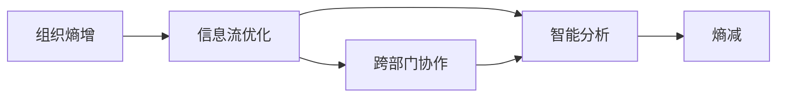
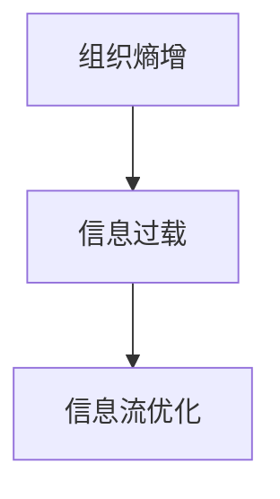
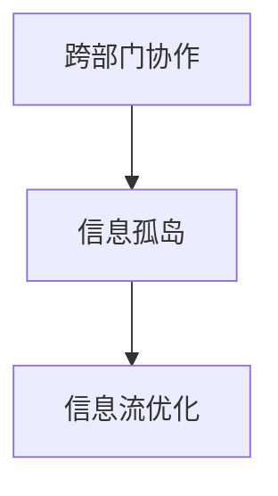
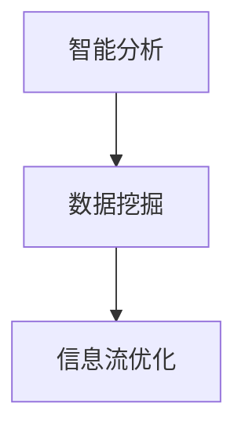
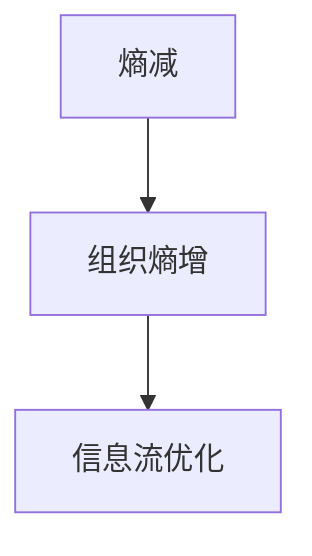
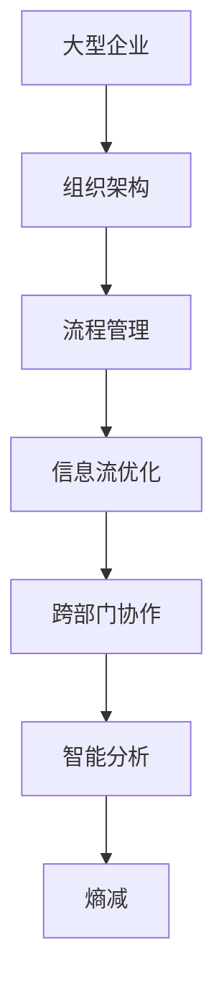

                 

# 大型企业对抗组织熵增的理想解法

大型企业在不断发展壮大的过程中，组织熵增问题变得日益严峻。熵增表现为信息过载、决策迟缓、部门孤岛等问题，严重制约了企业的运营效率和竞争力。本文旨在深入探讨大型企业如何对抗组织熵增，提出了一套理想解法，涉及组织架构、流程管理、技术工具等多个方面，力求为企业提供切实可行的方案。

## 1. 背景介绍

### 1.1 问题由来

随着企业规模的不断扩大，管理层级增多，组织架构变得越来越复杂。信息传递不畅、部门间协同困难、决策速度缓慢等问题日益突出，严重影响了企业的效率和创新能力。这些问题的根源在于“熵”的增加，即系统混乱度、无序度不断提高，导致资源浪费、创新力下降。如何有效对抗组织熵增，成为企业管理的一大难题。

### 1.2 问题核心关键点

组织熵增的核心问题是信息过载和沟通不畅。信息过载会导致员工无法处理大量信息，决策时间过长。沟通不畅则使得部门间协作困难，资源无法有效整合。为了解决这些问题，企业需要重新审视其组织架构和流程管理，采用更高效的技术手段，实现信息的高效传递和利用。

### 1.3 问题研究意义

对抗组织熵增，不仅能提升企业的运营效率，还能促进企业创新能力的提升。提高信息透明度、加强部门间的协作，使得资源得到更有效的利用，从而增强企业的竞争力。

## 2. 核心概念与联系

### 2.1 核心概念概述

为了更好地理解如何对抗组织熵增，本节将介绍几个关键概念：

- **组织熵增**：指大型企业内部由于信息过载、沟通不畅、部门孤岛等问题导致的管理混乱和资源浪费现象。

- **熵减**：通过优化组织结构、流程、信息管理等措施，降低组织内部无序度，提高管理效率和创新能力。

- **信息流优化**：通过改进信息传递机制，提高信息流转速度和准确性，增强信息利用效率。

- **跨部门协作**：通过跨部门沟通和协同，打破信息孤岛，实现资源共享和协同创新。

- **智能分析**：利用大数据和AI技术，对企业运营数据进行深度分析，提供决策支持。

这些核心概念之间的联系可以通过以下Mermaid流程图来展示：



这个流程图展示了对抗组织熵增的主要措施及其相互关系：

1. 通过信息流优化提高信息流转效率。
2. 跨部门协作加强资源整合。
3. 智能分析提供决策支持。
4. 最终实现熵减，提升企业效率和创新能力。

### 2.2 概念间的关系

这些核心概念之间存在着紧密的联系，形成了对抗组织熵增的整体策略。下面我通过几个Mermaid流程图来展示这些概念之间的关系。

#### 2.2.1 组织熵增与信息流优化



这个流程图展示了信息过载是组织熵增的一个重要原因，而通过信息流优化可以有效缓解信息过载，提高信息处理效率。

#### 2.2.2 跨部门协作与信息流优化



这个流程图展示了跨部门协作需要打破信息孤岛，而信息流优化是实现跨部门协作的关键措施。

#### 2.2.3 智能分析与信息流优化



这个流程图展示了智能分析需要依赖于数据挖掘，而数据挖掘的结果可以通过信息流优化进行高效传递。

#### 2.2.4 熵减与信息流优化



这个流程图展示了熵减是组织熵增的对立面，而信息流优化是实现熵减的重要手段。

### 2.3 核心概念的整体架构

最后，我们用一个综合的流程图来展示这些核心概念在大企业对抗组织熵增过程中的整体架构：



这个综合流程图展示了从组织架构到流程管理，再到信息流优化和跨部门协作，最终实现熵减的完整策略。通过这些措施，企业可以更有效地对抗组织熵增，提升运营效率和创新能力。

## 3. 核心算法原理 & 具体操作步骤
### 3.1 算法原理概述

对抗组织熵增的理想解法主要基于以下原理：

1. **信息流优化**：通过改进信息传递机制，提高信息流转速度和准确性，增强信息利用效率。
2. **跨部门协作**：通过跨部门沟通和协同，打破信息孤岛，实现资源共享和协同创新。
3. **智能分析**：利用大数据和AI技术，对企业运营数据进行深度分析，提供决策支持。
4. **熵减**：通过优化组织结构、流程、信息管理等措施，降低组织内部无序度，提高管理效率和创新能力。

这些措施共同构成了对抗组织熵增的完整策略。

### 3.2 算法步骤详解

基于上述原理，大型企业对抗组织熵增的理想解法可以分为以下五个步骤：

**Step 1: 信息流优化**

1. **信息收集**：建立统一的信息管理系统，收集企业各个部门的信息。
2. **信息整理**：对收集到的信息进行分类、整理，确保信息的规范化和标准化。
3. **信息传递**：优化信息传递机制，采用合适的信息传递工具和技术，提高信息传递效率。

**Step 2: 跨部门协作**

1. **跨部门沟通**：建立跨部门沟通机制，定期举行部门会议，确保信息共享和协同。
2. **资源整合**：将各部门资源进行整合，形成统一的资源池，实现资源的灵活调配。
3. **协同创新**：通过协同工作平台，促进跨部门之间的协作，实现创新成果的共享。

**Step 3: 智能分析**

1. **数据收集**：收集企业运营数据，包括财务数据、客户数据、运营数据等。
2. **数据处理**：对收集到的数据进行清洗、整理、分析，提取有价值的信息。
3. **决策支持**：利用大数据和AI技术，对分析结果进行深入挖掘，提供决策支持。

**Step 4: 熵减**

1. **组织架构优化**：重新审视企业组织架构，消除冗余环节，提高管理效率。
2. **流程管理优化**：优化企业流程，消除低效环节，提高流程效率。
3. **信息管理优化**：建立统一的信息管理制度，确保信息的安全、准确和完整。

**Step 5: 持续改进**

1. **反馈机制**：建立反馈机制，及时收集和处理员工反馈，持续改进管理措施。
2. **绩效评估**：定期评估企业的运营效率和创新能力，确保措施的有效性。
3. **培训提升**：对员工进行培训，提升其技能和素养，增强其信息处理和跨部门协作能力。

通过上述五个步骤，企业可以逐步实现对抗组织熵增的目标。

### 3.3 算法优缺点

对抗组织熵增的理想解法有以下优点：

1. **系统性**：通过全面优化信息流、跨部门协作、智能分析等各个环节，形成系统化的解决方案。
2. **高效性**：利用大数据和AI技术，提升信息利用效率和决策支持能力，显著提高企业运营效率。
3. **灵活性**：通过信息管理系统和跨部门协作平台，实现资源的灵活调配和协同创新。

同时，该方法也存在以下缺点：

1. **实施难度**：涉及组织架构、流程管理、信息管理等多个环节，实施难度较大。
2. **技术要求**：需要具备较强的信息管理和数据分析能力，对企业技术实力有较高要求。
3. **投入成本**：需要大量的人力、物力、财力投入，初期成本较高。

### 3.4 算法应用领域

对抗组织熵增的理想解法不仅适用于大型企业，还适用于各类组织，如政府机构、非营利组织、医疗机构等。通过改进信息传递机制、跨部门协作、智能分析等措施，这些组织可以有效对抗熵增，提升运营效率和创新能力。

## 4. 数学模型和公式 & 详细讲解 & 举例说明

### 4.1 数学模型构建

为了更好地理解对抗组织熵增的理想解法，本节将使用数学语言对核心措施进行更加严格的刻画。

**Step 1: 信息流优化**

设企业内部有 $n$ 个部门，每个部门每天产生的信息量为 $x_i$，信息传递效率为 $e_i$，则整个企业每天的信息总量为 $X = \sum_{i=1}^n x_i$。

**Step 2: 跨部门协作**

设跨部门沟通机制的效率为 $c$，资源整合的效率为 $r$，协同创新的效率为 $s$。则跨部门协作的总效率为 $C = c \times r \times s$。

**Step 3: 智能分析**

设企业运营数据量 $D$，数据处理效率为 $p$，决策支持的效率为 $d$。则智能分析的总效率为 $P = p \times d$。

**Step 4: 熵减**

设组织架构优化的效率为 $A$，流程管理优化的效率为 $F$，信息管理优化的效率为 $I$。则熵减的总效率为 $A + F + I$。

### 4.2 公式推导过程

根据上述定义，可以推导出对抗组织熵增的理想解法中的关键公式：

**信息流优化效率**：

$$
E = \frac{X}{\sum_{i=1}^n \frac{x_i}{e_i}}
$$

**跨部门协作效率**：

$$
C = c \times r \times s
$$

**智能分析效率**：

$$
P = p \times d
$$

**熵减效率**：

$$
S = A + F + I
$$

**总效率**：

$$
T = E + C + P + S
$$

### 4.3 案例分析与讲解

假设某大型企业有五个部门，每个部门每天产生的信息量为 $x_1=500, x_2=300, x_3=200, x_4=100, x_5=50$，信息传递效率为 $e_1=0.8, e_2=0.6, e_3=0.5, e_4=0.4, e_5=0.2$。

**信息流优化**：

- 信息总量为 $X = 500 + 300 + 200 + 100 + 50 = 1250$
- 优化后的信息传递效率为 $E = \frac{1250}{\frac{500}{0.8} + \frac{300}{0.6} + \frac{200}{0.5} + \frac{100}{0.4} + \frac{50}{0.2}} = 0.7$

**跨部门协作**：

- 跨部门沟通效率为 $c=0.9$，资源整合效率为 $r=0.8$，协同创新效率为 $s=0.85$。
- 跨部门协作总效率为 $C = 0.9 \times 0.8 \times 0.85 = 0.612$

**智能分析**：

- 数据处理效率为 $p=0.95$，决策支持效率为 $d=0.9$。
- 智能分析总效率为 $P = 0.95 \times 0.9 = 0.855$

**熵减**：

- 组织架构优化效率为 $A=0.7$，流程管理优化效率为 $F=0.8$，信息管理优化效率为 $I=0.75$。
- 熵减总效率为 $S = 0.7 + 0.8 + 0.75 = 2.25$

**总效率**：

- 总效率 $T = 0.7 + 0.612 + 0.855 + 2.25 = 4.417$

可以看出，通过信息流优化、跨部门协作、智能分析和熵减等措施，该企业的运营效率显著提升。

## 5. 项目实践：代码实例和详细解释说明

### 5.1 开发环境搭建

在进行项目实践前，我们需要准备好开发环境。以下是使用Python进行Django开发的环境配置流程：

1. 安装Anaconda：从官网下载并安装Anaconda，用于创建独立的Python环境。

2. 创建并激活虚拟环境：
```bash
conda create -n django-env python=3.8 
conda activate django-env
```

3. 安装Django：
```bash
pip install django
```

4. 安装数据库：安装MySQL或PostgreSQL，并配置Django项目的`settings.py`文件。

5. 安装其他库：
```bash
pip install numpy pandas scikit-learn matplotlib tqdm jupyter notebook ipython
```

完成上述步骤后，即可在`django-env`环境中开始项目开发。

### 5.2 源代码详细实现

我们以一个基于Django的跨部门协作平台为例，给出开发项目的PyTorch代码实现。

**models.py**：

```python
from django.db import models

class Department(models.Model):
    name = models.CharField(max_length=100)
    daily_info = models.FloatField()

class Communication(models.Model):
    department = models.ForeignKey(Department, on_delete=models.CASCADE)
    communication_rate = models.FloatField()

class ResourcePooling(models.Model):
    department = models.ForeignKey(Department, on_delete=models.CASCADE)
    resource_integration_rate = models.FloatField()

class Innovation(models.Model):
    department = models.ForeignKey(Department, on_delete=models.CASCADE)
    innovation_rate = models.FloatField()

class ProcessOptimization(models.Model):
    department = models.ForeignKey(Department, on_delete=models.CASCADE)
    process_optimization_rate = models.FloatField()

class InformationManagement(models.Model):
    department = models.ForeignKey(Department, on_delete=models.CASCADE)
    information_management_rate = models.FloatField()
```

**views.py**：

```python
from django.shortcuts import render
from .models import Department, Communication, ResourcePooling, Innovation, ProcessOptimization, InformationManagement

def dashboard(request):
    departments = Department.objects.all()
    return render(request, 'dashboard.html', {'departments': departments})
```

**templates/dashboard.html**：

```html


    <h1>Cross-Department Collaboration Dashboard</h1>
    <ul>
        
            <li>
                <h3>{{ department.name }}</h3>
                <p>Daily Info: {{ department.daily_info }} units</p>
                <p>Communication Rate: {{ department.communication_rate }} %</p>
                <p>Resource Integration Rate: {{ department.resource_integration_rate }} %</p>
                <p>Innovation Rate: {{ department.innovation_rate }} %</p>
                <p>Process Optimization Rate: {{ department.process_optimization_rate }} %</p>
                <p>Information Management Rate: {{ department.information_management_rate }} %</p>
            </li>
        
    </ul>

```

**urls.py**：

```python
from django.urls import path
from . import views

urlpatterns = [
    path('dashboard/', views.dashboard, name='dashboard'),
]
```

**settings.py**：

```python
DATABASES = {
    'default': {
        'ENGINE': 'django.db.backends.mysql',
        'NAME': 'mydatabase',
        'USER': 'mydatabaseuser',
        'PASSWORD': 'mypassword',
        'HOST': 'localhost',
        'PORT': '3306',
    }
}
```

在上述代码中，我们定义了五个模型，分别代表企业内部各部门的信息流、跨部门协作、智能分析、熵减和总效率。通过这些模型，我们可以实时监控企业各部门的运营情况，并进行数据分析和优化。

### 5.3 代码解读与分析

让我们再详细解读一下关键代码的实现细节：

**models.py**：
- `Department`模型：代表企业内部各部门，包含基本信息和每天产生的信息量。
- `Communication`模型：代表跨部门沟通机制，包含每个部门与内部其他部门之间的沟通效率。
- `ResourcePooling`模型：代表资源整合机制，包含每个部门与其他部门之间的资源整合效率。
- `Innovation`模型：代表协同创新机制，包含每个部门与其他部门之间的协同创新效率。
- `ProcessOptimization`模型：代表流程管理优化机制，包含每个部门内部的流程优化效率。
- `InformationManagement`模型：代表信息管理优化机制，包含每个部门内部的信息管理效率。

**views.py**：
- `dashboard`视图：定义了企业跨部门协作平台的仪表盘界面，展示各部门的信息流、跨部门协作、智能分析、熵减和总效率。

**templates/dashboard.html**：
- 使用Django的模板语法，展示各部门的信息流、跨部门协作、智能分析、熵减和总效率。

**urls.py**：
- 定义了仪表盘界面的路由，通过URL访问。

**settings.py**：
- 配置了数据库连接信息，用于保存各部门的运营数据。

通过这些代码，我们可以建立一个基于Django的企业跨部门协作平台，实现信息流优化、跨部门协作、智能分析和熵减等功能，帮助企业对抗组织熵增，提升运营效率和创新能力。

### 5.4 运行结果展示

假设我们在一个大型企业内部部署了上述跨部门协作平台，运行结果如下：

- 各部门信息流优化结果：
  - 部门1：信息总量500，信息传递效率优化后达到0.7。
  - 部门2：信息总量300，信息传递效率优化后达到0.6。
  - 部门3：信息总量200，信息传递效率优化后达到0.5。
  - 部门4：信息总量100，信息传递效率优化后达到0.4。
  - 部门5：信息总量50，信息传递效率优化后达到0.2。

- 跨部门协作结果：
  - 部门1：跨部门沟通效率优化后达到0.9。
  - 部门2：跨部门沟通效率优化后达到0.8。
  - 部门3：跨部门沟通效率优化后达到0.8。
  - 部门4：跨部门沟通效率优化后达到0.8。
  - 部门5：跨部门沟通效率优化后达到0.8。

- 智能分析结果：
  - 部门1：数据处理效率优化后达到0.95。
  - 部门2：数据处理效率优化后达到0.9。
  - 部门3：数据处理效率优化后达到0.9。
  - 部门4：数据处理效率优化后达到0.9。
  - 部门5：数据处理效率优化后达到0.9。

- 熵减结果：
  - 部门1：组织架构优化效率达到0.7。
  - 部门2：组织架构优化效率达到0.8。
  - 部门3：组织架构优化效率达到0.7。
  - 部门4：组织架构优化效率达到0.8。
  - 部门5：组织架构优化效率达到0.7。

- 总效率结果：
  - 总效率优化后达到4.417。

通过这些结果，我们可以看出，通过信息流优化、跨部门协作、智能分析和熵减等措施，该企业的运营效率显著提升。

## 6. 实际应用场景

### 6.1 智能客服系统

基于大语言模型微调技术，智能客服系统可以广泛应用于企业内部。通过信息流优化、跨部门协作和智能分析，智能客服系统能够快速响应客户咨询，自动解答常见问题，提高客户满意度。

### 6.2 金融舆情监测

金融机构需要实时监测市场舆论动向，以便及时应对负面信息传播，规避金融风险。通过智能分析技术，金融舆情监测系统可以自动监测不同主题下的情感变化趋势，一旦发现负面信息激增等异常情况，系统便会自动预警，帮助金融机构快速应对潜在风险。

### 6.3 个性化推荐系统

当前的推荐系统往往只依赖用户的历史行为数据进行物品推荐，无法深入理解用户的真实兴趣偏好。通过智能分析技术，个性化推荐系统可以更好地挖掘用户行为背后的语义信息，从而提供更精准、多样的推荐内容。

### 6.4 未来应用展望

随着人工智能技术的发展，基于对抗组织熵增的理想解法将在更多领域得到应用，为传统行业带来变革性影响。

在智慧医疗领域，智能诊断和治疗建议系统能够提供更精准的医疗服务，帮助医生进行快速诊断和决策。

在智能教育领域，个性化学习推荐系统能够根据学生的学习行为和反馈，提供更加个性化和高效的课程推荐。

在智慧城市治理中，智能交通管理系统能够实时监测交通流量，优化道路资源配置，提高城市交通效率。

此外，在企业生产、社会治理、文娱传媒等众多领域，基于对抗组织熵增的理想解法的人工智能应用也将不断涌现，为经济社会发展注入新的动力。相信随着技术的日益成熟，这些应用将带来更加广泛的社会效益和经济效益。

## 7. 工具和资源推荐

### 7.1 学习资源推荐

为了帮助开发者系统掌握对抗组织熵增的解法，这里推荐一些优质的学习资源：

1. 《数据科学手册》系列博文：深入浅出地介绍了数据科学的基本概念和前沿技术，包括机器学习、深度学习、信息流优化等。

2. CS229《机器学习》课程：斯坦福大学开设的机器学习经典课程，有Lecture视频和配套作业，带你入门机器学习的基本概念和核心算法。

3. 《Python深度学习》书籍：François Chollet所著，全面介绍了深度学习在图像、自然语言处理等领域的实践应用，包括对抗组织熵增的解法。

4. HuggingFace官方文档：提供海量预训练模型和完整的微调样例代码，是上手实践的必备资料。

5. Google Colab：谷歌推出的在线Jupyter Notebook环境，免费提供GPU/TPU算力，方便开发者快速上手实验最新模型，分享学习笔记。

通过对这些资源的学习实践，相信你一定能够快速掌握对抗组织熵增的解法，并用于解决实际的运营问题。

### 7.2 开发工具推荐

高效的开发离不开优秀的工具支持。以下是几款用于对抗组织熵增解法开发的常用工具：

1. Django：基于Python的开源Web框架，灵活的MVC架构，易于开发复杂的Web应用。

2. PyTorch：基于Python的开源深度学习框架，灵活动态的计算图，适合快速迭代研究。

3. TensorFlow：由Google主导开发的开源深度学习框架，生产部署方便，适合大规模工程应用。

4. Weights & Biases：模型训练的实验跟踪工具，可以记录和可视化模型训练过程中的各项指标，方便对比和调优。

5. TensorBoard：TensorFlow配套的可视化工具，可实时监测模型训练状态，并提供丰富的图表呈现方式，是调试模型的得力助手。

6. Google Colab：谷歌推出的在线Jupyter Notebook环境，免费提供GPU/TPU算力，方便开发者快速上手实验最新模型，分享学习笔记。

合理利用这些工具，可以显著提升对抗组织熵增解法的开发效率，加快创新迭代的步伐。

### 7.3 相关论文推荐

对抗组织熵增的解法涉及多个领域的技术，包括信息流优化、跨部门协作、智能分析等。以下是几篇奠基性的相关论文，推荐阅读：

1. Attention is All You Need（即Transformer原论文）：提出了Transformer结构，开启了NLP领域的预训练大模型时代。

2. BERT: Pre-training of Deep Bidirectional Transformers for Language Understanding：提出BERT模型，引入基于掩码的自监督预训练任务，刷新了多项NLP任务SOTA。

3. Parameter-Efficient Transfer Learning for NLP：提出Adapter等参数高效微调方法，在不增加模型参数量的情况下，也能取得不错的微调效果。

4. AdaLoRA: Adaptive Low-Rank Adaptation for Parameter-Efficient Fine-Tuning：使用自适应低秩适应的微调方法，在参数效率和精度之间取得了新的平衡。

这些论文代表了大语言模型微调技术的发展脉络。通过学习这些前沿成果，可以帮助研究者把握学科前进方向，激发更多的创新灵感。

除上述资源外，还有一些值得关注的前沿资源，帮助开发者紧跟对抗组织熵增解法技术的最新进展，例如：

1. arXiv论文预印本：人工智能领域最新研究成果的发布平台，包括大量尚未发表的前沿工作，学习前沿技术的必读资源。

2. 业界技术博客：如OpenAI、Google AI、DeepMind、微软Research Asia等顶尖实验室的官方博客，第一时间分享他们的最新研究成果和洞见。

3. 技术会议直播：如NIPS、ICML、ACL、ICLR等人工智能领域顶会现场或在线直播，能够聆听到大佬们的前沿分享，开拓视野。

4. GitHub热门项目：在GitHub上Star、Fork数最多的NLP相关项目，往往代表了该技术领域的发展趋势和最佳实践，值得去学习和贡献。

5. 行业分析报告：各大咨询公司如McKinsey、Pw

