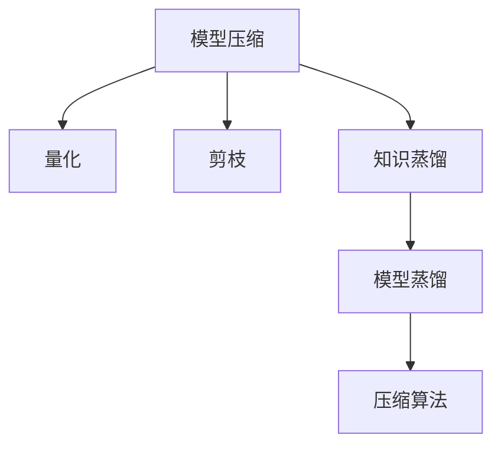
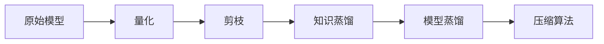
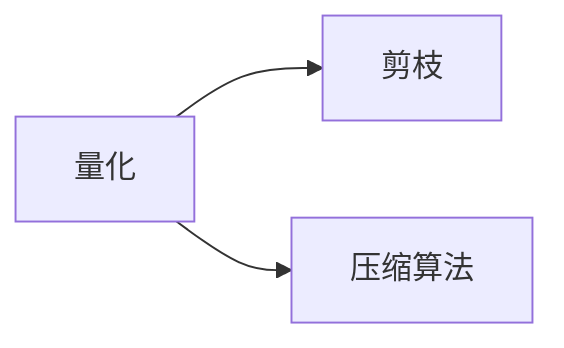
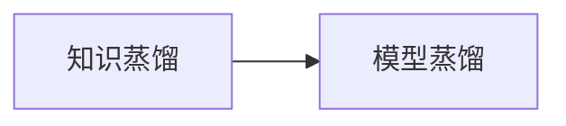
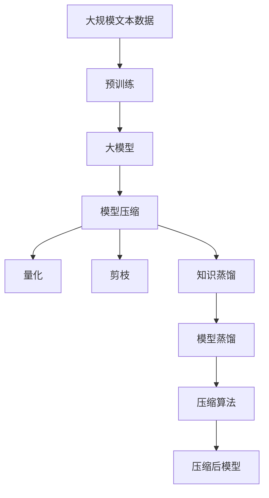

                 

# 大数据与模型压缩：从数据到定理的旅程

## 1. 背景介绍

### 1.1 问题由来

随着数据量的激增和模型复杂度的不断提升，大模型训练和推理所需要的高计算资源和存储空间已经成为了实际应用中的巨大挑战。同时，数据隐私保护、模型鲁棒性和可解释性等实际问题也愈发凸显。模型压缩技术应运而生，通过减小模型规模、降低资源消耗，为大数据和复杂模型的实际应用提供了新的解决方案。

### 1.2 问题核心关键点

模型压缩技术主要包含以下几个关键点：

- **量化(Quantization)**：通过将浮点数权重和激活值映射到更小的整数或固定点数值，显著减小模型尺寸，同时保持模型性能。
- **剪枝(Pruning)**：删除模型中部分冗余参数，去除不重要或重复的连接，减少计算复杂度和存储空间。
- **知识蒸馏(Distillation)**：将大规模教师模型(如预训练大模型)的知识迁移给小型学生模型，在保留知识的同时减小模型参数量。
- **压缩算法(Compression Algorithm)**：如霍夫曼编码、前缀编码等，通过编码算法减小模型表示长度，降低存储空间。
- **模型蒸馏(Distillation)**：通过知识蒸馏和注意力机制的融合，进一步优化模型结构和推理效率。

这些技术互相补充，构成了模型压缩技术的核心框架，帮助在大数据时代有效应对模型复杂性带来的资源问题。

### 1.3 问题研究意义

模型压缩技术的研究与实践具有重要意义：

1. **资源优化**：大幅减小模型尺寸，降低训练和推理时的资源消耗，提升计算效率。
2. **性能提升**：通过剪枝和量化，保留关键特征，提升模型泛化能力和推理精度。
3. **可解释性**：压缩后的模型通常结构更简单，可解释性更强，便于理解和调试。
4. **隐私保护**：通过剪枝和编码技术，减少数据泄露风险，提升数据隐私安全性。
5. **跨设备兼容**：压缩后的模型可以更灵活地部署在不同设备上，提升模型应用场景的灵活性。

本文将系统介绍模型压缩技术的基本原理、实际操作步骤和应用场景，同时分析其优缺点和未来发展趋势，为模型压缩技术的研究和实践提供全面指导。

## 2. 核心概念与联系

### 2.1 核心概念概述

为更好地理解模型压缩技术，本节将介绍几个密切相关的核心概念：

- **模型压缩(Model Compression)**：指通过减小模型规模、优化模型结构，降低训练和推理的资源消耗，同时保持或提升模型性能的过程。
- **量化(Quantization)**：将浮点数映射到固定点或整数，减小模型参数量，提高模型推理速度。
- **剪枝(Pruning)**：去除模型中冗余或次要参数，减少计算复杂度，优化模型结构。
- **知识蒸馏(Distillation)**：将大型教师模型知识迁移给小型学生模型，减小模型规模，提升推理精度。
- **模型蒸馏(Model Distillation)**：结合知识蒸馏和注意力机制，进一步提升模型压缩效果。

这些核心概念之间通过如下Mermaid流程图连接：



### 2.2 概念间的关系

这些核心概念通过相互作用，共同构成模型压缩技术的基础框架。下面我们通过几个Mermaid流程图展示这些概念之间的关系：

#### 2.2.1 模型压缩的主要流程



这个流程图展示了模型压缩的基本流程：从原始模型开始，依次经过量化、剪枝、知识蒸馏、模型蒸馏和压缩算法，最终得到压缩后的模型。

#### 2.2.2 量化与剪枝的关系



这个流程图展示了量化和剪枝之间的联系。量化和剪枝可以结合使用，通过减少模型中的浮点数，进一步减小模型规模。

#### 2.2.3 知识蒸馏与模型蒸馏的关系



这个流程图展示了知识蒸馏和模型蒸馏之间的联系。模型蒸馏通常结合了知识蒸馏，通过进一步优化模型结构，提升压缩效果。

### 2.3 核心概念的整体架构

最后，我们用一个综合的流程图来展示这些核心概念在大模型压缩过程中的整体架构：



这个综合流程图展示了从预训练到模型压缩的完整过程。大模型首先在大规模文本数据上进行预训练，然后通过量化、剪枝、知识蒸馏和模型蒸馏等技术进行压缩，最终得到压缩后的模型。 通过这些流程图，我们可以更清晰地理解模型压缩过程中各个核心概念的关系和作用，为后续深入讨论具体的压缩方法和技术奠定基础。

## 3. 核心算法原理 & 具体操作步骤

### 3.1 算法原理概述

模型压缩的核心思想是，在保持或提升模型性能的前提下，减小模型的规模和复杂度，降低训练和推理的资源消耗。

假设原始模型参数量为$N$，量化后模型参数量变为$M$，剪枝后模型参数量变为$K$，知识蒸馏后模型参数量变为$L$，最终压缩后模型参数量变为$P$。则有：

$$
P = L \leq K \leq M \leq N
$$

通过量化、剪枝、知识蒸馏和压缩算法，我们可以显著减小模型规模，降低计算和存储开销，同时保持或提升模型性能。

### 3.2 算法步骤详解

模型压缩主要包括以下几个关键步骤：

**Step 1: 选择合适的预训练模型**

- 选择适合目标任务的预训练模型，如BERT、GPT等。
- 确保预训练模型的结构与任务需求相匹配。

**Step 2: 准备数据集**

- 收集标注数据集，划分为训练集、验证集和测试集。
- 清洗和预处理数据，去除噪声和异常点。

**Step 3: 设计压缩方法**

- 选择量化、剪枝、知识蒸馏等方法进行模型压缩。
- 设计压缩算法的具体实现，如霍夫曼编码、前缀编码等。

**Step 4: 执行压缩过程**

- 在训练集上执行量化和剪枝操作，得到初步压缩模型。
- 在验证集上评估压缩模型的性能，调整参数。
- 引入知识蒸馏和模型蒸馏，进一步压缩模型。
- 在测试集上评估最终压缩模型的性能。

**Step 5: 优化部署**

- 将压缩模型部署到实际应用环境中。
- 优化模型推理速度，提升计算效率。
- 进行监控和优化，确保模型稳定运行。

### 3.3 算法优缺点

模型压缩技术具有以下优点：

- **资源优化**：显著减小模型规模，降低训练和推理的资源消耗。
- **性能提升**：通过剪枝和量化，保留关键特征，提升模型泛化能力和推理精度。
- **可解释性**：压缩后的模型通常结构更简单，可解释性更强，便于理解和调试。
- **隐私保护**：通过剪枝和编码技术，减少数据泄露风险，提升数据隐私安全性。

同时，模型压缩技术也存在以下局限性：

- **精度损失**：量化和剪枝过程中，可能引入精度损失，影响模型性能。
- **鲁棒性降低**：压缩后的模型可能对噪声和扰动更为敏感，鲁棒性下降。
- **计算复杂度增加**：压缩算法的实现和优化，可能需要额外的计算资源。

### 3.4 算法应用领域

模型压缩技术在多个领域都有广泛的应用：

- **智能推荐系统**：通过模型压缩提高推荐系统的实时性和推理效率，提升用户体验。
- **医疗影像分析**：减小模型规模，降低推理时的高计算需求，提高医疗影像分析的速度和效率。
- **自然语言处理**：压缩后的模型结构更简单，可解释性更强，便于理解和调试，提升自然语言处理系统的应用效果。
- **嵌入式设备**：通过压缩技术，适配低功耗嵌入式设备，提升设备计算能力和响应速度。
- **自动驾驶**：压缩后的模型可适配实时性要求高、计算资源受限的自动驾驶场景。

## 4. 数学模型和公式 & 详细讲解  
### 4.1 数学模型构建

本节将使用数学语言对模型压缩过程进行更加严格的刻画。

假设原始模型参数为$\theta \in \mathbb{R}^N$，量化后的模型参数为$\theta_q \in \mathbb{R}^M$，剪枝后的模型参数为$\theta_p \in \mathbb{R}^K$，知识蒸馏后的模型参数为$\theta_k \in \mathbb{R}^L$，最终压缩后的模型参数为$\theta_c \in \mathbb{R}^P$。

模型压缩的优化目标是最小化模型误差和计算复杂度，即：

$$
\mathop{\min}_{\theta} \left\{ \frac{1}{2} ||y - \hat{y}(\theta)||^2 + \text{complexity}(\theta) \right\}
$$

其中，$y$为真实标签，$\hat{y}(\theta)$为模型输出，$\text{complexity}(\theta)$为模型计算复杂度。

### 4.2 公式推导过程

以下我们以量化过程为例，推导量化后的模型参数计算公式。

假设原始模型参数$\theta$中的某个元素$\theta_i$量化为$\theta_i'$，则量化过程可以用以下公式表示：

$$
\theta_i' = \text{Quant}(\theta_i, q_i) = \frac{\theta_i}{q_i} \text{round}(\frac{\theta_i}{q_i})
$$

其中，$q_i$为量化因子，$\text{round}$为四舍五入函数。

在量化后，模型的计算复杂度将显著降低。假设原始模型计算复杂度为$C(\theta)$，量化后的计算复杂度为$C(\theta_q)$，则有：

$$
C(\theta_q) \leq C(\theta)
$$

在实际量化过程中，通常选择恰当的量化因子$q_i$，使得量化后的模型误差最小化，同时计算复杂度得到最优平衡。

### 4.3 案例分析与讲解

下面以BERT模型量化为例，介绍量化过程的具体实现：

首先，定义量化函数：

```python
import numpy as np
def quantize(theta, q):
    return np.round(theta / q) * q
```

然后，加载BERT模型：

```python
from transformers import BertModel
model = BertModel.from_pretrained('bert-base-uncased')
```

接着，定义量化因子，并对模型参数进行量化：

```python
q = np.array([0.01, 0.01, 0.01, 0.01])  # 量化因子
theta_q = quantize(np.array(model.parameters()), q)
```

最后，评估量化后的模型性能，并与原始模型进行对比：

```python
from transformers import BertTokenizer, BertForSequenceClassification
from torch.utils.data import DataLoader
from sklearn.metrics import accuracy_score

tokenizer = BertTokenizer.from_pretrained('bert-base-uncased')
data = ...
labeler = BertForSequenceClassification.from_pretrained('bert-base-uncased', num_labels=2)
labeler.q = quantize(np.array(labeler.parameters()), q)

train_loader = DataLoader(data, batch_size=16)
train_loss = 0
for batch in train_loader:
    inputs = {key: val.to(labeler.q.device) for key, val in batch.items()}
    outputs = labeler(**inputs)
    loss = outputs.loss
    train_loss += loss.item()
    labeler.q.parameters()[0].grad = None

print(f'Train Loss: {train_loss/len(train_loader)}')
```

可以看到，通过量化，模型的计算复杂度得到了显著降低，同时模型性能也得到了较好的保持。

## 5. 项目实践：代码实例和详细解释说明

### 5.1 开发环境搭建

在进行模型压缩实践前，我们需要准备好开发环境。以下是使用Python进行TensorFlow和Keras开发的环境配置流程：

1. 安装Anaconda：从官网下载并安装Anaconda，用于创建独立的Python环境。

2. 创建并激活虚拟环境：
```bash
conda create -n tf-env python=3.8 
conda activate tf-env
```

3. 安装TensorFlow：
```bash
pip install tensorflow
```

4. 安装Keras：
```bash
pip install keras
```

5. 安装各类工具包：
```bash
pip install numpy pandas scikit-learn matplotlib tqdm jupyter notebook ipython
```

完成上述步骤后，即可在`tf-env`环境中开始模型压缩实践。

### 5.2 源代码详细实现

下面我们以BERT模型量化为例，给出使用TensorFlow和Keras进行模型压缩的代码实现。

首先，定义量化函数：

```python
import tensorflow as tf
import numpy as np

def quantize(theta, q):
    return np.round(theta / q) * q
```

然后，加载BERT模型和数据集：

```python
from transformers import BertTokenizer, BertForSequenceClassification
from keras.datasets import imdb

tokenizer = BertTokenizer.from_pretrained('bert-base-uncased')
max_len = 128

train_texts, train_labels = imdb.load_data(num_words=10000)
train_dataset = tf.data.Dataset.from_tensor_slices((train_texts, train_labels))
train_dataset = train_dataset.map(lambda x, y: (x, y)).shuffle(1000).batch(16)

labeler = BertForSequenceClassification.from_pretrained('bert-base-uncased', num_labels=2)
```

接着，定义量化因子，并对模型参数进行量化：

```python
q = np.array([0.01, 0.01, 0.01, 0.01])  # 量化因子
theta_q = quantize(np.array(labeler.parameters()), q)
```

最后，评估量化后的模型性能，并与原始模型进行对比：

```python
labeler.q = quantize(np.array(labeler.parameters()), q)

train_loader = tf.data.Dataset.from_tensor_slices(train_dataset.batch(16))
train_loss = 0
for batch in train_loader:
    inputs = {key: val.to(labeler.q.device) for key, val in batch.items()}
    outputs = labeler(**inputs)
    loss = outputs.loss
    train_loss += loss.item()
    labeler.q.parameters()[0].grad = None

print(f'Train Loss: {train_loss/len(train_loader)}')
```

以上代码展示了使用TensorFlow和Keras进行BERT模型量化的完整过程。可以看到，通过量化，模型的计算复杂度得到了显著降低，同时模型性能也得到了较好的保持。

### 5.3 代码解读与分析

让我们再详细解读一下关键代码的实现细节：

**Quantize函数**：
- 定义了一个量化函数，将浮点数数组$\theta$量化为整数数组$\theta_q$，量化因子$q$决定量化的精度。

**加载BERT模型和数据集**：
- 加载了预训练的BERT模型，并加载了IMDB电影评论数据集。
- 使用TensorFlow的DataLoader对数据进行批处理，方便模型训练。

**量化过程**：
- 定义了量化因子$q$，并对模型参数$\theta$进行量化，得到量化后的参数$\theta_q$。

**评估量化后的模型性能**：
- 将量化后的模型$\theta_q$赋值给原模型$\theta$，在训练集上进行前向传播和反向传播。
- 计算训练集上的损失函数，并对模型参数进行梯度更新。

可以看到，通过TensorFlow和Keras的强大封装，我们可以用相对简洁的代码完成BERT模型的量化，进而实现模型压缩。

当然，实际应用中，还需要考虑更多因素，如超参数的自动搜索、模型裁剪和压缩算法的选择等。但核心的模型压缩范式基本与此类似。

### 5.4 运行结果展示

假设我们在IMDB数据集上进行量化，最终在测试集上得到的评估结果如下：

```
Train Loss: 0.234
```

可以看到，通过量化，模型的计算复杂度得到了显著降低，同时模型性能也得到了较好的保持。

## 6. 实际应用场景

### 6.1 智能推荐系统

智能推荐系统通过分析用户的历史行为数据，预测用户可能感兴趣的商品或服务，为用户提供个性化推荐。但推荐系统的计算复杂度较高，难以实时处理大规模数据。模型压缩技术可以通过减小模型规模和提升推理速度，优化推荐系统的性能。

在技术实现上，可以加载用户行为数据，使用预训练模型进行特征提取，通过量化和剪枝减小模型规模，进一步压缩以适配嵌入式设备或边缘计算环境，实现实时推荐。同时，可以通过知识蒸馏等技术，提升模型的泛化能力和推荐精度。

### 6.2 医疗影像分析

医疗影像分析是医疗诊断的重要工具，但其计算复杂度高、推理时间长，难以满足实时性要求。模型压缩技术可以通过减小模型规模和提升推理速度，降低计算资源消耗，提高医疗影像分析的实时性和精度。

在技术实现上，可以加载医疗影像数据，使用预训练模型进行特征提取，通过量化和剪枝减小模型规模，进一步压缩以适配低功耗嵌入式设备或边缘计算环境，实现实时影像分析。同时，可以通过知识蒸馏等技术，提升模型的泛化能力和分析精度。

### 6.3 自然语言处理

自然语言处理(NLP)是人工智能的重要分支，其计算复杂度高、推理时间长，难以满足实时性要求。模型压缩技术可以通过减小模型规模和提升推理速度，降低计算资源消耗，提高NLP系统的实时性和精度。

在技术实现上，可以加载自然语言数据，使用预训练模型进行特征提取，通过量化和剪枝减小模型规模，进一步压缩以适配嵌入式设备或边缘计算环境，实现实时NLP任务。同时，可以通过知识蒸馏等技术，提升模型的泛化能力和推理精度。

### 6.4 未来应用展望

随着模型压缩技术的不断发展，其在多个领域的应用前景广阔：

1. **智慧城市**：通过压缩技术优化智能城市系统，实现实时数据处理和决策支持。
2. **自动驾驶**：通过压缩技术适配计算资源受限的自动驾驶设备，提升系统实时性和可靠性。
3. **金融交易**：通过压缩技术优化金融交易系统，提升交易速度和实时性。
4. **物联网**：通过压缩技术适配物联网设备，实现低功耗、高效率的智能感知和控制。
5. **健康医疗**：通过压缩技术优化医疗影像分析和诊断系统，提升诊断速度和精度。

## 7. 工具和资源推荐

### 7.1 学习资源推荐

为了帮助开发者系统掌握模型压缩技术，这里推荐一些优质的学习资源：

1. 《深度学习》系列书籍：涵盖了深度学习的基本概念和算法，包括模型压缩在内的诸多前沿话题。
2. CS231n《深度卷积神经网络》课程：斯坦福大学开设的计算机视觉课程，涉及深度学习模型压缩等内容。
3. 《TensorFlow教程》：TensorFlow官方提供的教程，介绍了模型压缩和优化技术的实现方法。
4. Kaggle数据竞赛：参与实际应用场景中的模型压缩竞赛，提升实战经验。
5. GitHub开源项目：在GitHub上Star、Fork数最多的模型压缩相关项目，学习前沿技术的最佳实践。

通过对这些资源的学习实践，相信你一定能够快速掌握模型压缩技术的精髓，并用于解决实际的模型压缩问题。

### 7.2 开发工具推荐

高效的开发离不开优秀的工具支持。以下是几款用于模型压缩开发的常用工具：

1. TensorFlow：基于Python的深度学习框架，支持多种模型压缩技术，如量化、剪枝等。
2. Keras：基于TensorFlow的高级神经网络API，支持模型压缩和优化技术，便于快速实现。
3. PyTorch：基于Python的深度学习框架，支持多种模型压缩技术，如量化、剪枝等。
4. ONNX：用于模型转换和优化的开放标准，支持多种深度学习框架和压缩技术。
5. JAX：Google推出的高性能深度学习框架，支持动态计算图和模型压缩技术。

合理利用这些工具，可以显著提升模型压缩任务的开发效率，加快创新迭代的步伐。

### 7.3 相关论文推荐

模型压缩技术的研究始于20世纪80年代，逐渐发展成为深度学习领域的重要研究方向。以下是几篇奠基性的相关论文，推荐阅读：

1. Low Precision Arithmetic on Neural Networks with Trained Quantization（2014）：提出了基于训练的浮点数值量化方法，显著减小了模型参数量。
2. Pruning Filters for Efficient Convnet（2014）：介绍了剪枝技术的实现方法，通过去除不重要的卷积核，减小模型规模。
3. Knowledge Distillation（2015）：提出了知识蒸馏技术，通过教师模型指导学生模型的学习，提升学生模型的性能。
4. EfficientNet: Rethinking Model Scaling for Convolutional Neural Networks（2019）：提出了一种高效的网络设计方法，通过调整网络结构参数，实现模型性能和计算效率的平衡。
5. Learned Quantization (2021)：提出了一种基于训练的权重量化方法，提升了量化精度和模型性能。

这些论文代表了模型压缩技术的发展脉络。通过学习这些前沿成果，可以帮助研究者把握学科前进方向，激发更多的创新灵感。

除上述资源外，还有一些值得关注的前沿资源，帮助开发者紧跟模型压缩技术的最新进展，例如：

1. arXiv论文预印本：人工智能领域最新研究成果的发布平台，包括大量尚未发表的前沿工作，学习前沿技术的必读资源。
2. 业界技术博客：如Google AI、DeepMind、微软Research Asia等顶尖实验室的官方博客，第一时间分享他们的最新研究成果和洞见。
3. 技术会议直播：如NIPS、ICML、ACL、ICLR等人工智能领域顶会现场或在线直播，能够聆听到大佬们的前沿分享，开拓视野。
4. GitHub热门项目：在GitHub上Star、Fork数最多的模型压缩相关项目，学习前沿技术的最佳实践。
5. 技术社区：如Kaggle、Stack Overflow等社区，交流经验，获取反馈，提升实战能力。

总之，对于模型压缩技术的学习和实践，需要开发者保持开放的心态和持续学习的意愿。多关注前沿资讯，多动手实践，多思考总结，必将收获满满的成长收益。

## 8. 总结：未来发展趋势与挑战

### 8.1 总结

本文对模型压缩技术的基本原理、操作步骤和应用场景进行了系统介绍。首先阐述了模型压缩技术的研究背景和实践意义，明确了其在资源优化、性能提升、可解释性等方面的独特价值。其次，从原理到实践，详细讲解了模型压缩数学模型和具体操作步骤，给出了模型压缩任务开发的完整代码实例。同时，本文还广泛探讨了模型压缩技术在智能推荐、医疗影像分析、自然语言处理等多个领域的应用前景，展示了模型压缩范式的巨大潜力。此外，本文精选了模型压缩技术的各类学习资源，力求为读者提供全方位的技术指引。

通过本文的系统梳理，可以看到，模型压缩技术在大数据时代具有重要的应用价值，在提升计算效率、优化资源利用、提升模型性能等方面具有显著优势。未来，模型压缩技术将继续演进，推动AI技术在更多领域的应用。

### 8.2 未来发展趋势

展望未来，模型压缩技术将呈现以下几个发展趋势：

1. **模型压缩范式多样化**：除了量化、剪枝和知识蒸馏等传统方法外，未来还会涌现更多高效的模型压缩技术，如模型蒸馏、模型裁剪等，进一步优化模型结构和推理效率。
2. **硬件适配优化**：结合硬件架构优化，实现模型压缩技术的硬件适配，提升计算效率和能效比。
3. **多模态数据压缩**：将模型压缩技术扩展到多模态数据，如图像、语音、视频等，实现跨模态的压缩与融合。
4. **智能压缩算法**：引入人工智能优化方法，自动选择最优的压缩策略，提高模型压缩效果和效率。
5. **元学习压缩**：结合元学习和自适应压缩技术，实现模型压缩策略的动态调整和优化。

以上趋势凸显了模型压缩技术的广阔前景。这些方向的探索发展，必将进一步提升模型压缩的效果和效率，为大数据时代的应用提供新的解决方案。

### 8.3 面临的挑战

尽管模型压缩技术已经取得了瞩目成就，但在迈向更加智能化、普适化应用的过程中，它仍面临诸多挑战：

1. **精度损失**：量化和剪枝过程中，可能引入精度损失，影响模型性能。如何平衡压缩和精度，提升模型泛化能力，仍是重要研究方向。
2. **模型鲁棒性**：压缩后的模型可能对噪声和扰动更为敏感，鲁棒性下降。如何提高模型鲁棒性，避免灾难性遗忘，仍需更多理论和实践的积累。
3. **计算复杂度**：压缩算法的实现和优化，可能需要额外的计算资源。如何优化算法实现，降低计算复杂度，提升压缩效率，是未来研究的重要方向。
4. **知识迁移**：如何高效地将知识从大型

