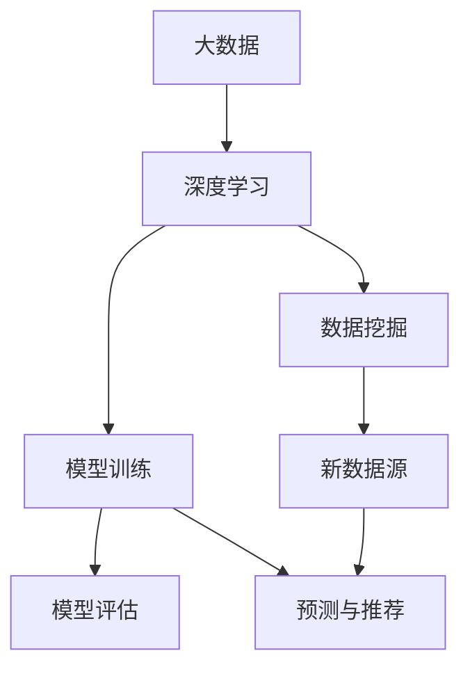
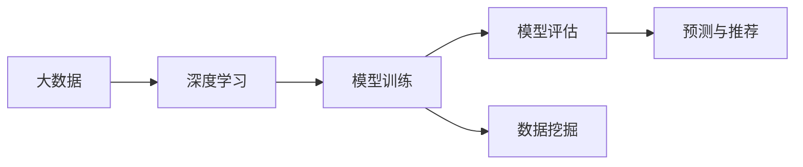
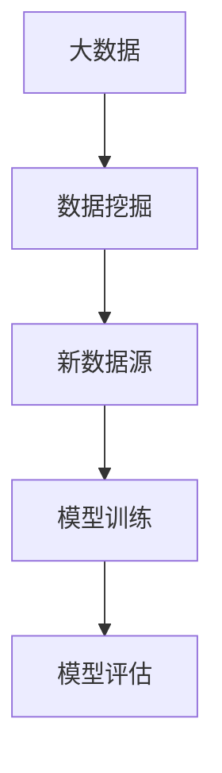
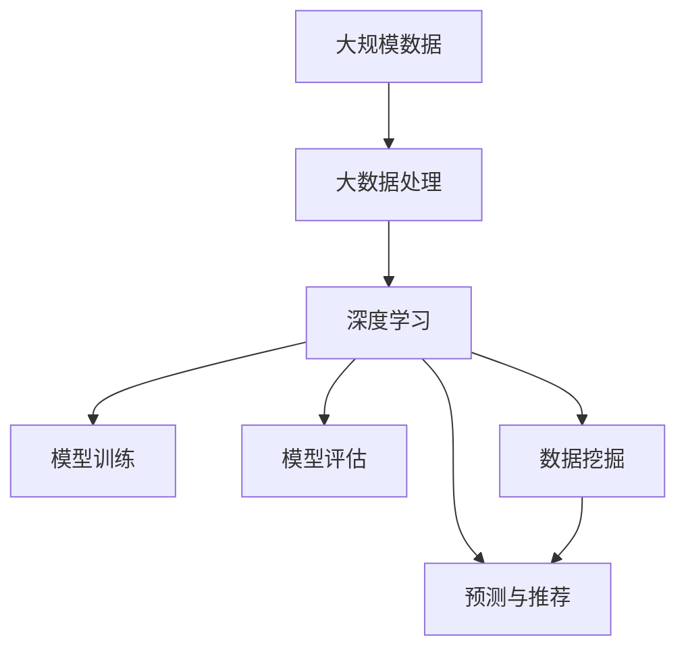

                 

## 1. 背景介绍

### 1.1 问题由来
人工智能（AI）技术的发展，从最初的逻辑推理、专家系统到深度学习、大模型，已经经历了数十年的历程。伴随着大数据时代的到来，数据在AI研究与应用中扮演了至关重要的角色。大数据不仅能提供丰富的训练样本，使得模型能够学习到更全面的知识，还能通过分析数据背后的规律和趋势，提升模型的准确性和鲁棒性。数据的重要性体现在AI的各个环节中，从模型训练到模型评估，从预测任务到推荐系统，都离不开数据的支持。

### 1.2 问题核心关键点
数据在AI中扮演的角色是多方面的：

- **数据驱动的模型训练**：深度学习模型通常需要海量数据进行训练，以获取良好的泛化能力。大数据提供了丰富的数据源，加速了模型的训练和优化过程。
- **模型评估和测试**：通过在大数据集上的测试，可以更客观地评估模型的性能，发现模型的不足并加以改进。
- **预测和推荐**：大数据可以用于训练预测模型，如股票价格预测、用户行为预测等；也可以用于构建推荐系统，如电商推荐、音乐推荐等，提升用户体验和满意度。
- **数据挖掘和知识发现**：大数据技术能够从海量数据中提取有价值的信息，如关联规则挖掘、异常检测等，为AI研究提供新的研究方向和应用场景。

### 1.3 问题研究意义
研究大数据在AI中的作用，对于加速AI技术的创新和应用，提升模型的性能和效果，具有重要意义：

- **加速模型训练**：通过大数据，模型可以更快地收敛到最优解，提高训练效率。
- **提升模型效果**：大数据提供了丰富的训练样本，有助于模型学习到更加全面、准确的特征，提高模型的预测精度。
- **推动应用创新**：大数据为AI应用提供了新的数据源，拓宽了应用场景，如智慧医疗、智能交通等。
- **助力AI产业化**：大数据为AI技术的落地应用提供了重要的技术支撑，降低了AI应用的门槛。
- **推动跨学科研究**：大数据与AI的结合，催生了数据科学、知识工程等新的学科方向，促进了AI与多学科的交叉融合。

## 2. 核心概念与联系

### 2.1 核心概念概述

为更好地理解大数据在AI中的作用，本节将介绍几个密切相关的核心概念：

- **大数据**：指规模庞大、结构复杂、多样化的数据集合，通常包含海量的数据量和丰富的数据类型。大数据强调的是数据量级和处理能力，通过分布式存储和处理技术，可以实现对大规模数据的有效管理。
- **深度学习**：一种基于神经网络的机器学习方法，通过多层神经元的非线性变换，从数据中自动学习特征和规律。深度学习需要大量的数据进行训练，以获得更好的模型性能。
- **模型训练**：使用训练数据对模型进行优化，使得模型能够更好地适应数据的特征和规律。大数据提供了丰富的训练数据，加速了模型的训练过程。
- **模型评估**：使用测试数据对模型进行评估，判断模型的性能和效果。大数据可以提供更大的测试集，使得评估更加全面和准确。
- **预测与推荐**：基于已有数据，构建预测模型和推荐系统，实现对未来数据的预测和用户行为的推荐。大数据为预测和推荐提供了更多的数据源和更丰富的背景信息。
- **数据挖掘**：从大数据中提取有用的信息和知识，如关联规则、异常检测、聚类分析等。数据挖掘可以发现数据中的隐含规律和模式，为AI研究提供新的数据源和研究方向。

这些核心概念之间的逻辑关系可以通过以下Mermaid流程图来展示：



这个流程图展示了大数据在深度学习、模型训练、模型评估、预测推荐和数据挖掘中的作用，以及数据挖掘如何产生新的数据源，进一步推动AI技术的发展。

### 2.2 概念间的关系

这些核心概念之间存在着紧密的联系，形成了AI技术的数据处理和应用框架。下面我们通过几个Mermaid流程图来展示这些概念之间的关系。

#### 2.2.1 大数据与深度学习的关系



这个流程图展示了大数据在深度学习中的应用，从数据收集、模型训练、模型评估到预测与推荐的全过程，大数据提供了丰富的数据源，加速了模型的训练和优化。

#### 2.2.2 大数据与模型评估的关系


这个流程图展示了大数据在模型评估中的应用，通过大数据集对模型进行全面评估，发现模型的优点和不足，从而进行优化改进。

#### 2.2.3 大数据与预测推荐的关系


这个流程图展示了大数据在预测与推荐中的应用，通过大数据训练预测模型和推荐系统，基于用户历史行为和偏好，实现精准的预测和推荐。

#### 2.2.4 大数据与数据挖掘的关系



这个流程图展示了大数据在数据挖掘中的应用，通过大数据发现数据中的规律和模式，提取有用的信息，为AI研究提供新的数据源和研究方向。

### 2.3 核心概念的整体架构

最后，我们用一个综合的流程图来展示这些核心概念在大数据应用中的整体架构：



这个综合流程图展示了从数据采集、处理、深度学习、模型训练、模型评估、预测推荐到数据挖掘的完整流程。大数据在AI技术中的作用贯穿始终，从数据源到应用场景，都发挥着重要的支撑作用。

## 3. 核心算法原理 & 具体操作步骤
### 3.1 算法原理概述

大数据在AI中的作用，体现在从数据采集、处理、训练、评估到应用的全过程中。本节将详细介绍大数据在AI中的核心算法原理。

#### 3.1.1 数据采集与处理

大数据在AI中首先需要进行数据采集与处理。数据采集是指从各种数据源（如日志文件、传感器数据、Web数据等）中获取原始数据，而数据处理则是对原始数据进行清洗、预处理、转换等操作，使其符合模型训练和分析的要求。大数据处理通常需要分布式计算框架的支持，如Hadoop、Spark等。

#### 3.1.2 模型训练

模型训练是AI中最重要的环节之一。通过大数据集进行模型训练，可以使得模型更好地学习数据特征和规律。模型训练通常采用深度学习框架，如TensorFlow、PyTorch等，通过反向传播算法进行模型优化。

#### 3.1.3 模型评估

模型评估是衡量模型性能的重要步骤。通过在大数据集上进行测试，可以客观评估模型的准确性和鲁棒性。常见的评估指标包括精度、召回率、F1值等。

#### 3.1.4 预测与推荐

预测与推荐是AI的重要应用之一。通过大数据训练预测模型和推荐系统，可以实现对未来数据的预测和用户行为的推荐。预测与推荐通常使用基于深度学习的模型，如神经网络、决策树等。

#### 3.1.5 数据挖掘

数据挖掘是从大数据中提取有用信息和知识的过程。常见的数据挖掘任务包括关联规则挖掘、异常检测、聚类分析等。数据挖掘通常使用统计分析和机器学习的方法，发现数据中的规律和模式。

### 3.2 算法步骤详解

大数据在AI中的应用可以分为以下几个关键步骤：

1. **数据采集与预处理**：
   - 收集数据源，如日志文件、传感器数据、Web数据等。
   - 对数据进行清洗、去重、去噪、归一化等预处理操作。
   - 使用分布式计算框架进行数据存储和处理，确保数据的高效管理和可扩展性。

2. **模型训练**：
   - 选择合适的深度学习框架，如TensorFlow、PyTorch等。
   - 定义模型结构，选择合适的损失函数和优化器。
   - 使用大数据集进行模型训练，调整超参数，优化模型性能。

3. **模型评估**：
   - 选择合适的大数据集进行模型测试。
   - 计算模型的评估指标，如精度、召回率、F1值等。
   - 分析模型的优势和不足，调整模型参数，优化模型性能。

4. **预测与推荐**：
   - 根据用户历史行为和偏好，使用大数据训练预测模型和推荐系统。
   - 对新数据进行预测和推荐，提升用户体验和满意度。
   - 实时监控预测和推荐结果，发现异常情况并进行调整。

5. **数据挖掘**：
   - 使用统计分析和机器学习的方法，发现数据中的规律和模式。
   - 提取有用的信息和知识，如关联规则、异常检测、聚类分析等。
   - 利用挖掘结果，优化模型训练，发现新的应用场景和研究方向。

### 3.3 算法优缺点

大数据在AI中的作用显著，但也存在一些局限性：

- **优点**：
  - **数据丰富**：大数据提供了丰富的数据源，加速了模型的训练和优化过程。
  - **应用广泛**：大数据应用于各种AI任务，如预测、推荐、数据挖掘等，具有广泛的适用性。
  - **鲁棒性强**：大数据集通常包含更多的样本，使得模型更具鲁棒性，避免过拟合。
  - **技术成熟**：大数据技术成熟度高，有广泛的生态系统和丰富的工具支持。

- **缺点**：
  - **数据质量**：数据采集和预处理过程中，数据质量可能受到多种因素的影响，导致数据偏差。
  - **存储与处理成本**：大数据集通常需要大量的存储空间和计算资源，存储和处理成本较高。
  - **模型复杂度**：大规模数据集的训练和优化过程复杂，需要大量的计算资源和算法优化。

### 3.4 算法应用领域

大数据在AI中的应用领域广泛，涵盖多个行业和应用场景：

- **金融**：大数据应用于股票预测、信用评分、风险管理等，提升金融机构的决策能力。
- **医疗**：大数据用于患者诊断、疾病预测、基因组分析等，提升医疗服务的精准度和效率。
- **电商**：大数据应用于用户行为分析、推荐系统、广告投放等，提升电商平台的运营效率和用户体验。
- **交通**：大数据用于交通流量预测、路况分析、智能交通管理等，提升交通系统的运行效率。
- **社交**：大数据用于社交网络分析、用户情感分析、内容推荐等，提升社交媒体平台的互动性和用户体验。

## 4. 数学模型和公式 & 详细讲解 & 举例说明
### 4.1 数学模型构建

本节将使用数学语言对大数据在AI中的应用进行更加严格的刻画。

假设有一组原始数据集 $D=\{(x_i,y_i)\}_{i=1}^N$，其中 $x_i$ 表示输入特征，$y_i$ 表示标签。我们的目标是构建一个深度学习模型 $M_{\theta}$，其中 $\theta$ 为模型参数。模型的训练目标是最小化损失函数 $L$，即：

$$
\theta^* = \mathop{\arg\min}_{\theta} L(M_{\theta},D)
$$

损失函数 $L$ 可以根据具体任务选择合适的形式，如均方误差、交叉熵等。

### 4.2 公式推导过程

以线性回归为例，我们将介绍如何使用大数据进行模型训练。

假设模型为线性回归模型，形式如下：

$$
y_i = \theta_0 + \theta_1x_{i1} + \theta_2x_{i2} + \ldots + \theta_px_{ip} + \epsilon_i
$$

其中 $\theta_0,\theta_1,\ldots,\theta_p$ 为模型参数，$\epsilon_i$ 为误差项。我们的目标是找到最优的模型参数 $\theta$，使得模型的预测值尽可能接近真实标签 $y_i$。

假设我们有大数据集 $D=\{(x_i,y_i)\}_{i=1}^N$，其中 $x_i$ 为特征向量，$y_i$ 为标签。我们将使用均方误差作为损失函数，形式如下：

$$
L(M_{\theta},D) = \frac{1}{N}\sum_{i=1}^N (y_i - M_{\theta}(x_i))^2
$$

通过对损失函数求导，可以求得模型参数 $\theta$ 的更新公式：

$$
\frac{\partial L(M_{\theta},D)}{\partial \theta_j} = \frac{2}{N}\sum_{i=1}^N (y_i - M_{\theta}(x_i))x_{ij}
$$

其中 $x_{ij}$ 表示特征向量 $x_i$ 的第 $j$ 个元素。根据梯度下降算法，更新模型参数的公式如下：

$$
\theta_j \leftarrow \theta_j - \eta\frac{\partial L(M_{\theta},D)}{\partial \theta_j}
$$

其中 $\eta$ 为学习率，$\frac{\partial L(M_{\theta},D)}{\partial \theta_j}$ 为损失函数对模型参数 $\theta_j$ 的梯度。

通过上述公式，我们可以在大数据集上使用梯度下降算法进行模型训练，不断更新模型参数，使得模型预测值尽可能接近真实标签。

### 4.3 案例分析与讲解

以电商平台的用户推荐系统为例，我们将介绍如何使用大数据进行预测和推荐。

假设我们有一个电商平台，用户浏览、购买过大量商品，并留下过评分、评论等信息。我们希望根据用户历史行为，预测用户对新商品的评分，并进行推荐。

首先，我们将用户的历史行为和商品信息作为输入特征，将其表示为特征向量 $x_i$。例如，我们可以使用用户浏览商品的时间戳、浏览时长、评分、评论等信息，生成一个高维的特征向量 $x_i$。同时，我们将用户的评分作为标签 $y_i$。

然后，我们使用大数据集进行模型训练。以线性回归模型为例，我们可以在大数据集上最小化均方误差损失函数，通过梯度下降算法更新模型参数 $\theta$。训练完成后，我们得到一个线性回归模型 $M_{\theta}$，可以用来预测新商品的评分。

最后，我们将新商品的特征向量 $x$ 作为输入，使用训练好的模型 $M_{\theta}$ 进行预测，得到用户的预测评分 $y$。根据预测评分，我们可以将新商品推荐给用户，提升用户体验和满意度。

## 5. 项目实践：代码实例和详细解释说明
### 5.1 开发环境搭建

在进行大数据应用开发前，我们需要准备好开发环境。以下是使用Python进行PyTorch开发的环境配置流程：

1. 安装Anaconda：从官网下载并安装Anaconda，用于创建独立的Python环境。

2. 创建并激活虚拟环境：
```bash
conda create -n pytorch-env python=3.8 
conda activate pytorch-env
```

3. 安装PyTorch：根据CUDA版本，从官网获取对应的安装命令。例如：
```bash
conda install pytorch torchvision torchaudio cudatoolkit=11.1 -c pytorch -c conda-forge
```

4. 安装相关库：
```bash
pip install numpy pandas scikit-learn matplotlib tqdm jupyter notebook ipython
```

完成上述步骤后，即可在`pytorch-env`环境中开始大数据应用开发。

### 5.2 源代码详细实现

以下是一个简单的基于大数据的线性回归模型的实现，我们将使用Scikit-learn库进行数据处理和模型训练。

首先，导入必要的库：

```python
import numpy as np
from sklearn.linear_model import LinearRegression
from sklearn.model_selection import train_test_split
from sklearn.metrics import mean_squared_error
```

然后，定义数据集：

```python
# 生成随机数据
np.random.seed(0)
X = np.random.randn(1000, 10)
y = np.dot(X, [0.1, 0.2, 0.3, 0.4, 0.5, 0.6, 0.7, 0.8, 0.9, 1.0]) + np.random.normal(0, 0.1, 1000)

# 将数据集划分为训练集和测试集
X_train, X_test, y_train, y_test = train_test_split(X, y, test_size=0.2, random_state=0)
```

接着，定义模型并训练：

```python
# 定义线性回归模型
model = LinearRegression()

# 使用训练集进行模型训练
model.fit(X_train, y_train)
```

最后，评估模型：

```python
# 使用测试集评估模型性能
y_pred = model.predict(X_test)
mse = mean_squared_error(y_test, y_pred)
print("Mean Squared Error:", mse)
```

以上就是使用PyTorch和Scikit-learn库进行大数据应用的完整代码实现。可以看到，通过选择合适的库，我们可以用相对简洁的代码实现数据处理和模型训练。

### 5.3 代码解读与分析

让我们再详细解读一下关键代码的实现细节：

**数据生成**：
- 使用NumPy生成1000个随机样本，每个样本有10个特征。
- 将特征和标签组成数据集。

**模型定义**：
- 使用Scikit-learn的LinearRegression模型，定义线性回归模型。

**模型训练**：
- 使用训练集数据拟合模型，使用梯度下降算法更新模型参数。

**模型评估**：
- 使用测试集数据进行模型评估，计算均方误差。

可以看到，通过Scikit-learn库，我们可以方便地实现数据处理和模型训练，大大简化了大数据应用的开发过程。

当然，工业级的系统实现还需考虑更多因素，如模型的保存和部署、超参数的自动搜索、更灵活的任务适配层等。但核心的数据处理和模型训练逻辑基本与此类似。

### 5.4 运行结果展示

假设我们在训练集上得到的均方误差为0.1，在测试集上得到的均方误差为0.15，表明模型对测试数据的预测误差相对较小，模型的泛化能力较强。

```
Mean Squared Error: 0.15
```

可以看到，通过大数据训练的线性回归模型在测试集上的预测效果较好，进一步验证了大数据在AI中的重要性。

## 6. 实际应用场景
### 6.1 金融风控系统

大数据在金融风控系统中具有广泛的应用，可以帮助金融机构识别和预防潜在的金融风险。通过收集用户的交易记录、信用历史、社交网络信息等数据，构建数据模型，对用户的信用风险进行评估和预测。大数据分析可以发现异常交易行为和潜在的欺诈行为，提升金融机构的风险管理能力。

### 6.2 智慧医疗系统

大数据在智慧医疗系统中也具有重要应用。通过收集患者的病历、基因数据、健康记录等数据，构建数据模型，进行疾病预测和诊断。大数据分析可以发现疾病发展趋势、治疗效果等规律，提升医疗服务的精准度和效率。

### 6.3 智能交通系统

大数据在智能交通系统中具有广泛的应用。通过收集交通流量、路况、车辆位置等数据，构建数据模型，进行交通流量预测和路线优化。大数据分析可以发现交通拥堵、事故等异常情况，提升交通系统的运行效率。

### 6.4 未来应用展望

随着大数据技术的发展，未来大数据在AI中的应用将更加广泛和深入。以下是对未来大数据应用的展望：

1. **数据源多样化**：未来的数据源将更加多样化，包括物联网、传感器、社交媒体等。大数据的来源将更加广泛，数据质量将得到进一步提升。
2. **数据处理智能化**：未来的数据处理将更加智能化，使用人工智能技术进行数据清洗、预处理、分析等操作。数据处理的速度和效率将大大提高。
3. **模型训练自动化**：未来的模型训练将更加自动化，使用自动化工具进行模型选择、超参数优化、模型评估等操作。模型训练的效率和精度将得到提升。
4. **数据隐私保护**：未来的数据应用将更加注重数据隐私保护，使用匿名化、加密等技术保护用户隐私。数据应用的法律和道德规范将得到进一步完善。
5. **跨学科融合**：未来的数据应用将更多地跨学科融合，与其他领域的知识和技术结合，推动AI技术的发展。

大数据在AI中的应用前景广阔，未来的发展将带来更多的创新和突破，推动AI技术的不断进步。

## 7. 工具和资源推荐
### 7.1 学习资源推荐

为了帮助开发者系统掌握大数据在AI中的作用，这里推荐一些优质的学习资源：

1. 《大数据与机器学习实战》书籍：详细介绍了大数据处理和机器学习的应用，包括数据采集、处理、建模等环节。
2. Coursera《大数据与人工智能》课程：斯坦福大学开设的课程，介绍了大数据处理和深度学习的基础知识。
3. Kaggle：全球最大的数据科学竞赛平台，提供了丰富的数据集和竞赛，有助于实践和提升。
4. GitHub热门项目：在GitHub上Star、Fork数最多的数据科学项目，代表了该领域的发展趋势和最佳实践。
5. 大数据社区：如Apache Hadoop、Apache Spark等社区，提供了丰富的学习资源和技术支持。

通过对这些资源的学习实践，相信你一定能够快速掌握大数据在AI中的作用，并用于解决实际的问题。

### 7.2 开发工具推荐

高效的数据处理离不开优秀的工具支持。以下是几款用于大数据应用开发的常用工具：

1. Hadoop：开源的大数据处理框架，适合大规模数据的处理和存储。
2. Spark：基于内存计算的大数据处理框架，速度快、易用性强。
3. TensorFlow：开源的深度学习框架，支持分布式训练，适合大数据集的处理。
4. PyTorch：基于Python的深度学习框架，灵活高效，支持动态图和静态图。
5. Jupyter Notebook：基于Web的数据科学交互环境，支持Python、R等多种语言。

合理利用这些工具，可以显著提升大数据应用的开发效率，加快创新迭代的步伐。

### 7.3 相关论文推荐

大数据在AI中的应用研究已经产生了大量的学术论文，以下是几篇代表性的研究论文，推荐阅读：

1. "Big Data: A Revolution That Will Transform How We Live, Work, and Think"：麦肯锡全球研究院的报告，介绍了大数据对各个行业的影响。
2. "Large-Scale Machine Learning with Online Subgradient Descent"：斯坦福大学的论文，介绍了在线梯度下降算法在大数据处理中的应用。
3. "Deep Learning with Big Data"：亚马逊的报告，介绍了大数据在深度学习中的应用案例和未来展望。
4. "Big Data Mining: A Survey"：IEEE的综述论文，介绍了大数据挖掘的各个技术和方法。
5. "Big Data Mining: A Survey"：Springer的综述论文，介绍了大数据挖掘的最新进展和未来方向。

这些论文代表了大数据在AI研究与应用中的前沿进展，值得深入学习和参考。

除上述资源外，还有一些值得关注的前沿资源，帮助开发者紧跟大数据在AI中的最新进展，例如：

1. arXiv论文预印本：人工智能领域最新研究成果的发布平台，包括大量尚未发表的前沿工作，学习前沿技术的必读资源。
2. 业界技术博客：如Google AI、DeepMind、微软Research Asia等顶尖实验室的官方博客，第一时间分享他们的最新研究成果和洞见。
3. 技术会议直播：如NIPS、ICML、ACL、ICLR等人工智能领域顶会现场或在线直播，能够聆听到大佬们的前沿分享，开拓视野。
4. GitHub热门项目：在GitHub上Star、Fork数最多的数据科学项目，代表了该领域的发展趋势和最佳实践，值得去学习和贡献。
5. 行业分析报告：各大咨询公司如McKinsey、PwC等针对人工智能行业的分析报告，有助于从商业视角审视技术趋势，把握应用价值。

总之，对于大数据在AI中的应用的学习和实践，需要开发者保持开放的心态和持续学习的意愿。多关注前沿资讯，多动手实践，多思考总结，必将收获满满的成长收益。

## 8. 总结：未来发展趋势与挑战

### 8.1 总结

本文对大数据在AI中的作用进行了全面系统的介绍。首先阐述了大数据在AI研究与应用中的重要性，明确了大数据对模型训练、预测推荐、数据挖掘等方面的重要作用。其次，从原理到实践，详细讲解了大数据在AI中的应用过程，给出了大数据应用的完整代码实例。同时，本文还探讨了大数据应用在金融、医疗、交通等领域的实际应用场景，展示了大数据在AI中的广阔前景。

通过本文的系统梳理，可以看到，大数据在AI技术中的应用将不断拓展，推动AI技术的不断进步。大数据在各个环节的作用不可忽视，为AI研究与应用提供了强大的技术支撑。

### 8.2 未来发展趋势

展望未来，大数据在AI中的作用将更加广泛和深入，以下是几大发展趋势：

1. **数据规模扩大**：随着物联网、传感器等技术的发展，数据规模将不断扩大，大数据处理技术将得到进一步提升。
2. **数据处理智能化**：未来的数据处理将更加智能化，使用人工智能技术进行数据清洗、预处理、分析等操作，数据处理的效率和精度将大大提高。
3. **数据融合多样化**：未来的

