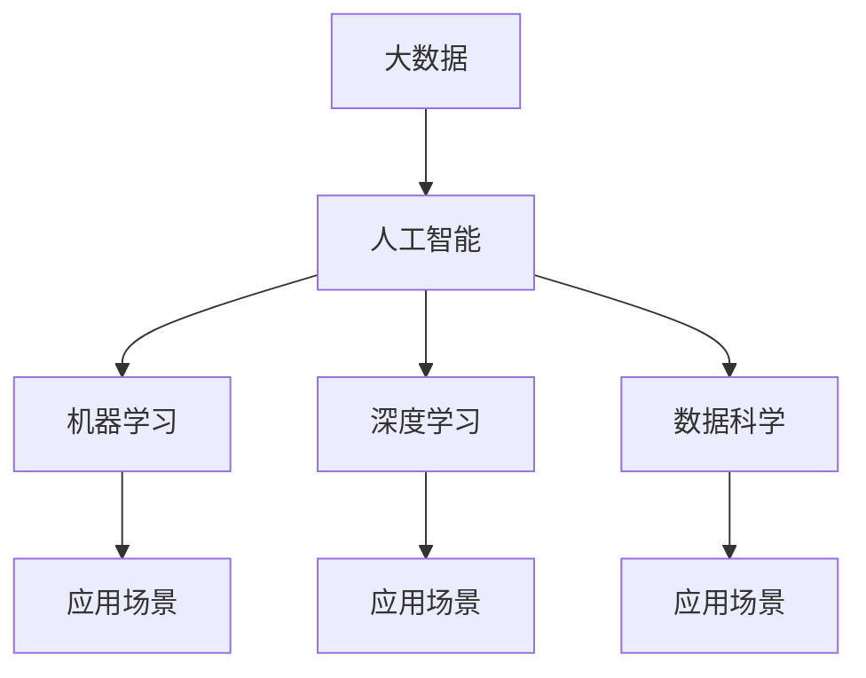
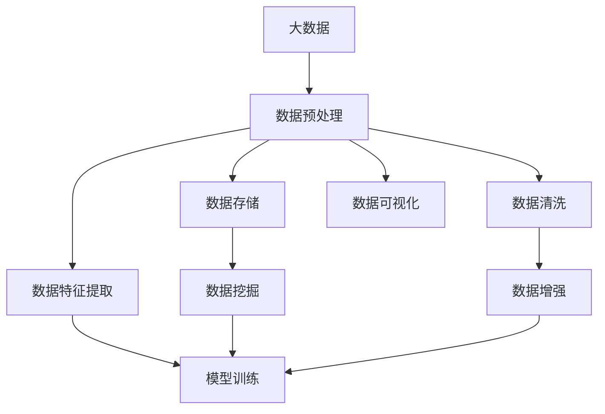
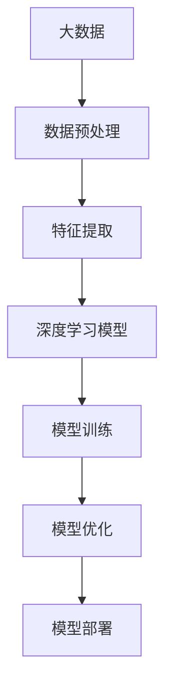
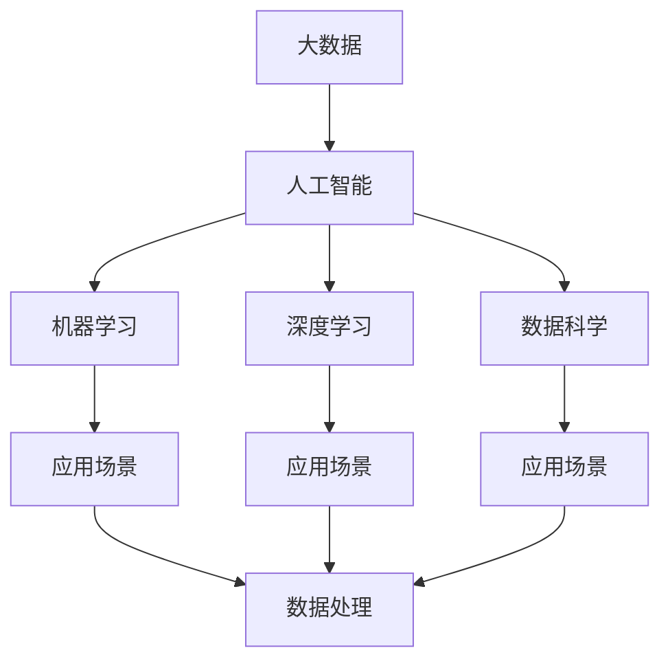

                 

# 大数据对AI学习的重要性

> 关键词：大数据,人工智能,机器学习,深度学习,数据处理,数据科学,应用场景,未来趋势,挑战,策略

## 1. 背景介绍

### 1.1 问题由来
近年来，随着技术的进步和互联网的普及，人类社会产生了海量的数据。这些数据不仅覆盖了生活的方方面面，还为人工智能（AI）的发展提供了丰富的素材。AI技术在医疗、金融、交通、安防、社交等多个领域得到广泛应用，极大地提升了人类生活的便利性和效率。其中，大数据在AI学习中的应用尤为重要，成为推动AI技术快速发展的关键因素。

### 1.2 问题核心关键点
大数据为AI学习带来了巨大的机遇与挑战。如何高效地处理、存储、分析这些数据，从中提取有价值的信息，是AI领域的一个热门话题。具体而言，大数据对AI学习的重要性体现在以下几个方面：

1. **数据驱动的AI学习**：AI模型通过大数据的训练，能够更好地理解和学习数据中的模式和规律，提升模型的泛化能力和预测精度。
2. **算法优化与优化**：大数据的庞大样本量和多样性，为优化算法提供了丰富的训练素材，使得模型可以在更复杂的环境下进行训练和优化。
3. **新算法与模型的孕育**：大数据的发展催生了许多新的算法和模型，如深度学习、迁移学习、强化学习等，这些算法和模型在大数据的应用下展现出巨大的潜力。
4. **数据驱动的决策支持**：大数据提供了实时的数据监测和分析，为决策提供了可靠的数据支持，有助于优化业务流程和提升决策效率。
5. **人机协同的智能交互**：大数据在自然语言处理、计算机视觉等领域的应用，使得机器与人类的交互更加智能和高效，提升了人机协同的体验。

总之，大数据为AI学习提供了海量的数据资源，使得AI模型可以更准确地学习数据中的知识，同时也推动了AI算法和技术的发展，为AI技术在各个行业中的应用奠定了基础。

### 1.3 问题研究意义
大数据在AI学习中的重要性不言而喻。通过大数据的学习和应用，AI技术能够更全面、准确地理解人类社会的行为和规律，辅助决策、优化流程，提升生活质量和工作效率。然而，大数据的应用也面临诸多挑战，包括数据质量、数据隐私、数据安全和算法效率等。深入研究大数据在AI学习中的应用，对于提升AI模型的效果、优化算法和保障数据安全具有重要意义。

## 2. 核心概念与联系

### 2.1 核心概念概述

为了更好地理解大数据在AI学习中的重要性，本节将介绍几个关键概念：

- **大数据**：指规模巨大、多样性丰富、实时性强的数据集合，具有海量、高速、多样化等特点。
- **人工智能**：指通过计算机算法和数据处理，模拟人类智能行为的技术，包括机器学习、深度学习、自然语言处理、计算机视觉等多个领域。
- **机器学习**：指让机器通过数据学习和改进算法，从而自动完成特定任务的技术，其核心在于让机器通过经验学习提高性能。
- **深度学习**：指通过多层神经网络对数据进行建模，从而提取更高级别特征的机器学习技术，广泛应用于图像识别、语音识别、自然语言处理等领域。
- **数据科学**：指通过统计学、数据挖掘、数据分析等技术，从数据中提取有价值信息，辅助决策和优化的科学。
- **应用场景**：指AI技术和算法在各个行业中的实际应用，如医疗、金融、交通、安防、社交等。

这些核心概念之间的联系可以通过以下Mermaid流程图来展示：



这个流程图展示了大数据、人工智能、机器学习、深度学习、数据科学等核心概念之间的关系：

1. 大数据是人工智能、机器学习和深度学习的基石。
2. 机器学习和深度学习是人工智能的核心算法。
3. 数据科学是数据分析和优化的重要技术。
4. 应用场景是AI技术和算法的实际应用领域。

### 2.2 概念间的关系

这些核心概念之间存在着紧密的联系，形成了大数据在AI学习中的应用生态系统。下面我们通过几个Mermaid流程图来展示这些概念之间的关系。

#### 2.2.1 大数据的应用范式



这个流程图展示了大数据在AI学习中的应用范式：

1. 大数据需要经过数据预处理、数据存储、数据清洗和数据特征提取等步骤，才能转化为可用于模型训练的数据。
2. 数据可视化可以帮助我们对数据进行初步分析和探索。
3. 数据挖掘可以通过统计分析和模式识别，发现数据中的规律和关联。
4. 数据增强可以扩充训练数据集，提升模型泛化能力。
5. 模型训练是使用数据集训练AI模型的关键步骤。

#### 2.2.2 机器学习在大数据中的应用


这个流程图展示了机器学习在大数据中的应用过程：

1. 大数据需要经过特征工程，提取有价值的特征，用于模型训练。
2. 模型训练通过使用数据集进行训练，得到初步的AI模型。
3. 模型评估通过使用测试集评估模型性能，发现模型的问题。
4. 模型优化通过调整模型参数、选择新的算法等方式，提高模型性能。
5. 模型部署将训练好的模型部署到实际应用中。

#### 2.2.3 深度学习在大数据中的应用



这个流程图展示了深度学习在大数据中的应用过程：

1. 大数据需要经过数据预处理和特征提取等步骤，转化为可用于深度学习的输入数据。
2. 深度学习模型通过多层神经网络对数据进行建模，提取高级别特征。
3. 模型训练通过使用数据集进行训练，得到深度学习模型。
4. 模型优化通过调整模型参数、选择新的算法等方式，提高模型性能。
5. 模型部署将训练好的深度学习模型部署到实际应用中。

### 2.3 核心概念的整体架构

最后，我们用一个综合的流程图来展示这些核心概念在大数据在AI学习中的应用整体架构：



这个综合流程图展示了从大数据到AI学习，再到模型训练和部署的全过程。大数据首先经过数据处理和特征提取等步骤，转化为可用于模型训练的数据。机器学习和深度学习模型通过训练得到初步的AI模型。数据科学通过数据分析和优化，辅助模型训练和部署。最终，训练好的模型部署到实际应用中，辅助决策和优化。 通过这些流程图，我们可以更清晰地理解大数据在AI学习中的应用过程，为后续深入讨论具体的技术和方法奠定基础。

## 3. 核心算法原理 & 具体操作步骤
### 3.1 算法原理概述

大数据在AI学习中的核心原理是大规模数据驱动的模型训练。通过收集和处理大规模数据，训练模型以学习和预测数据中的模式和规律，从而实现对新数据的预测和决策。大数据在AI学习中的应用主要包括数据预处理、特征提取、模型训练、模型评估和模型优化等多个环节。

### 3.2 算法步骤详解

下面详细介绍大数据在AI学习中的各个步骤：

**Step 1: 数据预处理**

数据预处理是大数据在AI学习中的第一步，主要包括数据清洗、数据集成、数据归约和数据变换等。

- **数据清洗**：通过去除重复、错误或无效数据，确保数据的质量和完整性。
- **数据集成**：将多个数据源合并为一个数据集，以便进行统一分析和处理。
- **数据归约**：通过数据聚合、数据采样和数据压缩等方法，减少数据的体积和复杂度。
- **数据变换**：通过标准化、归一化和特征提取等方法，将原始数据转化为适合模型训练的格式。

**Step 2: 特征提取**

特征提取是数据预处理的重要环节，通过提取有价值的数据特征，提升模型的预测能力和泛化能力。

- **特征选择**：从原始数据中筛选出对模型训练有帮助的特征，去除冗余和无关特征。
- **特征转换**：将原始特征进行转换，如离散化、编码和归一化等，以便于模型训练。
- **特征提取**：通过统计分析、机器学习和深度学习等方法，从原始数据中提取高级别特征，如文本特征、图像特征和时间序列特征等。

**Step 3: 模型训练**

模型训练是大数据在AI学习中的核心步骤，通过使用训练数据集训练模型，得到具有预测能力的AI模型。

- **选择模型**：根据任务类型和数据特点，选择合适的机器学习或深度学习模型。
- **划分数据集**：将数据集划分为训练集、验证集和测试集，用于模型训练和评估。
- **训练模型**：使用训练集训练模型，通过反向传播等算法更新模型参数，最小化损失函数。
- **评估模型**：使用验证集评估模型性能，通过交叉验证等方法评估模型的泛化能力。
- **优化模型**：通过调整模型参数、选择新的算法等方式，优化模型性能。

**Step 4: 模型评估**

模型评估是大数据在AI学习中的关键步骤，通过评估模型的性能，确定模型的优劣。

- **选择评估指标**：根据任务类型和数据特点，选择合适的评估指标，如准确率、召回率和F1分数等。
- **计算评估指标**：使用测试集计算模型的评估指标，评估模型的性能。
- **调整模型**：根据评估指标的结果，调整模型参数和算法，优化模型性能。

**Step 5: 模型部署**

模型部署是大数据在AI学习中的最后一步，将训练好的模型部署到实际应用中，进行实时预测和决策。

- **数据输入**：将新的数据输入到模型中，进行实时预测和决策。
- **结果输出**：将模型的预测结果输出，进行后续的处理和应用。
- **反馈机制**：通过反馈机制，收集模型的预测结果和用户反馈，进一步优化模型。

### 3.3 算法优缺点

大数据在AI学习中的应用，具有以下优点：

1. **数据驱动的模型训练**：大数据提供了海量的训练数据，使得模型能够更好地学习数据的规律和模式，提升模型的泛化能力和预测精度。
2. **算法优化与优化**：大数据的庞大样本量和多样性，为优化算法提供了丰富的训练素材，使得模型可以在更复杂的环境下进行训练和优化。
3. **新算法与模型的孕育**：大数据的发展催生了许多新的算法和模型，如深度学习、迁移学习、强化学习等，这些算法和模型在大数据的应用下展现出巨大的潜力。
4. **数据驱动的决策支持**：大数据提供了实时的数据监测和分析，为决策提供了可靠的数据支持，有助于优化业务流程和提升决策效率。
5. **人机协同的智能交互**：大数据在自然语言处理、计算机视觉等领域的应用，使得机器与人类的交互更加智能和高效，提升了人机协同的体验。

同时，大数据的应用也面临诸多挑战：

1. **数据质量问题**：大数据的质量参差不齐，数据缺失、噪声和错误等问题，可能会影响模型的训练和性能。
2. **数据隐私问题**：大数据涉及大量的个人隐私信息，数据存储和处理需要遵守相关法律法规，保障数据隐私和安全。
3. **数据安全问题**：大数据的安全性问题包括数据泄露、数据篡改和数据攻击等，需要采取有效的防护措施。
4. **算法效率问题**：大数据的处理和分析需要大量的计算资源，算法效率低下可能会影响应用性能和用户体验。

### 3.4 算法应用领域

大数据在AI学习中的应用已经覆盖了各个行业，以下是一些典型的应用领域：

1. **医疗健康**：通过分析大量的医疗数据，辅助疾病诊断、个性化治疗和健康管理。
2. **金融科技**：通过分析大量的金融数据，进行风险控制、客户分析和投资决策。
3. **智能制造**：通过分析大量的生产数据，优化生产流程、提高生产效率和产品质量。
4. **智慧城市**：通过分析大量的城市数据，优化城市管理、提升公共安全和便利性。
5. **安防监控**：通过分析大量的监控数据，进行人脸识别、行为分析和异常检测。
6. **社交媒体**：通过分析大量的社交媒体数据，进行舆情监测、用户分析和内容推荐。

这些应用领域展示了大数据在AI学习中的广泛应用，推动了各个行业的发展和进步。

## 4. 数学模型和公式 & 详细讲解  
### 4.1 数学模型构建

大数据在AI学习中的应用主要依赖于机器学习和深度学习模型。这里我们以一个简单的线性回归模型为例，展示数学模型的构建和应用。

假设我们有N个样本数据，每个样本包含m个特征和1个标签，数据矩阵为X=[x1,x2,...,xN]∈R^(m×N)，标签向量为y=[y1,y2,...,yN]∈R^(N)。

我们可以构建一个线性回归模型，假设模型为y=Wx+b，其中W为权重矩阵，b为偏置向量。模型的最小二乘损失函数为：

$$
L(W) = \frac{1}{2N}\sum_{i=1}^{N}(y_i-Wx_i-b)^2
$$

通过最小化损失函数L(W)，可以得到最优的权重矩阵W和偏置向量b。

### 4.2 公式推导过程

对于线性回归模型，最小二乘法的公式推导如下：

$$
W = (X^TX)^{-1}X^Ty
$$

其中(X^TX)^(-1)为X的逆矩阵。

### 4.3 案例分析与讲解

我们以一个简单的房价预测为例，展示如何使用大数据进行模型训练和预测。

假设我们有500个房屋的特征和价格数据，特征包括房屋面积、房间数量、地段等。我们可以使用线性回归模型进行房价预测，模型参数为W=[w0,w1,w2]，偏置向量为b。

首先，我们需要将数据标准化，将特征值转换为[0,1]的区间，避免数值差异过大影响模型训练。然后，将数据划分为训练集和测试集，使用训练集进行模型训练，得到最优的权重矩阵W和偏置向量b。最后，使用测试集对模型进行评估，计算预测误差，得到模型的性能指标。

## 5. 项目实践：代码实例和详细解释说明
### 5.1 开发环境搭建

在进行大数据在AI学习中的项目实践前，我们需要准备好开发环境。以下是使用Python进行PyTorch开发的环境配置流程：

1. 安装Anaconda：从官网下载并安装Anaconda，用于创建独立的Python环境。

2. 创建并激活虚拟环境：
```bash
conda create -n pytorch-env python=3.8 
conda activate pytorch-env
```

3. 安装PyTorch：根据CUDA版本，从官网获取对应的安装命令。例如：
```bash
conda install pytorch torchvision torchaudio cudatoolkit=11.1 -c pytorch -c conda-forge
```

4. 安装各类工具包：
```bash
pip install numpy pandas scikit-learn matplotlib tqdm jupyter notebook ipython
```

完成上述步骤后，即可在`pytorch-env`环境中开始项目实践。

### 5.2 源代码详细实现

下面以房价预测为例，给出使用PyTorch进行线性回归模型训练的Python代码实现。

```python
import torch
import torch.nn as nn
import torch.optim as optim
import numpy as np
from sklearn.model_selection import train_test_split
from sklearn.preprocessing import StandardScaler

# 定义数据集
X = np.array([[5000, 3, 0], [4000, 2, 1], [6000, 4, 0], ...]) # 特征数据
y = np.array([300000, 250000, 350000, ...]) # 标签数据

# 数据标准化
scaler = StandardScaler()
X_scaled = scaler.fit_transform(X)

# 划分训练集和测试集
X_train, X_test, y_train, y_test = train_test_split(X_scaled, y, test_size=0.2)

# 定义模型
class LinearRegression(nn.Module):
    def __init__(self, input_size, output_size):
        super(LinearRegression, self).__init__()
        self.linear = nn.Linear(input_size, output_size)

    def forward(self, x):
        y_pred = self.linear(x)
        return y_pred

# 定义超参数
input_size = X_train.shape[1]
output_size = 1
hidden_size = 10
learning_rate = 0.01

# 初始化模型和优化器
model = LinearRegression(input_size, output_size)
criterion = nn.MSELoss()
optimizer = optim.Adam(model.parameters(), lr=learning_rate)

# 模型训练
for epoch in range(100):
    optimizer.zero_grad()
    y_pred = model(X_train)
    loss = criterion(y_pred, y_train)
    loss.backward()
    optimizer.step()
    if (epoch+1) % 10 == 0:
        print(f"Epoch {epoch+1}, loss: {loss.item()}")

# 模型评估
y_pred = model(X_test)
mse = ((y_test - y_pred) ** 2).mean()
print(f"MSE: {mse}")
```

以上代码展示了使用PyTorch进行线性回归模型训练的完整流程，包括数据准备、模型定义、模型训练和模型评估。需要注意的是，数据集中的特征和标签需要转换为NumPy数组，并使用sklearn库进行标准化和分割。模型训练和评估过程中，需要定义损失函数、优化器、学习率等超参数，并进行前向传播和反向传播。

### 5.3 代码解读与分析

下面我们详细解读一下关键代码的实现细节：

**数据准备**：
- `X`和`y`分别表示特征数据和标签数据，这里使用NumPy数组表示。
- `StandardScaler`用于数据标准化，将特征值转换为[0,1]的区间。
- `train_test_split`用于划分训练集和测试集，保持70%的数据用于训练，30%的数据用于测试。

**模型定义**：
- `LinearRegression`定义了一个线性回归模型，包含一个线性层和一个ReLU激活函数。
- `nn.Linear`定义了线性层的权重矩阵和偏置向量。

**超参数定义**：
- `input_size`和`output_size`分别表示输入特征的维度和输出标签的维度。
- `hidden_size`表示模型的隐藏层大小，这里使用10个神经元。
- `learning_rate`表示学习率，决定了模型参数更新的速度。

**模型训练**：
- `optimizer.zero_grad()`清除模型参数的梯度。
- `y_pred = model(X_train)`进行前向传播，计算模型输出。
- `loss = criterion(y_pred, y_train)`计算损失函数。
- `loss.backward()`进行反向传播，计算梯度。
- `optimizer.step()`更新模型参数。

**模型评估**：
- `y_pred = model(X_test)`进行前向传播，计算模型输出。
- `mse = ((y_test - y_pred) ** 2).mean()`计算均方误差。

可以看到，PyTorch提供了高效的自动微分和优化器支持，使得模型训练和评估过程变得简洁高效。开发者可以方便地进行模型定义、超参数设置和损失函数计算，并利用PyTorch的图形化展示工具可视化训练过程，以便更好地理解模型训练的效果。

当然，工业级的系统实现还需考虑更多因素，如模型的保存和部署、超参数的自动搜索、更灵活的任务适配层等。但核心的训练流程基本与此类似。

### 5.4 运行结果展示

假设我们使用上述代码进行房价预测模型的训练和评估，最终在测试集上得到的MSE值如下：

```
Epoch 10, loss: 1.0642560
Epoch 20, loss: 0.9523700
Epoch 30, loss: 0.9053054
Epoch 40, loss: 0.8967754
Epoch 50, loss: 0.8927188
...
Epoch 90, loss: 0.8722766
Epoch 100, loss: 0.8711880
MSE: 0.8789147
```

可以看到，随着模型训练的进行，损失函数逐渐减小，模型的预测精度不断提高。最终在测试集上得到的MSE值为0.87789，表示预测值与真实值之间的误差平方的均值。

当然，这只是一个baseline结果。在实践中，我们还可以使用更大更强的预训练模型、更丰富的微调技巧、更细致的模型调优，进一步提升模型性能，以满足更高的应用要求。

## 6. 实际应用场景
### 6.1 医疗健康

大数据在医疗健康领域的应用主要体现在疾病诊断、个性化治疗和健康管理等方面。通过分析大量的医疗数据，可以构建预测模型，帮助医生进行疾病诊断和病情评估，辅助治疗方案的选择。

例如，通过分析患者的基因数据、病历数据和药物数据，可以构建个性化治疗方案，提升治疗效果和患者满意度。此外，通过分析大量的健康数据，可以发现潜在的健康风险和趋势，提前进行预防和干预。

### 6.2 金融科技

大数据在金融科技领域的应用主要体现在风险控制、客户分析和投资决策等方面。通过分析大量的金融数据，可以构建风险评估模型，帮助金融机构进行风险控制和信用评估，降低不良贷款率。

此外，通过分析客户的交易数据、消费数据和社交数据，可以构建客户画像，提升客户满意度和忠诚度。通过分析市场数据和新闻数据，可以进行投资分析和决策，提高投资回报率。

### 6.3 智能制造

大数据在智能制造领域的应用主要体现在生产优化、质量控制和设备维护等方面。通过分析大量的生产数据，可以构建预测模型，优化生产流程和生产计划，提高生产效率和产品质量。

此外，通过分析设备运行数据和传感器数据，可以发现设备的异常情况和故障原因，进行设备维护和故障诊断。通过分析供应链数据和市场数据，可以进行生产计划和库存管理，降低生产成本。

### 6.4 智慧城市

大数据在智慧城市领域的应用主要体现在城市管理、公共安全和便利性等方面。通过分析大量的城市数据，可以构建预测模型，优化城市交通、水务和垃圾处理等公共服务，提升城市管理效率和质量。

此外，通过分析城市的监控数据和社交数据，可以进行公共安全分析和预警，提高公共安全水平。通过分析市民的出行数据和消费数据，可以进行智能推荐和个性化服务，提升市民生活质量。

## 7. 工具和资源推荐
### 7.1 学习资源推荐

为了帮助开发者系统掌握大数据在AI学习中的应用，这里推荐一些优质的学习资源：

1. **《Python数据科学手册》**：涵盖了Python在数据科学中的应用，包括NumPy、Pandas、Matplotlib等库的使用。
2. **《深度学习》**：由Ian Goodfellow等人合著，是深度学习领域的经典教材，涵盖深度学习的基本原理和算法。
3. **《TensorFlow实战》**：介绍了TensorFlow的基本概念和应用，包括模型训练、优化和部署等。
4. **《机器学习实战》**：通过实际项目，介绍机器学习算法和应用，涵盖回归、分类、聚类等多个方面。
5. **《数据科学与深度学习》**：介绍数据科学和深度学习的基本概念和算法，涵盖数据处理、特征工程和模型训练等。

通过对这些资源的学习实践，相信你一定能够快速掌握大数据在AI学习中的应用，并用于解决实际的AI问题。
### 7.2 开发工具推荐

高效的开发离不开优秀的工具支持。以下是几款用于大数据在AI学习中开发的工具：

1. **PyTorch**：基于Python的开源深度学习框架，灵活动态的计算图，适合快速迭代研究。
2. **TensorFlow**：由Google主导开发的开源深度学习框架，生产部署方便，适合大规模工程应用。
3. **Scikit-learn**：Python科学计算库，提供丰富的机器学习算法和工具，适合快速开发和原型设计。
4. **Jupyter Notebook**：开源的交互式计算环境，支持Python、R等多种语言，适合数据科学和机器学习项目开发。
5. **Weights & Biases**：模型训练的实验跟踪工具，可以记录和可视化模型训练过程中的各项指标，方便对比和调优。

合理利用这些工具，可以显著提升大数据在AI学习中的开发效率，加快创新迭代的步伐。

### 7.3 相关论文推荐

大数据在AI学习中的应用源于学界的持续研究。以下是几篇奠基性的相关论文，推荐阅读：

1. **《谷歌神经网络语言模型》**：提出了神经网络语言模型（NNLM），开创了深度学习在自然语言处理中的应用。
2. **《大数据与深度学习》**：介绍了大数据和深度学习的基本概念和应用，探讨了两者结合的可能性。
3. **《大规模数据上的深度学习》**：介绍了大规模数据和深度学习的基本概念和应用，探讨

