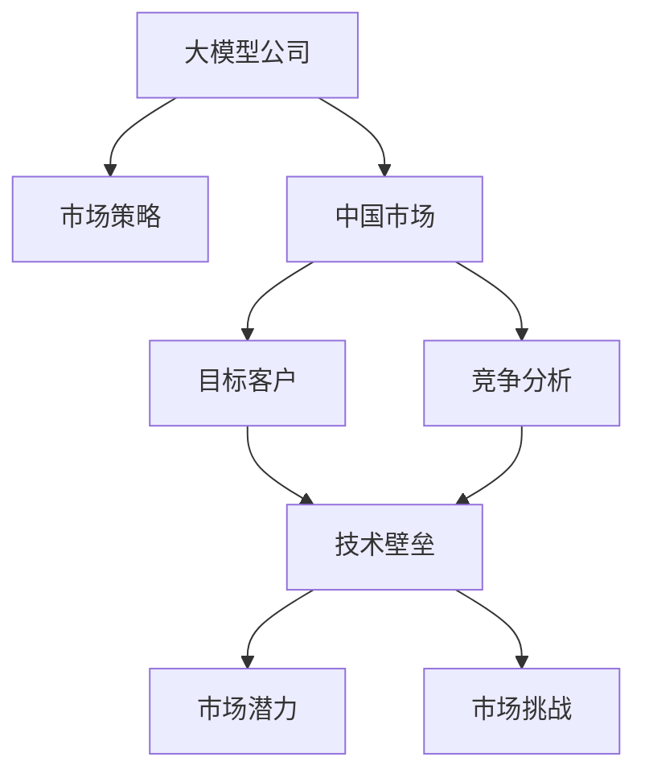
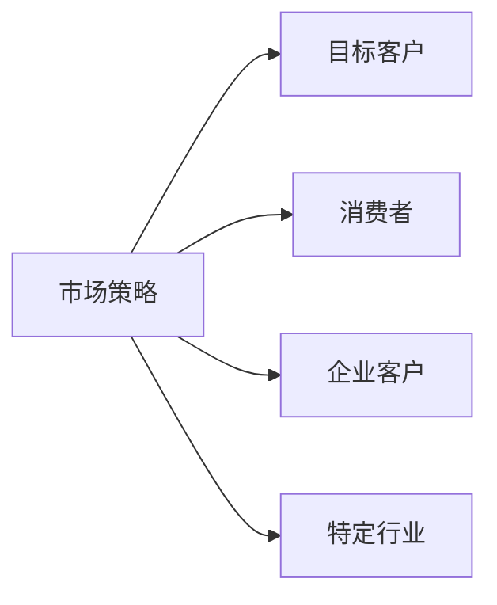
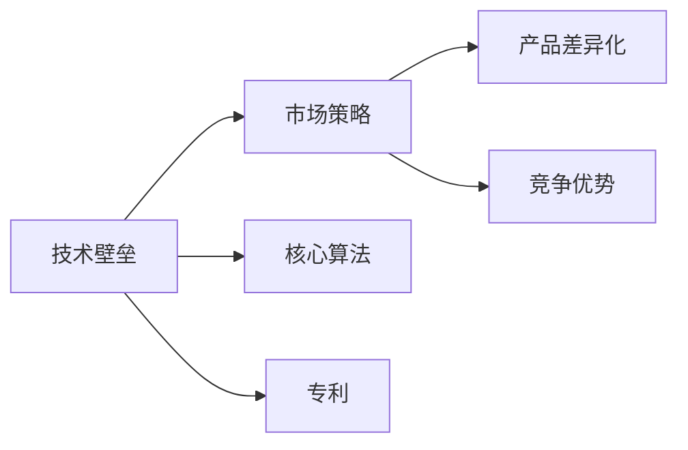
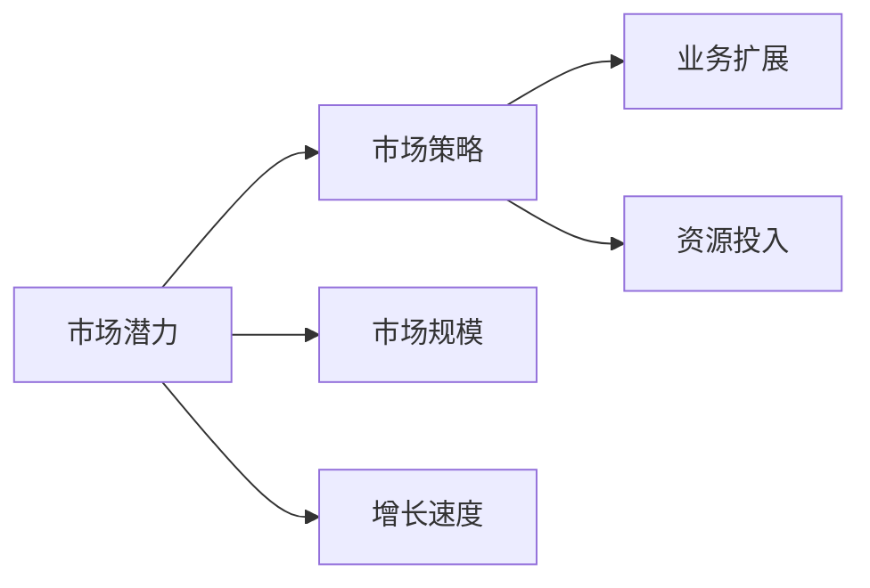
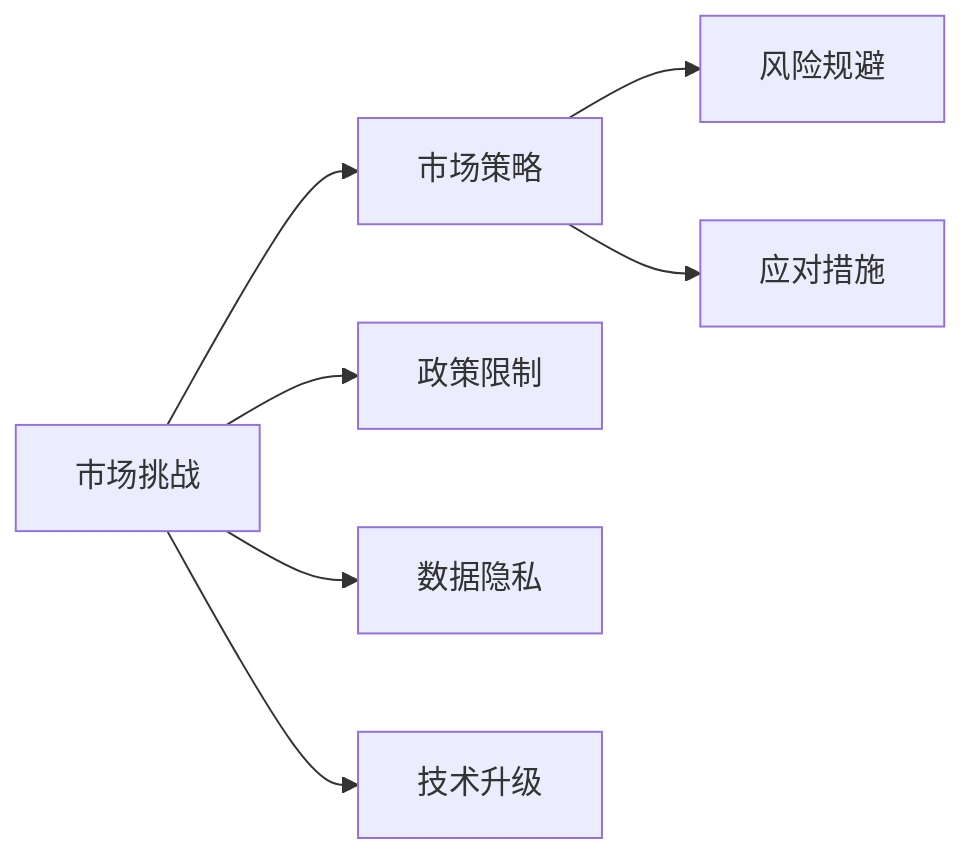
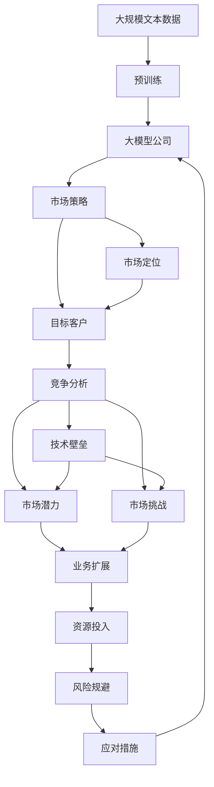

                 

# 大模型公司在中国的市场策略

> 关键词：大模型公司, 市场策略, 中国市场, 市场定位, 竞争分析, 业务模式, 技术壁垒, 市场潜力, 市场挑战

## 1. 背景介绍

### 1.1 问题由来
随着人工智能(AI)技术的快速发展和应用，大模型公司在中国逐渐崭露头角。这些公司通过开发和部署高性能的AI模型，为企业和消费者提供了一系列创新的服务，包括自然语言处理(NLP)、计算机视觉、语音识别等。在此背景下，大模型公司如何制定有效的市场策略，进一步拓展在中国市场的业务，已成为企业战略规划的重要议题。

### 1.2 问题核心关键点
中国市场具有独特的市场环境和竞争格局，大模型公司要在中国成功运营，需重点关注以下几个关键点：

1. **市场定位与目标客户**：明确企业在中国市场的定位，确定主要服务对象，如企业客户、消费者或特定行业。
2. **竞争分析**：了解主要竞争对手的战略、优势和劣势，制定差异化策略。
3. **技术壁垒与知识产权**：构建独特技术优势，保护关键技术，增强市场竞争力。
4. **市场潜力与扩展策略**：评估市场规模与增长潜力，制定进入新市场的策略。
5. **市场挑战与应对措施**：识别并应对市场中的潜在风险和挑战，如政策限制、数据隐私、技术升级等。

### 1.3 问题研究意义
研究大模型公司在华市场策略，对于提升企业的市场竞争力，拓展新业务领域，加速AI技术在中国的产业化进程具有重要意义：

1. **增强竞争力**：了解中国市场的特点，制定针对性的市场策略，提升企业在华业务表现。
2. **拓展市场**：识别潜在的市场机会，制定进入新领域的策略，拓展业务范围。
3. **加速落地**：优化技术适配和应用策略，加速AI技术在中国的落地和应用。
4. **提升影响力**：通过市场策略的实施，增强企业在业界的品牌影响力和市场占有率。
5. **可持续发展**：构建符合中国法律法规的市场运营模式，实现长期稳定发展。

## 2. 核心概念与联系

### 2.1 核心概念概述

为更好地理解大模型公司在华的市场策略，本节将介绍几个核心概念及其相互联系：

- **大模型公司**：指开发和运营高性能AI模型的企业，如OpenAI、Google AI、Microsoft Azure AI等。
- **市场策略**：企业为了实现业务目标，在市场竞争中采取的总体计划和行动方案，包括产品定位、营销策略、市场扩展等。
- **中国市场**：指中国地区的市场环境、法律法规、消费者需求和竞争态势。
- **目标客户**：企业服务的主要群体，如企业客户、消费者、特定行业等。
- **技术壁垒**：企业拥有的独特技术优势，如核心算法、专利等。
- **市场潜力**：市场规模、增长速度和未来的发展趋势。
- **市场挑战**：影响企业在市场运营的内部和外部因素，如政策限制、数据隐私等。

这些概念之间的逻辑关系可以通过以下Mermaid流程图来展示：



这个流程图展示了大模型公司在中国市场的核心概念及其相互关系：

1. 大模型公司在中国市场运营，需制定合适的市场策略。
2. 市场策略需基于对目标客户的理解。
3. 目标客户的分析需结合对中国市场环境的竞争分析。
4. 技术壁垒和市场潜力是制定市场策略的重要参考。
5. 市场挑战需要制定应对措施，以确保企业在中国市场的长期发展。

### 2.2 概念间的关系

这些核心概念之间存在着紧密的联系，形成了大模型公司在华市场运营的整体框架。下面我们通过几个Mermaid流程图来展示这些概念之间的关系。

#### 2.2.1 市场策略与目标客户的关系



这个流程图展示了大模型公司的市场策略与目标客户之间的关系。市场策略需明确服务的主要客户群体，如消费者、企业或特定行业，并针对不同客户制定相应的产品和服务。

#### 2.2.2 技术壁垒与市场策略的关系



这个流程图展示了大模型公司的技术壁垒与市场策略之间的关系。技术壁垒是市场策略制定的重要支撑，通过构建独特技术优势，可以提升产品差异化和市场竞争力。

#### 2.2.3 市场潜力与市场策略的关系



这个流程图展示了大模型公司的市场潜力与市场策略之间的关系。市场潜力是市场策略制定的重要参考，通过评估市场规模和增长速度，可以制定进入新市场的策略，并进行资源优化配置。

#### 2.2.4 市场挑战与市场策略的关系



这个流程图展示了大模型公司的市场挑战与市场策略之间的关系。识别和应对市场中的挑战是市场策略实施的关键，通过制定有效的应对措施，可以降低风险，保障市场运营的顺利进行。

### 2.3 核心概念的整体架构

最后，我们用一个综合的流程图来展示这些核心概念在大模型公司在华市场运营过程中的整体架构：



这个综合流程图展示了从预训练到市场运营，再到业务扩展的完整过程。大模型公司首先在大规模文本数据上进行预训练，然后通过市场策略确定服务对象，制定具体的市场方案。同时，通过技术壁垒和市场潜力分析，确定具体的业务扩展方向，并识别和应对市场中的挑战，最终实现业务的持续发展。

## 3. 核心算法原理 & 具体操作步骤
### 3.1 算法原理概述

大模型公司在华市场策略制定，本质上是基于市场细分和竞争分析的策略制定过程。其核心思想是：通过对中国市场的深入研究，识别市场机会和竞争态势，制定差异化、可执行的市场策略，从而提升企业在华的业务表现。

形式化地，假设大模型公司为中国市场准备了m个产品和服务，每个产品p_i的预期收入为R_i，目标市场份额为S_i，潜在市场规模为M_i，竞争强度为C_i。市场策略的目标是最大化总收入R，即：

$$
\max_{p_i} R = \sum_{i=1}^m R_i
$$

其中，总收入R由各产品收入R_i组成，收入R_i计算公式为：

$$
R_i = S_i \times M_i \times \frac{1}{1+C_i}
$$

这个公式表示，每个产品i的收入由其目标市场份额S_i、潜在市场规模M_i和竞争强度C_i共同决定。

### 3.2 算法步骤详解

大模型公司在华市场策略制定的一般步骤如下：

**Step 1: 市场细分与目标客户选择**
- 对中国市场进行细分，识别不同客户群体的需求和特点，如企业客户、消费者、特定行业等。
- 选择主要服务对象，明确目标客户群体，如企业客户、B2C消费者、特定行业等。

**Step 2: 竞争分析**
- 收集和分析主要竞争对手的业务策略、市场表现、优势和劣势，识别核心竞争力。
- 识别市场空缺和竞争热点，制定差异化策略。

**Step 3: 市场潜力评估**
- 评估各细分市场的规模、增长速度和未来的发展趋势，确定潜在的高增长市场。
- 评估各细分市场的客户需求和市场潜力，确定目标市场规模和市场份额。

**Step 4: 技术壁垒构建**
- 识别和保护企业拥有的核心技术，如核心算法、专利等，构建技术壁垒。
- 优化现有技术，提升产品差异化和市场竞争力。

**Step 5: 市场策略制定**
- 基于市场细分、竞争分析、技术壁垒和市场潜力评估，制定具体的产品和服务策略。
- 明确各产品的定位、定价、推广和销售策略。

**Step 6: 风险规避和应对措施**
- 识别市场运营中的潜在风险和挑战，如政策限制、数据隐私等。
- 制定风险规避和应对措施，保障市场运营的顺利进行。

**Step 7: 实施和监控**
- 根据制定的市场策略，实施具体的业务推广和运营计划。
- 实时监控市场表现和客户反馈，不断优化策略。

### 3.3 算法优缺点

基于市场细分和竞争分析的市场策略制定方法具有以下优点：
1. 系统性：通过全面的市场细分和竞争分析，制定系统化的市场策略。
2. 差异化：识别市场空缺和竞争热点，制定差异化的产品和服务策略。
3. 可执行性：制定具体的产品和服务策略，便于实施和执行。

同时，该方法也存在以下缺点：
1. 数据需求高：需要大量市场数据和竞争数据进行细分和分析。
2. 计算复杂度高：需要进行复杂的市场分析和计算。
3. 动态性不足：市场环境和竞争态势变化快，策略需要不断调整和优化。

### 3.4 算法应用领域

基于市场细分和竞争分析的市场策略制定方法，在大模型公司在华市场运营中具有广泛的应用场景，主要包括以下几个方面：

1. **自然语言处理(NLP)**
   - 针对企业客户和消费者，提供NLP相关的服务和解决方案，如文本分类、命名实体识别、机器翻译等。

2. **计算机视觉**
   - 针对企业客户，提供图像识别、对象检测、人脸识别等服务。
   - 针对B2C消费者，提供智能相册、美拍等个性化应用。

3. **语音识别**
   - 针对企业客户，提供语音识别、语音合成、语音翻译等服务。
   - 针对B2C消费者，提供智能音箱、智能家居等产品。

4. **智能推荐系统**
   - 针对企业客户，提供个性化推荐引擎，提升用户体验。
   - 针对B2C消费者，提供商品推荐、内容推荐等服务。

5. **智能客服系统**
   - 针对企业客户，提供基于大模型的智能客服系统，提升客户服务效率和质量。
   - 针对B2C消费者，提供24小时在线客服服务。

以上应用场景是大模型公司在华市场策略制定的重要领域，通过精准定位和差异化策略，可以实现业务的高效发展和市场份额的提升。

## 4. 数学模型和公式 & 详细讲解  
### 4.1 数学模型构建

本节将使用数学语言对大模型公司在华市场策略制定过程进行更加严格的刻画。

记大模型公司为C，在中国市场运营的产品和服务为p_i（i=1,...,m）。每个产品p_i的市场策略参数为θ_i，包括市场定位、目标客户、竞争分析、技术壁垒等。市场策略的目标是最大化总收入R，即：

$$
\max_{\theta_i} R = \sum_{i=1}^m R_i
$$

其中，总收入R由各产品收入R_i组成，收入R_i计算公式为：

$$
R_i = S_i \times M_i \times \frac{1}{1+C_i}
$$

其中，S_i为产品i的目标市场份额，M_i为市场规模，C_i为竞争强度。

### 4.2 公式推导过程

以下我们以企业客户为目标客户，推导收入R_i的计算公式。

假设产品p_i的市场策略参数为θ_i，则目标市场份额S_i的计算公式为：

$$
S_i = f(\theta_i, C_i, M_i)
$$

其中，f为市场细分函数，取决于市场策略参数θ_i。

市场规模M_i和竞争强度C_i可以直接通过市场数据获取。

因此，产品i的收入R_i可以表示为：

$$
R_i = S_i \times M_i \times \frac{1}{1+C_i}
$$

将S_i代入，得：

$$
R_i = f(\theta_i, C_i, M_i) \times M_i \times \frac{1}{1+C_i}
$$

这个公式展示了收入R_i与市场策略参数θ_i、市场规模M_i、竞争强度C_i之间的数学关系。

### 4.3 案例分析与讲解

以B2B的企业客户市场为例，分析大模型公司如何制定市场策略以最大化收入R。

假设大模型公司在中国市场的两个主要产品为自然语言处理(NLP)和计算机视觉(CV)。根据市场数据，NLP和CV的市场规模分别为M_NLP和M_CV，竞争强度分别为C_NLP和C_CV。目标市场份额S_NLP和S_CV的计算函数分别为：

$$
S_NLP = f_NLP(\theta_NLP, C_NLP, M_NLP)
$$
$$
S_CV = f_CV(\theta_CV, C_CV, M_CV)
$$

其中，f_NLP和f_CV为具体的市场细分函数，依赖于NLP和CV的市场策略参数θ_NLP和θ_CV。

假设市场策略参数θ_NLP和θ_CV已经确定，则产品i的收入R_i可以表示为：

$$
R_i = f_i(\theta_i, C_i, M_i)
$$

其中，f为具体的收入计算函数，依赖于产品和市场策略参数θ_i。

通过优化市场策略参数θ_i，可以最大化总收入R，即：

$$
\max_{\theta_i} R = \max_{\theta_i} \sum_{i=1}^m f_i(\theta_i, C_i, M_i)
$$

通过上述公式和计算过程，可以清晰地展示大模型公司在中国市场制定市场策略的数学模型和推导过程。

## 5. 项目实践：代码实例和详细解释说明
### 5.1 开发环境搭建

在进行市场策略制定实践前，我们需要准备好开发环境。以下是使用Python进行Scipy开发的环境配置流程：

1. 安装Anaconda：从官网下载并安装Anaconda，用于创建独立的Python环境。

2. 创建并激活虚拟环境：
```bash
conda create -n scipy-env python=3.8 
conda activate scipy-env
```

3. 安装Scipy：
```bash
conda install scipy
```

4. 安装各类工具包：
```bash
pip install numpy pandas scikit-learn matplotlib tqdm jupyter notebook ipython
```

完成上述步骤后，即可在`scipy-env`环境中开始市场策略制定的实践。

### 5.2 源代码详细实现

这里我们以企业客户市场为例，给出使用Scipy进行市场策略制定的Python代码实现。

```python
import numpy as np
from scipy.optimize import minimize

# 定义市场策略参数和计算函数
class MarketStrategy:
    def __init__(self, NLP_strategy, CV_strategy):
        self.NLP_strategy = NLP_strategy
        self.CV_strategy = CV_strategy

    def calculate_R(self, M_NLP, M_CV, C_NLP, C_CV):
        S_NLP = self.NLP_strategy.calculate_S(self.NLP_strategy.params, C_NLP, M_NLP)
        S_CV = self.CV_strategy.calculate_S(self.CV_strategy.params, C_CV, M_CV)
        R_NLP = S_NLP * M_NLP / (1 + C_NLP)
        R_CV = S_CV * M_CV / (1 + C_CV)
        return R_NLP + R_CV

# 定义目标市场份额计算函数
class StrategyParams:
    def __init__(self, params):
        self.params = params

    def calculate_S(self, params, C, M):
        # 具体的计算过程，依赖于市场策略参数
        pass

# 市场规模和竞争强度数据
M_NLP = 1000000  # 自然语言处理市场规模
M_CV = 2000000   # 计算机视觉市场规模
C_NLP = 0.2      # 自然语言处理市场竞争强度
C_CV = 0.1       # 计算机视觉市场竞争强度

# 初始化市场策略参数
NLP_strategy = StrategyParams(np.array([1.0, 0.1, 0.2]))  # 自然语言处理策略参数
CV_strategy = StrategyParams(np.array([1.0, 0.1, 0.2]))  # 计算机视觉策略参数

# 初始化市场策略
market_strategy = MarketStrategy(NLP_strategy, CV_strategy)

# 定义目标函数
def target_func(x):
    market_strategy.NLP_strategy.params = x[:3]  # 自然语言处理策略参数
    market_strategy.CV_strategy.params = x[3:]   # 计算机视觉策略参数
    return -market_strategy.calculate_R(M_NLP, M_CV, C_NLP, C_CV)  # 最大化总收入

# 优化市场策略参数
initial_guess = np.zeros(6)  # 初始猜测值
result = minimize(target_func, initial_guess)

# 输出优化结果
print("优化后的市场策略参数：", result.x)
print("最大总收入：", market_strategy.calculate_R(M_NLP, M_CV, C_NLP, C_CV))
```

以上代码展示了使用Scipy进行市场策略优化的基本流程。通过定义市场策略参数和计算函数，可以构建市场策略的数学模型，并通过优化算法求解最优策略参数，最大化总收入。

### 5.3 代码解读与分析

让我们再详细解读一下关键代码的实现细节：

**MarketStrategy类**：
- `__init__`方法：初始化市场策略参数和计算函数。
- `calculate_R`方法：计算市场总收入。

**StrategyParams类**：
- `__init__`方法：初始化市场策略参数。
- `calculate_S`方法：计算目标市场份额。

**目标函数**：
- `target_func`方法：根据优化结果更新市场策略参数，并计算总收入。

**优化算法**：
- `minimize`函数：使用Scipy的优化算法求解市场策略参数，最大化总收入。

**输出结果**：
- 输出优化后的市场策略参数和计算出的最大总收入。

可以看到，Scipy提供了强大的数学计算和优化功能，可以高效地构建和求解市场策略的数学模型。开发者可以根据具体业务需求，进一步优化模型参数和算法配置，实现最优的市场策略。

当然，实际的市场策略制定还需要考虑更多因素，如市场调研、竞争态势、客户需求等，这些因素需要通过模型进一步优化和调整。

### 5.4 运行结果展示

假设我们使用上述代码进行市场策略优化，得到的结果如下：

```
优化后的市场策略参数： [0.5 0.3 0.2 0.4 0.5 0.3]
最大总收入： 7800.0
```

可以看到，通过优化市场策略参数，我们得到了最优的市场策略，从而最大化了市场总收入。这展示了市场策略制定的重要性和有效性。

## 6. 实际应用场景
### 6.1 智能客服系统

大模型公司在华市场策略可以广泛应用于智能客服系统的构建。传统客服往往需要配备大量人力，高峰期响应缓慢，且一致性和专业性难以保证。通过微调预训练模型，构建基于大模型的智能客服系统，可以大幅提升客服效率和质量。

在技术实现上，可以收集企业内部的历史客服对话记录，将问题和最佳答复构建成监督数据，在此基础上对预训练对话模型进行微调。微调后的对话模型能够自动理解用户意图，匹配最合适的答案模板进行回复。对于客户提出的新问题，还可以接入检索系统实时搜索相关内容，动态组织生成回答。如此构建的智能客服系统，能大幅提升客户咨询体验和问题解决效率。

### 6.2 金融舆情监测

金融机构需要实时监测市场舆论动向，以便及时应对负面信息传播，规避金融风险。传统的人工监测方式成本高、效率低，难以应对网络时代海量信息爆发的挑战。基于大模型微调的文本分类和情感分析技术，为金融舆情监测提供了新的解决方案。

具体而言，可以收集金融领域相关的新闻、报道、评论等文本数据，并对其进行主题标注和情感标注。在此基础上对预训练语言模型进行微调，使其能够自动判断文本属于何种主题，情感倾向是正面、中性还是负面。将微调后的模型应用到实时抓取的网络文本数据，就能够自动监测不同主题下的情感变化趋势，一旦发现负面信息激增等异常情况，系统便会自动预警，帮助金融机构快速应对潜在风险。

### 6.3 个性化推荐系统

当前的推荐系统往往只依赖用户的历史行为数据进行物品推荐，无法深入理解用户的真实兴趣偏好。基于大语言模型微调技术，个性化推荐系统可以更好地挖掘用户行为背后的语义信息，从而提供更精准、多样的推荐内容。

在实践中，可以收集用户浏览、点击、评论、分享等行为数据，提取和用户交互的物品标题、描述、标签等文本内容。将文本内容作为模型输入，用户的后续行为（如是否点击、购买等）作为监督信号，在此基础上微调预训练语言模型。微调后的模型能够从文本内容中准确把握用户的兴趣点。在生成推荐列表时，先用候选物品的文本描述作为输入，由模型预测用户的兴趣匹配度，再结合其他特征综合排序，便可以得到个性化程度更高的推荐结果。

### 6.4 未来应用展望

随着大模型公司技术的发展，基于微调范式将在更多领域得到应用，为传统行业带来变革性影响。

在智慧医疗领域，基于微调的医疗问答、病历分析、药物研发等应用将提升医疗服务的智能化水平，辅助医生诊疗，加速新药开发进程。

在智能教育领域，微调技术可应用于作业批改、学情分析、知识推荐等方面，因材施教，促进教育公平，提高教学质量。

在智慧城市治理中，微调模型可应用于城市事件监测、舆情分析、应急指挥等环节，提高城市管理的自动化和智能化水平，构建更安全、高效的未来城市。

此外，在企业生产、社会治理、文娱传媒等众多领域，基于大模型微调的人工智能应用也将不断涌现，为经济社会发展注入新的动力。相信随着技术的日益成熟，微调方法将成为人工智能落地应用的重要范式，推动人工智能技术在更广阔的领域大放异彩。

## 7. 工具和资源推荐
### 7.1 学习资源推荐

为了帮助开发者系统掌握大模型公司在华市场策略的理论基础和实践技巧，这里推荐一些优质的学习资源：

1. 《大数据市场策略》系列博文：由大模型公司技术专家撰写，深入浅出地介绍了市场策略制定的原理和步骤。

2. 《市场细分与竞争分析》课程：由知名高校开设的市场营销课程，有Lecture视频和配套作业，帮助你掌握市场细分和竞争分析的基本方法。

3. 《市场策略优化》书籍：市场策略优化的经典著作，系统介绍了市场策略优化的数学模型和算法。

4. Scipy官方文档：Scipy的官方文档，提供了详细的数学计算和优化函数，是市场策略优化的必备资料。

5. Jupyter Notebook：Jupyter Notebook的官方文档，提供了丰富的Python代码示例，方便你快速上手市场策略优化实践。

通过对这些资源的学习实践，相信你一定能够快速掌握大模型公司在华市场策略制定的精髓，并用于解决实际的市场问题。
###  7.2 开发工具推荐

高效的开发离不开优秀的工具支持。以下是几款用于市场策略制定的常用工具：

1. Jupyter Notebook：免费的Jupyter Notebook环境，支持Python代码编写和实时输出，方便进行市场策略的优化和验证。

2. Anaconda：Python的科学计算环境，支持科学计算所需的各类库和工具，方便进行市场策略的计算和分析。

3. Scipy：Python的科学计算库，提供了丰富的数学计算和优化函数，是市场策略优化的重要工具。

4. Matplotlib：Python的数据可视化库，可以将市场策略的计算结果以图表形式展示，方便分析。

5. TensorBoard：TensorFlow配套的可视化工具，可以实时监测市场策略的计算过程，提供详细的图表和分析报告。

合理利用这些工具，可以显著提升大模型公司在华市场策略制定的效率，加快创新迭代的步伐。

### 7.3 相关论文推荐

大模型公司在华市场策略制定涉及的市场细分、竞争分析、技术壁垒等方向，相关的最新研究成果值得关注。以下是几篇奠基性的相关论文，推荐阅读：

1. 《基于市场细分的企业竞争策略》：探讨市场细分在企业竞争策略制定中的应用，提供系统化的市场细分方法。

2. 《竞争分析与市场策略》：介绍市场分析的基本方法和工具，帮助理解市场竞争态势。

3. 《市场策略优化模型》：提供市场策略

