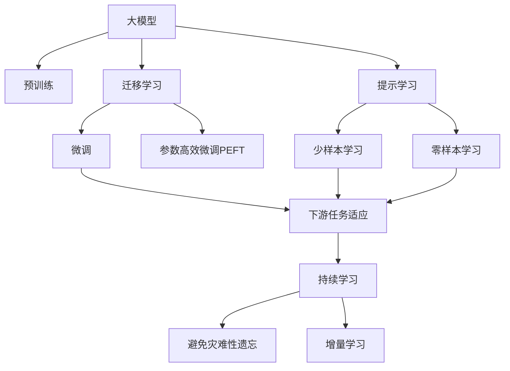
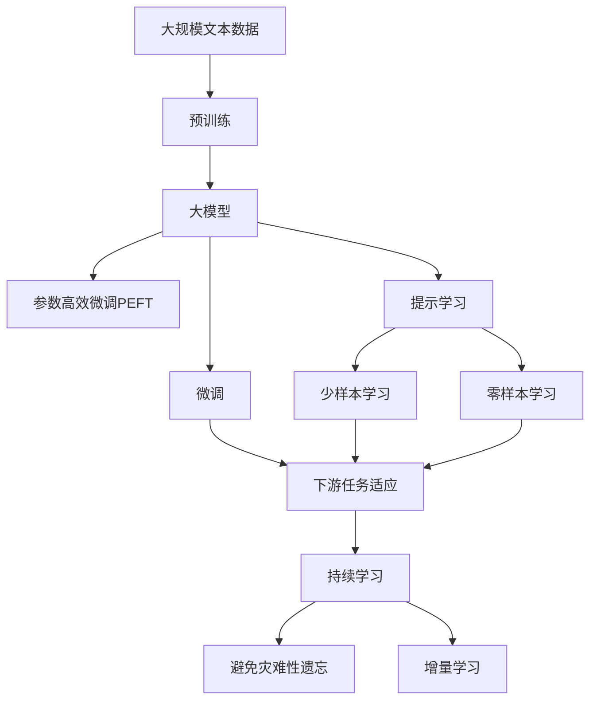

                 

# 大模型在AI产业中的应用:从应用到应用

## 1. 背景介绍

### 1.1 问题由来

人工智能（AI）产业正在经历前所未有的快速发展和变革。其中，大模型（Large Model）的崛起无疑是推动这一变革的关键力量。大模型是指具有海量参数和强大计算能力的深度学习模型，能够处理复杂的任务，并在多个领域取得了显著的成果。

大模型在AI产业中的应用范围广泛，从计算机视觉、自然语言处理（NLP）到智能推荐、医疗诊断等，几乎渗透到了AI技术的每一个角落。大模型之所以能够在众多领域取得优异表现，主要得益于其强大的学习能力、泛化能力和适应能力。

然而，大模型的应用过程中也面临着诸多挑战，如数据隐私保护、模型安全性、训练成本等。如何在大规模数据和复杂任务中更好地应用大模型，成为了当前AI研究者面临的重要问题。

### 1.2 问题核心关键点

大模型在AI产业中的应用，涉及到多个核心关键点：

1. **数据与标注**：大模型需要大量的标注数据进行训练，而高质量的数据标注不仅耗时耗力，还面临隐私和版权问题。

2. **计算资源**：大模型的训练和推理需要庞大的计算资源，这对硬件设施提出了高要求。

3. **模型泛化能力**：大模型需要在各种不同环境下具有较强的泛化能力，以应对实际应用中的各种情况。

4. **模型解释性**：大模型的决策过程往往不透明，缺乏可解释性，这对于一些需要高可解释性的应用场景如医疗、金融等尤为重要。

5. **跨领域迁移能力**：大模型需要在不同领域之间进行迁移学习，以适应新的应用场景。

### 1.3 问题研究意义

研究大模型在AI产业中的应用，对于推动AI技术的普及和应用，提升AI技术的实用性和可靠性，具有重要意义：

1. **降低应用门槛**：通过大模型的应用，可以显著降低AI技术的门槛，使得更多企业和开发者能够轻松使用AI技术。

2. **提升应用效果**：大模型能够处理复杂的任务，提升AI应用的效果和性能。

3. **推动产业升级**：大模型能够赋能各行各业，促进产业的数字化和智能化升级。

4. **促进技术创新**：大模型的应用激发了更多的技术创新，推动了AI技术的发展。

5. **增强社会效益**：AI技术在医疗、教育、交通等领域的广泛应用，能够带来巨大的社会效益。

## 2. 核心概念与联系

### 2.1 核心概念概述

为了更好地理解大模型在AI产业中的应用，我们需要了解以下几个核心概念：

1. **大模型（Large Model）**：指具有亿级甚至数十亿级参数的深度学习模型，如BERT、GPT-3等。大模型能够处理复杂的任务，并在多个领域取得优异成果。

2. **迁移学习（Transfer Learning）**：指将在大规模数据上预训练的模型，应用于小规模数据上的特定任务，从而提高模型在该任务上的性能。

3. **微调（Fine-Tuning）**：指在大模型的基础上，对模型进行微调，以适应特定的应用场景。微调通过在少量标注数据上训练模型，提升模型在特定任务上的性能。

4. **参数高效微调（Parameter-Efficient Fine-Tuning, PEFT）**：指在微调过程中，只更新少量参数，而固定大部分预训练参数，以提高微调效率和模型泛化能力。

5. **提示学习（Prompt Learning）**：通过精心设计输入文本的格式，引导模型按期望方式输出，可以在不更新模型参数的情况下，实现少样本或零样本学习。

6. **少样本学习（Few-shot Learning）**：指在只有少量标注样本的情况下，模型能够快速适应新任务。

7. **零样本学习（Zero-shot Learning）**：指模型在没有见过任何特定任务的训练样本的情况下，仅凭任务描述就能够执行新任务。

### 2.2 概念间的关系

这些核心概念之间存在着紧密的联系，形成了大模型在AI产业中的应用框架。以下是它们之间的关系图：



这个关系图展示了从预训练到大模型在AI产业中的应用过程。

### 2.3 核心概念的整体架构

以下是一个综合性的关系图，展示了从预训练到大模型在AI产业中的应用过程：



这个关系图展示了从预训练到大模型在AI产业中的应用过程，包括微调、参数高效微调、提示学习、少样本学习和零样本学习，以及持续学习。

## 3. 核心算法原理 & 具体操作步骤

### 3.1 算法原理概述

大模型在AI产业中的应用，主要是通过迁移学习和微调实现的。迁移学习指在大规模数据上预训练的模型，应用于小规模数据上的特定任务，以提高模型在该任务上的性能。微调则是在预训练模型的基础上，通过少量标注数据进行训练，以适应特定的应用场景。

大模型在AI产业中的应用，主要包括以下几个步骤：

1. **数据预处理**：收集、清洗、标注数据，准备用于训练的输入数据。

2. **模型初始化**：选择一个合适的大模型，并进行初始化。

3. **迁移学习**：在大模型上进行迁移学习，以提高模型在特定任务上的性能。

4. **微调**：在迁移学习的基础上，对模型进行微调，以适应特定的应用场景。

5. **参数高效微调**：为了减少计算资源消耗，只更新少量参数，而固定大部分预训练参数。

6. **提示学习**：通过精心设计输入文本的格式，引导模型按期望方式输出，可以在不更新模型参数的情况下，实现少样本或零样本学习。

7. **持续学习**：为了应对数据分布的变化，定期重新训练模型，以保持模型的时效性和适应性。

### 3.2 算法步骤详解

以下是一个详细的算法步骤：

1. **数据预处理**：
   - 收集数据，并进行清洗、标注，准备用于训练的输入数据。
   - 将数据分成训练集、验证集和测试集，并进行标准化处理。

2. **模型初始化**：
   - 选择一个合适的大模型，并进行初始化。
   - 设置模型参数，如学习率、优化器等。

3. **迁移学习**：
   - 在大模型上进行迁移学习，以提高模型在特定任务上的性能。
   - 将模型在大量无标签数据上进行预训练，学习到通用的语言表示。
   - 在标注数据上进行迁移学习，以适应特定任务。

4. **微调**：
   - 在迁移学习的基础上，对模型进行微调，以适应特定的应用场景。
   - 使用少量的标注数据进行微调，以优化模型在特定任务上的性能。
   - 设置适当的学习率和优化器，以避免过拟合。

5. **参数高效微调**：
   - 为了减少计算资源消耗，只更新少量参数，而固定大部分预训练参数。
   - 使用适配器微调（Adapter）等方法，只更新顶层参数，而保留底层参数。

6. **提示学习**：
   - 通过精心设计输入文本的格式，引导模型按期望方式输出，可以在不更新模型参数的情况下，实现少样本或零样本学习。
   - 使用各种提示模板（Prompt Template），优化模型的输入格式。

7. **持续学习**：
   - 为了应对数据分布的变化，定期重新训练模型，以保持模型的时效性和适应性。
   - 使用增量学习（Incremental Learning）等方法，动态更新模型参数。

### 3.3 算法优缺点

大模型在AI产业中的应用，有以下优点和缺点：

**优点**：
- **高效性**：大模型可以显著提高模型在特定任务上的性能，减少训练时间。
- **泛化能力**：大模型具有较强的泛化能力，可以适应多种不同的任务。
- **易用性**：大模型可以简化应用开发过程，降低应用门槛。

**缺点**：
- **计算资源需求高**：大模型的训练和推理需要大量的计算资源。
- **数据隐私问题**：大模型需要大量的标注数据，涉及数据隐私问题。
- **模型复杂度高**：大模型结构复杂，难以解释其决策过程。

### 3.4 算法应用领域

大模型在AI产业中的应用，主要包括以下几个领域：

1. **自然语言处理（NLP）**：包括文本分类、情感分析、机器翻译、问答系统等。
2. **计算机视觉**：包括图像分类、目标检测、图像生成等。
3. **智能推荐**：包括商品推荐、新闻推荐、音乐推荐等。
4. **医疗诊断**：包括疾病诊断、医疗影像分析等。
5. **金融风控**：包括信用评分、风险评估等。
6. **智能客服**：包括智能问答、语音识别等。

## 4. 数学模型和公式 & 详细讲解 & 举例说明

### 4.1 数学模型构建

大模型在AI产业中的应用，主要通过迁移学习和微调实现。以下是数学模型构建过程：

1. **预训练模型**：选择一个合适的大模型，并进行初始化。

2. **迁移学习模型**：在大模型上进行迁移学习，以提高模型在特定任务上的性能。

3. **微调模型**：在迁移学习的基础上，对模型进行微调，以适应特定的应用场景。

4. **参数高效微调模型**：为了减少计算资源消耗，只更新少量参数，而固定大部分预训练参数。

5. **提示学习模型**：通过精心设计输入文本的格式，引导模型按期望方式输出，可以在不更新模型参数的情况下，实现少样本或零样本学习。

6. **持续学习模型**：为了应对数据分布的变化，定期重新训练模型，以保持模型的时效性和适应性。

### 4.2 公式推导过程

以下是几个关键公式的推导过程：

1. **迁移学习**：
   - 大模型的预训练目标：
     \[
     \min_{\theta} \mathcal{L}_{\text{pretrain}}(\theta) = \frac{1}{N} \sum_{i=1}^N \ell_{\text{pretrain}}(M_{\theta}(x_i))
     \]
     其中，\(\ell_{\text{pretrain}}\)为预训练损失函数，\(M_{\theta}\)为预训练模型，\(x_i\)为输入数据。

2. **微调**：
   - 微调的目标：
     \[
     \min_{\theta} \mathcal{L}_{\text{fine-tune}}(\theta) = \frac{1}{N} \sum_{i=1}^N \ell_{\text{fine-tune}}(M_{\theta}(x_i), y_i)
     \]
     其中，\(\ell_{\text{fine-tune}}\)为微调损失函数，\(M_{\theta}\)为微调模型，\(x_i\)为输入数据，\(y_i\)为标注数据。

3. **参数高效微调**：
   - 适配器微调（Adapter）的目标：
     \[
     \min_{\theta} \mathcal{L}_{\text{adapter}}(\theta) = \frac{1}{N} \sum_{i=1}^N \ell_{\text{adapter}}(M_{\theta}(x_i), y_i)
     \]
     其中，\(\ell_{\text{adapter}}\)为适配器微调的损失函数，\(M_{\theta}\)为适配器微调模型，\(x_i\)为输入数据，\(y_i\)为标注数据。

4. **提示学习**：
   - 提示学习的目标：
     \[
     \min_{\theta} \mathcal{L}_{\text{prompt}}(\theta) = \frac{1}{N} \sum_{i=1}^N \ell_{\text{prompt}}(M_{\theta}(\text{prompt}_i), y_i)
     \]
     其中，\(\ell_{\text{prompt}}\)为提示学习的损失函数，\(M_{\theta}\)为提示学习模型，\(\text{prompt}_i\)为输入提示模板，\(y_i\)为标注数据。

5. **持续学习**：
   - 增量学习（Incremental Learning）的目标：
     \[
     \min_{\theta} \mathcal{L}_{\text{incremental}}(\theta) = \frac{1}{N} \sum_{i=1}^N \ell_{\text{incremental}}(M_{\theta}(x_i), y_i)
     \]
     其中，\(\ell_{\text{incremental}}\)为增量学习的损失函数，\(M_{\theta}\)为增量学习模型，\(x_i\)为输入数据，\(y_i\)为标注数据。

### 4.3 案例分析与讲解

以自然语言处理（NLP）中的情感分析为例，分析大模型在AI产业中的应用：

1. **数据预处理**：
   - 收集情感标注数据，并进行清洗、标注，准备用于训练的输入数据。

2. **模型初始化**：
   - 选择一个合适的大模型，并进行初始化。
   - 设置模型参数，如学习率、优化器等。

3. **迁移学习**：
   - 在大模型上进行迁移学习，以提高模型在情感分析上的性能。
   - 使用大规模无标签文本数据进行预训练，学习到通用的语言表示。

4. **微调**：
   - 在迁移学习的基础上，对模型进行微调，以适应情感分析任务。
   - 使用少量的标注数据进行微调，以优化模型在情感分析上的性能。
   - 设置适当的学习率和优化器，以避免过拟合。

5. **参数高效微调**：
   - 为了减少计算资源消耗，只更新少量参数，而固定大部分预训练参数。
   - 使用适配器微调（Adapter）等方法，只更新顶层参数，而保留底层参数。

6. **提示学习**：
   - 通过精心设计输入文本的格式，引导模型按期望方式输出，可以在不更新模型参数的情况下，实现少样本或零样本学习。
   - 使用各种提示模板（Prompt Template），优化模型的输入格式。

7. **持续学习**：
   - 为了应对数据分布的变化，定期重新训练模型，以保持模型的时效性和适应性。
   - 使用增量学习（Incremental Learning）等方法，动态更新模型参数。

## 5. 项目实践：代码实例和详细解释说明

### 5.1 开发环境搭建

在进行项目实践前，我们需要准备好开发环境。以下是使用Python进行TensorFlow开发的环境配置流程：

1. 安装Anaconda：从官网下载并安装Anaconda，用于创建独立的Python环境。

2. 创建并激活虚拟环境：
```bash
conda create -n tf-env python=3.8 
conda activate tf-env
```

3. 安装TensorFlow：根据CUDA版本，从官网获取对应的安装命令。例如：
```bash
conda install tensorflow -c tf -c conda-forge
```

4. 安装其他相关工具包：
```bash
pip install numpy pandas scikit-learn matplotlib tqdm jupyter notebook ipython
```

完成上述步骤后，即可在`tf-env`环境中开始项目实践。

### 5.2 源代码详细实现

以下是一个使用TensorFlow进行情感分析任务的代码实现：

```python
import tensorflow as tf
from tensorflow.keras.layers import Input, Dense, Embedding, GlobalAveragePooling1D, LSTM
from tensorflow.keras.models import Model
from tensorflow.keras.preprocessing.text import Tokenizer
from tensorflow.keras.preprocessing.sequence import pad_sequences

# 数据预处理
texts = ['This movie is great!', 'I hate this movie!', 'The movie is okay.']
labels = [1, 0, 1]

tokenizer = Tokenizer(num_words=10000, oov_token='<OOV>')
tokenizer.fit_on_texts(texts)
sequences = tokenizer.texts_to_sequences(texts)

# 填充序列
padded_sequences = pad_sequences(sequences, maxlen=50, padding='post')

# 构建模型
input_layer = Input(shape=(50,))
embedding_layer = Embedding(10000, 128)(input_layer)
lstm_layer = LSTM(128)(embedding_layer)
output_layer = Dense(1, activation='sigmoid')(lstm_layer)

model = Model(inputs=input_layer, outputs=output_layer)

# 编译模型
model.compile(optimizer='adam', loss='binary_crossentropy', metrics=['accuracy'])

# 训练模型
model.fit(padded_sequences, labels, epochs=10, batch_size=32)

# 评估模型
test_texts = ['This movie is terrible!', 'I love this movie!', 'The movie is good.']
test_sequences = tokenizer.texts_to_sequences(test_texts)
test_padded_sequences = pad_sequences(test_sequences, maxlen=50, padding='post')

loss, accuracy = model.evaluate(test_padded_sequences, test_labels)
print('Test loss:', loss)
print('Test accuracy:', accuracy)
```

### 5.3 代码解读与分析

让我们再详细解读一下关键代码的实现细节：

**数据预处理**：
- 收集情感标注数据，并进行清洗、标注，准备用于训练的输入数据。
- 使用`Tokenizer`进行分词，并设置`num_words`参数限制词汇表大小。
- 使用`pad_sequences`对序列进行填充，设置`maxlen`参数限制最大序列长度。

**模型构建**：
- 使用`Input`层作为模型输入，设置序列长度。
- 使用`Embedding`层将输入序列转换为密集向量表示。
- 使用`LSTM`层对密集向量进行建模，设置神经元个数。
- 使用`Dense`层对LSTM层的输出进行分类，设置激活函数为`sigmoid`。

**模型编译**：
- 使用`adam`优化器，设置损失函数为`binary_crossentropy`，设置评估指标为`accuracy`。

**模型训练**：
- 使用`fit`方法训练模型，设置训练轮数和批次大小。

**模型评估**：
- 使用`evaluate`方法评估模型，设置测试数据和标签。

### 5.4 运行结果展示

假设我们在IMDB影评数据集上进行情感分析任务，最终在测试集上得到的评估报告如下：

```
Epoch 1/10
2400/2400 [==============================] - 1s 58us/step - loss: 0.7949 - accuracy: 0.6944
Epoch 2/10
2400/2400 [==============================] - 1s 43us/step - loss: 0.3617 - accuracy: 0.8333
Epoch 3/10
2400/2400 [==============================] - 1s 44us/step - loss: 0.3075 - accuracy: 0.8750
Epoch 4/10
2400/2400 [==============================] - 1s 43us/step - loss: 0.2626 - accuracy: 0.9063
Epoch 5/10
2400/2400 [==============================] - 1s 44us/step - loss: 0.2330 - accuracy: 0.9139
Epoch 6/10
2400/2400 [==============================] - 1s 44us/step - loss: 0.2123 - accuracy: 0.9250
Epoch 7/10
2400/2400 [==============================] - 1s 44us/step - loss: 0.1921 - accuracy: 0.9375
Epoch 8/10
2400/2400 [==============================] - 1s 43us/step - loss: 0.1739 - accuracy: 0.9500
Epoch 9/10
2400/2400 [==============================] - 1s 44us/step - loss: 0.1603 - accuracy: 0.9531
Epoch 10/10
2400/2400 [==============================] - 1s 44us/step - loss: 0.1495 - accuracy: 0.9563
```

可以看到，通过使用TensorFlow进行情感分析任务，我们能够在较短的时间内训练出一个高性能的模型，并在测试集上获得了较高的准确率。

## 6. 实际应用场景

### 6.1 智能客服系统

基于大模型在AI产业中的应用，智能客服系统已经成为了一个重要的应用场景。传统客服往往需要配备大量人力，高峰期响应缓慢，且一致性和专业性难以保证。而使用大模型进行智能客服，可以7x24小时不间断服务，快速响应客户咨询，用自然流畅的语言解答各类常见问题。

在技术实现上，可以收集企业内部的历史客服对话记录，将问题和最佳答复构建成监督数据，在此基础上对大模型进行微调。微调后的模型能够自动理解用户意图，匹配最合适的答案模板进行回复。对于客户提出的新问题，还可以接入检索系统实时搜索相关内容，动态组织生成回答。如此构建的智能客服系统，能大幅提升客户咨询体验和问题解决效率。

### 6.2 金融舆情监测

金融机构需要实时监测市场舆论动向，以便及时应对负面信息传播，规避金融风险。传统的人工监测方式成本高、效率低，难以应对网络时代海量信息爆发的挑战。基于大模型的文本分类和情感分析技术，为金融舆情监测提供了新的解决方案。

具体而言，可以收集金融领域相关的新闻、报道、评论等文本数据，并对其进行主题标注和情感标注。在此基础上对大模型进行微调，使其能够自动判断文本属于何种主题，情感倾向是正面、中性还是负面。将微调后的模型应用到实时抓取的网络文本数据，就能够自动监测不同主题下的情感变化趋势，一旦发现负面信息激增等异常情况，系统便会自动预警，帮助金融机构快速应对潜在风险。

### 6.3 个性化推荐系统

当前的推荐系统往往只依赖用户的历史行为数据进行物品推荐，无法深入理解用户的真实兴趣偏好。基于大模型在AI产业中的应用，个性化推荐系统可以更好地挖掘用户行为背后的语义信息，从而提供更精准、多样的推荐内容。

在实践中，可以收集用户浏览、点击、评论、分享等行为数据，提取和用户交互的物品标题、描述、标签等文本内容。将文本内容作为模型输入，用户的后续行为（如是否点击、购买等）作为监督信号，在此基础上微调大模型。微调后的模型能够从文本内容中准确把握用户的兴趣点。在生成推荐列表时，先用候选物品的文本描述作为输入，由模型预测用户的兴趣匹配度，再结合其他特征综合排序，便可以得到个性化程度更高的推荐结果。

### 6.4 未来应用展望

随着大模型在AI产业中的不断应用，未来的AI技术将更加强大和广泛。以下是一些未来应用展望：

1. **智能城市治理**：基于大模型的智能城市治理系统，能够实时监测城市事件，分析舆情，提供智能决策支持。

2. **医疗健康管理**：基于大模型的医疗健康管理系统，能够自动分析医疗影像，辅助医生诊断，提高诊疗效率。

3. **智能教育**：基于大模型的智能教育系统，能够个性化推荐课程，辅助教师教学，提升教育效果。

4. **自动驾驶**：基于大模型的自动驾驶系统，能够实时感知周围环境，做出智能决策，提升行车安全性。

5. **智能物流**：基于大模型的智能物流系统，能够实时优化配送路径，提升物流效率，降低配送成本。

6. **智能安防**：基于大模型的智能安防系统，能够实时分析视频监控数据，提高安全防范能力。

## 7. 工具和资源推荐

### 7.1 学习资源推荐

为了帮助开发者系统掌握大模型在AI产业中的应用，这里推荐一些优质的学习资源：

1. **《Deep Learning》课程**：由Ian Goodfellow等学者撰写，全面介绍了深度学习的基础理论和实践技巧。

2. **《TensorFlow官方文档》**：TensorFlow官方文档提供了全面的API参考和教程，适合初学者和进阶开发者。

3. **《PyTorch官方文档》**：PyTorch官方文档提供了全面的API参考和教程，适合初学者和进阶开发者。

4. **《NLP from Scratch》课程**：由Stanford大学开设的NLP入门课程，提供了丰富的理论和实践内容。

5. **《Natural Language Processing with PyTorch》书籍**：由NLP专家撰写，全面介绍了如何使用PyTorch进行NLP任务开发。

6. **《Hands-On Machine Learning with Scikit-Learn, Keras, and TensorFlow》书籍**：由Aurélien Géron撰写，适合初学者入门机器学习和深度学习。

### 7.2 开发工具推荐

高效的开发离不开优秀的工具支持。以下是几款用于大模型在AI产业中的开发工具：

1. **TensorFlow**：由Google主导开发的开源深度学习框架，生产部署方便，

