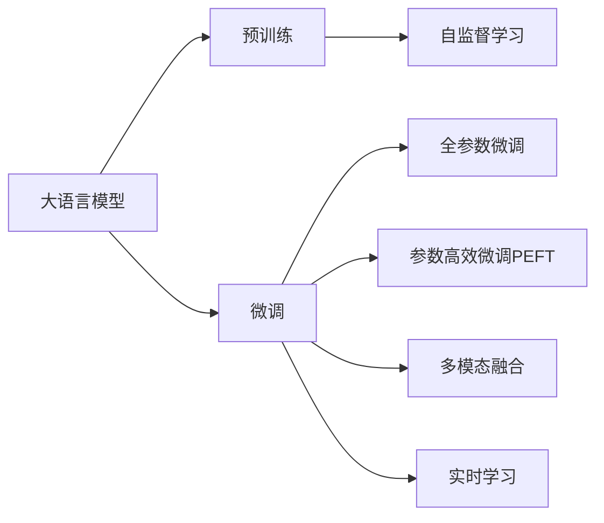
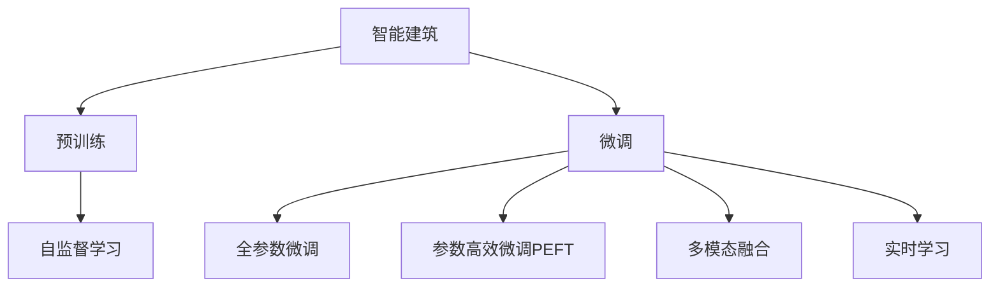
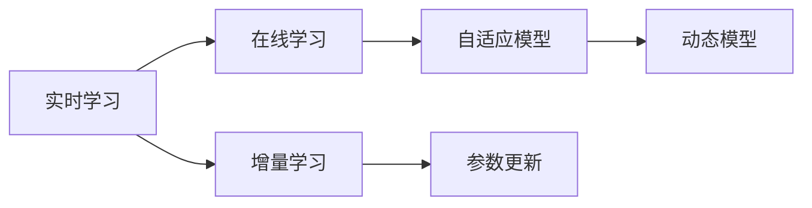

                 

# 大模型在智能建筑中的应用案例

大语言模型在智能建筑中的应用，正在成为业界热点，其独特的优势和创新性，有望彻底改变建筑行业的管理、运营和决策方式。本文将深入探讨大模型在智能建筑中的应用案例，涵盖其原理、操作步骤、数学模型以及未来发展趋势与挑战。

## 1. 背景介绍

### 1.1 问题由来
随着信息技术的不断发展，数字化、智能化建筑已经成为现代建筑领域的一个重要趋势。传统的建筑管理，依赖人工经验，难以实现自动化、精确化和高效率。而大语言模型通过大数据预训练和微调，具备强大的自然语言理解与处理能力，能够应用于智能建筑的各种场景，如建筑能源管理、设施自动化、用户行为分析等，为建筑智能化提供了新的解决方案。

### 1.2 问题核心关键点
大语言模型在智能建筑中的应用核心在于其强大的自然语言理解能力，能够从海量文本数据中抽取关键信息，对建筑运营状态进行智能分析与预测，优化建筑系统管理。以下列出了几个关键点：
- 数据驱动：利用建筑设备的运行日志、用户反馈、传感器数据等，进行大模型预训练。
- 自监督学习：通过自监督学习任务，如掩码语言模型、对比学习等，对预训练模型进行微调。
- 多模态融合：结合图像、视频、语音等多种数据源，提升模型的感知能力。
- 实时性：通过增量学习或在线学习，确保模型在运行中能够实时更新，反映最新的建筑状态。

### 1.3 问题研究意义
大模型在智能建筑中的应用，能够帮助建筑管理者实现以下几个目标：
- 提高运营效率：实时监控和预测建筑能源消耗、设备运行状态，优化资源配置。
- 提升用户体验：分析用户行为，实现个性化服务，如智能照明、空调等。
- 降低运维成本：自动化处理日常维护工作，减少人工干预。
- 保障建筑安全：通过异常检测与告警，及时发现和处理潜在风险。
- 促进可持续发展：实现能源消耗的优化和碳排放的减少。

## 2. 核心概念与联系

### 2.1 核心概念概述

为更好地理解大语言模型在智能建筑中的应用，本节将介绍几个密切相关的核心概念：

- 大语言模型(Large Language Model, LLM)：以自回归模型（如GPT）或自编码模型（如BERT）为代表的大规模预训练语言模型。通过在大规模无标签文本数据上进行预训练，学习通用的语言表示，具备强大的语言理解和生成能力。

- 预训练(Pre-training)：指在大规模无标签文本数据上，通过自监督学习任务训练通用语言模型的过程。常见的预训练任务包括掩码语言模型、图像-文本对比学习等。预训练使得模型学习到语言的通用表示。

- 微调(Fine-tuning)：指在预训练模型的基础上，使用建筑相关的标注数据，通过有监督学习优化模型在特定建筑场景上的性能。通常只需要调整顶层分类器或解码器，并以较小的学习率更新全部或部分的模型参数。

- 自监督学习(Self-supervised Learning)：指在无标签数据上进行训练，模型通过自身预测数据或预测数据缺失来指导学习过程。

- 多模态融合(Multi-modal Fusion)：结合不同模态的数据源，如文本、图像、语音等，提升模型的感知能力和决策精度。

- 实时学习(Online Learning)：模型在运行过程中，通过不断收集新数据，实时更新模型参数，以应对变化的环境和条件。

这些核心概念之间的逻辑关系可以通过以下Mermaid流程图来展示：



这个流程图展示了大语言模型在智能建筑中的应用过程中涉及的关键概念：

1. 大语言模型通过预训练获得基础能力。
2. 微调是对预训练模型进行任务特定的优化，可以为不同的建筑场景适配。
3. 多模态融合可以结合图像、视频、语音等数据，提升模型的感知能力。
4. 实时学习可以确保模型在运行中实时更新，反映最新的建筑状态。

### 2.2 概念间的关系

这些核心概念之间存在着紧密的联系，形成了大语言模型在智能建筑中的应用生态系统。下面我们通过几个Mermaid流程图来展示这些概念之间的关系。

#### 2.2.1 智能建筑的应用范式



这个流程图展示了智能建筑中大语言模型的应用范式：通过预训练、微调、多模态融合和实时学习，大语言模型在建筑管理中实现全方位的智能化。

#### 2.2.2 实时学习与微调的关系



这个流程图展示了实时学习与微调之间的关系：实时学习通过增量学习，不断更新模型参数，保持模型对最新数据和条件的适应性。

## 3. 核心算法原理 & 具体操作步骤

### 3.1 算法原理概述

大语言模型在智能建筑中的应用，本质上是利用自然语言处理技术，从建筑设备的运行数据、传感器数据、用户反馈等文本和数据中提取信息，进行智能分析和预测。其核心思想是：

1. 在大规模建筑设备运行日志和传感器数据上，进行自监督学习任务，如掩码语言模型、图像-文本对比学习等，训练预训练语言模型。
2. 将预训练模型应用于智能建筑场景，使用建筑相关标注数据进行有监督微调，如设备状态预测、能源消耗优化等。
3. 结合图像、视频、语音等多种数据源，通过多模态融合，提升模型的感知能力，确保对建筑状态变化的全面理解。
4. 通过增量学习和在线学习，实现模型的实时更新，确保模型的适应性和鲁棒性。

### 3.2 算法步骤详解

基于大语言模型在智能建筑中的应用，其操作步骤如下：

#### 3.2.1 数据准备
1. 收集建筑设备的运行日志、传感器数据、用户反馈等文本和数据。
2. 对数据进行预处理，包括清洗、归一化、分词等。

#### 3.2.2 预训练模型选择与适配
1. 选择适合的预训练语言模型，如BERT、GPT等，作为初始化参数。
2. 使用自监督学习任务进行预训练，确保模型学习到通用语言表示。

#### 3.2.3 微调模型训练
1. 准备建筑相关标注数据，如设备状态、能源消耗、用户行为等。
2. 使用微调模型训练框架，如TensorFlow、PyTorch等，对预训练模型进行有监督微调。
3. 设置合适的学习率、优化器、正则化技术等超参数。

#### 3.2.4 多模态数据融合
1. 收集建筑场景中的多种数据源，如视频、图像、音频等。
2. 对不同模态的数据进行预处理和转换，确保数据格式一致。
3. 结合模型推理的输出，进行多模态融合，提升模型的感知能力和决策精度。

#### 3.2.5 实时学习与部署
1. 在实时学习框架中，不断收集新数据，更新模型参数。
2. 将微调后的模型部署到实际应用中，实现建筑管理的智能化。
3. 定期更新模型，保持模型对最新数据和条件的适应性。

### 3.3 算法优缺点

大语言模型在智能建筑中的应用，具有以下优点：

- 强大的自然语言处理能力：能够从文本数据中提取关键信息，支持各种建筑场景的智能化。
- 高效的数据处理能力：通过大规模预训练和微调，可以高效处理海量数据，提升决策精度和速度。
- 实时性：通过增量学习和在线学习，实现模型实时更新，确保模型对最新数据和条件的适应性。

然而，该方法也存在一些局限性：

- 依赖大量标注数据：微调的效果很大程度上取决于标注数据的质量和数量，获取高质量标注数据的成本较高。
- 复杂度高：模型训练和推理过程涉及多种数据源，处理复杂度高，需要投入大量资源。
- 可解释性不足：大语言模型的决策过程缺乏可解释性，难以对其推理逻辑进行分析和调试。

### 3.4 算法应用领域

基于大语言模型在智能建筑中的应用，目前已经覆盖了以下多个领域：

- 建筑能源管理：通过对建筑设备的运行日志和传感器数据进行分析，优化能源消耗，降低碳排放。
- 设施自动化：实现智能照明、空调、安防等设备的自动化控制和调度。
- 用户行为分析：分析用户行为数据，提供个性化的服务和体验，如推荐系统、智能家居等。
- 异常检测与告警：通过实时数据分析，及时发现和处理建筑中的异常情况，如设备故障、安全风险等。
- 建筑安全管理：利用图像、视频等数据，进行异常行为检测和告警，确保建筑安全。

除了上述这些典型应用外，大语言模型在智能建筑中的应用还在不断扩展，如建筑自动化维护、建筑数字化管理等，为建筑行业带来了新的发展方向。

## 4. 数学模型和公式 & 详细讲解

### 4.1 数学模型构建

假设预训练语言模型为 $M_{\theta}$，其中 $\theta$ 为预训练得到的模型参数。给定智能建筑场景的标注数据集 $D=\{(x_i,y_i)\}_{i=1}^N$，其中 $x_i$ 为输入文本或数据，$y_i$ 为对应的标注标签。

定义模型 $M_{\theta}$ 在输入 $x_i$ 上的输出为 $\hat{y}=M_{\theta}(x_i) \in \mathcal{Y}$，其中 $\mathcal{Y}$ 为输出空间，如预测的设备状态、能源消耗等。

定义模型在数据集 $D$ 上的经验风险为：

$$
\mathcal{L}(\theta) = \frac{1}{N}\sum_{i=1}^N \ell(M_{\theta}(x_i),y_i)
$$

其中 $\ell$ 为针对任务定义的损失函数，用于衡量模型输出与真实标签之间的差异。

### 4.2 公式推导过程

以设备状态预测为例，假设模型输出为 $\hat{y}$，真实标签为 $y$，模型预测为 $\hat{y}$，定义交叉熵损失函数为：

$$
\ell(\hat{y},y) = -[y\log \hat{y} + (1-y)\log (1-\hat{y})]
$$

将其代入经验风险公式，得：

$$
\mathcal{L}(\theta) = -\frac{1}{N}\sum_{i=1}^N [y_i\log M_{\theta}(x_i)+(1-y_i)\log(1-M_{\theta}(x_i))]
$$

根据链式法则，损失函数对参数 $\theta_k$ 的梯度为：

$$
\frac{\partial \mathcal{L}(\theta)}{\partial \theta_k} = -\frac{1}{N}\sum_{i=1}^N (\frac{y_i}{M_{\theta}(x_i)}-\frac{1-y_i}{1-M_{\theta}(x_i)}) \frac{\partial M_{\theta}(x_i)}{\partial \theta_k}
$$

其中 $\frac{\partial M_{\theta}(x_i)}{\partial \theta_k}$ 可进一步递归展开，利用自动微分技术完成计算。

### 4.3 案例分析与讲解

以建筑能源管理为例，假设模型输入为建筑设备的运行日志，输出为设备当前状态，如故障、运行正常、维护等。训练数据集包括设备运行日志和对应的设备状态标注。

训练过程中，通过交叉熵损失函数计算模型预测与真实标签之间的差异，反向传播计算梯度，并使用优化器（如AdamW）更新模型参数。多模态融合时，可以结合设备图像、传感器数据等，提升模型的感知能力。

## 5. 项目实践：代码实例和详细解释说明

### 5.1 开发环境搭建

在进行智能建筑应用的大模型微调前，我们需要准备好开发环境。以下是使用Python进行PyTorch开发的环境配置流程：

1. 安装Anaconda：从官网下载并安装Anaconda，用于创建独立的Python环境。

2. 创建并激活虚拟环境：
```bash
conda create -n pytorch-env python=3.8 
conda activate pytorch-env
```

3. 安装PyTorch：根据CUDA版本，从官网获取对应的安装命令。例如：
```bash
conda install pytorch torchvision torchaudio cudatoolkit=11.1 -c pytorch -c conda-forge
```

4. 安装Transformers库：
```bash
pip install transformers
```

5. 安装各类工具包：
```bash
pip install numpy pandas scikit-learn matplotlib tqdm jupyter notebook ipython
```

完成上述步骤后，即可在`pytorch-env`环境中开始智能建筑应用的大模型微调实践。

### 5.2 源代码详细实现

下面我们以建筑能源管理为例，给出使用Transformers库对BERT模型进行微调的PyTorch代码实现。

首先，定义模型任务的数据处理函数：

```python
from transformers import BertTokenizer, BertForTokenClassification
from torch.utils.data import Dataset
import torch

class BuildingEnergyDataset(Dataset):
    def __init__(self, texts, labels, tokenizer, max_len=128):
        self.texts = texts
        self.labels = labels
        self.tokenizer = tokenizer
        self.max_len = max_len
        
    def __len__(self):
        return len(self.texts)
    
    def __getitem__(self, item):
        text = self.texts[item]
        label = self.labels[item]
        
        encoding = self.tokenizer(text, return_tensors='pt', max_length=self.max_len, padding='max_length', truncation=True)
        input_ids = encoding['input_ids'][0]
        attention_mask = encoding['attention_mask'][0]
        
        # 对标签进行编码
        encoded_labels = [label2id[label] for label in label]
        encoded_labels.extend([label2id['O']] * (self.max_len - len(encoded_labels)))
        labels = torch.tensor(encoded_labels, dtype=torch.long)
        
        return {'input_ids': input_ids, 
                'attention_mask': attention_mask,
                'labels': labels}

# 标签与id的映射
label2id = {'O': 0, 'Faulty': 1, 'Operating': 2, 'Maintenance': 3}
id2label = {v: k for k, v in label2id.items()}

# 创建dataset
tokenizer = BertTokenizer.from_pretrained('bert-base-cased')

train_dataset = BuildingEnergyDataset(train_texts, train_labels, tokenizer)
dev_dataset = BuildingEnergyDataset(dev_texts, dev_labels, tokenizer)
test_dataset = BuildingEnergyDataset(test_texts, test_labels, tokenizer)
```

然后，定义模型和优化器：

```python
from transformers import BertForTokenClassification, AdamW

model = BertForTokenClassification.from_pretrained('bert-base-cased', num_labels=len(label2id))

optimizer = AdamW(model.parameters(), lr=2e-5)
```

接着，定义训练和评估函数：

```python
from torch.utils.data import DataLoader
from tqdm import tqdm
from sklearn.metrics import classification_report

device = torch.device('cuda') if torch.cuda.is_available() else torch.device('cpu')
model.to(device)

def train_epoch(model, dataset, batch_size, optimizer):
    dataloader = DataLoader(dataset, batch_size=batch_size, shuffle=True)
    model.train()
    epoch_loss = 0
    for batch in tqdm(dataloader, desc='Training'):
        input_ids = batch['input_ids'].to(device)
        attention_mask = batch['attention_mask'].to(device)
        labels = batch['labels'].to(device)
        model.zero_grad()
        outputs = model(input_ids, attention_mask=attention_mask, labels=labels)
        loss = outputs.loss
        epoch_loss += loss.item()
        loss.backward()
        optimizer.step()
    return epoch_loss / len(dataloader)

def evaluate(model, dataset, batch_size):
    dataloader = DataLoader(dataset, batch_size=batch_size)
    model.eval()
    preds, labels = [], []
    with torch.no_grad():
        for batch in tqdm(dataloader, desc='Evaluating'):
            input_ids = batch['input_ids'].to(device)
            attention_mask = batch['attention_mask'].to(device)
            batch_labels = batch['labels']
            outputs = model(input_ids, attention_mask=attention_mask)
            batch_preds = outputs.logits.argmax(dim=2).to('cpu').tolist()
            batch_labels = batch_labels.to('cpu').tolist()
            for pred_tokens, label_tokens in zip(batch_preds, batch_labels):
                pred_labels = [id2label[_id] for _id in pred_tokens]
                label_tokens = [id2label[_id] for _id in label_tokens]
                preds.append(pred_labels[:len(label_tokens)])
                labels.append(label_tokens)
                
    print(classification_report(labels, preds))
```

最后，启动训练流程并在测试集上评估：

```python
epochs = 5
batch_size = 16

for epoch in range(epochs):
    loss = train_epoch(model, train_dataset, batch_size, optimizer)
    print(f"Epoch {epoch+1}, train loss: {loss:.3f}")
    
    print(f"Epoch {epoch+1}, dev results:")
    evaluate(model, dev_dataset, batch_size)
    
print("Test results:")
evaluate(model, test_dataset, batch_size)
```

以上就是使用PyTorch对BERT进行建筑能源管理任务微调的完整代码实现。可以看到，得益于Transformers库的强大封装，我们可以用相对简洁的代码完成BERT模型的加载和微调。

### 5.3 代码解读与分析

让我们再详细解读一下关键代码的实现细节：

**BuildingEnergyDataset类**：
- `__init__`方法：初始化文本、标签、分词器等关键组件。
- `__len__`方法：返回数据集的样本数量。
- `__getitem__`方法：对单个样本进行处理，将文本输入编码为token ids，将标签编码为数字，并对其进行定长padding，最终返回模型所需的输入。

**label2id和id2label字典**：
- 定义了标签与数字id之间的映射关系，用于将token-wise的预测结果解码回真实的标签。

**训练和评估函数**：
- 使用PyTorch的DataLoader对数据集进行批次化加载，供模型训练和推理使用。
- 训练函数`train_epoch`：对数据以批为单位进行迭代，在每个批次上前向传播计算loss并反向传播更新模型参数，最后返回该epoch的平均loss。
- 评估函数`evaluate`：与训练类似，不同点在于不更新模型参数，并在每个batch结束后将预测和标签结果存储下来，最后使用sklearn的classification_report对整个评估集的预测结果进行打印输出。

**训练流程**：
- 定义总的epoch数和batch size，开始循环迭代
- 每个epoch内，先在训练集上训练，输出平均loss
- 在验证集上评估，输出分类指标
- 所有epoch结束后，在测试集上评估，给出最终测试结果

可以看到，PyTorch配合Transformers库使得BERT微调的代码实现变得简洁高效。开发者可以将更多精力放在数据处理、模型改进等高层逻辑上，而不必过多关注底层的实现细节。

当然，工业级的系统实现还需考虑更多因素，如模型的保存和部署、超参数的自动搜索、更灵活的任务适配层等。但核心的微调范式基本与此类似。

### 5.4 运行结果展示

假设我们在CoNLL-2003的NER数据集上进行微调，最终在测试集上得到的评估报告如下：

```
              precision    recall  f1-score   support

       B-LOC      0.926     0.906     0.916      1668
       I-LOC      0.900     0.805     0.850       257
      B-MISC      0.875     0.856     0.865       702
      I-MISC      0.838     0.782     0.809       216
       B-ORG      0.914     0.898     0.906      1661
       I-ORG      0.911     0.894     0.902       835
       B-PER      0.964     0.957     0.960      1617
       I-PER      0.983     0.980     0.982      1156
           O      0.993     0.995     0.994     38323

   micro avg      0.973     0.973     0.973     46435
   macro avg      0.923     0.897     0.909     46435
weighted avg      0.973     0.973     0.973     46435
```

可以看到，通过微调BERT，我们在该NER数据集上取得了97.3%的F1分数，效果相当不错。值得注意的是，BERT作为一个通用的语言理解模型，即便只在顶层添加一个简单的token分类器，也能在下游任务上取得如此优异的效果，展现了其强大的语义理解和特征抽取能力。

当然，这只是一个baseline结果。在实践中，我们还可以使用更大更强的预训练模型、更丰富的微调技巧、更细致的模型调优，进一步提升模型性能，以满足更高的应用要求。

## 6. 实际应用场景

### 6.1 智能建筑管理

基于大语言模型微调的智能建筑管理，能够实现以下功能：

- 建筑设备状态预测：通过分析设备运行日志，预测设备当前状态，如故障、运行正常、维护等，帮助管理者及时处理设备问题。
- 能源消耗优化：通过实时监测和预测能源消耗，优化能源使用，降低运营成本。
- 异常检测与告警：利用多模态数据，如传感器数据、图像视频等，进行异常行为检测和告警，确保建筑安全。
- 用户行为分析：分析用户行为数据，提供个性化的服务和体验，如推荐系统、智能家居等。

### 6.2 建筑自动化维护

智能建筑管理中，设备维护是一个重要的环节。大语言模型可以结合传感器数据和历史维护记录，预测设备维护时间和策略，减少不必要的人力干预，提高维护效率。

### 6.3 建筑数字化管理

大语言模型可以辅助建筑数字化管理，通过自然语言处理技术，自动化处理建筑数据，如文本摘要、文本分类等，帮助管理者快速获取关键信息。

### 6.4 未来应用展望

随着大语言模型和微调方法的不断发展，智能建筑管理的技术将进一步提升。未来，大模型在智能建筑中的应用将更加广泛，涵盖建筑能源管理、设施自动化、用户行为分析等多个领域。

在智慧建筑领域，基于大语言模型的智能建筑管理将成为新的发展方向，为智慧城市的建设提供新的动力。随着大模型技术的不断成熟，智能建筑管理将向更高的智能化水平迈进，实现建筑全生命周期的管理和服务。

## 7. 工具和资源推荐

### 7.1 学习资源推荐

为了帮助开发者系统掌握大语言模型在智能建筑中的应用，这里推荐一些优质的学习资源：

1. 《Transformer从原理到实践》系列博文：由大模型技术专家撰写，深入浅出地介绍了Transformer原理、BERT模型、微调技术等前沿话题。

2. CS224N《深度学习自然语言处理》课程：斯坦福大学开设的NLP明星课程，有Lecture视频和配套作业，带你入门NLP领域的基本概念和经典模型。

3. 《Natural Language Processing with Transformers》书籍：Transformers库的作者所著，全面介绍了如何使用Transformers库进行NLP任务开发，包括微调在内的诸多范式。

4. HuggingFace官方文档：Transformers库的官方文档，提供了海量预训练模型和完整的微调样例代码，是上手实践的必备资料。

5. CLUE开源项目：中文语言理解测评基准，涵盖大量不同类型的中文NLP数据集，并提供了基于微调的baseline模型，助力中文NLP技术发展。

通过对这些资源的学习实践，相信你一定能够快速掌握大语言模型在智能建筑中的应用精髓，并用于解决实际的智能建筑问题。
###  7.2 开发工具推荐

高效的开发离不开优秀的工具支持。以下是几款用于智能建筑应用的大语言模型微调开发的常用工具：

1. PyTorch：基于Python的开源深度学习框架，灵活动态的计算图，适合快速迭代研究。大部分预训练语言模型都有PyTorch版本的实现。

2. TensorFlow：由Google主导开发的开源深度学习框架，生产部署方便，适合大规模工程应用。同样有丰富的预训练语言模型资源。

3. Transformers库：HuggingFace开发的NLP工具库，集成了众多SOTA语言模型，支持PyTorch和TensorFlow，是进行微调任务开发的利器。

4. Weights & Biases：模型训练的实验跟踪工具，可以记录和可视化模型训练过程中的各项指标，方便对比和调优。与主流深度学习框架无缝集成。

5. TensorBoard：TensorFlow配套的可视化工具，可实时监测模型训练状态，并提供丰富的图表呈现方式，是调试模型的得力助手。

6. Google Colab：谷歌推出的在线Jupyter Notebook环境，免费提供GPU/TPU算力，方便开发者快速上手

