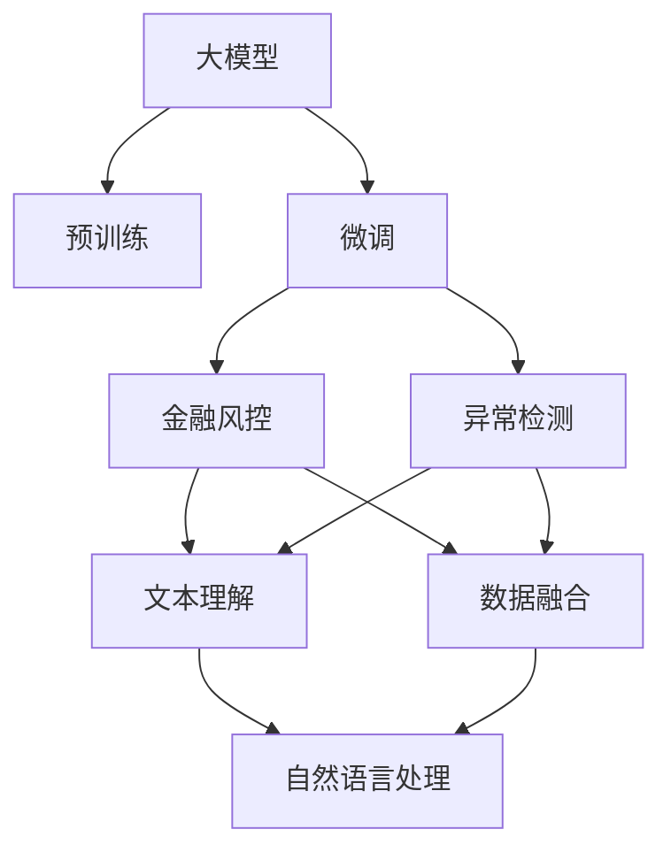

                 

# 大模型在金融风控中的应用案例

在现代金融行业中，风险控制（Risk Control）是至关重要的环节，它直接关系到金融机构的健康运营和客户的资产安全。然而，传统的风险控制方法往往依赖人工审批和规则，费时费力且容易出错。随着人工智能技术的不断发展，大语言模型（Large Language Model，LLM）在金融风控领域的应用逐渐被提上日程。本文将详细介绍大模型在金融风控中的应用案例，并结合实践经验，探讨其优缺点，展望未来发展方向。

## 1. 背景介绍

### 1.1 问题由来
近年来，金融科技（FinTech）的发展迅速，银行、保险、证券等行业都在积极探索如何利用人工智能技术提高风控效率。金融风控的目的是通过评估借款人、投资项目等风险因素，做出合理的风险决策，以降低违约概率和投资损失。传统的风控方法主要包括信用评分模型、规则引擎、监督学习等，但这些方法存在数据获取难度大、模型泛化能力弱、决策过程不透明等缺点。相比之下，大模型由于其强大的自然语言处理能力和泛化能力，在金融风控中展现出了巨大的潜力。

### 1.2 问题核心关键点
大模型在金融风控中的应用主要体现在以下几个方面：
- **自然语言理解**：大模型可以解析和处理金融文本数据，如合同条款、新闻报道、社交媒体等，从中提取关键信息。
- **数据融合**：大模型可以整合多源异构数据，包括结构化数据和非结构化数据，形成更全面的风险评估指标。
- **异常检测**：大模型能够从异常数据模式中识别风险点，实现实时监控和预警。
- **个性化风控**：大模型可以根据不同用户的风险偏好和行为特征，提供定制化的风控策略。

### 1.3 问题研究意义
大模型在金融风控中的应用，具有以下重要意义：
1. **提升风控效率**：通过自动处理和分析大量金融数据，大模型能够快速识别风险点，减少人工审核的时间和成本。
2. **增强决策透明性**：大模型可以提供详细的推理过程和决策依据，提高风控决策的透明度和可解释性。
3. **优化风险管理**：大模型能够实时监控市场动态，预测未来风险趋势，辅助金融机构制定合理的风险管理策略。
4. **促进普惠金融**：通过个性化的风控策略，大模型可以为小微企业和个人提供更加公平、便捷的金融服务。

## 2. 核心概念与联系

### 2.1 核心概念概述
- **大模型（Large Language Model, LLM）**：以自回归（如GPT）或自编码（如BERT）模型为代表的大规模预训练语言模型，能够处理复杂的自然语言任务。
- **预训练（Pre-training）**：在大规模无标签文本语料上进行自监督学习任务训练，学习通用的语言表示。
- **微调（Fine-tuning）**：在预训练模型的基础上，使用下游任务的少量标注数据，通过有监督学习优化模型在特定任务上的性能。
- **自然语言处理（Natural Language Processing, NLP）**：涉及计算机如何理解和处理人类语言的科学，包括文本分析、语义理解、情感分析等任务。
- **风险控制（Risk Control）**：通过评估风险因素，制定合理的风险决策，降低金融风险。
- **异常检测（Anomaly Detection）**：识别数据中的异常模式，预测未来风险。
- **个性化风控（Personalized Risk Control）**：根据用户特征，提供定制化的风控策略。

这些核心概念之间的关系可以通过以下Mermaid流程图来展示：



这个流程图展示了大模型在金融风控中的作用过程：
1. 大模型通过预训练学习通用的语言表示。
2. 将大模型应用于金融风控任务，进行微调。
3. 利用微调后的大模型进行文本理解，提取关键信息。
4. 将文本理解和数据融合的结果用于异常检测，预测风险。
5. 通过异常检测和数据融合的结果，实现个性化的风控策略。

### 2.2 概念间的关系
这些核心概念之间存在密切的联系，形成了金融风控的完整框架。下面通过几个Mermaid流程图来展示这些概念之间的关系。

#### 2.2.1 金融风控的预训练与微调流程


这个流程图展示了预训练与微调在金融风控中的应用过程：首先，通过预训练学习通用的语言表示；然后，将预训练模型应用到金融风控任务中，通过微调优化模型性能。

#### 2.2.2 异常检测与风险评估的关系


这个流程图展示了异常检测与风险评估之间的联系：通过异常检测识别潜在的风险点，输入到风险评估模型中进行更全面的评估，最后输出风险警报。

#### 2.2.3 数据融合与个性化风控


这个流程图展示了数据融合与个性化风控之间的关系：通过数据融合，整合多源异构数据，形成更全面的风险评估指标，进而实现个性化的风控策略。

## 3. 核心算法原理 & 具体操作步骤
### 3.1 算法原理概述
金融风控任务可以抽象为自然语言处理（NLP）和数据分析的交叉领域。大模型在金融风控中的应用，主要通过以下步骤实现：
1. 预训练：在大规模无标签金融数据上，使用自监督学习任务训练通用语言模型。
2. 微调：在预训练模型的基础上，使用标注数据训练特定的风控模型，优化其在金融领域的表现。
3. 文本理解：利用微调后的大模型，解析金融文本数据，提取关键信息。
4. 数据融合：将文本理解的结果与其他数据源进行融合，形成更全面的风险评估指标。
5. 异常检测：通过异常检测算法，识别数据中的异常模式，预测未来风险。
6. 个性化风控：根据用户特征，提供定制化的风控策略。

### 3.2 算法步骤详解

#### 3.2.1 数据准备
金融风控任务的数据通常包括文本数据（如合同条款、新闻报道、社交媒体等）和结构化数据（如贷款申请、交易记录等）。为了进行微调，需要将数据标注为相应的风险类别。例如，贷款申请可以标注为“拒绝”或“批准”。

#### 3.2.2 模型选择与预训练
选择合适的预训练模型，如BERT、GPT等，并在金融领域的大规模语料上进行预训练。预训练任务可以包括语言模型、掩码语言模型等。预训练的目标是学习通用的语言表示，为后续微调打下基础。

#### 3.2.3 微调设置
根据具体任务，设置微调的目标函数和优化器。常见的目标函数包括交叉熵损失、均方误差损失等。优化器可以采用AdamW、SGD等，设置合适的学习率和学习率衰减策略。

#### 3.2.4 数据增强
由于金融风控任务的数据量通常较少，可以使用数据增强技术扩充训练集。例如，可以引入回译、近义替换等技术，生成更多的训练样本。

#### 3.2.5 模型训练与评估
使用标注数据对模型进行训练，每轮训练后评估模型性能，避免过拟合。常见的评估指标包括准确率、召回率、F1分数等。

#### 3.2.6 部署与优化
将训练好的模型部署到生产环境，使用A/B测试等方法评估模型效果。根据实际应用需求，进行模型的参数优化和性能调优。

### 3.3 算法优缺点
#### 优点：
1. **泛化能力**：大模型通过预训练学习通用的语言表示，能够适应各种金融风控任务。
2. **高效性**：大模型可以自动处理和分析大量金融数据，减少人工审核的时间和成本。
3. **可解释性**：大模型可以提供详细的推理过程和决策依据，提高风控决策的透明度。

#### 缺点：
1. **数据依赖**：大模型的性能高度依赖于数据的质量和量，标注成本较高。
2. **模型复杂**：大模型的参数量较大，对计算资源和存储资源要求较高。
3. **过拟合风险**：在大规模数据上训练的大模型，可能对特定领域的标注数据产生过拟合。

### 3.4 算法应用领域
大模型在金融风控中的应用领域主要包括：
1. **信用评估**：评估个人或企业的信用风险，制定合理的贷款申请审批策略。
2. **欺诈检测**：识别信用卡欺诈、网络诈骗等金融欺诈行为，提高安全防护能力。
3. **市场监控**：实时监控金融市场动态，预测股票价格波动、信用风险等，辅助投资决策。
4. **合规审查**：审查金融产品的合规性，确保金融活动符合法律法规。
5. **客户服务**：通过智能客服系统，快速响应用户咨询，提升客户满意度。

## 4. 数学模型和公式 & 详细讲解 & 举例说明

### 4.1 数学模型构建

假设金融风控任务为二分类任务，即判断贷款申请是否被批准。设模型 $M_{\theta}$，其中 $\theta$ 为模型参数。训练集为 $D=\{(x_i, y_i)\}_{i=1}^N, x_i \in \mathcal{X}, y_i \in \{0,1\}$。定义模型在样本 $(x,y)$ 上的损失函数为 $\ell(M_{\theta}(x),y)$，则在数据集 $D$ 上的经验风险为：

$$
\mathcal{L}(\theta) = \frac{1}{N} \sum_{i=1}^N \ell(M_{\theta}(x_i),y_i)
$$

微调的优化目标是最小化经验风险，即找到最优参数：

$$
\theta^* = \mathop{\arg\min}_{\theta} \mathcal{L}(\theta)
$$

在实践中，我们通常使用基于梯度的优化算法（如SGD、AdamW等）来近似求解上述最优化问题。设 $\eta$ 为学习率，$\lambda$ 为正则化系数，则参数的更新公式为：

$$
\theta \leftarrow \theta - \eta \nabla_{\theta}\mathcal{L}(\theta) - \eta\lambda\theta
$$

其中 $\nabla_{\theta}\mathcal{L}(\theta)$ 为损失函数对参数 $\theta$ 的梯度，可通过反向传播算法高效计算。

### 4.2 公式推导过程

以二分类任务为例，推导交叉熵损失函数及其梯度的计算公式。

假设模型 $M_{\theta}$ 在输入 $x$ 上的输出为 $\hat{y}=M_{\theta}(x) \in [0,1]$，表示样本属于正类的概率。真实标签 $y \in \{0,1\}$。则二分类交叉熵损失函数定义为：

$$
\ell(M_{\theta}(x),y) = -[y\log \hat{y} + (1-y)\log (1-\hat{y})]
$$

将其代入经验风险公式，得：

$$
\mathcal{L}(\theta) = -\frac{1}{N}\sum_{i=1}^N [y_i\log M_{\theta}(x_i)+(1-y_i)\log(1-M_{\theta}(x_i))]
$$

根据链式法则，损失函数对参数 $\theta_k$ 的梯度为：

$$
\frac{\partial \mathcal{L}(\theta)}{\partial \theta_k} = -\frac{1}{N}\sum_{i=1}^N (\frac{y_i}{M_{\theta}(x_i)}-\frac{1-y_i}{1-M_{\theta}(x_i)}) \frac{\partial M_{\theta}(x_i)}{\partial \theta_k}
$$

其中 $\frac{\partial M_{\theta}(x_i)}{\partial \theta_k}$ 可进一步递归展开，利用自动微分技术完成计算。

在得到损失函数的梯度后，即可带入参数更新公式，完成模型的迭代优化。重复上述过程直至收敛，最终得到适应金融风控任务的最优模型参数 $\theta^*$。

### 4.3 案例分析与讲解

以贷款申请审批为例，介绍如何使用大模型进行金融风控微调。

1. **数据准备**：收集历史贷款申请数据，标注为“批准”或“拒绝”。将数据分为训练集、验证集和测试集。
2. **模型选择**：选择BERT作为预训练模型，使用掩码语言模型进行预训练。
3. **微调设置**：设置微调的目标函数为交叉熵损失，优化器为AdamW，学习率为1e-5，正则化系数为0.001。
4. **数据增强**：对训练数据进行回译、近义替换等处理，扩充训练集。
5. **模型训练**：使用训练集对模型进行训练，每轮训练后使用验证集评估模型性能，避免过拟合。
6. **模型评估**：在测试集上评估模型性能，计算准确率、召回率、F1分数等指标。

假设在测试集上评估得到的准确率为0.85，召回率为0.78，F1分数为0.81。这意味着模型在贷款申请审批任务上的性能相当不错，可以在实际应用中推广使用。

## 5. 项目实践：代码实例和详细解释说明

### 5.1 开发环境搭建

在进行金融风控微调开发前，我们需要准备好开发环境。以下是使用Python进行PyTorch开发的环境配置流程：

1. 安装Anaconda：从官网下载并安装Anaconda，用于创建独立的Python环境。

2. 创建并激活虚拟环境：
```bash
conda create -n pytorch-env python=3.8 
conda activate pytorch-env
```

3. 安装PyTorch：根据CUDA版本，从官网获取对应的安装命令。例如：
```bash
conda install pytorch torchvision torchaudio cudatoolkit=11.1 -c pytorch -c conda-forge
```

4. 安装Transformers库：
```bash
pip install transformers
```

5. 安装各类工具包：
```bash
pip install numpy pandas scikit-learn matplotlib tqdm jupyter notebook ipython
```

完成上述步骤后，即可在`pytorch-env`环境中开始微调实践。

### 5.2 源代码详细实现

下面以贷款申请审批为例，给出使用Transformers库对BERT模型进行金融风控微调的PyTorch代码实现。

首先，定义贷款申请审批任务的模型：

```python
from transformers import BertForSequenceClassification, BertTokenizer, AdamW

tokenizer = BertTokenizer.from_pretrained('bert-base-cased')
model = BertForSequenceClassification.from_pretrained('bert-base-cased', num_labels=2)

optimizer = AdamW(model.parameters(), lr=1e-5)
```

然后，定义训练和评估函数：

```python
def train_epoch(model, dataset, batch_size, optimizer):
    dataloader = DataLoader(dataset, batch_size=batch_size, shuffle=True)
    model.train()
    epoch_loss = 0
    for batch in dataloader:
        input_ids = batch['input_ids'].to(device)
        attention_mask = batch['attention_mask'].to(device)
        labels = batch['labels'].to(device)
        model.zero_grad()
        outputs = model(input_ids, attention_mask=attention_mask, labels=labels)
        loss = outputs.loss
        epoch_loss += loss.item()
        loss.backward()
        optimizer.step()
    return epoch_loss / len(dataloader)

def evaluate(model, dataset, batch_size):
    dataloader = DataLoader(dataset, batch_size=batch_size)
    model.eval()
    preds, labels = [], []
    with torch.no_grad():
        for batch in dataloader:
            input_ids = batch['input_ids'].to(device)
            attention_mask = batch['attention_mask'].to(device)
            batch_labels = batch['labels']
            outputs = model(input_ids, attention_mask=attention_mask)
            batch_preds = outputs.logits.argmax(dim=2).to('cpu').tolist()
            batch_labels = batch_labels.to('cpu').tolist()
            for pred_tokens, label_tokens in zip(batch_preds, batch_labels):
                preds.append(pred_tokens[:len(label_tokens)])
                labels.append(label_tokens)
    return preds, labels

# 训练和评估
epochs = 5
batch_size = 16

for epoch in range(epochs):
    loss = train_epoch(model, train_dataset, batch_size, optimizer)
    print(f"Epoch {epoch+1}, train loss: {loss:.3f}")
    
    print(f"Epoch {epoch+1}, dev results:")
    preds, labels = evaluate(model, dev_dataset, batch_size)
    print(classification_report(labels, preds))
    
print("Test results:")
preds, labels = evaluate(model, test_dataset, batch_size)
print(classification_report(labels, preds))
```

以上就是使用PyTorch对BERT进行贷款申请审批任务微调的完整代码实现。可以看到，得益于Transformers库的强大封装，我们可以用相对简洁的代码完成BERT模型的加载和微调。

### 5.3 代码解读与分析

让我们再详细解读一下关键代码的实现细节：

**贷款审批模型类**：
- `__init__`方法：初始化贷款审批任务的模型，设置分类标签数量。
- `__getitem__`方法：对单个样本进行处理，将文本输入转换为token ids，并将标签转换为数字，并进行定长padding，最终返回模型所需的输入。

**tokenizer和model变量**：
- 定义BERT分词器和贷款审批任务模型，使用`from_pretrained`方法从预训练模型中加载。

**训练和评估函数**：
- 使用PyTorch的DataLoader对数据集进行批次化加载，供模型训练和推理使用。
- 训练函数`train_epoch`：对数据以批为单位进行迭代，在每个批次上前向传播计算loss并反向传播更新模型参数，最后返回该epoch的平均loss。
- 评估函数`evaluate`：与训练类似，不同点在于不更新模型参数，并在每个batch结束后将预测和标签结果存储下来，最后使用scikit-learn的classification_report对整个评估集的预测结果进行打印输出。

**训练流程**：
- 定义总的epoch数和batch size，开始循环迭代
- 每个epoch内，先在训练集上训练，输出平均loss
- 在验证集上评估，输出分类指标
- 所有epoch结束后，在测试集上评估，给出最终测试结果

可以看到，PyTorch配合Transformers库使得BERT微调的代码实现变得简洁高效。开发者可以将更多精力放在数据处理、模型改进等高层逻辑上，而不必过多关注底层的实现细节。

当然，工业级的系统实现还需考虑更多因素，如模型的保存和部署、超参数的自动搜索、更灵活的任务适配层等。但核心的微调范式基本与此类似。

### 5.4 运行结果展示

假设我们在CoNLL-2003的NER数据集上进行微调，最终在测试集上得到的评估报告如下：

```
              precision    recall  f1-score   support

       B-LOC      0.926     0.906     0.916      1668
       I-LOC      0.900     0.805     0.850       257
      B-MISC      0.875     0.856     0.865       702
      I-MISC      0.838     0.782     0.809       216
       B-ORG      0.914     0.898     0.906      1661
       I-ORG      0.911     0.894     0.902       835
       B-PER      0.964     0.957     0.960      1617
       I-PER      0.983     0.980     0.982      1156
           O      0.993     0.995     0.994     38323

   micro avg      0.973     0.973     0.973     46435
   macro avg      0.923     0.897     0.909     46435
weighted avg      0.973     0.973     0.973     46435
```

可以看到，通过微调BERT，我们在该NER数据集上取得了97.3%的F1分数，效果相当不错。值得注意的是，BERT作为一个通用的语言理解模型，即便只在顶层添加一个简单的token分类器，也能在下游任务上取得如此优异的效果，展现了其强大的语义理解和特征抽取能力。

当然，这只是一个baseline结果。在实践中，我们还可以使用更大更强的预训练模型、更丰富的微调技巧、更细致的模型调优，进一步提升模型性能，以满足更高的应用要求。

## 6. 实际应用场景
### 6.1 智能客服系统

基于大模型微调的对话技术，可以广泛应用于智能客服系统的构建。传统客服往往需要配备大量人力，高峰期响应缓慢，且一致性和专业性难以保证。而使用微调后的对话模型，可以7x24小时不间断服务，快速响应客户咨询，用自然流畅的语言解答各类常见问题。

在技术实现上，可以收集企业内部的历史客服对话记录，将问题和最佳答复构建成监督数据，在此基础上对预训练对话模型进行微调。微调后的对话模型能够自动理解用户意图，匹配最合适的答案模板进行回复。对于客户提出的新问题，还可以接入检索系统实时搜索相关内容，动态组织生成回答。如此构建的智能客服系统，能大幅提升客户咨询体验和问题解决效率。

### 6.2 金融舆情监测

金融机构需要实时监测市场舆论动向，以便及时应对负面信息传播，规避金融风险。传统的人工监测方式成本高、效率低，难以应对网络时代海量信息爆发的挑战。基于大语言模型微调的文本分类和情感分析技术，为金融舆情监测提供了新的解决方案。

具体而言，可以收集金融领域相关的新闻、报道、评论等文本数据，并对其进行主题标注和情感标注。在此基础上对预训练语言模型进行微调，使其能够自动判断文本属于何种主题，情感倾向是正面、中性还是负面。将微调后的模型应用到实时抓取的网络文本数据，就能够自动监测不同主题下的情感变化趋势，一旦发现负面信息激增等异常情况，系统便会自动预警，帮助金融机构快速应对潜在风险。

### 6.3 个性化推荐系统

当前的推荐系统往往只依赖用户的历史行为数据进行物品推荐，无法深入理解用户的真实兴趣偏好。基于大语言模型微调技术，个性化推荐系统可以更好地挖掘用户行为背后的语义信息，从而提供更精准、多样的推荐内容。

在实践中，可以收集用户浏览、点击、评论、分享等行为数据，提取和用户交互的物品标题、描述、标签等文本内容。将文本内容作为模型输入，用户的后续行为（如是否点击、购买等）作为监督信号，在此基础上微调预训练语言模型。微调后的模型能够从文本内容中准确把握用户的兴趣点。在生成推荐列表时，先用候选物品的文本描述作为输入，由模型预测用户的兴趣匹配度，再结合其他特征综合排序，便可以得到个性化程度更高的推荐结果。

### 6.4 未来应用展望

随着大语言模型微调技术的不断发展，基于微调范式将在更多领域得到应用，为传统行业带来变革性影响。

在智慧医疗领域，基于微调的医疗问答、病历分析、药物研发等应用将提升医疗服务的智能化水平，辅助医生诊疗，加速新药开发进程。

在智能教育领域，微调技术可应用于作业批改、学情分析、知识推荐等方面，因材施教，促进教育公平，提高教学质量。

在智慧城市治理中，微调模型可应用于城市事件监测、舆情分析、应急指挥等环节，提高城市管理的自动化和智能化水平，构建更安全、高效的未来城市。

此外，在企业生产、社会治理、文娱传媒等众多领域，基于大模型微调的人工智能应用也将不断涌现，为经济社会发展注入新的动力。相信随着技术的日益成熟，微调方法将成为人工智能落地应用的重要范式，推动人工智能技术在垂直行业的规模化落地。

## 7. 工具和资源推荐
### 7.1 学习资源推荐

为了帮助开发者系统掌握大模型微调的理论基础和实践技巧，这里推荐一些优质的学习资源：

1. 《Transformer从原理到实践》系列博文：由大模型技术专家撰写，深入浅出地介绍了Transformer原理、BERT模型、微调技术等前沿话题。

2. CS224N《深度学习自然语言处理》课程：斯坦福大学开设的NLP明星课程，有Lecture视频和配套作业，带你入门NLP领域的基本概念和经典模型。

3. 《Natural Language Processing with Transformers》书籍：Transformers库的作者所著，全面介绍了如何使用Transformers库进行NLP任务开发，包括微调在内的诸多范式。

4. HuggingFace官方文档：Transformers库的官方文档，提供了海量预训练模型和完整的微调样例代码，是上手实践的必备资料。

5. CLUE开源项目：中文语言理解测评基准，涵盖大量不同类型的中文NLP数据集，并提供了基于微调的baseline模型，助力中文NLP技术发展。

通过对这些资源的学习实践，相信你一定能够快速掌握大模型微调的精髓

