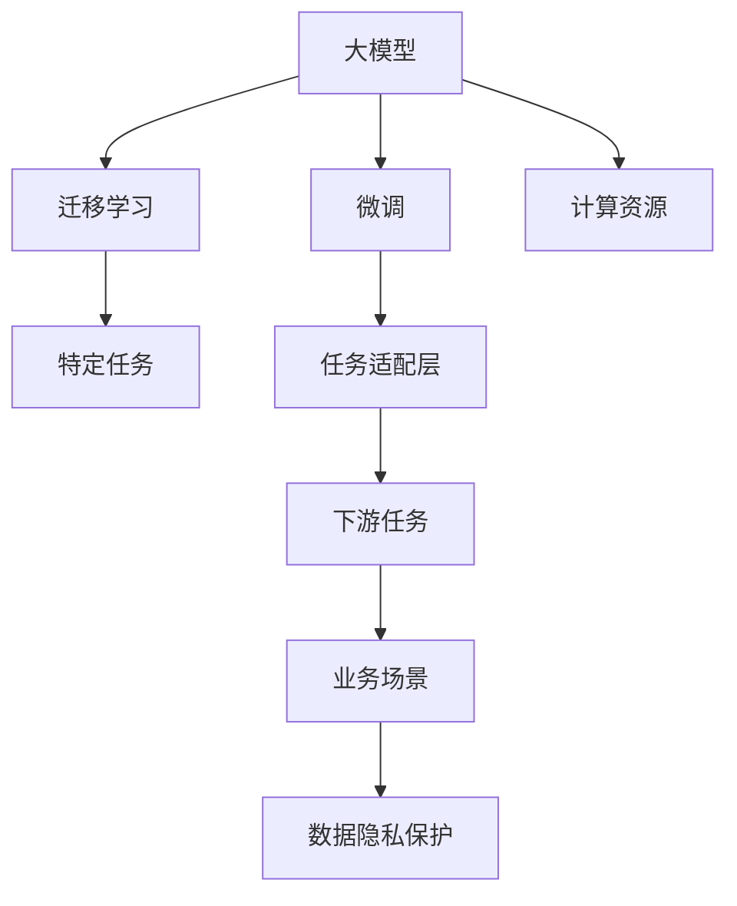
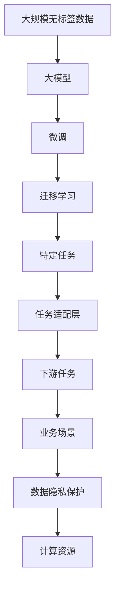

                 

# 大模型应用场景不断拓展，创业者发掘新增长点

> 关键词：大模型应用场景, 创业, 新增长点, 数据驱动, 人工智能, 深度学习, 自然语言处理, 计算机视觉, 工业制造, 健康医疗

## 1. 背景介绍

### 1.1 问题由来
近年来，人工智能(AI)技术蓬勃发展，尤其是在深度学习、自然语言处理(NLP)和计算机视觉(CV)等领域取得了突破性进展。其中，大模型(DPMs, Large Pre-trained Models)在处理大规模复杂数据时表现出卓越的性能，引起了广泛关注。

随着大模型的不断成熟，其在各个行业的应用场景也愈发丰富。这些应用不仅提高了业务效率，还为创业者提供了新的增长点。然而，大模型的应用并非易事，需要深入理解其工作原理，明确技术瓶颈，并结合具体应用场景进行深度定制。

### 1.2 问题核心关键点
大模型在实际应用中的核心关键点包括：

- **技术原理**：大模型通常基于大规模预训练，通过在无标签数据上学习通用知识，再通过微调适应特定任务。理解其工作原理是应用的基础。
- **技术瓶颈**：大模型面临计算资源需求高、模型推理速度慢、数据隐私保护等问题。如何克服这些问题是大模型应用的重要挑战。
- **应用场景**：大模型在不同领域的应用场景多样，包括智能客服、工业制造、医疗健康等。创业者需结合具体行业需求进行模型定制。

## 2. 核心概念与联系

### 2.1 核心概念概述

为更好地理解大模型应用，本节将介绍几个关键概念及其相互联系：

- **大模型**：基于大规模无标签数据预训练得到的通用知识模型，如BERT、GPT-3、ViT等。
- **微调(Fine-tuning)**：在大模型上，通过有标签数据进行微调，以适应特定任务，如情感分析、机器翻译等。
- **迁移学习**：将大模型的通用知识迁移到特定任务上，提高模型适应性。
- **计算资源**：包括GPU/TPU、云计算、数据中心等，是大模型应用的基础。
- **数据隐私保护**：确保模型训练和应用过程中数据隐私的安全性。
- **应用场景**：结合行业需求进行大模型定制，如智能客服、工业质检、医疗影像等。

这些概念之间的联系可以通过以下Mermaid流程图来展示：



这个流程图展示了从大模型到特定任务再到业务场景的完整过程，以及每个环节的关键技术和方法。

### 2.2 概念间的关系

这些概念之间的联系主要体现在以下几个方面：

- **技术共融**：大模型、微调和迁移学习是大模型应用的三大关键技术，它们相互支撑，共同构建起大模型应用的生态系统。
- **场景融合**：大模型在具体业务场景中，需要结合行业特点进行定制，如智能客服需要理解自然语言、工业质检需要高精度检测等。
- **隐私保护**：数据隐私保护是大模型应用中的重要考虑因素，确保模型训练和应用过程中数据的安全性。
- **资源融合**：计算资源是大模型应用的基础，如何合理利用资源，提高模型效率，是应用中的重要问题。

### 2.3 核心概念的整体架构

最后，用一个综合的流程图来展示这些核心概念在大模型应用中的整体架构：



这个综合流程图展示了从数据到模型，再到应用，最后到隐私保护的完整流程，是理解大模型应用的关键。

## 3. 核心算法原理 & 具体操作步骤

### 3.1 算法原理概述

大模型应用的核心算法原理主要包括：

- **预训练**：在大规模无标签数据上，通过自监督学习任务进行训练，学习通用语言和视觉知识。
- **微调**：在预训练模型基础上，通过特定任务的标注数据进行微调，适应下游任务需求。
- **迁移学习**：将预训练模型知识迁移到特定任务，提升模型在新任务上的表现。

### 3.2 算法步骤详解

基于大模型应用的核心算法原理，大模型应用的具体操作步骤包括：

1. **数据准备**：收集和清洗大规模无标签数据，作为预训练的基础。
2. **预训练模型选择**：选择合适的预训练模型，如BERT、GPT、ViT等。
3. **微调模型训练**：在特定任务数据上，进行微调训练，学习任务相关知识。
4. **模型评估与优化**：在验证集上评估模型性能，进行参数调整和超参数优化。
5. **部署与应用**：将微调后的模型部署到实际应用场景中，提供服务或生成输出。

### 3.3 算法优缺点

大模型应用的算法具有以下优点：

- **高效性能**：通过微调和迁移学习，大模型能够在特定任务上取得优异性能，加速应用开发。
- **通用性**：大模型在多个领域和任务上都有出色表现，能够进行跨领域应用。
- **数据利用**：预训练模型可以在大规模无标签数据上学习知识，有效利用数据资源。

同时，也存在一些缺点：

- **计算资源需求高**：大模型需要高性能计算资源，对硬件要求较高。
- **过拟合风险**：在微调过程中容易过拟合，需要精细调参和数据增强等技术。
- **隐私保护**：模型训练和应用过程中，需要考虑数据隐私保护。

### 3.4 算法应用领域

大模型应用的领域非常广泛，主要包括：

- **自然语言处理(NLP)**：如机器翻译、情感分析、文本生成等。
- **计算机视觉(CV)**：如图像分类、目标检测、图像生成等。
- **工业制造**：如缺陷检测、质量检测、机器人控制等。
- **医疗健康**：如影像诊断、基因分析、智能问诊等。
- **金融领域**：如风险评估、欺诈检测、客户服务等。

## 4. 数学模型和公式 & 详细讲解 & 举例说明

### 4.1 数学模型构建

假设有一个大规模预训练模型 $M$，其参数为 $\theta$。在大模型应用中，通常通过微调模型 $M^*$ 适应特定任务 $T$。微调的目标是找到最优的模型参数 $\hat{\theta}$，使得模型在特定任务上的表现最好。

数学表达式如下：

$$
\hat{\theta} = \arg\min_{\theta} \mathcal{L}(T, M^*)
$$

其中，$\mathcal{L}$ 为任务 $T$ 上的损失函数，通常为交叉熵、均方误差等。

### 4.2 公式推导过程

以情感分析任务为例，假设模型在输入 $x$ 上的输出为 $y$，真实标签为 $t$，则情感分析的损失函数为：

$$
\mathcal{L}(y, t) = -\sum_{i=1}^N t_i\log y_i
$$

其中 $N$ 为样本数量，$t_i$ 为标签，$y_i$ 为模型预测输出。

通过反向传播算法，可以计算模型的梯度，更新模型参数。具体步骤如下：

1. 前向传播计算预测输出 $y$。
2. 计算损失函数 $\mathcal{L}$。
3. 反向传播计算梯度。
4. 使用优化算法（如SGD、Adam等）更新模型参数 $\theta$。

### 4.3 案例分析与讲解

假设我们要在大模型基础上进行情感分析的微调，具体步骤如下：

1. **数据准备**：收集情感标注数据集，划分为训练集、验证集和测试集。
2. **预训练模型选择**：选择预训练模型 $M$，如BERT、GPT等。
3. **任务适配层**：在模型顶层添加任务适配层，如全连接层、Attention机制等。
4. **微调模型训练**：在训练集上使用微调模型 $M^*$，通过交叉熵损失函数训练。
5. **模型评估与优化**：在验证集上评估模型性能，调整学习率和正则化参数，防止过拟合。
6. **部署与应用**：将微调后的模型部署到实际应用场景中，进行情感分析。

## 5. 项目实践：代码实例和详细解释说明

### 5.1 开发环境搭建

要进行大模型的应用，首先需要搭建开发环境。以下是一个基本的PyTorch开发环境搭建流程：

1. 安装Anaconda：从官网下载并安装Anaconda，用于创建独立的Python环境。
2. 创建并激活虚拟环境：
```bash
conda create -n pytorch-env python=3.8 
conda activate pytorch-env
```

3. 安装PyTorch：根据CUDA版本，从官网获取对应的安装命令。例如：
```bash
conda install pytorch torchvision torchaudio cudatoolkit=11.1 -c pytorch -c conda-forge
```

4. 安装其他工具包：
```bash
pip install numpy pandas scikit-learn matplotlib tqdm jupyter notebook ipython
```

5. 安装相关的预训练模型和库：
```bash
pip install transformers
```

完成上述步骤后，即可在`pytorch-env`环境中开始大模型应用的实践。

### 5.2 源代码详细实现

下面以图像分类任务为例，使用PyTorch进行大模型的应用实践。

首先，导入相关库和模型：

```python
import torch
from transformers import BertModel, BertTokenizer

device = torch.device('cuda') if torch.cuda.is_available() else torch.device('cpu')
model = BertModel.from_pretrained('bert-base-uncased')
tokenizer = BertTokenizer.from_pretrained('bert-base-uncased')
```

接着，定义数据预处理函数：

```python
def preprocess(text):
    tokens = tokenizer.encode(text, add_special_tokens=True, return_tensors='pt')
    return tokens.to(device)
```

然后，定义模型预测函数：

```python
def predict(model, text):
    tokens = preprocess(text)
    outputs = model(tokens)
    return outputs
```

最后，进行模型预测：

```python
print(predict(model, 'Hello, world!'))
```

可以看到，通过PyTorch和Transformers库，可以快速实现大模型的应用。

### 5.3 代码解读与分析

这个简单的代码片段展示了如何在大模型上进行基本的预测。

- **预训练模型加载**：使用 `from_pretrained` 方法加载预训练模型。
- **数据预处理**：通过 `tokenizer` 将输入文本转换为模型可接受的格式。
- **模型预测**：将预处理后的文本输入模型，获取预测输出。

## 6. 实际应用场景

### 6.1 智能客服

智能客服系统可以基于大模型构建，通过微调和迁移学习，使系统具备自然语言理解能力和对话生成能力。具体实现流程如下：

1. **数据收集**：收集历史客服对话数据，提取问题和回答。
2. **数据预处理**：对文本进行分词、去噪等预处理，转换为模型可接受的格式。
3. **微调模型训练**：在大模型基础上进行微调，适应特定领域的对话生成。
4. **模型评估与优化**：在验证集上评估模型性能，调整超参数。
5. **部署与应用**：将微调后的模型部署到在线客服系统中，实时处理用户咨询。

### 6.2 工业质检

工业质检任务可以通过大模型进行图像分类和目标检测，识别产品缺陷。具体实现流程如下：

1. **数据收集**：收集工业生产中的缺陷图片，标注缺陷类型。
2. **数据预处理**：对图片进行归一化、裁剪等预处理。
3. **预训练模型选择**：选择适合的预训练模型，如ViT、ResNet等。
4. **微调模型训练**：在预训练模型基础上进行微调，学习特定任务的知识。
5. **模型评估与优化**：在验证集上评估模型性能，调整超参数。
6. **部署与应用**：将微调后的模型部署到工业质检系统中，实时检测产品缺陷。

### 6.3 医疗影像

医疗影像任务可以通过大模型进行图像分类和异常检测，帮助医生诊断疾病。具体实现流程如下：

1. **数据收集**：收集医疗影像数据，标注异常区域。
2. **数据预处理**：对影像进行增强、归一化等预处理。
3. **预训练模型选择**：选择适合的预训练模型，如DenseNet、ResNet等。
4. **微调模型训练**：在预训练模型基础上进行微调，学习特定任务的知识。
5. **模型评估与优化**：在验证集上评估模型性能，调整超参数。
6. **部署与应用**：将微调后的模型部署到医疗影像系统中，实时检测异常区域。

## 7. 工具和资源推荐

### 7.1 学习资源推荐

为了帮助开发者掌握大模型应用的理论基础和实践技巧，这里推荐一些优质的学习资源：

1. **《深度学习基础》**：由吴恩达教授主讲，系统讲解深度学习基本原理和实现。
2. **《TensorFlow实战》**：由Google官方推出，详细介绍TensorFlow框架的应用实践。
3. **《自然语言处理入门》**：由斯坦福大学提供，涵盖NLP基础知识和前沿技术。
4. **《计算机视觉基础》**：由微软研究院推出，系统讲解计算机视觉基本原理和实现。
5. **Kaggle竞赛平台**：提供大量实际应用场景的竞赛，帮助开发者实战练习。

通过对这些资源的学习实践，相信你一定能够快速掌握大模型应用的精髓，并用于解决实际的NLP、CV等任务。

### 7.2 开发工具推荐

高效的开发离不开优秀的工具支持。以下是几款用于大模型应用开发的常用工具：

1. **PyTorch**：基于Python的开源深度学习框架，灵活动态的计算图，适合快速迭代研究。
2. **TensorFlow**：由Google主导开发的开源深度学习框架，生产部署方便，适合大规模工程应用。
3. **Transformers库**：HuggingFace开发的NLP工具库，集成了众多SOTA语言模型，支持PyTorch和TensorFlow，是进行大模型应用的利器。
4. **Weights & Biases**：模型训练的实验跟踪工具，可以记录和可视化模型训练过程中的各项指标，方便对比和调优。
5. **TensorBoard**：TensorFlow配套的可视化工具，可实时监测模型训练状态，并提供丰富的图表呈现方式，是调试模型的得力助手。
6. **Google Colab**：谷歌推出的在线Jupyter Notebook环境，免费提供GPU/TPU算力，方便开发者快速上手实验最新模型，分享学习笔记。

合理利用这些工具，可以显著提升大模型应用任务的开发效率，加快创新迭代的步伐。

### 7.3 相关论文推荐

大模型应用的相关研究源于学界的持续研究。以下是几篇奠基性的相关论文，推荐阅读：

1. **Attention is All You Need**：提出Transformer结构，开启了NLP领域的预训练大模型时代。
2. **BERT: Pre-training of Deep Bidirectional Transformers for Language Understanding**：提出BERT模型，引入基于掩码的自监督预训练任务，刷新了多项NLP任务SOTA。
3. **Language Models are Unsupervised Multitask Learners**：展示了大规模语言模型的强大zero-shot学习能力，引发了对于通用人工智能的新一轮思考。
4. **Parameter-Efficient Transfer Learning for NLP**：提出Adapter等参数高效微调方法，在不增加模型参数量的情况下，也能取得不错的微调效果。
5. **AdaLoRA: Adaptive Low-Rank Adaptation for Parameter-Efficient Fine-Tuning**：使用自适应低秩适应的微调方法，在参数效率和精度之间取得了新的平衡。

这些论文代表了大模型应用的发展脉络。通过学习这些前沿成果，可以帮助研究者把握学科前进方向，激发更多的创新灵感。

除上述资源外，还有一些值得关注的前沿资源，帮助开发者紧跟大模型应用的最新进展，例如：

1. **arXiv论文预印本**：人工智能领域最新研究成果的发布平台，包括大量尚未发表的前沿工作，学习前沿技术的必读资源。
2. **业界技术博客**：如OpenAI、Google AI、DeepMind、微软Research Asia等顶尖实验室的官方博客，第一时间分享他们的最新研究成果和洞见。
3. **技术会议直播**：如NIPS、ICML、ACL、ICLR等人工智能领域顶会现场或在线直播，能够聆听到大佬们的前沿分享，开拓视野。
4. **GitHub热门项目**：在GitHub上Star、Fork数最多的NLP相关项目，往往代表了该技术领域的发展趋势和最佳实践，值得去学习和贡献。
5. **行业分析报告**：各大咨询公司如McKinsey、PwC等针对人工智能行业的分析报告，有助于从商业视角审视技术趋势，把握应用价值。

总之，对于大模型应用的学习和实践，需要开发者保持开放的心态和持续学习的意愿。多关注前沿资讯，多动手实践，多思考总结，必将收获满满的成长收益。

## 8. 总结：未来发展趋势与挑战

### 8.1 研究成果总结

本文对大模型应用的基本原理和实现方法进行了系统梳理。从技术原理到操作步骤，再到应用场景，全面展示了大模型应用的各个环节。同时，本文还精选了学习资源、开发工具和相关论文，力求为读者提供全方位的技术指引。

通过本文的系统梳理，可以看到，大模型应用在多个行业领域的应用前景广阔，为创业者提供了新的增长点。

### 8.2 未来发展趋势

展望未来，大模型应用将呈现以下几个发展趋势：

1. **多模态融合**：未来的大模型应用将更多地融合视觉、语音等多模态数据，提升模型的通用性和鲁棒性。
2. **高效推理**：随着模型规模的增大，推理速度和内存占用成为重要瓶颈。高效推理技术如剪枝、量化等将是大模型应用的关键方向。
3. **联邦学习**：联邦学习通过在本地设备上训练模型，保护数据隐私，同时提高模型性能，是大模型应用的未来趋势之一。
4. **模型压缩**：模型压缩技术如知识蒸馏、剪枝、低秩矩阵分解等，将有助于降低模型资源需求，提高应用效率。
5. **动态学习**：动态学习技术如在线学习、自适应学习等，使模型能够不断适应新数据和新任务，保持长期高性能。
6. **跨领域应用**：未来的大模型应用将突破特定领域的限制，涵盖更多行业和领域，如医疗、教育、金融等。

以上趋势凸显了大模型应用技术的广阔前景，将为各行各业带来革命性变化。

### 8.3 面临的挑战

尽管大模型应用技术在不断发展，但仍面临诸多挑战：

1. **计算资源需求高**：大模型应用需要高性能计算资源，对硬件和基础设施要求高。
2. **过拟合风险**：微调过程中容易过拟合，需要精细调参和数据增强等技术。
3. **数据隐私保护**：模型训练和应用过程中，需要考虑数据隐私保护，确保数据安全。
4. **模型鲁棒性不足**：大模型在特定任务上表现优异，但在新场景下泛化能力不足。
5. **模型成本高**：大模型训练和部署成本高，对企业资源要求大。

这些挑战需要不断探索和解决，才能将大模型应用推向更广泛的领域。

### 8.4 研究展望

面对大模型应用所面临的挑战，未来的研究需要在以下几个方面寻求新的突破：

1. **联邦学习**：解决数据隐私问题，提高模型泛化性。
2. **动态学习**：使模型能够持续学习和适应新数据，保持高性能。
3. **多模态融合**：提升模型的通用性和鲁棒性，扩展应用范围。
4. **模型压缩**：降低模型资源需求，提高应用效率。
5. **知识蒸馏**：通过知识蒸馏技术，将知识从复杂模型传递到轻量模型，提升应用效率。
6. **模型优化**：结合优化算法和优化策略，提升模型性能和鲁棒性。

这些研究方向将推动大模型应用技术不断进步，为人工智能在更多领域带来新的突破。

## 9. 附录：常见问题与解答

**Q1：大模型应用技术复杂，如何入门？**

A: 入门大模型应用，建议从基础理论入手，学习深度学习、自然语言处理等基础知识。可以通过在线课程、书籍、论文等多种渠道获取知识。同时，实践是学习的重要手段，可以尝试使用现成的预训练模型，完成简单的任务，逐步积累经验。

**Q2：大模型应用过程中，如何避免过拟合？**

A: 避免过拟合，可以通过数据增强、正则化、早停等方法。在微调过程中，可以使用小批量训练、学习率衰减等技术。同时，可以通过模型压缩和剪枝等方法，降低模型复杂度，避免过拟合。

**Q3：大模型应用时，如何平衡性能和资源消耗？**

A: 平衡性能和资源消耗，可以通过模型压缩、剪枝、量化等技术，降低模型资源需求。同时，可以通过分布式训练和联邦学习等方法，提高模型训练和推理效率。

**Q4：大模型应用中，如何保护数据隐私？**

A: 数据隐私保护是大模型应用中的重要考虑因素。可以通过数据匿名化、差分隐私、联邦学习等技术，保护数据隐私。同时，在模型训练和应用过程中，需要严格遵守法律法规和伦理规范。

**Q5：大模型应用中，如何提高模型鲁棒性？**

A: 提高模型鲁棒性，可以通过数据增强、正则化、对抗训练等方法。同时，可以通过模型压缩和剪枝等技术，降低模型复杂度，提高鲁棒性。

通过深入理解大模型应用的原理和实践，不断探索和解决技术挑战，相信大模型应用将迎来更广泛的应用场景，为各行各业带来革命性变化。

---

作者：禅与计算机程序设计艺术 / Zen and the Art of Computer Programming

