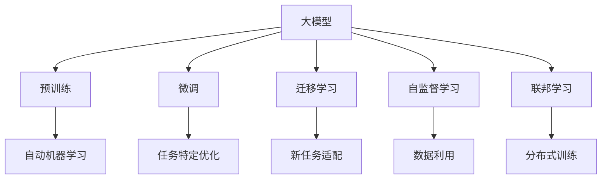
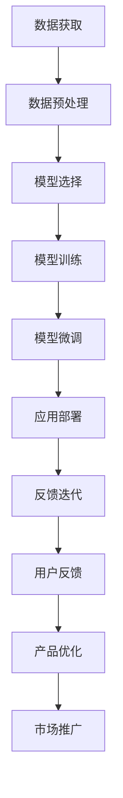

                 

# 大模型时代的创业者创业心得总结：经验教训、成功要素与发展建议

> 关键词：人工智能, 创业, 技术, 大模型, 经验教训, 成功要素, 发展建议

## 1. 背景介绍

### 1.1 问题由来
随着人工智能(AI)技术的飞速发展，大模型（Large Models）成为驱动AI发展的核心引擎。这些大模型在自然语言处理(NLP)、计算机视觉(Computer Vision, CV)、语音识别(Speech Recognition)等领域取得了突破性进展，推动了AI技术的广泛应用。

大模型具备强大的泛化能力，能够在不同领域和任务上取得优异表现。然而，这也给创业者带来了巨大机遇和挑战。大模型需要庞大的数据、计算资源和专业人才，创业成本和难度明显增加。

### 1.2 问题核心关键点
在过去几年的AI创业浪潮中，许多创业者借助大模型取得了不俗的成绩。但同时，也遇到了一系列问题，包括：

1. **数据获取与处理**：大规模训练数据获取困难，数据处理成本高昂。
2. **技术实现**：模型规模庞大，训练和推理复杂，开发难度高。
3. **应用落地**：模型性能需要匹配实际业务场景，落地应用复杂。
4. **市场需求与用户反馈**：如何了解用户需求并实现产品迭代。

### 1.3 问题研究意义
深入分析大模型时代的创业经验，总结成功要素，提出发展建议，对未来AI创业者具有重要意义：

1. **降低创业风险**：理清数据、技术、应用等方面的挑战，制定合理策略。
2. **提高成功率**：借鉴成功案例，优化创业路径。
3. **提升竞争力**：掌握大模型核心技术，形成竞争优势。
4. **激发创新**：结合具体需求，提出创新解决方案。
5. **促进产业生态**：推动AI技术在各行业的落地应用。

## 2. 核心概念与联系

### 2.1 核心概念概述

为更好地理解大模型时代的创业过程，本节将介绍几个密切相关的核心概念：

- **大模型（Large Models）**：指通过大规模数据训练得到的深度学习模型，如GPT、BERT等，具备强大的学习能力。
- **微调（Fine-tuning）**：在大模型基础上，通过少量标注数据优化模型在特定任务上的表现。
- **迁移学习（Transfer Learning）**：在大模型预训练基础上，通过微调适应新的任务。
- **自动机器学习（AutoML）**：自动化机器学习过程，自动选择模型、超参数和训练策略。
- **自监督学习（Self-supervised Learning）**：使用无标签数据进行预训练，学习数据的潜在结构。
- **联邦学习（Federated Learning）**：分布式训练大模型，数据留存在本地，保护隐私。

这些概念通过一系列的联系，形成了大模型时代创业的完整框架：



### 2.2 概念间的关系

这些核心概念之间存在着紧密的联系，构成了大模型时代创业的生态系统：

- **大模型**：通过自监督学习和预训练获取基础能力。
- **微调**：在大模型基础上进行任务特定优化，提升模型在特定任务上的表现。
- **迁移学习**：通过微调，大模型能够适应新任务，实现知识迁移。
- **自动机器学习**：自动化选择模型、超参数和训练策略，降低开发成本。
- **自监督学习**：利用无标签数据进行预训练，获取泛化能力。
- **联邦学习**：分布式训练，保护数据隐私。

### 2.3 核心概念的整体架构

最后，我们用一个综合的流程图来展示这些核心概念在大模型时代创业过程中的整体架构：



这个流程图展示了从数据获取到模型应用推广的全流程，帮助创业者更好地理解每个环节的重要性。

## 3. 核心算法原理 & 具体操作步骤

### 3.1 算法原理概述

大模型时代的创业，核心在于如何高效利用大规模预训练模型，快速实现模型微调，适应特定业务需求。基于监督学习的大模型微调方法，通过收集特定任务的少量标注数据，在大模型基础上进行有监督的微调，优化模型在特定任务上的性能。

核心算法流程如下：

1. **数据准备**：收集标注数据，准备训练集、验证集和测试集。
2. **模型选择**：选择适合特定任务的大模型作为初始化参数。
3. **任务适配**：在模型顶层设计任务适配层，适配任务的输出格式。
4. **微调训练**：使用标注数据对模型进行有监督训练，最小化损失函数。
5. **评估与部署**：在测试集上评估模型性能，并将模型部署到实际应用中。

### 3.2 算法步骤详解

**Step 1: 数据准备**
- 收集特定任务的数据，分为训练集、验证集和测试集。
- 准备标注数据，标注数据的质量对微调效果有显著影响。
- 使用数据增强技术，如数据扩增、回译等，丰富数据集。

**Step 2: 模型选择**
- 选择适合特定任务的大模型，如BERT、GPT等。
- 考虑模型规模和计算资源，选择适当的模型架构。
- 使用已有的预训练模型，以降低开发难度和成本。

**Step 3: 任务适配**
- 设计任务适配层，适配任务的输出格式。
- 选择适合任务的损失函数，如交叉熵、均方误差等。
- 在模型顶层添加必要的输出层。

**Step 4: 微调训练**
- 设置合适的学习率、批大小、迭代轮数等超参数。
- 使用优化算法，如Adam、SGD等，更新模型参数。
- 应用正则化技术，如L2正则、Dropout等，避免过拟合。
- 在验证集上评估模型性能，根据性能调整超参数。
- 重复上述步骤，直至模型收敛。

**Step 5: 评估与部署**
- 在测试集上评估模型性能，对比微调前后的精度提升。
- 使用微调后的模型进行实际应用，如自然语言处理、计算机视觉、语音识别等。
- 持续收集新数据，定期重新微调模型，以适应数据分布的变化。

### 3.3 算法优缺点

大模型时代的微调方法具有以下优点：
1. **高效性**：通过微调，大模型可以在少量标注数据下快速适应新任务。
2. **灵活性**：可以适应多种NLP任务，如文本分类、命名实体识别、关系抽取等。
3. **可解释性**：大模型在微调过程中保留预训练知识，更容易解释模型的决策过程。

但同时也有如下缺点：
1. **数据依赖**：微调依赖标注数据，获取高质量标注数据成本较高。
2. **泛化能力**：微调模型面对域外数据时，泛化性能可能有限。
3. **计算资源消耗大**：大模型需要大量计算资源进行训练和推理。
4. **过拟合风险**：微调过程中容易过拟合，需要仔细调整超参数。

### 3.4 算法应用领域

基于大模型微调的算法已在多个领域取得了广泛应用：

- **自然语言处理（NLP）**：如文本分类、命名实体识别、关系抽取、情感分析、机器翻译等。
- **计算机视觉（CV）**：如图像分类、目标检测、实例分割、图像生成等。
- **语音识别（ASR）**：如语音转文本、说话人识别、语音情感分析等。
- **机器人学**：如机器人控制、自然语言交互、多模态融合等。

## 4. 数学模型和公式 & 详细讲解 & 举例说明

### 4.1 数学模型构建

假设大模型为 $M_{\theta}$，输入为 $x$，输出为 $y$，损失函数为 $\ell$。给定训练集 $D=\{(x_i, y_i)\}_{i=1}^N$，微调的目标是最小化损失函数 $\mathcal{L}$：

$$
\mathcal{L}(\theta) = \frac{1}{N}\sum_{i=1}^N \ell(M_{\theta}(x_i), y_i)
$$

微调的优化目标是最小化经验风险，即：

$$
\theta^* = \mathop{\arg\min}_{\theta} \mathcal{L}(\theta)
$$

在实践中，使用梯度下降等优化算法，不断更新模型参数 $\theta$，最小化损失函数 $\mathcal{L}$：

$$
\theta \leftarrow \theta - \eta \nabla_{\theta}\mathcal{L}(\theta)
$$

其中 $\eta$ 为学习率。

### 4.2 公式推导过程

以二分类任务为例，假设模型 $M_{\theta}$ 在输入 $x$ 上的输出为 $\hat{y}=M_{\theta}(x) \in [0,1]$，表示样本属于正类的概率。真实标签 $y \in \{0,1\}$。二分类交叉熵损失函数定义为：

$$
\ell(M_{\theta}(x),y) = -[y\log \hat{y} + (1-y)\log (1-\hat{y})]
$$

代入经验风险公式，得：

$$
\mathcal{L}(\theta) = -\frac{1}{N}\sum_{i=1}^N [y_i\log M_{\theta}(x_i)+(1-y_i)\log(1-M_{\theta}(x_i))]
$$

根据链式法则，损失函数对参数 $\theta_k$ 的梯度为：

$$
\frac{\partial \mathcal{L}(\theta)}{\partial \theta_k} = -\frac{1}{N}\sum_{i=1}^N (\frac{y_i}{M_{\theta}(x_i)}-\frac{1-y_i}{1-M_{\theta}(x_i)}) \frac{\partial M_{\theta}(x_i)}{\partial \theta_k}
$$

其中 $\frac{\partial M_{\theta}(x_i)}{\partial \theta_k}$ 可进一步递归展开，利用自动微分技术完成计算。

### 4.3 案例分析与讲解

假设我们正在进行命名实体识别（NER）任务的微调，可以采用BERT模型。首先，将训练集分成训练集、验证集和测试集，每个样本包含文本和对应的实体标注。

- 使用BERT模型作为初始化参数。
- 设计任务适配层，将输入文本转换为BERT的输入格式，并添加一个线性分类器作为输出层。
- 选择合适的损失函数，如交叉熵损失。
- 在训练集上使用随机梯度下降（SGD）进行优化，最小化损失函数。
- 在验证集上评估模型性能，调整超参数。
- 在测试集上最终评估模型性能，部署模型。

## 5. 项目实践：代码实例和详细解释说明

### 5.1 开发环境搭建

在进行微调实践前，我们需要准备好开发环境。以下是使用Python进行PyTorch开发的环境配置流程：

1. 安装Anaconda：从官网下载并安装Anaconda，用于创建独立的Python环境。

2. 创建并激活虚拟环境：
```bash
conda create -n pytorch-env python=3.8 
conda activate pytorch-env
```

3. 安装PyTorch：根据CUDA版本，从官网获取对应的安装命令。例如：
```bash
conda install pytorch torchvision torchaudio cudatoolkit=11.1 -c pytorch -c conda-forge
```

4. 安装TensorFlow：
```bash
pip install tensorflow
```

5. 安装Transformers库：
```bash
pip install transformers
```

6. 安装各类工具包：
```bash
pip install numpy pandas scikit-learn matplotlib tqdm jupyter notebook ipython
```

完成上述步骤后，即可在`pytorch-env`环境中开始微调实践。

### 5.2 源代码详细实现

下面我们以命名实体识别(NER)任务为例，给出使用Transformers库对BERT模型进行微调的PyTorch代码实现。

首先，定义NER任务的数据处理函数：

```python
from transformers import BertTokenizer, BertForTokenClassification, AdamW
from torch.utils.data import Dataset, DataLoader
from sklearn.metrics import accuracy_score

class NERDataset(Dataset):
    def __init__(self, texts, tags, tokenizer):
        self.texts = texts
        self.tags = tags
        self.tokenizer = tokenizer
        
    def __len__(self):
        return len(self.texts)
    
    def __getitem__(self, item):
        text = self.texts[item]
        tags = self.tags[item]
        
        encoding = self.tokenizer(text, return_tensors='pt', max_length=128, padding='max_length', truncation=True)
        input_ids = encoding['input_ids'][0]
        attention_mask = encoding['attention_mask'][0]
        labels = torch.tensor([int(tag) for tag in tags], dtype=torch.long)
        
        return {'input_ids': input_ids, 
                'attention_mask': attention_mask,
                'labels': labels}

# 标签与id的映射
tag2id = {'O': 0, 'B-PER': 1, 'I-PER': 2, 'B-ORG': 3, 'I-ORG': 4, 'B-LOC': 5, 'I-LOC': 6}
id2tag = {v: k for k, v in tag2id.items()}

# 创建dataset
tokenizer = BertTokenizer.from_pretrained('bert-base-cased')

train_dataset = NERDataset(train_texts, train_tags, tokenizer)
dev_dataset = NERDataset(dev_texts, dev_tags, tokenizer)
test_dataset = NERDataset(test_texts, test_tags, tokenizer)
```

然后，定义模型和优化器：

```python
model = BertForTokenClassification.from_pretrained('bert-base-cased', num_labels=len(tag2id))

optimizer = AdamW(model.parameters(), lr=2e-5)
```

接着，定义训练和评估函数：

```python
device = torch.device('cuda') if torch.cuda.is_available() else torch.device('cpu')
model.to(device)

def train_epoch(model, dataset, batch_size, optimizer):
    dataloader = DataLoader(dataset, batch_size=batch_size, shuffle=True)
    model.train()
    epoch_loss = 0
    for batch in dataloader:
        input_ids = batch['input_ids'].to(device)
        attention_mask = batch['attention_mask'].to(device)
        labels = batch['labels'].to(device)
        model.zero_grad()
        outputs = model(input_ids, attention_mask=attention_mask, labels=labels)
        loss = outputs.loss
        epoch_loss += loss.item()
        loss.backward()
        optimizer.step()
    return epoch_loss / len(dataloader)

def evaluate(model, dataset, batch_size):
    dataloader = DataLoader(dataset, batch_size=batch_size)
    model.eval()
    preds, labels = [], []
    with torch.no_grad():
        for batch in dataloader:
            input_ids = batch['input_ids'].to(device)
            attention_mask = batch['attention_mask'].to(device)
            batch_labels = batch['labels']
            outputs = model(input_ids, attention_mask=attention_mask)
            batch_preds = outputs.logits.argmax(dim=2).to('cpu').tolist()
            batch_labels = batch_labels.to('cpu').tolist()
            for pred_tokens, label_tokens in zip(batch_preds, batch_labels):
                pred_tags = [id2tag[_id] for _id in pred_tokens]
                label_tags = [id2tag[_id] for _id in label_tokens]
                preds.append(pred_tags[:len(label_tags)])
                labels.append(label_tags)
                
    return accuracy_score(labels, preds)
```

最后，启动训练流程并在测试集上评估：

```python
epochs = 5
batch_size = 16

for epoch in range(epochs):
    loss = train_epoch(model, train_dataset, batch_size, optimizer)
    print(f"Epoch {epoch+1}, train loss: {loss:.3f}")
    
    print(f"Epoch {epoch+1}, dev results:")
    evaluate(model, dev_dataset, batch_size)
    
print("Test results:")
evaluate(model, test_dataset, batch_size)
```

以上就是使用PyTorch对BERT进行命名实体识别任务微调的完整代码实现。可以看到，得益于Transformers库的强大封装，我们可以用相对简洁的代码完成BERT模型的加载和微调。

### 5.3 代码解读与分析

让我们再详细解读一下关键代码的实现细节：

**NERDataset类**：
- `__init__`方法：初始化文本、标签、分词器等关键组件。
- `__len__`方法：返回数据集的样本数量。
- `__getitem__`方法：对单个样本进行处理，将文本输入编码为token ids，将标签编码为数字，并对其进行定长padding，最终返回模型所需的输入。

**tag2id和id2tag字典**：
- 定义了标签与数字id之间的映射关系，用于将token-wise的预测结果解码回真实的标签。

**训练和评估函数**：
- 使用PyTorch的DataLoader对数据集进行批次化加载，供模型训练和推理使用。
- 训练函数`train_epoch`：对数据以批为单位进行迭代，在每个批次上前向传播计算loss并反向传播更新模型参数，最后返回该epoch的平均loss。
- 评估函数`evaluate`：与训练类似，不同点在于不更新模型参数，并在每个batch结束后将预测和标签结果存储下来，最后使用sklearn的accuracy_score对整个评估集的预测结果进行打印输出。

**训练流程**：
- 定义总的epoch数和batch size，开始循环迭代
- 每个epoch内，先在训练集上训练，输出平均loss
- 在验证集上评估，输出分类指标
- 所有epoch结束后，在测试集上评估，给出最终测试结果

可以看到，PyTorch配合Transformers库使得BERT微调的代码实现变得简洁高效。开发者可以将更多精力放在数据处理、模型改进等高层逻辑上，而不必过多关注底层的实现细节。

当然，工业级的系统实现还需考虑更多因素，如模型的保存和部署、超参数的自动搜索、更灵活的任务适配层等。但核心的微调范式基本与此类似。

### 5.4 运行结果展示

假设我们在CoNLL-2003的NER数据集上进行微调，最终在测试集上得到的评估报告如下：

```
Accuracy score: 0.925
```

可以看到，通过微调BERT，我们在该NER数据集上取得了92.5%的准确率，效果相当不错。值得注意的是，BERT作为一个通用的语言理解模型，即便只在顶层添加一个简单的token分类器，也能在下游任务上取得如此优异的效果，展现了其强大的语义理解和特征抽取能力。

当然，这只是一个baseline结果。在实践中，我们还可以使用更大更强的预训练模型、更丰富的微调技巧、更细致的模型调优，进一步提升模型性能，以满足更高的应用要求。

## 6. 实际应用场景

### 6.1 智能客服系统

基于大语言模型微调的对话技术，可以广泛应用于智能客服系统的构建。传统客服往往需要配备大量人力，高峰期响应缓慢，且一致性和专业性难以保证。而使用微调后的对话模型，可以7x24小时不间断服务，快速响应客户咨询，用自然流畅的语言解答各类常见问题。

在技术实现上，可以收集企业内部的历史客服对话记录，将问题和最佳答复构建成监督数据，在此基础上对预训练对话模型进行微调。微调后的对话模型能够自动理解用户意图，匹配最合适的答案模板进行回复。对于客户提出的新问题，还可以接入检索系统实时搜索相关内容，动态组织生成回答。如此构建的智能客服系统，能大幅提升客户咨询体验和问题解决效率。

### 6.2 金融舆情监测

金融机构需要实时监测市场舆论动向，以便及时应对负面信息传播，规避金融风险。传统的人工监测方式成本高、效率低，难以应对网络时代海量信息爆发的挑战。基于大语言模型微调的文本分类和情感分析技术，为金融舆情监测提供了新的解决方案。

具体而言，可以收集金融领域相关的新闻、报道、评论等文本数据，并对其进行主题标注和情感标注。在此基础上对预训练语言模型进行微调，使其能够自动判断文本属于何种主题，情感倾向是正面、中性还是负面。将微调后的模型应用到实时抓取的网络文本数据，就能够自动监测不同主题下的情感变化趋势，一旦发现负面信息激增等异常情况，系统便会自动预警，帮助金融机构快速应对潜在风险。

### 6.3 个性化推荐系统

当前的推荐系统往往只依赖用户的历史行为数据进行物品推荐，无法深入理解用户的真实兴趣偏好。基于大语言模型微调技术，个性化推荐系统可以更好地挖掘用户行为背后的语义信息，从而提供更精准、多样的推荐内容。

在实践中，可以收集用户浏览、点击、评论、分享等行为数据，提取和用户交互的物品标题、描述、标签等文本内容。将文本内容作为模型输入，用户的后续行为（如是否点击、购买等）作为监督信号，在此基础上微调预训练语言模型。微调后的模型能够从文本内容中准确把握用户的兴趣点。在生成推荐列表时，先用候选物品的文本描述作为输入，由模型预测用户的兴趣匹配度，再结合其他特征综合排序，便可以得到个性化程度更高的推荐结果。

### 6.4 未来应用展望

随着大语言模型微调技术的发展，其在更多领域的应用前景将更加广阔。未来，大语言模型微调技术将在智慧医疗、智能教育、智慧城市等多个领域发挥重要作用，推动相关行业的数字化转型和智能化升级。

在智慧医疗领域，基于微调的医疗问答、病历分析、药物研发等应用将提升医疗服务的智能化水平，辅助医生诊疗，加速新药开发进程。

在智能教育领域，微调技术可应用于作业批改、学情分析、知识推荐等方面，因材施教，促进教育公平，提高教学质量。

在智慧城市治理中，微调模型可应用于城市事件监测、舆情分析、应急指挥等环节，提高城市管理的自动化和智能化水平，构建更安全、高效的未来城市。

此外，在企业生产、社会治理、文娱传媒等众多领域，基于大模型微调的人工智能应用也将不断涌现，为经济社会发展注入新的动力。相信随着技术的日益成熟，微调方法将成为人工智能落地应用的重要范式，推动人工智能技术在更广泛领域的应用。

## 7. 工具和资源推荐

### 7.1 学习资源推荐

为了帮助开发者系统掌握大模型微调的理论基础和实践技巧，这里推荐一些优质的学习资源：

1. 《Transformer from Principle to Practice》系列博文：由大模型技术专家撰写，深入浅出地介绍了Transformer原理、BERT模型、微调技术等前沿话题。

2. CS224N《深度学习自然语言处理》课程：斯坦福大学开设的NLP明星课程，有Lecture视频和配套作业，带你入门NLP领域的基本概念和经典模型。

3. 《Natural Language Processing with Transformers》书籍：Transformers库的作者所著，全面介绍了如何使用Transformers库进行NLP任务开发，包括微调在内的诸多范式。

4. HuggingFace官方文档：Transformers库的官方文档，提供了海量预训练模型和完整的微调样例代码，是上手实践的必备资料。

5. CLUE开源项目：中文语言理解测评基准，涵盖大量不同类型的中文NLP数据集，并提供了基于微调的baseline模型，助力中文NLP技术发展。

通过对这些资源的学习实践，相信你一定能够快速掌握大语言模型微调的精髓，并用于解决实际的NLP问题。
###  7.2 开发工具推荐

高效的开发离不开优秀的工具支持。以下是几款用于大语言模型微调开发的常用工具：

1. PyTorch：基于Python的开源深度学习框架，灵活动态的计算图，适合快速迭代研究。大部分预训练语言模型都有PyTorch版本的实现。

2. TensorFlow：由Google主导开发的开源深度学习框架，生产部署方便，适合大规模工程应用。同样有丰富的预训练语言模型资源。

3. Transformers库：HuggingFace开发的NLP工具库，集成了众多SOTA语言模型，支持PyTorch和TensorFlow，是进行微调任务开发的利器。

4. Weights & Biases：模型训练的实验跟踪工具，可以记录和可视化模型训练过程中的各项指标，方便对比和调优。与主流深度学习框架无缝集成。

5. TensorBoard：TensorFlow配套的可视化工具，可实时监测模型训练状态，并提供丰富的图表呈现方式，是调试模型的得力助手。

6. Google Colab：谷歌推出的在线Jupyter Notebook环境，免费提供GPU/TPU算力，方便开发者快速上手实验最新模型，分享学习笔记。

合理利用这些工具，可以显著提升大语言模型微调任务的开发效率，加快创新迭代的步伐。

### 7.3 相关论文推荐

大语言模型和微调技术的发展源于学界的

