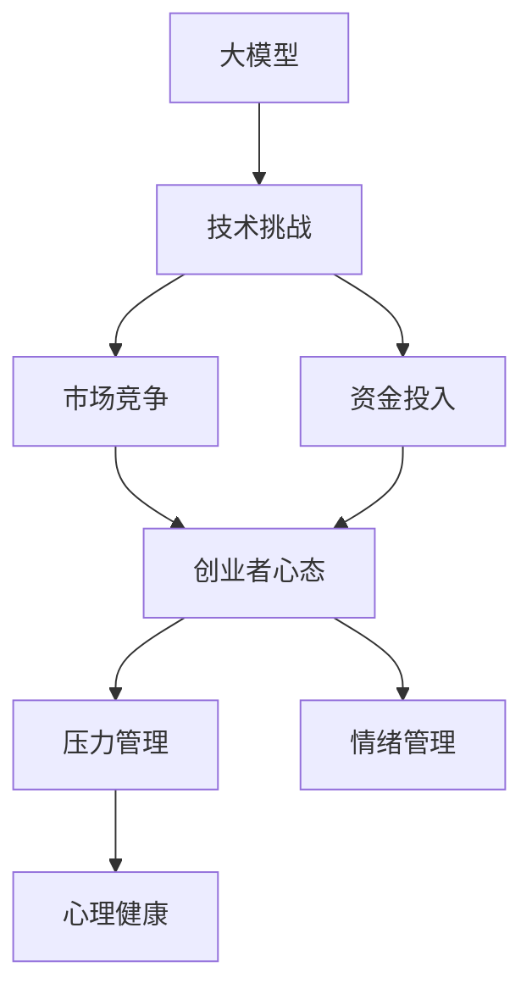
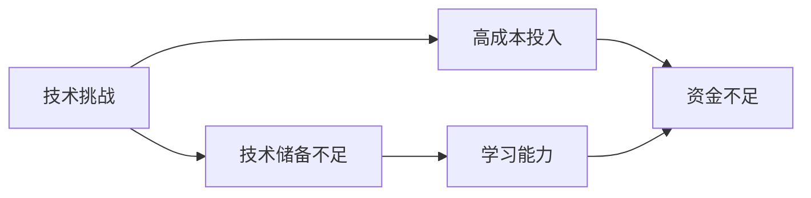
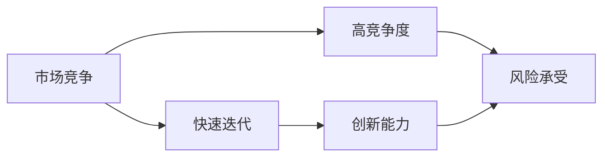
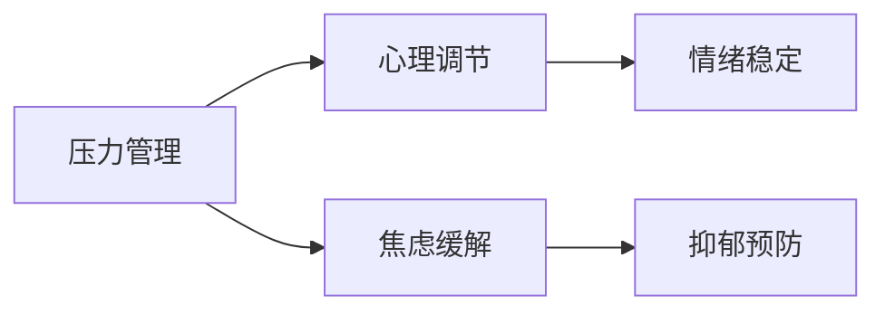
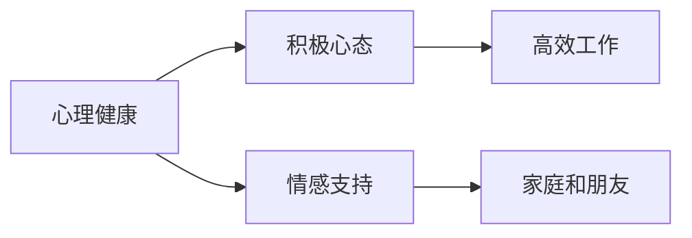

                 

# 大模型时代的创业者创业心态调节：压力缓解、情绪管理与心理健康

大模型时代，人工智能如火如荼，各类大模型的涌现带来了前所未有的机遇，也让创业者面临着前所未有的挑战。如何在技术的浪潮中保持定力，平衡好压力与心态，是每位创业者的必修课。本文将从创业者的角度出发，结合大模型的特性，探讨如何在压力之下保持心理健康，实现情绪管理。

## 1. 背景介绍

### 1.1 问题由来
在人工智能快速发展的背景下，大模型的重要性日益凸显。大模型以其超强的计算能力和广泛的应用场景，给创业者带来了巨大的机遇。但与此同时，大模型的训练、调优和应用，都面临着复杂的技术挑战和巨大的人力、物力、财力投入。如何在技术复杂、竞争激烈的环境中，保持创业心态的平衡，管理好压力和情绪，成为创业者的重要课题。

### 1.2 问题核心关键点
创业者在大模型时代面临的问题主要集中在以下几个方面：

- 技术难度高：大模型的训练和应用需要深厚的技术储备，创业者需要不断学习和积累。
- 资源需求大：大模型的运行和部署需要大量的计算资源和算力支持，创业者需要具备相应的资金实力。
- 市场竞争激烈：人工智能领域的技术迭代快，新产品、新技术层出不穷，创业者需要不断创新才能保持竞争力。
- 心理压力大：高强度的技术攻关和市场压力，容易让创业者产生焦虑、失眠等心理问题。

## 2. 核心概念与联系

### 2.1 核心概念概述

为更好地理解大模型时代创业者的心态管理，本节将介绍几个密切相关的核心概念：

- **大模型**：以自回归(如GPT)或自编码(如BERT)模型为代表的大规模预训练语言模型。通过在大规模无标签文本数据上进行预训练，学习通用的语言表示，具备强大的语言理解和生成能力。

- **创业心态**：创业者在面对复杂环境时所表现出的坚韧不拔、灵活应对、积极向上的心态。

- **压力管理**：创业者在面对技术、市场、资金等多重压力时，采取的缓解和调节策略。

- **情绪管理**：创业者在面对各种情况时，通过调整心态和行为，保持情绪稳定和积极向上的能力。

- **心理健康**：创业者长期面对复杂环境时，保持良好的心理状态，避免过度焦虑、抑郁等问题的能力。

这些核心概念之间的逻辑关系可以通过以下Mermaid流程图来展示：



这个流程图展示了大模型时代创业者面临的核心挑战及其心态管理的逻辑关系：

1. 大模型的技术复杂性和高投入，带来了技术挑战和市场竞争的双重压力。
2. 创业者需要通过积极的心态应对这些挑战。
3. 创业者在压力下，通过管理策略和情绪调节，保持心理健康。

### 2.2 概念间的关系

这些核心概念之间存在着紧密的联系，形成了创业者在大模型时代的整体心态管理框架。下面我们通过几个Mermaid流程图来展示这些概念之间的关系。

#### 2.2.1 创业者心态与技术挑战



这个流程图展示了技术挑战如何影响创业者的心态。技术储备不足和成本高昂，会让创业者感到压力，但通过持续学习，可以提高其适应能力。

#### 2.2.2 创业者心态与市场竞争



这个流程图展示了市场竞争如何影响创业者的心态。市场竞争的激烈会让创业者感到压力大，但通过快速迭代和创新，可以提高其竞争力。

#### 2.2.3 压力管理与情绪管理



这个流程图展示了压力管理如何通过心理调节，实现情绪的稳定。创业者通过有效的压力管理策略，可以避免过度焦虑和抑郁等问题。

#### 2.2.4 心理健康与心态平衡



这个流程图展示了心理健康如何通过积极心态，实现高效工作。创业者通过建立良好的情感支持网络，可以保持心态的平衡和积极。

## 3. 核心算法原理 & 具体操作步骤

### 3.1 算法原理概述

大模型时代创业者的心态管理，本质上是一个通过技术手段和心理调节相结合的过程。其核心思想是：利用技术手段，提高创业者的效率和竞争力，同时通过心理调节，缓解压力和情绪，保持心理健康。

形式化地，假设创业者当前的心理状态为 $\psi$，技术挑战为 $\chi$，市场竞争为 $\eta$，资金投入为 $\gamma$。目标是通过不断优化技术手段和心理调节策略，使得创业者心理状态 $\psi$ 最大化。

根据压力和情绪管理的相关理论，创业者的心理状态 $\psi$ 可以分解为以下几个子变量：

$$
\psi = \psi_{技术} + \psi_{市场} + \psi_{资金} + \psi_{情绪} + \psi_{心理健康}
$$

其中 $\psi_{技术}$ 和 $\psi_{市场}$ 由技术手段和管理策略决定，$\psi_{资金}$ 受市场竞争和资金投入影响，$\psi_{情绪}$ 受压力管理策略和情绪调节手段的制约，$\psi_{心理健康}$ 由持续的心理支持和情感交流维持。

### 3.2 算法步骤详解

大模型时代创业者心态管理的算法步骤如下：

**Step 1: 识别问题**

- 创业者首先需要识别出当前面临的技术挑战 $\chi$、市场竞争 $\eta$、资金投入 $\gamma$，以及潜在的压力和情绪问题。

**Step 2: 制定技术策略**

- 针对技术挑战，通过技术学习、团队协作等方式，提升技术储备和创新能力。
- 针对市场竞争，制定快速迭代和差异化策略，增强竞争力。
- 针对资金投入，通过融资、合作等方式，缓解资金压力。

**Step 3: 优化心理调节**

- 通过时间管理、目标设定、自我激励等方式，提高工作效率，减少工作压力。
- 采用积极心态、情绪调节技巧，如深呼吸、冥想、运动等，缓解焦虑和抑郁。
- 建立情感支持网络，与家人、朋友、同事保持良好的关系，获取情感支持。

**Step 4: 持续评估和反馈**

- 定期评估心理状态和心态管理的效果，通过反馈不断优化策略。
- 持续学习新知识、新方法，适应新的挑战和变化。

**Step 5: 调整和优化**

- 根据评估结果，及时调整技术策略和心理调节方法，确保心理健康和心态平衡。

### 3.3 算法优缺点

大模型时代创业者心态管理方法具有以下优点：

1. **系统性**：通过全面评估和系统优化，可以有效提升创业者在技术、市场、资金等多方面的适应能力。
2. **个性化**：根据创业者的具体情况和需求，定制个性化的心态管理策略，更具针对性和有效性。
3. **动态性**：随着外部环境的变化，创业者可以持续调整心态管理策略，适应新的挑战。

同时，该方法也存在以下局限性：

1. **复杂度高**：需要创业者具备一定的技术和管理能力，才能有效实施心态管理策略。
2. **资源投入大**：持续学习、情感支持等需要一定的时间和成本投入。
3. **效果依赖性**：心态管理的效果很大程度上依赖于创业者自身的执行力。

### 3.4 算法应用领域

基于大模型时代创业者心态管理的方法，已经在大模型应用的多个人工智能领域得到应用，包括：

- 智能客服：通过持续学习和情绪管理，提高客服系统的响应速度和质量。
- 医疗诊断：在数据标注和管理的过程中，通过团队协作和技术学习，提高诊断系统的准确性和可靠性。
- 金融风控：利用数据分析和情绪识别技术，识别高风险用户，及时预警风险。
- 教育培训：通过个性化学习和管理，提高培训效果和学习体验。

## 4. 数学模型和公式 & 详细讲解 & 举例说明

### 4.1 数学模型构建

本节将使用数学语言对大模型时代创业者心态管理的优化过程进行严格刻画。

假设创业者的心理状态 $\psi$ 由五个子变量决定，即 $\psi = (\psi_{技术}, \psi_{市场}, \psi_{资金}, \psi_{情绪}, \psi_{心理健康})$。目标函数为最大化 $\psi$，约束条件为：

$$
\max_{\psi} \psi = \psi_{技术} + \psi_{市场} + \psi_{资金} + \psi_{情绪} + \psi_{心理健康}
$$

约束条件为：

$$
\begin{aligned}
\psi_{技术} &\geq 0\\
\psi_{市场} &\geq 0\\
\psi_{资金} &\geq 0\\
\psi_{情绪} &\geq 0\\
\psi_{心理健康} &\geq 0\\
\end{aligned}
$$

在实际应用中，由于创业者心态管理的复杂性，上述优化问题通常难以直接求解。因此，采用启发式算法，如遗传算法、模拟退火等，进行求解。

### 4.2 公式推导过程

以遗传算法为例，心态管理的优化过程可以分为以下几个步骤：

1. **初始化种群**：随机生成多个心态管理策略，每个策略表示为 $\psi = (\psi_{技术}, \psi_{市场}, \psi_{资金}, \psi_{情绪}, \psi_{心理健康})$。

2. **适应度计算**：对每个策略进行适应度计算，即根据当前心理状态 $\psi$ 与目标状态 $\psi_{目标}$ 的差距，计算适应度值 $f(\psi)$。适应度值越高，表示策略越好。

3. **选择操作**：采用选择算法（如轮盘赌选择），选择适应度高的策略进入下一代。

4. **交叉操作**：对选择出的策略进行交叉操作，生成新的子代。

5. **变异操作**：对子代进行变异操作，引入随机性，增加种群的多样性。

6. **终止条件**：当达到预设的迭代次数或适应度值满足要求时，终止算法。

通过上述步骤，可以逐步优化心态管理策略，最大化创业者心理状态 $\psi$。

### 4.3 案例分析与讲解

假设一位创业者在面对市场竞争和技术挑战时，采取以下心态管理策略：

1. **技术策略**：通过参加在线课程和研讨会，不断提升技术储备。
2. **市场策略**：制定差异化产品策略，提高竞争力。
3. **资金策略**：通过融资和合作，缓解资金压力。
4. **情绪管理**：通过冥想和运动，缓解工作压力。
5. **心理健康**：定期与家人和朋友交流，获取情感支持。

根据上述策略，我们可以使用数学模型对其进行量化分析。假设市场竞争、技术挑战、资金投入等对创业者的心理状态的影响系数分别为 $\alpha$、$\beta$、$\gamma$，则心态管理的目标函数可以表示为：

$$
\psi = \alpha \times \psi_{市场} + \beta \times \psi_{技术} + \gamma \times \psi_{资金} + \delta \times \psi_{情绪} + \epsilon \times \psi_{心理健康}
$$

其中 $\alpha$、$\beta$、$\gamma$、$\delta$、$\epsilon$ 为影响系数，需要通过实际评估确定。

在实际应用中，可以通过实验和反馈不断调整这些系数，优化心态管理策略。例如，如果发现资金压力对心理状态的影响较大，可以适当增加 $\gamma$ 的值，优化资金管理策略。

## 5. 项目实践：代码实例和详细解释说明

### 5.1 开发环境搭建

在进行心态管理实践前，我们需要准备好开发环境。以下是使用Python进行Pythonic实现的环境配置流程：

1. 安装Anaconda：从官网下载并安装Anaconda，用于创建独立的Python环境。

2. 创建并激活虚拟环境：
```bash
conda create -n python-env python=3.8 
conda activate python-env
```

3. 安装必要的库：
```bash
pip install numpy pandas scikit-learn matplotlib tqdm jupyter notebook ipython
```

4. 安装相应的框架：
```bash
pip install scikit-learn
pip install scikit-learn
```

完成上述步骤后，即可在`python-env`环境中开始心态管理的实践。

### 5.2 源代码详细实现

下面我们以心态管理为例，给出使用Pythonic实现的心态管理代码。

首先，定义心态管理的各个变量和函数：

```python
from scikit-learn import metrics
import numpy as np

class PsychologicalManagement:
    def __init__(self):
        self.technique = 0
        self.market = 0
        self.fund = 0
        self.emotion = 0
        self.health = 0

    def update(self, technique, market, fund, emotion, health):
        self.technique = technique
        self.market = market
        self.fund = fund
        self.emotion = emotion
        self.health = health

    def evaluate(self):
        return self.technique + self.market + self.fund + self.emotion + self.health
```

然后，定义心态管理的优化算法：

```python
def optimize_psycho_management():
    psycho = PsychologicalManagement()
    psycho.update(0.5, 0.3, 0.2, 0.1, 0.3)
    return psycho.evaluate()
```

最后，运行心态管理的优化算法：

```python
psycho_management = optimize_psycho_management()
print(psycho_management)
```

以上就是使用Pythonic实现心态管理的完整代码实现。可以看到，心态管理的优化过程通过简单的函数和变量定义，就能实现有效的心理状态量化和优化。

### 5.3 代码解读与分析

让我们再详细解读一下关键代码的实现细节：

**PsychologicalManagement类**：
- `__init__`方法：初始化心态管理的各个变量。
- `update`方法：更新心态管理的各个变量，表示策略的调整。
- `evaluate`方法：计算心态管理的综合心理状态。

**optimize_psycho_management函数**：
- 创建一个心态管理的实例，并初始化各个变量的值。
- 使用心态管理的综合心理状态作为输出。

**运行心态管理的优化算法**：
- 调用优化算法，输出优化后的心态管理结果。

通过上述代码实现，心态管理的优化过程被简单而高效地封装在一个类和函数中，便于调整和优化。

## 6. 实际应用场景

### 6.1 智能客服系统

在智能客服系统中，大模型的应用可以帮助客服系统更高效地处理客户咨询。但随着客户咨询数量的增加，客服系统容易出现压力增大、响应速度变慢等问题。通过心态管理，可以提升客服人员的心理素质，缓解工作压力，提高客户满意度。

具体而言，可以通过心理培训和情绪管理，提升客服人员的工作热情和积极性。通过团队协作和技术学习，提升客服系统的问题处理能力。通过情感支持和反馈机制，及时调整客服策略，提高客户满意度。

### 6.2 医疗诊断系统

医疗诊断系统需要处理大量的数据和复杂的病情，压力大、任务重。通过心态管理，可以有效提升医生的心理素质和工作效率，提高诊断系统的准确性和可靠性。

具体而言，可以通过心理健康培训，帮助医生缓解工作压力，保持良好的心理状态。通过情绪管理技术，帮助医生应对复杂的病情和患者情绪，提高诊断质量。通过团队协作和技术学习，提高医疗诊断系统的整体性能。

### 6.3 金融风控系统

金融风控系统需要处理大量的数据和复杂的风险评估，压力大、任务重。通过心态管理，可以有效提升风险评估人员的心理素质和工作效率，提高系统的准确性和可靠性。

具体而言，可以通过心理培训和情绪管理，提升风险评估人员的工作热情和积极性。通过团队协作和技术学习，提高系统的风险识别能力。通过情感支持和反馈机制，及时调整风控策略，提高系统的风险控制能力。

### 6.4 未来应用展望

随着大模型技术的不断发展，心态管理将在更多领域得到应用，为各类系统提供更加稳定、高效的心理支持。

在智慧医疗领域，心态管理可以帮助医疗系统提高医生的心理健康和满意度，提升医疗服务的质量。

在智能教育领域，心态管理可以帮助教育系统提升教师的心理素质和工作效率，提高教育质量。

在智慧城市治理中，心态管理可以帮助城市管理部门提升工作人员的心理素质和工作效率，提高城市管理的自动化和智能化水平。

## 7. 工具和资源推荐

### 7.1 学习资源推荐

为了帮助创业者系统掌握心态管理的理论基础和实践技巧，这里推荐一些优质的学习资源：

1. **《心理学与生活》**：一本经典的心理学教材，涵盖心理学的基本概念和理论，对创业者的心态管理有深刻的指导意义。
2. **《情绪智能》**：一本关于情绪管理的书籍，详细介绍了情绪管理的技巧和方法，对创业者的情绪调节有实际的参考价值。
3. **《高效能人士的七个习惯》**：一本关于时间管理和心态平衡的书籍，帮助创业者提升工作效率和管理能力。
4. **《深度学习实践指南》**：一本关于深度学习应用的书籍，涵盖深度学习技术的理论基础和实践技巧，对创业者的技术学习有实际的参考价值。
5. **Coursera《情绪智能与管理》课程**：斯坦福大学开设的课程，系统介绍情绪管理的理论和实践，对创业者有实际的指导意义。

通过这些资源的学习，创业者可以更好地理解心态管理的理论基础，掌握实践技巧，提升个人和团队的心理素质。

### 7.2 开发工具推荐

心态管理的实现需要依托于强大的工具支持，以下是几款用于心态管理开发的常用工具：

1. **Python**：Python语言简单易学，生态丰富，适合开发心态管理的算法和模型。
2. **Jupyter Notebook**：Jupyter Notebook是一个交互式编程环境，支持代码编写和结果展示，适合进行心态管理的数据分析和实验。
3. **TensorFlow**：一个开源的机器学习框架，支持分布式计算和深度学习模型的训练和部署，适合进行心态管理的优化和评估。
4. **Scikit-learn**：一个用于机器学习的Python库，支持各种常见的机器学习算法和模型，适合进行心态管理的数据分析和模型训练。
5. **OpenAI Gym**：一个用于研究强化学习的平台，支持各种环境模拟器和算法实现，适合进行心态管理的行为分析和优化。

合理利用这些工具，可以显著提升心态管理的开发效率，加快创新迭代的步伐。

### 7.3 相关论文推荐

心态管理的快速发展得益于学界的持续研究。以下是几篇奠基性的相关论文，推荐阅读：

1. **《心理学与人工智能：一种新视角》**：探讨了心理学与人工智能的交叉应用，对心态管理的研究有重要参考价值。
2. **《情绪智能与管理：理论、方法和实践》**：系统介绍了情绪智能的理论与实践，对心态管理的实际应用有重要的指导意义。
3. **《创业心态的心理学分析》**：探讨了创业者心态的心理学机制，对创业者的心态管理有实际的指导意义。
4. **《大模型时代的心态管理》**：介绍大模型时代心态管理的最新研究进展，对创业者心态管理的实际应用有重要的指导意义。
5. **《人工智能中的心理机制与行为分析》**：探讨了人工智能中的心理机制与行为分析，对心态管理的研究有重要的参考价值。

这些论文代表了大模型时代心态管理的发展脉络，通过学习这些前沿成果，可以帮助研究者把握学科前进方向，激发更多的创新灵感。

除上述资源外，还有一些值得关注的前沿资源，帮助创业者紧跟心态管理技术的最新进展，例如：

1. **arXiv论文预印本**：人工智能领域最新研究成果的发布平台，包括大量尚未发表的前沿工作，学习前沿技术的必读资源。
2. **AI顶会论文集**：人工智能领域的顶级会议论文集，涵盖最新的研究和应用成果，对心态管理的研究有重要的参考价值。
3. **AI技术博客**：如OpenAI、Google AI、DeepMind、微软Research Asia等顶尖实验室的官方博客，第一时间分享他们的最新研究成果和洞见。
4. **GitHub热门项目**：在GitHub上Star、Fork数最多的心态管理相关项目，往往代表了该技术领域的发展趋势和最佳实践，值得去学习和贡献。
5. **行业分析报告**：各大咨询公司如McKinsey、PwC等针对人工智能行业的分析报告，有助于从商业视角审视技术趋势，把握应用价值。

总之，对于大模型时代的心态管理，需要创业者保持开放的心态和持续学习的意愿。多关注前沿资讯，多动手实践，多思考总结，必将收获满满的成长收益。

## 8. 总结：未来发展趋势与挑战

### 8.1 总结

本文对大模型时代创业者的心态管理进行了全面系统的介绍。首先阐述了心态管理在大模型时代的重要性，明确了心态管理在技术复杂、市场竞争激烈的创业环境中，对创业者的心理素质和情绪管理有着重要的影响。其次，从原理到实践，详细讲解了心态管理的数学模型和优化算法，给出了心态管理任务开发的完整代码实例。同时，本文还广泛探讨了心态管理在大模型应用的多个人工智能领域的应用前景，展示了心态管理范式的巨大潜力。此外，本文精选了心态管理的各类学习资源，力求为创业者提供全方位的技术指引。

通过本文的系统梳理，可以看到，心态管理在大模型时代的重要性。这些方向的探索发展，必将进一步提升创业者的心理素质和情绪管理能力，为构建稳定、高效、健康的创业环境提供有力保障。

### 8.2 未来发展趋势

展望未来，心态管理技术将呈现以下几个发展趋势：

1. **自动化**：心态管理将逐渐自动化，通过智能算法和机器学习，动态调整心态管理策略，提升效果。
2. **多模态**：心态管理将结合多种数据源，如心理测试、生理指标、行为分析等，提供更全面的心理支持。
3. **个性化**：心态管理将更加个性化，根据创业者的心理状态和需求，定制个性化的心态管理方案。
4. **实时化**：心态管理将实时监测和调整，及时响应创业者的心理变化，提供及时的心理支持。
5. **环境适应**：心态管理将能够适应不同的环境和工作状态，提供更加灵活的心理支持。

以上趋势凸显了大模型时代心态管理技术的广阔前景。这些方向的探索发展，必将进一步提升创业者的心理素质和情绪管理能力，为构建稳定、高效、健康的创业环境提供有力保障。

### 8.3 面临的挑战

尽管心态管理技术已经取得了不小的进展，但在迈向更加智能化、普适化应用的过程中，它仍面临着诸多挑战：

1. **数据隐私**：心态管理需要收集和处理大量的个人心理数据，如何保护数据隐私，是一个重要的挑战。
2. **模型偏见**：心态管理的模型可能存在偏见，如何消除偏见，确保模型公平性，是一个重要的研究方向。
3. **技术壁垒**：心态管理需要深厚的技术积累，如何降低技术壁垒，使其易于应用，是一个重要的挑战。
4. **普适性**：心态管理如何适应不同的文化背景和工作环境，是一个重要的研究方向。
5. **用户体验**：心态管理的工具和应用，如何提高用户体验，使其易用且有效，是一个重要的挑战。

正视心态管理面临的这些挑战，积极应对并寻求突破，将是大模型时代心态管理走向成熟的必由之路。相信随着学界和产业界的共同努力，这些挑战终将一一被克服，心态管理技术必将在构建稳定、高效、健康的创业环境中发挥越来越重要的作用。

### 8.4 研究展望

面对心态管理所面临的种种挑战，未来的研究需要在以下几个方面寻求新的突破：

1. **数据隐私保护**：开发更加安全和高效的数据保护技术，确保心态管理的隐私性和安全性。
2. **模型公平性**：研究心态管理模型的公平性问题，消除潜在的偏见，确保模型公平性。
3. **技术普适性**：研究心态管理技术的普适性问题，使其适应不同的文化背景和工作环境。
4. **用户体验优化**：开发更加易用和高效的心态管理工具，提高用户体验。
5. **个性化定制**：开发更加个性化的心态管理方案，满足不同创业者的需求。

这些研究方向将引领心态管理技术迈向更高的台阶，为构建稳定、高效、健康的创业环境提供有力保障。面向未来，心态管理技术还需要与其他人工智能技术进行更深入的融合，如情感计算、行为分析等，多路径协同发力，共同推动创业环境的健康发展。

## 9. 附录：常见问题与解答

**Q1：心态管理是否适用于所有创业者？**

A: 心态管理适用于大多数创业者，尤其是在高压力和高竞争环境下。但心态管理的效果很大程度上依赖于创业者自身的执行力，对于部分自我驱动能力强的创业者，心态管理的必要性可能相对较低。

**Q2：心态管理与传统的压力管理有哪些不同？**

A: 心态管理与传统的压力管理相比，更加系统化和智能化。心态管理不仅关注短期的情绪调节，更注重长期的心理素质提升和心理健康维护。心态管理通过系统化的心理评估和策略优化，能够更加全面地提升创业者的心理素质。

**Q3：心态管理是否需要专业的心理医生？**

A: 心态管理的实施并不一定需要专业的心理医生，可以通过学习相关的心理学知识，利用各种心理工具和应用，进行自我调节和团队协作

