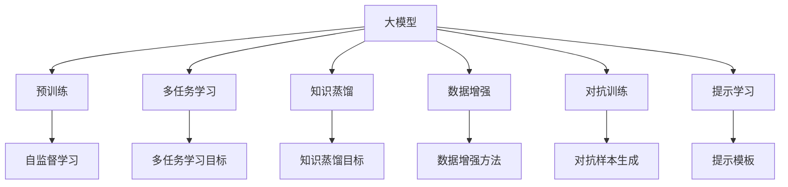
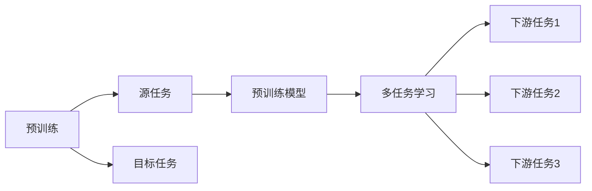
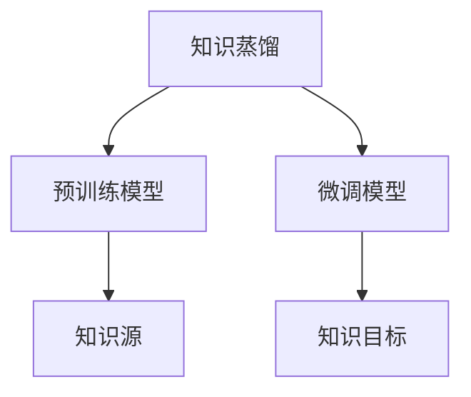
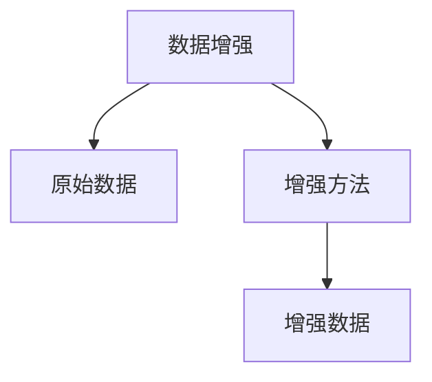
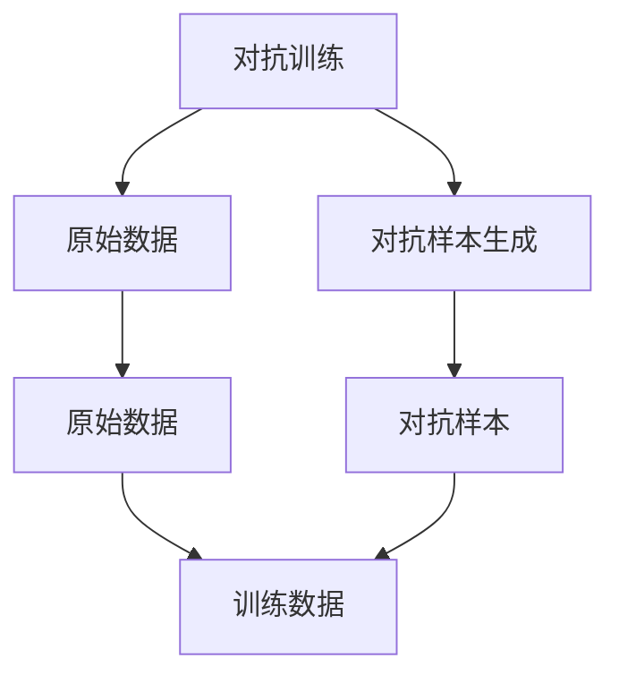
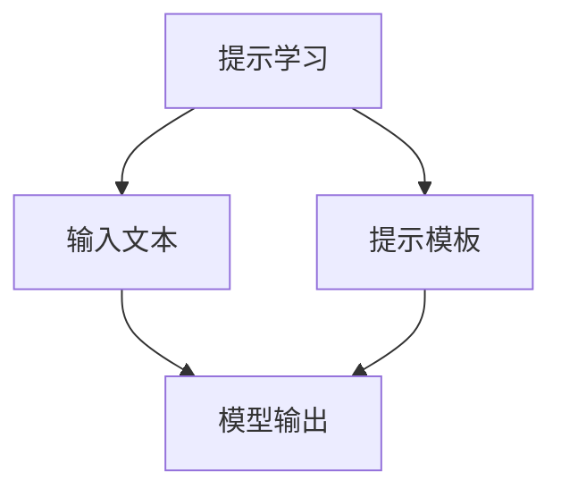
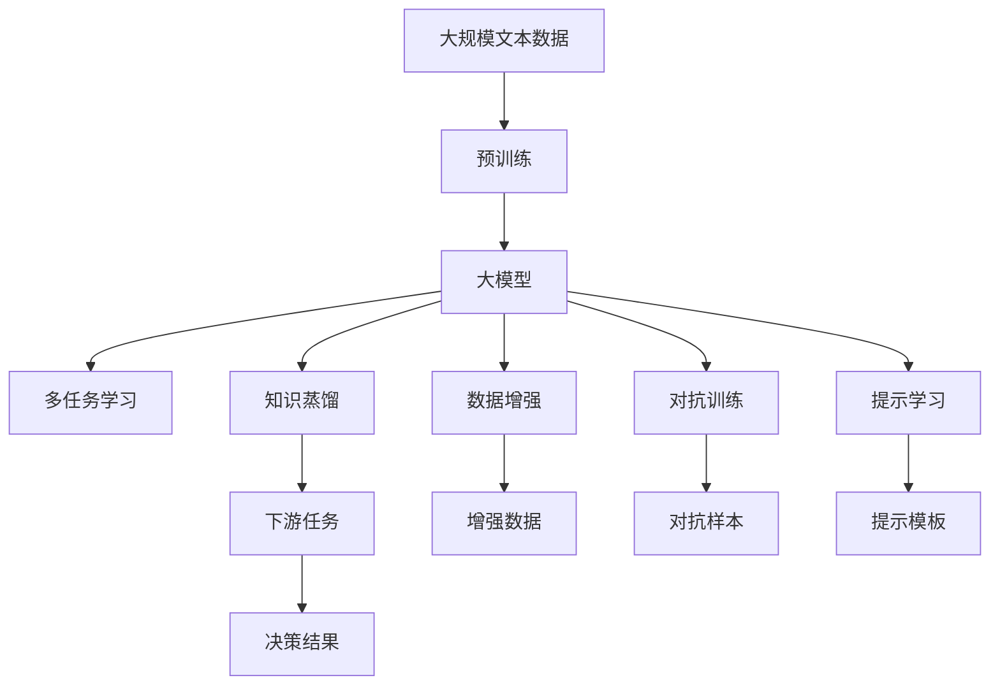

                 

# 大模型的决策支持:复杂问题的智能决策

> 关键词：大模型,决策支持,复杂问题,智能决策,算法优化,深度学习,大数据,机器学习

## 1. 背景介绍

### 1.1 问题由来
在信息爆炸的时代，决策支持系统的需求日益增长，尤其是对于复杂多变的问题，如金融风险评估、医疗诊断、供应链管理等。传统的决策支持系统依赖于规则、统计模型等，面对高度不确定性和多源异构数据时，效果有限。近年来，随着深度学习和大数据技术的发展，基于大模型的智能决策支持系统引起了广泛关注。大模型通过海量的数据预训练，学习到丰富的领域知识，能够在多领域、多模态数据上实现高效、准确的智能决策。

### 1.2 问题核心关键点
大模型的决策支持系统利用预训练的语言模型，对输入的数据进行语义理解、特征提取和模式识别，通过多任务学习、知识蒸馏等技术，实现智能决策的生成。其核心技术包括：

- 预训练语言模型：通过大规模无标签数据进行预训练，学习到丰富的领域知识。
- 多任务学习：在预训练基础上，添加多种任务，如分类、匹配、生成等，提升模型的泛化能力和实用性。
- 知识蒸馏：通过预训练模型对微调模型的知识转移，增强微调模型的性能。
- 数据增强：通过对原始数据进行变换，扩充训练集，减少过拟合风险。
- 对抗训练：引入对抗样本，增强模型鲁棒性，避免模型在测试集上的泛化能力不足。
- 提示学习：通过精心设计输入文本的格式，引导大模型按期望方式输出，实现零样本或少样本学习。

这些技术相互配合，形成了大模型在复杂问题决策支持中的强大优势。

### 1.3 问题研究意义
大模型的决策支持系统具有以下重要意义：

1. **泛化能力更强**：大模型能够学习到领域的通用知识，对于新的数据具有较强的泛化能力，减少因数据分布变化带来的影响。
2. **决策效率更高**：大模型在推理阶段可以利用高效的推理引擎，快速生成决策结果，缩短决策时间。
3. **决策精度更高**：大模型通过多任务学习等技术，能够更加全面、准确地理解问题，提升决策的准确性和可靠性。
4. **决策过程可解释**：大模型的结构透明，可以对其决策过程进行解释，帮助用户理解和信任决策结果。
5. **灵活适应性强**：大模型可以通过微调等方法，适应特定领域的需求，增强系统的实用性和可扩展性。

这些优点使得大模型在复杂问题决策支持中具有巨大的应用前景，有望改变传统决策支持系统的游戏规则。

## 2. 核心概念与联系

### 2.1 核心概念概述

为更好地理解大模型的决策支持系统，本节将介绍几个密切相关的核心概念：

- 大模型(Large Model)：以自回归模型（如GPT）或自编码模型（如BERT）为代表的大规模预训练模型。通过在大规模无标签文本语料上进行预训练，学习到丰富的领域知识。
- 预训练(Pre-training)：指在大规模无标签文本语料上，通过自监督学习任务训练通用语言模型的过程。常见的预训练任务包括掩码语言模型、下一个句子预测等。
- 多任务学习(Multi-task Learning)：在预训练模型的基础上，添加多种任务进行训练，提升模型的泛化能力和实用性。
- 知识蒸馏(Knowledge Distillation)：通过预训练模型对微调模型的知识转移，增强微调模型的性能。
- 数据增强(Data Augmentation)：通过对原始数据进行变换，扩充训练集，减少过拟合风险。
- 对抗训练(Adversarial Training)：引入对抗样本，增强模型鲁棒性，避免模型在测试集上的泛化能力不足。
- 提示学习(Prompt Learning)：通过精心设计输入文本的格式，引导大模型按期望方式输出，实现零样本或少样本学习。

这些核心概念之间的逻辑关系可以通过以下Mermaid流程图来展示：



这个流程图展示了大模型决策支持系统的核心概念及其之间的关系：

1. 大模型通过预训练获得基础能力。
2. 多任务学习和大模型结合，提升模型泛化能力。
3. 知识蒸馏使得预训练知识能够有效传递到微调模型。
4. 数据增强、对抗训练和提示学习，进一步提升模型性能。

### 2.2 概念间的关系

这些核心概念之间存在着紧密的联系，形成了大模型决策支持系统的完整生态系统。下面我们通过几个Mermaid流程图来展示这些概念之间的关系。

#### 2.2.1 大模型的学习范式


这个流程图展示了大模型决策支持系统的基本原理，以及它与多任务学习、知识蒸馏、数据增强、对抗训练和提示学习的关系。

#### 2.2.2 预训练与多任务学习的关系



这个流程图展示了预训练与多任务学习的基本原理，以及预训练模型如何通过多任务学习适配不同的下游任务。

#### 2.2.3 知识蒸馏方法



这个流程图展示了知识蒸馏的基本原理，即通过预训练模型对微调模型进行知识传递，提升微调模型的性能。

#### 2.2.4 数据增强方法



这个流程图展示了数据增强的基本原理，即通过多种方法对原始数据进行变换，扩充训练集。

#### 2.2.5 对抗训练方法



这个流程图展示了对抗训练的基本原理，即通过生成对抗样本，增强模型的鲁棒性。

#### 2.2.6 提示学习方法



这个流程图展示了提示学习的基本原理，即通过精心设计输入文本的格式，引导大模型按期望方式输出。

### 2.3 核心概念的整体架构

最后，我们用一个综合的流程图来展示这些核心概念在大模型决策支持系统中的整体架构：



这个综合流程图展示了从预训练到多任务学习、知识蒸馏、数据增强、对抗训练和提示学习，再到最终决策结果的全过程。大模型决策支持系统首先在大规模文本数据上进行预训练，然后通过多任务学习、知识蒸馏、数据增强、对抗训练和提示学习，适配不同下游任务，最终生成智能决策结果。通过这些流程图，我们可以更清晰地理解大模型决策支持系统的工作原理和优化方向。

## 3. 核心算法原理 & 具体操作步骤
### 3.1 算法原理概述

大模型的决策支持系统利用预训练的语言模型，对输入的数据进行语义理解、特征提取和模式识别，通过多任务学习、知识蒸馏等技术，实现智能决策的生成。

形式化地，假设预训练模型为 $M_{\theta}$，其中 $\theta$ 为预训练得到的模型参数。给定多个任务 $T=\{T_1, T_2, ..., T_k\}$ 的标注数据集 $\{D_i=\{(x_i, y_i)\}_{i=1}^N\}$，多任务学习的目标是最小化损失函数 $\mathcal{L}$，即：

$$
\mathcal{L}(\theta) = \frac{1}{N}\sum_{i=1}^N \sum_{j=1}^k \ell(M_{\theta}(x_i), y_i^j)
$$

其中 $\ell$ 为针对任务 $T_j$ 设计的损失函数，用于衡量模型预测输出与真实标签之间的差异。常见的损失函数包括交叉熵损失、均方误差损失等。

知识蒸馏的目标是最大化预训练模型 $M_{\theta_{pretrain}}$ 和微调模型 $M_{\theta_{fine-tune}}$ 之间的知识转移，即：

$$
\mathcal{L}_{kd} = -\sum_{x,y} p_{pretrain}(y|x) \log p_{fine-tune}(y|x)
$$

其中 $p_{pretrain}(y|x)$ 为预训练模型的预测概率分布，$p_{fine-tune}(y|x)$ 为微调模型的预测概率分布。

数据增强的目的是扩充训练集，减少过拟合风险，即通过变换原始数据生成增强数据，并用于训练。常见的数据增强方法包括回译、近义替换等。

对抗训练的目标是增强模型的鲁棒性，即通过引入对抗样本，提升模型对噪声的鲁棒性，避免模型在测试集上的泛化能力不足。常见的对抗样本生成方法包括FGSM、PGD等。

提示学习通过精心设计输入文本的格式，引导大模型按期望方式输出，实现零样本或少样本学习。常见的提示方法包括回译、改写等。

### 3.2 算法步骤详解

基于大模型的决策支持系统一般包括以下几个关键步骤：

**Step 1: 准备预训练模型和数据集**
- 选择合适的预训练语言模型 $M_{\theta}$ 作为初始化参数，如 BERT、GPT 等。
- 准备多个下游任务的标注数据集 $D=\{(x_i, y_i)\}_{i=1}^N$，其中 $x_i$ 为输入数据，$y_i$ 为标注结果。
- 划分为训练集、验证集和测试集。

**Step 2: 添加多任务学习层**
- 根据任务类型，在预训练模型顶层设计合适的输出层和损失函数。
- 对于分类任务，通常在顶层添加线性分类器和交叉熵损失函数。
- 对于生成任务，通常使用语言模型的解码器输出概率分布，并以负对数似然为损失函数。
- 使用多任务学习的方式，对模型进行训练，最小化多个任务的综合损失函数。

**Step 3: 设置微调超参数**
- 选择合适的优化算法及其参数，如 AdamW、SGD 等，设置学习率、批大小、迭代轮数等。
- 设置正则化技术及强度，包括权重衰减、Dropout、Early Stopping 等。
- 确定冻结预训练参数的策略，如仅微调顶层，或全部参数都参与微调。

**Step 4: 执行梯度训练**
- 将训练集数据分批次输入模型，前向传播计算损失函数。
- 反向传播计算参数梯度，根据设定的优化算法和学习率更新模型参数。
- 周期性在验证集上评估模型性能，根据性能指标决定是否触发 Early Stopping。
- 重复上述步骤直到满足预设的迭代轮数或 Early Stopping 条件。

**Step 5: 测试和部署**
- 在测试集上评估微调后模型 $M_{\hat{\theta}}$ 的性能，对比微调前后的精度提升。
- 使用微调后的模型对新样本进行推理预测，集成到实际的应用系统中。
- 持续收集新的数据，定期重新微调模型，以适应数据分布的变化。

以上是基于多任务学习的大模型决策支持系统的一般流程。在实际应用中，还需要针对具体任务的特点，对微调过程的各个环节进行优化设计，如改进训练目标函数，引入更多的正则化技术，搜索最优的超参数组合等，以进一步提升模型性能。

### 3.3 算法优缺点

基于大模型的决策支持系统具有以下优点：

1. **泛化能力更强**：大模型通过预训练学习到丰富的领域知识，能够适应不同的下游任务，提高模型的泛化能力。
2. **决策效率更高**：大模型在推理阶段可以利用高效的推理引擎，快速生成决策结果，缩短决策时间。
3. **决策精度更高**：大模型通过多任务学习等技术，能够更加全面、准确地理解问题，提升决策的准确性和可靠性。
4. **决策过程可解释**：大模型的结构透明，可以对其决策过程进行解释，帮助用户理解和信任决策结果。
5. **灵活适应性强**：大模型可以通过微调等方法，适应特定领域的需求，增强系统的实用性和可扩展性。

同时，该系统也存在一些局限性：

1. **依赖标注数据**：大模型需要大量高质量的标注数据进行训练，获取标注数据的成本较高。
2. **模型复杂度高**：大模型的参数量庞大，推理过程中需要消耗大量的计算资源，对硬件要求较高。
3. **对抗样本敏感**：大模型对对抗样本的鲁棒性不足，对抗训练的效果有限。
4. **可解释性不足**：大模型的决策过程复杂，难以对其内部工作机制和决策逻辑进行解释。
5. **数据隐私风险**：大模型在处理敏感数据时，需要特别注意数据隐私和安全问题。

尽管存在这些局限性，但就目前而言，基于大模型的决策支持系统仍是大规模复杂问题决策的最佳选择。未来相关研究的重点在于如何进一步降低大模型对标注数据的依赖，提高模型的少样本学习和跨领域迁移能力，同时兼顾可解释性和伦理安全性等因素。

### 3.4 算法应用领域

基于大模型的决策支持系统已经在多个领域得到了广泛应用，例如：

1. **金融风险评估**：通过对金融市场新闻、交易记录等进行语义分析，评估市场风险和投资机会。
2. **医疗诊断**：通过分析病历、影像等医学文本数据，辅助医生进行疾病诊断和治疗方案制定。
3. **供应链管理**：通过分析供应链相关文本数据，优化供应链管理决策，提高供应链效率。
4. **情感分析**：通过分析社交媒体、客户反馈等文本数据，进行情感分析和舆情监测。
5. **舆情监测**：通过分析新闻、评论等文本数据，进行舆情分析，及时发现和应对公共危机。
6. **推荐系统**：通过分析用户评论、评分等文本数据，进行推荐算法优化，提高推荐系统的个性化和准确性。

除了上述这些经典应用外，基于大模型的决策支持系统还被创新性地应用于更多场景中，如知识图谱构建、智能客服、金融舆情监测等，为NLP技术带来了全新的突破。随着预训练模型和决策支持方法的不断进步，相信NLP技术将在更广阔的应用领域大放异彩。

## 4. 数学模型和公式 & 详细讲解 & 举例说明

### 4.1 数学模型构建

本节将使用数学语言对基于多任务学习的大模型决策支持系统进行更加严格的刻画。

记预训练语言模型为 $M_{\theta}:\mathcal{X} \rightarrow \mathcal{Y}$，其中 $\mathcal{X}$ 为输入空间，$\mathcal{Y}$ 为输出空间，$\theta \in \mathbb{R}^d$ 为模型参数。假设微调任务的训练集为 $D=\{(x_i, y_i)\}_{i=1}^N, x_i \in \mathcal{X}, y_i \in \mathcal{Y}$。

定义模型 $M_{\theta}$ 在数据样本 $(x,y)$ 上的损失函数为 $\ell(M_{\theta}(x),y)$，则在数据集 $D$ 上的经验风险为：

$$
\mathcal{L}(\theta) = \frac{1}{N}\sum_{i=1}^N \ell(M_{\theta}(x_i),y_i)
$$

多任务学习的目标是最小化多个任务的综合损失函数，即：

$$
\mathcal{L}(\theta) = \frac{1}{N}\sum_{i=1}^N \sum_{j=1}^k \ell(M_{\theta}(x_i),y_i^j)
$$

其中 $k$ 为任务的个数，$\ell$ 为针对任务 $T_j$ 设计的损失函数，如交叉熵损失等。

知识蒸馏的目标是最大化预训练模型 $M_{\theta_{pretrain}}$ 和微调模型 $M_{\theta_{fine-tune}}$ 之间的知识转移，即：

$$
\mathcal{L}_{kd} = -\sum_{x,y} p_{pretrain}(y|x) \log p_{fine-tune}(y|x)
$$

其中 $p_{pretrain}(y|x)$ 为预训练模型的预测概率分布，$p_{fine-tune}(y|x)$ 为微调模型的预测概率分布。

### 4.2 公式推导过程

以下我们以二分类任务为例，推导多任务学习中的交叉熵损失函数及其梯度的计算公式。

假设模型 $M_{\theta}$ 在输入 $x$ 上的输出为 $\hat{y}=M_{\theta}(x) \in [0,1]$，表示样本属于正类的概率。真实标签 $y \in \{0,1\}$。则二分类交叉熵损失函数定义为：

$$
\ell(M_{\theta}(x),y) = -[y\log \hat{y} + (1-y)\log (1-\hat{y})]
$$

将其代入多任务学习损失函数公式，得：

$$
\mathcal{L}(\theta) = -\frac{1}{N}\sum_{i=1}^N \sum_{j=1}^k [y_i^j\log \hat{y}_i^j+(1-y_i^j)\log (1-\hat{y}_i^j)]
$$

根据链式法则，损失函数对参数 $\theta_k$ 的梯度为：

$$
\frac{\partial \mathcal{L}(\theta)}{\partial \theta_k} = -\frac{1}{N}\sum_{i=1}^N \sum_{j=1}^k (\frac{y_i^j}{\hat{y}_i^j}-\frac{1-y_i^j}{1-\hat{y}_i^j}) \frac{\partial \hat{y}_i^j}{\partial \theta_k}
$$

其中 $\frac{\partial \hat{y}_i^j}{\partial \theta_k}$ 可进一步递归展开，利用自动微分技术完成计算。

在得到损失函数的梯度后，即可带入参数更新公式，完成模型的迭代优化。重复上述过程直至收敛，最终得到适应多个下游任务的最优模型参数 $\theta^*$。

## 5. 项目实践：代码实例和详细解释说明

### 5.1 开发环境搭建

在进行决策支持系统开发前，我们需要准备好开发环境。以下是使用Python进行PyTorch开发的环境配置流程：

1. 安装Anaconda：从官网下载并安装Anaconda，用于创建独立的Python环境。

2. 创建并激活虚拟环境：
```bash
conda create -n pytorch-env python=3.8 
conda activate pytorch-env
```

3. 安装PyTorch：根据CUDA版本，从官网获取对应的安装命令。例如：
```bash
conda install pytorch torchvision torchaudio cudatoolkit=11.1 -c pytorch -c conda-forge
```

4. 安装Transformers库：
```bash
pip install transformers
```

5. 安装各类工具包：
```bash
pip install numpy pandas scikit-learn matplotlib tqdm jupyter notebook ipython
```

完成上述步骤后，即可在`pytorch-env`环境中开始决策支持系统开发。

### 5.2 源代码详细实现

这里我们以金融风险评估为例，给出使用Transformers库对BERT模型进行决策支持系统的PyTorch代码实现。

首先，定义多任务学习的数据处理函数：

```python
from transformers import BertTokenizer
from torch.utils.data import Dataset
import torch

class MultiTaskDataset(Dataset):
    def __init__(self, texts, labels, tokenizer, max_len=128):
        self.texts = texts
        self.labels = labels
        self.tokenizer = tokenizer
        self.max_len = max_len
        
    def __len__(self):
        return len(self.texts)
    
    def __getitem__(self, item):
        text = self.texts[item]
        labels = self.labels[item]
        
        encoding = self.tokenizer(text, return_tensors='pt', max_length=self.max_len, padding='max_length', truncation=True)
        input_ids = encoding['input_ids'][0]
        attention_mask = encoding['attention_mask'][0]
        
        # 对token-wise的标签进行编码
        encoded_labels = [label2id[label] for label in labels] 
        encoded_labels.extend([label2id['O']] * (self.max_len - len(encoded_labels)))
        labels = torch.tensor(encoded_labels, dtype=torch.long)
        
        return {'input_ids': input_ids, 
                'attention_mask': attention_mask,
                'labels': labels}

# 标签与id的映射
label2id = {'O': 0, 'Risk1': 1, 'Risk2': 2, 'Risk3': 3, 'Risk4': 4, 'Risk5': 5}
id2label = {v: k for k, v in label2id.items()}

# 创建dataset
tokenizer = BertTokenizer.from_pretrained('bert-base-cased')

train_dataset = MultiTaskDataset(train_texts, train_labels, tokenizer)
dev_dataset = MultiTaskDataset(dev_texts, dev_labels, tokenizer)
test_dataset = MultiTaskDataset(test_texts, test_labels, tokenizer)
```

然后，定义模型和优化器：

```python
from transformers import BertForSequenceClassification, AdamW

model = BertForSequenceClassification.from_pretrained('bert-base-cased', num_labels=len(label2id))

optimizer = AdamW(model.parameters(), lr=2e-5)
```

接着，定义训练和评估函数：

```python
from torch.utils.data import DataLoader
from tqdm import tqdm
from sklearn.metrics import classification_report

device = torch.device('cuda') if torch.cuda.is_available() else torch.device('cpu')
model.to(device)

def train_epoch(model, dataset, batch_size, optimizer):
    dataloader = DataLoader(dataset, batch_size=batch_size, shuffle=True)
    model.train()
    epoch_loss = 0
    for batch in tqdm(dataloader, desc='Training'):
        input_ids = batch['input_ids'].to(device)
        attention_mask = batch['attention_mask'].to(device)
        labels = batch['labels'].to(device)
        model.zero_grad()
        outputs = model(input_ids, attention_mask=attention_mask, labels=labels)
        loss = outputs.loss
        epoch_loss += loss.item()
        loss.backward()
        optimizer.step()
    return epoch_loss / len(dataloader)

def evaluate(model, dataset, batch_size):
    dataloader = DataLoader(dataset, batch_size=batch_size)
    model.eval()
    preds, labels = [], []
    with torch.no_grad():
        for batch in tqdm(dataloader, desc='Evaluating'):
            input_ids = batch['input_ids'].to(device)
            attention_mask = batch['attention_mask'].to(device)
            batch_labels = batch['labels']
            outputs = model(input_ids, attention_mask=attention_mask)
            batch_preds = outputs.logits.argmax(dim=2).to('cpu').tolist()
            batch_labels = batch_labels.to('cpu').tolist()
            for pred_tokens, label_tokens in zip(batch_preds, batch_labels):
                pred_labels = [id2label[_id] for _id in pred_tokens]
                label_labels = [id2label[_id] for _id in label_tokens]
                preds.append(pred_labels[:len(label_tokens)])
                labels.append(label_labels)
                
    print(classification_report(labels, preds))
```

最后，启动训练流程并在测试集上评估：

```python
epochs = 5
batch_size = 16

for epoch in range(epochs):
    loss = train_epoch(model, train_dataset,

