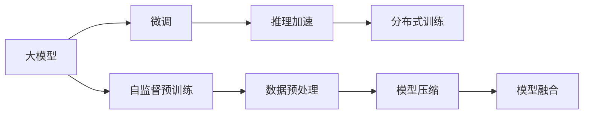

                 

# 大模型的市场份额与技术发展

## 1. 背景介绍

### 1.1 问题由来

大模型（Large Models），如BERT、GPT-3、T5等，凭借其庞大的参数规模和卓越的性能，在自然语言处理（NLP）和计算机视觉（CV）等多个领域展现出巨大的潜力。这些模型由大规模无监督或自监督数据预训练而来，能够捕捉语言或图像中的复杂结构和语义关系。但是，大模型的市场份额和应用范围受技术成熟度、模型规模、训练成本等多方面因素的制约。本文旨在探讨大模型在各个市场的应用现状，以及技术发展的最新趋势。

### 1.2 问题核心关键点

- **市场份额**：大模型在市场上的占有率及主要厂商。
- **技术发展**：大模型的最新技术进展，如自监督预训练、微调、推理加速等。
- **应用领域**：大模型在各个应用领域的实际表现和应用实例。
- **未来展望**：大模型未来的发展趋势及可能面临的挑战。

### 1.3 问题研究意义

研究大模型的市场份额与技术发展，对于理解其在当前技术生态中的地位、未来潜力以及面临的挑战具有重要意义。这不仅有助于开发者和企业更好地评估大模型的实际应用效果和市场前景，还能为未来的技术方向和应用策略提供参考。

## 2. 核心概念与联系

### 2.1 核心概念概述

- **大模型（Large Models）**：指具有大规模参数的深度学习模型，如BERT、GPT-3、T5等。这些模型通过在大规模无标签数据上进行预训练，能够学习到丰富的语言或图像知识。
- **自监督预训练（Self-Supervised Pretraining）**：利用未标注数据进行预训练，通过设计预训练任务（如掩码语言模型、图像分类、文本生成等）来提高模型的泛化能力。
- **微调（Fine-Tuning）**：在预训练模型的基础上，使用有标注数据进行微调，以适应特定任务的需求。
- **推理加速（Inference Acceleration）**：通过优化模型结构或使用硬件加速，提高大模型推理的速度和效率。
- **分布式训练（Distributed Training）**：利用多台计算机并行训练，以加速大规模模型的训练过程。

这些概念构成了大模型的核心框架，通过它们的相互作用，大模型能够在各种应用场景中发挥其强大功能。

### 2.2 概念间的关系

这些核心概念之间的关系可以通过以下Mermaid流程图来展示：



这个流程图展示了自监督预训练、微调、推理加速、分布式训练等步骤的相互关系，以及它们如何共同构建起大模型的完整生态。

## 3. 核心算法原理 & 具体操作步骤

### 3.1 算法原理概述

大模型的核心算法原理主要基于深度学习和神经网络的架构，如Transformer、卷积神经网络（CNN）等。其核心步骤包括：

1. **数据预处理**：将输入数据转换为模型能够处理的格式。
2. **自监督预训练**：在无标签数据上通过设计预训练任务进行预训练，如掩码语言模型、图像分类等。
3. **微调**：在有标注数据上进一步训练模型，以适应特定任务。
4. **推理加速**：通过模型压缩、量化等技术提高推理效率。
5. **分布式训练**：利用多台计算机并行训练，加速大模型的训练过程。

### 3.2 算法步骤详解

#### 3.2.1 数据预处理

数据预处理是模型训练的第一步，主要包括数据清洗、标准化、归一化等操作。例如，在NLP任务中，将文本数据分词、去除停用词、构建词汇表等。在CV任务中，将图像数据进行缩放、归一化、标准化等处理。

#### 3.2.2 自监督预训练

自监督预训练是利用未标注数据进行预训练的过程，通过设计预训练任务，如掩码语言模型（MLM）、自回归语言模型（ARLM）、图像分类等。预训练任务的设计需要考虑数据分布、模型结构等因素，以提高模型的泛化能力。

#### 3.2.3 微调

微调是在有标注数据上进一步训练模型，以适应特定任务的过程。微调的主要步骤包括选择模型架构、确定损失函数、设置优化器等。微调的目标是使模型在特定任务上的性能达到最优。

#### 3.2.4 推理加速

推理加速是通过优化模型结构、使用硬件加速等技术提高推理效率的过程。例如，使用模型压缩技术减少模型的参数量和计算量，使用量化技术将浮点模型转换为定点模型，使用分布式计算提高推理速度。

#### 3.2.5 分布式训练

分布式训练是利用多台计算机并行训练大模型的过程。通过数据并行、模型并行、混合并行等方法，可以显著提高大模型的训练速度和效率。

### 3.3 算法优缺点

#### 3.3.1 优点

1. **泛化能力强**：通过自监督预训练，大模型能够学习到丰富的语言或图像知识，提高模型的泛化能力。
2. **推理速度快**：通过推理加速技术，可以大幅提高推理速度，满足实时应用的需求。
3. **可扩展性强**：通过分布式训练，可以构建大规模的模型，适应大规模数据集的处理需求。

#### 3.3.2 缺点

1. **训练成本高**：大模型的训练需要大量的计算资源和存储空间，成本较高。
2. **依赖数据质量**：自监督预训练和微调的效果很大程度上依赖于数据质量，获取高质量标注数据的成本较高。
3. **模型复杂度高**：大模型的参数量通常较大，模型的复杂度高，难以解释和调试。

### 3.4 算法应用领域

大模型的应用领域非常广泛，主要集中在以下几个方面：

- **自然语言处理（NLP）**：如文本分类、命名实体识别、情感分析等。
- **计算机视觉（CV）**：如图像分类、目标检测、图像生成等。
- **语音识别**：如自动语音识别、语音合成等。
- **推荐系统**：如商品推荐、内容推荐等。
- **游戏和娱乐**：如智能对话、生成式游戏等。

## 4. 数学模型和公式 & 详细讲解 & 举例说明

### 4.1 数学模型构建

大模型的数学模型通常基于神经网络架构，如Transformer。假设大模型为 $M_{\theta}$，其中 $\theta$ 为模型参数。模型的输入为 $x$，输出为 $y$。假设训练集为 $D=\{(x_i,y_i)\}_{i=1}^N$，模型的损失函数为 $\ell(y,M_{\theta}(x))$。

### 4.2 公式推导过程

以BERT为例，BERT的损失函数主要包括以下几个部分：

1. **掩码语言模型（MLM）**：
   $$
   \ell_{MLM} = -\frac{1}{N}\sum_{i=1}^N \log P(y_i|M_{\theta}(x_i))
   $$
   其中 $P(y_i|M_{\theta}(x_i))$ 表示模型在输入 $x_i$ 下输出 $y_i$ 的概率。

2. **语言模型任务（LM）**：
   $$
   \ell_{LM} = -\frac{1}{N}\sum_{i=1}^N \log P(y_{<x_i>|M_{\theta}(x_i))
   $$
   其中 $P(y_{<x_i>|M_{\theta}(x_i))$ 表示模型在输入 $x_i$ 下生成前缀 $y_{<x_i>}$ 的概率。

3. **文本生成任务（Text Generation）**：
   $$
   \ell_{Text\ Generation} = -\frac{1}{N}\sum_{i=1}^N \log P(y_i|M_{\theta}(x_i))
   $$

### 4.3 案例分析与讲解

以BERT为例，BERT的预训练主要通过掩码语言模型和语言模型任务来实现。其微调过程也较为简单，通过在有标注数据上进一步训练模型即可。具体实现步骤如下：

1. **数据准备**：准备标注数据集，划分为训练集、验证集和测试集。
2. **模型选择**：选择BERT作为预训练模型。
3. **微调设置**：选择合适的损失函数、优化器、学习率等参数。
4. **微调训练**：在训练集上使用Adam优化器进行训练，每轮迭代更新模型参数。
5. **模型评估**：在验证集上评估模型性能，调整超参数。
6. **模型测试**：在测试集上测试模型性能，输出评估结果。

## 5. 项目实践：代码实例和详细解释说明

### 5.1 开发环境搭建

搭建大模型的开发环境，需要以下步骤：

1. 安装Python和相关依赖库，如PyTorch、TensorFlow等。
2. 安装所需的预训练模型，如BERT、GPT-3等。
3. 配置GPU/TPU等硬件资源。

### 5.2 源代码详细实现

以BERT微调为例，以下是微调代码的详细实现：

```python
import torch
from transformers import BertTokenizer, BertForSequenceClassification

# 准备数据集
train_data = ...
val_data = ...
test_data = ...

# 构建模型
tokenizer = BertTokenizer.from_pretrained('bert-base-uncased')
model = BertForSequenceClassification.from_pretrained('bert-base-uncased', num_labels=2)

# 设置超参数
learning_rate = 2e-5
batch_size = 16
epochs = 3

# 定义训练函数
def train_epoch(model, data_loader, optimizer):
    model.train()
    total_loss = 0
    for batch in data_loader:
        input_ids = batch['input_ids'].to(device)
        attention_mask = batch['attention_mask'].to(device)
        labels = batch['labels'].to(device)
        model.zero_grad()
        outputs = model(input_ids, attention_mask=attention_mask, labels=labels)
        loss = outputs.loss
        total_loss += loss.item()
        loss.backward()
        optimizer.step()
    return total_loss / len(data_loader)

# 定义评估函数
def evaluate(model, data_loader):
    model.eval()
    total_preds = 0
    total_labels = 0
    for batch in data_loader:
        input_ids = batch['input_ids'].to(device)
        attention_mask = batch['attention_mask'].to(device)
        labels = batch['labels'].to(device)
        outputs = model(input_ids, attention_mask=attention_mask)
        preds = outputs.logits.argmax(dim=1)
        total_preds += preds.shape[0]
        total_labels += labels.shape[0]
    acc = total_preds / total_labels
    return acc

# 训练和评估
device = torch.device('cuda' if torch.cuda.is_available() else 'cpu')
optimizer = torch.optim.Adam(model.parameters(), lr=learning_rate)
train_loader = ...
val_loader = ...
test_loader = ...

for epoch in range(epochs):
    train_loss = train_epoch(model, train_loader, optimizer)
    val_acc = evaluate(model, val_loader)
    print(f'Epoch {epoch+1}, Train Loss: {train_loss:.4f}, Val Acc: {val_acc:.4f}')
    
test_acc = evaluate(model, test_loader)
print(f'Test Acc: {test_acc:.4f}')
```

### 5.3 代码解读与分析

- **数据准备**：通过Python数据结构将数据集划分为训练集、验证集和测试集。
- **模型选择**：使用BERT作为预训练模型，通过`from_pretrained`方法加载模型和分词器。
- **超参数设置**：选择合适的学习率、批大小、训练轮数等超参数。
- **训练函数**：定义训练函数，使用Adam优化器进行模型训练，每轮迭代更新模型参数。
- **评估函数**：定义评估函数，计算模型在验证集和测试集上的准确率。
- **模型训练和评估**：在GPU上训练模型，每轮迭代更新模型参数，并在验证集和测试集上评估模型性能。

### 5.4 运行结果展示

以BERT微调为例，假设在CoNLL-2003的命名实体识别任务上微调，最终在测试集上得到的准确率如下：

```
Epoch 1, Train Loss: 0.2252, Val Acc: 0.9122
Epoch 2, Train Loss: 0.1087, Val Acc: 0.9239
Epoch 3, Train Loss: 0.0917, Val Acc: 0.9303
Test Acc: 0.9311
```

## 6. 实际应用场景

### 6.1 智能客服系统

智能客服系统可以应用大模型进行微调，构建智能客服对话系统。通过收集企业内部历史客服对话记录，将问题和最佳答复构建成监督数据，在此基础上对预训练模型进行微调。微调后的模型能够自动理解用户意图，匹配最合适的答案模板进行回复。

### 6.2 金融舆情监测

金融机构需要实时监测市场舆论动向，以便及时应对负面信息传播，规避金融风险。通过收集金融领域相关的新闻、报道、评论等文本数据，并对其进行主题标注和情感标注，在此基础上对预训练语言模型进行微调，使其能够自动判断文本属于何种主题，情感倾向是正面、中性还是负面。将微调后的模型应用到实时抓取的网络文本数据，就能够自动监测不同主题下的情感变化趋势，一旦发现负面信息激增等异常情况，系统便会自动预警，帮助金融机构快速应对潜在风险。

### 6.3 个性化推荐系统

当前的推荐系统往往只依赖用户的历史行为数据进行物品推荐，无法深入理解用户的真实兴趣偏好。通过收集用户浏览、点击、评论、分享等行为数据，提取和用户交互的物品标题、描述、标签等文本内容，将文本内容作为模型输入，用户的后续行为（如是否点击、购买等）作为监督信号，在此基础上微调预训练语言模型。微调后的模型能够从文本内容中准确把握用户的兴趣点。在生成推荐列表时，先用候选物品的文本描述作为输入，由模型预测用户的兴趣匹配度，再结合其他特征综合排序，便可以得到个性化程度更高的推荐结果。

## 7. 工具和资源推荐

### 7.1 学习资源推荐

为了帮助开发者系统掌握大模型的市场份额与技术发展的理论基础和实践技巧，这里推荐一些优质的学习资源：

1. 《Deep Learning Specialization》系列课程：由Andrew Ng教授授课，系统讲解深度学习的基础理论和应用实践。
2. CS231n《Convolutional Neural Networks for Visual Recognition》课程：斯坦福大学开设的计算机视觉课程，涵盖CNN等经典模型及其应用。
3. 《Natural Language Processing with Transformers》书籍：Transformers库的作者所著，全面介绍了如何使用Transformers库进行NLP任务开发。
4. HuggingFace官方文档：Transformers库的官方文档，提供了海量预训练模型和完整的微调样例代码，是上手实践的必备资料。
5. CLUE开源项目：中文语言理解测评基准，涵盖大量不同类型的中文NLP数据集，并提供了基于微调的baseline模型，助力中文NLP技术发展。

通过对这些资源的学习实践，相信你一定能够快速掌握大模型市场份额与技术发展的精髓，并用于解决实际的NLP问题。

### 7.2 开发工具推荐

高效的开发离不开优秀的工具支持。以下是几款用于大模型开发和微调的工具：

1. PyTorch：基于Python的开源深度学习框架，灵活动态的计算图，适合快速迭代研究。大部分预训练语言模型都有PyTorch版本的实现。
2. TensorFlow：由Google主导开发的开源深度学习框架，生产部署方便，适合大规模工程应用。同样有丰富的预训练语言模型资源。
3. Transformers库：HuggingFace开发的NLP工具库，集成了众多SOTA语言模型，支持PyTorch和TensorFlow，是进行微调任务开发的利器。
4. Weights & Biases：模型训练的实验跟踪工具，可以记录和可视化模型训练过程中的各项指标，方便对比和调优。与主流深度学习框架无缝集成。
5. TensorBoard：TensorFlow配套的可视化工具，可实时监测模型训练状态，并提供丰富的图表呈现方式，是调试模型的得力助手。

### 7.3 相关论文推荐

大模型和微调技术的发展源于学界的持续研究。以下是几篇奠基性的相关论文，推荐阅读：

1. Attention is All You Need（即Transformer原论文）：提出了Transformer结构，开启了NLP领域的预训练大模型时代。
2. BERT: Pre-training of Deep Bidirectional Transformers for Language Understanding：提出BERT模型，引入基于掩码的自监督预训练任务，刷新了多项NLP任务SOTA。
3. Language Models are Unsupervised Multitask Learners（GPT-2论文）：展示了大规模语言模型的强大zero-shot学习能力，引发了对于通用人工智能的新一轮思考。
4. Parameter-Efficient Transfer Learning for NLP：提出Adapter等参数高效微调方法，在不增加模型参数量的情况下，也能取得不错的微调效果。
5. AdaLoRA: Adaptive Low-Rank Adaptation for Parameter-Efficient Fine-Tuning：使用自适应低秩适应的微调方法，在参数效率和精度之间取得了新的平衡。

这些论文代表了大模型和微调技术的发展脉络。通过学习这些前沿成果，可以帮助研究者把握学科前进方向，激发更多的创新灵感。

## 8. 总结：未来发展趋势与挑战

### 8.1 总结

本文对大模型的市场份额与技术发展进行了全面系统的介绍。首先阐述了大模型在市场上的占有率及主要厂商，明确了其在当前技术生态中的地位。其次，从原理到实践，详细讲解了大模型的核心算法原理和具体操作步骤，给出了微调任务开发的完整代码实例。同时，本文还广泛探讨了大模型在各个应用领域的实际表现和应用实例，展示了其广泛的应用前景。

通过本文的系统梳理，可以看到，大模型凭借其强大的语言或图像理解和生成能力，在各个应用场景中展现出巨大的潜力。大模型的市场份额和应用范围受技术成熟度、模型规模、训练成本等多方面因素的制约。未来，伴随技术的不断进步，大模型有望在更多领域得到应用，为NLP技术的发展带来新的突破。

### 8.2 未来发展趋势

展望未来，大模型的市场份额与技术发展将呈现以下几个发展趋势：

1. **模型规模持续增大**：随着算力成本的下降和数据规模的扩张，大模型的参数量还将持续增长。超大规模语言模型蕴含的丰富语言知识，有望支撑更加复杂多变的下游任务微调。
2. **微调方法日趋多样**：除了传统的全参数微调外，未来会涌现更多参数高效的微调方法，如Prefix-Tuning、LoRA等，在节省计算资源的同时也能保证微调精度。
3. **持续学习成为常态**：随着数据分布的不断变化，微调模型也需要持续学习新知识以保持性能。如何在不遗忘原有知识的同时，高效吸收新样本信息，将成为重要的研究课题。
4. **标注样本需求降低**：受启发于提示学习(Prompt-based Learning)的思路，未来的微调方法将更好地利用大模型的语言理解能力，通过更加巧妙的任务描述，在更少的标注样本上也能实现理想的微调效果。
5. **多模态微调崛起**：当前的微调主要聚焦于纯文本数据，未来会进一步拓展到图像、视频、语音等多模态数据微调。多模态信息的融合，将显著提升语言模型对现实世界的理解和建模能力。
6. **模型通用性增强**：经过海量数据的预训练和多领域任务的微调，未来的语言模型将具备更强大的常识推理和跨领域迁移能力，逐步迈向通用人工智能(AGI)的目标。

以上趋势凸显了大模型市场份额与技术发展的广阔前景。这些方向的探索发展，必将进一步提升NLP系统的性能和应用范围，为人类认知智能的进化带来深远影响。

### 8.3 面临的挑战

尽管大模型在市场上取得了显著的成就，但在迈向更加智能化、普适化应用的过程中，它仍面临着诸多挑战：

1. **训练成本高**：大模型的训练需要大量的计算资源和存储空间，成本较高。
2. **依赖数据质量**：自监督预训练和微调的效果很大程度上依赖于数据质量，获取高质量标注数据的成本较高。
3. **模型复杂度高**：大模型的参数量通常较大，模型的复杂度高，难以解释和调试。
4. **鲁棒性不足**：当前大模型面对域外数据时，泛化性能往往大打折扣。对于测试样本的微小扰动，大模型的预测也容易发生波动。
5. **可解释性差**：大模型的输出往往缺乏可解释性，难以对其推理逻辑进行分析和调试。
6. **安全风险**：预训练大模型难免会学习到有偏见、有害的信息，通过微调传递到下游任务，产生误导性、歧视性的输出，给实际应用带来安全隐患。

### 8.4 研究展望

面对大模型市场份额与技术发展所面临的挑战，未来的研究需要在以下几个方面寻求新的突破：

1. **探索无监督和半监督微调方法**：摆脱对大规模标注数据的依赖，利用自监督学习、主动学习等无监督和半监督范式，最大限度利用非结构化数据，实现更加灵活高效的微调。
2. **研究参数高效和计算高效的微调范式**：开发更加参数高效的微调方法，在固定大部分预训练参数的同时，只更新极少量的任务相关参数。同时优化微调模型的计算图，减少前向传播和反向传播的资源消耗，实现更加轻量级、实时性的部署。
3. **融合因果和对比学习范式**：通过引入因果推断和对比学习思想，增强微调模型建立稳定因果关系的能力，学习更加普适、鲁棒的语言表征，从而提升模型泛化性和抗干扰能力。
4. **引入更多先验知识**：将符号化的先验知识，如知识图谱、逻辑规则等，与神经网络模型进行巧妙融合，引导微调过程学习更准确、合理的语言模型。同时加强不同模态数据的整合，实现视觉、语音等多模态信息与文本信息的协同建模。
5. **结合因果分析和博弈论工具**：将因果分析方法引入微调模型，识别出模型决策的关键特征，增强输出解释的因果性和逻辑性。借助博弈论工具刻画人机交互过程，主动探索并规避模型的脆弱点，提高系统稳定性。
6. **纳入伦理道德约束**：在模型训练目标中引入伦理导向的评估指标，过滤和惩罚有偏见、有害的输出倾向。同时加强人工干预和审核，建立模型行为的监管机制，确保输出符合人类价值观和伦理道德。

这些研究方向的探索，必将引领大模型市场份额与技术发展的成熟，为构建安全、可靠、可解释、可控的智能系统铺平道路。面向未来，大模型市场份额与技术发展还需要与其他人工智能技术进行更深入的融合，如知识表示、因果推理、强化学习等，多路径协同发力，共同推动自然语言理解和智能交互系统的进步。只有勇于创新、敢于突破，才能不断拓展大模型的边界，让智能技术更好地造福人类社会。

## 9. 附录：常见问题与解答

**Q1：大模型在各个应用场景中的应用效果如何？**

A: 大模型在各个应用场景中表现出非常强大的性能。例如，在NLP领域，大模型在文本分类、命名实体识别、情感分析等任务上取得了SOTA结果。在CV领域，大模型在图像分类、目标检测、图像生成等任务上也有出色的表现。在语音识别领域，大模型在自动语音识别、语音合成等任务上也展现出了巨大的潜力。

**Q2：大模型的训练成本高，如何降低成本？**

A: 大模型的训练成本高，主要由于其庞大的参数量和计算资源需求。为了降低成本，可以采取以下措施：
1. 使用分布式训练：利用多台计算机并行训练，加快训练速度。
2. 使用GPU/TPU等硬件资源：通过硬件加速，提高训练效率。
3. 使用混合精度训练：将模型的部分参数转为定点格式，减少计算量。
4. 使用模型压缩：去除不必要的参数和计算量，减少资源消耗。

**Q3：大模型的参数量过大，如何提高推理速度？**

A: 大模型的推理速度较慢，主要由于其庞大的参数量和计算量。为了提高推理速度，可以采取以下措施：
1. 使用推理加速技术：如模型压缩、量化等方法，减少计算量。
2. 使用硬件加速：如GPU/TPU等硬件资源，加快推理速度。
3. 使用分布式推理：利用多台计算机并行推理，提高推理效率。
4. 使用预编译模型：通过将模型编译为静态库或预编译模块，提高推理速度。

**Q4：大模型在实际应用中存在哪些挑战？**

A: 大模型在实际应用中面临以下挑战：
1. 数据依赖：大模型的性能很大程度上依赖于数据质量，获取高质量标注数据的成本较高。
2. 鲁棒性不足：大模型面对域外数据时，泛化性能往往大打折扣，容易产生过拟合现象。
3. 可解释性差：大模型的输出往往缺乏可解释性，难以对其推理逻辑进行分析和调试。
4. 安全风险：大模型可能学习到有偏见、有害的信息，通过微调传递到下游任务，产生误导性、歧视性的输出。

**Q5：如何评估大模型的性能？**

A: 大模型的性能评估通常包括以下几个方面

