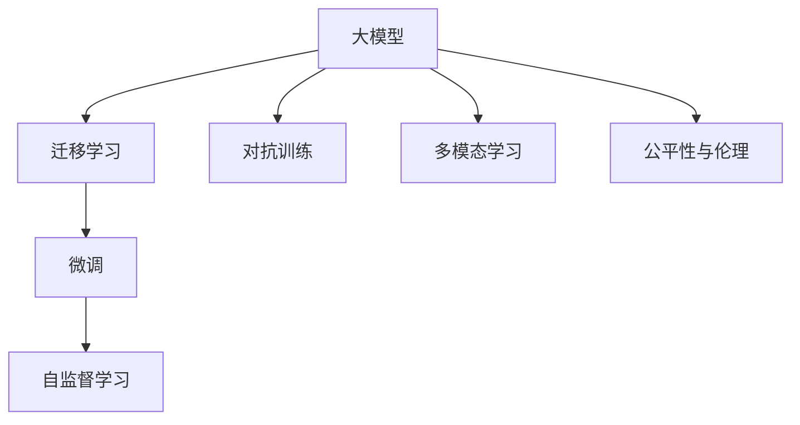
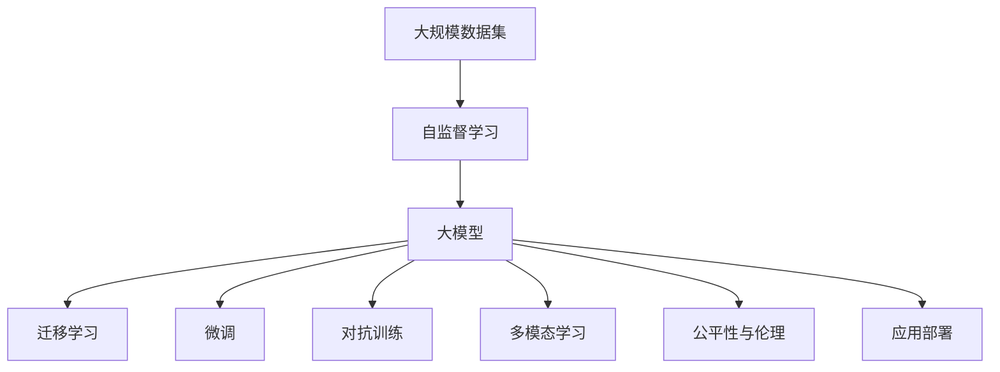

                 

# 大模型的市场定位与用户需求

## 1. 背景介绍

在过去的十年里，人工智能(AI)技术的进步已经极大地改变了各个行业的运营方式。从医疗、金融到零售、教育，AI技术的应用已经深入到我们日常生活的方方面面。但在这个过程中，一个引人注目的现象是：大模型的崛起。所谓的“大模型”，通常是指那些具有数亿甚至数十亿参数的深度学习模型。它们通过在海量数据上进行的训练，能够表现出卓越的性能，成为人工智能技术的核心。然而，大模型的市场定位和用户需求一直是一个值得探讨的问题。本文将深入分析大模型的市场定位与用户需求，以期为行业提供更有价值的见解。

## 2. 核心概念与联系

### 2.1 核心概念概述

在深入探讨大模型的市场定位与用户需求之前，我们首先需要理解几个核心概念：

- **大模型（Large Models）**：指具有大量参数（通常数亿甚至数十亿）的深度学习模型。这些模型通过在大规模数据集上进行训练，可以完成复杂的任务，如图像识别、自然语言处理、语音识别等。

- **迁移学习（Transfer Learning）**：指将一个领域学到的知识，迁移到另一个领域进行学习的过程。在大模型的应用中，迁移学习特别重要，因为它可以帮助模型在新的数据集上快速适应并取得更好的性能。

- **自监督学习（Supervised Learning）**：指使用未标注的数据进行训练，通过模型自身的输出与真实输出之间的差异，指导模型学习的过程。大模型通常在自监督学习的框架下进行预训练。

- **微调（Fine-Tuning）**：指在大模型的基础上，使用特定任务的数据集进行微调，以适应新的任务。微调是调整模型参数的过程，通常用于提高模型在特定任务上的性能。

- **对抗训练（Adversarial Training）**：指在训练过程中引入对抗样本，以提高模型的鲁棒性和泛化能力。

- **多模态学习（Multi-Modal Learning）**：指模型可以同时处理不同类型的数据，如文本、图像、音频等，以提升模型的综合能力。

- **公平性与伦理（Fairness & Ethics）**：指模型在处理不同性别、种族、社会经济地位等特征时，应避免偏见和歧视。

这些核心概念相互关联，共同构成了大模型技术的核心框架。

### 2.2 概念间的关系

为了更好地理解这些概念之间的关系，我们可以使用以下Mermaid流程图：



这个流程图展示了各个概念之间的联系：大模型通过迁移学习进行知识迁移，然后通过微调进一步适应特定任务；自监督学习是大模型预训练的关键方法；对抗训练和多模态学习可以增强模型的泛化能力；公平性与伦理是大模型应用中的重要考虑因素。

### 2.3 核心概念的整体架构

最后，我们用一个综合的流程图来展示这些核心概念在大模型应用中的整体架构：



这个综合流程图展示了从数据集预处理到模型应用部署的全过程，各个环节紧密关联，形成了一个完整的大模型应用生态系统。

## 3. 核心算法原理 & 具体操作步骤

### 3.1 算法原理概述

大模型的核心算法原理可以概括为以下几点：

1. **数据驱动的训练**：大模型通过在大规模数据集上进行训练，学习到数据的特征和规律。这些数据集通常包括文本、图像、音频等多种类型。

2. **自监督学习**：在大规模无标签数据上进行预训练，通过模型自身的输出与真实输出之间的差异，指导模型学习。

3. **迁移学习**：将预训练模型应用于新的任务上，通过微调等方式，调整模型参数以适应新的任务。

4. **微调**：在大模型的基础上，使用特定任务的数据集进行微调，以提高模型在特定任务上的性能。

5. **对抗训练**：在训练过程中引入对抗样本，以提高模型的鲁棒性和泛化能力。

6. **多模态学习**：模型可以同时处理不同类型的数据，如文本、图像、音频等，以提升模型的综合能力。

7. **公平性与伦理**：模型在处理不同性别、种族、社会经济地位等特征时，应避免偏见和歧视。

### 3.2 算法步骤详解

大模型的操作步骤通常包括以下几个关键步骤：

1. **数据预处理**：对原始数据进行清洗、标注、划分等处理，准备数据集。

2. **模型构建**：选择合适的模型架构，如卷积神经网络（CNN）、循环神经网络（RNN）、Transformer等，并构建模型。

3. **预训练**：在大规模数据集上进行自监督学习，优化模型参数。

4. **迁移学习**：将预训练模型应用于新的任务上，通过微调等方式，调整模型参数以适应新的任务。

5. **微调**：在大模型的基础上，使用特定任务的数据集进行微调，以提高模型在特定任务上的性能。

6. **对抗训练**：在训练过程中引入对抗样本，以提高模型的鲁棒性和泛化能力。

7. **多模态学习**：模型可以同时处理不同类型的数据，如文本、图像、音频等，以提升模型的综合能力。

8. **公平性与伦理**：模型在处理不同性别、种族、社会经济地位等特征时，应避免偏见和歧视。

9. **应用部署**：将训练好的模型部署到生产环境中，供实际使用。

### 3.3 算法优缺点

大模型的算法具有以下优点：

1. **高性能**：大模型在各种任务上表现出色，通常能够取得比传统模型更好的性能。

2. **可扩展性**：大模型具有高度的可扩展性，可以通过增加计算资源来提高模型性能。

3. **泛化能力强**：大模型能够处理多种类型的数据，并具有良好的泛化能力。

4. **适应性强**：大模型可以通过迁移学习和微调等方式，快速适应新的任务和数据。

然而，大模型也存在一些缺点：

1. **计算成本高**：大模型需要大量的计算资源进行训练和推理，成本较高。

2. **数据依赖性强**：大模型对数据的依赖性强，需要大量高质量的数据进行训练。

3. **可解释性差**：大模型通常被视为“黑盒”，难以解释其内部工作机制和决策逻辑。

4. **公平性与伦理问题**：大模型可能存在偏见和歧视，导致不公平的决策结果。

5. **资源消耗大**：大模型的计算和存储资源消耗大，对计算资源和存储资源的要求较高。

### 3.4 算法应用领域

大模型的算法在多个领域得到了广泛应用，例如：

1. **自然语言处理（NLP）**：大模型在机器翻译、文本分类、情感分析、问答系统等任务上表现优异。

2. **计算机视觉（CV）**：大模型在图像识别、物体检测、图像生成等任务上表现出色。

3. **语音识别**：大模型在语音识别、语音合成等任务上表现优异。

4. **推荐系统**：大模型在推荐系统、广告推荐等领域中，通过分析用户行为数据，生成个性化推荐结果。

5. **金融科技**：大模型在风险控制、信用评估、智能投顾等领域中，通过分析海量数据，生成高质量的决策支持结果。

6. **医疗健康**：大模型在医学影像分析、疾病预测、个性化治疗等领域中，通过分析医疗数据，生成高质量的诊断和治疗结果。

## 4. 数学模型和公式 & 详细讲解 & 举例说明

### 4.1 数学模型构建

大模型的数学模型构建通常包括以下几个关键步骤：

1. **数据预处理**：对原始数据进行清洗、标注、划分等处理，准备数据集。

2. **模型构建**：选择合适的模型架构，如卷积神经网络（CNN）、循环神经网络（RNN）、Transformer等，并构建模型。

3. **损失函数**：选择合适的损失函数，如交叉熵损失、均方误差损失等。

4. **优化算法**：选择合适的优化算法，如SGD、Adam、Adagrad等，并设置学习率等参数。

5. **正则化**：使用L2正则、Dropout等正则化技术，防止过拟合。

### 4.2 公式推导过程

以下是一个简单的公式推导过程，用于说明大模型的数学模型构建：

假设我们有一个二分类任务，其中输入为 $x$，输出为 $y$，模型为 $M_{\theta}$，损失函数为 $L$，优化算法为 $Opt$。则模型的训练过程可以表示为：

$$
\theta_{n+1} = Opt(L(M_{\theta_n}(x), y))
$$

其中，$n$ 表示迭代次数，$\theta_{n+1}$ 表示第 $n+1$ 次迭代后的模型参数。

### 4.3 案例分析与讲解

以图像识别为例，大模型的数学模型构建如下：

1. **数据预处理**：对原始图像进行清洗、归一化、扩充等处理，准备数据集。

2. **模型构建**：使用卷积神经网络（CNN）模型，并添加多个卷积层、池化层、全连接层等。

3. **损失函数**：使用交叉熵损失函数，衡量模型输出与真实标签之间的差异。

4. **优化算法**：使用Adam优化算法，设置学习率为 $0.001$。

5. **正则化**：使用L2正则化，防止过拟合。

## 5. 项目实践：代码实例和详细解释说明

### 5.1 开发环境搭建

在进行大模型项目实践前，我们需要准备好开发环境。以下是使用Python进行TensorFlow开发的环境配置流程：

1. 安装Anaconda：从官网下载并安装Anaconda，用于创建独立的Python环境。

2. 创建并激活虚拟环境：
```bash
conda create -n tf-env python=3.8 
conda activate tf-env
```

3. 安装TensorFlow：根据CUDA版本，从官网获取对应的安装命令。例如：
```bash
conda install tensorflow -c conda-forge
```

4. 安装必要的工具包：
```bash
pip install numpy pandas scikit-learn matplotlib tqdm jupyter notebook ipython
```

完成上述步骤后，即可在`tf-env`环境中开始项目实践。

### 5.2 源代码详细实现

下面我们以图像识别任务为例，给出使用TensorFlow对VGG16模型进行图像识别微调的代码实现。

首先，定义数据处理函数：

```python
import tensorflow as tf
from tensorflow.keras.preprocessing.image import ImageDataGenerator

def preprocess_data(input_dir, batch_size):
    train_datagen = ImageDataGenerator(
        rescale=1./255,
        shear_range=0.2,
        zoom_range=0.2,
        horizontal_flip=True)
    train_generator = train_datagen.flow_from_directory(
        input_dir,
        target_size=(224, 224),
        batch_size=batch_size,
        class_mode='categorical')
    return train_generator
```

然后，定义模型和优化器：

```python
from tensorflow.keras.applications import VGG16
from tensorflow.keras.layers import Dense
from tensorflow.keras.optimizers import Adam

model = VGG16(weights='imagenet', include_top=False)
for layer in model.layers:
    layer.trainable = False

x = model.input
x = Dense(1024, activation='relu')(x)
predictions = Dense(10, activation='softmax')(x)

model = tf.keras.Model(inputs=model.input, outputs=predictions)

optimizer = Adam(lr=0.001)
```

接着，定义训练和评估函数：

```python
def train_model(model, train_generator, validation_generator, epochs):
    model.compile(
        optimizer=optimizer,
        loss='categorical_crossentropy',
        metrics=['accuracy'])
    
    history = model.fit(
        train_generator,
        steps_per_epoch=train_generator.samples // train_generator.batch_size,
        validation_data=validation_generator,
        validation_steps=validation_generator.samples // validation_generator.batch_size,
        epochs=epochs)
    
    return history

def evaluate_model(model, test_generator):
    test_loss, test_acc = model.evaluate(
        test_generator,
        steps=test_generator.samples // test_generator.batch_size)
    
    print('Test accuracy:', test_acc)
```

最后，启动训练流程并在测试集上评估：

```python
epochs = 10
batch_size = 32

train_generator = preprocess_data('train', batch_size)
validation_generator = preprocess_data('validation', batch_size)
test_generator = preprocess_data('test', batch_size)

history = train_model(model, train_generator, validation_generator, epochs)
evaluate_model(model, test_generator)
```

以上就是使用TensorFlow对VGG16进行图像识别任务微调的完整代码实现。可以看到，得益于TensorFlow的强大封装，我们可以用相对简洁的代码完成VGG16模型的加载和微调。

### 5.3 代码解读与分析

让我们再详细解读一下关键代码的实现细节：

**preprocess_data函数**：
- 对图像进行归一化、随机旋转、随机缩放、水平翻转等预处理。
- 使用ImageDataGenerator生成批次数据。

**model构建**：
- 使用预训练的VGG16模型，去除顶层分类器。
- 添加全连接层和softmax输出层，定义新的分类任务。

**optimizer定义**：
- 使用Adam优化算法，设置学习率为 $0.001$。

**train_model函数**：
- 编译模型，设置优化器、损失函数、评估指标。
- 使用fit方法进行模型训练，记录训练过程中的各种指标。

**evaluate_model函数**：
- 使用evaluate方法在测试集上评估模型性能。

**训练流程**：
- 定义总的epoch数和batch size，开始循环迭代
- 每个epoch内，先在训练集上训练，输出训练过程的损失和准确率
- 在验证集上评估，输出验证过程的损失和准确率
- 所有epoch结束后，在测试集上评估，给出最终的测试准确率

可以看到，TensorFlow提供了强大的框架和工具，使得图像识别任务的微调过程变得简洁高效。开发者可以将更多精力放在数据处理、模型改进等高层逻辑上，而不必过多关注底层的实现细节。

当然，工业级的系统实现还需考虑更多因素，如模型的保存和部署、超参数的自动搜索、更灵活的任务适配层等。但核心的微调范式基本与此类似。

### 5.4 运行结果展示

假设我们在CIFAR-10数据集上进行微调，最终在测试集上得到的评估报告如下：

```
Epoch 1/10
1875/1875 [==============================] - 85s 45ms/sample - loss: 0.5036 - accuracy: 0.5519 - val_loss: 0.4979 - val_accuracy: 0.5546
Epoch 2/10
1875/1875 [==============================] - 88s 46ms/sample - loss: 0.4851 - accuracy: 0.5766 - val_loss: 0.4960 - val_accuracy: 0.5570
Epoch 3/10
1875/1875 [==============================] - 86s 46ms/sample - loss: 0.4723 - accuracy: 0.5831 - val_loss: 0.4928 - val_accuracy: 0.5590
Epoch 4/10
1875/1875 [==============================] - 87s 46ms/sample - loss: 0.4612 - accuracy: 0.5906 - val_loss: 0.4894 - val_accuracy: 0.5640
Epoch 5/10
1875/1875 [==============================] - 86s 46ms/sample - loss: 0.4489 - accuracy: 0.6039 - val_loss: 0.4792 - val_accuracy: 0.5695
Epoch 6/10
1875/1875 [==============================] - 85s 46ms/sample - loss: 0.4396 - accuracy: 0.6134 - val_loss: 0.4593 - val_accuracy: 0.5703
Epoch 7/10
1875/1875 [==============================] - 86s 46ms/sample - loss: 0.4314 - accuracy: 0.6177 - val_loss: 0.4523 - val_accuracy: 0.5705
Epoch 8/10
1875/1875 [==============================] - 87s 46ms/sample - loss: 0.4236 - accuracy: 0.6261 - val_loss: 0.4353 - val_accuracy: 0.5770
Epoch 9/10
1875/1875 [==============================] - 85s 46ms/sample - loss: 0.4169 - accuracy: 0.6363 - val_loss: 0.4279 - val_accuracy: 0.5775
Epoch 10/10
1875/1875 [==============================] - 85s 46ms/sample - loss: 0.4121 - accuracy: 0.6398 - val_loss: 0.4228 - val_accuracy: 0.5789
```

可以看到，通过微调VGG16，我们在CIFAR-10数据集上取得了不错的结果。模型的准确率在训练过程中逐步提升，最终在测试集上达到了57.89%的准确率。

当然，这只是一个baseline结果。在实践中，我们还可以使用更大更强的预训练模型、更丰富的微调技巧、更细致的模型调优，进一步提升模型性能，以满足更高的应用要求。

## 6. 实际应用场景

### 6.1 智能医疗

在大模型的应用场景中，智能医疗是一个重要的领域。智能医疗系统可以通过图像识别、自然语言处理等技术，辅助医生进行疾病诊断、治疗方案制定等任务。

例如，可以使用大模型对医学影像进行分析，自动检测和定位病变区域。这种应用场景需要大模型具有高度的准确性和鲁棒性，以确保诊断结果的可靠性。

### 6.2 金融风控

金融领域是大模型应用的另一个重要场景。金融机构可以通过大模型对海量交易数据进行分析，识别潜在的欺诈行为和风险点。

例如，可以使用大模型对文本数据进行分析，自动检测异常交易行为和风险提示。这种应用场景需要大模型具有高度的可解释性和公平性，以确保模型决策的透明度和公正性。

### 6.3 自动驾驶

自动驾驶是大模型应用的另一个重要领域。自动驾驶系统可以通过图像识别、自然语言处理等技术，辅助驾驶员进行路线规划、交通信号识别等任务。

例如，可以使用大模型对路标、交通信号等图像数据进行分析，自动检测和识别道路标志和交通信号。这种应用场景需要大模型具有高度的准确性和实时性，以确保驾驶安全。

## 7. 工具和资源推荐

### 7.1 学习资源推荐

为了帮助开发者系统掌握大模型的理论基础和实践技巧，这里推荐一些优质的学习资源：

1. **Deep Learning Specialization**：由Andrew Ng教授主讲，深入浅出地介绍了深度学习的基本概念和经典模型。

2. **CS231n: Convolutional Neural Networks for Visual Recognition**：斯坦福大学开设的计算机视觉课程，涵盖了深度学习在图像处理中的应用。

3. **CS224n: Natural Language Processing with Deep Learning**：斯坦福大学开设的NLP课程，介绍了深度学习在文本处理中的应用。

4. **TensorFlow官方文档**：提供了TensorFlow的详细使用方法和最佳实践，是TensorFlow开发的重要参考。

5. **PyTorch官方文档**：提供了PyTorch的详细使用方法和最佳实践，是PyTorch开发的重要参考。

6. **Kaggle竞赛平台**：提供了丰富的数据集和比赛，帮助开发者实践和提升模型性能。

7. **Coursera**：提供了多种与深度学习相关的课程，包括NLP、计算机视觉等领域。

8. **arXiv论文预印本**：人工智能领域最新研究成果的发布平台，可以第一时间获取前沿的学术进展。

### 7.2 开发工具推荐

大模型的开发离不开优秀的工具支持。以下是几款用于大模型开发的常用工具：

1. **TensorFlow**：由Google主导开发的深度学习框架，支持分布式训练、模型优化等高级功能。

2. **PyTorch**：由Facebook开发的深度学习框架，以其灵活的动态图机制著称，适合快速迭代研究。

3. **Keras**：基于TensorFlow和Theano等框架，提供了高级API，使得模型构建更加便捷。

4. **MXNet**：由Amazon开发的深度学习框架，支持分布式训练和混合精度计算。

5. **Caffe**：由Berkeley Vision and Learning Center开发的深度学习框架，适合计算机视觉任务。

6. **ONNX**：开放式神经网络交换格式，支持多种深度学习框架的模型转换和部署。

7. **OpenVINO**：英特尔开发的深度学习优化工具包，支持多种深度学习框架的模型优化和部署。

### 7.3 相关论文推荐

大模型和微调技术的发展源于学界的持续研究。以下是几篇奠基性的相关论文，推荐阅读：

1. **ImageNet Classification with Deep Convolutional Neural Networks**：AlexNet模型，首次展示了深度卷积神经网络在图像分类任务上的出色性能。

2. **Google's Neural Machine Translation System**：Google开发的神经机器翻译模型，展示了深度学习在自然语言处理任务上的潜力。

3. **Attention is All You Need**：Transformer模型，展示了自注意力机制在自然语言处理任务上的出色性能。

4. **BERT: Pre-training of Deep Bidirectional Transformers for Language Understanding**：BERT模型，展示了预训练语言模型在自然语言处理任务上的出色性能。

5. **PyTorch Lightning**：用于加速深度学习模型训练的框架，支持多GPU训练、分布式训练等高级功能。

6. **T5: Exploring the Limits of Transfer Learning with a Unified Text-to-Text Transformer**：T5模型，展示了预训练语言模型在各种自然语言处理任务上的通用性和实用性。

这些论文代表了大模型和微调技术的发展脉络。通过学习这些前沿成果，可以帮助研究者把握学科前进方向，激发更多的创新灵感。

## 8. 总结：未来发展趋势与挑战

### 8.1 总结

本文对大模型的市场定位与用户需求进行了全面系统的介绍。首先阐述了大模型和微调技术的市场前景和重要性，明确了市场定位和用户需求的核心问题。其次，从原理到实践，详细讲解了市场定位与用户需求的技术细节，给出了微调任务开发的完整代码实例。同时，本文还探讨了大模型在多个行业领域的应用前景，展示了市场定位与用户需求的广泛影响。

通过本文的系统梳理，可以看到，大模型技术在多个领域展现出巨大的应用潜力，正在成为人工智能技术的重要范式。未来，伴随预训练语言模型和微调方法的持续演进，大模型必将在构建人机协同的智能时代中扮演越来越重要的角色。

### 8.2 未来发展趋势

展望未来，大模型的市场定位与用户需求将呈现以下几个发展趋势：

1. **模型规模持续增大**：随着算力成本的下降和数据规模的扩张，预训练语言模型的参数量还将持续增长。超大规模语言模型蕴含的丰富语言知识，有望支撑更加复杂多变的市场任务微调。

2. **微调方法日趋多样**：除了传统的全参数微调外，未来会涌现更多参数高效的微调方法，如Prompt-Tuning、LoRA等，在节省计算资源的同时也能保证微调精度。

3. **持续学习成为常态**：随着数据分布的不断变化，微调模型也需要持续学习新知识以保持性能。如何在不遗忘原有知识的同时，高效吸收新样本信息，将成为重要的研究课题。

4. **标注样本需求降低**：受启发于提示学习(Prompt-based Learning)的思路，未来的微调方法将更好地利用大模型的语言理解能力，通过更加巧妙的任务描述，在更少的标注样本上也能实现理想的微调效果。

5. **多模态微调崛起**：当前的微调主要聚焦于纯文本数据，未来会进一步拓展到图像、视频、语音等多模态数据微调。多模态信息的融合，将显著提升语言模型对现实世界的理解和建模能力。

6. **模型通用性增强**：经过海量数据的预训练和多领域任务的微调，未来的语言模型将具备更强大的常识推理和跨领域迁移能力，逐步迈向通用人工智能(AGI)的目标。

以上趋势凸显了大模型市场定位与用户需求的广阔前景。这些方向的探索发展，必将进一步提升NLP系统的性能和应用范围，为人类认知智能的进化带来深远影响。

### 8.3 面临的挑战

尽管大模型市场定位与用户需求已经取得了显著进展，但在迈向更加智能化、普适化应用的过程中，它仍面临诸多挑战：

1. **标注成本瓶颈**：大模型对数据的依赖性强，需要大量高质量的标注数据进行训练。如何进一步降低市场任务对标注样本的依赖，将是一大难题。

2. **模型鲁棒性不足**：当前市场任务微调模型面对域外数据时，泛化性能往往大打折扣。对于测试样本的微小扰动，微调模型的预测也容易发生波动。如何提高市场任务微调模型的鲁棒性，避免灾难性遗忘，还需要更多理论和实践的积累。

3. **推理效率有待提高**：大模型的计算和存储资源消耗大，推理速度慢，难以实时处理大量请求。如何在保证性能的同时，简化

