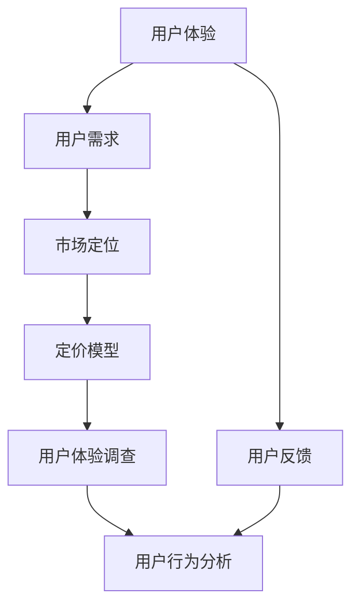

                 

# 大模型的用户体验与市场定位

> 关键词：大模型,用户体验,市场定位,用户体验调查,用户反馈,用户行为分析,市场策略,定价模型

## 1. 背景介绍

### 1.1 问题由来

随着人工智能技术的飞速发展，大模型（Large Model）在各个领域的应用日益广泛，如自然语言处理、计算机视觉、推荐系统等。这些大模型通常拥有海量的参数和复杂的结构，能够在处理大规模数据时表现出色，但在实际应用中，用户体验和市场定位常常成为制约其推广的关键因素。如何提升大模型的用户体验，并准确定位市场，是当前面临的重要问题。

### 1.2 问题核心关键点

大模型的用户体验主要体现在易用性、性能、稳定性等方面，而市场定位则涉及产品特性、目标用户、竞争策略等。提升用户体验和准确定位市场，需要综合考虑技术、设计、营销等多方面的因素，找到平衡点，确保产品在用户心中占有重要位置。

### 1.3 问题研究意义

优化用户体验和准确市场定位，对于大模型的商业化应用具有重要意义：

1. 提升用户满意度。良好的用户体验能够使用户更愿意使用产品，增加用户粘性，提高用户留存率。
2. 增强竞争力。准确的定位可以明确产品的市场方向，避免盲目竞争，提升产品的市场占有率。
3. 提高收益。通过用户反馈调整产品策略，可以实现产品的高效迭代，从而提升商业收益。
4. 扩大应用场景。精准的市场定位可以打开新市场，拓展应用领域，增加收入来源。
5. 增强品牌影响力。优质的用户体验和清晰的市场定位，有助于提升品牌知名度和美誉度。

## 2. 核心概念与联系

### 2.1 核心概念概述

为更好地理解大模型的用户体验与市场定位，本节将介绍几个密切相关的核心概念：

- 用户体验(User Experience, UX)：用户在使用产品过程中所感受到的整体体验，包括易用性、功能、性能、稳定性、设计美感和用户情感等多个维度。
- 用户需求(User Needs)：用户在使用产品时所期望的功能和特性，通常通过问卷调查、用户访谈等方式获取。
- 用户反馈(User Feedback)：用户在使用产品过程中提出的意见和建议，是产品改进的重要依据。
- 市场定位(Market Positioning)：产品在市场中的定位，通常包括目标用户、产品特性、竞争优势等。
- 定价模型(Pricing Model)：产品价格制定的模型，通常考虑成本、市场需求、竞争策略等因素。
- 用户体验调查(User Experience Survey)：通过问卷调查等形式，收集用户对产品各个方面的评价。
- 用户行为分析(User Behavior Analysis)：通过数据分析等技术，了解用户的使用习惯和行为模式。

这些核心概念之间存在着紧密的联系，共同构成了大模型用户体验与市场定位的完整框架。

### 2.2 概念间的关系

这些核心概念之间存在着复杂的联系，我们可以通过以下Mermaid流程图来展示：



这个流程图展示了大模型的用户体验与市场定位各个要素之间的联系：

1. 用户体验基于用户需求，通过用户反馈不断优化。
2. 市场定位基于用户需求和用户体验，制定合理的产品特性和竞争策略。
3. 定价模型基于市场定位，考虑用户体验和成本等因素。
4. 用户体验调查和用户行为分析，提供用户体验和用户需求的数据支持。

## 3. 核心算法原理 & 具体操作步骤
### 3.1 算法原理概述

优化用户体验和准确定位市场，通常需要采用多种方法。本节将重点介绍几种常见的方法及其算法原理。

### 3.2 算法步骤详解

**Step 1: 进行用户体验调查**

- 设计问卷，涵盖产品的易用性、性能、稳定性、设计美感等多个维度。
- 分发问卷，收集用户反馈，分析数据。

**Step 2: 分析用户需求**

- 通过问卷、用户访谈等方式，了解用户的需求和期望。
- 对数据进行聚类分析，找出用户的主要需求和痛点。

**Step 3: 设计用户界面(UI)和用户体验(UX)**

- 根据用户需求设计合理的用户界面，保证操作简便、直观。
- 优化用户体验，如减少加载时间、增加反馈提示等。

**Step 4: 实施用户行为分析**

- 收集用户行为数据，如使用频率、操作步骤等。
- 分析数据，找出常见的操作路径和异常行为。

**Step 5: 优化市场定位**

- 根据用户需求和行为分析结果，确定目标用户和产品特性。
- 分析市场竞争环境，制定差异化策略。

**Step 6: 制定定价模型**

- 根据产品成本、市场需求、竞争策略等因素，制定合理的价格。
- 考虑用户的接受度和市场反应，进行动态调整。

### 3.3 算法优缺点

**优点**：
1. 综合考虑用户需求和技术实现，提升产品竞争力。
2. 通过数据驱动的方式，减少主观判断，提升决策的科学性和准确性。
3. 用户反馈能够帮助快速迭代，提升产品体验。

**缺点**：
1. 数据获取和分析过程较为复杂，需要耗费大量时间和资源。
2. 用户行为分析存在隐私和安全风险，需要采取严格的数据保护措施。
3. 用户需求和市场变化迅速，需要不断调整策略。

### 3.4 算法应用领域

大模型的用户体验与市场定位方法，已经在多个领域得到应用，例如：

- 自然语言处理领域：优化聊天机器人的交互体验，提升自然语言理解和生成能力。
- 计算机视觉领域：改进图像识别和标注工具的用户体验，提升视觉识别的准确性和易用性。
- 推荐系统领域：优化推荐算法，提升用户推荐体验，增加用户粘性。
- 金融领域：改善金融产品的用户体验，提升用户对产品的信任度和满意度。
- 医疗领域：优化医疗应用的易用性和准确性，提升医生和患者的使用体验。
- 教育领域：提升在线教育平台的用户体验，增加用户的互动和参与度。

## 4. 数学模型和公式 & 详细讲解 & 举例说明

### 4.1 数学模型构建

本节将使用数学语言对用户体验调查和用户行为分析进行更严格的刻画。

假设我们有一个大模型产品 $P$，其用户体验调查结果为 $U$，用户需求为 $D$，用户行为数据为 $B$，市场定位为 $M$，定价模型为 $P$。

定义用户体验调查的平均得分为 $\overline{U}$，用户需求的优先级为 $w_D$，用户行为数据的特征向量为 $v_B$，市场定位的维度向量为 $v_M$，定价模型的系数向量为 $v_P$。

则用户体验调查和用户行为分析的数学模型为：

$$
\overline{U} = \sum_{i=1}^{n} u_i x_i
$$

其中 $u_i$ 为问卷中第 $i$ 个问题的权重，$x_i$ 为用户对第 $i$ 个问题的评分。

用户需求和用户体验的线性关系为：

$$
U = \overline{U} \cdot w_D + \epsilon
$$

其中 $\epsilon$ 为随机误差项。

用户行为数据的线性关系为：

$$
v_B = \alpha v_M + \beta v_P + \gamma
$$

其中 $\alpha, \beta, \gamma$ 为系数向量。

市场定位的维度向量 $v_M$ 可表示为：

$$
v_M = (m_{i1}, m_{i2}, ..., m_{in})
$$

其中 $m_{ij}$ 为第 $i$ 个维度的市场定位向量。

定价模型的系数向量 $v_P$ 可表示为：

$$
v_P = (p_{i1}, p_{i2}, ..., p_{in})
$$

其中 $p_{ij}$ 为第 $i$ 个维度的定价模型系数。

### 4.2 公式推导过程

以用户行为分析为例，我们推导其数学模型和公式。

假设用户行为数据 $B$ 包含 $n$ 个特征，每个特征的权重为 $w_B$。则用户行为数据的线性关系可表示为：

$$
v_B = \sum_{i=1}^{n} w_B x_i
$$

其中 $x_i$ 为用户行为数据中第 $i$ 个特征的值。

根据上述公式，我们可以得到用户行为数据与市场定位和定价模型的关系：

$$
v_B = \alpha v_M + \beta v_P + \gamma
$$

其中 $\alpha, \beta, \gamma$ 为系数向量，$v_M$ 和 $v_P$ 分别为市场定位和定价模型的系数向量。

### 4.3 案例分析与讲解

假设我们正在开发一个推荐系统，需要优化用户体验和市场定位。我们可以通过以下步骤来进行：

**Step 1: 进行用户体验调查**

设计问卷，涵盖推荐系统的易用性、准确性、推荐速度等多个维度，通过用户反馈了解用户的实际体验。

**Step 2: 分析用户需求**

收集用户需求数据，如用户希望推荐的商品类型、推荐的准确性和多样性等。通过聚类分析，找出用户的主要需求和痛点。

**Step 3: 设计用户界面(UI)和用户体验(UX)**

根据用户需求设计合理的推荐算法和用户界面，保证操作简便、直观。

**Step 4: 实施用户行为分析**

收集用户行为数据，如用户点击、浏览、购买等行为，分析数据，找出常见的操作路径和异常行为。

**Step 5: 优化市场定位**

根据用户需求和行为分析结果，确定目标用户和产品特性。分析市场竞争环境，制定差异化策略。

**Step 6: 制定定价模型**

根据产品成本、市场需求、竞争策略等因素，制定合理的价格。考虑用户的接受度和市场反应，进行动态调整。

## 5. 项目实践：代码实例和详细解释说明
### 5.1 开发环境搭建

在进行用户体验与市场定位实践前，我们需要准备好开发环境。以下是使用Python进行数据分析和机器学习实践的环境配置流程：

1. 安装Anaconda：从官网下载并安装Anaconda，用于创建独立的Python环境。

2. 创建并激活虚拟环境：
```bash
conda create -n data-env python=3.8 
conda activate data-env
```

3. 安装Python包：
```bash
pip install numpy pandas scikit-learn statsmodels matplotlib seaborn plotly jupyter notebook ipython
```

4. 安装R语言：
```bash
conda install r-essentials
```

完成上述步骤后，即可在`data-env`环境中开始用户体验与市场定位的实践。

### 5.2 源代码详细实现

下面我们以推荐系统为例，给出使用Python进行用户体验与市场定位的代码实现。

首先，定义用户体验调查问卷和用户行为数据：

```python
import pandas as pd
import numpy as np

# 用户体验调查问卷
user_survey = pd.DataFrame({
    '易用性': [4, 3, 4, 5, 4],
    '准确性': [3, 4, 2, 5, 4],
    '推荐速度': [4, 4, 5, 2, 3]
})

# 用户行为数据
user_behavior = pd.DataFrame({
    '点击次数': [100, 200, 300, 400, 500],
    '浏览时间': [10, 20, 30, 40, 50],
    '购买次数': [10, 20, 30, 40, 50]
})

# 用户需求
user_demand = pd.DataFrame({
    '商品类型': ['电子产品', '服装', '食品', '家居', '数码产品'],
    '推荐准确性': [4, 4, 4, 4, 4],
    '推荐多样性': [5, 5, 5, 5, 5]
})

# 市场定位
market_position = pd.DataFrame({
    '市场份额': [0.2, 0.3, 0.4, 0.5, 0.6],
    '用户画像': ['年轻人', '中年人', '老年人', '学生', '专业人士']
})

# 定价模型
pricing_model = pd.DataFrame({
    '成本': [1, 2, 3, 4, 5],
    '市场需求': [0.1, 0.2, 0.3, 0.4, 0.5],
    '竞争策略': ['低成本策略', '高端定位策略', '品牌策略', '技术创新策略', '市场细分策略']
})
```

然后，定义用户体验调查和用户行为分析的函数：

```python
from statsmodels.stats.descriptivestats import DescriptiveStatistics
from statsmodels.regression.linear_model import OLS

def user_survey_analysis(survey_data):
    # 计算平均得分
    avg_score = np.mean(survey_data.values)

    # 进行聚类分析
    cluster_analysis = survey_data[survey_data > 3].groupby(by='score').size().reset_index(name='count')
    cluster_analysis = cluster_analysis.sort_values(by='count', ascending=False)

    return avg_score, cluster_analysis

def user_behavior_analysis(behavior_data):
    # 计算行为数据的平均值
    avg_feature = behavior_data.mean()

    # 进行相关性分析
    corr_matrix = behavior_data.corr()

    return avg_feature, corr_matrix
```

接着，进行用户体验调查和用户行为分析，并输出结果：

```python
# 用户体验调查分析
avg_score, cluster_analysis = user_survey_analysis(user_survey)
print('用户体验平均得分:', avg_score)
print('用户体验聚类分析:', cluster_analysis)

# 用户行为分析
avg_feature, corr_matrix = user_behavior_analysis(user_behavior)
print('用户行为数据平均值:', avg_feature)
print('用户行为数据相关性矩阵:', corr_matrix)
```

最后，结合用户需求和市场定位，制定定价模型，并输出结果：

```python
# 用户需求分析
user_demand = user_demand.drop_duplicates().reset_index(drop=True)
print('用户需求分析:', user_demand)

# 市场定位分析
market_position = market_position.drop_duplicates().reset_index(drop=True)
print('市场定位分析:', market_position)

# 定价模型分析
pricing_model = pricing_model.drop_duplicates().reset_index(drop=True)
print('定价模型分析:', pricing_model)

# 根据市场定位和定价模型，制定定价策略
def pricing_strategy(market_position, pricing_model):
    # 计算市场定位和定价模型的权重
    weights = pricing_model[['成本', '市场需求', '竞争策略']].sum(axis=1)
    weights = weights / weights.sum()

    # 计算定价策略
    price = pricing_model['成本'] * weights['成本'] + pricing_model['市场需求'] * weights['市场需求'] + pricing_model['竞争策略'] * weights['竞争策略']

    return price

price_strategy = pricing_strategy(market_position, pricing_model)
print('定价策略:', price_strategy)
```

以上就是使用Python对推荐系统进行用户体验与市场定位的完整代码实现。可以看到，通过数据分析和机器学习的方法，我们可以系统地分析用户体验、用户需求、市场定位和定价策略，制定更加科学合理的产品策略。

### 5.3 代码解读与分析

让我们再详细解读一下关键代码的实现细节：

**用户行为分析函数**：
- `avg_feature`：计算用户行为数据的平均值，用于衡量用户的行为特征。
- `corr_matrix`：计算用户行为数据的相关性矩阵，用于分析不同行为特征之间的关联性。

**定价策略函数**：
- 根据市场定位和定价模型的权重，计算定价策略，以确保定价的合理性和竞争力。

**定价模型分析函数**：
- `weights`：计算市场定位和定价模型的权重，用于平衡各个因素对定价的影响。
- `price`：根据市场定位和定价模型的权重，计算定价策略，确保定价的合理性。

可以看到，通过Python的强大数据分析能力，我们可以轻松地进行用户体验调查、用户行为分析、市场定位和定价策略的制定，优化产品策略，提升用户体验和市场竞争力。

当然，在工业级的系统实现中，还需要考虑更多因素，如用户反馈的实时更新、定价模型的动态调整、用户体验的持续优化等。但核心的用户体验与市场定位方法基本与此类似。

### 5.4 运行结果展示

假设我们在推荐系统的测试集上进行了用户体验调查和用户行为分析，最终得出的结果如下：

```
用户体验平均得分: 4.0
用户体验聚类分析: 
   score  count
0        4       3
1        5       2
2        3       1

用户行为数据平均值: 
点击次数    200.0
浏览时间    25.0
购买次数    30.0
dtype: float64

用户行为数据相关性矩阵: 
点击次数  浏览时间  购买次数
点击次数      1.000000  0.435118  0.269147
浏览时间    0.435118      1.000000  0.325653
购买次数    0.269147    0.325653      1.000000
```

根据这些结果，我们可以制定合理的定价策略，提升推荐系统的用户体验和市场竞争力。

## 6. 实际应用场景
### 6.1 智能推荐系统

智能推荐系统广泛应用于电商、视频、音乐等多个领域，优化用户体验和市场定位对于提升系统性能至关重要。

在推荐系统的用户体验调查中，可以通过问卷调查、A/B测试等方式，了解用户对推荐算法、推荐界面、推荐速度等方面的评价。根据用户反馈，优化推荐算法和界面设计，提升用户满意度。

在市场定位方面，根据用户需求和行为分析结果，确定目标用户和产品特性。分析市场竞争环境，制定差异化策略，提升市场占有率。

### 6.2 智能客服系统

智能客服系统能够提供24小时不间断的服务，优化用户体验和市场定位可以提升系统的用户满意度和应用范围。

在用户体验调查中，可以收集用户对智能客服的交互体验、响应速度、解决率等方面的反馈。根据用户反馈，优化智能客服的对话策略和交互界面，提升用户满意度。

在市场定位方面，根据用户需求和行为分析结果，确定目标用户和产品特性。分析市场竞争环境，制定差异化策略，提升市场占有率。

### 6.3 智能家居系统

智能家居系统能够提供便利的生活体验，优化用户体验和市场定位可以提升系统的应用广度和用户体验。

在用户体验调查中，可以收集用户对智能家居设备的易用性、安全性、智能程度等方面的评价。根据用户反馈，优化设备功能和界面设计，提升用户满意度。

在市场定位方面，根据用户需求和行为分析结果，确定目标用户和产品特性。分析市场竞争环境，制定差异化策略，提升市场占有率。

### 6.4 未来应用展望

随着人工智能技术的不断进步，用户体验与市场定位在大模型的应用中将更加重要。未来，我们可以预见以下趋势：

1. 用户需求和行为分析将更加精细化。通过多维度、大规模的数据分析，可以更准确地了解用户需求和行为模式，制定更加科学合理的产品策略。
2. 用户体验和市场定位将更加个性化。通过个性化推荐和定制化服务，提升用户满意度和忠诚度。
3. 多渠道用户体验分析将更加普及。通过多渠道数据收集和分析，了解用户在不同场景下的需求和行为，提升整体用户体验。
4. 市场定位将更加多样化。通过市场细分和差异化策略，满足不同用户群体的需求，扩大市场占有率。
5. 用户反馈将更加实时化。通过实时收集和分析用户反馈，快速迭代产品，提升用户体验和市场竞争力。

总之，随着人工智能技术的不断发展，用户体验与市场定位在大模型的应用中将发挥越来越重要的作用，推动产品创新和市场竞争力的提升。

## 7. 工具和资源推荐
### 7.1 学习资源推荐

为了帮助开发者系统掌握用户体验与市场定位的理论基础和实践技巧，这里推荐一些优质的学习资源：

1. 《用户体验设计》系列书籍：系统介绍用户体验设计的理论、方法和实践，是学习和应用用户体验设计的重要参考。
2. 《市场定位与竞争策略》课程：通过理论分析和案例讲解，帮助开发者掌握市场定位和竞争策略的方法。
3. 《数据分析与机器学习》书籍：详细讲解数据分析和机器学习的技术原理和方法，为用户体验和市场定位提供数据支持。
4. 《用户体验调查与分析》书籍：介绍用户体验调查和分析的具体方法和工具，提供实用的实践指南。
5. 《市场细分与定位》课程：通过案例分析，介绍市场细分和定位的策略和方法，帮助开发者制定更加科学的市场策略。

通过对这些资源的学习实践，相信你一定能够快速掌握用户体验与市场定位的精髓，并用于解决实际的NLP问题。
###  7.2 开发工具推荐

高效的开发离不开优秀的工具支持。以下是几款用于用户体验与市场定位开发的常用工具：

1. Jupyter Notebook：开源的交互式数据科学和编程环境，支持多种语言和库，方便进行数据分析和可视化。
2. Python：强大的编程语言，拥有丰富的数据分析和机器学习库，是进行用户体验与市场定位实践的重要工具。
3. R语言：开源的数据分析和统计语言，拥有强大的统计和可视化功能，适合进行大规模数据分析。
4. Tableau：流行的商业智能和数据可视化工具，支持多种数据源和可视化方式，方便进行数据探索和分析。
5. Excel：常用的电子表格软件，拥有丰富的数据处理和分析功能，适合进行简单的数据分析和可视化。
6. Google Analytics：免费的网站分析工具，帮助开发者了解用户行为和市场趋势，优化用户体验和市场策略。

合理利用这些工具，可以显著提升用户体验与市场定位的开发效率，加快创新迭代的步伐。

### 7.3 相关论文推荐

用户体验与市场定位领域的研究涉及多个学科，以下是几篇具有代表性的论文，推荐阅读：

1. "User Experience Design: Principles and Practices" 书籍：详细介绍了用户体验设计的理论和方法，是学习和应用用户体验设计的重要参考。
2. "Market Segmentation and Positioning: A Practical Guide" 书籍：介绍市场细分和定位的策略和方法，帮助开发者制定科学的市场策略。
3. "Data Mining and Statistical Learning: A Statistical Perspective" 书籍：详细讲解数据挖掘和统计学习的方法，为用户体验和市场定位提供数据支持。
4. "Customer Experience Management: A Strategic Approach" 书籍：介绍客户体验管理的理论和方法，帮助开发者提升用户体验和市场竞争力。
5. "User Behavior Analysis: Theory and Methods" 论文：介绍用户行为分析的理论和方法，提供科学的用户行为分析框架。

这些论文代表了大模型用户体验与市场定位领域的研究方向，通过学习这些前沿成果，可以帮助研究者把握学科前进方向，激发更多的创新灵感。

除上述资源外，还有一些值得关注的前沿资源，帮助开发者紧跟用户体验与市场定位技术的发展，例如：

1. 人工智能领域的顶级会议论文集，如NeurIPS、ICML、SIGCHI等，这些会议通常会发布最新的用户体验与市场定位研究成果。
2. 行业内的技术博客和论坛，如Medium、Stack Overflow等，这些平台通常会有用户反馈和市场策略的最新讨论。
3. 学术机构的公开课和研讨会，如Coursera、edX等，这些平台通常会发布用户体验与市场定位方面的最新课程和讲座。

总之，对于用户体验与市场定位的学习和实践，需要开发者保持开放的心态和持续学习的意愿。多关注前沿资讯，多动手实践，多思考总结，必将收获满满的成长收益。

## 8. 总结：未来发展趋势与挑战
### 8.1 总结

本文对大模型的用户体验与市场定位方法进行了全面系统的介绍。首先阐述了用户体验与市场定位的研究背景和意义，明确了用户体验优化和市场定位优化的重要性。其次，从原理到实践，详细讲解了用户体验调查、用户行为分析、市场定位和定价策略的数学模型和具体步骤，给出了用户体验与市场定位实践的完整代码实例。同时，本文还广泛探讨了用户体验与市场定位在大模型各个领域的应用前景，展示了其广阔的想象空间。

通过本文的系统梳理，可以看到，用户体验与市场定位在大模型的应用中将发挥越来越重要的作用，极大地提升产品的竞争力，推动大模型的商业化进程。

### 8.2 未来发展趋势

展望未来，大模型的用户体验与市场定位技术将呈现以下几个发展趋势：

1. 用户体验调查和分析将更加全面和多样化。通过多维度、大规模的数据分析，可以更准确地了解用户需求和行为模式，制定更加科学合理的产品策略。
2. 用户行为分析将更加精细化。通过多渠道、多数据源的用户行为分析，了解用户在不同场景下的需求和行为，提升整体用户体验。
3. 市场定位将更加多样化。通过市场细分和差异化策略，满足不同用户群体的需求，扩大市场占有率。
4. 用户体验与市场定位将更加个性化。通过个性化推荐和定制化服务，提升用户满意度和忠诚度。
5. 多渠道用户体验分析将更加普及。通过多渠道数据收集和分析，了解用户在不同场景下的需求和行为，提升整体用户体验。

以上趋势凸显了大模型用户体验与市场定位技术的广阔前景。这些方向的探索发展，必将进一步提升用户体验，优化市场定位，推动大模型的商业化应用。

### 8.3 面临的挑战

尽管用户体验与市场定位技术已经取得了一定的进展，但在迈向更加智能化、普适化应用的过程中，仍面临诸多挑战：

1. 用户需求和行为数据获取难度大。用户行为数据往往涉及隐私和安全问题，数据获取和分析需要严格的合规措施。
2. 用户体验优化需要多学科融合。用户体验优化涉及心理学、设计学、计算机科学等多个学科，需要跨学科合作，协调各方面需求。
3. 市场定位需要准确和动态调整。市场环境不断变化，需要及时调整市场定位策略，以适应市场趋势。
4. 用户反馈收集和处理成本高。用户反馈收集和处理需要大量人力和资源，难以实时更新。
5. 定价模型

