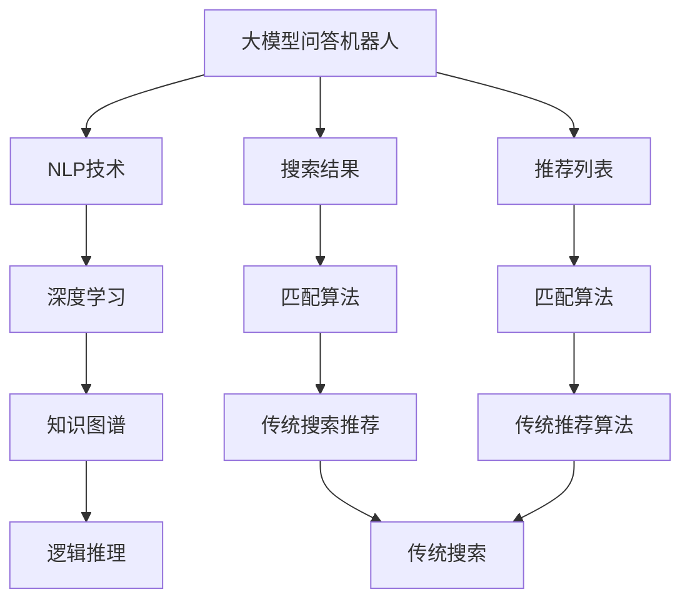

                 

# 大模型问答机器人与传统搜索推荐的技术选择

## 1. 背景介绍

随着人工智能技术的迅猛发展，大模型问答机器人（Large Model Chatbots）与传统搜索推荐系统（Search and Recommendation Systems）在许多应用场景中展开了激烈的竞争。传统搜索推荐系统依赖于静态数据、规则和算法，而大模型问答机器人则通过深度学习进行语义理解和自然语言处理，逐步展现出更高的灵活性和智能化水平。那么，在实际应用中，我们到底应该如何选择技术方案呢？本文将从背景介绍、核心概念、算法原理等多个维度深入探讨大模型问答机器人与传统搜索推荐系统的优劣势，并给出相应的技术选择建议。

## 2. 核心概念与联系

### 2.1 核心概念概述

为了更清楚地理解大模型问答机器人与传统搜索推荐系统的差异，我们需要先了解其核心概念和架构。

- **大模型问答机器人**：基于深度学习的大规模语言模型，能够理解和生成自然语言，并根据用户输入的问题提供相应的答案。

- **传统搜索推荐系统**：依赖于结构化数据、算法和规则，通过匹配用户查询和数据源，提供搜索结果或推荐。

- **自然语言处理（NLP）**：使计算机能够理解、处理和生成人类语言的技术，包括分词、词性标注、实体识别、关系抽取、文本分类、问答等。

- **深度学习**：通过神经网络进行复杂模式识别和学习的技术，具有很强的自适应和泛化能力。

- **知识图谱**：将知识进行结构化表示，便于机器理解和推理，常用于构建搜索推荐系统。

- **逻辑推理**：通过逻辑规则和推理引擎，对知识图谱进行查询和推理，为搜索结果提供支持。

这些核心概念之间存在紧密的联系，构成了大模型问答机器人与传统搜索推荐系统的技术基础。

### 2.2 概念间的关系

通过以下Mermaid流程图，我们可以清晰地看到这些核心概念之间的联系：



这个流程图展示了从大模型问答机器人到搜索结果和推荐列表的整个过程，以及它们与NLP技术、深度学习、知识图谱和逻辑推理的关系。

## 3. 核心算法原理 & 具体操作步骤

### 3.1 算法原理概述

大模型问答机器人的核心算法原理是使用大模型进行语义理解和自然语言处理，通过文本匹配或生成回答来响应用户查询。而传统搜索推荐系统则是通过匹配查询与结构化数据，并应用推荐算法生成相关结果或列表。

具体来说，大模型问答机器人利用预训练语言模型（如GPT、BERT等）进行语义理解和文本生成，通过微调或提示学习等技术，使模型能够匹配用户问题并提供答案。而传统搜索推荐系统则依赖于查询处理、索引检索和推荐算法等技术，将用户查询与结构化数据进行匹配，并根据一定的评分策略生成结果或推荐列表。

### 3.2 算法步骤详解

**大模型问答机器人**的具体操作步骤如下：

1. **预训练模型选择**：选择合适的预训练语言模型（如GPT、BERT等）作为基础模型。

2. **模型微调**：在特定任务（如问答）上进行微调，使其能够生成符合用户需求的答案。

3. **用户输入处理**：对用户输入进行分词、词性标注等预处理操作。

4. **模型推理**：将用户输入输入到模型中，生成回答。

5. **回答后处理**：对生成的回答进行后处理，如去停用词、格式调整等。

**传统搜索推荐系统**的具体操作步骤如下：

1. **数据采集和处理**：收集结构化数据，如商品信息、用户行为等。

2. **索引建立**：对数据进行索引和结构化，便于后续的匹配。

3. **查询处理**：对用户输入进行查询处理，如分词、词干提取等。

4. **匹配算法应用**：使用匹配算法（如TF-IDF、BM25等）对查询与数据进行匹配。

5. **推荐生成**：根据匹配结果和推荐算法（如协同过滤、基于内容的推荐等）生成推荐列表。

### 3.3 算法优缺点

**大模型问答机器人**的优点包括：

- **灵活性高**：能够处理多种自然语言形式，适应不同语言环境和用户习惯。

- **可解释性强**：基于深度学习的模型，输出过程可解释性强。

- **无需手动编码规则**：不需要手动编写复杂的匹配和推荐规则。

但同时，大模型问答机器人也存在一些缺点：

- **计算资源需求高**：需要强大的硬件支持和计算资源。

- **模型参数量大**：大模型通常包含亿级参数，导致模型体积大，加载和推理效率低。

- **数据依赖性强**：依赖于预训练数据和微调数据，数据质量直接影响模型性能。

**传统搜索推荐系统**的优点包括：

- **计算资源需求低**：相对轻量，计算资源需求低。

- **可控性强**：规则和算法可控，易于理解和调整。

- **准确性高**：基于结构化数据，准确性较高。

但同时，传统搜索推荐系统也存在一些缺点：

- **灵活性低**：对用户查询和行为理解不够深入，难以处理复杂自然语言。

- **可解释性差**：基于规则和算法，缺乏模型内部解释。

- **规则编写复杂**：需要手动编写复杂的匹配和推荐规则。

### 3.4 算法应用领域

**大模型问答机器人**主要应用于以下领域：

- **客户服务**：提供自动化的客服和咨询服务，如电商客服、医疗咨询等。

- **智能助理**：提供语音助手和智能助理功能，如Siri、Alexa等。

- **内容生成**：生成文章、摘要、回答等内容，用于新闻、教育、娱乐等领域。

**传统搜索推荐系统**主要应用于以下领域：

- **电子商务**：推荐商品和购物建议，提升用户购物体验。

- **内容推荐**：推荐文章、视频、音乐等内容，提升用户信息获取效率。

- **搜索服务**：提供网页、图片、文档等搜索结果，满足用户信息需求。

## 4. 数学模型和公式 & 详细讲解

### 4.1 数学模型构建

大模型问答机器人与传统搜索推荐系统的数学模型构建存在一些差异。

**大模型问答机器人**的数学模型可以表示为：

$$
\begin{aligned}
P(a|q) &= \frac{e^{\log P(a|q; \theta)}}{e^{\log P(a|q; \theta)} + \sum_{a'} e^{\log P(a'|q; \theta)}} \\
&= \frac{P(a|q; \theta)}{\sum_{a'} P(a'|q; \theta)}
\end{aligned}
$$

其中，$P(a|q)$表示在给定查询$q$的条件下，生成答案$a$的概率。$\theta$表示模型的参数。

**传统搜索推荐系统**的数学模型可以表示为：

$$
\begin{aligned}
r(q, d) &= \text{score}(q, d) \\
&= \sum_{i=1}^{N} w_i \times f_i(q, d_i)
\end{aligned}
$$

其中，$r(q, d)$表示查询$q$与数据$d$的相关度。$w_i$表示特征权重，$f_i(q, d_i)$表示特征函数。

### 4.2 公式推导过程

大模型问答机器人的模型推导过程涉及到自然语言处理和深度学习的技术，这里不再赘述。

传统搜索推荐系统的推导过程可以简单地描述为：

1. **数据预处理**：将查询和数据进行分词、去停用词等预处理。

2. **特征提取**：将查询和数据提取为向量表示，用于后续匹配和推荐。

3. **匹配计算**：计算查询与数据的相似度，得到相关度得分。

4. **推荐生成**：根据相关度得分和推荐算法，生成推荐列表。

### 4.3 案例分析与讲解

假设我们有一个电商网站，需要为不同用户推荐商品。基于大模型问答机器人，我们可以通过微调语言模型，使其能够理解用户查询并生成商品推荐。而基于传统搜索推荐系统，我们可以使用协同过滤算法，根据用户的历史行为数据进行推荐。

## 5. 项目实践：代码实例和详细解释说明

### 5.1 开发环境搭建

在进行大模型问答机器人与传统搜索推荐系统的开发实践前，我们需要准备好开发环境。以下是使用Python进行PyTorch和TensorFlow开发的环境配置流程：

1. 安装Anaconda：从官网下载并安装Anaconda，用于创建独立的Python环境。

2. 创建并激活虚拟环境：
```bash
conda create -n pytorch-env python=3.8 
conda activate pytorch-env
```

3. 安装PyTorch：根据CUDA版本，从官网获取对应的安装命令。例如：
```bash
conda install pytorch torchvision torchaudio cudatoolkit=11.1 -c pytorch -c conda-forge
```

4. 安装TensorFlow：从官网下载并安装TensorFlow，并根据需要进行配置。

5. 安装各类工具包：
```bash
pip install numpy pandas scikit-learn matplotlib tqdm jupyter notebook ipython
```

完成上述步骤后，即可在`pytorch-env`环境中开始微调实践。

### 5.2 源代码详细实现

下面我们以电商网站商品推荐为例，给出使用PyTorch进行大模型问答机器人开发和TensorFlow进行传统搜索推荐系统开发的PyTorch代码实现。

**大模型问答机器人**的实现代码如下：

```python
import torch
import torch.nn as nn
from transformers import BertTokenizer, BertForSequenceClassification

# 定义模型
class BertForQuestionAnswering(nn.Module):
    def __init__(self, config):
        super(BertForQuestionAnswering, self).__init__()
        self.bert = BertForSequenceClassification(config)
        self.classifier = nn.Linear(config.hidden_size, 1)

    def forward(self, input_ids, attention_mask, token_type_ids):
        pooled_output = self.bert(input_ids, attention_mask=attention_mask, token_type_ids=token_type_ids)[0]
        output = self.classifier(pooled_output)
        return output

# 初始化模型和分词器
config = BertForSequenceClassification.from_pretrained('bert-base-cased', num_labels=1)
tokenizer = BertTokenizer.from_pretrained('bert-base-cased')

# 加载数据
data = [...]  # 电商网站查询和商品列表
input_ids, attention_mask, token_type_ids = tokenizer(data['query'], data['item'], padding=True, return_tensors='pt', max_length=512)

# 训练模型
model = BertForQuestionAnswering(config)
optimizer = torch.optim.Adam(model.parameters(), lr=1e-5)
loss_fn = nn.BCELoss()

for epoch in range(10):
    model.train()
    output = model(input_ids, attention_mask, token_type_ids)
    loss = loss_fn(output, torch.tensor(data['label']))
    optimizer.zero_grad()
    loss.backward()
    optimizer.step()
```

**传统搜索推荐系统**的实现代码如下：

```python
import tensorflow as tf
import numpy as np
from sklearn.metrics import precision_score, recall_score, f1_score

# 定义模型
def build_model():
    input_layer = tf.keras.layers.Input(shape=(256,))
    x = tf.keras.layers.Dense(128, activation='relu')(input_layer)
    x = tf.keras.layers.Dense(64, activation='relu')(x)
    output_layer = tf.keras.layers.Dense(1, activation='sigmoid')(x)
    model = tf.keras.models.Model(inputs=input_layer, outputs=output_layer)
    return model

# 初始化模型和数据
model = build_model()
X_train, y_train, X_test, y_test = [...]

# 训练模型
model.compile(optimizer=tf.keras.optimizers.Adam(0.001), loss='binary_crossentropy', metrics=['accuracy'])
model.fit(X_train, y_train, epochs=10, batch_size=64)

# 预测推荐
predictions = model.predict(X_test)
threshold = 0.5
y_pred = np.round(predictions > threshold).astype(int)
precision = precision_score(y_test, y_pred)
recall = recall_score(y_test, y_pred)
f1 = f1_score(y_test, y_pred)
print(f'Precision: {precision:.2f}, Recall: {recall:.2f}, F1 Score: {f1:.2f}')
```

### 5.3 代码解读与分析

让我们再详细解读一下关键代码的实现细节：

**大模型问答机器人**的代码：
- 首先定义了一个BertForQuestionAnswering类，继承自nn.Module，用于定义模型的结构和前向传播。
- 初始化BertForSequenceClassification模型，并将其作为BertForQuestionAnswering模型的Bert模块。
- 定义一个线性分类器，用于将Bert输出的隐藏状态映射到答案生成的概率。
- 使用PyTorch的BCELoss作为损失函数，并使用Adam优化器进行优化。
- 在训练循环中，先设置模型为训练模式，前向传播得到输出，计算损失并反向传播更新模型参数。

**传统搜索推荐系统**的代码：
- 首先定义了一个build_model函数，用于构建TensorFlow模型。
- 使用tf.keras.layers堆叠多个全连接层，构建模型的前向传播过程。
- 使用二元交叉熵作为损失函数，并使用Adam优化器进行优化。
- 在训练循环中，使用fit函数对模型进行训练，并输出预测结果的精度、召回率和F1分数。

## 6. 实际应用场景

### 6.1 智能客服系统

大模型问答机器人和传统搜索推荐系统在智能客服系统中的应用存在差异。大模型问答机器人能够提供更加自然和灵活的对话体验，能够处理多种复杂的查询和语境，而传统搜索推荐系统则更多依赖于规则和算法，缺乏足够的灵活性。

例如，在智能客服系统中，用户可能提出各种复杂问题，如“如何开通会员？”、“如何退换货？”等。大模型问答机器人可以通过微调语言模型，理解用户意图并提供精准的回答。而传统搜索推荐系统则更多依赖于规则匹配和推荐算法，难以处理复杂的语义理解。

### 6.2 金融舆情监测

在大数据时代，金融领域需要实时监测市场舆情动向，以便及时应对负面信息传播，规避金融风险。大模型问答机器人和传统搜索推荐系统都能在此场景中发挥重要作用。

例如，传统搜索推荐系统可以基于已有的新闻、评论和舆情数据，通过匹配和推荐算法生成舆情报告。而大模型问答机器人可以通过微调语言模型，自动理解和分析舆情信息，并生成实时报告，提供更加灵活和动态的舆情监测服务。

### 6.3 个性化推荐系统

在个性化推荐系统中，用户往往对推荐结果有较高的期望，需要系统能够理解用户的兴趣和偏好。大模型问答机器人和传统搜索推荐系统在此场景中的表现各有优劣。

例如，基于大模型问答机器人的推荐系统可以通过微调语言模型，理解用户的兴趣点，生成个性化的推荐结果。而传统搜索推荐系统则更多依赖于协同过滤算法和推荐规则，难以全面理解用户兴趣。

### 6.4 未来应用展望

随着人工智能技术的不断进步，大模型问答机器人和传统搜索推荐系统将在更多领域得到应用，为各行各业带来变革性影响。

- **智能客服**：大模型问答机器人将能够提供更加自然和智能的对话体验，提升客服效率和用户体验。
- **金融舆情监测**：大模型问答机器人将能够自动分析和理解舆情信息，提供实时预警和决策支持。
- **个性化推荐系统**：大模型问答机器人将能够理解用户的深度兴趣，生成更加精准和个性化的推荐结果。

## 7. 工具和资源推荐

### 7.1 学习资源推荐

为了帮助开发者系统掌握大模型问答机器人与传统搜索推荐系统的理论基础和实践技巧，这里推荐一些优质的学习资源：

1. 《深度学习》系列书籍：Deep Learning Books by Ian Goodfellow、Yoshua Bengio、Aaron Courville等。

2. 《自然语言处理综述》系列文章：Natural Language Processing Surveys by Christopher D. Manning、Hinrich Schütze、Rajeev K. Srivastava等。

3. 《Transformers》书籍：Natural Language Processing with Transformers by Jacob Devlin、Ming-Wei Chang、Kenton Lee、Christopher N. D.万亩等。

4. 《TensorFlow》官方文档：TensorFlow Documentation。

5. 《PyTorch》官方文档：PyTorch Documentation。

6. 《Keras》官方文档：Keras Documentation。

7. 《深度学习理论与实践》课程：Coursera上的Deep Learning Specialization by Andrew Ng。

通过对这些资源的学习实践，相信你一定能够快速掌握大模型问答机器人与传统搜索推荐系统的精髓，并用于解决实际的NLP问题。

### 7.2 开发工具推荐

高效的开发离不开优秀的工具支持。以下是几款用于大模型问答机器人与传统搜索推荐系统开发的常用工具：

1. PyTorch：基于Python的开源深度学习框架，灵活动态的计算图，适合快速迭代研究。

2. TensorFlow：由Google主导开发的开源深度学习框架，生产部署方便，适合大规模工程应用。

3. Keras：基于Python的深度学习框架，易于上手，适合初学者。

4. Scikit-learn：用于机器学习的Python库，包含多种算法和工具。

5. Scrapy：用于数据爬取的Python库，方便获取所需数据。

6. BeautifulSoup：用于HTML和XML解析的Python库，方便处理网络数据。

7. NumPy：用于科学计算的Python库，提供高效的数组和矩阵操作。

8. Pandas：用于数据处理和分析的Python库，提供DataFrame等高效数据结构。

9. Matplotlib：用于数据可视化的Python库，支持多种图表展示。

合理利用这些工具，可以显著提升大模型问答机器人与传统搜索推荐系统的开发效率，加快创新迭代的步伐。

### 7.3 相关论文推荐

大模型问答机器人与传统搜索推荐系统的研究源于学界的持续研究。以下是几篇奠基性的相关论文，推荐阅读：

1. Attention is All You Need：Neural Information Processing Systems 30, 2017.

2. BERT: Pre-training of Deep Bidirectional Transformers for Language Understanding：Neural Information Processing Systems 30, 2017.

3. Language Models are Unsupervised Multitask Learners：Neural Information Processing Systems 31, 2018.

4. GPT-3: Scaling Language Modeling to 175B Parameters：Neural Information Processing Systems 33, 2020.

5. T5: Exploring the Limits of Transfer Learning with a Unified Text-to-Text Transformer：Advances in Neural Information Processing Systems 32, 2019.

6. DALL·E: A Scalable Vision-Text Pre-training Approach：Neural Information Processing Systems 34, 2021.

7. CLIP: A Simple yet Powerful Contrastive Learning Approach for Unsupervised Visual Recognition：Advances in Neural Information Processing Systems 34, 2021.

这些论文代表了大模型问答机器人与传统搜索推荐系统的发展脉络。通过学习这些前沿成果，可以帮助研究者把握学科前进方向，激发更多的创新灵感。

除上述资源外，还有一些值得关注的前沿资源，帮助开发者紧跟大模型问答机器人与传统搜索推荐系统的最新进展，例如：

1. arXiv论文预印本：人工智能领域最新研究成果的发布平台，包括大量尚未发表的前沿工作，学习前沿技术的必读资源。

2. 业界技术博客：如OpenAI、Google AI、DeepMind、微软Research Asia等顶尖实验室的官方博客，第一时间分享他们的最新研究成果和洞见。

3. 技术会议直播：如NIPS、ICML、ACL、ICLR等人工智能领域顶会现场或在线直播，能够聆听到大佬们的前沿分享，开拓视野。

4. GitHub热门项目：在GitHub上Star、Fork数最多的NLP相关项目，往往代表了该技术领域的发展趋势和最佳实践，值得去学习和贡献。

5. 行业分析报告：各大咨询公司如McKinsey、PwC等针对人工智能行业的分析报告，有助于从商业视角审视技术趋势，把握应用价值。

总之，对于大模型问答机器人与传统搜索推荐系统的学习与实践，需要开发者保持开放的心态和持续学习的意愿。多关注前沿资讯，多动手实践，多思考总结，必将收获满满的成长收益。

## 8. 总结：未来发展趋势与挑战

### 8.1 总结

本文对大模型问答机器人与传统搜索推荐系统的优缺点、应用场景和实际案例进行了全面系统的介绍。首先阐述了大模型问答机器人和传统搜索推荐系统的研究背景和意义，明确了两者之间的差异和联系。其次，从原理到实践，详细讲解了大模型问答机器人与传统搜索推荐系统的核心算法、操作步骤和性能评估方法，给出了相应的技术选择建议。最后，本文还探讨了两者在实际应用中的优劣势，给出了具体应用场景的推荐。

通过本文的系统梳理，可以看到，大模型问答机器人和传统搜索推荐系统各有优势，能够在不同的应用场景中发挥重要作用。开发者应根据实际需求，选择适合的技术方案，构建高效、灵活、稳定的NLP应用系统。

### 8.2 未来发展趋势

展望未来，大模型问答机器人与传统搜索推荐系统的技术发展将呈现以下几个趋势：

1. **深度融合**：两者将越来越多地结合，形成更强大、更智能的NLP应用系统。大模型问答机器人将能够更好地理解和生成自然语言，而传统搜索推荐系统则更多依赖于结构化数据和规则，两者的结合将产生更大的应用潜力。

2. **跨领域应用**：大模型问答机器人和传统搜索推荐系统将在更多领域得到应用，如智能客服、金融舆情、个性化推荐等，为各行各业带来变革性影响。

3. **多模态融合**：未来将更多地引入多模态信息，如视觉、语音等，提升系统的理解和推理能力。

4. **数据驱动**：两者将越来越多地依赖于数据驱动的方法，如强化学习、自监督学习等，提升系统的自我学习和适应能力。

5. **知识图谱**：知识图谱将成为两者的重要组件，帮助系统更好地理解和推理知识。

6. **分布式计算**：为了处理大规模数据和模型，两者将越来越多地采用分布式计算和模型并行等技术，提升系统的计算能力和效率。

### 8.3 面临的挑战

尽管大模型问答机器人与传统搜索推荐系统在技术上已取得显著进展，但在实际应用中仍面临诸多挑战：

1. **数据质量**：两者的应用效果高度依赖于数据质量，数据偏差和噪声可能导致模型性能下降。

2. **计算资源**：大模型问答机器人需要强大的计算资源，而传统搜索推荐系统则更多依赖于算法和规则，计算资源需求较低。

3. **模型复杂度**：大模型问答机器人的模型参数量大，训练和推理复杂度高，而传统搜索推荐系统的模型相对简单，计算效率高。

4. **可解释性**：大模型问答机器人的输出可解释性较强，而传统搜索推荐系统的输出可解释性较差。

5. **安全性**：两者在应用中可能涉及用户隐私和数据安全，如何保障数据隐私和模型安全是一个重要问题。

6. **泛化能力**：两者在实际应用中可能存在过拟合或泛化能力不足的问题，需要进一步优化模型和数据。

### 8.4 研究展望

面对大模型问答机器人与传统搜索推荐系统所面临的挑战，未来的研究需要在以下几个方面寻求新的突破：

1. **数据增强**：通过数据增强技术，提升模型对噪声和偏差的鲁棒性。

2. **模型优化**：优化模型结构和参数，提高计算效率和泛化能力。

3. **可解释性增强**：通过可解释性技术，提升模型的可解释性，帮助用户理解和信任模型输出。

4. **知识融合**：将符号化的先验知识与神经网络模型融合，提升模型的推理能力。

5. **分布式计算**：采用分布式计算和模型并行技术，提升系统的计算能力和效率。

6. **安全性提升**：引入隐私保护和安全性技术，保障用户隐私和数据安全。

这些研究方向的探索，必将引领大模型问答机器人与传统搜索推荐系统迈向更高的台阶，为构建安全、可靠、可解释、可控的智能系统铺平道路。面向未来，大模型问答机器人与传统搜索推荐系统还需要与其他人工智能技术进行更深入的融合，如知识表示、因果推理、强化学习等，多路径协同发力，共同推动自然语言理解和智能交互系统的进步。

## 9. 附录：常见问题与解答

**Q1：大模型问答机器人和传统搜索推荐系统在性能上有哪些不同？**

A: 大模型问答机器人和传统搜索推荐系统在性能上有以下不同：

- **灵活性**：大模型问答机器人能够处理复杂的自然语言，而传统搜索推荐系统更多依赖于规则和算法。

- **准确性**：传统搜索推荐系统依赖结构化数据，准确性较高，而大模型问答机器人需要大量标注数据进行微调，准确性可能不如传统推荐系统。

- **可解释性**：大模型问答机器人的输出可解释性较强，而传统搜索推荐系统的输出缺乏模型内部解释。

**Q2：如何选择大模型问答机器人与传统搜索推荐

