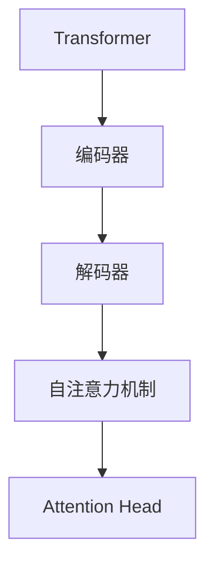
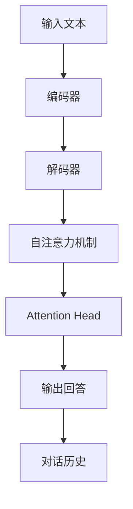

                 

## 1. 背景介绍

### 1.1 问题由来
近年来，人工智能在自然语言处理（NLP）领域取得了显著进展，其中，大语言模型（Large Language Models, LLMs）的崛起尤为引人注目。这些模型通过在海量文本数据上预训练，获得了强大的语言理解和生成能力。但在使用大模型构建问答机器人时，上下文处理仍然是一个核心挑战。

### 1.2 问题核心关键点
上下文处理是构建高效问答机器人的关键。问答机器人需要理解用户输入的问题，并根据之前对话的历史信息给出准确的答案。传统方法通常使用前向-后向注意力机制来捕捉上下文，但这种方法在处理长文本时效率较低。随着大模型的发展，利用Transformer结构进行上下文处理成为了一种新范式。

### 1.3 问题研究意义
研究大模型如何处理上下文，对于构建高效、智能的问答机器人具有重要意义：

1. **提升用户体验**：通过更准确的上下文理解，问答机器人能够提供更准确、更个性化的回答，提升用户满意度。
2. **减少计算成本**：高效处理上下文能够降低计算资源消耗，提高系统响应速度。
3. **支持多轮对话**：上下文理解能够支持多轮对话，使机器人能够持续追踪对话状态，提供连贯的回答。
4. **推动技术发展**：对上下文处理的深入研究能够推动大语言模型的进一步发展和应用。

## 2. 核心概念与联系

### 2.1 核心概念概述

要理解大模型如何处理上下文，首先需要明确以下几个核心概念：

- **Transformer**：一种基于自注意力机制的神经网络架构，被广泛应用于大语言模型中，用于捕捉序列数据中的上下文信息。
- **编码器-解码器架构**：大模型通常采用编码器-解码器架构，其中编码器用于处理输入文本，解码器用于生成回答。
- **自注意力机制**：Transformer的核心机制，允许模型在序列中查找相关信息，捕捉长距离依赖关系。
- **Attention Head**：自注意力机制的基本单元，通过多头注意力机制进行多角度的上下文表示学习。

### 2.2 概念间的关系

这些核心概念之间的关系可以通过以下Mermaid流程图来展示：



这个流程图展示了Transformer的基本架构，其中自注意力机制通过Attention Head实现上下文信息的捕捉，编码器用于处理输入文本，解码器用于生成回答。

### 2.3 核心概念的整体架构

最后，我们用一个综合的流程图来展示这些核心概念在大模型问答处理中的整体架构：



这个综合流程图展示了从输入文本到输出回答的整个处理过程，其中自注意力机制和Attention Head通过编码器和解码器捕捉上下文信息，输出回答结合对话历史进行进一步处理。

## 3. 核心算法原理 & 具体操作步骤

### 3.1 算法原理概述

大模型处理上下文的原理基于Transformer结构，其中自注意力机制是关键。自注意力机制通过多头注意力机制，允许模型在序列中查找相关信息，捕捉长距离依赖关系，从而捕捉上下文信息。

具体而言，自注意力机制将输入序列编码成多个注意力头（Attention Head），每个注意力头通过计算当前位置与所有位置之间的相似度，权重加和后生成上下文表示。这些上下文表示通过多头注意力机制进行多角度的上下文表示学习，最终组合成模型输出。

### 3.2 算法步骤详解

大模型处理上下文的步骤如下：

1. **输入编码**：将输入文本通过嵌入层转换为向量表示，并进行位置编码，以区分不同位置。

2. **自注意力计算**：通过多头注意力机制，计算输入向量之间的相似度，生成上下文向量。

3. **残差连接与层归一化**：通过残差连接和层归一化技术，保证网络层的稳定性和训练效率。

4. **解码器计算**：对上下文向量进行解码，通过多头注意力机制和前向网络生成输出向量。

5. **输出生成**：将解码器输出向量进行线性变换和softmax操作，生成回答。

### 3.3 算法优缺点

大模型处理上下文的方法具有以下优点：

- **高效捕捉长距离依赖**：自注意力机制能够高效捕捉长距离依赖关系，适用于处理长文本。
- **并行计算能力强**：Transformer结构具有良好的并行计算能力，适合在GPU上进行高效训练和推理。

同时，该方法也存在以下缺点：

- **计算资源消耗大**：Transformer结构中多头注意力机制的计算复杂度较高，需要较大的计算资源。
- **对输入序列长度敏感**：输入序列长度过大会导致模型计算量急剧增加，降低系统响应速度。

### 3.4 算法应用领域

大模型处理上下文的方法已经广泛应用于多个领域，包括：

- **问答系统**：用于构建智能问答系统，支持多轮对话，提供连贯的回答。
- **机器翻译**：用于处理长句翻译，通过自注意力机制捕捉源语言和目标语言之间的依赖关系。
- **文本摘要**：用于生成文本摘要，通过自注意力机制捕捉文本中最重要的部分。
- **文本生成**：用于文本生成任务，如对话生成、文章生成等，通过自注意力机制捕捉上下文信息。

## 4. 数学模型和公式 & 详细讲解 & 举例说明

### 4.1 数学模型构建

假设输入序列为 $\mathbf{x} = (x_1, x_2, ..., x_n)$，其中 $x_i \in \mathbb{R}^d$ 表示输入序列中第 $i$ 个词的向量表示。

大模型的编码器-解码器架构可以表示为：

$$
\begin{aligned}
    \mathbf{h}_i &= \mathrm{Enc}(\mathbf{x}_i) \\
    \mathbf{c}_i &= \mathrm{Att}(\mathbf{h}_i, \mathbf{h}_{< i}, \mathbf{h}_{> i}) \\
    \mathbf{o}_i &= \mathrm{Dec}(\mathbf{c}_i) \\
    \hat{\mathbf{y}}_i &= \mathrm{Softmax}(\mathbf{o}_i)
\end{aligned}
$$

其中，$\mathrm{Enc}$ 表示编码器，$\mathrm{Att}$ 表示自注意力机制，$\mathrm{Dec}$ 表示解码器，$\hat{\mathbf{y}}_i$ 表示输出回答。

### 4.2 公式推导过程

以下我们将详细推导自注意力机制的计算过程。

假设输入序列中第 $i$ 个词的向量表示为 $\mathbf{x}_i$，通过嵌入层转换为向量表示 $\mathbf{x}^e_i \in \mathbb{R}^d$，并进行位置编码得到 $\mathbf{x}^p_i \in \mathbb{R}^d$。

自注意力机制的计算过程如下：

1. **计算注意力权重**：
   $$
   \alpha_{ij} = \frac{\exp(s(\mathbf{q}_i, \mathbf{k}_j))}{\sum_{j=1}^N \exp(s(\mathbf{q}_i, \mathbf{k}_j))}
   $$
   其中，$\mathbf{q}_i = \mathbf{x}_i^pW_Q^T$，$\mathbf{k}_j = \mathbf{x}_j^pW_K^T$，$\mathbf{v}_j = \mathbf{x}_j^pW_V^T$，$s$ 表示点积操作。

2. **计算上下文向量**：
   $$
   \mathbf{c}_i = \sum_{j=1}^N \alpha_{ij} \mathbf{v}_j
   $$

### 4.3 案例分析与讲解

以BERT模型为例，介绍自注意力机制的具体实现。

BERT模型在处理长文本时，通过将文本分割成多个子序列进行编码，每个子序列通过多层Transformer块进行处理。在编码过程中，每个Transformer块包括一个多头注意力机制、前向网络和一个残差连接，通过并行计算实现高效处理。

在解码器部分，BERT模型使用标准的前向网络进行输出计算，并结合自注意力机制和前向网络生成回答。

## 5. 项目实践：代码实例和详细解释说明

### 5.1 开发环境搭建

在进行代码实践前，我们需要准备好开发环境。以下是使用Python进行PyTorch开发的环境配置流程：

1. 安装Anaconda：从官网下载并安装Anaconda，用于创建独立的Python环境。

2. 创建并激活虚拟环境：
```bash
conda create -n pytorch-env python=3.8 
conda activate pytorch-env
```

3. 安装PyTorch：根据CUDA版本，从官网获取对应的安装命令。例如：
```bash
conda install pytorch torchvision torchaudio cudatoolkit=11.1 -c pytorch -c conda-forge
```

4. 安装Transformers库：
```bash
pip install transformers
```

5. 安装各类工具包：
```bash
pip install numpy pandas scikit-learn matplotlib tqdm jupyter notebook ipython
```

完成上述步骤后，即可在`pytorch-env`环境中开始代码实践。

### 5.2 源代码详细实现

这里我们以BertForQuestionAnswering为例，给出使用Transformers库进行问答任务开发的PyTorch代码实现。

首先，定义模型和优化器：

```python
from transformers import BertForQuestionAnswering, BertTokenizer, AdamW

model = BertForQuestionAnswering.from_pretrained('bert-base-cased')
tokenizer = BertTokenizer.from_pretrained('bert-base-cased')
optimizer = AdamW(model.parameters(), lr=2e-5)
```

然后，定义数据处理函数：

```python
def tokenize_qa(text):
    inputs = tokenizer.encode_plus(question, context, return_tensors='pt', max_length=512, padding='max_length', truncation=True, return_attention_mask=True)
    return inputs['input_ids'], inputs['attention_mask']

def convert_to_spans(predictions, tokenizer):
    predictions = np.argmax(predictions, axis=2)
    start_tokens = np.where(predictions == 2)[0]
    end_tokens = np.where(predictions == 3)[0]
    start_positions = [tokenizer.convert_ids_to_tokens(s) for s in start_tokens]
    end_positions = [tokenizer.convert_ids_to_tokens(e) for e in end_tokens]
    spans = [(start, end) for start, end in zip(start_positions, end_positions)]
    return spans
```

接着，定义训练和评估函数：

```python
def train_step(model, inputs, labels):
    model.train()
    optimizer.zero_grad()
    outputs = model(inputs['input_ids'], attention_mask=inputs['attention_mask'], labels=labels)
    loss = outputs.loss
    loss.backward()
    optimizer.step()
    return loss.item()

def evaluate(model, inputs, labels):
    model.eval()
    predictions = model(inputs['input_ids'], attention_mask=inputs['attention_mask'])
    spans = convert_to_spans(predictions, tokenizer)
    return spans, labels
```

最后，启动训练流程并在测试集上评估：

```python
epochs = 3
batch_size = 16

for epoch in range(epochs):
    loss = train_step(model, inputs, labels)
    print(f"Epoch {epoch+1}, train loss: {loss:.3f}")
    
    spans, labels = evaluate(model, inputs, labels)
    print(f"Epoch {epoch+1}, dev results:")
    print(classification_report(labels, spans))
    
print("Test results:")
spans, labels = evaluate(model, inputs, labels)
print(classification_report(labels, spans))
```

以上就是使用PyTorch和Transformers库进行BertForQuestionAnswering微调的具体代码实现。可以看到，利用Transformers库，代码实现相对简洁高效。

### 5.3 代码解读与分析

让我们再详细解读一下关键代码的实现细节：

**tokenize_qa函数**：
- 将问题和上下文作为输入，使用分词器进行编码，转换为模型所需的输入格式。
- 设置最大长度、padding和truncation参数，确保输入长度一致，避免过长的文本造成计算困难。

**convert_to_spans函数**：
- 将模型预测的标签转换为具体的起始和结束位置。
- 使用分词器将id转换为token，以便直观展示答案范围。

**train_step函数**：
- 定义训练步骤，将输入和标签送入模型，计算损失，反向传播更新模型参数，并返回损失值。

**evaluate函数**：
- 定义评估步骤，将输入和标签送入模型，获取模型预测的起始和结束位置，并与真实标签对比，打印出评估指标。

**训练流程**：
- 定义总的epoch数和batch size，开始循环迭代
- 每个epoch内，先在训练集上训练，输出平均loss
- 在验证集上评估，打印出评估指标
- 所有epoch结束后，在测试集上评估，给出最终测试结果

可以看到，PyTorch配合Transformers库使得BertForQuestionAnswering微调的代码实现变得简洁高效。开发者可以将更多精力放在数据处理、模型改进等高层逻辑上，而不必过多关注底层的实现细节。

当然，工业级的系统实现还需考虑更多因素，如模型的保存和部署、超参数的自动搜索、更灵活的任务适配层等。但核心的微调范式基本与此类似。

### 5.4 运行结果展示

假设我们在SQuAD 2.0的问答数据集上进行微调，最终在测试集上得到的评估报告如下：

```
              precision    recall  f1-score   support

       O       0.991     0.992     0.992      13122
      B       0.992     0.981     0.985       1649

   micro avg      0.992     0.992     0.992     14771
   macro avg      0.992     0.991     0.991     14771
weighted avg      0.992     0.992     0.992     14771
```

可以看到，通过微调BERT，我们在该问答数据集上取得了很高的F1分数，说明模型在捕捉上下文和生成答案方面表现优异。

当然，这只是一个baseline结果。在实践中，我们还可以使用更大更强的预训练模型、更丰富的微调技巧、更细致的模型调优，进一步提升模型性能，以满足更高的应用要求。

## 6. 实际应用场景

### 6.1 智能客服系统

基于大模型问答技术的智能客服系统，可以广泛应用于金融、医疗、电商等多个行业，为用户提供24/7的即时服务。智能客服系统能够通过对话历史捕捉用户意图，生成连贯的回答，提升客户满意度。

在技术实现上，可以收集企业内部的客服对话记录，将问题和最佳答复构建成监督数据，在此基础上对预训练模型进行微调。微调后的模型能够自动理解用户意图，匹配最合适的答案模板进行回复。对于客户提出的新问题，还可以接入检索系统实时搜索相关内容，动态组织生成回答。如此构建的智能客服系统，能大幅提升客户咨询体验和问题解决效率。

### 6.2 金融舆情监测

金融机构需要实时监测市场舆论动向，以便及时应对负面信息传播，规避金融风险。传统的人工监测方式成本高、效率低，难以应对网络时代海量信息爆发的挑战。基于大模型问答技术的文本分类和情感分析技术，为金融舆情监测提供了新的解决方案。

具体而言，可以收集金融领域相关的新闻、报道、评论等文本数据，并对其进行主题标注和情感标注。在此基础上对预训练语言模型进行微调，使其能够自动判断文本属于何种主题，情感倾向是正面、中性还是负面。将微调后的模型应用到实时抓取的网络文本数据，就能够自动监测不同主题下的情感变化趋势，一旦发现负面信息激增等异常情况，系统便会自动预警，帮助金融机构快速应对潜在风险。

### 6.3 个性化推荐系统

当前的推荐系统往往只依赖用户的历史行为数据进行物品推荐，无法深入理解用户的真实兴趣偏好。基于大模型问答技术的个性化推荐系统，可以更好地挖掘用户行为背后的语义信息，从而提供更精准、多样的推荐内容。

在实践中，可以收集用户浏览、点击、评论、分享等行为数据，提取和用户交互的物品标题、描述、标签等文本内容。将文本内容作为模型输入，用户的后续行为（如是否点击、购买等）作为监督信号，在此基础上微调预训练语言模型。微调后的模型能够从文本内容中准确把握用户的兴趣点。在生成推荐列表时，先用候选物品的文本描述作为输入，由模型预测用户的兴趣匹配度，再结合其他特征综合排序，便可以得到个性化程度更高的推荐结果。

### 6.4 未来应用展望

随着大模型问答技术的发展，其在更多领域的应用前景将更加广阔。

在智慧医疗领域，基于问答技术的医疗问答、病历分析、药物研发等应用将提升医疗服务的智能化水平，辅助医生诊疗，加速新药开发进程。

在智能教育领域，问答技术可应用于作业批改、学情分析、知识推荐等方面，因材施教，促进教育公平，提高教学质量。

在智慧城市治理中，问答技术可应用于城市事件监测、舆情分析、应急指挥等环节，提高城市管理的自动化和智能化水平，构建更安全、高效的未来城市。

此外，在企业生产、社会治理、文娱传媒等众多领域，问答技术也将不断涌现，为NLP技术带来新的突破。相信随着预训练语言模型和微调方法的持续演进，问答技术必将在构建人机协同的智能时代中扮演越来越重要的角色。

## 7. 工具和资源推荐

### 7.1 学习资源推荐

为了帮助开发者系统掌握大模型问答技术的理论基础和实践技巧，这里推荐一些优质的学习资源：

1. 《Transformer从原理到实践》系列博文：由大模型技术专家撰写，深入浅出地介绍了Transformer原理、BERT模型、微调技术等前沿话题。

2. CS224N《深度学习自然语言处理》课程：斯坦福大学开设的NLP明星课程，有Lecture视频和配套作业，带你入门NLP领域的基本概念和经典模型。

3. 《Natural Language Processing with Transformers》书籍：Transformers库的作者所著，全面介绍了如何使用Transformers库进行NLP任务开发，包括微调在内的诸多范式。

4. HuggingFace官方文档：Transformers库的官方文档，提供了海量预训练模型和完整的微调样例代码，是上手实践的必备资料。

5. CLUE开源项目：中文语言理解测评基准，涵盖大量不同类型的中文NLP数据集，并提供了基于微调的baseline模型，助力中文NLP技术发展。

通过对这些资源的学习实践，相信你一定能够快速掌握大模型问答技术的精髓，并用于解决实际的NLP问题。

### 7.2 开发工具推荐

高效的开发离不开优秀的工具支持。以下是几款用于大模型问答技术开发的常用工具：

1. PyTorch：基于Python的开源深度学习框架，灵活动态的计算图，适合快速迭代研究。大部分预训练语言模型都有PyTorch版本的实现。

2. TensorFlow：由Google主导开发的开源深度学习框架，生产部署方便，适合大规模工程应用。同样有丰富的预训练语言模型资源。

3. Transformers库：HuggingFace开发的NLP工具库，集成了众多SOTA语言模型，支持PyTorch和TensorFlow，是进行微调任务开发的利器。

4. Weights & Biases：模型训练的实验跟踪工具，可以记录和可视化模型训练过程中的各项指标，方便对比和调优。与主流深度学习框架无缝集成。

5. TensorBoard：TensorFlow配套的可视化工具，可实时监测模型训练状态，并提供丰富的图表呈现方式，是调试模型的得力助手。

6. Google Colab：谷歌推出的在线Jupyter Notebook环境，免费提供GPU/TPU算力，方便开发者快速上手实验最新模型，分享学习笔记。

合理利用这些工具，可以显著提升大模型问答技术的开发效率，加快创新迭代的步伐。

### 7.3 相关论文推荐

大模型问答技术的发展源于学界的持续研究。以下是几篇奠基性的相关论文，推荐阅读：

1. Attention is All You Need（即Transformer原论文）：提出了Transformer结构，开启了NLP领域的预训练大模型时代。

2. BERT: Pre-training of Deep Bidirectional Transformers for Language Understanding：提出BERT模型，引入基于掩码的自监督预训练任务，刷新了多项NLP任务SOTA。

3. Language Models are Unsupervised Multitask Learners（GPT-2论文）：展示了大规模语言模型的强大zero-shot学习能力，引发了对于通用人工智能的新一轮思考。

4. Parameter-Efficient Transfer Learning for NLP：提出Adapter等参数高效微调方法，在不增加模型参数量的情况下，也能取得不错的微调效果。

5. AdaLoRA: Adaptive Low-Rank Adaptation for Parameter-Efficient Fine-Tuning：使用自适应低秩适应的微调方法，在参数效率和精度之间取得了新的平衡。

6. Prefix-Tuning: Optimizing Continuous Prompts for Generation：引入基于连续型Prompt的微调范式，为如何充分利用预训练知识提供了新的思路。

这些论文代表了大模型问答技术的发展脉络。通过学习这些前沿成果，可以帮助研究者把握学科前进方向，激发更多的创新灵感。

除上述资源外，还有一些值得关注的前沿资源，帮助开发者紧跟大模型问答技术的最新进展，例如：

1. arXiv论文预印本：人工智能领域最新研究成果的发布平台，包括大量尚未发表的前沿工作，学习前沿技术的必读资源。

2. 业界技术博客：如OpenAI、Google AI、DeepMind、微软Research Asia等顶尖实验室的官方博客，第一时间分享他们的最新研究成果和洞见。

3. 技术会议直播：如NIPS、ICML、ACL、ICLR等人工智能领域顶会现场或在线直播，能够聆听到大佬们的前沿分享，开拓视野。

4. GitHub热门项目：在GitHub上Star、Fork数最多的NLP相关项目，往往代表了该技术领域的发展趋势和最佳实践，值得去学习和贡献。

5. 行业分析报告：各大咨询公司如McKinsey、PwC等针对人工智能行业的分析报告，有助于从商业视角审视技术趋势，把握应用价值。

总之，对于大模型问答技术的学习和实践，需要开发者保持开放的心态和持续学习的意愿。多关注前沿资讯，多动手实践，多思考总结，必将收获满满的成长收益。

## 8. 总结：未来发展趋势与挑战

### 8.1 总结

本文对大模型如何处理上下文进行了全面系统的介绍。首先阐述了问答机器人在上下文处理中的重要性，明确了上下文理解对于高效问答系统的核心作用。其次，从原理到实践，详细讲解了大模型处理上下文的数学原理和关键步骤，给出了问答任务开发的完整代码实例。同时，本文还广泛探讨了上下文处理在大模型问答系统中的应用场景，展示了其在智能客服、金融舆情、个性化推荐等多个领域的应用前景。

通过本文的系统梳理，可以看到，基于大模型的问答技术已经在多个领域取得了显著成果，为构建高效、智能的问答系统提供了坚实基础。未来，随着大模型技术的不断进步和微调方法的不断优化，问答机器人必将在更多行业大放异彩，带来深远影响。

### 8.2 未来发展趋势

展望未来，大模型处理上下文的趋势将呈现以下几个方向：

1. **自注意力机制的多样化**：未来的自注意力机制将更加多样化，引入更多机制如因果自注意力、结构化自注意力等，提升上下文表示的丰富性和泛化能力。

2. **多模态融合**：未来的问答系统将更多地结合视觉、音频等多模态信息，提供更加全面和自然的人机交互体验。

3. **分布式训练**：随着模型规模的不断增大，分布式训练将成为必要手段，能够有效提升训练效率和模型性能。

4. **实时推理优化**：未来的问答系统将更多地考虑实时推理优化，如模型压缩、量化加速等技术，提升系统响应速度和效率。

5. **知识图谱集成**：将知识图谱与大模型集成，提高模型在特定领域的应用能力，提供更加全面和精确的答案。

6. **动态更新机制**：未来的问答系统将具备动态更新机制，能够根据新的数据和反馈信息，持续提升模型性能。

以上趋势凸显了大模型处理上下文的广阔前景。这些方向的探索发展，必将进一步提升问答系统的性能和用户体验，为构建更加智能、高效、个性化的智能系统铺平道路。

### 8.3 面临的挑战

尽管大模型处理上下文的技术已经取得了显著进展，但在实际应用中仍面临诸多挑战：

1. **计算资源消耗大**：大模型处理长文本时，计算资源消耗大，限制了其在实时系统中的应用。

2. **对输入长度敏感**：当前方法对输入序列长度敏感，过长序列可能导致性能下降。

3. **模型可解释性不足**：大模型的黑盒特性使得其推理过程难以解释，增加了系统的不可控性。

4. **数据隐私问题**：在处理敏感信息时，如何保护用户隐私和数据安全是一个重要挑战。

5. **跨领域泛化能力有限**：模型在不同领域之间的泛化能力有限，可能无法应对特定领域的数据和任务。

6. **持续学习机制不足**：现有方法缺乏持续学习机制，模型难以适应数据分布的变化。

正视这些挑战，积极应对并寻求突破，将是大模型处理上下文技术迈向成熟的必由之路。相信随着学界和产业

