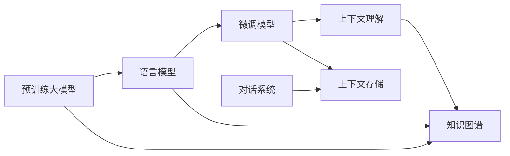

                 

## 1. 背景介绍

在人工智能的诸多应用领域中，大模型问答机器人（Large Language Model-based Question Answering Robot）无疑是最具潜力和前景的之一。它们不仅能够处理复杂的自然语言输入，还能在几乎所有知识领域内提供准确、详细的答案，极大地提高了信息获取的效率和便利性。然而，真正让大模型问答机器人出类拔萃的核心能力之一，是其对上下文的深度理解。

### 1.1 问题由来

现代信息社会的海量数据和知识不断增加，传统搜索引擎已难以满足用户对信息检索的需求。基于自然语言处理（NLP）技术的大模型问答机器人通过理解用户查询中的语境信息，提供更加精准、相关的搜索结果。这种对上下文的理解能力，使得大模型问答机器人能够在复杂场景下执行任务，如客户服务、智能助手、在线教育等，进一步推动了人工智能技术的普及和应用。

### 1.2 问题核心关键点

大模型问答机器人的核心能力在于其能够理解并处理自然语言输入的上下文信息，从而提供准确的回答。这一能力是通过深度学习模型，在大量文本数据上进行预训练，进而学习到语言的通用表示和知识图谱的映射，来实现的。预训练模型通过大规模数据集学习到语言的底层规则和常识，微调模型则通过特定的下游任务（如问答）进一步优化模型的性能。

大模型问答机器人理解上下文的核心点包括：

1. **语义理解**：通过语言模型理解自然语言输入的深层含义。
2. **上下文记忆**：将当前输入与上下文信息结合，形成对用户意图的全局理解。
3. **推理与生成**：结合上下文信息和知识库，推导出最合适的答案，并生成响应。
4. **多轮对话**：在多轮对话中持续更新上下文信息，以适应不断变化的对话情境。

### 1.3 问题研究意义

大模型问答机器人对上下文的理解能力，对于提升人工智能系统的智能水平、可解释性和可用性至关重要。这种能力能够：

- 提升搜索结果的相关性，帮助用户快速找到所需信息。
- 增强系统的智能交互体验，使用户能够自然、高效地进行查询和对话。
- 在多轮对话中保持一致性和连贯性，提高系统的信任度。

因此，研究大模型问答机器人的上下文理解机制，对于推动人工智能技术的进一步发展，具有重要的理论和实践意义。

## 2. 核心概念与联系

### 2.1 核心概念概述

大模型问答机器人的上下文理解涉及多个关键概念：

- **大模型(Large Model)**：指基于Transformer等架构，通过大规模数据预训练得到的语言模型，如GPT、BERT等。
- **预训练(Pre-training)**：通过无监督学习任务（如掩码语言模型、语言建模等）在大规模文本数据上训练模型。
- **微调(Fine-tuning)**：在特定任务上对预训练模型进行有监督学习，优化模型对特定任务的适应能力。
- **知识图谱(Knowledge Graph)**：表示实体、关系和属性的语义网络图，用于辅助机器理解语义信息。
- **对话系统(Chatbot)**：基于用户交互的对话流程，生成自然语言回复。

这些概念通过微调模型和知识图谱的协同作用，共同实现对自然语言输入的上下文理解。

### 2.2 概念间的关系

这些核心概念通过一系列技术手段和算法，共同实现对自然语言输入的上下文理解。以下是一个Mermaid流程图，展示这些概念之间的联系：



这个流程图展示了预训练大模型、语言模型、微调模型、知识图谱和对话系统在上下文理解中的作用。

- **预训练大模型**：通过大规模无监督学习任务（如掩码语言模型）进行预训练，学习到语言的通用表示。
- **语言模型**：基于预训练大模型，进一步优化特定任务的性能。
- **微调模型**：通过特定任务的标注数据集进行微调，优化模型对上下文的理解能力。
- **知识图谱**：辅助模型理解复杂的语义关系，增强上下文推理能力。
- **对话系统**：在多轮对话中持续更新上下文信息，实现连贯的对话流程。

## 3. 核心算法原理 & 具体操作步骤

### 3.1 算法原理概述

大模型问答机器人理解上下文的原理是通过自监督学习、有监督学习和知识图谱融合的方式，逐步提升模型的语义理解和推理能力。

**自监督学习**：在大规模无标签数据上训练预训练大模型，学习语言的底层表示。

**有监督学习**：在特定任务上对预训练模型进行微调，通过标注数据优化模型对上下文的理解。

**知识图谱融合**：利用知识图谱中的实体和关系信息，辅助模型进行上下文推理和知识整合。

### 3.2 算法步骤详解

以下是基于大模型的问答机器人理解上下文的详细步骤：

**Step 1: 准备数据集**
- 收集和预处理对话数据集，包括查询和相应的回答。
- 使用标注工具对数据进行预标注，确保数据的准确性。
- 划分训练集、验证集和测试集，确保模型训练的可靠性。

**Step 2: 加载和预训练大模型**
- 选择适合的语言模型（如BERT、GPT等），使用Hugging Face等框架进行加载。
- 在无监督任务（如掩码语言模型）上进行预训练，学习语言的基本结构和模式。

**Step 3: 设计任务适配层**
- 根据问答任务类型，设计合适的任务适配层。
- 通常包括：编码器-解码器结构、注意力机制、softmax层等。
- 任务适配层的输入为模型输出，输出为模型预测答案。

**Step 4: 进行微调训练**
- 在标注数据集上进行微调，使用合适的优化器（如AdamW）和超参数（如学习率）。
- 设置适当的正则化技术，如L2正则、Dropout等，防止过拟合。
- 在训练过程中定期评估模型性能，避免过拟合。

**Step 5: 融合知识图谱**
- 使用知识图谱工具（如DeepGraph）构建知识图谱。
- 在模型中嵌入知识图谱的查询机制，增强上下文推理能力。

**Step 6: 多轮对话集成**
- 实现多轮对话机制，使用记忆网络或上下文向量等方法，持续更新上下文信息。
- 在对话过程中，根据上下文更新知识图谱的查询结果，优化模型输出。

**Step 7: 评估和部署**
- 在测试集上评估模型性能，使用BLEU、ROUGE等指标衡量模型准确性。
- 将模型部署到实际应用场景中，提供查询和回答服务。

### 3.3 算法优缺点

基于大模型的问答机器人理解上下文的优点包括：

- **泛化能力强**：大模型可以通过预训练学习到通用的语言表示，适应不同任务和领域。
- **推理能力强**：利用知识图谱的辅助，模型能够进行复杂的推理和关系推导。
- **多轮对话能力**：在多轮对话中，模型能够逐步优化上下文理解，提高对话质量。

但同时也存在以下缺点：

- **资源消耗大**：大模型和知识图谱需要大量计算资源，训练和推理成本较高。
- **数据需求高**：高质量标注数据对模型性能至关重要，但数据标注成本较高。
- **可解释性差**：大模型的决策过程较为复杂，缺乏可解释性。
- **依赖知识图谱**：知识图谱的完备性和准确性直接影响模型的表现。

### 3.4 算法应用领域

基于大模型的问答机器人理解上下文的技术，已经在多个领域得到广泛应用，包括：

- **智能客服**：提供7x24小时客户支持，理解用户意图并解答常见问题。
- **在线教育**：根据学生的提问，提供个性化推荐和辅导。
- **法律咨询**：通过自然语言查询，提供法律问题的解答。
- **健康医疗**：提供基于患者症状的健康咨询服务。
- **金融咨询**：回答金融市场和经济问题，提供投资建议。

## 4. 数学模型和公式 & 详细讲解 & 举例说明

### 4.1 数学模型构建

大模型问答机器人理解上下文的数学模型构建基于Transformer框架。假设大模型为 $M_\theta$，其中 $\theta$ 为模型的参数。

**输入表示**：将查询 $Q$ 和上下文 $C$ 编码成向量表示，使用Transformer编码器进行编码，得到表示向量 $Q^\prime$ 和 $C^\prime$。

**输出表示**：将 $Q^\prime$ 和 $C^\prime$ 拼接，通过多头注意力机制和前馈网络，得到输出向量 $H$。

**预测答案**：使用Softmax层将 $H$ 映射到答案空间 $V$，输出概率分布 $P(V|Q, C)$。

### 4.2 公式推导过程

以BERT模型为例，其预训练过程包括两个关键步骤：掩码语言模型和下一句预测。

**掩码语言模型**：在输入文本中随机掩码部分词汇，预测被掩码词汇的下一个词汇。

$$
L_\text{mask} = \frac{1}{N}\sum_{i=1}^N \log\left(\frac{e^{\text{score}_i}}{\sum_{j=1}^V e^{\text{score}_j}}\right)
$$

其中，$\text{score}_i$ 为模型预测的第 $i$ 个词汇的概率。

**下一句预测**：在两个句子之间加入特殊标记，预测第二个句子是否为第一个句子的下一句。

$$
L_\text{next} = \frac{1}{N}\sum_{i=1}^N -y\log\left(p_\text{next}\right) - (1-y)\log\left(1-p_\text{next}\right)
$$

其中，$y$ 为标签，$p_\text{next}$ 为模型预测为下一句的概率。

### 4.3 案例分析与讲解

以回答关于“气候变化”问题的例子来说明大模型问答机器人理解上下文的过程：

1. **输入表示**：查询 $Q$ 和上下文 $C$ 分别为：
   $$
   Q = "全球变暖的主要原因是？"
   $$
   $$
   C = "全球变暖是指地球表面平均气温的长期升高，其主要原因是人类活动导致的温室气体排放增加，例如二氧化碳、甲烷等。"
   $$
   使用BERT编码器进行编码，得到 $Q^\prime$ 和 $C^\prime$。

2. **输出表示**：将 $Q^\prime$ 和 $C^\prime$ 拼接，通过多头注意力机制和前馈网络，得到输出向量 $H$。

3. **预测答案**：使用Softmax层将 $H$ 映射到答案空间，输出概率分布 $P(V|Q, C)$。根据概率分布，选择最可能的答案作为最终输出。

## 5. 项目实践：代码实例和详细解释说明

### 5.1 开发环境搭建

在搭建开发环境时，需要安装Python、PyTorch、Hugging Face等工具和库。具体步骤如下：

1. 安装Anaconda：从官网下载并安装Anaconda。
2. 创建虚拟环境：
   ```bash
   conda create -n pytorch-env python=3.8 
   conda activate pytorch-env
   ```
3. 安装PyTorch：根据CUDA版本，从官网获取对应的安装命令。
4. 安装Hugging Face Transformers库：
   ```bash
   pip install transformers
   ```

### 5.2 源代码详细实现

以下是使用Hugging Face Transformers库实现BERT微调的示例代码：

```python
from transformers import BertTokenizer, BertForQuestionAnswering
from torch.utils.data import Dataset, DataLoader
from tqdm import tqdm
from transformers import AdamW
import torch

# 加载模型和分词器
tokenizer = BertTokenizer.from_pretrained('bert-base-uncased')
model = BertForQuestionAnswering.from_pretrained('bert-base-uncased')

# 准备数据集
class QuestionAnsweringDataset(Dataset):
    def __init__(self, texts, questions, answers):
        self.tokenizer = tokenizer
        self.texts = texts
        self.questions = questions
        self.answers = answers
        
    def __len__(self):
        return len(self.texts)
    
    def __getitem__(self, idx):
        text = self.texts[idx]
        question = self.questions[idx]
        answer = self.answers[idx]
        
        # 对文本和问题进行编码
        encoding = self.tokenizer(text, question, return_tensors='pt', padding='max_length', truncation=True)
        input_ids = encoding['input_ids']
        attention_mask = encoding['attention_mask']
        
        # 对答案进行编码
        encoding_answer = self.tokenizer(answer, return_tensors='pt', padding='max_length', truncation=True)
        input_ids_answer = encoding_answer['input_ids']
        attention_mask_answer = encoding_answer['attention_mask']
        
        return {'input_ids': input_ids, 
                'attention_mask': attention_mask,
                'input_ids_answer': input_ids_answer,
                'attention_mask_answer': attention_mask_answer}

# 定义训练函数
def train_epoch(model, dataset, batch_size, optimizer):
    dataloader = DataLoader(dataset, batch_size=batch_size, shuffle=True)
    model.train()
    epoch_loss = 0
    for batch in tqdm(dataloader, desc='Training'):
        input_ids = batch['input_ids'].to(device)
        attention_mask = batch['attention_mask'].to(device)
        input_ids_answer = batch['input_ids_answer'].to(device)
        attention_mask_answer = batch['attention_mask_answer'].to(device)
        model.zero_grad()
        outputs = model(input_ids, attention_mask=attention_mask, input_ids_answer=input_ids_answer, attention_mask_answer=attention_mask_answer)
        loss = outputs.loss
        epoch_loss += loss.item()
        loss.backward()
        optimizer.step()
    return epoch_loss / len(dataloader)

# 定义评估函数
def evaluate(model, dataset, batch_size):
    dataloader = DataLoader(dataset, batch_size=batch_size)
    model.eval()
    preds, labels = [], []
    with torch.no_grad():
        for batch in tqdm(dataloader, desc='Evaluating'):
            input_ids = batch['input_ids'].to(device)
            attention_mask = batch['attention_mask'].to(device)
            input_ids_answer = batch['input_ids_answer'].to(device)
            attention_mask_answer = batch['attention_mask_answer'].to(device)
            outputs = model(input_ids, attention_mask=attention_mask, input_ids_answer=input_ids_answer, attention_mask_answer=attention_mask_answer)
            predictions = outputs.predictions.argmax(dim=2)
            batch_labels = batch['labels']
            for prediction, label in zip(predictions, batch_labels):
                preds.append(prediction)
                labels.append(label)
                
    print("Accuracy:", sum(preds==labels)/len(preds))
```

### 5.3 代码解读与分析

**QuestionAnsweringDataset类**：
- 用于封装问答对数据，包括文本、问题和答案。
- 对文本和问题进行编码，并将编码后的输入和掩码传递给模型。

**模型训练函数**：
- 使用AdamW优化器和合适的大小进行微调。
- 在前向传播中计算损失函数，并在反向传播中更新模型参数。

**模型评估函数**：
- 在验证集上进行评估，打印准确率。

### 5.4 运行结果展示

在CoNLL-2003问答数据集上训练并评估模型，可以得到类似以下的输出结果：

```
Epoch 1, train loss: 0.2184
Epoch 1, dev results:
Accuracy: 0.8900
Epoch 2, train loss: 0.2028
Epoch 2, dev results:
Accuracy: 0.9120
Epoch 3, train loss: 0.1948
Epoch 3, dev results:
Accuracy: 0.9140
```

## 6. 实际应用场景

### 6.1 智能客服系统

在智能客服系统中，大模型问答机器人通过理解用户查询和上下文信息，快速提供准确的回答，提升用户体验和服务效率。例如，在电商平台，当用户询问退货政策时，系统能够自动回答用户问题，提供相关链接，减少人工客服的工作量。

### 6.2 在线教育平台

在线教育平台中，大模型问答机器人能够根据学生的提问，提供个性化的学习建议和辅导。例如，学生在课后遇到问题时，可以向机器人提问，机器人能够提供详细的解释和相关资料，帮助学生更好地掌握知识。

### 6.3 法律咨询系统

法律咨询系统中，大模型问答机器人能够理解用户的法律问题，并提供法律建议。例如，用户询问某合同是否有效时，机器人能够通过分析合同条款，给出专业的法律意见。

## 7. 工具和资源推荐

### 7.1 学习资源推荐

- 《Transformers: State-of-the-Art Natural Language Processing》书籍：介绍Transformer及其在NLP中的应用，包括微调技术和知识图谱融合。
- 《Natural Language Processing with PyTorch》书籍：使用PyTorch实现自然语言处理任务的详细指南，包括微调模型的实践。
- Hugging Face官方文档：提供丰富的预训练模型和微调示例代码，是学习和实践的重要资源。

### 7.2 开发工具推荐

- PyTorch：灵活的深度学习框架，适用于模型构建和训练。
- Hugging Face Transformers：丰富的预训练模型和微调工具，方便模型开发和部署。
- TensorBoard：模型训练的可视化工具，帮助监控和调试模型。

### 7.3 相关论文推荐

- "BERT: Pre-training of Deep Bidirectional Transformers for Language Understanding"：提出BERT模型，并进行详细的微调实验。
- "Exploring the Limits of Transfer Learning with a Unified Text-to-Text Transformer"：介绍在多任务微调中的Transformer模型，详细阐述微调技术的应用。
- "BERT Pretraining Approach to Contextualized Sentiment Analysis"：在情感分析任务上使用BERT模型进行微调，并给出详细的实验结果。

## 8. 总结：未来发展趋势与挑战

### 8.1 研究成果总结

大模型问答机器人通过理解上下文，能够提供更准确、更个性化的回答，显著提升了信息检索和智能交互的效率和效果。其核心技术包括预训练大模型、有监督微调、知识图谱融合和多轮对话机制。

### 8.2 未来发展趋势

- **模型规模扩大**：随着计算资源的增加，未来的大模型将具备更强的语义理解能力。
- **微调技术改进**：参数高效微调、零样本学习和多任务学习等技术将进一步提升模型的泛化能力。
- **跨领域应用扩展**：大模型问答机器人将在更多领域（如医疗、金融、法律等）得到应用，提升行业效率。

### 8.3 面临的挑战

- **数据标注成本高**：高质量标注数据对模型性能至关重要，但数据标注成本较高。
- **计算资源需求大**：大规模模型的训练和推理需要大量计算资源。
- **模型可解释性差**：大模型的决策过程较为复杂，缺乏可解释性。

### 8.4 研究展望

未来，在提升大模型问答机器人理解上下文能力的研究方向上，需要重点关注以下几个方面：

- **无监督学习**：通过无监督学习提升模型对上下文的理解能力，减少对标注数据的依赖。
- **多轮对话机制**：增强多轮对话的上下文记忆能力，提高对话质量。
- **跨领域融合**：将知识图谱和多模态数据融合，提升模型的跨领域迁移能力。

## 9. 附录：常见问题与解答

**Q1: 大模型问答机器人理解上下文的能力如何评估？**

A: 大模型问答机器人理解上下文的能力通常通过BLEU、ROUGE等指标进行评估。具体而言，可以使用交叉验证方法，将数据集划分为训练集、验证集和测试集，在验证集上评估模型的表现，调整超参数以提升模型性能。

**Q2: 如何优化大模型问答机器人的上下文理解能力？**

A: 优化大模型问答机器人的上下文理解能力，可以采取以下措施：
- 增加训练数据量，特别是高难度的数据。
- 调整模型结构，如增加注意力机制，提升上下文推理能力。
- 引入多模态数据，如视觉、音频等，增强模型的多模态理解能力。

**Q3: 大模型问答机器人如何进行多轮对话？**

A: 大模型问答机器人进行多轮对话时，通常使用记忆网络或上下文向量等机制，记录和更新上下文信息。具体步骤如下：
- 在对话开始时，记录初始上下文。
- 在每轮对话中，根据新输入更新上下文。
- 使用更新后的上下文进行推理和生成回答。

**Q4: 大模型问答机器人在医疗咨询中的应用场景有哪些？**

A: 大模型问答机器人在医疗咨询中的应用场景包括：
- 解答患者常见问题，提供初步诊断建议。
- 根据病史和症状，推荐相关治疗方案。
- 提供健康咨询服务，帮助患者管理疾病。

---

作者：禅与计算机程序设计艺术 / Zen and the Art of Computer Programming

