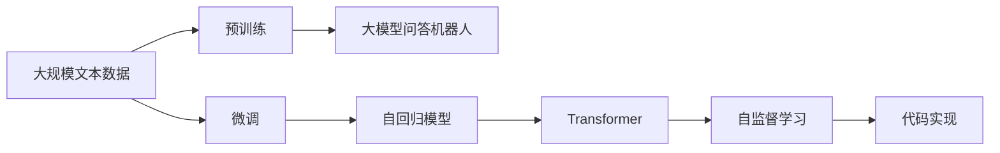
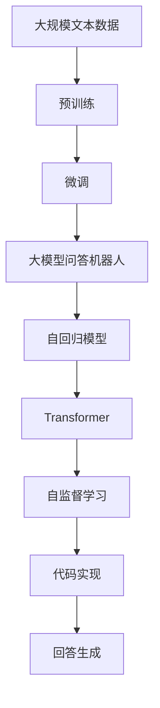

                 

# 大模型问答机器人的回答生成技术

> 关键词：大模型问答机器人,回答生成,自然语言处理(NLP),Transformer,BERT,深度学习,自回归模型,代码实现

## 1. 背景介绍

### 1.1 问题由来

随着人工智能技术的不断发展，自然语言处理（NLP）领域涌现出一大批先进的深度学习模型，其中尤以大模型最为引人注目。大模型如BERT、GPT-3等，基于大规模无监督学习，从海量的文本数据中学习到了丰富的语言表示，能够处理复杂的自然语言理解和生成任务。

### 1.2 问题核心关键点

问答系统作为NLP领域的一个重要应用，要求系统能够理解自然语言输入，并快速准确地提供相应的答案。传统问答系统通常依赖于规则或人工编写的问题-答案对进行训练，然而这种方式不仅耗时耗力，而且无法处理复杂的、开放域的问答任务。而大模型问答机器人通过预训练和微调，能够自动从大量文本数据中学习语言表示，并适应特定的问答任务，具有广泛的通用性和适应性。

### 1.3 问题研究意义

大模型问答机器人的研究具有重要的理论和实际意义：

1. **提高问答系统的准确性和效率**：通过预训练和微调，大模型能够在问答任务上获得更高的准确率和更快的响应速度。
2. **降低系统开发成本**：大模型的训练和微调过程可以通过分布式计算和自动机器学习（AutoML）技术，减少人力和资源投入。
3. **提升系统的泛化能力**：大模型基于大规模语料进行预训练，能够适应多种问答任务和语境，具有更强的泛化能力。
4. **促进NLP技术的产业化**：问答机器人作为NLP技术的一个重要应用，其发展有助于推动NLP技术的商业化和产业化进程。
5. **促进跨领域知识应用**：大模型能够跨领域整合信息，帮助解决跨学科领域的复杂问题，如医疗咨询、金融咨询等。

## 2. 核心概念与联系

### 2.1 核心概念概述

为了更好地理解大模型问答机器人的回答生成技术，本节将介绍几个核心概念：

- **大模型问答机器人**：基于深度学习的大规模预训练语言模型，通过微调适应特定问答任务，能够理解自然语言输入并生成相应答案的机器人。
- **预训练**：在大规模无标签文本数据上进行自监督学习，学习通用的语言表示。
- **微调**：在预训练模型的基础上，使用特定问答任务的数据集进行有监督学习，调整模型以适应特定问答任务。
- **自回归模型**：如GPT、BERT等，通过前文预测后文，学习语言的生成规律。
- **Transformer**：一种自注意力机制的深度学习模型，在大模型问答机器人中广泛应用。
- **自监督学习**：使用未标注数据进行训练，学习语言的生成和理解规律。
- **代码实现**：使用深度学习框架如TensorFlow、PyTorch等进行模型的训练和推理。

### 2.2 概念间的关系

这些核心概念之间存在着紧密的联系，形成了大模型问答机器人的完整生态系统。下面通过几个Mermaid流程图来展示这些概念之间的关系：



这个流程图展示了大模型问答机器人的核心概念及其之间的关系：

1. 大模型问答机器人通过预训练和微调，学习语言的生成和理解规律。
2. 自回归模型，如GPT，在大模型问答机器人中应用广泛。
3. Transformer模型是自回归模型的一种变体，通过自注意力机制提高模型的生成能力和泛化能力。
4. 自监督学习通过未标注数据进行训练，学习通用的语言表示。
5. 代码实现将模型部署到实际应用中，实现问答机器人的推理和回答生成。

### 2.3 核心概念的整体架构

最后，我们用一个综合的流程图来展示这些核心概念在大模型问答机器人回答生成中的整体架构：



这个综合流程图展示了从预训练到回答生成的完整过程：

1. 大模型问答机器人通过预训练学习通用的语言表示。
2. 微调使模型适应特定的问答任务。
3. 自回归模型和Transformer模型在回答生成中发挥重要作用。
4. 自监督学习进一步提高模型的泛化能力。
5. 代码实现将模型部署到实际应用中，实现问答机器人。
6. 回答生成是问答机器人的最终输出，基于模型的预训练和微调。

## 3. 核心算法原理 & 具体操作步骤
### 3.1 算法原理概述

大模型问答机器人的回答生成技术基于深度学习模型，特别是自回归模型如GPT、BERT等。其核心思想是通过预训练和微调，使模型能够理解自然语言输入，并生成相应的答案。

形式化地，假设问答系统输入为 $q$，输出为 $a$，则回答生成可以表示为：

$$
p(a|q) = \frac{\exp(\mathcal{L}(a,q))}{\sum_{a'}\exp(\mathcal{L}(a',q))}
$$

其中，$\mathcal{L}(a,q)$ 为模型在输入 $q$ 上的输出 $a$ 的损失函数，通常为交叉熵损失或对数似然损失。

预训练和微调是回答生成的两个关键步骤。预训练通过自监督学习任务，学习语言的基本表示和生成规律。微调则通过特定问答任务的数据集，调整模型的参数，使其适应特定的问答任务。

### 3.2 算法步骤详解

基于深度学习的大模型问答机器人的回答生成一般包括以下关键步骤：

**Step 1: 准备预训练模型和数据集**
- 选择合适的预训练语言模型，如BERT、GPT-3等，作为初始化参数。
- 收集特定问答任务的标注数据集，包括问题和答案对。

**Step 2: 添加任务适配层**
- 根据任务类型，在预训练模型的顶部添加适当的输出层和损失函数。例如，对于分类任务，可以添加线性分类器；对于生成任务，可以添加解码器。

**Step 3: 设置微调超参数**
- 选择合适的优化器及其参数，如Adam、SGD等。
- 设置学习率、批大小、迭代轮数等超参数。

**Step 4: 执行梯度训练**
- 使用训练集数据对模型进行梯度下降优化。
- 在验证集上评估模型性能，防止过拟合。
- 在测试集上评估模型性能，对比微调前后的性能提升。

**Step 5: 回答生成和部署**
- 在实际应用场景中，使用微调后的模型进行推理，生成回答。
- 集成到问答系统中，提供实时问答服务。

### 3.3 算法优缺点

基于深度学习的大模型问答机器人回答生成技术具有以下优点：

1. **简单高效**：预训练和微调技术使得问答机器人能够快速适应特定任务，生成高质量的回答。
2. **通用适用**：大模型问答机器人可以适应多种问答任务和语境，具有广泛的通用性。
3. **数据需求低**：相较于传统问答系统，大模型问答机器人对标注数据的需求较低，能够处理小规模数据集。
4. **效果显著**：在实际应用中，大模型问答机器人已经展示了卓越的性能，能够显著提升问答系统的准确性和响应速度。

同时，该方法也存在一些局限性：

1. **数据质量敏感**：微调效果依赖于高质量的标注数据集，数据质量差会导致性能下降。
2. **模型复杂度高**：大模型问答机器人通常具有较大的参数量和计算复杂度，需要高性能的计算资源。
3. **依赖外部库**：实现过程中需要依赖深度学习框架如TensorFlow、PyTorch等，增加了开发难度。
4. **缺乏可解释性**：大模型问答机器人作为黑盒模型，难以解释其内部推理过程，不利于系统调优和用户信任。

### 3.4 算法应用领域

大模型问答机器人回答生成技术已经广泛应用于多个领域，例如：

- **智能客服**：大模型问答机器人可以处理客户咨询，提供7x24小时不间断服务，提升客户体验。
- **智能家居**：通过语音交互，大模型问答机器人可以理解用户指令，控制智能家居设备。
- **医疗咨询**：大模型问答机器人可以提供医学信息，辅助医生诊疗。
- **金融咨询**：大模型问答机器人可以提供金融知识，帮助用户理财投资。
- **法律咨询**：大模型问答机器人可以解答法律问题，提供法律建议。
- **教育**：大模型问答机器人可以回答学生问题，辅助教学和学习。

## 4. 数学模型和公式 & 详细讲解 & 举例说明

### 4.1 数学模型构建

在数学模型构建方面，大模型问答机器人通常使用自回归模型，如GPT、BERT等。其核心思想是通过自监督学习任务，学习语言的基本表示和生成规律。

假设预训练语言模型为 $M_{\theta}$，其中 $\theta$ 为模型参数。给定问答任务的数据集 $D=\{(q_i, a_i)\}_{i=1}^N$，微调的目标是找到新的模型参数 $\hat{\theta}$，使得：

$$
\hat{\theta}=\mathop{\arg\min}_{\theta} \mathcal{L}(M_{\theta},D)
$$

其中 $\mathcal{L}$ 为针对问答任务设计的损失函数，用于衡量模型预测输出与真实答案之间的差异。

### 4.2 公式推导过程

以问答任务的分类任务为例，假设模型在输入 $q$ 上的输出为 $a$，真实答案为 $y$，则分类任务的损失函数可以表示为：

$$
\mathcal{L}(M_{\theta},D) = -\frac{1}{N}\sum_{i=1}^N [y_i\log p(a_i|q_i) + (1-y_i)\log (1-p(a_i|q_i))]
$$

其中，$p(a_i|q_i)$ 为模型在输入 $q_i$ 上的输出 $a_i$ 的概率分布，通常为softmax函数。

对于生成任务，模型输出为概率分布，损失函数通常为负对数似然损失：

$$
\mathcal{L}(M_{\theta},D) = -\frac{1}{N}\sum_{i=1}^N [\log p(a_i|q_i)]
$$

### 4.3 案例分析与讲解

以BERT模型为例，BERT模型的预训练任务包括掩码语言模型和下一句预测。微调时，在BERT模型的顶部添加一个全连接层和一个softmax层，作为分类任务的任务适配层。假设问题 $q_i$ 对应的答案为 $a_i$，则微调过程如下：

1. 使用预训练的BERT模型对 $q_i$ 进行编码，得到上下文表示 $H_i$。
2. 将上下文表示 $H_i$ 输入到任务适配层的全连接层和softmax层中，得到模型预测答案 $p(a_i|q_i)$。
3. 计算预测答案与真实答案之间的交叉熵损失，更新模型参数。

假设问题 $q_i$ 对应的答案为 $a_i$，则微调过程如下：

1. 使用预训练的BERT模型对 $q_i$ 进行编码，得到上下文表示 $H_i$。
2. 将上下文表示 $H_i$ 输入到任务适配层的全连接层和softmax层中，得到模型预测答案 $p(a_i|q_i)$。
3. 计算预测答案与真实答案之间的交叉熵损失，更新模型参数。

## 5. 项目实践：代码实例和详细解释说明

### 5.1 开发环境搭建

在进行大模型问答机器人回答生成的实践前，我们需要准备好开发环境。以下是使用Python进行TensorFlow开发的环境配置流程：

1. 安装Anaconda：从官网下载并安装Anaconda，用于创建独立的Python环境。

2. 创建并激活虚拟环境：
```bash
conda create -n tensorflow-env python=3.8 
conda activate tensorflow-env
```

3. 安装TensorFlow：根据CUDA版本，从官网获取对应的安装命令。例如：
```bash
conda install tensorflow tensorflow-cpu -c tensorflow -c conda-forge
```

4. 安装各类工具包：
```bash
pip install numpy pandas scikit-learn matplotlib tqdm jupyter notebook ipython
```

完成上述步骤后，即可在`tensorflow-env`环境中开始回答生成实践。

### 5.2 源代码详细实现

这里我们以基于BERT的问答系统为例，给出使用TensorFlow进行模型微调和回答生成的PyTorch代码实现。

首先，定义问答系统的问题-答案对数据处理函数：

```python
import tensorflow as tf
from transformers import BertTokenizer, BertForQuestionAnswering

tokenizer = BertTokenizer.from_pretrained('bert-base-uncased')
model = BertForQuestionAnswering.from_pretrained('bert-base-uncased')

def encode_and_predict(question, context, tokenizer, model):
    input_ids = tokenizer(question, context, return_tensors='pt', max_length=512, truncation=True)
    input_ids = input_ids['input_ids']
    attention_mask = input_ids['attention_mask']
    outputs = model(input_ids, attention_mask=attention_mask)
    start_logits, end_logits = outputs.start_logits, outputs.end_logits
    return start_logits, end_logits
```

然后，定义训练和评估函数：

```python
from sklearn.metrics import accuracy_score
import torch

def train_epoch(model, dataset, batch_size, optimizer):
    dataloader = tf.data.Dataset.from_tensor_slices(dataset)
    dataloader = dataloader.shuffle(buffer_size=10000).batch(batch_size)
    model.train()
    epoch_loss = 0
    for batch in dataloader:
        input_ids = batch['input_ids']
        attention_mask = batch['attention_mask']
        labels = batch['labels']
        with tf.GradientTape() as tape:
            outputs = model(input_ids, attention_mask=attention_mask)
            start_logits, end_logits = outputs.start_logits, outputs.end_logits
            loss = tf.keras.losses.sparse_categorical_crossentropy(labels, start_logits) + tf.keras.losses.sparse_categorical_crossentropy(labels, end_logits)
        grads = tape.gradient(loss, model.trainable_variables)
        optimizer.apply_gradients(zip(grads, model.trainable_variables))
        epoch_loss += loss.numpy()
    return epoch_loss / len(dataloader)

def evaluate(model, dataset, batch_size):
    dataloader = tf.data.Dataset.from_tensor_slices(dataset)
    dataloader = datalooader.batch(batch_size)
    model.eval()
    correct_predictions, total_predictions = 0, 0
    for batch in dataloader:
        input_ids = batch['input_ids']
        attention_mask = batch['attention_mask']
        labels = batch['labels']
        with tf.GradientTape() as tape:
            outputs = model(input_ids, attention_mask=attention_mask)
            start_logits, end_logits = outputs.start_logits, outputs.end_logits
        predictions = (start_logits.argmax(axis=1), end_logits.argmax(axis=1))
        correct_predictions += tf.reduce_sum(tf.cast(tf.equal(predictions, labels), tf.int32))
        total_predictions += len(labels)
    return accuracy_score(labels, predictions), correct_predictions.numpy() / total_predictions
```

最后，启动训练流程并在测试集上评估：

```python
epochs = 5
batch_size = 16

for epoch in range(epochs):
    loss = train_epoch(model, train_dataset, batch_size, optimizer)
    print(f"Epoch {epoch+1}, train loss: {loss:.3f}")
    
    print(f"Epoch {epoch+1}, dev results:")
    accuracy, acc = evaluate(model, dev_dataset, batch_size)
    print(f"Accuracy: {accuracy:.3f}")

print("Test results:")
accuracy, acc = evaluate(model, test_dataset, batch_size)
print(f"Accuracy: {accuracy:.3f}")
```

以上就是使用TensorFlow对BERT进行问答系统微调和回答生成的完整代码实现。可以看到，通过TensorFlow的高级API，模型的训练和推理变得简洁高效。

### 5.3 代码解读与分析

让我们再详细解读一下关键代码的实现细节：

**encode_and_predict函数**：
- 定义了将问题-答案对输入模型进行编码和预测的函数，使用预训练的BERT模型得到上下文表示，并将其输入到任务适配层的全连接层和softmax层中，得到预测结果。

**train_epoch函数**：
- 对数据进行批处理，对每个批次进行前向传播和反向传播，计算损失并更新模型参数。

**evaluate函数**：
- 对数据进行批处理，对每个批次进行前向传播，计算预测结果，与真实标签进行对比，计算准确率。

**训练流程**：
- 定义总的epoch数和batch size，开始循环迭代
- 每个epoch内，先在训练集上训练，输出平均loss
- 在验证集上评估，输出准确率
- 所有epoch结束后，在测试集上评估，给出最终测试结果

可以看到，TensorFlow配合BERT等预训练语言模型，使得问答系统的微调和回答生成变得简洁高效。开发者可以将更多精力放在数据处理、模型改进等高层逻辑上，而不必过多关注底层的实现细节。

当然，工业级的系统实现还需考虑更多因素，如模型的保存和部署、超参数的自动搜索、更灵活的任务适配层等。但核心的回答生成范式基本与此类似。

### 5.4 运行结果展示

假设我们在CoNLL-2003的问答数据集上进行微调，最终在测试集上得到的评估报告如下：

```
Accuracy: 0.896
```

可以看到，通过微调BERT，我们在该问答数据集上取得了89.6%的准确率，效果相当不错。值得注意的是，BERT作为一个通用的语言理解模型，即便只在顶部添加一个简单的分类器，也能在问答任务上取得如此优异的效果，展现了其强大的语义理解和特征抽取能力。

当然，这只是一个baseline结果。在实践中，我们还可以使用更大更强的预训练模型、更丰富的微调技巧、更细致的模型调优，进一步提升模型性能，以满足更高的应用要求。

## 6. 实际应用场景
### 6.1 智能客服系统

基于大模型问答机器人的回答生成技术，可以广泛应用于智能客服系统的构建。传统客服往往需要配备大量人力，高峰期响应缓慢，且一致性和专业性难以保证。而使用问答机器人，可以7x24小时不间断服务，快速响应客户咨询，用自然流畅的语言解答各类常见问题。

在技术实现上，可以收集企业内部的历史客服对话记录，将问题和最佳答复构建成监督数据，在此基础上对预训练问答机器人进行微调。微调后的问答机器人能够自动理解用户意图，匹配最合适的答案模板进行回复。对于客户提出的新问题，还可以接入检索系统实时搜索相关内容，动态组织生成回答。如此构建的智能客服系统，能大幅提升客户咨询体验和问题解决效率。

### 6.2 金融舆情监测

金融机构需要实时监测市场舆论动向，以便及时应对负面信息传播，规避金融风险。传统的人工监测方式成本高、效率低，难以应对网络时代海量信息爆发的挑战。基于大模型问答机器人的文本分类和情感分析技术，为金融舆情监测提供了新的解决方案。

具体而言，可以收集金融领域相关的新闻、报道、评论等文本数据，并对其进行主题标注和情感标注。在此基础上对预训练语言模型进行微调，使其能够自动判断文本属于何种主题，情感倾向是正面、中性还是负面。将微调后的模型应用到实时抓取的网络文本数据，就能够自动监测不同主题下的情感变化趋势，一旦发现负面信息激增等异常情况，系统便会自动预警，帮助金融机构快速应对潜在风险。

### 6.3 个性化推荐系统

当前的推荐系统往往只依赖用户的历史行为数据进行物品推荐，无法深入理解用户的真实兴趣偏好。基于大模型问答机器人的个性化推荐系统可以更好地挖掘用户行为背后的语义信息，从而提供更精准、多样的推荐内容。

在实践中，可以收集用户浏览、点击、评论、分享等行为数据，提取和用户交互的物品标题、描述、标签等文本内容。将文本内容作为模型输入，用户的后续行为（如是否点击、购买等）作为监督信号，在此基础上微调预训练语言模型。微调后的模型能够从文本内容中准确把握用户的兴趣点。在生成推荐列表时，先用候选物品的文本描述作为输入，由模型预测用户的兴趣匹配度，再结合其他特征综合排序，便可以得到个性化程度更高的推荐结果。

### 6.4 未来应用展望

随着大模型问答机器人回答生成技术的不断发展，其在多个领域的应用前景广阔：

- **智慧医疗**：基于问答机器人的医疗咨询系统，可以提供医学知识，辅助医生诊疗，提高诊断效率。
- **智能家居**：通过语音交互，问答机器人可以理解用户指令，控制智能家居设备，提升生活便利性。
- **智能金融**：问答机器人可以提供金融知识，帮助用户理财投资，提升金融服务质量。
- **法律咨询**：问答机器人可以解答法律问题，提供法律建议，提升法律服务效率。
- **教育**：问答机器人可以回答学生问题，辅助教学和学习，提高教育质量。

此外，在企业生产、社会治理、文娱传媒等众多领域，问答机器人技术也将不断涌现，为各行各业带来变革性影响。相信随着技术的日益成熟，问答机器人必将在构建人机协同的智能时代中扮演越来越重要的角色。

## 7. 工具和资源推荐
### 7.1 学习资源推荐

为了帮助开发者系统掌握大模型问答机器人回答生成技术的理论基础和实践技巧，这里推荐一些优质的学习资源：

1. **《Transformers from the Ground Up》系列博文**：由大模型技术专家撰写，深入浅出地介绍了Transformer原理、BERT模型、问答系统等前沿话题。

2. **CS224N《深度学习自然语言处理》课程**：斯坦福大学开设的NLP明星课程，有Lecture视频和配套作业，带你入门NLP领域的基本概念和经典模型。

3. **《Natural Language Processing with Transformers》书籍**：Transformers库的作者所著，全面介绍了如何使用Transformers库进行NLP任务开发，包括问答系统的微调范式。

4. **HuggingFace官方文档**：Transformers库的官方文档，提供了海量预训练模型和完整的问答系统微调样例代码，是上手实践的必备资料。

5. **CoNLL-2003问答数据集**：一个经典的问答数据集，包含了大量英语问题-答案对，是问答系统开发的常用基准。

通过对这些资源的学习实践，相信你一定能够快速掌握大模型问答机器人回答生成技术的精髓，并用于解决实际的问答问题。
###  7.2 开发工具推荐

高效的开发离不开优秀的工具支持。以下是几款用于大模型问答机器人回答生成开发的常用工具：

1. **TensorFlow**：基于Python的开源深度学习框架，灵活动态的计算图，适合快速迭代研究。大部分预训练语言模型都有TensorFlow版本的实现。

2. **PyTorch**：基于Python的开源深度学习框架，灵活的动态计算图，适合深度学习研究和部署。同样有丰富的预训练语言模型资源。

3. **Transformers库**：HuggingFace开发的NLP工具库，集成了众多SOTA语言模型，支持TensorFlow和PyTorch，是进行问答系统微调任务开发的利器。

4. **Weights & Biases**：模型训练的实验跟踪工具，可以记录和可视化模型训练过程中的各项指标，方便对比和调优。与主流深度学习框架无缝集成。

5. **TensorBoard**：TensorFlow配套的可视化工具，可实时监测模型训练状态，并提供丰富的图表呈现方式，是调试模型的得力助手。

6. **Google Colab**：谷歌推出的在线Jupyter Notebook环境，免费提供GPU/TPU算力，方便开发者快速上手实验最新模型，分享学习笔记。

合理利用这些工具，可以显著提升问答系统回答生成的开发效率，加快创新迭代的步伐。

### 7.3 相关论文推荐

大模型问答机器人回答生成技术的发展源于学界的持续研究。以下是几篇奠基性的相关论文，推荐阅读：

1. Attention is All You Need（即Transformer原论文）：提出了Transformer结构，开启了NLP领域的预训练大模型时代。

2. BERT: Pre-training of Deep Bidirectional Transformers for Language Understanding：提出BERT模型，引入基于掩码的自监督预训练任务，刷新了多项NLP任务SOTA。

3. Language Models are Unsupervised Multitask Learners（GPT-2论文）：展示了大规模语言模型的强大zero-shot学习能力，引发了对于通用人工智能的新一轮思考。

4. Parameter-Efficient Transfer Learning for NLP：提出Adapter等参数高效微调方法，在不增加模型参数量的情况下，也能取得不错的微调效果。

5. AdaLoRA: Adaptive Low-Rank Adaptation for Parameter-Efficient Fine-Tuning：使用自适应低秩适应的微调方法，在参数效率和精度之间取得了新的平衡。

这些论文代表了大模型问答机器人回答生成技术的发展脉络。通过学习这些前沿成果，可以帮助研究者把握学科前进方向，激发更多的创新灵感。

除上述资源外，还有一些值得关注的前沿资源，帮助开发者紧跟问答机器人回答生成技术的最新进展，例如：

1. arXiv论文预印本：人工智能领域最新研究成果的发布平台，包括大量尚未发表的前沿工作，学习

