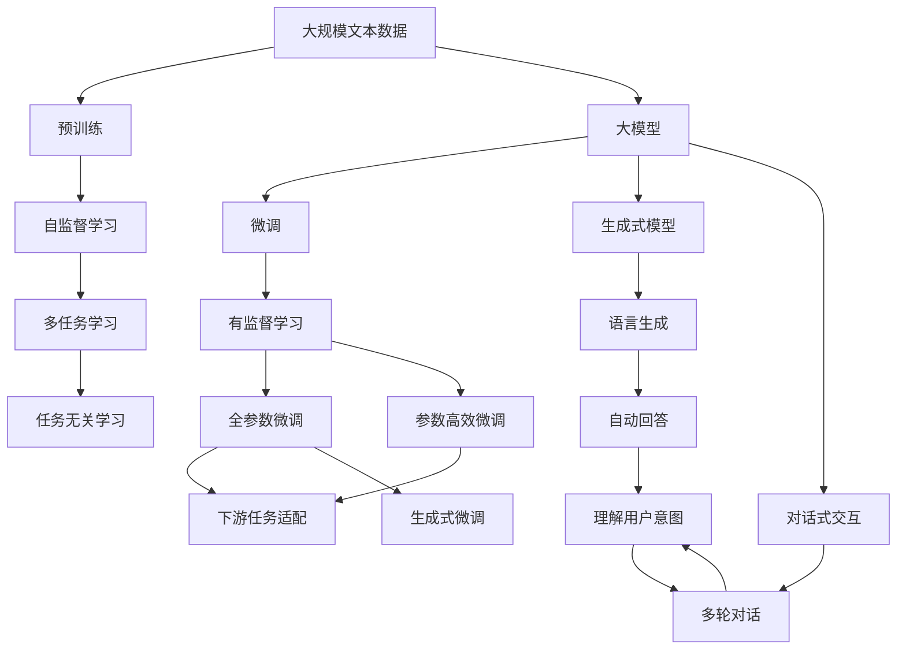
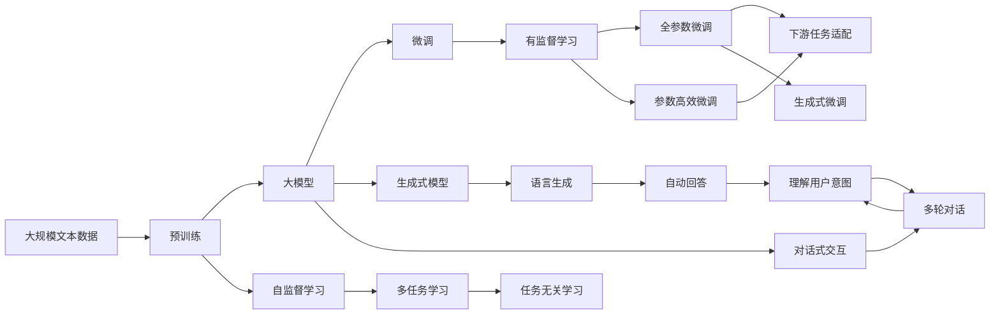
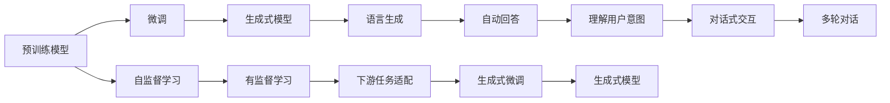

                 

# 大模型问答机器人的对话式交互

> 关键词：大模型,问答机器人,对话式交互,深度学习,自然语言处理,NLP,Transformer,BERT,微调,Fine-Tuning,自然语言理解,生成式模型

## 1. 背景介绍

### 1.1 问题由来
近年来，随着深度学习技术的快速发展，大规模预训练语言模型（Large Pre-trained Language Models, LPLMs）在自然语言处理（NLP）领域取得了巨大成功。尤其是Transformer结构的BERT和GPT等模型，通过在大规模无标签文本数据上进行预训练，学习到了丰富的语言知识和常识，并广泛应用于各种NLP任务。然而，这些通用大模型在特定领域应用时，效果往往难以达到实际应用的要求。因此，如何针对特定领域进行大模型的微调，提升模型性能，成为了当前研究的热点。

### 1.2 问题核心关键点
当前，基于深度学习的大规模语言模型在问答系统（Question Answering, QA）中取得了显著的成果。问答系统通过学习如何回答自然语言问题，广泛应用于智能客服、搜索引擎、教育等领域。大模型的微调技术在其中起到了关键作用，通过在少量标注数据上进行微调，可以显著提升问答系统的准确性和回答质量。

微调的核心在于如何避免过拟合，同时最大程度发挥预训练模型学到的知识。目前主流的做法包括选择合适的学习率、应用正则化技术、保留预训练的部分层、使用对抗样本等方法。通过这些方法，可以在小规模数据集上实现模型的快速适应，从而在特定任务上取得较好的效果。

### 1.3 问题研究意义
研究大模型的微调方法，对于拓展大模型的应用范围，提升下游任务的性能，加速NLP技术的产业化进程，具有重要意义：

1. 降低应用开发成本。基于大模型进行微调，可以显著减少从头开发所需的数据、计算和人力等成本投入。
2. 提升模型效果。微调使得通用大模型更好地适应特定任务，在实际应用场景中取得更优表现。
3. 加速开发进度。standing on the shoulders of giants，微调使得开发者可以更快地完成任务适配，缩短开发周期。
4. 带来技术创新。微调范式促进了对预训练-微调的深入研究，催生了提示学习、少样本学习等新的研究方向。
5. 赋能产业升级。微调使得NLP技术更容易被各行各业所采用，为传统行业数字化转型升级提供新的技术路径。

## 2. 核心概念与联系

### 2.1 核心概念概述

为了更好地理解基于大模型的问答系统，本节将介绍几个密切相关的核心概念：

- 大模型（Large Model）：以Transformer结构为代表的大规模预训练语言模型，通过在大规模无标签文本数据上进行预训练，学习通用的语言表示，具备强大的语言理解和生成能力。

- 预训练（Pre-training）：指在大规模无标签文本语料上，通过自监督学习任务训练通用语言模型的过程。常见的预训练任务包括言语建模、遮挡语言模型等。

- 微调（Fine-tuning）：指在预训练模型的基础上，使用下游任务的少量标注数据，通过有监督学习优化模型在特定任务上的性能。通常只需要调整顶层分类器或解码器，并以较小的学习率更新全部或部分的模型参数。

- 生成式模型（Generative Model）：能够生成自然语言文本的模型，如GPT系列模型。这些模型在语言生成任务上表现优异，可以用于自动回答问题、自动摘要等。

- 对话式交互（Dialogue Interaction）：指问答系统与用户之间的双向沟通过程，通过多轮对话，系统能够逐步理解用户的意图，并给出准确的回答。

- 提示学习（Prompt Learning）：通过在输入文本中添加提示模板，引导大语言模型进行特定任务的推理和生成。可以在不更新模型参数的情况下，实现零样本或少样本学习。

- 少样本学习（Few-shot Learning）：指在只有少量标注样本的情况下，模型能够快速适应新任务的学习方法。在大语言模型中，通常通过在输入中提供少量示例来实现，无需更新模型参数。

- 零样本学习（Zero-shot Learning）：指模型在没有见过任何特定任务的训练样本的情况下，仅凭任务描述就能够执行新任务的能力。大语言模型通过预训练获得的广泛知识，使其能够理解任务指令并生成相应输出。

- 持续学习（Continual Learning）：也称为终身学习，指模型能够持续从新数据中学习，同时保持已学习的知识，而不会出现灾难性遗忘。这对于保持大语言模型的时效性和适应性至关重要。

这些核心概念之间的逻辑关系可以通过以下Mermaid流程图来展示：



这个流程图展示了大模型的核心概念及其之间的关系：

1. 大模型通过预训练获得基础能力。
2. 微调是对预训练模型进行任务特定的优化，可以分为全参数微调和参数高效微调两种方式。
3. 生成式模型能够自动生成语言文本，适合自动问答等任务。
4. 对话式交互是一种多轮对话的过程，系统需要理解用户意图并给出准确的回答。
5. 提示学习可以实现零样本和少样本学习，在特定任务上取得优异效果。
6. 少样本学习和零样本学习是基于大模型预训练知识的应用，无需更新模型参数。
7. 持续学习旨在使模型能够不断学习新知识，同时避免遗忘旧知识。

这些概念共同构成了大模型的学习和应用框架，使其能够在各种场景下发挥强大的语言理解和生成能力。通过理解这些核心概念，我们可以更好地把握大语言模型的工作原理和优化方向。

### 2.2 概念间的关系

这些核心概念之间存在着紧密的联系，形成了大模型的学习应用生态系统。下面通过几个Mermaid流程图来展示这些概念之间的关系。

#### 2.2.1 大模型的学习范式



这个流程图展示了大模型的三种主要学习范式：预训练、微调和生成式模型。预训练主要采用自监督学习方法，而微调则是有监督学习的过程。生成式模型通常使用语言模型的解码器输出概率分布，并以负对数似然为损失函数。

#### 2.2.2 微调与生成式模型的关系



这个流程图展示了微调和生成式模型之间的关系。微调使得通用大模型更好地适应特定任务，生成式模型能够自动生成语言文本，适合自动问答等任务。

#### 2.2.3 对话式交互与提示学习的关系

```mermaid
graph LR
    A[用户] --> B[对话式交互]
    B --> C[多轮对话]
    C --> D[理解用户意图]
    D --> E[生成式模型]
    D --> F[自动回答]
    E --> G[语言生成]
    F --> H[回答]
    G --> I[理解用户意图]
    H --> J[多轮对话]
    I --> K[对话式交互]
    J --> L[多轮对话]
    K --> M[多轮对话]
    L --> N[理解用户意图]
    M --> O[生成式模型]
    N --> P[自动回答]
    O --> Q[多轮对话]
    P --> R[回答]
    Q --> S[对话式交互]
    R --> T[生成式模型]
    S --> U[多轮对话]
    T --> V[理解用户意图]
    U --> W[自动回答]
    V --> X[语言生成]
    W --> Y[回答]
    X --> Z[生成式模型]
    Y --> AA[多轮对话]
    Z --> AB[理解用户意图]
    AA --> AC[生成式模型]
    AB --> AD[自动回答]
    AD --> AE[语言生成]
    AE --> AF[回答]
    AF --> AG[对话式交互]
    AG --> AH[多轮对话]
    AH --> AI[理解用户意图]
    AI --> AJ[生成式模型]
    AJ --> AK[自动回答]
    AK --> AL[语言生成]
    AL --> AM[回答]
    AM --> AN[对话式交互]
    AN --> AO[多轮对话]
    AO --> AP[理解用户意图]
    AP --> AQ[生成式模型]
    AQ --> AR[自动回答]
    AR --> AS[语言生成]
    AS --> AT[回答]
    AT --> AU[对话式交互]
    AU --> AV[多轮对话]
    AV --> AW[理解用户意图]
    AW --> AX[生成式模型]
    AX --> AY[自动回答]
    AY --> AZ[语言生成]
    AZ --> BA[回答]
    BA --> BB[对话式交互]
    BB --> BC[多轮对话]
    BC --> BD[理解用户意图]
    BD --> BE[生成式模型]
    BE --> BF[自动回答]
    BF --> BG[语言生成]
    BG --> BH[回答]
    BH --> BI[对话式交互]
    BI --> BJ[多轮对话]
    BJ --> BK[理解用户意图]
    BK --> BL[生成式模型]
    BL --> BM[自动回答]
    BM --> BN[语言生成]
    BN --> BO[回答]
    BO --> BP[对话式交互]
    BP --> BQ[多轮对话]
    BQ --> BR[理解用户意图]
    BR --> BS[生成式模型]
    BS --> BT[自动回答]
    BT --> BU[语言生成]
    BU --> BV[回答]
    BV --> BW[对话式交互]
    BW --> BX[多轮对话]
    BX --> BY[理解用户意图]
    BY --> BZ[生成式模型]
    BZ --> CA[自动回答]
    CA --> CB[语言生成]
    CB --> CC[回答]
    CC --> CD[对话式交互]
    CD --> CE[多轮对话]
    CE --> CF[理解用户意图]
    CF --> CG[生成式模型]
    CG --> CH[自动回答]
    CH --> CI[语言生成]
    CI --> CJ[回答]
    CJ --> CK[对话式交互]
    CK --> CL[多轮对话]
    CL --> CM[理解用户意图]
    CM --> CN[生成式模型]
    CN --> CO[自动回答]
    CO --> CP[语言生成]
    CP --> CQ[回答]
    CQ --> CR[对话式交互]
    CR --> CS[多轮对话]
    CS --> CT[理解用户意图]
    CT --> CU[生成式模型]
    CU --> CV[自动回答]
    CV --> CW[语言生成]
    CW --> CX[回答]
    CX --> CY[对话式交互]
    CY --> CZ[多轮对话]
    CZ --> DA[理解用户意图]
    DA --> DB[生成式模型]
    DB --> DC[自动回答]
    DC --> DD[语言生成]
    DD --> DE[回答]
    DE --> DF[对话式交互]
    DF --> DG[多轮对话]
    DG --> DH[理解用户意图]
    DH --> DI[生成式模型]
    DI --> DJ[自动回答]
    DJ --> DK[语言生成]
    DK --> DL[回答]
    DL --> DM[对话式交互]
    DM --> DN[多轮对话]
    DN --> DO[理解用户意图]
    DO --> DP[生成式模型]
    DP --> DQ[自动回答]
    DQ --> DR[语言生成]
    DR --> DS[回答]
    DS --> DT[对话式交互]
    DT --> DU[多轮对话]
    DU --> DV[理解用户意图]
    DV --> DW[生成式模型]
    DW --> DX[自动回答]
    DX --> DY[语言生成]
    DY --> DZ[回答]
    DZ --> EA[对话式交互]
    EA --> EB[多轮对话]
    EB --> EC[理解用户意图]
    EC --> ED[生成式模型]
    ED --> EE[自动回答]
    EE --> EF[语言生成]
    EF --> EG[回答]
    EG --> EH[对话式交互]
    EH --> EI[多轮对话]
    EI --> EJ[理解用户意图]
    EJ --> EK[生成式模型]
    EK --> EL[自动回答]
    EL --> EM[语言生成]
    EM --> EN[回答]
    EN --> EO[对话式交互]
    EO --> EP[多轮对话]
    EP --> EQ[理解用户意图]
    EQ --> ER[生成式模型]
    ER --> ES[自动回答]
    ES --> ET[语言生成]
    ET --> EU[回答]
    EU --> EV[对话式交互]
    EV --> EW[多轮对话]
    EW --> EX[理解用户意图]
    EX --> EY[生成式模型]
    EY --> EZ[自动回答]
    EZ --> FA[回答]
    FA --> FB[对话式交互]
    FB --> FC[多轮对话]
    FC --> FD[理解用户意图]
    FD --> FE[生成式模型]
    FE --> FF[自动回答]
    FF --> FG[语言生成]
    FG --> FH[回答]
    FH --> FI[对话式交互]
    FI --> FJ[多轮对话]
    FJ --> FK[理解用户意图]
    FK --> FL[生成式模型]
    FL --> FM[自动回答]
    FM --> FN[语言生成]
    FN --> FO[回答]
    FO --> FP[对话式交互]
    FP --> FQ[多轮对话]
    FQ --> FR[理解用户意图]
    FR --> FS[生成式模型]
    FS --> FT[自动回答]
    FT --> FU[语言生成]
    FU --> FV[回答]
    FV --> FW[对话式交互]
    FW --> FX[多轮对话]
    FX --> FY[理解用户意图]
    FY --> FZ[生成式模型]
    FZ --> GA[自动回答]
    GA --> GB[语言生成]
    GB --> GC[回答]
    GC --> GD[对话式交互]
    GD --> GE[多轮对话]
    GE --> GF[理解用户意图]
    GF --> GG[生成式模型]
    GG --> GH[自动回答]
    GH --> GI[语言生成]
    GI --> GJ[回答]
    GJ --> GK[对话式交互]
    GK --> GL[多轮对话]
    GL --> GM[理解用户意图]
    GM --> GN[生成式模型]
    GN --> GO[自动回答]
    GO --> GP[语言生成]
    GP --> GQ[回答]
    GQ --> GR[对话式交互]
    GR --> GS[多轮对话]
    GS --> GT[理解用户意图]
    GT --> GU[生成式模型]
    GU --> GV[自动回答]
    GV --> GW[语言生成]
    GW --> GX[回答]
    GX --> GY[对话式交互]
    GY --> GZ[多轮对话]
    GZ --> HA[理解用户意图]
    HA --> HB[生成式模型]
    HB --> HC[自动回答]
    HC --> HD[语言生成]
    HD --> HE[回答]
    HE --> HF[对话式交互]
    HF --> HG[多轮对话]
    HG --> HH[理解用户意图]
    HH --> HI[生成式模型]
    HI --> HJ[自动回答]
    HJ --> HK[语言生成]
    HK --> HL[回答]
    HL --> HM[对话式交互]
    HM --> HN[多轮对话]
    HN --> HO[理解用户意图]
    HO --> HP[生成式模型]
    HP --> HQ[自动回答]
    HQ --> HR[语言生成]
    HR --> HS[回答]
    HS --> HT[对话式交互]
    HT --> HU[多轮对话]
    HU --> HV[理解用户意图]
    HV --> HW[生成式模型]
    HW --> HX[自动回答]
    HX --> Hy[语言生成]
    Hy --> Hz[回答]
    Hz --> IA[对话式交互]
    IA --> IB[多轮对话]
    IB --> IC[理解用户意图]
    IC --> ID[生成式模型]
    ID --> IE[自动回答]
    IE --> IF[语言生成]
    IF --> IG[回答]
    IG --> IH[对话式交互]
    IH --> II[多轮对话]
    II --> IJ[理解用户意图]
    IJ --> IK[生成式模型]
    IK --> IL[自动回答]
    IL --> IM[语言生成]
    IM --> IN[回答]
    IN --> IO[对话式交互]
    IO --> IP[多轮对话]
    IP --> IQ[理解用户意图]
    IQ --> IR[生成式模型]
    IR --> IS[自动回答]
    IS --> IT[语言生成]
    IT --> IU[回答]
    IU --> IV[对话式交互]
    IV --> IW[多轮对话]
    IW --> IX[理解用户意图]
    IX --> IY[生成式模型]
    IY --> Iz[自动回答]
    Iz --> JA[回答]
    JA --> JB[对话式交互]
    JB --> JC[多轮对话]
    JC --> JD[理解用户意图]
    JD --> JE[生成式模型]
    JE --> JF[自动回答]
    JF --> JG[语言生成]
    JG --> JH[回答]
    JH --> Ji[对话式交互]
    Ji --> Jj[多轮对话]
    Jj --> Jk[理解用户意图]
    Jk --> Jl[生成式模型]
    Jl --> Jm[自动回答]
    Jm --> Jn[语言生成]
    Jn --> Jo[回答]
    Jo --> Jp[对话式交互]
    Jp --> Jq[多轮对话]
    Jq --> Jr[理解用户意图]
    Jr --> Js[生成式模型]
    Js --> Jt[自动回答]
    Jt --> Ju[语言生成]
    Ju --> Jv[回答]
    Jv --> Jw[对话式交互]
    Jw --> Jx[多轮对话]
    Jx --> Jy[理解用户意图]
    Jy --> Jz[生成式模型]
    Jz --> KA[自动回答]
    KA --> KB[语言生成]
    KB --> KC[回答]
    KC --> KD[对话式交互]
    KD --> KE[多轮对话]
    KE --> KF[理解用户意图]
    KF --> KG[生成式模型]
    KG --> KH[自动回答]
    KH --> KI[语言生成]
    KI --> KJ[回答]
    KJ --> KK[对话式交互]
    KK --> KL[多轮对话]
    KL --> KM[理解用户意图]
    KM --> KN[生成式模型]
    KN --> KO[自动回答]
    KO --> KP[语言生成]
    KP --> KQ[回答]
    KQ --> KR[对话式交互]
    KR --> KS[多轮对话]
    KS --> KT[理解用户意图]
    KT --> KU[生成式模型]
    KU --> KV[自动回答]
    KV --> KW[语言生成]
    KW --> KX[回答]
    KX --> KY[对话式交互]
    KY --> KZ[多轮对话]
    KZ --> LA[理解用户意图]
    LA --> LB[生成式模型]
    LB --> LC[自动回答]
    LC --> LD[语言生成]
    LD --> LE[回答]
    LE --> LF[对话式交互]
    LF --> LG[多轮对话]
    LG --> LH[理解用户意图]
    LH --> LI[生成式模型]
    LI --> LJ[自动回答]
    LJ --> LK[语言生成]
    LK --> LL[回答]
    LL --> LM[对话式交互]
    LM --> LN[多轮对话]
    LN --> LO[理解用户意图]
    LO --> LP[生成式模型]
    LP --> LQ[自动回答]
    LQ --> LR[语言生成]
    LR --> LS[回答]
    LS --> LT[对话式交互]
    LT --> LU[多轮对话]
    LU --> LV[理解用户意图]
    LV --> LW[生成式模型]
    LW --> LX[自动回答]
    LX --> Ly[语言生成]
    Ly --> Lz[回答]
    Lz --> MA[对话式交互]
    MA --> MB[多轮对话]
    MB --> MC[理解用户意图]
    MC --> MD[生成式模型]
    MD --> ME[自动回答]
    ME --> MF[语言生成]
    MF --> MG[回答]
    MG --> MH[对话式交互]
    MH --> MI[多轮对话]
    MI --> MJ[理解用户意图]
    MJ --> MK[生成式模型]
    MK --> ML[自动回答]
    ML --> MM[语言生成]
    MM --> MN[回答]
    MN --> MO[对话式交互]
    MO --> MP[多轮对话]
    MP --> MQ[理解用户意图]
    MQ --> MR[生成式模型]
    MR --> MS[自动回答]
    MS --> MT[语言生成]
    MT --> MU[回答]
    MU --> MV[对话式交互]
    MV --> MW[多轮对话]
    MW --> MX[理解用户意图]
    MX --> My[生成式模型]
    My --> Mz[自动回答]
    Mz --> NA[回答]
    NA --> NB[对话式交互]
    NB --> NC[多轮对话]
    NC --> ND[理解用户意图]
    ND --> NE[生成式模型]
    NE --> NF[自动回答]
    NF --> NG[语言生成]
    NG --> NH[回答]
    NH --> NI[对话式交互]
    NI --> NJ[多轮对话]
    NJ --> NK[理解用户意图]
    NK --> NL[生成式模型]
    NL --> NM[自动回答]
    NM --> NN[语言生成]
    NN --> NO[回答]
    NO --> NP[对话式交互]
    NP --> NQ[多轮对话]
    NQ --> NR[理解用户意图]
    NR --> NS[生成式模型]
    NS --> NT[自动回答]
    NT --> NU[语言生成]
    NU --> NV[回答]
    NV --> NW[对话式交互]
    NW --> NX[多轮对话]
    NX --> NY[理解用户意图]
    NY --> NZ[生成式模型]
    NZ --> OA[自动回答]
    OA --> OB[语言生成]
    OB --> OC[回答]
    OC --> OD[对话式交互]
    OD --> OE[多轮对话]
    OE --> OF[理解用户意图]
    OF --> OG[生成式模型]
    OG --> OH[自动回答]
    OH --> OI[语言生成]
    OI --> OJ[回答]
    OJ --> OK[对话式交互]
    OK --> OL[多轮对话]
    OL --> OM[理解用户意图]
    OM --> ON[生成式模型]
    ON --> OP[自动回答]
    OP --> OQ[语言生成]
    OQ --> OR[回答]
    OR --> OS[对话式交互]
    OS --> OT[多轮对话]
    OT --> OU[理解用户意图]
    OU -->OV[生成式模型]
    OV --> OW[自动回答]
    OW -->OX[语言生成]
    OX --> OY[回答]
    OY --> OZ[对话式交互]
    OZ --> PA[多轮对话]
    PA --> PB[理解用户意图]
    PB --> PC[生成式模型]
    PC --> PD[自动回答]
    PD --> PE[语言生成]
    PE --> PF[回答]
    PF --> PG[对话式交互]
    PG --> PH[多轮对话]
    PH --> PI[理解用户意图]
    PI --> PJ[生成式模型]
    PJ --> PK[自动回答]
    PK --> PL[语言生成]
    PL --> PM[回答]
    PM --> PN[对话式交互]
    PN --> PO[多轮对话]
    PO --> PP[理解用户意图]
    PP --> PQ[生成式模型]
    PQ --> PR[自动回答]
    PR --> PS[语言生成]
    PS --> PT[回答]
    PT --> PU[对话式交互]
    PU --> PV[多轮对话]
    PV --> PW[理解用户意图]
    PW --> PX[生成式模型]
    PX --> PY[自动回答]
    PY --> PZ[语言生成]
    PZ --> QA[回答]
    QA --> QB[对话式交互]
    QB --> QC[多轮对话]
    QC --> QD[理解用户意图]


