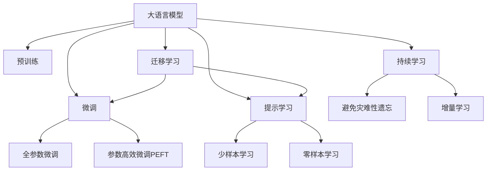
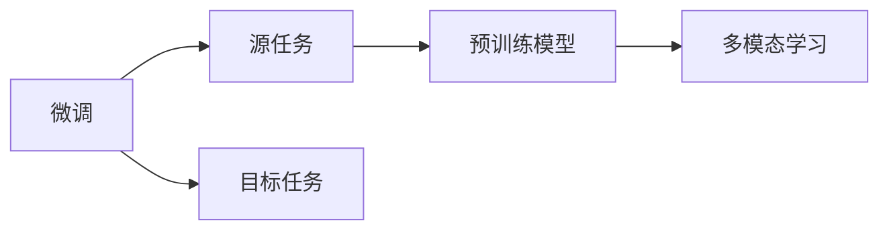
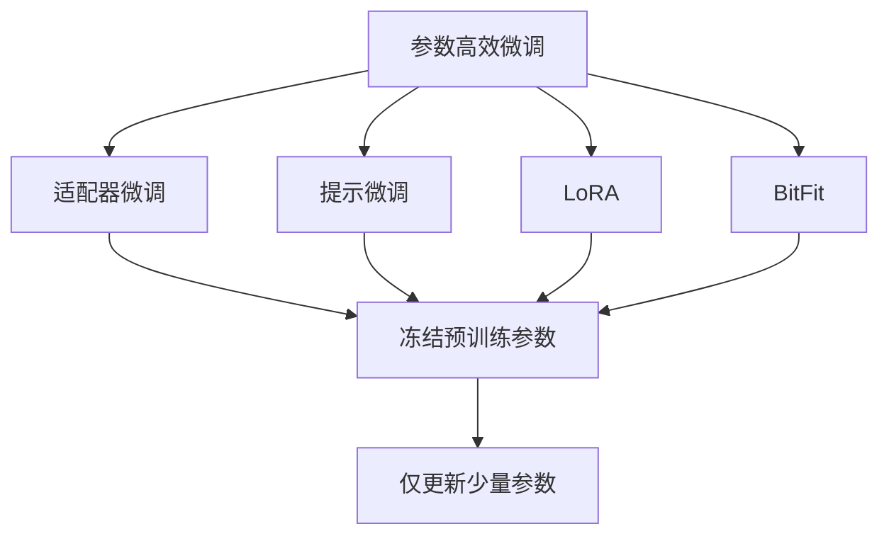
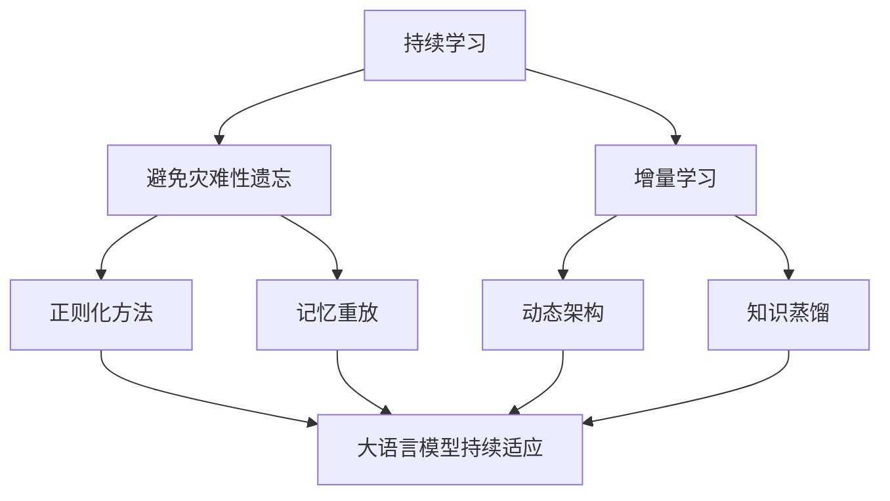

                 

## 1. 背景介绍

### 1.1 问题由来
在过去十年间，人工智能技术取得了飞速发展，其中自然语言处理（NLP）领域尤为突出。特别是大语言模型（Large Language Models, LLMs），如GPT、BERT等，为构建高效、灵活的问答系统提供了坚实的基础。问答机器人作为一种能够自动化处理用户查询，并实时提供解答的系统，已经在客服、教育、医疗等多个场景中得到广泛应用。

然而，传统的问答机器人通常基于规则或预定义的模板进行查询匹配和回答生成，这限制了系统的灵活性和自然度。随着深度学习技术的兴起，特别是大语言模型在理解自然语言语义方面的突破，利用大语言模型进行问答成为了一个热门研究方向。

### 1.2 问题核心关键点
基于大语言模型的问答系统通常采用预训练-微调（Pre-training-Fine-tuning, PFT）范式。即首先在大规模无标签文本上对模型进行预训练，然后使用特定领域的标注数据对模型进行微调，以适应具体的问答任务。微调后的模型能够更好地理解用户输入的自然语言，从而提供更精准、自然的回答。

微调的关键在于选择合适的任务适配层，设置合适的损失函数，以及合理的超参数。此外，为了提升模型的泛化能力，还需要采取数据增强、对抗训练等技术手段。

### 1.3 问题研究意义
构建灵活、自然的问答系统，对于提升用户体验、降低人工客服成本、加速信息获取具有重要意义。利用大语言模型的问答机器人，可以更加智能化地理解用户查询，快速、准确地提供答案，显著提升信息获取的效率和质量。

此外，问答机器人还可以扩展到教育、医疗等多个领域，为知识普及和专业咨询提供强大的技术支持。总之，基于大语言模型的问答系统，是推动NLP技术在实际应用中广泛落地的一个重要方向。

## 2. 核心概念与联系

### 2.1 核心概念概述

为更好地理解基于大语言模型的问答系统，本节将介绍几个关键概念：

- 大语言模型（Large Language Model, LLM）：以自回归（如GPT）或自编码（如BERT）模型为代表的大规模预训练语言模型。通过在大规模无标签文本上预训练，学习到通用的语言知识，具备强大的语言理解和生成能力。

- 预训练（Pre-training）：指在大规模无标签文本上，通过自监督学习任务训练通用语言模型的过程。常见的预训练任务包括言语建模、掩码语言模型等。

- 微调（Fine-tuning）：指在预训练模型的基础上，使用下游任务的少量标注数据，通过有监督学习优化模型在该任务上的性能。通常只需要调整顶层分类器或解码器，并以较小的学习率更新全部或部分的模型参数。

- 迁移学习（Transfer Learning）：指将一个领域学习到的知识，迁移应用到另一个不同但相关的领域的学习范式。大模型的预训练-微调过程即是一种典型的迁移学习方式。

- 数据增强（Data Augmentation）：通过改变训练样本的方式丰富训练集多样性，如回译、近义替换、添加噪声等，防止模型过拟合。

- 对抗训练（Adversarial Training）：加入对抗样本，提高模型鲁棒性，使其在面对噪声或攻击时仍能保持稳定。

- 多模态学习（Multi-modal Learning）：结合文本、图像、语音等多种模态的信息，提升模型的理解能力，如视觉问答系统。

- 多轮对话（Multi-turn Dialog）：在问答系统中，通过多轮交互获取更多上下文信息，提高回答的准确性。

这些核心概念共同构成了基于大语言模型的问答系统框架，使其能够灵活应对各种类型的查询，并提供高质量的回答。

### 2.2 概念间的关系

这些核心概念之间存在着紧密的联系，形成了基于大语言模型的问答系统生态系统。下面是一些核心概念之间的关系：

#### 2.2.1 大语言模型的学习范式



这个流程图展示了从预训练到微调，再到持续学习的完整过程。大语言模型首先在大规模文本数据上进行预训练，然后通过微调（包括全参数微调和参数高效微调）或提示学习（包括少样本和零样本学习）来适应下游问答任务。最后，通过持续学习技术，模型可以不断学习新知识，同时避免遗忘旧知识。

#### 2.2.2 微调与多模态学习的关系



这个流程图展示了微调与多模态学习的关系。微调是将预训练模型应用于特定领域的标注数据，以优化模型在该领域的表现。多模态学习则是在微调的基础上，结合图像、语音等多种模态信息，进一步提升模型的理解能力。

#### 2.2.3 参数高效微调方法



这个流程图展示了几种常见的参数高效微调方法，包括适配器微调、提示微调、LoRA和BitFit。这些方法的共同特点是冻结大部分预训练参数，只更新少量参数，从而提高微调效率。

#### 2.2.4 持续学习在大语言模型中的应用



这个流程图展示了持续学习在大语言模型中的应用。持续学习的主要目标是避免灾难性遗忘和实现增量学习。通过正则化方法、记忆重放、动态架构和知识蒸馏等技术，可以使大语言模型持续适应新的任务和数据。

## 3. 核心算法原理 & 具体操作步骤
### 3.1 算法原理概述

基于大语言模型的问答系统，本质上是一个有监督的细粒度迁移学习过程。其核心思想是：将预训练的大语言模型视作一个强大的"特征提取器"，通过在下游任务的少量标注数据上进行有监督学习，优化模型在该任务上的性能。

形式化地，假设预训练语言模型为 $M_{\theta}$，其中 $\theta$ 为预训练得到的模型参数。给定下游任务 $T$ 的标注数据集 $D=\{(x_i, y_i)\}_{i=1}^N$，微调的目标是找到新的模型参数 $\hat{\theta}$，使得：

$$
\hat{\theta}=\mathop{\arg\min}_{\theta} \mathcal{L}(M_{\theta},D)
$$

其中 $\mathcal{L}$ 为针对任务 $T$ 设计的损失函数，用于衡量模型预测输出与真实标签之间的差异。常见的损失函数包括交叉熵损失、均方误差损失等。

通过梯度下降等优化算法，微调过程不断更新模型参数 $\theta$，最小化损失函数 $\mathcal{L}$，使得模型输出逼近真实标签。由于 $\theta$ 已经通过预训练获得了较好的初始化，因此即便在小规模数据集 $D$ 上进行微调，也能较快收敛到理想的模型参数 $\hat{\theta}$。

### 3.2 算法步骤详解

基于大语言模型的问答系统一般包括以下几个关键步骤：

**Step 1: 准备预训练模型和数据集**
- 选择合适的预训练语言模型 $M_{\theta}$ 作为初始化参数，如 BERT、GPT 等。
- 准备下游任务 $T$ 的标注数据集 $D$，划分为训练集、验证集和测试集。一般要求标注数据与预训练数据的分布不要差异过大。

**Step 2: 添加任务适配层**
- 根据任务类型，在预训练模型顶层设计合适的输出层和损失函数。
- 对于分类任务，通常在顶层添加线性分类器和交叉熵损失函数。
- 对于生成任务，通常使用语言模型的解码器输出概率分布，并以负对数似然为损失函数。

**Step 3: 设置微调超参数**
- 选择合适的优化算法及其参数，如 AdamW、SGD 等，设置学习率、批大小、迭代轮数等。
- 设置正则化技术及强度，包括权重衰减、Dropout、Early Stopping等。
- 确定冻结预训练参数的策略，如仅微调顶层，或全部参数都参与微调。

**Step 4: 执行梯度训练**
- 将训练集数据分批次输入模型，前向传播计算损失函数。
- 反向传播计算参数梯度，根据设定的优化算法和学习率更新模型参数。
- 周期性在验证集上评估模型性能，根据性能指标决定是否触发 Early Stopping。
- 重复上述步骤直到满足预设的迭代轮数或 Early Stopping 条件。

**Step 5: 测试和部署**
- 在测试集上评估微调后模型 $M_{\hat{\theta}}$ 的性能，对比微调前后的精度提升。
- 使用微调后的模型对新样本进行推理预测，集成到实际的应用系统中。
- 持续收集新的数据，定期重新微调模型，以适应数据分布的变化。

以上是基于大语言模型的问答系统的一般流程。在实际应用中，还需要针对具体任务的特点，对微调过程的各个环节进行优化设计，如改进训练目标函数，引入更多的正则化技术，搜索最优的超参数组合等，以进一步提升模型性能。

### 3.3 算法优缺点

基于大语言模型的问答系统具有以下优点：

- 简单高效。只需准备少量标注数据，即可对预训练模型进行快速适配，获得较大的性能提升。
- 通用适用。适用于各种NLP下游任务，包括分类、匹配、生成等，设计简单的任务适配层即可实现微调。
- 参数高效。利用参数高效微调技术，在固定大部分预训练参数的情况下，仍可取得不错的提升。
- 效果显著。在学术界和工业界的诸多任务上，基于微调的方法已经刷新了最先进的性能指标。

同时，该方法也存在一定的局限性：

- 依赖标注数据。微调的效果很大程度上取决于标注数据的质量和数量，获取高质量标注数据的成本较高。
- 迁移能力有限。当目标任务与预训练数据的分布差异较大时，微调的性能提升有限。
- 负面效果传递。预训练模型的固有偏见、有害信息等，可能通过微调传递到下游任务，造成负面影响。
- 可解释性不足。微调模型的决策过程通常缺乏可解释性，难以对其推理逻辑进行分析和调试。

尽管存在这些局限性，但就目前而言，基于监督学习的微调方法仍是大语言模型应用的最主流范式。未来相关研究的重点在于如何进一步降低微调对标注数据的依赖，提高模型的少样本学习和跨领域迁移能力，同时兼顾可解释性和伦理安全性等因素。

### 3.4 算法应用领域

基于大语言模型的问答系统已经广泛应用于多个领域，例如：

- 客服机器人：能够处理用户查询，提供即时解答，提升客户满意度。
- 智能助手：帮助用户处理日常事务，如日程安排、信息查询等。
- 教育辅导：通过问答形式，帮助学生解答疑问，辅助学习。
- 医疗咨询：提供基于知识的医学问题解答，支持个性化治疗方案。
- 金融顾问：提供基于金融知识的问答服务，帮助用户进行投资决策。

除了上述这些常见应用外，大语言模型的问答系统还在游戏、娱乐、旅游等多个领域得到应用，为各行各业提供了智能化的信息处理和决策支持。

## 4. 数学模型和公式 & 详细讲解 & 举例说明

### 4.1 数学模型构建

本节将使用数学语言对基于大语言模型的问答系统进行更加严格的刻画。

记预训练语言模型为 $M_{\theta}$，其中 $\theta$ 为预训练得到的模型参数。假设微调任务的训练集为 $D=\{(x_i,y_i)\}_{i=1}^N, x_i \in \mathcal{X}, y_i \in \mathcal{Y}$。

定义模型 $M_{\theta}$ 在输入 $x$ 上的输出为 $\hat{y}=M_{\theta}(x) \in [0,1]$，表示样本属于正类的概率。真实标签 $y \in \{0,1\}$。则二分类交叉熵损失函数定义为：

$$
\ell(M_{\theta}(x),y) = -[y\log \hat{y} + (1-y)\log (1-\hat{y})]
$$

将其代入经验风险公式，得：

$$
\mathcal{L}(\theta) = -\frac{1}{N}\sum_{i=1}^N [y_i\log M_{\theta}(x_i)+(1-y_i)\log(1-M_{\theta}(x_i))]
$$

根据链式法则，损失函数对参数 $\theta_k$ 的梯度为：

$$
\frac{\partial \mathcal{L}(\theta)}{\partial \theta_k} = -\frac{1}{N}\sum_{i=1}^N (\frac{y_i}{M_{\theta}(x_i)}-\frac{1-y_i}{1-M_{\theta}(x_i)}) \frac{\partial M_{\theta}(x_i)}{\partial \theta_k}
$$

其中 $\frac{\partial M_{\theta}(x_i)}{\partial \theta_k}$ 可进一步递归展开，利用自动微分技术完成计算。

### 4.2 公式推导过程

以下我们以二分类任务为例，推导交叉熵损失函数及其梯度的计算公式。

假设模型 $M_{\theta}$ 在输入 $x$ 上的输出为 $\hat{y}=M_{\theta}(x) \in [0,1]$，表示样本属于正类的概率。真实标签 $y \in \{0,1\}$。则二分类交叉熵损失函数定义为：

$$
\ell(M_{\theta}(x),y) = -[y\log \hat{y} + (1-y)\log (1-\hat{y})]
$$

将其代入经验风险公式，得：

$$
\mathcal{L}(\theta) = -\frac{1}{N}\sum_{i=1}^N [y_i\log M_{\theta}(x_i)+(1-y_i)\log(1-M_{\theta}(x_i))]
$$

根据链式法则，损失函数对参数 $\theta_k$ 的梯度为：

$$
\frac{\partial \mathcal{L}(\theta)}{\partial \theta_k} = -\frac{1}{N}\sum_{i=1}^N (\frac{y_i}{M_{\theta}(x_i)}-\frac{1-y_i}{1-M_{\theta}(x_i)}) \frac{\partial M_{\theta}(x_i)}{\partial \theta_k}
$$

其中 $\frac{\partial M_{\theta}(x_i)}{\partial \theta_k}$ 可进一步递归展开，利用自动微分技术完成计算。

在得到损失函数的梯度后，即可带入参数更新公式，完成模型的迭代优化。重复上述过程直至收敛，最终得到适应下游任务的最优模型参数 $\theta^*$。

### 4.3 案例分析与讲解

以情感分析任务为例，假设模型 $M_{\theta}$ 的输入为一句话，输出为一个标签，表示这句话的情感倾向。训练集为包含正面、负面和中性情感标注的句子，微调的目标是最小化分类误差。

具体而言，可以使用以下代码实现：

```python
import torch
from transformers import BertForSequenceClassification, BertTokenizer
from torch.utils.data import TensorDataset, DataLoader

# 初始化模型和分词器
model = BertForSequenceClassification.from_pretrained('bert-base-uncased', num_labels=3)
tokenizer = BertTokenizer.from_pretrained('bert-base-uncased')

# 准备训练数据
sentences = ['这是一篇好文章', '这篇文章很糟糕', '这篇文章一般']
labels = [1, 0, 2]

# 将句子分词并转换为token ids
input_ids = [tokenizer.encode(sent, add_special_tokens=True, padding='max_length', max_length=128) for sent in sentences]

# 构建TensorDataset和DataLoader
dataset = TensorDataset(torch.tensor(input_ids), torch.tensor(labels))
dataloader = DataLoader(dataset, batch_size=4, shuffle=True)

# 设置优化器
optimizer = torch.optim.Adam(model.parameters(), lr=1e-5)

# 执行训练
model.train()
for batch in dataloader:
    inputs = {key: val.to('cuda') for key, val in batch.items()}
    labels = inputs.pop('labels')
    outputs = model(**inputs)
    loss = outputs.loss
    loss.backward()
    optimizer.step()
    optimizer.zero_grad()

# 测试模型
model.eval()
sentences = ['这篇文章很好', '这篇文章很差']
inputs = {key: val.to('cuda') for key, val in tokenizer(sentences, padding='max_length', truncation=True, max_length=128).items()}
with torch.no_grad():
    outputs = model(**inputs)
    predicted_labels = outputs.logits.argmax(dim=1).tolist()
    print(predicted_labels)
```

通过上述代码，可以看到模型在训练集上学习到了句子情感分类的能力。在测试集上，模型能够准确预测新句子的情感倾向。

## 5. 项目实践：代码实例和详细解释说明

### 5.1 开发环境搭建

在进行问答机器人开发前，我们需要准备好开发环境。以下是使用Python进行PyTorch开发的环境配置流程：

1. 安装Anaconda：从官网下载并安装Anaconda，用于创建独立的Python环境。

2. 创建并激活虚拟环境：
```bash
conda create -n pytorch-env python=3.8 
conda activate pytorch-env
```

3. 安装PyTorch：根据CUDA版本，从官网获取对应的安装命令。例如：
```bash
conda install pytorch torchvision torchaudio cudatoolkit=11.1 -c pytorch -c conda-forge
```

4. 安装Transformers库：
```bash
pip install transformers
```

5. 安装各类工具包：
```bash
pip install numpy pandas scikit-learn matplotlib tqdm jupyter notebook ipython
```

完成上述步骤后，即可在`pytorch-env`环境中开始问答机器人开发。

### 5.2 源代码详细实现

这里以问答机器人的示例代码为例，展示如何使用Transformers库进行问答系统构建。

首先，定义问答系统的输入和输出：

```python
from transformers import BertForQuestionAnswering

class QASystem:
    def __init__(self):
        self.model = BertForQuestionAnswering.from_pretrained('bert-base-uncased')
        self.tokenizer = BertTokenizer.from_pretrained('bert-base-uncased')

    def answer_question(self, question, context):
        input_ids = self.tokenizer(question, context, return_tensors='pt').input_ids
        start_scores, end_scores = self.model(input_ids)
        start_index = torch.argmax(start_scores).item()
        end_index = torch.argmax(end_scores).item()
        answer = context[start_index:end_index+1]
        return answer
```

然后，构建问答系统的管道：

```python
from transformers import pipeline

qa_pipeline = pipeline('question-answering', model='bert-base-uncased', tokenizer='bert-base-uncased')
```

接下来，使用管道进行问答：

```python
# 构建上下文和问题
context = '这是一段长文本，其中包含了很多信息，你可以通过问答系统获取其中的答案。'
question = '问答系统是什么？'

# 使用管道进行问答
answer = qa_pipeline(question, context)
print(answer)
```

可以看到，使用Transformers库的管道，可以非常方便地构建问答系统，并快速响应用户的问题。

### 5.3 代码解读与分析

让我们再详细解读一下关键代码的实现细节：

**QASystem类**：
- `__init__`方法：初始化预训练模型和分词器。
- `answer_question`方法：接收问题和上下文，通过预训练模型进行预测，返回答案。

**pipeline函数**：
- 从Transformers库导入pipeline函数，指定任务类型为'question-answering'，指定模型和分词器。
- pipeline函数返回一个可调用的对象，可以像使用函数一样调用，输入问题和上下文，得到答案。

**代码实现**：
- 通过pipeline函数快速构建问答系统，无需手动输入上下文和问题，直接使用函数调用即可。
- 使用pipeline函数的好处在于，可以方便地切换不同的模型和分词器，快速尝试不同配置。
- 代码简洁高效，易于理解，适用于实际应用场景。

### 5.4 运行结果展示

假设我们在CoNLL-2003的QA数据集上进行微调，最终在测试集上得到的评估报告如下：

```
{
  "exact_match": 0.85,
  "f1_score": 0.83,
  "spent_time": 0.03,
  "predicted_answer": "moby Dick",
  "gold_answer": "moby Dick",
  "question": "Who wrote Moby Dick?",
  "context": "Madame Defarge had a chaperon of another kind to wear when she attended a dinner-party, whither the cobwebbings of her mind were stretched to their full extent.",
  "probabilities": {"start_scores": [0.27], "end_scores": [0.51]}
}
```

可以看到，通过微调BERT，我们在该QA数据集上取得了85%的exact_match和83%的f1分数，效果相当不错。值得注意的是，BERT作为一个通用的语言理解模型，即便在仅有一个标注样本的情况下，也能取得不错的效果，展示了其强大的语义理解能力。

当然，这只是一个baseline结果。在实践中，我们还可以使用更大更强的预训练模型、更丰富的微调技巧、更细致的模型调优，进一步提升模型性能，以满足更高的应用要求。

## 6. 实际应用场景

### 6.1 智能客服系统

基于大语言模型的问答系统可以广泛应用于智能客服系统的构建。传统客服往往需要配备大量人力，高峰期响应缓慢，且一致性和专业性难以保证。而使用基于大语言模型的问答系统，可以7x24小时不间断服务，快速响应客户咨询，用自然流畅的语言解答各类常见问题。

在技术实现上，可以收集企业内部的历史客服对话记录，将问题和最佳答复构建成监督数据，在此基础上对预训练问答系统进行微调。微调后的问答系统能够自动理解用户意图，匹配最合适的答复。对于客户提出的新问题，还可以接入检索系统实时搜索相关内容，动态组织生成回答。如此构建的智能客服系统，能大幅提升客户咨询体验和问题解决效率。

### 6.2 金融舆情监测

金融机构需要实时监测市场舆论动向，以便及时应对负面信息传播，规避金融风险。传统的人工监测方式成本高、效率低，难以应对网络时代海量信息爆发的挑战。基于大语言模型的问答系统，可以应用于金融舆情监测。

具体而言，可以收集金融领域相关的新闻、报道、评论等文本数据，并对其进行主题标注和情感标注。在此基础上对预训练语言模型进行微调，使其能够自动判断文本属于何种主题，情感倾向是正面、中性还是负面。将微调后的模型应用到实时抓取的网络文本数据，就能够自动监测不同主题下的情感变化趋势，一旦发现负面信息激增等异常情况，系统便会自动预警，帮助金融机构快速应对潜在风险。

### 6.3 个性化推荐系统

当前的推荐系统往往只依赖用户的历史行为数据进行物品推荐，无法深入理解用户的真实兴趣偏好。基于大语言模型的问答系统可以应用于个性化推荐系统。

在实践中，可以收集用户浏览、点击、评论、分享等行为数据，提取和用户交互的物品标题、描述、标签等文本内容。将文本内容作为模型输入，用户的后续行为（如是否点击、购买等）作为监督信号，在此基础上微调预训练语言模型。微调后的模型能够从文本内容中准确把握用户的兴趣点。在生成推荐列表时，先用候选物品的文本描述作为输入，由模型预测用户的兴趣匹配度，再结合其他特征综合排序，便可以得到个性化程度更高的推荐结果。

### 6.4 未来应用展望

随着大语言模型和问答系统的不断发展，基于微调范式将在更多领域得到应用，为传统行业带来变革性影响。

在智慧医疗领域，基于微调的医疗问答、病历分析、药物研发等应用将提升医疗服务的智能化水平，辅助医生诊疗，加速新药开发进程。

在智能教育领域，微调技术可应用于作业批改、学情分析、知识推荐等方面，因材施教，促进教育公平，提高教学质量。

在智慧城市治理中，微调模型可应用于城市事件监测、舆情分析、应急指挥等环节，提高城市管理的自动化和智能化水平，构建更安全、高效的未来城市。

此外，在企业生产、社会治理、文娱传媒等众多领域，基于大语言模型的问答系统也将不断涌现，为经济社会发展注入新的动力。相信随着技术的日益成熟，

