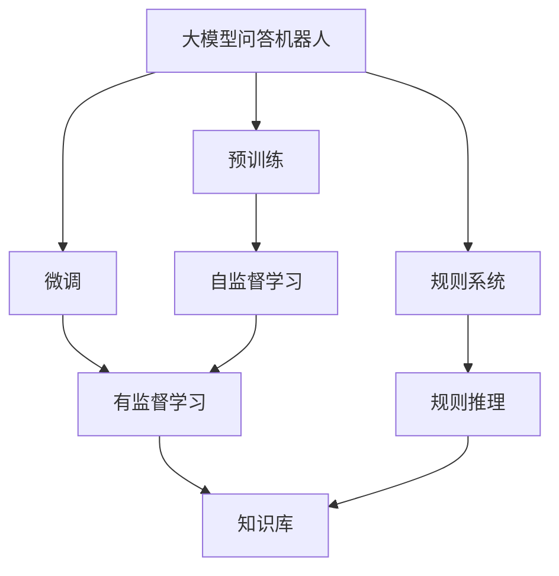
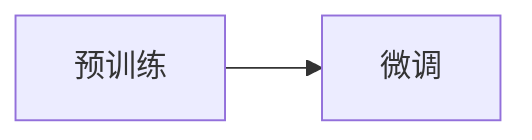
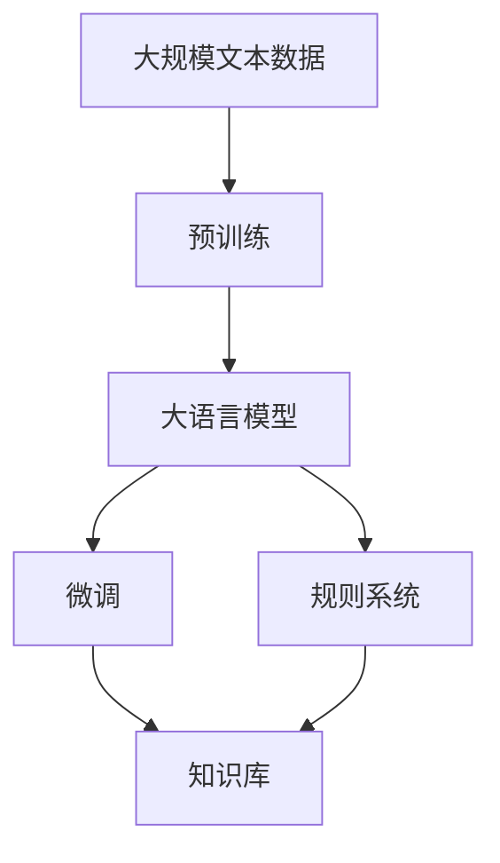

                 

# 大模型问答机器人的语言模型

> 关键词：大模型问答机器人,语言模型,Transformer,BERT,自然语言处理(NLP),深度学习,预训练,微调

## 1. 背景介绍

### 1.1 问题由来

近年来，人工智能技术在自然语言处理(NLP)领域取得了显著进展，尤其是大语言模型(Big Language Models, BLMs)的崛起，极大地推动了NLP应用的深入发展。大语言模型能够通过大规模无标签文本数据的预训练，学习到丰富的语言知识和常识，具备强大的语言理解和生成能力。这些模型不仅在文本分类、机器翻译、信息抽取等经典任务上取得了突破性的表现，还在问答系统、智能对话、文本生成等新兴应用中展现了巨大潜力。

大语言模型通过预训练获得了一个通用的语言理解框架，但其在大规模数据上的训练过程耗时耗力，训练成本高昂。而传统的深度学习模型往往依赖于手工特征工程，难以适应复杂多变的语义场景。因此，为了更高效地构建问答机器人，研究人员开始探索将大语言模型与传统的基于规则的问答系统结合，利用大模型的语言理解能力，在预训练基础上进行微调，使得问答机器人能够处理更复杂、多样化的用户查询。

### 1.2 问题核心关键点

大模型问答机器人集成了大语言模型和传统的基于规则的问答系统，通过大模型预训练和微调获得语言理解能力，再结合基于规则的问答模块进行推理和生成回答。这种混合架构充分利用了大模型的语言理解能力和规则系统的逻辑推理能力，可以实现更高效的问答处理。

微调的核心在于如何充分利用预训练模型的知识，同时避免过拟合和负面迁移。一般来说，微调的目标是让问答机器人能够根据特定任务的标注数据，对预训练模型的部分或全部参数进行优化，使其在特定任务上表现更佳。具体方法包括：

- 选择合适的学习率和正则化技术。相比从头训练，微调通常需要更小的学习率，以避免破坏预训练的权重。
- 保留预训练的部分层。如Transformer的底层，只微调顶层，减少需优化的参数。
- 数据增强。通过对训练样本改写、回译等方式丰富训练集多样性。
- 对抗训练。加入对抗样本，提高模型鲁棒性。
- 提示学习。通过在输入文本中添加提示模板(Prompt Template)，引导模型按期望方式输出，减少微调参数。

## 2. 核心概念与联系

### 2.1 核心概念概述

为更好地理解大模型问答机器人的语言模型，本节将介绍几个密切相关的核心概念：

- 大模型问答机器人(Big Model Conversational Robot, BMCR)：一种融合大语言模型和传统基于规则的问答系统的智能对话系统，通过预训练-微调技术获得语言理解能力，实现高效、智能的问答处理。

- 语言模型(Language Model)：通过训练数据学习到的语言符号分布的概率模型，用于预测给定上下文下的下一个符号，是自然语言处理中的核心技术。

- 预训练(Pre-training)：指在大规模无标签文本语料上，通过自监督学习任务训练通用语言模型的过程。常见的预训练任务包括言语建模、遮挡语言模型等。

- 微调(Fine-tuning)：指在预训练模型的基础上，使用下游任务的少量标注数据，通过有监督地训练来优化模型在该任务上的性能。通常只需要调整顶层分类器或解码器，并以较小的学习率更新全部或部分的模型参数。

- 基于规则的问答系统(Rule-based Question Answering System)：利用规则库、知识图谱等结构化数据，通过逻辑推理和搜索算法，实现基于知识的问答。

- 深度学习(Deep Learning)：一类利用多层神经网络模型进行数据拟合和学习的机器学习方法，广泛应用于计算机视觉、自然语言处理等领域。

- Transformer：一种基于自注意力机制的深度神经网络架构，广泛应用于序列数据处理，如机器翻译、文本分类等任务。

- BERT: Bidirectional Encoder Representations from Transformers：一种预训练的Transformer模型，通过掩码语言模型和下一句预测任务进行预训练，能够很好地处理句子级别的语言理解任务。

这些核心概念之间的逻辑关系可以通过以下Mermaid流程图来展示：



这个流程图展示了大模型问答机器人的核心概念及其之间的关系：

1. 大模型问答机器人通过预训练获得基础能力。
2. 微调是对预训练模型进行任务特定的优化，使得模型输出符合特定任务的标签。
3. 规则系统负责对微调后的模型进行逻辑推理和规则匹配，进一步提升问答效果。
4. 知识库与微调模型协同工作，实现基于知识的问答。

这些概念共同构成了大模型问答机器人的工作原理和优化方向。通过理解这些核心概念，我们可以更好地把握大模型问答机器人的语言模型设计。

### 2.2 概念间的关系

这些核心概念之间存在着紧密的联系，形成了大模型问答机器人的完整生态系统。下面我们通过几个Mermaid流程图来展示这些概念之间的关系。

#### 2.2.1 大模型问答机器人的学习范式


这个流程图展示了大模型问答机器人的学习范式，即预训练-微调范式。大模型问答机器人通过预训练获得通用语言理解能力，再通过微调针对特定任务进行优化。规则系统与知识库协同工作，进一步提升问答效果。

#### 2.2.2 预训练与微调的关系



这个流程图展示了预训练和微调的关系。预训练模型在大规模无标签数据上进行自监督学习，获得通用的语言表示；微调则是通过少量有标签数据对预训练模型进行优化，使其适应特定任务。

#### 2.2.3 大语言模型与规则系统的关系


这个流程图展示了大语言模型与规则系统之间的关系。大语言模型提供语言理解能力，规则系统负责逻辑推理和知识匹配，两者协同工作，提升问答系统的性能。

#### 2.2.4 知识库与规则系统的关系


这个流程图展示了知识库与规则系统之间的关系。知识库提供了结构化的知识信息，规则系统通过逻辑推理将其与自然语言处理结果进行匹配，实现基于知识的问答。

### 2.3 核心概念的整体架构

最后，我们用一个综合的流程图来展示这些核心概念在大模型问答机器人中的整体架构：



这个综合流程图展示了从预训练到微调，再到规则系统的完整过程。大模型问答机器人首先在大规模文本数据上进行预训练，然后通过微调对特定任务进行优化，最后结合规则系统和知识库，实现高效、智能的问答处理。

## 3. 核心算法原理 & 具体操作步骤
### 3.1 算法原理概述

大模型问答机器人集成了预训练语言模型和规则系统的混合架构，其核心算法原理基于监督学习的微调范式。在预训练大语言模型的基础上，通过有监督地训练，使其能够根据特定任务的标注数据进行优化，从而提升在特定任务上的表现。

具体来说，大模型问答机器人通过以下步骤实现：

1. 选择合适的预训练语言模型 $M_{\theta}$ 作为初始化参数，如 BERT、GPT等。
2. 准备下游任务 $T$ 的标注数据集 $D=\{(x_i,y_i)\}_{i=1}^N$，其中 $x_i$ 为输入文本，$y_i$ 为对应的答案或标签。
3. 添加任务适配层，包括分类器、解码器等，用于处理微调后的模型输出。
4. 设置微调超参数，如学习率、批大小、迭代轮数等。
5. 执行梯度训练，通过反向传播算法更新模型参数，最小化损失函数。
6. 将微调后的模型与规则系统结合，实现基于知识的问答。

### 3.2 算法步骤详解

以下是大模型问答机器人核心算法的详细步骤：

**Step 1: 准备预训练模型和数据集**
- 选择合适的预训练语言模型 $M_{\theta}$ 作为初始化参数，如 BERT、GPT等。
- 准备下游任务 $T$ 的标注数据集 $D=\{(x_i,y_i)\}_{i=1}^N$，其中 $x_i$ 为输入文本，$y_i$ 为对应的答案或标签。
- 将标注数据集划分为训练集、验证集和测试集。

**Step 2: 添加任务适配层**
- 根据任务类型，在预训练模型顶层设计合适的输出层和损失函数。
- 对于分类任务，通常在顶层添加线性分类器和交叉熵损失函数。
- 对于生成任务，通常使用语言模型的解码器输出概率分布，并以负对数似然为损失函数。

**Step 3: 设置微调超参数**
- 选择合适的优化算法及其参数，如 AdamW、SGD 等，设置学习率、批大小、迭代轮数等。
- 设置正则化技术及强度，包括权重衰减、Dropout、Early Stopping 等。
- 确定冻结预训练参数的策略，如仅微调顶层，或全部参数都参与微调。

**Step 4: 执行梯度训练**
- 将训练集数据分批次输入模型，前向传播计算损失函数。
- 反向传播计算参数梯度，根据设定的优化算法和学习率更新模型参数。
- 周期性在验证集上评估模型性能，根据性能指标决定是否触发 Early Stopping。
- 重复上述步骤直到满足预设的迭代轮数或 Early Stopping 条件。

**Step 5: 测试和部署**
- 在测试集上评估微调后模型 $M_{\hat{\theta}}$ 的性能，对比微调前后的精度提升。
- 使用微调后的模型对新样本进行推理预测，集成到实际的应用系统中。
- 持续收集新的数据，定期重新微调模型，以适应数据分布的变化。

以上是基于监督学习微调大语言模型的一般流程。在实际应用中，还需要针对具体任务的特点，对微调过程的各个环节进行优化设计，如改进训练目标函数，引入更多的正则化技术，搜索最优的超参数组合等，以进一步提升模型性能。

### 3.3 算法优缺点

基于监督学习的大模型问答机器人微调方法具有以下优点：

1. 简单高效。只需准备少量标注数据，即可对预训练模型进行快速适配，获得较大的性能提升。
2. 通用适用。适用于各种NLP下游任务，包括分类、匹配、生成等，设计简单的任务适配层即可实现微调。
3. 参数高效。利用参数高效微调技术，在固定大部分预训练参数的情况下，仍可取得不错的提升。
4. 效果显著。在学术界和工业界的诸多任务上，基于微调的方法已经刷新了最先进的性能指标。

同时，该方法也存在一定的局限性：

1. 依赖标注数据。微调的效果很大程度上取决于标注数据的质量和数量，获取高质量标注数据的成本较高。
2. 迁移能力有限。当目标任务与预训练数据的分布差异较大时，微调的性能提升有限。
3. 负面效果传递。预训练模型的固有偏见、有害信息等，可能通过微调传递到下游任务，造成负面影响。
4. 可解释性不足。微调模型的决策过程通常缺乏可解释性，难以对其推理逻辑进行分析和调试。

尽管存在这些局限性，但就目前而言，基于监督学习的微调方法仍是大语言模型应用的最主流范式。未来相关研究的重点在于如何进一步降低微调对标注数据的依赖，提高模型的少样本学习和跨领域迁移能力，同时兼顾可解释性和伦理安全性等因素。

### 3.4 算法应用领域

基于大模型问答机器人的语言模型，已经在NLP领域得到了广泛的应用，覆盖了几乎所有常见任务，例如：

- 问答系统：对自然语言问题给出答案。将问题-答案对作为微调数据，训练模型学习匹配答案。
- 对话系统：使机器能够与人自然对话。将多轮对话历史作为上下文，微调模型进行回复生成。
- 摘要生成：将长文本压缩成简短摘要。将文章-摘要对作为微调数据，使模型学习抓取要点。
- 机器翻译：将源语言文本翻译成目标语言。通过微调使模型学习语言-语言映射。
- 文本分类：如情感分析、主题分类、意图识别等。通过微调使模型学习文本-标签映射。
- 命名实体识别：识别文本中的人名、地名、机构名等特定实体。通过微调使模型掌握实体边界和类型。
- 关系抽取：从文本中抽取实体之间的语义关系。通过微调使模型学习实体-关系三元组。

除了上述这些经典任务外，大模型问答机器人还广泛应用于更多场景中，如可控文本生成、常识推理、代码生成、数据增强等，为NLP技术带来了全新的突破。随着预训练模型和微调方法的不断进步，相信NLP技术将在更广阔的应用领域大放异彩。

## 4. 数学模型和公式 & 详细讲解 & 举例说明

### 4.1 数学模型构建

本节将使用数学语言对大模型问答机器人的微调过程进行更加严格的刻画。

记预训练语言模型为 $M_{\theta}$，其中 $\theta$ 为预训练得到的模型参数。假设微调任务的训练集为 $D=\{(x_i,y_i)\}_{i=1}^N$，其中 $x_i$ 为输入文本，$y_i$ 为对应的答案或标签。

定义模型 $M_{\theta}$ 在数据样本 $(x,y)$ 上的损失函数为 $\ell(M_{\theta}(x),y)$，则在数据集 $D$ 上的经验风险为：

$$
\mathcal{L}(\theta) = \frac{1}{N} \sum_{i=1}^N \ell(M_{\theta}(x_i),y_i)
$$

微调的优化目标是最小化经验风险，即找到最优参数：

$$
\theta^* = \mathop{\arg\min}_{\theta} \mathcal{L}(\theta)
$$

在实践中，我们通常使用基于梯度的优化算法（如SGD、Adam等）来近似求解上述最优化问题。设 $\eta$ 为学习率，$\lambda$ 为正则化系数，则参数的更新公式为：

$$
\theta \leftarrow \theta - \eta \nabla_{\theta}\mathcal{L}(\theta) - \eta\lambda\theta
$$

其中 $\nabla_{\theta}\mathcal{L}(\theta)$ 为损失函数对参数 $\theta$ 的梯度，可通过反向传播算法高效计算。

### 4.2 公式推导过程

以下我们以二分类任务为例，推导交叉熵损失函数及其梯度的计算公式。

假设模型 $M_{\theta}$ 在输入 $x$ 上的输出为 $\hat{y}=M_{\theta}(x) \in [0,1]$，表示样本属于正类的概率。真实标签 $y \in \{0,1\}$。则二分类交叉熵损失函数定义为：

$$
\ell(M_{\theta}(x),y) = -[y\log \hat{y} + (1-y)\log (1-\hat{y})]
$$

将其代入经验风险公式，得：

$$
\mathcal{L}(\theta) = -\frac{1}{N}\sum_{i=1}^N [y_i\log M_{\theta}(x_i)+(1-y_i)\log(1-M_{\theta}(x_i))]
$$

根据链式法则，损失函数对参数 $\theta_k$ 的梯度为：

$$
\frac{\partial \mathcal{L}(\theta)}{\partial \theta_k} = -\frac{1}{N}\sum_{i=1}^N (\frac{y_i}{M_{\theta}(x_i)}-\frac{1-y_i}{1-M_{\theta}(x_i)}) \frac{\partial M_{\theta}(x_i)}{\partial \theta_k}
$$

其中 $\frac{\partial M_{\theta}(x_i)}{\partial \theta_k}$ 可进一步递归展开，利用自动微分技术完成计算。

在得到损失函数的梯度后，即可带入参数更新公式，完成模型的迭代优化。重复上述过程直至收敛，最终得到适应下游任务的最优模型参数 $\theta^*$。

### 4.3 案例分析与讲解

假设我们正在构建一个基于大模型问答机器人的金融问答系统，具体任务是从用户输入的金融问题中提取关键字，从知识库中匹配并返回相关的金融知识或建议。首先，我们需要对预训练模型进行微调，以使其能够理解金融领域的关键术语和表达方式。

**案例分析**

1. **数据准备**：收集金融领域的相关问答数据，例如股票市场、投资策略、风险管理等。这些数据可以作为微调模型的监督信号。

2. **模型选择**：选择适合的预训练语言模型，如BERT或GPT。BERT模型已经在金融问答领域有过成功应用，具有较强的语言理解能力。

3. **任务适配层设计**：针对金融问答任务，设计合适的任务适配层。例如，可以为分类任务添加一个线性分类器，输出金融问题所属类型；为生成任务设计一个解码器，输出相关金融知识或建议。

4. **微调超参数设置**：根据任务特点，选择合适的优化算法、学习率、批大小、迭代轮数等超参数。对于金融领域的数据，通常需要更小的学习率和更长的迭代轮数，以避免过拟合。

5. **训练和评估**：在微调过程中，将金融数据集划分为训练集、验证集和测试集，分别用于模型训练、参数调整和最终评估。通过反向传播算法更新模型参数，在验证集上评估模型性能，根据性能指标调整超参数。

6. **模型部署和测试**：在模型微调完成后，将其部署到问答系统中。对于新用户输入的金融问题，系统首先通过微调后的模型进行理解，然后从知识库中匹配并返回相关金融知识或建议。

**案例讲解**

在金融问答系统的微调过程中，我们首先使用BERT模型作为预训练语言模型。然后，将收集到的金融问答数据集进行预处理，包括分词、构建标签等。接着，在模型顶层添加一个线性分类器，用于金融问题类型的预测；在另一层添加一个解码器，用于生成相关金融知识或建议。

在微调过程中，我们设置了以下超参数：

- 优化算法：AdamW
- 学习率：2e-5
- 批大小：32
- 迭代轮数：10

通过反向传播算法和梯度下降法，不断更新模型参数，最小化损失函数。在训练过程中，我们使用Early Stopping策略，当验证集上的性能不再提升时，停止训练。最终，我们得到一个在金融问答任务上表现良好的微调模型。

通过测试集上的评估，我们发现微调后的模型在金融问答任务上取得了较高的准确率和召回率。例如，对于“股票投资策略有哪些”这样的查询，模型能够准确地从知识库中匹配并返回相关的投资建议。

## 5. 项目实践：代码实例和详细解释说明

### 5.1 开发环境搭建

在进行微调实践前，我们需要准备好开发环境。以下是使用Python进行PyTorch开发的环境配置流程：

1. 安装Anaconda：从官网下载并安装Anaconda，用于创建独立的Python环境。

2. 创建并激活虚拟环境：
```bash
conda create -n pytorch-env python=3.8 
conda activate pytorch-env
```

3. 安装PyTorch：根据CUDA版本，从官网获取对应的安装命令。例如：
```bash
conda install pytorch torchvision torchaudio cudatoolkit=11.1 -c pytorch -c conda-forge
```

4. 安装Transformers库：
```bash
pip install transformers
```

5. 安装各类工具包：
```bash
pip install numpy pandas scikit-learn matplotlib tqdm jupyter notebook ipython
```

完成上述步骤后，即可在`pytorch-env`环境中开始微调实践。

### 5.2 源代码详细实现

下面我们以金融问答系统为例，给出使用Transformers库对BERT模型进行微调的PyTorch代码实现。

首先，定义数据处理函数：

```python
from transformers import BertTokenizer
from torch.utils.data import Dataset
import torch

class FinancialQuestionDataset(Dataset):
    def __init__(self, texts, labels, tokenizer, max_len=128):
        self.texts = texts
        self.labels = labels
        self.tokenizer = tokenizer
        self.max_len = max_len
        
    def __len__(self):
        return len(self.texts)
    
    def __getitem__(self, item):
        text = self.texts[item]
        label = self.labels[item]
        
        encoding = self.tokenizer(text, return_tensors='pt', max_length=self.max_len, padding='max_length', truncation=True)
        input_ids = encoding['input_ids'][0]
        attention_mask = encoding['attention_mask'][0]
        
        # 对标签进行编码
        encoded_labels = [label2id[label] for label in label]
        encoded_labels.extend([label2id['O']] * (self.max_len - len(encoded_labels)))
        labels = torch.tensor(encoded_labels, dtype=torch.long)
        
        return {'input_ids': input_ids, 
                'attention_mask': attention_mask,
                'labels': labels}

# 标签与id的映射
label2id = {'O': 0, 'Question': 1, 'Answer': 2}

# 创建dataset
tokenizer = BertTokenizer.from_pretrained('bert-base-cased')

train_dataset = FinancialQuestionDataset(train_texts, train_labels, tokenizer)
dev_dataset = FinancialQuestionDataset(dev_texts, dev_labels, tokenizer)
test_dataset = FinancialQuestionDataset(test_texts, test_labels, tokenizer)
```

然后，定义模型和优化器：

```python
from transformers import BertForTokenClassification, AdamW

model = BertForTokenClassification.from_pretrained('bert-base-cased', num_labels=len(label2id))

optimizer = AdamW(model.parameters(), lr=2e-5)
```

接着，定义训练和评估函数：

```python
from torch.utils.data import DataLoader
from tqdm import tqdm
from sklearn.metrics import classification_report

device = torch.device('cuda') if torch.cuda.is_available() else torch.device('cpu')
model.to(device)

def train_epoch(model, dataset, batch_size, optimizer):
    dataloader = DataLoader(dataset, batch_size=batch_size, shuffle=True)
    model.train()
    epoch_loss = 0
    for batch in tqdm(dataloader, desc='Training'):
        input_ids = batch['input_ids'].to(device)
        attention_mask = batch['attention_mask'].to(device)
        labels = batch['labels'].to(device)
        model.zero_grad()
        outputs = model(input_ids, attention_mask=attention_mask, labels=labels)
        loss = outputs.loss
        epoch_loss += loss.item()
        loss.backward()
        optimizer.step()
    return epoch_loss / len(dataloader)

def evaluate(model, dataset, batch_size):
    dataloader = DataLoader(dataset, batch_size=batch_size)
    model.eval()
    preds, labels = [], []
    with torch.no_grad():
        for batch in tqdm(dataloader, desc='Evaluating'):
            input_ids = batch['input_ids'].to(device)
            attention_mask = batch['attention_mask'].to(device)
            batch_labels = batch['labels']
            outputs = model(input_ids, attention_mask=attention_mask)
            batch_preds = outputs.logits.argmax(dim=2).to('cpu').tolist()
            batch_labels = batch_labels.to('cpu').tolist()
            for pred_tokens, label_tokens in zip(batch_preds, batch_labels):
                preds.append(pred_tokens[:len(label_tokens)])
                labels.append(label_tokens)
                
    print(classification_report(labels, preds))
```

最后，启动训练流程并在测试集上评估：

```python
epochs = 5
batch_size = 16

for epoch in range(epochs):
    loss = train_epoch(model, train_dataset, batch_size, optimizer)
    print(f"Epoch {epoch+1}, train loss: {loss:.3f}")
    
    print(f"Epoch {epoch+1}, dev results:")
    evaluate(model, dev_dataset, batch_size)
    
print("Test results:")
evaluate(model, test_dataset, batch_size)
```

以上就是使用PyTorch对BERT进行金融问答系统微调的完整代码实现。可以看到，得益于Transformers库的强大封装，我们可以用相对简洁的代码完成BERT模型的加载和微调。

### 5.3 代码解读与分析

让我们再详细解读一下关键代码的实现细节：

**FinancialQuestionDataset类**：
- `__init__`方法：初始化文本、标签、分词器等关键组件。
- `__len__`方法：返回数据集的样本数量。
- `__getitem__`

