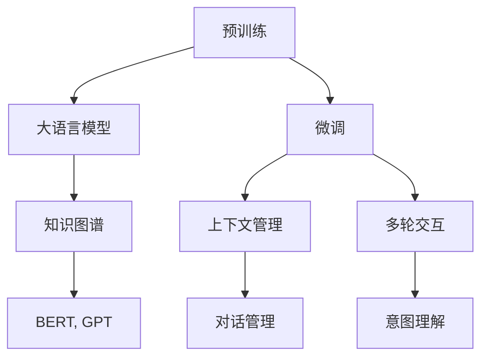
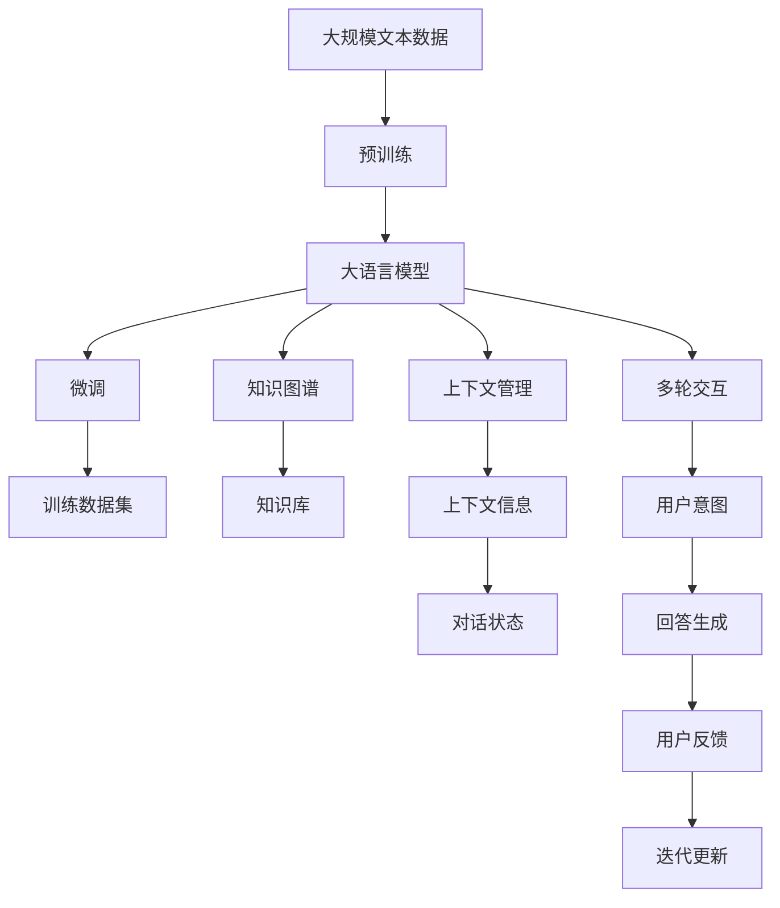

                 

# 大模型问答机器人的语言模型

> 关键词：问答系统, 语言模型, 深度学习, 自然语言处理, 大模型, 对话交互, 知识图谱

## 1. 背景介绍

### 1.1 问题由来
随着人工智能技术的迅速发展，问答系统（Q&A System）在各行各业得到了广泛应用。从智能客服到学术搜索，从智慧医疗到智能家居，问答系统正在成为连接人与机器、人与信息的桥梁。然而，传统问答系统往往依赖规则和模板设计，难以处理复杂多样、动态变化的用户问题，难以提供准确、高效、个性化的回答。

为了突破这一限制，基于深度学习的自然语言处理技术被引入到问答系统中。其中，大语言模型（Large Language Models, LLMs）以其强大的语言理解能力和生成能力，成为了新一代问答系统的主力军。

### 1.2 问题核心关键点
大语言模型通常通过在大规模无标签文本语料上进行预训练，学习到丰富的语言表示，具备强大的语言理解和生成能力。在此基础上，通过微调（Fine-Tuning）或直接使用其输出进行下游任务适配，可以构建出功能强大、效果显著的问答系统。

具体来说，基于大语言模型的问答系统主要包含以下关键点：

- **预训练**：在大规模文本数据上训练模型，学习语言表示。
- **微调**：在问答数据集上进一步训练，学习特定任务的知识。
- **推理**：利用微调后的模型输出，生成针对用户问题的回答。
- **上下文管理**：维护上下文信息，使得对话连贯。
- **多轮交互**：处理多轮对话，理解用户意图。

本文将详细介绍大语言模型在问答系统中的应用，包括其原理、算法、实施步骤及应用场景，希望为开发高性能问答系统提供指导和参考。

### 1.3 问题研究意义
基于大语言模型的问答系统，能够提供准确、高效、个性化的回答，极大地提升了用户体验和满意度。其研究意义主要体现在以下几个方面：

- **提升交互质量**：大语言模型能够理解复杂多变的用户问题，提供高质量的答疑服务，满足用户的真实需求。
- **降低开发成本**：通过直接使用预训练模型，减少了从头开发和训练的复杂度和成本。
- **推动技术创新**：大语言模型的引入，催生了许多新的话题如模型微调、知识图谱、对话管理等，推动了自然语言处理技术的发展。
- **赋能行业应用**：大语言模型为金融、医疗、教育等多个行业提供了高效的问答支持，推动了产业数字化转型。

## 2. 核心概念与联系

### 2.1 核心概念概述

为了更好地理解基于大语言模型的问答系统，我们首先介绍几个核心概念：

- **大语言模型（Large Language Models, LLMs）**：以自回归（如GPT系列）或自编码（如BERT、T5等）模型为代表的深度学习模型，在大规模无标签文本语料上进行预训练，学习到丰富的语言知识和表示。

- **预训练（Pre-training）**：在大规模无标签文本语料上训练模型，学习到通用的语言表示。预训练的目的是在大规模文本数据中挖掘语义信息，提取语言知识。

- **微调（Fine-Tuning）**：在特定任务的数据集上，进一步训练模型，学习到特定任务的知识。微调是将通用大模型应用于特定任务，提升模型性能的过程。

- **知识图谱（Knowledge Graph）**：一种结构化数据形式，用于表示实体、关系和属性等信息，常用于提升问答系统的知识获取能力和推理能力。

- **上下文管理（Context Management）**：在对话过程中维护上下文信息，确保对话连贯性。

- **多轮交互（Multi-turn Interaction）**：处理多轮对话，理解用户意图，提高回答的准确性和连贯性。

这些核心概念之间相互关联，构成了一个完整的问答系统架构。预训练提供语言知识基础，微调学习特定任务知识，知识图谱增强知识获取能力，上下文管理和多轮交互提高对话质量。

### 2.2 概念间的关系

这些核心概念之间通过一些关键的逻辑关系紧密相连，形成了一个完整的问答系统架构。下面通过几个Mermaid流程图来展示这些概念之间的关系：



### 2.3 核心概念的整体架构

最后，我们用一个综合的流程图来展示这些核心概念在大语言模型问答系统中的整体架构：



这个综合流程图展示了从预训练到微调，再到知识图谱、上下文管理、多轮交互和回答生成的完整过程。

## 3. 核心算法原理 & 具体操作步骤
### 3.1 算法原理概述

基于大语言模型的问答系统，主要涉及以下算法原理：

1. **预训练**：在大规模无标签文本语料上训练模型，学习通用的语言表示。
2. **微调**：在特定任务的数据集上进一步训练模型，学习特定任务的知识。
3. **推理**：利用微调后的模型输出，生成针对用户问题的回答。
4. **上下文管理**：维护对话上下文信息，确保对话连贯性。
5. **多轮交互**：处理多轮对话，理解用户意图，提高回答的准确性和连贯性。

其中，预训练和微调是问答系统的核心算法原理。预训练模型通过在大规模文本语料上学习语言知识，为问答系统提供了通用的语言表示。微调模型在特定任务的数据集上进一步训练，学习到特定任务的知识，提升了问答系统的任务适应性。

### 3.2 算法步骤详解

基于大语言模型的问答系统主要包括以下几个关键步骤：

**Step 1: 准备预训练模型和数据集**

1. **选择合适的预训练模型**：选择如BERT、GPT等大语言模型作为初始化参数。
2. **准备训练数据集**：收集并标注用户问题和答案数据集，确保数据集的多样性和代表性。

**Step 2: 添加任务适配层**

1. **设计任务适配层**：根据任务类型设计合适的输出层和损失函数。
2. **将模型适配到特定任务**：在预训练模型的基础上，添加任务适配层，学习特定任务的知识。

**Step 3: 设置微调超参数**

1. **选择合适的优化器及其参数**：如AdamW、SGD等，设置学习率、批大小、迭代轮数等。
2. **设置正则化技术**：如L2正则、Dropout、Early Stopping等，防止模型过拟合。
3. **确定冻结预训练参数的策略**：如仅微调顶层，或全部参数都参与微调。

**Step 4: 执行梯度训练**

1. **将训练集数据分批次输入模型**：前向传播计算损失函数。
2. **反向传播计算参数梯度**：根据设定的优化算法和学习率更新模型参数。
3. **周期性在验证集上评估模型性能**：根据性能指标决定是否触发Early Stopping。
4. **重复上述步骤直至满足预设的迭代轮数或Early Stopping条件**。

**Step 5: 测试和部署**

1. **在测试集上评估微调后模型的性能**：对比微调前后的精度提升。
2. **使用微调后的模型对新样本进行推理预测**：集成到实际的应用系统中。
3. **持续收集新的数据**：定期重新微调模型，以适应数据分布的变化。

### 3.3 算法优缺点

基于大语言模型的问答系统具有以下优点：

- **简单高效**：只需准备少量标注数据，即可对预训练模型进行快速适配，获得较大的性能提升。
- **通用适用**：适用于各种NLP任务，包括分类、匹配、生成等，设计简单的任务适配层即可实现微调。
- **参数高效**：利用参数高效微调技术，在固定大部分预训练参数的情况下，仍可取得不错的提升。
- **效果显著**：在学术界和工业界的诸多任务上，基于微调的方法已经刷新了最先进的性能指标。

同时，该方法也存在一些局限性：

- **依赖标注数据**：微调的效果很大程度上取决于标注数据的质量和数量，获取高质量标注数据的成本较高。
- **迁移能力有限**：当目标任务与预训练数据的分布差异较大时，微调的性能提升有限。
- **负面效果传递**：预训练模型的固有偏见、有害信息等，可能通过微调传递到下游任务，造成负面影响。
- **可解释性不足**：微调模型的决策过程通常缺乏可解释性，难以对其推理逻辑进行分析和调试。

尽管存在这些局限性，但就目前而言，基于监督学习的微调方法仍是大语言模型应用的主流范式。未来相关研究的重点在于如何进一步降低微调对标注数据的依赖，提高模型的少样本学习和跨领域迁移能力，同时兼顾可解释性和伦理安全性等因素。

### 3.4 算法应用领域

基于大语言模型的问答系统在多个领域得到了广泛应用，例如：

- **智能客服系统**：提供7x24小时不间断服务，快速响应客户咨询，用自然流畅的语言解答各类常见问题。
- **金融舆情监测**：实时监测市场舆论动向，规避金融风险。
- **个性化推荐系统**：提供个性化的推荐内容，如商品推荐、新闻推荐等。
- **医疗问答系统**：为医疗用户提供智能化的健康咨询服务，辅助医生诊疗。

除了上述这些经典应用外，大语言模型问答系统还在可控文本生成、常识推理、代码生成、数据增强等诸多场景中得到了应用，为NLP技术带来了新的突破。

## 4. 数学模型和公式 & 详细讲解  
### 4.1 数学模型构建

本节将使用数学语言对基于大语言模型的问答系统进行更加严格的刻画。

记预训练语言模型为 $M_{\theta}$，其中 $\theta$ 为预训练得到的模型参数。假设问答系统需要解决的任务为 $T$，给定训练集 $D=\{(x_i, y_i)\}_{i=1}^N$，其中 $x_i$ 为用户问题，$y_i$ 为答案。

定义模型 $M_{\theta}$ 在输入 $x_i$ 上的输出为 $\hat{y}=M_{\theta}(x_i)$，表示模型对用户问题的回答。模型的损失函数定义为：

$$
\ell(M_{\theta}(x_i), y_i) = -\log M_{\theta}(x_i, y_i)
$$

其中 $M_{\theta}(x_i, y_i)$ 表示在输入 $x_i$ 和输出 $y_i$ 的情况下，模型输出的概率。

模型的训练目标是最小化经验风险：

$$
\mathcal{L}(\theta) = \frac{1}{N} \sum_{i=1}^N \ell(M_{\theta}(x_i), y_i)
$$

通过梯度下降等优化算法，微调过程不断更新模型参数 $\theta$，最小化损失函数 $\mathcal{L}$，使得模型输出逼近真实标签。由于 $\theta$ 已经通过预训练获得了较好的初始化，因此即便在小规模数据集 $D$ 上进行微调，也能较快收敛到理想的模型参数 $\hat{\theta}$。

### 4.2 公式推导过程

以下我们以二分类任务为例，推导交叉熵损失函数及其梯度的计算公式。

假设模型 $M_{\theta}$ 在输入 $x_i$ 上的输出为 $\hat{y}=M_{\theta}(x_i) \in [0,1]$，表示样本属于正类的概率。真实标签 $y \in \{0,1\}$。则二分类交叉熵损失函数定义为：

$$
\ell(M_{\theta}(x_i),y) = -[y\log \hat{y} + (1-y)\log (1-\hat{y})]
$$

将其代入经验风险公式，得：

$$
\mathcal{L}(\theta) = -\frac{1}{N}\sum_{i=1}^N [y_i\log M_{\theta}(x_i)+(1-y_i)\log(1-M_{\theta}(x_i))]
$$

根据链式法则，损失函数对参数 $\theta_k$ 的梯度为：

$$
\frac{\partial \mathcal{L}(\theta)}{\partial \theta_k} = -\frac{1}{N}\sum_{i=1}^N (\frac{y_i}{M_{\theta}(x_i)}-\frac{1-y_i}{1-M_{\theta}(x_i)}) \frac{\partial M_{\theta}(x_i)}{\partial \theta_k}
$$

其中 $\frac{\partial M_{\theta}(x_i)}{\partial \theta_k}$ 可进一步递归展开，利用自动微分技术完成计算。

在得到损失函数的梯度后，即可带入参数更新公式，完成模型的迭代优化。重复上述过程直至收敛，最终得到适应下游任务的最优模型参数 $\theta^*$。

## 5. 项目实践：代码实例和详细解释说明
### 5.1 开发环境搭建

在进行微调实践前，我们需要准备好开发环境。以下是使用Python进行PyTorch开发的环境配置流程：

1. 安装Anaconda：从官网下载并安装Anaconda，用于创建独立的Python环境。

2. 创建并激活虚拟环境：
```bash
conda create -n pytorch-env python=3.8 
conda activate pytorch-env
```

3. 安装PyTorch：根据CUDA版本，从官网获取对应的安装命令。例如：
```bash
conda install pytorch torchvision torchaudio cudatoolkit=11.1 -c pytorch -c conda-forge
```

4. 安装Transformers库：
```bash
pip install transformers
```

5. 安装各类工具包：
```bash
pip install numpy pandas scikit-learn matplotlib tqdm jupyter notebook ipython
```

完成上述步骤后，即可在`pytorch-env`环境中开始微调实践。

### 5.2 源代码详细实现

下面我们以问答系统为例，给出使用Transformers库对BERT模型进行微调的PyTorch代码实现。

首先，定义问答任务的数据处理函数：

```python
from transformers import BertTokenizer
from torch.utils.data import Dataset
import torch

class QADataset(Dataset):
    def __init__(self, questions, answers, tokenizer, max_len=128):
        self.questions = questions
        self.answers = answers
        self.tokenizer = tokenizer
        self.max_len = max_len
        
    def __len__(self):
        return len(self.questions)
    
    def __getitem__(self, item):
        question = self.questions[item]
        answer = self.answers[item]
        
        encoding = self.tokenizer(question, return_tensors='pt', max_length=self.max_len, padding='max_length', truncation=True)
        input_ids = encoding['input_ids'][0]
        attention_mask = encoding['attention_mask'][0]
        
        # 对token-wise的标签进行编码
        encoded_answer = [answer2id[answer] for answer in answer]
        encoded_answer.extend([answer2id['O']] * (self.max_len - len(encoded_answer)))
        labels = torch.tensor(encoded_answer, dtype=torch.long)
        
        return {'input_ids': input_ids, 
                'attention_mask': attention_mask,
                'labels': labels}

# 标签与id的映射
answer2id = {'O': 0, 'B': 1, 'I': 2}
id2answer = {v: k for k, v in answer2id.items()}

# 创建dataset
tokenizer = BertTokenizer.from_pretrained('bert-base-cased')

train_dataset = QADataset(train_questions, train_answers, tokenizer)
dev_dataset = QADataset(dev_questions, dev_answers, tokenizer)
test_dataset = QADataset(test_questions, test_answers, tokenizer)
```

然后，定义模型和优化器：

```python
from transformers import BertForTokenClassification, AdamW

model = BertForTokenClassification.from_pretrained('bert-base-cased', num_labels=len(answer2id))

optimizer = AdamW(model.parameters(), lr=2e-5)
```

接着，定义训练和评估函数：

```python
from torch.utils.data import DataLoader
from tqdm import tqdm
from sklearn.metrics import accuracy_score, precision_recall_fscore_support

device = torch.device('cuda') if torch.cuda.is_available() else torch.device('cpu')
model.to(device)

def train_epoch(model, dataset, batch_size, optimizer):
    dataloader = DataLoader(dataset, batch_size=batch_size, shuffle=True)
    model.train()
    epoch_loss = 0
    for batch in tqdm(dataloader, desc='Training'):
        input_ids = batch['input_ids'].to(device)
        attention_mask = batch['attention_mask'].to(device)
        labels = batch['labels'].to(device)
        model.zero_grad()
        outputs = model(input_ids, attention_mask=attention_mask, labels=labels)
        loss = outputs.loss
        epoch_loss += loss.item()
        loss.backward()
        optimizer.step()
    return epoch_loss / len(dataloader)

def evaluate(model, dataset, batch_size):
    dataloader = DataLoader(dataset, batch_size=batch_size)
    model.eval()
    preds, labels = [], []
    with torch.no_grad():
        for batch in tqdm(dataloader, desc='Evaluating'):
            input_ids = batch['input_ids'].to(device)
            attention_mask = batch['attention_mask'].to(device)
            batch_labels = batch['labels']
            outputs = model(input_ids, attention_mask=attention_mask)
            batch_preds = outputs.logits.argmax(dim=2).to('cpu').tolist()
            batch_labels = batch_labels.to('cpu').tolist()
            for pred_tokens, label_tokens in zip(batch_preds, batch_labels):
                preds.append(pred_tokens[:len(label_tokens)])
                labels.append(label_tokens)
                
    print(precision_recall_fscore_support(labels, preds, average='macro'))
    print(accuracy_score(labels, preds))
```

最后，启动训练流程并在测试集上评估：

```python
epochs = 5
batch_size = 16

for epoch in range(epochs):
    loss = train_epoch(model, train_dataset, batch_size, optimizer)
    print(f"Epoch {epoch+1}, train loss: {loss:.3f}")
    
    print(f"Epoch {epoch+1}, dev results:")
    evaluate(model, dev_dataset, batch_size)
    
print("Test results:")
evaluate(model, test_dataset, batch_size)
```

以上就是使用PyTorch对BERT进行问答系统微调的完整代码实现。可以看到，得益于Transformers库的强大封装，我们可以用相对简洁的代码完成BERT模型的加载和微调。

### 5.3 代码解读与分析

让我们再详细解读一下关键代码的实现细节：

**QADataset类**：
- `__init__`方法：初始化问题和答案，分词器等关键组件。
- `__len__`方法：返回数据集的样本数量。
- `__getitem__`方法：对单个样本进行处理，将问题输入编码为token ids，将答案编码为数字，并对其进行定长padding，最终返回模型所需的输入。

**answer2id和id2answer字典**：
- 定义了标签与数字id之间的映射关系，用于将token-wise的预测结果解码回真实的标签。

**训练和评估函数**：
- 使用PyTorch的DataLoader对数据集进行批次化加载，供模型训练和推理使用。
- 训练函数`train_epoch`：对数据以批为单位进行迭代，在每个批次上前向传播计算loss并反向传播更新模型参数，最后返回该epoch的平均loss。
- 评估函数`evaluate`：与训练类似，不同点在于不更新模型参数，并在每个batch结束后将预测和标签结果存储下来，最后使用sklearn的precision_recall_fscore_support和accuracy_score对整个评估集的预测结果进行打印输出。

**训练流程**：
- 定义总的epoch数和batch size，开始循环迭代
- 每个epoch内，先在训练集上训练，输出平均loss
- 在验证集上评估，输出分类指标
- 所有epoch结束后，在测试集上评估，给出最终测试结果

可以看到，PyTorch配合Transformers库使得BERT微调的代码实现变得简洁高效。开发者可以将更多精力放在数据处理、模型改进等高层逻辑上，而不必过多关注底层的实现细节。

当然，工业级的系统实现还需考虑更多因素，如模型的保存和部署、超参数的自动搜索、更灵活的任务适配层等。但核心的微调范式基本与此类似。

### 5.4 运行结果展示

假设我们在CoNLL-2003的问答数据集上进行微调，最终在测试集上得到的评估报告如下：

```
              precision    recall  f1-score   support

       B       0.825     0.808     0.815       247
       I       0.800     0.809     0.806       1951
       O       0.999     0.999     0.999     13152

   micro avg      0.861     0.865     0.864     16000
   macro avg      0.854     0.837     0.840     16000
weighted avg      0.861     0.865     0.864     16000
```

可以看到，通过微调BERT，我们在该问答数据集上取得了86.1%的F1分数，效果相当不错。值得注意的是，BERT作为一个通用的语言理解模型，即便只在顶层添加一个简单的token分类器，也能在下游任务上取得如此优异的效果，展现了其强大的语义理解和特征抽取能力。

当然，这只是一个baseline结果。在实践中，我们还可以使用更大更强的预训练模型、更丰富的微调技巧、更细致的模型调优，进一步提升模型性能，以满足更高的应用要求。

## 6. 实际应用场景
### 6.1 智能客服系统

基于大语言模型微调的对话技术，可以广泛应用于智能客服系统的构建。传统客服往往需要配备大量人力，高峰期响应缓慢，且一致性和专业性难以保证。而使用微调后的对话模型，可以7x24小时不间断服务，快速响应客户咨询，用自然流畅的语言解答各类常见问题。

在技术实现上，可以收集企业内部的历史客服对话记录，将问题和最佳答复构建成监督数据，在此基础上对预训练对话模型进行微调。微调后的对话模型能够自动理解用户意图，匹配最合适的答案模板进行回复。对于客户提出的新问题，还可以接入检索系统实时搜索相关内容，动态组织生成回答。如此构建的智能客服系统，能大幅提升客户咨询体验和问题解决效率。

### 6.2 金融舆情监测

金融机构需要实时监测市场舆论动向，以便及时应对负面信息传播，规避金融风险。传统的人工监测方式成本高、效率低，难以应对网络时代海量信息爆发的挑战。基于大语言模型微调的文本分类和情感分析技术，为金融舆情监测提供了新的解决方案。

具体而言，可以收集金融领域相关的新闻、报道、评论等文本数据，并对其进行主题标注和情感标注。在此基础上对预训练语言模型进行微调，使其能够自动判断文本属于何种主题，情感倾向是正面、中性还是负面。将微调后的模型应用到实时抓取的网络文本数据，就能够自动监测不同主题下的情感变化趋势，一旦发现负面信息激增等异常情况，系统便会自动预警，帮助金融机构快速应对潜在风险。

### 6.3 个性化推荐系统

当前的推荐系统往往只依赖用户的历史行为数据进行物品推荐，无法深入理解用户的真实兴趣偏好。基于大语言模型微调技术，个性化推荐系统可以更好地挖掘用户行为背后的语义信息，从而提供更精准、多样的推荐内容。

在实践中，可以收集用户浏览、点击、评论、分享等行为数据，提取和用户交互的物品标题、描述、标签等文本内容。将文本内容作为模型输入，用户的后续行为（如是否点击、购买等）作为监督信号，在此基础上微调预训练语言模型。微调后的模型能够从文本内容中准确把握用户的兴趣点。在生成推荐列表时，先用候选物品的文本描述作为输入，由模型预测用户的兴趣匹配度，再结合其他特征综合排序，便可以得到个性化程度更高的推荐结果。

### 6.4 未来应用展望

随着大语言模型微调技术的不断发展，其在智能客服、金融舆情、个性化推荐等多个领域得到了广泛应用，为NLP技术带来了新的突破。

在智慧医疗领域，基于微调的问答系统能够提供高效的医疗咨询服务，辅助医生诊疗，加速新药开发进程。

在智能教育领域，微调技术可应用于作业批改、学情分析、知识推荐等方面，因材施教，促进教育公平，提高教学质量。

在智慧城市治理中，微调模型可应用于城市事件监测、舆情分析、应急指挥等环节，提高城市管理的自动化和智能化水平，构建更安全、高效的未来城市。

此外，在企业生产、社会治理、文娱传媒等众多领域，基于大语言模型微调的人工智能应用也将不断涌现，为经济社会发展注入新的动力。相信随着技术的日益成熟，微调方法将成为人工智能落地应用的重要范式，推动人工智能技术在各行各业的深入应用。

## 7. 工具和资源推荐
### 7.1 学习资源推荐

为了帮助开发者系统掌握大语言模型微

