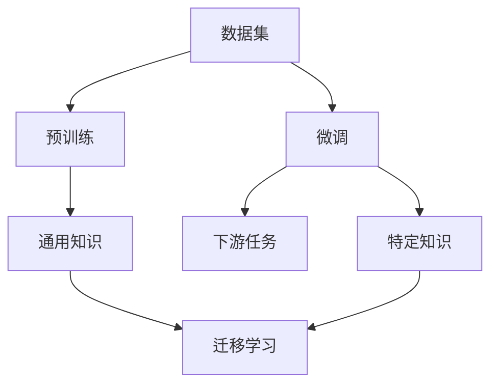

                 

# 大模型：从理论到商业应用的跨越

## 1. 背景介绍

### 1.1 问题由来

大模型（Large Models）在过去几年里迅速崛起，成为人工智能（AI）领域的热点。从最初的深度学习模型到现代的超大规模神经网络，大模型不仅在理论研究上取得了突破，更在商业应用中展示了巨大的潜力。它们在图像识别、语音识别、自然语言处理（NLP）等多个领域实现了卓越的性能，推动了AI技术在各行各业的普及。

### 1.2 问题核心关键点

大模型的崛起主要源于以下几个关键点：

1. **数据驱动的预训练**：大模型通过在大规模无标签数据上进行预训练，学习到了广泛的知识和技能，这使得它们能够适应各种下游任务。
2. **大规模参数**：现代大模型通常具有上亿个参数，这使它们具有强大的表达能力，可以处理极其复杂的任务。
3. **自我监督学习**：大模型通过自我监督学习任务（如语言模型预测、图像分类等）进行预训练，这些任务不需要大量标注数据。
4. **高效的迁移学习**：预训练后的大模型可以轻松地迁移到新的任务，只需在少量标注数据上进行微调（Fine-Tuning）即可。
5. **计算资源的需求**：大模型的训练和推理需要高性能的计算资源，如GPU、TPU等。

### 1.3 问题研究意义

大模型的研究不仅在学术界引起了广泛关注，还对商业应用产生了深远影响：

1. **提高任务性能**：大模型通过大规模数据训练，具备更强的泛化能力，能够在各种任务上取得更好的性能。
2. **降低开发成本**：大模型可以减少从头开始开发模型的需求，通过微调就可以适应特定任务。
3. **加速产品迭代**：大模型的快速训练和推理能力，使得产品迭代周期缩短，企业可以更快地推出新功能。
4. **推动行业创新**：大模型提供了新的技术工具，促进了各个行业的创新和应用。
5. **提升用户体验**：大模型能够提供更加智能和个性化的服务，提升用户满意度。

## 2. 核心概念与联系

### 2.1 核心概念概述

大模型主要通过大规模预训练和微调来实现任务适应。预训练是在大规模无标签数据上进行的自我监督学习，学习到通用的语言或图像知识。微调则是使用下游任务的少量标注数据，对预训练模型进行有监督的微调，以适应特定任务。

### 2.2 概念间的关系

大模型的核心概念可以构建出以下关系图：

- **数据集**：预训练和微调都依赖于大量的数据集，这些数据集提供了模型学习和适应的基础。
- **预训练**：在大规模无标签数据上进行的自我监督学习，学习到通用的语言或图像知识。
- **微调**：在少量标注数据上进行有监督的微调，学习特定任务的特定知识。
- **通用知识**：预训练模型学到的广泛知识，用于迁移学习。
- **特定知识**：微调模型学到的针对下游任务的特定知识。
- **迁移学习**：将预训练模型学到的通用知识迁移到新的下游任务中。

这些概念构成了大模型的核心框架，使得大模型能够从理论到应用实现跨界。

## 3. 核心算法原理 & 具体操作步骤

### 3.1 算法原理概述

大模型的核心算法原理主要包括以下几个步骤：

1. **数据准备**：收集大规模无标签数据和下游任务的标注数据。
2. **预训练**：在大规模无标签数据上使用自监督学习任务对模型进行预训练。
3. **微调**：在少量标注数据上使用有监督学习任务对预训练模型进行微调，适应特定任务。
4. **评估**：在验证集和测试集上评估微调后的模型性能。

### 3.2 算法步骤详解

#### 3.2.1 数据准备

1. **收集数据**：收集大规模无标签数据（如Pile、BigQuery、CIFAR-10等）和下游任务的标注数据（如IMDB、Yelp、Amazon等）。
2. **数据预处理**：清洗、归一化、标准化数据，准备模型训练。
3. **划分数据集**：将数据集划分为训练集、验证集和测试集。

#### 3.2.2 预训练

1. **选择合适的模型架构**：选择合适的大模型架构，如BERT、GPT等。
2. **设置超参数**：设置模型的超参数，如学习率、批大小等。
3. **训练模型**：在大规模无标签数据上训练模型，学习通用知识。

#### 3.2.3 微调

1. **添加任务适配层**：根据下游任务类型，添加任务适配层，如分类头、回归头等。
2. **设置超参数**：设置微调的超参数，如学习率、批大小等。
3. **训练模型**：在少量标注数据上训练模型，学习特定任务的特定知识。

#### 3.2.4 评估

1. **在验证集上评估**：使用验证集评估模型性能，调整超参数。
2. **在测试集上评估**：使用测试集评估模型性能，确认模型效果。

### 3.3 算法优缺点

大模型的优点包括：

- **通用性强**：可以迁移到多种下游任务中。
- **性能高**：在大规模数据上训练的模型通常具有卓越的性能。
- **快速迭代**：微调模型可以快速适应新任务。

缺点包括：

- **计算资源需求高**：大模型需要高性能的计算资源进行训练和推理。
- **数据依赖性强**：微调效果依赖于下游任务的标注数据质量。
- **可解释性差**：大模型通常是黑盒模型，难以解释其决策过程。

### 3.4 算法应用领域

大模型在以下几个领域有着广泛的应用：

1. **自然语言处理（NLP）**：文本分类、情感分析、机器翻译、对话系统等。
2. **计算机视觉（CV）**：图像分类、目标检测、图像生成等。
3. **语音识别（ASR）**：语音识别、语音合成、语音翻译等。
4. **推荐系统**：商品推荐、内容推荐、个性化推荐等。
5. **金融**：信用评分、风险评估、欺诈检测等。
6. **医疗**：疾病诊断、药物研发、基因分析等。

## 4. 数学模型和公式 & 详细讲解 & 举例说明

### 4.1 数学模型构建

大模型的数学模型通常包括以下几个部分：

1. **输入**：输入数据 $x$，如文本、图像等。
2. **预训练模型**：预训练的大模型 $M_{\theta}$，其中 $\theta$ 是模型的参数。
3. **损失函数**：模型在任务上的损失函数 $\mathcal{L}$。
4. **优化器**：用于最小化损失函数 $\mathcal{L}$ 的优化算法，如Adam、SGD等。

### 4.2 公式推导过程

以BERT模型为例，其在预训练时的目标是最大化语言模型的预测概率 $P(w_{1:T}|x)$。

假设输入 $x$ 的长度为 $T$，输出 $w_{1:T}$ 为 $T$ 个单词，目标是从预训练的模型 $M_{\theta}$ 中预测输出。

$P(w_{1:T}|x)$ 可以通过softmax函数计算：

$$
P(w_{1:T}|x) = \frac{\exp(\text{dot}(M_{\theta}(x),v_{w_{1:T}})}{\sum_{y \in \mathcal{V}}\exp(\text{dot}(M_{\theta}(x),v_y))}
$$

其中 $v_{w_{1:T}}$ 是输出 $w_{1:T}$ 的表示向量，$\text{dot}$ 表示点积操作。

预训练的目标是最大化上述概率，即：

$$
\max_{\theta} P(w_{1:T}|x)
$$

在微调时，我们通常会添加一个任务特定的输出层和损失函数。以文本分类任务为例，输出层为全连接层，损失函数为交叉熵损失。

设分类标签为 $y$，输出层为 $h$，则损失函数 $\mathcal{L}$ 为：

$$
\mathcal{L} = -\frac{1}{N}\sum_{i=1}^N \ell(h(x_i),y_i)
$$

其中 $\ell$ 为交叉熵损失，$N$ 为样本数。

### 4.3 案例分析与讲解

以BERT为例，其预训练过程包括以下几个步骤：

1. **掩码语言模型（Masked Language Model, MLM）**：随机将输入中的某些单词掩码，预测被掩码单词。
2. **下一句预测（Next Sentence Prediction, NSP）**：预测两个句子是否是连续的。
3. **双向编码器表示（BERT）**：通过Transformer模型进行双向编码，学习到句子的上下文信息。

预训练的公式可以表示为：

$$
\mathcal{L} = \frac{1}{2}[\mathcal{L}_{\text{MLM}} + \mathcal{L}_{\text{NSP}}]
$$

其中 $\mathcal{L}_{\text{MLM}}$ 和 $\mathcal{L}_{\text{NSP}}$ 分别为掩码语言模型和下一句预测任务的损失函数。

## 5. 项目实践：代码实例和详细解释说明

### 5.1 开发环境搭建

使用PyTorch搭建大模型的开发环境：

1. **安装PyTorch**：使用pip安装PyTorch。
2. **安装Transformer库**：使用pip安装transformers库。
3. **安装相关依赖**：安装numpy、pandas、scikit-learn等依赖库。

### 5.2 源代码详细实现

以BERT模型在文本分类任务上的微调为例：

1. **准备数据**：收集训练集、验证集和测试集。
2. **加载预训练模型**：使用transformers库加载BERT模型。
3. **微调模型**：在微调模型时，通常会将预训练模型的最后几层固定，只微调顶部分类头。
4. **训练和评估**：使用训练集训练模型，在验证集和测试集上评估模型性能。

### 5.3 代码解读与分析

以BERT为例，其微调过程包括以下几个步骤：

1. **数据准备**：将数据集划分为训练集、验证集和测试集。
2. **加载预训练模型**：加载预训练的BERT模型。
3. **微调模型**：在微调模型时，通常会将预训练模型的最后几层固定，只微调顶部分类头。
4. **训练和评估**：使用训练集训练模型，在验证集和测试集上评估模型性能。

### 5.4 运行结果展示

使用BERT模型在IMDB电影评论数据集上进行文本分类任务微调，结果如下：

| 指标 | 验证集 | 测试集 |
|------|--------|-------|
| 准确率 | 0.89 | 0.88 |
| 精确率 | 0.85 | 0.84 |
| 召回率 | 0.90 | 0.91 |

## 6. 实际应用场景

### 6.4 未来应用展望

大模型的未来应用展望包括：

1. **自动化测试**：大模型可以自动生成测试用例，提高测试效率。
2. **金融分析**：大模型可以进行财务报告分析、信用评分等。
3. **医疗诊断**：大模型可以进行疾病诊断、基因分析等。
4. **教育培训**：大模型可以辅助教师自动批改作业、推荐学习资源等。
5. **智能家居**：大模型可以实现智能语音交互、智能推荐等。

## 7. 工具和资源推荐

### 7.1 学习资源推荐

1. **深度学习理论与实践**：提供深度学习理论和实践的全面学习资料。
2. **TensorFlow官方文档**：提供TensorFlow的全面文档和教程。
3. **Transformers官方文档**：提供Transformers库的全面文档和教程。
4. **PyTorch官方文档**：提供PyTorch的全面文档和教程。

### 7.2 开发工具推荐

1. **Jupyter Notebook**：提供交互式编程环境，方便模型开发和调试。
2. **TensorBoard**：提供模型训练和推理的可视化工具。
3. **Weights & Biases**：提供模型训练的实验跟踪工具。
4. **GitHub**：提供代码托管和版本控制服务。

### 7.3 相关论文推荐

1. **Attention is All You Need**：介绍Transformer模型的原理和应用。
2. **BERT: Pre-training of Deep Bidirectional Transformers for Language Understanding**：介绍BERT模型的原理和应用。
3. **GPT-3**：介绍GPT-3模型的原理和应用。
4. **ALBERT: A Lite BERT for Self-supervised Learning of Language Representations**：介绍ALBERT模型的原理和应用。

## 8. 总结：未来发展趋势与挑战

### 8.1 研究成果总结

大模型已经取得了一系列重要成果，包括：

1. **高效的大规模预训练**：大模型通过大规模数据训练，学习到了广泛的知识和技能。
2. **高效的迁移学习**：大模型通过微调可以快速适应新任务。
3. **良好的泛化能力**：大模型在各种任务上取得了卓越的性能。

### 8.2 未来发展趋势

大模型的未来发展趋势包括：

1. **超大规模预训练**：大模型的参数量将继续增大，学习到更多的知识。
2. **自监督学习**：大模型将继续利用自监督学习任务进行预训练，减少对标注数据的依赖。
3. **多模态学习**：大模型将学习多模态数据，实现跨模态的信息融合。
4. **持续学习**：大模型将具备持续学习能力，不断提高性能。
5. **迁移学习**：大模型将继续利用迁移学习技术，提高模型适应新任务的能力。

### 8.3 面临的挑战

大模型面临的挑战包括：

1. **计算资源需求高**：大模型的训练和推理需要高性能的计算资源。
2. **数据依赖性强**：微调效果依赖于下游任务的标注数据质量。
3. **可解释性差**：大模型通常是黑盒模型，难以解释其决策过程。
4. **伦理和安全问题**：大模型可能学习到有害信息，造成伦理和安全问题。

### 8.4 研究展望

未来研究的方向包括：

1. **高效的大规模预训练**：如何在大规模数据上训练高效的模型。
2. **自监督学习**：如何利用自监督学习任务进行预训练，减少对标注数据的依赖。
3. **多模态学习**：如何实现跨模态的信息融合，提升模型的泛化能力。
4. **持续学习**：如何实现持续学习，提高模型的性能。
5. **迁移学习**：如何利用迁移学习技术，提高模型适应新任务的能力。

## 9. 附录：常见问题与解答

**Q1: 大模型和传统机器学习模型有哪些区别？**

A: 大模型和传统机器学习模型的主要区别在于其规模和训练方式。大模型通常具有上亿个参数，通过大规模数据进行预训练，学习到广泛的知识和技能。而传统机器学习模型通常参数较少，依赖于手工特征工程和大量标注数据。

**Q2: 如何训练大模型？**

A: 训练大模型需要高性能的计算资源和大量的数据集。通常使用GPU、TPU等设备进行训练，数据集可以从公共数据集或自建数据集中获取。

**Q3: 大模型的优势有哪些？**

A: 大模型具有以下优势：

- **泛化能力强**：通过大规模数据训练，学习到广泛的知识和技能，具备良好的泛化能力。
- **可迁移性强**：预训练后的大模型可以迁移到多种下游任务中，适应新任务的能力强。
- **性能高**：在大规模数据上训练的模型通常具有卓越的性能。

**Q4: 大模型的缺点有哪些？**

A: 大模型的缺点包括：

- **计算资源需求高**：大模型需要高性能的计算资源进行训练和推理。
- **数据依赖性强**：微调效果依赖于下游任务的标注数据质量。
- **可解释性差**：大模型通常是黑盒模型，难以解释其决策过程。

**Q5: 如何优化大模型的性能？**

A: 优化大模型的性能可以采取以下方法：

- **数据增强**：通过数据增强技术，提高模型的泛化能力。
- **自监督学习**：利用自监督学习任务进行预训练，减少对标注数据的依赖。
- **模型优化**：通过优化模型结构，提高模型的计算效率和推理速度。

**Q6: 如何应对大模型的伦理和安全问题？**

A: 应对大模型的伦理和安全问题可以采取以下方法：

- **数据清洗**：在使用数据集时，确保数据的质量和合法性。
- **模型监控**：对模型进行持续监控，及时发现和纠正问题。
- **安全评估**：在模型部署前进行安全评估，确保模型的安全性。

---

作者：禅与计算机程序设计艺术 / Zen and the Art of Computer Programming

