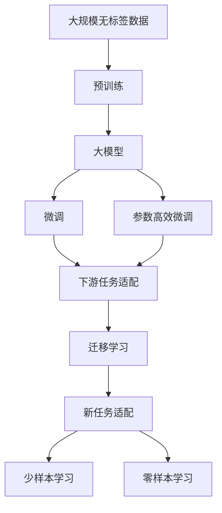

                 

# 大模型：推动智能化发展的关键

大模型是大规模预训练模型的简称，通常指具有数十亿甚至数百亿参数的神经网络模型。这类模型通过在大量无标签数据上自监督预训练，学习到了丰富的语言或图像特征，具备强大的泛化能力。本文将深入探讨大模型的核心概念、算法原理及其在智能化发展中的应用，力求提供全面、深入、实用的技术解析。

## 1. 背景介绍

### 1.1 问题由来
在过去的几年里，随着深度学习技术的发展，大模型已经成为人工智能领域的热点。这些模型通过在数千亿字的无标签数据上进行自监督预训练，学习到了丰富的语言知识，能够自然地生成语言、分类、理解上下文等。大模型的出现，标志着人工智能技术从单一任务的浅层学习，迈向多任务的深层学习，推动了自然语言处理(NLP)、计算机视觉(CV)等领域的快速进步。

### 1.2 问题核心关键点
大模型的核心特点包括以下几个方面：
1. **大规模参数**：大模型通常拥有数十亿到数百亿的参数，需要强大的计算资源进行训练。
2. **自监督学习**：在大规模无标签数据上进行自监督预训练，学习通用的语言或图像表示。
3. **泛化能力强**：由于在大规模数据上预训练，模型具备很强的泛化能力，能够应对多种下游任务。
4. **特征抽取能力强**：能够从原始数据中提取出高层次的语义或视觉特征。

这些特点使得大模型在智能化的多个领域中得以应用，提升了任务完成的精度和效率。但同时，大模型的开发和应用也面临诸多挑战，如计算资源需求高、模型复杂度高、迁移能力有限等。

### 1.3 问题研究意义
研究大模型在智能化发展中的应用，对于推动人工智能技术的普及和应用具有重要意义：
1. **提高效率**：通过预训练-微调的方式，大模型可以显著减少从头训练的时间和计算成本。
2. **提升精度**：大模型具备强大的特征抽取能力和泛化能力，能够在各种下游任务中取得优异表现。
3. **拓展应用范围**：大模型可以在多个领域中应用，如NLP、CV、语音处理等，为各行各业带来智能化变革。
4. **促进技术创新**：大模型的出现促进了深度学习、自然语言处理等前沿技术的研究，催生了更多的新技术和新应用。

## 2. 核心概念与联系

### 2.1 核心概念概述

为更好地理解大模型及其应用，本节将介绍几个关键概念：

- **大模型**：大规模预训练模型，通常指参数数量在数十亿到数百亿的神经网络模型，如GPT-3、BERT等。
- **自监督学习**：在大规模无标签数据上进行自监督学习，学习通用的语言或图像表示。
- **预训练**：通过自监督学习任务在无标签数据上训练模型，学习通用的特征表示。
- **微调**：在预训练模型的基础上，使用下游任务的少量标注数据进行有监督学习，优化模型在特定任务上的性能。
- **迁移学习**：将一个领域学到的知识，迁移到另一个相关领域的学习，提高模型在新领域上的性能。
- **参数高效微调**：在微调过程中，只更新少量的模型参数，而固定大部分预训练权重不变，以提高微调效率。

这些核心概念之间的联系紧密，共同构成了大模型应用的基本框架。大模型的预训练阶段通常需要大量的计算资源，而微调阶段则能够利用预训练模型的强大特征表示，以较少的标注数据进行高效优化。

### 2.2 概念间的关系

大模型的应用通常涉及以下几个关键环节：

- **预训练阶段**：通过在大规模无标签数据上进行自监督学习，学习通用的语言或图像表示。
- **微调阶段**：在预训练模型的基础上，使用下游任务的少量标注数据进行有监督学习，优化模型在特定任务上的性能。
- **迁移学习**：通过微调或其他方式，将预训练模型迁移到新任务或新领域中，提高模型的泛化能力。
- **参数高效微调**：在微调过程中，只更新少量模型参数，而固定大部分预训练权重不变，以提高微调效率。
- **少样本学习**：在标注数据不足的情况下，通过微调或提示学习等方法，利用少量样本进行学习。
- **零样本学习**：在没有任何标注数据的情况下，通过预训练模型对任务进行理解和推理。

这些概念共同构成了一个完整的大模型应用生态系统，每个环节都在大模型的智能化发展中发挥着重要作用。

### 2.3 核心概念的整体架构

以下是一个综合的流程图，展示了从预训练到微调，再到迁移学习的大模型应用流程：



这个流程图展示了从预训练到迁移学习的大模型应用流程。预训练模型通过在大规模无标签数据上进行自监督学习，学习到通用的语言或图像表示。微调阶段在预训练模型的基础上，使用下游任务的少量标注数据进行有监督学习，优化模型在特定任务上的性能。迁移学习则将预训练模型迁移到新任务或新领域中，提高模型的泛化能力。参数高效微调和少样本学习、零样本学习等技术，进一步提升了大模型的应用效果。

## 3. 核心算法原理 & 具体操作步骤
### 3.1 算法原理概述

大模型的核心算法原理主要包括以下几个方面：

- **自监督预训练**：在大规模无标签数据上进行自监督学习，学习通用的语言或图像表示。
- **微调**：在预训练模型的基础上，使用下游任务的少量标注数据进行有监督学习，优化模型在特定任务上的性能。
- **迁移学习**：将预训练模型迁移到新任务或新领域中，提高模型的泛化能力。
- **参数高效微调**：在微调过程中，只更新少量模型参数，而固定大部分预训练权重不变，以提高微调效率。

### 3.2 算法步骤详解

大模型的应用通常涉及以下几个关键步骤：

1. **预训练阶段**：
   - 收集大规模无标签数据。
   - 选择适当的大模型结构，如BERT、GPT等。
   - 设计自监督学习任务，如语言模型、掩码语言模型等。
   - 在预训练数据上训练模型，学习通用的语言或图像表示。

2. **微调阶段**：
   - 收集下游任务的少量标注数据。
   - 冻结预训练模型的部分或全部参数。
   - 添加适当的任务适配层，如线性分类器、解码器等。
   - 在标注数据上使用有监督学习优化模型。

3. **迁移学习**：
   - 将预训练模型迁移到新任务或新领域中。
   - 在少量标注数据上微调模型，优化新任务的性能。
   - 通过迁移学习，提高模型在新领域的泛化能力。

4. **参数高效微调**：
   - 冻结预训练模型的部分或全部参数。
   - 只更新少量的任务相关参数。
   - 使用提示学习、Adapter等方法，提高微调效率。

### 3.3 算法优缺点

大模型的应用具有以下优点：

- **泛化能力强**：通过在大规模无标签数据上进行预训练，学习到通用的语言或图像表示，能够应对多种下游任务。
- **高效优化**：通过预训练-微调的方式，利用预训练模型的强大特征表示，能够快速优化模型性能。
- **灵活应用**：在微调过程中，可以通过参数高效微调、迁移学习等技术，灵活应用到各种下游任务和新领域中。

同时，大模型的应用也存在一些缺点：

- **计算资源需求高**：预训练阶段需要大量的计算资源，微调和迁移学习也需要强大的计算能力。
- **模型复杂度高**：大模型结构复杂，参数数量庞大，调试和部署难度较大。
- **迁移能力有限**：不同领域的数据分布差异较大，预训练模型的迁移能力有限。
- **可解释性不足**：大模型的决策过程缺乏可解释性，难以理解和调试。

### 3.4 算法应用领域

大模型的应用涉及多个领域，包括但不限于：

- **自然语言处理(NLP)**：如文本分类、情感分析、命名实体识别、机器翻译等。
- **计算机视觉(CV)**：如图像分类、目标检测、图像生成等。
- **语音处理**：如语音识别、语音合成、对话系统等。
- **推荐系统**：如商品推荐、音乐推荐等。
- **游戏AI**：如角色生成、决策优化等。

## 4. 数学模型和公式 & 详细讲解 & 举例说明

### 4.1 数学模型构建

大模型的数学模型构建主要涉及以下几个方面：

- **自监督学习任务**：设计自监督学习任务，如语言模型、掩码语言模型等。
- **预训练目标**：定义预训练模型的目标函数，如交叉熵损失、均方误差损失等。
- **微调目标**：定义微调模型的目标函数，如分类损失、序列到序列损失等。
- **迁移学习目标**：定义迁移学习模型的目标函数，如任务适配损失等。

### 4.2 公式推导过程

以BERT为例，其预训练目标函数为：

$$
\mathcal{L} = -\frac{1}{N}\sum_{i=1}^N \sum_{j=1}^M \log p(x_j|x_{<j})
$$

其中 $x$ 为输入文本，$p(x_j|x_{<j})$ 表示给定前 $j-1$ 个单词，第 $j$ 个单词的概率分布。

在微调过程中，假设任务为文本分类，微调目标函数为：

$$
\mathcal{L} = -\frac{1}{N}\sum_{i=1}^N \sum_{j=1}^M \log p(y_j|x_j)
$$

其中 $y$ 为标签，$p(y_j|x_j)$ 表示给定文本 $x$，输出标签 $y$ 的概率分布。

### 4.3 案例分析与讲解

假设我们要使用BERT模型进行情感分析任务的微调。具体步骤如下：

1. **数据准备**：收集包含情感标签的文本数据，划分为训练集、验证集和测试集。
2. **模型选择**：选择BERT模型，并冻结其底层参数，只微调顶层分类器。
3. **任务适配**：在BERT的顶层添加一个线性分类器，输出情感标签的概率分布。
4. **训练过程**：使用训练集数据，使用AdamW优化器进行梯度下降，优化分类器的权重。
5. **评估过程**：在验证集和测试集上评估模型的性能，选择性能最佳的模型。

## 5. 项目实践：代码实例和详细解释说明

### 5.1 开发环境搭建

要进行大模型的项目实践，首先需要搭建开发环境。以下是一个典型的开发环境搭建流程：

1. **安装Python**：从官网下载Python安装程序，进行安装。
2. **安装PyTorch**：从官网下载并安装PyTorch。
3. **安装HuggingFace Transformers库**：从官网下载并安装HuggingFace Transformers库。
4. **安装其他工具包**：安装numpy、pandas、matplotlib、tqdm、jupyter notebook等工具包。

### 5.2 源代码详细实现

以下是一个使用BERT模型进行情感分析任务微调的PyTorch代码实现：

```python
import torch
import torch.nn as nn
import torch.optim as optim
from transformers import BertForSequenceClassification, BertTokenizer, AdamW

# 定义情感分析任务的数据处理函数
def process_data(texts, labels, tokenizer):
    tokenized_texts = [tokenizer.encode(text, return_tensors='pt') for text in texts]
    return tokenized_texts, labels

# 定义微调模型
model = BertForSequenceClassification.from_pretrained('bert-base-uncased', num_labels=2)

# 定义训练函数
def train(model, data_loader, optimizer, device):
    model.to(device)
    model.train()
    for batch in data_loader:
        inputs = batch['input_ids'].to(device)
        labels = batch['labels'].to(device)
        optimizer.zero_grad()
        outputs = model(inputs)
        loss = outputs.loss
        loss.backward()
        optimizer.step()

# 定义评估函数
def evaluate(model, data_loader, device):
    model.eval()
    total_loss = 0
    total_acc = 0
    for batch in data_loader:
        inputs = batch['input_ids'].to(device)
        labels = batch['labels'].to(device)
        with torch.no_grad():
            outputs = model(inputs)
            loss = outputs.loss
            total_loss += loss.item()
            total_acc += (outputs.logits.argmax(dim=1) == labels).sum().item()
    return total_loss / len(data_loader), total_acc / len(data_loader)

# 加载数据集和分词器
train_texts, train_labels, test_texts, test_labels = load_data()
tokenizer = BertTokenizer.from_pretrained('bert-base-uncased')

# 定义训练集和验证集的数据加载器
train_data_loader = DataLoader(process_data(train_texts, train_labels, tokenizer), batch_size=16)
val_data_loader = DataLoader(process_data(train_texts, train_labels, tokenizer), batch_size=16)

# 定义优化器和学习率
optimizer = AdamW(model.parameters(), lr=2e-5)
scheduler = optim.lr_scheduler.StepLR(optimizer, step_size=1, gamma=0.5)

# 训练模型
for epoch in range(3):
    train(model, train_data_loader, optimizer, device)
    scheduler.step()
    val_loss, val_acc = evaluate(model, val_data_loader, device)
    print(f'Epoch {epoch+1}, validation loss: {val_loss:.4f}, validation accuracy: {val_acc:.4f}')

# 测试模型
test_loss, test_acc = evaluate(model, test_data_loader, device)
print(f'Test loss: {test_loss:.4f}, test accuracy: {test_acc:.4f}')
```

### 5.3 代码解读与分析

这段代码实现了使用BERT模型进行情感分析任务的微调。关键步骤包括：

1. **数据预处理**：使用BertTokenizer将文本进行分词，并将其转换为模型能够接受的输入格式。
2. **模型选择**：使用HuggingFace Transformers库中的BertForSequenceClassification模型，并冻结其底层参数。
3. **训练过程**：使用AdamW优化器进行梯度下降，更新模型的顶层分类器的权重。
4. **评估过程**：在验证集和测试集上评估模型的性能，输出分类准确率。

## 6. 实际应用场景

### 6.1 智能客服系统

智能客服系统通过大模型微调技术，可以实现自然语言理解和自动回复。传统客服系统依赖人工操作，成本高、效率低。而使用大模型微调的智能客服系统，能够7x24小时不间断服务，快速响应客户咨询，极大提升客户体验。

### 6.2 金融舆情监测

金融机构通过大模型微调的文本分类和情感分析技术，可以实时监测市场舆论动向，快速应对负面信息传播，规避金融风险。传统人工监控方式成本高、效率低，而使用大模型微调的舆情监测系统，能够自动监测不同主题下的情感变化趋势，及时预警潜在风险。

### 6.3 个性化推荐系统

推荐系统通过大模型微调技术，可以实现基于用户兴趣的个性化推荐。传统推荐系统仅依赖用户历史行为数据，无法深入理解用户兴趣偏好。而使用大模型微调的推荐系统，能够从文本内容中准确把握用户兴趣点，提供更精准、多样化的推荐内容。

### 6.4 未来应用展望

未来，大模型微调技术将在更多领域得到应用，推动智能化技术的普及和进步：

1. **智慧医疗**：使用大模型微调的医学问答、病历分析、药物研发等应用，提升医疗服务的智能化水平，辅助医生诊疗，加速新药开发进程。
2. **智能教育**：大模型微调的作业批改、学情分析、知识推荐等功能，能够因材施教，促进教育公平，提高教学质量。
3. **智慧城市治理**：使用大模型微调的智能事件监测、舆情分析、应急指挥等应用，提高城市管理的自动化和智能化水平，构建更安全、高效的未来城市。
4. **智慧制造**：使用大模型微调的设备状态监测、故障诊断、工艺优化等应用，提升制造业的智能化水平，提高生产效率和质量。

## 7. 工具和资源推荐

### 7.1 学习资源推荐

为了帮助开发者掌握大模型的核心概念和实践技巧，以下是一些优质的学习资源：

1. **《Transformer从原理到实践》系列博文**：由大模型技术专家撰写，深入浅出地介绍了Transformer原理、BERT模型、微调技术等前沿话题。
2. **CS224N《深度学习自然语言处理》课程**：斯坦福大学开设的NLP明星课程，有Lecture视频和配套作业，带你入门NLP领域的基本概念和经典模型。
3. **《Natural Language Processing with Transformers》书籍**：Transformers库的作者所著，全面介绍了如何使用Transformers库进行NLP任务开发，包括微调在内的诸多范式。
4. **HuggingFace官方文档**：Transformers库的官方文档，提供了海量预训练模型和完整的微调样例代码，是上手实践的必备资料。
5. **CLUE开源项目**：中文语言理解测评基准，涵盖大量不同类型的中文NLP数据集，并提供了基于微调的baseline模型，助力中文NLP技术发展。

### 7.2 开发工具推荐

高效的开发离不开优秀的工具支持。以下是几款用于大模型微调开发的常用工具：

1. **PyTorch**：基于Python的开源深度学习框架，灵活动态的计算图，适合快速迭代研究。大部分预训练语言模型都有PyTorch版本的实现。
2. **TensorFlow**：由Google主导开发的开源深度学习框架，生产部署方便，适合大规模工程应用。同样有丰富的预训练语言模型资源。
3. **HuggingFace Transformers库**：提供了预训练语言模型和微调功能，支持PyTorch和TensorFlow，是进行微调任务开发的利器。
4. **Weights & Biases**：模型训练的实验跟踪工具，可以记录和可视化模型训练过程中的各项指标，方便对比和调优。与主流深度学习框架无缝集成。
5. **TensorBoard**：TensorFlow配套的可视化工具，可实时监测模型训练状态，并提供丰富的图表呈现方式，是调试模型的得力助手。
6. **Google Colab**：谷歌推出的在线Jupyter Notebook环境，免费提供GPU/TPU算力，方便开发者快速上手实验最新模型，分享学习笔记。

### 7.3 相关论文推荐

大模型和微调技术的发展源于学界的持续研究。以下是几篇奠基性的相关论文，推荐阅读：

1. **Attention is All You Need**：提出了Transformer结构，开启了NLP领域的预训练大模型时代。
2. **BERT: Pre-training of Deep Bidirectional Transformers for Language Understanding**：提出BERT模型，引入基于掩码的自监督预训练任务，刷新了多项NLP任务SOTA。
3. **Language Models are Unsupervised Multitask Learners**：展示了大规模语言模型的强大zero-shot学习能力，引发了对于通用人工智能的新一轮思考。
4. **Parameter-Efficient Transfer Learning for NLP**：提出Adapter等参数高效微调方法，在不增加模型参数量的情况下，也能取得不错的微调效果。
5. **Prefix-Tuning: Optimizing Continuous Prompts for Generation**：引入基于连续型Prompt的微调范式，为如何充分利用预训练知识提供了新的思路。
6. **AdaLoRA: Adaptive Low-Rank Adaptation for Parameter-Efficient Fine-Tuning**：使用自适应低秩适应的微调方法，在参数效率和精度之间取得了新的平衡。

这些论文代表了大模型微调技术的发展脉络。通过学习这些前沿成果，可以帮助研究者把握学科前进方向，激发更多的创新灵感。

## 8. 总结：未来发展趋势与挑战

### 8.1 研究成果总结

本文对大模型的核心概念、算法原理及其在智能化发展中的应用进行了全面系统的介绍。大模型通过大规模预训练，学习到丰富的语言或图像特征，具备强大的泛化能力。预训练-微调范式在自然语言处理、计算机视觉等领域的广泛应用，推动了智能化技术的进步。

### 8.2 未来发展趋势

未来，大模型技术将在多个领域得到更广泛的应用，推动智能化技术的普及和进步：

1. **规模进一步扩大**：随着算力成本的下降和数据规模的扩张，预训练语言模型的参数量还将持续增长。超大规模语言模型蕴含的丰富语言知识，有望支撑更加复杂多变的下游任务。
2. **微调技术多样**：除了传统的全参数微调外，未来会涌现更多参数高效的微调方法，如Prompt-Tuning、Adapter等，在节省计算资源的同时也能保证微调精度。
3. **迁移学习增强**：随着迁移学习技术的发展，预训练模型在跨领域和跨任务上的迁移能力将进一步增强。
4. **计算效率提高**：通过优化计算图和模型结构，大模型的推理速度和效率将显著提高。
5. **知识融合能力提升**：未来的模型将更好地整合外部知识库、规则库等专家知识，形成更加全面、准确的信息整合能力。

### 8.3 面临的挑战

尽管大模型微调技术已经取得了瞩目成就，但在迈向更加智能化、普适化应用的过程中，仍面临诸多挑战：

1. **计算资源瓶颈**：超大规模语言模型需要强大的计算资源进行训练，微调和迁移学习也需要较大的计算量。
2. **模型复杂度高**：大模型结构复杂，参数数量庞大，调试和部署难度较大。
3. **泛化能力有限**：不同领域的数据分布差异较大，预训练模型的泛化能力有限。
4. **可解释性不足**：大模型的决策过程缺乏可解释性，难以理解和调试。
5. **安全性问题**：预训练语言模型可能学习到有偏见、有害的信息，通过微调传递到下游任务，产生误导性、歧视性的输出。

### 8.4 研究展望

面对大模型微调面临的挑战，未来的研究需要在以下几个方面寻求新的突破：

1. **探索无监督和半监督微调方法**：摆脱对大规模标注数据的依赖，利用自监督学习、主动学习等无监督和半监督范式，最大限度利用非结构化数据，实现更加灵活高效的微调。
2. **开发参数高效和计算高效的微调范式**：开发更加参数高效的微调方法，在固定大部分预训练参数的同时，只更新极少量的任务相关参数。同时优化微调模型的计算图，减少前向传播和反向传播的资源消耗，实现更加轻量级、实时性的部署。
3. **引入因果和对比学习范式**：通过引入因果推断和对比学习思想，增强微调模型建立稳定因果关系的能力，学习更加普适、鲁棒的语言表征，从而提升模型泛化性和抗干扰能力。
4. **结合因果分析和博弈论工具**：将因果分析方法引入微调模型，识别出模型决策的关键特征，增强输出解释的因果性和逻辑性。借助博弈论工具刻画人机交互过程，主动探索并规避模型的脆弱点，提高系统稳定性。
5. **纳入伦理道德约束**：在模型训练目标中引入伦理导向的评估指标，过滤和惩罚有偏见、有害的输出倾向。同时加强人工干预和审核，建立模型行为的监管机制，确保输出符合人类价值观和伦理道德。

这些研究方向的探索，必将引领大模型微调技术迈向更高的台阶，为构建安全、可靠、可解释、可控的智能系统铺平道路。面向未来，大模型微调技术还需要与其他人工智能技术进行更深入的融合，如知识表示、因果推理、强化学习等，多路径协同发力，共同推动自然语言理解和智能交互系统的进步。

## 9. 附录：常见问题与解答

**Q1：大模型微调是否适用于所有NLP任务？**

A: 大模型微调在大多数NLP任务上都能取得不错的效果，特别是对于数据量较小的任务。但对于一些特定领域的任务，如医学、法律等，仅仅依靠通用语料预训练的模型可能难以很好地适应。此时需要在特定领域语料上进一步预训练，再进行微调，才能获得理想效果。此外，对于一些需要时效性、个性化很强的任务，如对话、推荐等，微调方法也需要针对性的改进优化。

**Q2：微调过程中如何选择合适的学习率？**

A: 微调的学习率一般要比预训练时小1-2个数量级，如果使用过大的学习率，容易破坏预训练权重，导致过拟合。一般建议从1e-5开始调参，逐步减小学习率，直至收敛。也可以使用warmup策略，在开始阶段使用较小的学习率，再逐渐过渡到预设值。需要注意的是，不同的优化器(如AdamW、Adafactor等)以及不同的学习率调度策略，可能需要设置不同的学习率阈值。

**Q3：采用大模型微调时会面临哪些资源瓶颈？**

A: 目前主流的预训练大模型动辄以亿计的参数规模，对算力、内存、存储都提出了很高的要求。GPU/TPU等高性能设备是必不可少的，但即便如此，超大批次的训练和推理也可能遇到显存不足的问题。因此需要采用一些资源优化技术，如梯度积累、混合精度训练、模型并行等，来突破硬件瓶颈。同时，模型的存储

