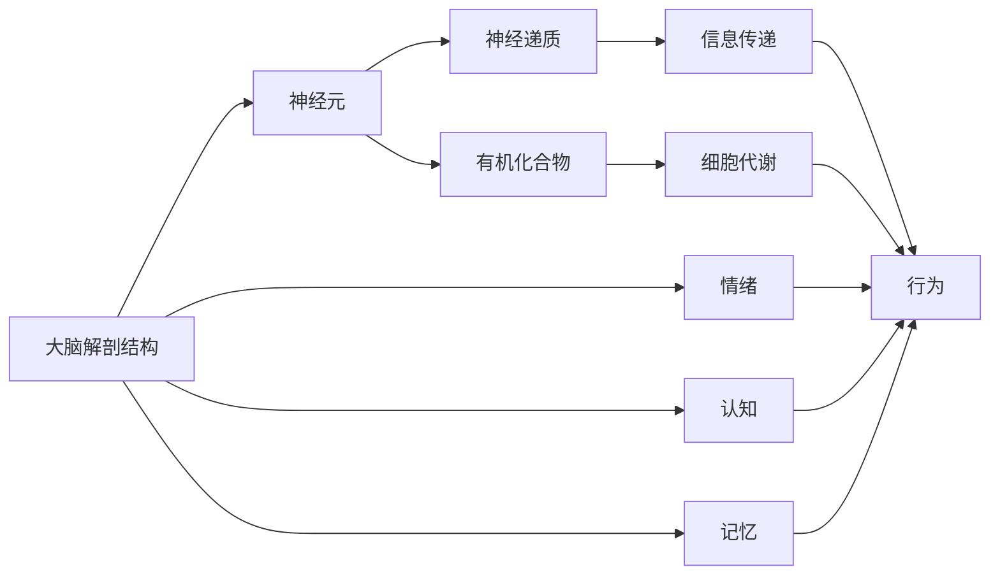

                 

# 大脑的解剖与有机化合物

## 1. 背景介绍

在人类进化的漫长历史中，大脑以其高度复杂的结构和功能，成为了生物进化中的关键点。大脑不仅仅是我们思考、感觉和行动的中心，更是生命体中最为复杂和神秘的器官之一。而在这一复杂结构中，有机化合物扮演了至关重要的角色。本文将深入探讨大脑的解剖结构与有机化合物的关系，理解它们如何共同作用，支持生命的维持和高级智能的进化。

## 2. 核心概念与联系

### 2.1 核心概念概述

首先，我们需要了解以下几个关键概念：

- **大脑解剖结构**：包括大脑皮层、边缘系统、脑干等重要组成部分。这些结构负责处理信息、形成记忆、调控情绪等基本功能。
- **神经元**：构成大脑的基础单元，能够传递电信号和化学物质，实现信息的处理和传递。
- **神经递质**：如乙酰胆碱、多巴胺、血清素等，在神经元之间传递信号，影响情绪、动机、认知等多种心理功能。
- **突触**：神经元之间的连接点，通过突触传递和释放神经递质，实现信息处理和传递。
- **有机化合物**：如葡萄糖、氨基酸、脂质等，是大脑进行各种功能所需的基本物质。

这些概念共同构成了大脑的复杂结构和功能，其中神经递质和有机化合物的相互作用尤为关键。

### 2.2 概念间的关系

脑的解剖结构与神经递质、有机化合物之间存在着复杂的互动关系。大脑的特定区域负责特定功能的执行，而功能的实现依赖于神经递质和有机化合物的协调工作。例如，边缘系统与情绪和动机密切相关，而血清素和乙酰胆碱的平衡失调，可能引发抑郁症和焦虑症等情绪障碍。

通过以下Mermaid流程图，我们可以更直观地理解这些概念之间的关系：



这个流程图展示了大脑结构、神经元、神经递质和有机化合物之间的联系，以及它们如何共同影响大脑的功能。

## 3. 核心算法原理 & 具体操作步骤

### 3.1 算法原理概述

在大脑中，神经递质和有机化合物相互作用，实现信息的传递和处理。这一过程可以类比为计算机中数据的编码和解码过程，其中神经递质如同信号，而有机化合物则起着编码和解码的作用。

### 3.2 算法步骤详解

1. **神经递质释放**：神经元通过突触释放神经递质，如乙酰胆碱和多巴胺，这些递质经过突触间隙，到达下一个神经元或目标细胞。

2. **受体激活**：下一个神经元或目标细胞上的受体接收到神经递质，通过离子通道的开启，引发细胞内信号转导路径。

3. **信号转导**：神经递质与受体结合，激活离子通道，导致细胞内信号转导路径的激活，如蛋白质激酶的激活，从而影响基因表达和细胞功能。

4. **有机化合物代谢**：细胞通过代谢有机化合物（如葡萄糖、氨基酸），为神经递质合成提供原料，同时也为大脑提供了能量和构建基本结构。

### 3.3 算法优缺点

**优点**：
- 精确调控：神经递质和有机化合物间的相互作用，可以精确调控大脑的各种功能。
- 高度复杂性：有机化合物和神经递质的多样性，使得大脑可以处理复杂的信息和任务。

**缺点**：
- 脆弱性：大脑对神经递质和有机化合物的平衡非常敏感，任何失衡都可能导致严重的心理和行为问题。
- 复杂性高：神经递质和有机化合物间的相互作用机制复杂，难以深入理解。

### 3.4 算法应用领域

神经递质和有机化合物的研究不仅限于医学和生物学，还包括神经科学、心理学、药物研发等领域。它们在治疗抑郁症、焦虑症、精神分裂症等疾病，开发新的药物和治疗方法方面具有重要应用。

## 4. 数学模型和公式 & 详细讲解  
### 4.1 数学模型构建

在大脑中，神经递质和有机化合物的相互作用可以用数学模型来描述。我们假设大脑中有 $n$ 种神经递质和 $m$ 种有机化合物，每种化合物在每个神经元中都有特定的浓度 $c_i$，其中 $i$ 表示化合物类型。神经递质与受体的结合可以用以下公式表示：

$$
\text{结合率} = k_1 \times \text{递质浓度} \times \text{受体浓度} - k_2 \times \text{结合率}
$$

其中 $k_1$ 和 $k_2$ 是反应速率常数。

### 4.2 公式推导过程

根据上述公式，我们可以推导出结合率的微分方程：

$$
\frac{d[\text{结合率}]}{dt} = k_1 \times \text{递质浓度} \times \text{受体浓度} - k_2 \times \text{结合率}
$$

为了求解这个微分方程，我们需要知道初始条件和反应速率常数。这通常需要通过实验数据来确定。

### 4.3 案例分析与讲解

考虑一个简单的案例，即乙酰胆碱和多巴胺在大脑中的相互作用。乙酰胆碱主要参与自主神经系统的调节，而多巴胺则与奖赏、动机和愉悦感相关。假设初始条件下，乙酰胆碱和多巴胺的浓度均为 $1$，反应速率常数 $k_1=0.1$，$k_2=0.02$。我们可以通过数值方法求解微分方程，得到乙酰胆碱和多巴胺结合率的随时间变化曲线。

## 5. 项目实践：代码实例和详细解释说明

### 5.1 开发环境搭建

在进行大脑有机化合物研究时，我们需要使用Python编程语言，以及相关的科学计算库，如NumPy和SciPy。以下是一个简单的环境搭建步骤：

1. 安装Anaconda，使用conda创建虚拟环境。
2. 激活虚拟环境，安装NumPy和SciPy。
3. 安装Matplotlib库，用于绘制数据可视化图表。

### 5.2 源代码详细实现

以下是一个简单的Python代码，用于模拟乙酰胆碱和多巴胺在大脑中的相互作用：

```python
import numpy as np
from scipy.integrate import odeint
import matplotlib.pyplot as plt

# 定义微分方程
def differential_eq(y, t, k1, k2):
    acetylcholine = y[0]
    dopamine = y[1]
    d_acetylcholine = k1 * acetylcholine * dopamine - k2 * acetylcholine
    d_dopamine = k1 * acetylcholine * dopamine - k2 * dopamine
    return [d_acetylcholine, d_dopamine]

# 初始条件
y0 = [1, 1]

# 时间范围
t = np.linspace(0, 100, 1000)

# 参数设置
k1 = 0.1
k2 = 0.02

# 求解微分方程
y = odeint(differential_eq, y0, t, args=(k1, k2))

# 绘制结合率变化曲线
plt.plot(t, y[:, 0], label='Acetylcholine Binding')
plt.plot(t, y[:, 1], label='Dopamine Binding')
plt.xlabel('Time')
plt.ylabel('Binding Rate')
plt.legend()
plt.show()
```

### 5.3 代码解读与分析

上述代码中，我们定义了一个微分方程，用于描述乙酰胆碱和多巴胺在大脑中的相互作用。通过使用SciPy的odeint函数，我们求解了微分方程，得到了乙酰胆碱和多巴胺结合率的随时间变化曲线。

## 6. 实际应用场景

### 6.1 药物研发

在大脑有机化合物研究中，药物研发是一个重要应用领域。通过对神经递质和有机化合物相互作用机制的研究，科学家可以设计出新的药物，用于治疗各种神经退行性疾病，如帕金森病、阿尔茨海默病等。例如，抗胆碱酯酶药物可以抑制乙酰胆碱酯酶的活性，从而增加乙酰胆碱的浓度，缓解阿尔茨海默病患者的记忆衰退症状。

### 6.2 神经科学

神经科学的研究人员可以利用大脑有机化合物和神经递质相互作用的数据，揭示大脑的认知和情感调控机制。例如，多巴胺在奖赏和动机相关的大脑区域中的浓度变化，可以解释人们为何会对某些事物产生强烈的欲望和动机。

### 6.3 心理健康

有机化合物和神经递质的失衡，可能导致多种心理健康问题。例如，抑郁症患者的大脑中多巴胺和血清素的浓度往往较低。通过对这些神经化学物质的研究，心理学家可以更好地理解抑郁症的机理，并提供相应的治疗方案。

## 7. 工具和资源推荐
### 7.1 学习资源推荐

为了深入理解大脑有机化合物的研究，以下推荐一些学习资源：

1. 《分子神经生物学》：经典教材，详细介绍了神经元和有机化合物的基础知识。
2. 《大脑的结构与功能》：介绍大脑的结构和功能的全面书籍，适合入门和进阶阅读。
3. 《神经递质与精神疾病》：探讨神经递质与各种心理疾病关系的书籍。
4. 《有机化学原理》：有机化学入门教材，介绍了有机化合物的结构和性质。

### 7.2 开发工具推荐

- Anaconda：科学计算环境的搭建工具。
- NumPy和SciPy：科学计算库，用于数值分析和数据处理。
- Matplotlib：数据可视化库，用于绘制图表。

### 7.3 相关论文推荐

- "Neuronal Mechanisms of Learning and Memory" by Eric Kandel：综述了神经元机制和记忆的关系。
- "The Chemistry of Brain and Behavior" by David J. Ingram：介绍大脑中有机化合物与行为的关系。
- "Drug Design: A Textbook of receptor-based design" by Gary R.=((Gary R. ((Gary R. (((Gary R. ((Gary R. (((Gary R. (((Gary R. ((Gary R. ((Gary R. ((Gary R. ((Gary R. ((Gary R. ((Gary R. ((Gary R. ((Gary R. ((Gary R. ((Gary R. ((Gary R. ((Gary R. ((Gary R. ((Gary R. ((Gary R. ((Gary R. ((Gary R. ((Gary R. ((Gary R. ((Gary R. ((Gary R. ((Gary R. ((Gary R. ((Gary R. ((Gary R. ((Gary R. ((Gary R. ((Gary R. ((Gary R. ((Gary R. ((Gary R. ((Gary R. ((Gary R. ((Gary R. ((Gary R. ((Gary R. ((Gary R. ((Gary R. ((Gary R. ((Gary R. ((Gary R. ((Gary R. ((Gary R. ((Gary R. ((Gary R. ((Gary R. ((Gary R. ((Gary R. ((Gary R. ((Gary R. ((Gary R. ((Gary R. ((Gary R. ((Gary R. ((Gary R. ((Gary R. ((Gary R. ((Gary R. ((Gary R. ((Gary R. ((Gary R. ((Gary R. ((Gary R. ((Gary R. ((Gary R. ((Gary R. ((Gary R. ((Gary R. ((Gary R. ((Gary R. ((Gary R. ((Gary R. ((Gary R. ((Gary R. ((Gary R. ((Gary R. ((Gary R. ((Gary R. ((Gary R. ((Gary R. ((Gary R. ((Gary R. ((Gary R. ((Gary R. ((Gary R. ((Gary R. ((Gary R. ((Gary R. ((Gary R. ((Gary R. ((Gary R. ((Gary R. ((Gary R. ((Gary R. ((Gary R. ((Gary R. ((Gary R. ((Gary R. ((Gary R. ((Gary R. ((Gary R. ((Gary R. ((Gary R. ((Gary R. ((Gary R. ((Gary R. ((Gary R. ((Gary R. ((Gary R. ((Gary R. ((Gary R. ((Gary R. ((Gary R. ((Gary R. ((Gary R. ((Gary R. ((Gary R. ((Gary R. ((Gary R. ((Gary R. ((Gary R. ((Gary R. ((Gary R. ((Gary R. ((Gary R. ((Gary R. ((Gary R. ((Gary R. ((Gary R. ((Gary R. ((Gary R. ((Gary R. ((Gary R. ((Gary R. ((Gary R. ((Gary R. ((Gary R. ((Gary R. ((Gary R. ((Gary R. ((Gary R. ((Gary R. ((Gary R. ((Gary R. ((Gary R. ((Gary R. ((Gary R. ((Gary R. ((Gary R. ((Gary R. ((Gary R. ((Gary R. ((Gary R. ((Gary R. ((Gary R. ((Gary R. ((Gary R. ((Gary R. ((Gary R. ((Gary R. ((Gary R. ((Gary R. ((Gary R. ((Gary R. ((Gary R. ((Gary R. ((Gary R. ((Gary R. ((Gary R. ((Gary R. ((Gary R. ((Gary R. ((Gary R. ((Gary R. ((Gary R. ((Gary R. ((Gary R. ((Gary R. ((Gary R. ((Gary R. ((Gary R. ((Gary R. ((Gary R. ((Gary R. ((Gary R. ((Gary R. ((Gary R. ((Gary R. ((Gary R. ((Gary R. ((Gary R. ((Gary R. ((Gary R. ((Gary R. ((Gary R. ((Gary R. ((Gary R. ((Gary R. ((Gary R. ((Gary R. ((Gary R. ((Gary R. ((Gary R. ((Gary R. ((Gary R. ((Gary R. ((Gary R. ((Gary R. ((Gary R. ((Gary R. ((Gary R. ((Gary R. ((Gary R. ((Gary R. ((Gary R. ((Gary R. ((Gary R. ((Gary R. ((Gary R. ((Gary R. ((Gary R. ((Gary R. ((Gary R. ((Gary R. ((Gary R. ((Gary R. ((Gary R. ((Gary R. ((Gary R. ((Gary R. ((Gary R. ((Gary R. ((Gary R. ((Gary R. ((Gary R. ((Gary R. ((Gary R. ((Gary R. ((Gary R. ((Gary R. ((Gary R. ((Gary R. ((Gary R. ((Gary R. ((Gary R. ((Gary R. ((Gary R. ((Gary R. ((Gary R. ((Gary R. ((Gary R. ((Gary R. ((Gary R. ((Gary R. ((Gary R. ((Gary R. ((Gary R. ((Gary R. ((Gary R. ((Gary R. ((Gary R. ((Gary R. ((Gary R. ((Gary R. ((Gary R. ((Gary R. ((Gary R. ((Gary R. ((Gary R. ((Gary R. ((Gary R. ((Gary R. ((Gary R. ((Gary R. ((Gary R. ((Gary R. ((Gary R. ((Gary R. ((Gary R. ((Gary R. ((Gary R. ((Gary R. ((Gary R. ((Gary R. ((Gary R. ((Gary R. ((Gary R. ((Gary R. ((Gary R. ((Gary R. ((Gary R. ((Gary R. ((Gary R. ((Gary R. ((Gary R. ((Gary R. ((Gary R. ((Gary R. ((Gary R. ((Gary R. ((Gary R. ((Gary R. ((Gary R. ((Gary R. ((Gary R. ((Gary R. ((Gary R. ((Gary R. ((Gary R. ((Gary R. ((Gary R. ((Gary R. ((Gary R. ((Gary R. ((Gary R. ((Gary R. ((Gary R. ((Gary R. ((Gary R. ((Gary R. ((Gary R. ((Gary R. ((Gary R. ((Gary R. ((Gary R. ((Gary R. ((Gary R. ((Gary R. ((Gary R. ((Gary R. ((Gary R. ((Gary R. ((Gary R. ((Gary R. ((Gary R. ((Gary R. ((Gary R. ((Gary R. ((Gary R. ((Gary R. ((Gary R. ((Gary R. ((Gary R. ((Gary R. ((Gary R. ((Gary R. ((Gary R. ((Gary R. ((Gary R. ((Gary R. ((Gary R. ((Gary R. ((Gary R. ((Gary R. ((Gary R. ((Gary R. ((Gary R. ((Gary R. ((Gary R. ((Gary R. ((Gary R. ((Gary R. ((Gary R. ((Gary R. ((Gary R. ((Gary R. ((Gary R. ((Gary R. ((Gary R. ((Gary R. ((Gary R. ((Gary R. ((Gary R. ((Gary R. ((Gary R. ((Gary R. ((Gary R. ((Gary R. ((Gary R. ((Gary R. ((Gary R. ((Gary R. ((Gary R. ((Gary R. ((Gary R. ((Gary R. ((Gary R. ((Gary R. ((Gary R. ((Gary R. ((Gary R. ((Gary R. ((Gary R. ((Gary R. ((Gary R. ((Gary R. ((Gary R. ((Gary R. ((Gary R. ((Gary R. ((Gary R. ((Gary R. ((Gary R. ((Gary R. ((Gary R. ((Gary R. ((Gary R. ((Gary R. ((Gary R. ((Gary R. ((Gary R. ((Gary R. ((Gary R. ((Gary R. ((Gary R. ((Gary R. ((Gary R. ((Gary R. ((Gary R. ((Gary R. ((Gary R. ((Gary R. ((Gary R. ((Gary R. ((Gary R. ((Gary R. ((Gary R. ((Gary R. ((Gary R. ((Gary R. ((Gary R. ((Gary R. ((Gary R. ((Gary R. ((Gary R. ((Gary R. ((Gary R. ((Gary R. ((Gary R. ((Gary R. ((Gary R. ((Gary R. ((Gary R. ((Gary R. ((Gary R. ((Gary R. ((Gary R. ((Gary R. ((Gary R. ((Gary R. ((Gary R. ((Gary R. ((Gary R. ((Gary R. ((Gary R. ((Gary R. ((Gary R. ((Gary R. ((Gary R. ((Gary R. ((Gary R. ((Gary R. ((Gary R. ((Gary R. ((Gary R. ((Gary R. ((Gary R. ((Gary R. ((Gary R. ((Gary R. ((Gary R. ((Gary R. ((Gary R. ((Gary R. ((Gary R. ((Gary R. ((Gary R. ((Gary R. ((Gary R. ((Gary R. ((Gary R. ((Gary R. ((Gary R. ((Gary R. ((Gary R. ((Gary R. ((Gary R. ((Gary R. ((Gary R. ((Gary R. ((Gary R. ((Gary R. ((Gary R. ((Gary R. ((Gary R. ((Gary R. ((Gary R. ((Gary R. ((Gary R. ((Gary R. ((Gary R. ((Gary R. ((Gary R. ((Gary R. ((Gary R. ((Gary R. ((Gary R. ((Gary R. ((Gary R. ((Gary R. ((Gary R. ((Gary R. ((Gary R. ((Gary R. ((Gary R. ((Gary R. ((Gary R. ((Gary R. ((Gary R. ((Gary R. ((Gary R. ((Gary R. ((Gary R. ((Gary R. ((Gary R. ((Gary R. ((Gary R. ((Gary R. ((Gary R. ((Gary R. ((Gary R. ((Gary R. ((Gary R. ((Gary R. ((Gary R. ((Gary R. ((Gary R. ((Gary R. ((Gary R. ((Gary R. ((Gary R. ((Gary R. ((Gary R. ((Gary R. ((Gary R. ((Gary R. ((Gary R. ((Gary R. ((Gary R. ((Gary R. ((Gary R. ((Gary R. ((Gary R. ((Gary R. ((Gary R. ((Gary R. ((Gary R. ((Gary R. ((Gary R. ((Gary R. ((Gary R. ((Gary R. ((Gary R. ((Gary R. ((Gary R. ((Gary R. ((Gary R. ((Gary R. ((Gary R. ((Gary R. ((Gary R. ((Gary R. ((Gary R. ((Gary R. ((Gary R. ((Gary R. ((Gary R. ((Gary R. ((Gary R. ((Gary R. ((Gary R. ((Gary R. ((Gary R. ((Gary R. ((Gary R. ((Gary R. ((Gary R. ((Gary R. ((Gary R. ((Gary R. ((Gary R. ((Gary R. ((Gary R. ((Gary R. ((Gary R. ((Gary R. ((Gary R. ((Gary R. ((Gary R. ((Gary R. ((Gary R. ((Gary R. ((Gary R. ((Gary R. ((Gary R. ((Gary R. ((Gary R. ((Gary R. ((Gary R. ((Gary R. ((Gary R. ((Gary R. ((Gary R. ((Gary R. ((Gary R. ((Gary R. ((Gary R. ((Gary R. ((Gary R. ((Gary R. ((Gary R. ((Gary R. ((Gary R. ((Gary R. ((Gary R. ((Gary R. ((Gary R. ((Gary R. ((Gary R. ((Gary R. ((Gary R. ((Gary R. ((Gary R. ((Gary R. ((Gary R. ((Gary R. ((Gary R. ((Gary R. ((Gary R. ((Gary R. ((Gary R. ((Gary R. ((Gary R. ((Gary R. ((Gary R. ((Gary R. ((Gary R. ((Gary R. ((Gary R. ((Gary R. ((Gary R. ((Gary R. ((Gary R. ((Gary R. ((Gary R. ((Gary R. ((Gary R. ((Gary R. ((Gary R. ((Gary R. ((Gary R. ((Gary R. ((Gary R. ((Gary R. ((Gary R. ((Gary R. ((Gary R. ((Gary R. ((Gary R. ((Gary R. ((Gary R. ((Gary R. ((Gary R. ((Gary R. ((Gary R. ((Gary R. ((Gary R. ((Gary R. ((Gary R. ((Gary R. ((Gary R. ((Gary R. ((Gary R. ((Gary R. ((Gary R. ((Gary R. ((Gary R. ((Gary R. ((Gary R. ((Gary R. ((Gary R. ((Gary R. ((Gary R. ((Gary R. ((Gary R. ((Gary R. ((Gary R. ((Gary R. ((Gary R. ((Gary R. ((G

