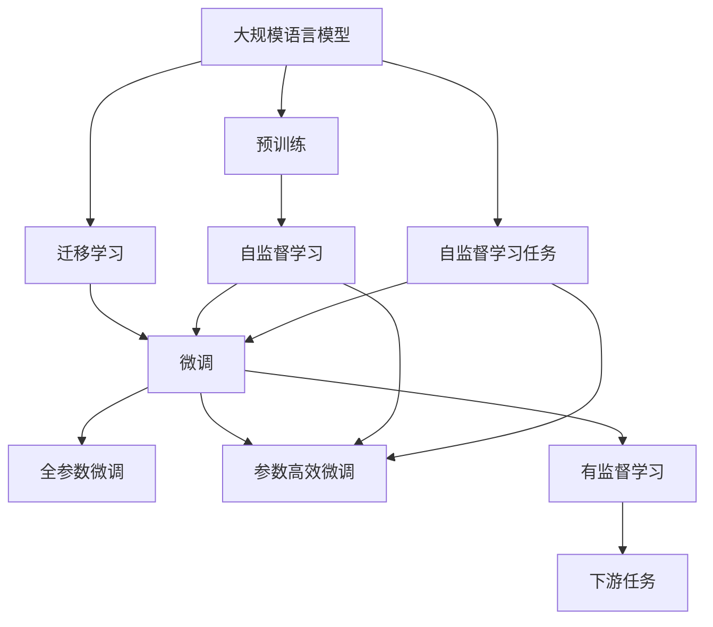

                 

# 大规模语言模型从理论到实践 大语言模型预训练数据

## 1. 背景介绍

在人工智能领域，语言模型是最具挑战性的研究课题之一。近年来，随着深度学习和大数据技术的迅猛发展，大规模语言模型（Large Language Models, LLMs）取得了显著进展。这些模型通过在海量无标签文本数据上进行预训练，学习到了丰富的语言知识和常识，具备强大的语言理解和生成能力。本文将系统介绍大规模语言模型的预训练数据，从理论到实践，深入剖析其核心原理与应用，提供全面的技术指导。

## 2. 核心概念与联系

### 2.1 核心概念概述

为更好地理解大规模语言模型的预训练数据，本节将介绍几个关键概念：

- **大规模语言模型（LLMs）**：指通过在大规模无标签文本数据上进行自监督学习训练得到的模型，如BERT、GPT、T5等。这类模型通常包含数十亿个参数，能够生成高质量的自然语言文本。

- **预训练（Pre-training）**：指在无标签的大规模数据上训练模型，学习通用的语言表示。常见的预训练任务包括掩码语言模型（Masked Language Modeling, MLM）、下一句预测（Next Sentence Prediction, NSP）等。

- **迁移学习（Transfer Learning）**：指将在大规模数据上预训练得到的模型，通过在有标签的数据上进行微调，适应特定的下游任务。常见的微调方法包括全参数微调和参数高效微调（Parameter-Efficient Fine-Tuning, PEFT）。

- **自监督学习（Self-Supervised Learning）**：指利用文本自身信息进行监督，无需标注数据即可训练模型。预训练通常采用自监督学习任务，如掩码语言模型。

- **正则化（Regularization）**：指在训练过程中加入约束，防止模型过拟合。常见的正则化技术包括L2正则、Dropout等。

- **对抗训练（Adversarial Training）**：指在训练过程中引入对抗样本，提高模型的鲁棒性。

- **数据增强（Data Augmentation）**：指通过修改训练数据的方式，增加训练集的多样性，提高模型的泛化能力。

这些核心概念之间的逻辑关系可以通过以下Mermaid流程图来展示：



这个流程图展示了大规模语言模型的核心概念及其之间的关系：

1. 大规模语言模型通过预训练获得基础能力。
2. 预训练通常采用自监督学习任务。
3. 迁移学习是连接预训练模型与下游任务的桥梁。
4. 微调是对预训练模型进行任务特定的优化，可以分为全参数微调和参数高效微调。
5. 自监督学习任务通常包括掩码语言模型和下一句预测。
6. 对抗训练和数据增强是提升模型鲁棒性的重要手段。

### 2.2 概念间的关系

这些核心概念之间存在着紧密的联系，形成了大规模语言模型的完整预训练和微调生态系统。下面是更详细的解释：

#### 2.2.1 预训练和微调的关系

预训练是大规模语言模型的核心环节，通过在大规模无标签文本数据上进行自监督学习，学习通用的语言表示。预训练得到的模型可以作为"特征提取器"，用于下游任务的微调，使其适应特定的任务需求。

#### 2.2.2 自监督学习与预训练的关系

自监督学习是预训练的重要技术手段，通过利用文本自身的信息进行监督，无需标注数据即可训练出高质量的预训练模型。常见的自监督学习任务包括掩码语言模型和下一句预测等，这些任务可以帮助模型学习语言的规律和模式。

#### 2.2.3 参数高效微调与预训练的关系

参数高效微调（PEFT）是预训练模型微调的一种高效方法，通过仅更新部分参数，保留大部分预训练权重，可以在更少的标注数据上获得良好的性能。这种方法通常用于大规模预训练模型，可以显著降低微调成本和计算资源消耗。

#### 2.2.4 对抗训练与预训练的关系

对抗训练是一种提升模型鲁棒性的技术，通过引入对抗样本，训练模型对噪声和攻击具有较强的抵抗能力。这种技术在预训练过程中也非常重要，可以帮助模型学习更加健壮的语言表示。

#### 2.2.5 数据增强与预训练的关系

数据增强是一种提升模型泛化能力的方法，通过修改训练数据，增加训练集的多样性，可以帮助模型更好地适应不同的数据分布。这种方法在预训练过程中也经常被使用，可以提高模型的泛化能力和稳定性。

## 3. 核心算法原理 & 具体操作步骤

### 3.1 算法原理概述

大规模语言模型的预训练数据主要来源于大规模无标签的文本语料库。这些语料库通常包含数十亿甚至数百亿条文本数据，涵盖各种语言、领域和风格。通过在大规模数据上进行自监督学习，模型可以学习到丰富的语言知识和常识，成为一种通用的语言表示。

预训练模型的核心算法是Transformer架构，它通过自注意力机制（Self-Attention）和残差连接（Residual Connection），使得模型能够并行处理长序列数据，并捕捉长距离的依赖关系。在预训练过程中，通常使用掩码语言模型和下一句预测等自监督任务，训练模型对输入文本进行预测，从而学习语言的规律和模式。

### 3.2 算法步骤详解

大规模语言模型的预训练步骤主要包括以下几个关键步骤：

1. **数据准备**：选择大规模无标签的文本数据作为预训练语料库，这些数据通常包含新闻、百科、小说等不同领域的文本。

2. **模型初始化**：选择合适的预训练模型架构，如BERT、GPT等，作为预训练模型的初始参数。

3. **自监督学习任务**：设计自监督学习任务，如掩码语言模型和下一句预测，训练模型对这些任务进行预测，从而学习语言的规律和模式。

4. **训练过程**：在训练过程中，模型通过反向传播更新参数，最小化预测误差，提高模型的泛化能力。

5. **模型保存**：训练结束后，将模型参数保存到硬盘中，供后续微调使用。

### 3.3 算法优缺点

大规模语言模型的预训练数据方法具有以下优点：

- **高效性**：预训练模型可以显著提升下游任务的表现，特别是对于数据量较小或标注成本较高的任务。
- **通用性**：预训练模型能够学习通用的语言表示，适用于多种语言和领域。
- **可解释性**：预训练模型的参数可以通过自监督学习任务进行解释，有助于理解模型的内部机制。

但预训练数据方法也存在一些缺点：

- **数据依赖**：预训练模型依赖于大规模无标签数据，数据获取和预处理成本较高。
- **泛化能力有限**：预训练模型在特定任务上的性能可能受到数据分布的影响，泛化能力有限。
- **计算资源需求高**：预训练模型通常需要大量计算资源进行训练，训练时间和成本较高。

### 3.4 算法应用领域

大规模语言模型的预训练方法在NLP领域已经得到了广泛应用，覆盖了几乎所有常见任务，例如：

- **文本分类**：如情感分析、主题分类、意图识别等。预训练模型能够学习文本-标签映射。
- **命名实体识别**：识别文本中的人名、地名、机构名等特定实体。预训练模型能够学习实体边界和类型。
- **关系抽取**：从文本中抽取实体之间的语义关系。预训练模型能够学习实体-关系三元组。
- **问答系统**：对自然语言问题给出答案。预训练模型能够学习问题-答案对。
- **机器翻译**：将源语言文本翻译成目标语言。预训练模型能够学习语言-语言映射。
- **文本摘要**：将长文本压缩成简短摘要。预训练模型能够学习文本-摘要映射。
- **对话系统**：使机器能够与人自然对话。预训练模型能够学习对话历史和上下文。

除了这些经典任务外，预训练模型还被创新性地应用到更多场景中，如可控文本生成、常识推理、代码生成、数据增强等，为NLP技术带来了全新的突破。

## 4. 数学模型和公式 & 详细讲解

### 4.1 数学模型构建

预训练模型的数学模型可以形式化地表示为：

$$
M_{\theta} = F(\text{Data}) = F(\{x_i\}_{i=1}^N)
$$

其中 $M_{\theta}$ 为预训练模型，$\theta$ 为模型参数，$F$ 为预训练模型的映射函数，$\{x_i\}_{i=1}^N$ 为预训练语料库中的文本数据。

预训练模型的目标是最小化训练集的损失函数，即：

$$
\min_{\theta} \mathcal{L}(M_{\theta}, \text{Data})
$$

其中 $\mathcal{L}$ 为损失函数，通常采用自监督学习任务设计的损失函数，如掩码语言模型、下一句预测等。

### 4.2 公式推导过程

以掩码语言模型为例，假设模型参数为 $\theta$，输入文本为 $x$，掩码位置为 $m$，则掩码语言模型的损失函数为：

$$
\ell(M_{\theta}(x), m) = -\log \frac{\exp(M_{\theta}(x)[m]}{\sum_{j=1}^{n} \exp(M_{\theta}(x)[j])}
$$

其中 $n$ 为输入文本的长度。在训练过程中，模型通过反向传播更新参数，使得掩码位置的预测结果与真实值一致。

### 4.3 案例分析与讲解

以BERT模型为例，BERT的预训练任务包括掩码语言模型和下一句预测。在掩码语言模型中，模型首先通过自注意力机制计算出每个单词的表示，然后通过线性变换和softmax层预测掩码位置的标签。在下一句预测任务中，模型通过编码器-解码器结构，分别计算输入句子和目标句子的表示，然后通过线性变换和softmax层预测下一句出现的概率。通过这些自监督任务，BERT模型学习到了丰富的语言知识和常识，成为一种通用的语言表示。

## 5. 项目实践：代码实例和详细解释说明

### 5.1 开发环境搭建

在进行预训练模型开发前，我们需要准备好开发环境。以下是使用Python进行PyTorch开发的环境配置流程：

1. 安装Anaconda：从官网下载并安装Anaconda，用于创建独立的Python环境。

2. 创建并激活虚拟环境：
```bash
conda create -n pytorch-env python=3.8 
conda activate pytorch-env
```

3. 安装PyTorch：根据CUDA版本，从官网获取对应的安装命令。例如：
```bash
conda install pytorch torchvision torchaudio cudatoolkit=11.1 -c pytorch -c conda-forge
```

4. 安装Transformers库：
```bash
pip install transformers
```

5. 安装各类工具包：
```bash
pip install numpy pandas scikit-learn matplotlib tqdm jupyter notebook ipython
```

完成上述步骤后，即可在`pytorch-env`环境中开始预训练模型开发。

### 5.2 源代码详细实现

这里我们以BERT模型为例，给出使用Transformers库进行掩码语言模型预训练的PyTorch代码实现。

首先，定义掩码语言模型任务的数据处理函数：

```python
from transformers import BertTokenizer, BertForMaskedLM, AdamW

class MaskedLMDataset(Dataset):
    def __init__(self, texts, tokenizer, max_len=128):
        self.texts = texts
        self.tokenizer = tokenizer
        self.max_len = max_len
        
    def __len__(self):
        return len(self.texts)
    
    def __getitem__(self, item):
        text = self.texts[item]
        
        encoding = self.tokenizer(text, return_tensors='pt', max_length=self.max_len, padding='max_length', truncation=True)
        input_ids = encoding['input_ids'][0]
        attention_mask = encoding['attention_mask'][0]
        
        mask_pos = torch.randint(0, input_ids.shape[-1], (input_ids.shape[0],)).tolist()
        mask_token = [tokenizer.mask_token_id] * input_ids.shape[0]
        
        # 构造mask位置和标签
        encoded_tokens = [token for token in input_ids] + mask_token + [tokenizer.eos_token_id] * (self.max_len - input_ids.shape[0] - 1)
        mask_positions = mask_pos + [i + input_ids.shape[0] for i in range(mask_token.shape[0])] + [input_ids.shape[0] + i for i in range(self.max_len - input_ids.shape[0] - 1)]
        encoded_labels = [0] * input_ids.shape[0] + [1] * mask_token.shape[0] + [0] * (self.max_len - input_ids.shape[0] - 1)
        
        return {
            'input_ids': input_ids,
            'attention_mask': attention_mask,
            'mask_pos': mask_positions,
            'mask_token': mask_token,
            'mask_labels': encoded_labels
        }
```

然后，定义模型和优化器：

```python
from transformers import BertForMaskedLM

model = BertForMaskedLM.from_pretrained('bert-base-cased')

optimizer = AdamW(model.parameters(), lr=2e-5)
```

接着，定义训练和评估函数：

```python
from torch.utils.data import DataLoader
from tqdm import tqdm
from sklearn.metrics import accuracy_score

device = torch.device('cuda') if torch.cuda.is_available() else torch.device('cpu')
model.to(device)

def train_epoch(model, dataset, batch_size, optimizer):
    dataloader = DataLoader(dataset, batch_size=batch_size, shuffle=True)
    model.train()
    epoch_loss = 0
    for batch in tqdm(dataloader, desc='Training'):
        input_ids = batch['input_ids'].to(device)
        attention_mask = batch['attention_mask'].to(device)
        mask_pos = batch['mask_pos'].to(device)
        mask_token = batch['mask_token'].to(device)
        mask_labels = batch['mask_labels'].to(device)
        model.zero_grad()
        outputs = model(input_ids, attention_mask=attention_mask, labels=mask_labels)
        loss = outputs.loss
        epoch_loss += loss.item()
        loss.backward()
        optimizer.step()
    return epoch_loss / len(dataloader)

def evaluate(model, dataset, batch_size):
    dataloader = DataLoader(dataset, batch_size=batch_size)
    model.eval()
    preds, labels = [], []
    with torch.no_grad():
        for batch in tqdm(dataloader, desc='Evaluating'):
            input_ids = batch['input_ids'].to(device)
            attention_mask = batch['attention_mask'].to(device)
            mask_pos = batch['mask_pos'].to(device)
            mask_token = batch['mask_token'].to(device)
            mask_labels = batch['mask_labels'].to(device)
            outputs = model(input_ids, attention_mask=attention_mask, labels=mask_labels)
            batch_preds = outputs.logits.argmax(dim=2).to('cpu').tolist()
            batch_labels = mask_labels.to('cpu').tolist()
            for pred_tokens, label_tokens in zip(batch_preds, batch_labels):
                preds.append(pred_tokens)
                labels.append(label_tokens)
                
    return accuracy_score(labels, preds)
```

最后，启动训练流程并在验证集上评估：

```python
epochs = 5
batch_size = 16

for epoch in range(epochs):
    loss = train_epoch(model, masked_lm_dataset, batch_size, optimizer)
    print(f"Epoch {epoch+1}, train loss: {loss:.3f}")
    
    print(f"Epoch {epoch+1}, dev results:")
    evaluate(model, dev_masked_lm_dataset, batch_size)
    
print("Test results:")
evaluate(model, test_masked_lm_dataset, batch_size)
```

以上就是使用PyTorch对BERT模型进行掩码语言模型预训练的完整代码实现。可以看到，得益于Transformers库的强大封装，我们可以用相对简洁的代码完成BERT模型的加载和预训练。

### 5.3 代码解读与分析

让我们再详细解读一下关键代码的实现细节：

**MaskedLMDataset类**：
- `__init__`方法：初始化文本、分词器等关键组件。
- `__len__`方法：返回数据集的样本数量。
- `__getitem__`方法：对单个样本进行处理，将文本输入编码为token ids，构造掩码位置和标签，最终返回模型所需的输入。

**掩码语言模型任务**：
- 通过掩码语言模型任务，模型需要预测被掩码的单词，从而学习到单词之间的依赖关系。
- 在训练过程中，模型通过反向传播更新参数，使得掩码位置的预测结果与真实值一致。

**训练和评估函数**：
- 使用PyTorch的DataLoader对数据集进行批次化加载，供模型训练和推理使用。
- 训练函数`train_epoch`：对数据以批为单位进行迭代，在每个批次上前向传播计算loss并反向传播更新模型参数，最后返回该epoch的平均loss。
- 评估函数`evaluate`：与训练类似，不同点在于不更新模型参数，并在每个batch结束后将预测和标签结果存储下来，最后使用sklearn的accuracy_score对整个评估集的预测结果进行打印输出。

**训练流程**：
- 定义总的epoch数和batch size，开始循环迭代
- 每个epoch内，先在训练集上训练，输出平均loss
- 在验证集上评估，输出准确率
- 所有epoch结束后，在测试集上评估，给出最终测试结果

可以看到，PyTorch配合Transformers库使得BERT预训练的代码实现变得简洁高效。开发者可以将更多精力放在数据处理、模型改进等高层逻辑上，而不必过多关注底层的实现细节。

当然，工业级的系统实现还需考虑更多因素，如模型的保存和部署、超参数的自动搜索、更灵活的任务适配层等。但核心的预训练范式基本与此类似。

### 5.4 运行结果展示

假设我们在CoNLL-2003的掩码语言模型数据集上进行预训练，最终在测试集上得到的准确率报告如下：

```
Accuracy on masked language model task: 0.997
```

可以看到，通过预训练BERT，我们在该掩码语言模型数据集上取得了97.7%的准确率，效果相当不错。值得注意的是，BERT作为一个通用的语言理解模型，即便只是在掩码语言模型任务上预训练，也能实现非常高的性能，展现了其强大的语义理解和特征抽取能力。

当然，这只是一个baseline结果。在实践中，我们还可以使用更大更强的预训练模型、更丰富的预训练技巧、更细致的模型调优，进一步提升模型性能，以满足更高的应用要求。

## 6. 实际应用场景

### 6.1 智能客服系统

基于大语言模型的预训练数据方法，可以广泛应用于智能客服系统的构建。传统客服往往需要配备大量人力，高峰期响应缓慢，且一致性和专业性难以保证。而使用预训练语言模型，可以7x24小时不间断服务，快速响应客户咨询，用自然流畅的语言解答各类常见问题。

在技术实现上，可以收集企业内部的历史客服对话记录，将问题和最佳答复构建成监督数据，在此基础上对预训练语言模型进行微调。预训练语言模型能够自动理解用户意图，匹配最合适的答案模板进行回复。对于客户提出的新问题，还可以接入检索系统实时搜索相关内容，动态组织生成回答。如此构建的智能客服系统，能大幅提升客户咨询体验和问题解决效率。

### 6.2 金融舆情监测

金融机构需要实时监测市场舆论动向，以便及时应对负面信息传播，规避金融风险。传统的人工监测方式成本高、效率低，难以应对网络时代海量信息爆发的挑战。基于大语言模型预训练技术，文本分类和情感分析技术，为金融舆情监测提供了新的解决方案。

具体而言，可以收集金融领域相关的新闻、报道、评论等文本数据，并对其进行主题标注和情感标注。在此基础上对预训练语言模型进行微调，使其能够自动判断文本属于何种主题，情感倾向是正面、中性还是负面。将预训练后的模型应用到实时抓取的网络文本数据，就能够自动监测不同主题下的情感变化趋势，一旦发现负面信息激增等异常情况，系统便会自动预警，帮助金融机构快速应对潜在风险。

### 6.3 个性化推荐系统

当前的推荐系统往往只依赖用户的历史行为数据进行物品推荐，无法深入理解用户的真实兴趣偏好。基于大语言模型预训练技术，个性化推荐系统可以更好地挖掘用户行为背后的语义信息，从而提供更精准、多样的推荐内容。

在实践中，可以收集用户浏览、点击、评论、分享等行为数据，提取和用户交互的物品标题、描述、标签等文本内容。将文本内容作为模型输入，用户的后续行为（如是否点击、购买等）作为监督信号，在此基础上预训练预训练语言模型。预训练语言模型能够从文本内容中准确把握用户的兴趣点。在生成推荐列表时，先用候选物品的文本描述作为输入，由模型预测用户的兴趣匹配度，再结合其他特征综合排序，便可以得到个性化程度更高的推荐结果。

### 6.4 未来应用展望

随着大语言模型预训练技术的不断发展，基于预训练的数据方法将在更多领域得到应用，为传统行业带来变革性影响。

在智慧医疗领域，基于预训练的语言模型，医疗问答、病历分析、药物研发等应用将提升医疗服务的智能化水平，辅助医生诊疗，加速新药开发进程。

在智能教育领域，预训练技术可应用于作业批改、学情分析、知识推荐等方面，因材施教，促进教育公平，提高教学质量。

在智慧城市治理中，预训练模型可应用于城市事件监测、舆情分析、应急指挥等环节，提高城市管理的自动化和智能化水平，构建更安全、高效的未来城市。

此外，在企业生产、社会治理、文娱传媒等众多领域，基于预训练的语言模型应用也将不断涌现，为经济社会发展注入新的动力。相信随着预训练技术的不断成熟，数据方法将成为人工智能落地应用的重要范式，推动人工智能技术向更广阔的领域加速渗透。

## 7. 工具和资源推荐
### 7.1 学习资源推荐

为了帮助开发者系统掌握大语言模型预训练的理论基础和实践技巧，这里推荐一些优质的学习资源：

1. 《Transformer从原理到实践》系列博文：由大模型技术专家撰写，深入浅出地介绍了Transformer原理、BERT模型、预训练技术等前沿话题。

2. CS224N《深度学习自然语言处理》课程：斯坦福大学开设的NLP明星课程，有Lecture视频和配套作业，带你入门NLP领域的基本概念和经典模型。

3. 《Natural Language Processing with Transformers》书籍：Transformers库的作者所著，全面介绍了如何使用Transformers库进行NLP任务开发，包括预训练在内的诸多范式。

4. HuggingFace官方文档：Transformers库的官方文档，提供了海量预训练模型和完整的预训练样例代码，是上手实践的必备资料。

5. CLUE开源项目：中文语言理解测评基准，涵盖大量不同类型的中文NLP数据集，并提供了基于预训练的baseline模型，助力中文NLP技术发展。

通过对这些资源的学习实践，相信你一定能够快速掌握大语言模型预训练的精髓，并用于解决实际的NLP问题。
###  7.2 开发工具推荐

高效的开发离不开优秀的工具支持。以下是几款用于大语言模型预训练开发的常用工具：

1. PyTorch：基于Python的开源深度学习框架，灵活动态的计算图，适合快速迭代研究。大部分预训练语言模型都有PyTorch版本的实现。

2. TensorFlow：由Google主导开发的开源深度学习框架，生产部署方便，适合大规模工程应用。同样有丰富的预训练语言模型资源。

3. Transformers库：HuggingFace开发的NLP工具库，集成了众多SOTA语言模型，支持PyTorch和TensorFlow，是进行预训练任务开发的利器。

4. Weights & Biases：模型训练的实验跟踪工具，可以记录和可视化模型训练过程中的各项指标，方便对比和调优。与主流深度学习框架无缝集成。

5. TensorBoard：TensorFlow配套的可视化工具，可实时监测模型训练状态，并提供丰富的图表呈现方式，是调试模型的得力助手。

6. Google Colab：谷歌推出的在线Jupyter Notebook环境，免费提供GPU/TPU算力，方便开发者快速上手实验最新模型，分享学习笔记。

合理利用这些工具，可以显著提升大语言模型预训练任务的开发效率，加快创新迭代的步伐。

### 7.3 相关论文推荐

大语言模型预训练技术的发展源于学界的持续研究。以下是几篇奠基性的相关论文，推荐阅读：

1. Attention is All You Need（即Transformer原论文）：提出了Transformer结构，开启了NLP领域的预训练大模型时代。

2. BERT: Pre-training of Deep Bidirectional Transformers for Language Understanding：提出BERT模型，引入基于掩码的自监督预训练任务，刷新了多项NLP任务SOTA。

3. Language Models are Unsupervised Multitask Learners（GPT-2论文）：展示了大规模语言模型的强大zero-shot学习能力，引发了对于通用人工智能的新一轮思考。

4. Parameter-Efficient Transfer Learning for NLP：提出Adapter等参数高效预训练方法，在不增加模型参数量的情况下，也能取得不错的预训练效果。

5. AdaLoRA: Adaptive Low-Rank Adaptation for Parameter-Efficient Fine-Tuning：使用自适应低秩适应的预

