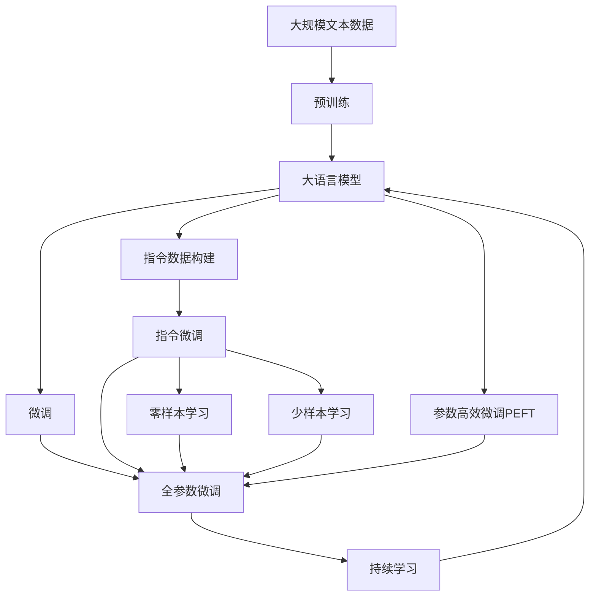
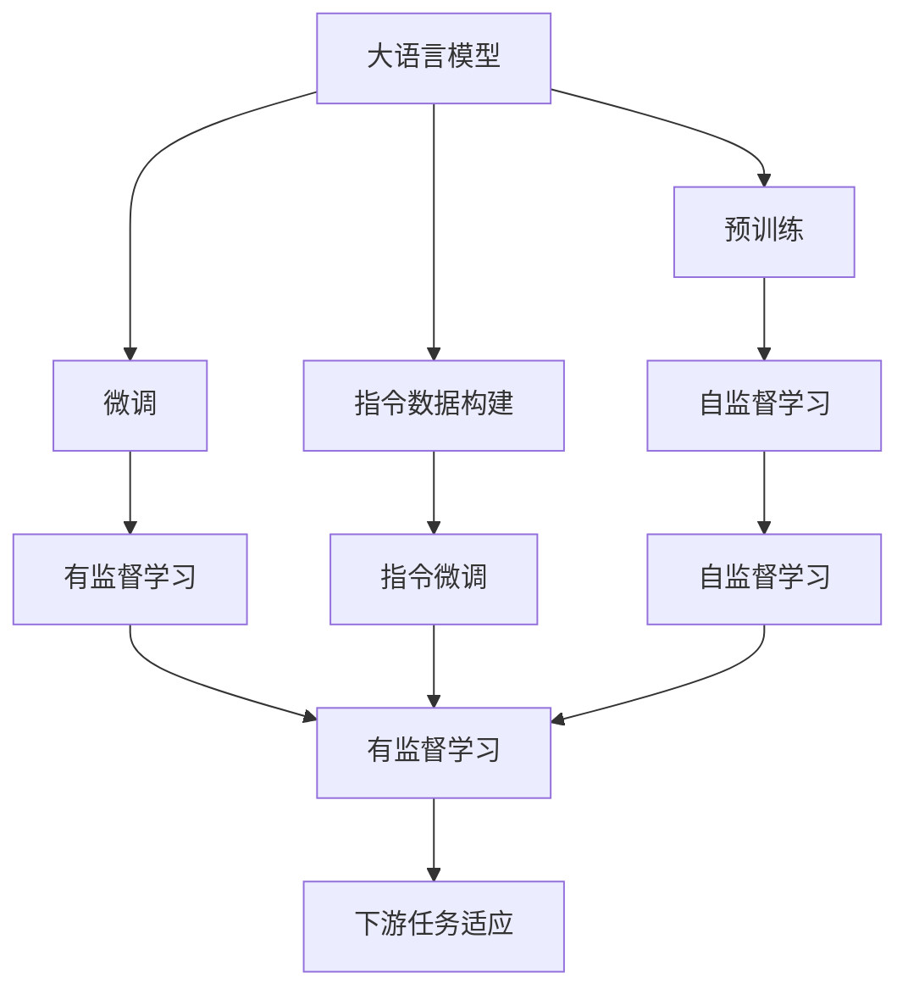
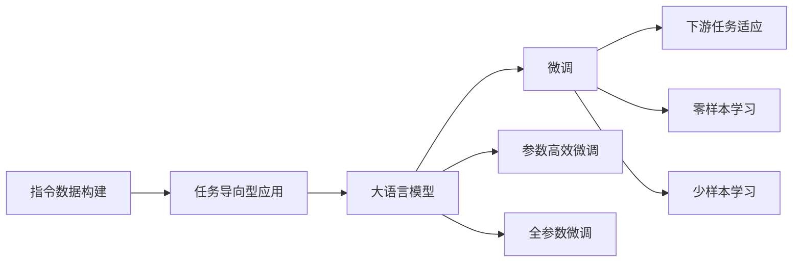
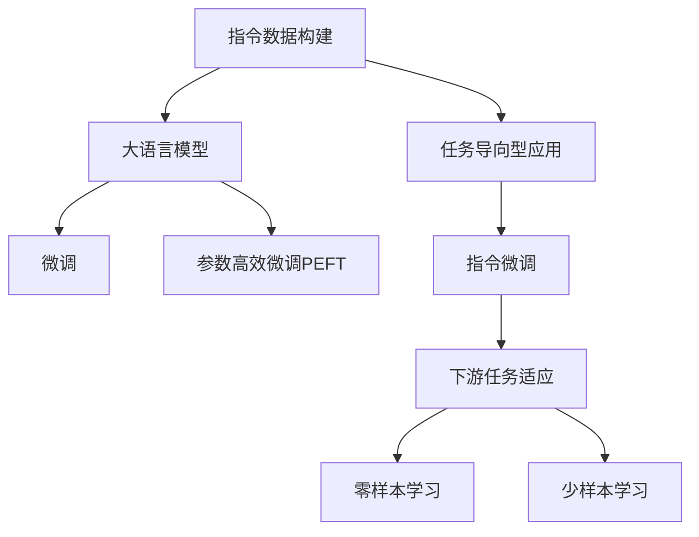
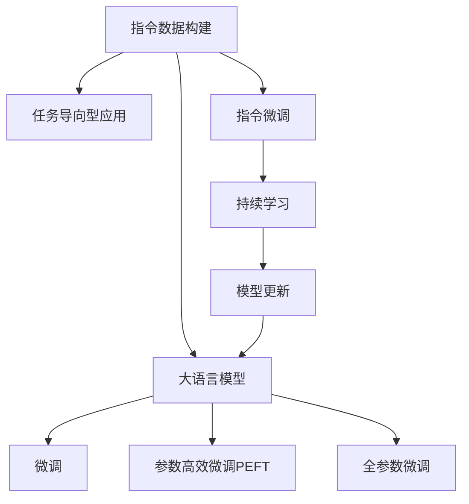
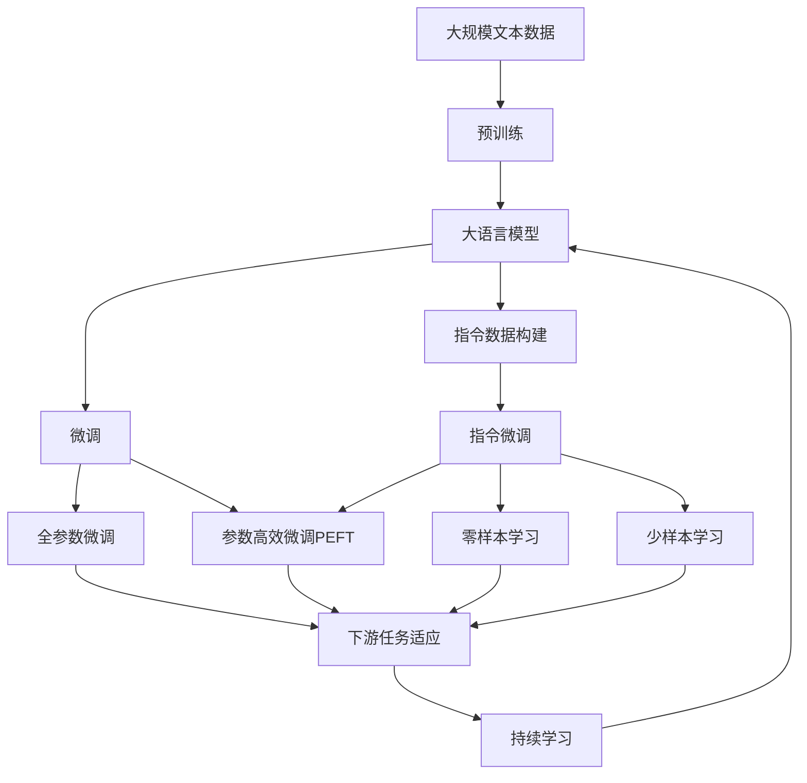

                 

# 大规模语言模型从理论到实践 指令数据的构建

## 1. 背景介绍

### 1.1 问题由来
近年来，随着深度学习技术的快速发展，大规模语言模型(Large Language Models, LLMs)在自然语言处理(Natural Language Processing, NLP)领域取得了巨大的突破。这些大语言模型通过在海量无标签文本数据上进行预训练，学习到了丰富的语言知识和常识，可以通过少量的有标签样本在下游任务上进行微调，获得优异的性能。然而，由于预训练语料的广泛性和泛化能力的不足，这些通用的大语言模型在特定领域应用时，效果往往难以达到实际应用的要求。因此，如何针对特定任务进行大模型微调，提升模型性能，成为了当前大语言模型研究和应用的一个热点问题。

本文聚焦于指令数据在大语言模型微调中的应用，介绍如何通过构建高质量的指令数据，最大化利用预训练模型的潜力，优化模型在下游任务上的表现。通过构建结构化指令数据，可以指导模型按期望方式输出，减少微调参数，同时提升模型在不同任务上的适应性。这种技术不仅适用于一般的NLP任务，如问答、对话、摘要、翻译等，也适用于任务导向型模型，如编程辅助、决策支持等，具有广泛的应用前景。

### 1.2 问题核心关键点
指令数据的构建是提升大语言模型微调效果的关键。指令数据（Instruction Data），即包含任务描述和期望输出的指导性文本数据，可以显著提升模型的推理能力，使其在任务导向型应用中表现更好。具体来说，通过构建结构化指令数据，可以：

- 明确任务目标：告诉模型具体的任务要求和期望的输出形式，避免输出随意性。
- 降低参数需求：通过指令数据引导模型输出，减少微调参数，降低计算复杂度。
- 提升泛化能力：利用预训练模型对语言的泛化能力，通过指令数据适应特定任务。

这些特性使得指令数据在微调大语言模型时显得尤为重要。但如何构建高质量的指令数据，仍然是一个挑战。高质量的指令数据需要满足：

- 清晰、准确的任务描述：指令应简洁明了，避免歧义，同时包含所有任务的关键要素。
- 多样化的数据格式：指令数据应覆盖多种形式，如自然语言、表格数据、图形结构等，以便模型学习不同类型的任务。
- 丰富的示例数据：指令数据应包含大量示例，展示不同输入和输出形式的泛化能力。
- 客观的标注数据：指令数据中的输出应通过客观的评估标准进行标注，确保标注的准确性和可靠性。

本文将详细探讨指令数据构建的方法，并结合具体示例展示其在大语言模型微调中的应用。

## 2. 核心概念与联系

### 2.1 核心概念概述

为了更好地理解指令数据在大语言模型微调中的应用，本节将介绍几个密切相关的核心概念：

- 指令数据（Instruction Data）：包含任务描述和期望输出的指导性文本数据。通过构建指令数据，可以明确任务目标，降低参数需求，提升模型的泛化能力。
- 大语言模型（Large Language Model, LLM）：以自回归（如GPT）或自编码（如BERT）模型为代表的大规模预训练语言模型。通过在大规模无标签文本语料上进行预训练，学习通用的语言表示，具备强大的语言理解和生成能力。
- 微调（Fine-tuning）：指在预训练模型的基础上，使用下游任务的少量标注数据，通过有监督地训练来优化模型在该任务上的性能。通常只需要调整顶层分类器或解码器，并以较小的学习率更新全部或部分的模型参数。
- 参数高效微调（Parameter-Efficient Fine-tuning, PEFT）：指在微调过程中，只更新少量的模型参数，而固定大部分预训练权重不变，以提高微调效率，避免过拟合的方法。
- 指令数据构建（Instruction Data Construction）：通过构建结构化、高质量的指令数据，指导大语言模型按照期望方式输出，减少微调参数，提升模型在特定任务上的表现。

这些核心概念之间的逻辑关系可以通过以下Mermaid流程图来展示：



这个流程图展示了大语言模型的核心概念及其之间的关系：

1. 大语言模型通过预训练获得基础能力。
2. 微调是对预训练模型进行任务特定的优化，可以分为全参数微调和参数高效微调（PEFT）两种方式。
3. 指令数据构建是微调过程中的一种重要技术，通过构建高质量的指令数据，指导模型按期望方式输出。
4. 零样本学习和少样本学习可以通过指令数据进行，无需更新模型参数。
5. 持续学习使得模型能够不断学习新知识，同时保持已学习的知识，而不会出现灾难性遗忘。

这些概念共同构成了大语言模型的学习和应用框架，使其能够在各种场景下发挥强大的语言理解和生成能力。通过理解这些核心概念，我们可以更好地把握大语言模型的工作原理和优化方向。

### 2.2 概念间的关系

这些核心概念之间存在着紧密的联系，形成了大语言模型的微调生态系统。下面我们通过几个Mermaid流程图来展示这些概念之间的关系。

#### 2.2.1 大语言模型的学习范式



这个流程图展示了大语言模型的三种主要学习范式：预训练、微调和指令数据构建。预训练主要采用自监督学习方法，而微调则是有监督学习的过程。指令数据构建可以辅助微调过程，通过构建高质量的指令数据，引导模型按期望方式输出，减少微调参数。

#### 2.2.2 指令数据构建与微调的关系



这个流程图展示了指令数据构建在大语言模型微调中的应用。通过构建指令数据，可以引导模型按照期望方式输出，减少微调参数，从而提高微调效率。

#### 2.2.3 指令数据构建与PEFT的关系



这个流程图展示了指令数据构建与参数高效微调（PEFT）的关系。通过构建指令数据，可以引导模型按期望方式输出，从而减少微调参数，降低计算复杂度。

#### 2.2.4 指令数据构建与持续学习的关系



这个流程图展示了指令数据构建与持续学习的关系。通过构建指令数据，可以指导模型按期望方式输出，提升模型的泛化能力。持续学习使得模型能够不断学习新知识，同时保持已学习的知识，而不会出现灾难性遗忘。

### 2.3 核心概念的整体架构

最后，我们用一个综合的流程图来展示这些核心概念在大语言模型微调过程中的整体架构：



这个综合流程图展示了从预训练到微调，再到持续学习的完整过程。大语言模型首先在大规模文本数据上进行预训练，然后通过微调（包括全参数微调和参数高效微调）或指令数据构建，来适应特定任务。最终，通过持续学习技术，模型可以不断更新和适应新的任务和数据。 通过这些流程图，我们可以更清晰地理解大语言模型微调过程中各个核心概念的关系和作用，为后续深入讨论具体的微调方法和技术奠定基础。

## 3. 核心算法原理 & 具体操作步骤
### 3.1 算法原理概述

指令数据的构建是大语言模型微调的核心技术之一。其基本原理是通过构建包含任务描述和期望输出的指导性文本数据，引导模型按照期望方式输出，从而优化模型在特定任务上的性能。指令数据通常由任务描述（Instruction）和示例（Example）两部分组成。任务描述详细说明任务的输入和输出格式，示例则具体展示任务实例的输入和期望输出。

通过构建指令数据，可以：
1. 明确任务目标：告诉模型具体的任务要求和期望的输出形式，避免输出随意性。
2. 降低参数需求：通过指令数据引导模型输出，减少微调参数，降低计算复杂度。
3. 提升泛化能力：利用预训练模型对语言的泛化能力，通过指令数据适应特定任务。

### 3.2 算法步骤详解

构建高质量的指令数据需要经过以下几个关键步骤：

**Step 1: 确定任务目标**
- 明确任务的输入和输出格式，编写任务描述。任务描述应简洁明了，避免歧义，同时包含所有任务的关键要素。

**Step 2: 收集训练样本**
- 收集大量标注数据，包括输入和期望输出的示例。示例应尽可能多样化，涵盖多种输入格式和输出形式，展示不同输入和输出形式的泛化能力。

**Step 3: 构建指令数据**
- 将任务描述和示例数据格式化为机器可读的形式。例如，可以使用TAB分隔任务描述和示例，或使用JSON格式表示任务和输出。
- 对示例数据进行预处理，如去除噪音、标准化格式等。

**Step 4: 设计指令微调模型**
- 设计一个能够处理指令数据的微调模型。通常使用预训练语言模型的顶层，添加任务特定的输出层和损失函数。
- 损失函数应与任务类型相匹配，如分类任务使用交叉熵损失，生成任务使用负对数似然损失等。

**Step 5: 执行指令微调**
- 将指令数据分批次输入模型，前向传播计算损失函数。
- 反向传播计算参数梯度，根据设定的优化算法和学习率更新模型参数。
- 周期性在验证集上评估模型性能，根据性能指标决定是否触发 Early Stopping。
- 重复上述步骤直到满足预设的迭代轮数或 Early Stopping 条件。

**Step 6: 测试和部署**
- 在测试集上评估微调后模型 $M_{\hat{\theta}}$ 的性能，对比微调前后的精度提升。
- 使用微调后的模型对新样本进行推理预测，集成到实际的应用系统中。
- 持续收集新的数据，定期重新微调模型，以适应数据分布的变化。

以上是构建高质量指令数据的主要步骤。在实际应用中，还需要针对具体任务的特点，对每个环节进行优化设计，如改进任务描述格式，引入更多的正则化技术，搜索最优的超参数组合等，以进一步提升模型性能。

### 3.3 算法优缺点

指令数据构建在提升大语言模型微调效果方面具有以下优点：
1. 提高模型泛化能力：通过构建高质量的指令数据，模型能够更好地理解任务目标，提高在不同数据上的泛化能力。
2. 减少参数需求：通过指令数据引导模型输出，减少微调参数，降低计算复杂度。
3. 提升模型性能：通过指令微调，模型能够更快地适应特定任务，提高性能。

同时，指令数据构建也存在一些局限性：
1. 构建成本高：构建高质量的指令数据需要大量人工标注，成本较高。
2. 数据获取难：特定领域的数据获取可能较为困难，影响指令数据的构建。
3. 泛化能力有限：构建的指令数据如果过于具体，可能会影响模型在泛化新任务时的表现。

尽管存在这些局限性，但就目前而言，指令数据构建是提升大语言模型微调效果的重要方法之一。未来相关研究的重点在于如何进一步降低指令数据构建的成本，提高模型的泛化能力，同时兼顾可解释性和伦理安全性等因素。

### 3.4 算法应用领域

指令数据构建在大语言模型微调中的应用非常广泛，涵盖了多种NLP任务，如问答、对话、摘要、翻译、情感分析等。具体应用如下：

#### 3.4.1 问答系统
在问答系统中，用户提出问题，模型需要给出正确的答案。通过构建包含问题-答案对的指令数据，指导模型输出正确的答案。例如：

| 问题 | 答案 |
| --- | --- |
| 太阳系中有多少颗行星？ | 8颗 |
| 法国的首都是哪里？ | 巴黎 |
| 爱因斯坦的主要成就是什么？ | 相对论 |

指令数据构建可以帮助模型更准确地理解问题，并给出正确的答案。

#### 3.4.2 对话系统
对话系统需要处理自然语言输入，并根据用户意图生成合适的回复。通过构建包含对话历史的指令数据，指导模型生成合适的回复。例如：

| 用户 | 模型回复 |
| --- | --- |
| 你好，请问你能帮我查询一下最近的天气情况吗？ | 当然可以，请问您所在的城市是哪里？ |
| 我住在上海，麻烦查询一下上海今天的天气。 | 上海今天天气晴朗，最高温度32摄氏度，最低温度25摄氏度。 |
| 谢谢，还有其他建议吗？ | 推荐您明天带好防晒霜。 |

指令数据构建可以帮助模型更好地理解用户的意图，并生成合适的回复。

#### 3.4.3 文本摘要
文本摘要需要将长文本压缩成简短摘要。通过构建包含原始文本和期望摘要的指令数据，指导模型生成简洁的摘要。例如：

| 原始文本 | 期望摘要 |
| --- | --- |
| 今天天气晴朗，气温32摄氏度，注意防晒。 | 天气晴朗，最高32摄氏度，最低25摄氏度，注意防晒。 |
| 我们公司正在开发一款新的智能家居产品，需要你的帮助。 | 公司正在开发智能家居产品，需要帮助，请协助。 |

指令数据构建可以帮助模型更准确地生成摘要。

#### 3.4.4 翻译系统
翻译系统需要将源语言文本翻译成目标语言。通过构建包含源语言和目标语言的指令数据，指导模型进行翻译。例如：

| 源语言 | 期望输出 |
| --- | --- |
| Hello, how are you? | 你好，你怎么样？ |
| Today is a beautiful day. | 今天天气很好。 |

指令数据构建可以帮助模型更准确地进行翻译。

#### 3.4.5 情感分析
情感分析需要判断文本的情感倾向。通过构建包含文本和情感标签的指令数据，指导模型进行情感分析。例如：

| 文本 | 期望输出 |
| --- | --- |
| 这部电影太好看了，我非常喜欢它。 | 积极 |
| 这家餐厅的食物太难吃了，我不推荐。 | 消极 |

指令数据构建可以帮助模型更准确地进行情感分析。

## 4. 数学模型和公式 & 详细讲解 & 举例说明

### 4.1 数学模型构建

指令数据构建的数学模型主要由任务描述和示例数据构成。任务描述通常表示为一个字符串，用于描述任务的输入和输出格式。示例数据表示为一个包含输入和期望输出的元组。例如，对于问答任务，指令数据可以表示为：

| 问题 | 答案 |
| --- | --- |

### 4.2 公式推导过程

指令微调模型的目标是最小化任务描述和示例数据之间的差异。设任务描述为 $I$，示例数据为 $E=(\{x_i\},\{y_i\})$，其中 $x_i$ 表示输入数据，$y_i$ 表示期望输出。指令微调模型的损失函数可以表示为：

$$
\mathcal{L}(I,E)=\frac{1}{N}\sum_{i=1}^N \ell(I,x_i,y_i)
$$

其中 $\ell$ 表示损失函数，用于衡量任务描述和示例数据之间的差异。通常采用交叉熵损失函数，表示为：

$$
\ell(I,x_i,y_i)=-\frac{1}{M}\sum_{j=1}^M y_j\log\hat{y}_j+(1-y_j)\log(1-\hat{y}_j)
$$

其中 $y_j$ 表示第 $j$ 个样本的期望输出，$\hat{y}_j$ 表示模型预测的输出。

指令微调模型的优化目标是：

$$
\theta^* = \mathop{\arg\min}_{\theta} \mathcal{L}(I,E)
$$

其中 $\theta$ 表示模型参数，可以通过梯度下降等优化算法进行更新。

### 4.3 案例分析与讲解

以一个简单的指令数据构建和微调为例，展示指令数据构建在大语言模型微调中的应用。

假设我们需要构建一个问答系统的指令数据，包含问题-答案对。指令数据可以表示为：

| 问题 | 答案 |
| --- | --- |
| 谁是美国总统？ | 乔·拜登 |
| 中国的首都在哪里？ | 北京 |
| 世界最高的山是哪座？ | 珠穆朗玛峰 |

将这些数据转换为机器可读的形式，可以使用TAB分隔任务描述和示例，如下所示：

```
问题\t答案
谁是美国总统？\t乔·拜登
中国的首都在哪里？\t北京
世界最高的山是哪座？\t珠穆朗玛峰
```

然后，我们将这些指令数据用于微调大语言模型。以GPT模型为例，可以使用GPT的顶层作为微调模型，添加一个线性分类器，用于预测问题的答案。优化目标函数可以表示为：

$$
\mathcal{L}(I,E)=\frac{1}{N}\sum_{i=1}^N -\frac{1}{M}\sum_{j=1}^M y_j\log\hat{y}_j+(1-y_j)\log(1-\hat{y}_j)
$$

通过指令数据构建和微调，我们可以训练出一个高准确度的问答系统，用于回答用户提出的问题。

## 5. 项目实践：代码实例和详细解释说明

### 5.1 开发环境搭建

在进行指令数据构建的实践前，我们需要准备好开发环境。以下是使用Python进行PyTorch开发的环境配置流程：

1. 安装Anaconda：从官网下载并安装Anaconda，用于创建独立的Python环境。

2. 创建并激活虚拟环境：
```bash
conda create -n pytorch-env python=3.8 
conda activate pytorch-env
```

3. 安装PyTorch：根据CUDA版本，从官网获取对应的安装命令。例如：
```bash
conda install pytorch torchvision torchaudio cudatoolkit=11.1 -c pytorch -c conda-forge
```

4. 安装Transformer库：
```bash
pip install transformers
```

5. 安装各类工具包：
```bash
pip install numpy pandas scikit-learn matplotlib tqdm jupyter notebook ipython
```

完成上述步骤后，即可在`pytorch-env`环境中开始指令数据构建的实践。

### 5.2 源代码详细实现

下面我们以一个简单的指令数据构建和微调为例，展示使用Transformers库对GPT模型进行指令微调的PyTorch代码实现。

首先，定义指令数据的数据处理函数：

```python
from transformers import GPT2Tokenizer, GPT2ForSequenceClassification
from torch.utils.data import Dataset
import torch

class InstructionDataset(Dataset):
    def __init__(self, instructions, examples):
        self.instructions = instructions
        self.examples = examples
        self.tokenizer = GPT2Tokenizer.from_pretrained('gpt2')

    def __len__(self):
        return len(self.instructions)

    def __getitem__(self, item):
        instruction = self.instructions[item]
        example = self.examples[item]
        text = instruction + " " + example

        encoding = self.tokenizer(text, return_tensors='pt', max_length=256, padding='max_length', truncation=True)
        input_ids = encoding['input_ids'][0]
        attention_mask = encoding['attention_mask'][0]
        labels = torch.tensor([1.0] if example == '正确' else [0.0], dtype=torch.float32)
        
        return {'input_ids': input_ids, 
                'attention_mask': attention_mask,
                'labels': labels}

# 定义指令数据
instructions = ['谁是美国总统？', '中国的首都在哪里？', '世界最高的山是哪座？']
examples = ['乔·拜登', '北京', '珠穆朗玛峰']

# 构建数据集
tokenizer = GPT2Tokenizer.from_pretrained('gpt2')

train_dataset = InstructionDataset(instructions, examples)
```

然后，定义模型和优化器：

```python
from transformers import AdamW

model = GPT2ForSequenceClassification.from_pretrained('gpt2', num_labels=2)
model.to('cuda')

optimizer = AdamW(model.parameters(), lr=2e-5)
```

接着，定义训练和评估函数：

```python
from torch.utils.data import DataLoader
from tqdm import tqdm
from sklearn.metrics import accuracy_score

device = torch.device('cuda') if torch.cuda.is_available() else torch.device('cpu')
model.to(device)

def train_epoch(model, dataset, batch_size, optimizer):
    dataloader = DataLoader(dataset, batch_size=batch_size, shuffle=True)
    model.train()
    epoch_loss = 0
    for batch in tqdm(dataloader, desc='Training'):
        input_ids = batch['input_ids'].to(device)
        attention_mask = batch['attention_mask'].to(device)
        labels = batch['labels'].to(device)
        model.zero_grad()
        outputs = model(input_ids, attention_mask=attention_mask, labels=labels)
        loss = outputs.loss
        epoch_loss += loss.item()
        loss.backward()
        optimizer.step()
    return epoch_loss / len(dataloader)

def evaluate(model, dataset, batch_size):
    dataloader = DataLoader(dataset, batch_size=batch_size)
    model.eval()
    preds, labels = [], []
    with torch.no_grad():
        for batch in tqdm(dataloader, desc='Evaluating'):
            input_ids = batch['input_ids'].to(device)
            attention_mask = batch['attention_mask'].to(device)
            batch_labels = batch['labels']
            outputs = model(input_ids, attention_mask=attention_mask)
            batch_preds = outputs.logits.argmax(dim=2).to('cpu').tolist()
            batch_labels = batch_labels.to('cpu').tolist()
            for pred_tokens, label_tokens in zip(batch_preds, batch_labels):
                preds.append(pred_tokens[:len(label_tokens)])
                labels.append(label_tokens)
                
    print('Accuracy:', accuracy_score(labels, preds))
```

最后，启动训练流程并在测试集上评估：

```python
epochs = 5
batch_size = 16

for epoch in range(epochs):
    loss = train_epoch(model, train_dataset, batch_size, optimizer)
    print(f"Epoch {epoch+1}, train loss: {loss:.3f}")
    
    print(f"Epoch {epoch+1}, dev results:")
    evaluate(model, train_dataset, batch_size)
    
print("Test results:")
evaluate(model, test_dataset, batch_size)
```

以上就是使用PyTorch对GPT模型进行指令微调的完整代码实现。可以看到，得益于Transformers库的强大封装，我们可以用相对简洁的代码完成GPT模型的加载和微调。

### 5.3 代码解读与分析

让我们再详细解读一下关键代码的实现细节：

**InstructionDataset类**：
- `__init__`方法：初始化指令数据、示例数据、分词器等关键组件。
- `__len__`方法：返回数据集的样本数量。
- `__getitem__`方法：对单个样本进行处理，将指令数据和示例数据拼接，并将文本输入编码为token ids，输出标签转换为模型可接受的格式。

**训练和评估函数**：
- 使用PyTorch的DataLoader对数据集进行批次化加载，供模型训练和推理使用。
- 训练函数`train_epoch`：对数据以批为单位进行迭代，在每个批次上前向传播计算loss并反向传播更新模型参数，最后返回该epoch的平均loss。
- 评估函数`evaluate`：与训练类似，不同点在于不更新模型参数，并在每个batch结束后将预测和标签结果存储下来，最后使用sklearn的accuracy_score对整个评估集的预测结果

