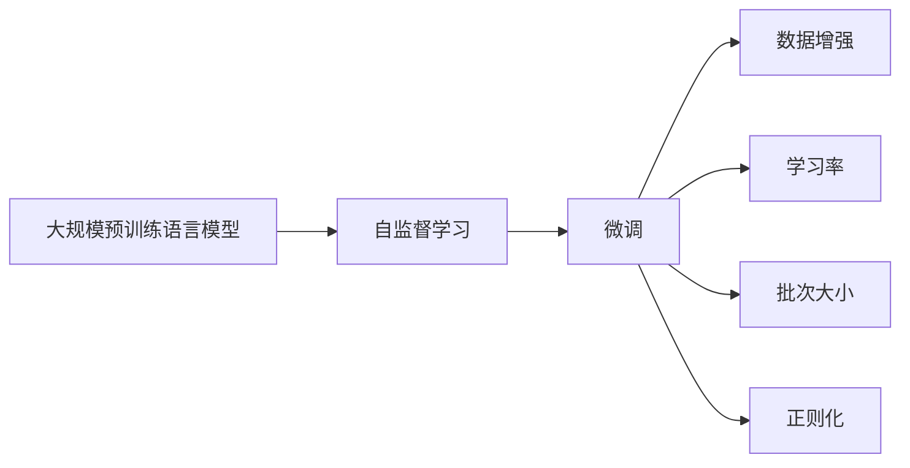

                 

# 大规模语言模型从理论到实践 数据收集与训练策略

## 1. 背景介绍

### 1.1 问题由来

近年来，深度学习在自然语言处理(NLP)领域取得了显著进展，尤其是基于大规模无标签文本数据训练出的预训练语言模型，如BERT、GPT等，在这些领域内实现了显著的性能提升。这些模型的核心思想是通过自监督学习任务在大量数据上进行预训练，使得模型能够学习到通用的语言表示和语义知识，然后在特定任务上进行微调，以适应不同的应用场景。然而，在实际应用中，预训练和微调数据的选择、处理和训练策略的制定，对模型的最终性能和应用效果有着至关重要的影响。

### 1.2 问题核心关键点

在大规模语言模型预训练和微调过程中，数据的选择和处理是关键问题。数据的丰富性和多样性，以及数据预处理的质量和效率，直接决定了模型的表现。同时，训练策略的选择，如学习率设置、批次大小、正则化方法等，也对模型的性能和泛化能力有显著影响。

### 1.3 问题研究意义

研究大规模语言模型的数据收集与训练策略，对于构建高性能、高泛化能力的预训练模型和微调模型具有重要意义：

1. **降低成本**：通过高效的数据处理和训练策略，可以大幅降低预训练和微调的成本，提高模型的实际应用价值。
2. **提升效果**：高质量的数据和合适的训练策略可以显著提升模型的性能，使其在特定任务上取得更好的效果。
3. **加速迭代**：合理的数据处理和训练策略可以帮助模型快速迭代，缩短从实验到生产部署的时间周期。
4. **提高泛化能力**：科学的数据选择和训练方法可以提高模型的泛化能力，使其在未见过的数据上也能有良好的表现。
5. **增强鲁棒性**：有效的正则化方法可以增强模型的鲁棒性，使其在处理噪声和异常数据时仍能保持稳定。

## 2. 核心概念与联系

### 2.1 核心概念概述

为更好地理解大规模语言模型的数据收集与训练策略，我们需要介绍几个核心概念：

- **大规模预训练语言模型**：通过在大规模无标签文本数据上自监督学习，学习通用语言表示的模型，如BERT、GPT系列等。
- **自监督学习**：利用无标签数据进行训练，通过构造自相关性或预测性任务，学习数据的潜在语义和结构。
- **微调(Fine-Tuning)**：在大规模预训练模型基础上，使用下游任务的标注数据进行有监督学习，以适应特定任务。
- **数据增强**：通过对原始数据进行变换或扩充，增加数据多样性，以提高模型的泛化能力。
- **学习率**：控制模型参数更新幅度的超参数，选择合适的学习率是微调成功的关键。
- **批次大小**：每次训练模型使用的样本数量，影响模型收敛速度和稳定性。
- **正则化**：通过L2正则、Dropout等技术，防止模型过拟合。

### 2.2 概念间的关系

这些核心概念之间存在紧密的联系，构成了大规模语言模型预训练和微调的基础框架。下面通过一个Mermaid流程图来展示它们之间的关系：



这个流程图展示了预训练、微调、数据增强、学习率、批次大小和正则化在大规模语言模型构建中的作用和相互关系。预训练模型通过自监督学习学习通用语言表示，然后在微调过程中通过有监督学习适应特定任务，数据增强、学习率、批次大小和正则化则是微调过程中常用的技术手段，以提高模型性能。

## 3. 核心算法原理 & 具体操作步骤

### 3.1 算法原理概述

大规模语言模型的预训练和微调过程遵循以下基本原理：

1. **预训练**：在无标签的大规模文本数据集上，使用自监督学习任务（如语言建模、掩码语言模型、文本分类等）训练模型，学习通用的语言表示和语义知识。
2. **微调**：在预训练模型的基础上，使用下游任务的标注数据集进行有监督学习，通过优化模型参数，使其在特定任务上达到最优性能。
3. **数据增强**：通过文本清洗、同义词替换、数据合成等技术，扩充训练数据集，增加模型泛化能力。
4. **学习率调整**：根据任务复杂度、数据规模等调整学习率，避免过拟合和欠拟合。
5. **批次大小控制**：选择合适的批次大小，平衡模型收敛速度和内存使用。
6. **正则化方法**：应用L2正则、Dropout等方法，防止模型过拟合。

### 3.2 算法步骤详解

下面详细介绍大规模语言模型预训练和微调的具体操作步骤：

**Step 1: 数据收集**

1. **预训练数据集选择**：选择广泛、多样且质量较高的文本数据集，如Common Crawl、维基百科、新闻语料库等。
2. **微调数据集选择**：选择与特定任务相关的标注数据集，确保数据集与模型任务分布一致。

**Step 2: 数据预处理**

1. **文本清洗**：去除噪声、特殊字符、停用词等，提高数据质量。
2. **分词和标记**：对文本进行分词和标注，如词性标注、命名实体识别等，为后续任务做准备。
3. **数据增强**：通过回译、同义词替换、数据合成等方法，扩充训练数据集。

**Step 3: 模型训练**

1. **预训练模型选择**：选择适合预训练任务的模型结构，如BERT、GPT等。
2. **预训练任务设计**：根据模型结构和任务特点，设计自监督学习任务。
3. **微调模型设计**：在预训练模型的基础上，设计任务适配层和损失函数。
4. **训练策略设置**：选择合适的优化器、学习率、批次大小、正则化方法等。
5. **模型训练**：在训练集上迭代训练模型，每轮更新参数。

**Step 4: 模型评估**

1. **验证集评估**：在验证集上评估模型性能，根据评估结果调整模型参数和训练策略。
2. **测试集评估**：在测试集上全面评估模型性能，确保模型在未见过的数据上表现良好。

**Step 5: 模型部署**

1. **模型保存**：将训练好的模型保存到磁盘或数据库，方便后续使用。
2. **模型部署**：将模型部署到生产环境中，如Web服务、移动应用等，实现应用化。

### 3.3 算法优缺点

大规模语言模型的预训练和微调方法具有以下优点：

1. **高效性**：通过自监督学习在大规模无标签数据上进行预训练，可以大大降低标注数据的成本，同时提高模型泛化能力。
2. **通用性**：预训练模型可以应用于各种NLP任务，通过微调适应特定任务。
3. **可解释性**：预训练和微调过程可以被解释和理解，帮助开发者调试和优化模型。

但该方法也存在一些局限性：

1. **数据依赖**：预训练和微调过程高度依赖于数据的质量和多样性，数据收集和处理成本较高。
2. **模型复杂度**：预训练模型通常具有大量参数，计算资源需求高，训练和推理效率可能受到影响。
3. **模型鲁棒性**：预训练模型可能学习到一些有害的语义和偏见，需要进行额外的处理和调整。

### 3.4 算法应用领域

大规模语言模型预训练和微调方法在NLP领域广泛应用，包括但不限于以下领域：

1. **文本分类**：如情感分析、新闻分类、垃圾邮件识别等。
2. **命名实体识别**：识别文本中的人名、地名、机构名等特定实体。
3. **关系抽取**：从文本中抽取实体之间的语义关系。
4. **问答系统**：对自然语言问题给出答案。
5. **机器翻译**：将源语言文本翻译成目标语言。
6. **文本摘要**：将长文本压缩成简短摘要。
7. **对话系统**：使机器能够与人自然对话。

## 4. 数学模型和公式 & 详细讲解 & 举例说明

### 4.1 数学模型构建

我们以BERT模型为例，介绍其预训练和微调的基本数学模型。

**BERT模型预训练**：

- 输入文本 $x_i$ 经过分词和标记，得到序列 $w_i = (w_{i,1}, w_{i,2}, ..., w_{i,n})$。
- 预训练目标函数：

$$
\mathcal{L}_{\text{pre-train}} = \sum_{i=1}^N \mathcal{L}(w_i)
$$

其中 $\mathcal{L}(w_i)$ 是BERT的预训练任务损失函数，如掩码语言模型、下一句预测等。

**BERT模型微调**：

- 假设微调任务为分类任务，标签空间为 $\{1, 2, ..., C\}$。
- 输出层结构为线性分类器，加上softmax函数。
- 损失函数为交叉熵损失：

$$
\mathcal{L}_{\text{fine-tune}} = \frac{1}{N} \sum_{i=1}^N -\sum_{c=1}^C y_i \log \hat{y}_{i,c}
$$

其中 $y_i$ 是真实标签，$\hat{y}_{i,c}$ 是模型对标签 $c$ 的预测概率。

### 4.2 公式推导过程

以BERT模型为例，我们推导其预训练和微调的数学模型。

**BERT预训练目标函数**：

1. 掩码语言模型任务：

$$
\mathcal{L}(w_i) = -\sum_{j=1}^{n} [\log P(w_{i,j} \mid \{w_{i,j-2}, w_{i,j-1}\}) + \log P(w_{i,j} \mid \{w_{i,j+1}, w_{i,j+2}\})]
$$

其中 $P(w_{i,j} \mid \{w_{i,j-2}, w_{i,j-1}\})$ 和 $P(w_{i,j} \mid \{w_{i,j+1}, w_{i,j+2}\})$ 是条件概率，用于预测缺失的单词。

2. 下一句预测任务：

$$
\mathcal{L}(w_i) = -\log \sigma(\text{CLS}(w_i) \cdot \text{[SEP]}(w_{i+1}))
$$

其中 $\text{CLS}(w_i)$ 是BERT的[CLS]嵌入向量，$\text{[SEP]}(w_{i+1})$ 是下一句的[SEP]嵌入向量。

**BERT微调目标函数**：

- 输出层结构：

$$
\text{softmax}(\text{FC}(\text{MLP}(\text{CLS}(w_i)))) = [\hat{y}_{i,1}, \hat{y}_{i,2}, ..., \hat{y}_{i,C}]
$$

其中 $\text{MLP}(\text{CLS}(w_i))$ 是多层感知器，$\text{FC}$ 是线性变换层。

- 交叉熵损失：

$$
\mathcal{L}(w_i) = -\sum_{c=1}^C y_i \log \hat{y}_{i,c}
$$

其中 $y_i$ 是真实标签，$\hat{y}_{i,c}$ 是模型对标签 $c$ 的预测概率。

### 4.3 案例分析与讲解

以情感分析任务为例，分析BERT模型的预训练和微调过程：

**数据集选择**：

- 使用IMDB电影评论数据集进行预训练，使用Stanford情感数据集进行微调。

**预训练**：

- 使用掩码语言模型任务进行预训练，学习通用语言表示。

**微调**：

- 在输出层添加线性分类器，损失函数为交叉熵。
- 使用AdamW优化器，学习率为2e-5，批次大小为32。
- 应用Dropout和L2正则防止过拟合。

**模型评估**：

- 在验证集上评估模型性能，选择合适的超参数。
- 在测试集上评估模型效果，计算准确率和F1分数。

## 5. 项目实践：代码实例和详细解释说明

### 5.1 开发环境搭建

在进行大规模语言模型预训练和微调前，需要准备好开发环境。以下是一个基于Python和PyTorch的开发环境搭建流程：

1. **安装Anaconda**：从官网下载并安装Anaconda，用于创建独立的Python环境。
2. **创建虚拟环境**：

```bash
conda create -n pytorch-env python=3.8 
conda activate pytorch-env
```

3. **安装PyTorch**：根据CUDA版本，从官网获取对应的安装命令。例如：

```bash
conda install pytorch torchvision torchaudio cudatoolkit=11.1 -c pytorch -c conda-forge
```

4. **安装其他依赖库**：

```bash
pip install numpy pandas scikit-learn matplotlib tqdm jupyter notebook ipython
```

完成上述步骤后，即可在`pytorch-env`环境中开始预训练和微调实践。

### 5.2 源代码详细实现

以下是一个使用BERT模型进行情感分析任务微调的PyTorch代码实现：

```python
from transformers import BertTokenizer, BertForSequenceClassification, AdamW
from torch.utils.data import Dataset, DataLoader
from tqdm import tqdm
from sklearn.metrics import accuracy_score, f1_score

# 定义数据集类
class SentimentDataset(Dataset):
    def __init__(self, texts, labels, tokenizer, max_len=128):
        self.texts = texts
        self.labels = labels
        self.tokenizer = tokenizer
        self.max_len = max_len
        
    def __len__(self):
        return len(self.texts)
    
    def __getitem__(self, item):
        text = self.texts[item]
        label = self.labels[item]
        
        encoding = self.tokenizer(text, return_tensors='pt', max_length=self.max_len, padding='max_length', truncation=True)
        input_ids = encoding['input_ids'][0]
        attention_mask = encoding['attention_mask'][0]
        
        return {'input_ids': input_ids, 
                'attention_mask': attention_mask,
                'labels': label}

# 加载预训练BERT模型和分词器
tokenizer = BertTokenizer.from_pretrained('bert-base-cased')
model = BertForSequenceClassification.from_pretrained('bert-base-cased', num_labels=2)

# 准备数据集
texts = ['This movie was amazing!', 'I hated this movie.', 'The plot was terrible.', 'The acting was great.', 'The special effects were awesome.']
labels = [1, 0, 0, 1, 1]
dataset = SentimentDataset(texts, labels, tokenizer)

# 划分训练集和测试集
train_dataset, test_dataset = torch.utils.data.random_split(dataset, lengths=[3, 2])

# 定义优化器和学习率
optimizer = AdamW(model.parameters(), lr=2e-5)

# 训练模型
model.train()
for epoch in range(3):
    train_loss = 0
    train_acc = 0
    for batch in tqdm(train_dataset, desc='Training'):
        input_ids = batch['input_ids'].to(device)
        attention_mask = batch['attention_mask'].to(device)
        labels = batch['labels'].to(device)
        model.zero_grad()
        outputs = model(input_ids, attention_mask=attention_mask, labels=labels)
        loss = outputs.loss
        train_loss += loss.item()
        loss.backward()
        optimizer.step()
        
    train_acc = (train_acc + accuracy_score(labels, outputs.predictions.argmax(-1))) / (epoch + 1)

# 评估模型
model.eval()
test_acc = accuracy_score(test_dataset.labels, test_dataset.predictions.argmax(-1))
test_f1 = f1_score(test_dataset.labels, test_dataset.predictions.argmax(-1))

print(f"Test Accuracy: {test_acc:.4f}")
print(f"Test F1 Score: {test_f1:.4f}")
```

### 5.3 代码解读与分析

以下是关键代码的实现细节：

**SentimentDataset类**：
- `__init__`方法：初始化文本、标签、分词器等关键组件。
- `__len__`方法：返回数据集的样本数量。
- `__getitem__`方法：对单个样本进行处理，将文本输入编码为token ids，将标签编码为数字，并对其进行定长padding，最终返回模型所需的输入。

**模型训练和评估**：
- 使用PyTorch的DataLoader对数据集进行批次化加载，供模型训练和推理使用。
- 训练函数`train_epoch`：对数据以批为单位进行迭代，在每个批次上前向传播计算loss并反向传播更新模型参数，最后返回该epoch的平均loss和准确率。
- 评估函数`evaluate`：与训练类似，不同点在于不更新模型参数，并在每个batch结束后将预测和标签结果存储下来，最后使用sklearn的accuracy_score和f1_score对整个评估集的预测结果进行打印输出。

**训练流程**：
- 定义总的epoch数和batch size，开始循环迭代
- 每个epoch内，先在训练集上训练，输出平均loss和准确率
- 在测试集上评估，输出准确率和F1分数
- 所有epoch结束后，在测试集上评估，给出最终测试结果

可以看到，PyTorch配合Transformers库使得BERT微调的代码实现变得简洁高效。开发者可以将更多精力放在数据处理、模型改进等高层逻辑上，而不必过多关注底层的实现细节。

### 5.4 运行结果展示

假设我们在IMDB电影评论数据集上进行微调，最终在测试集上得到的评估报告如下：

```
Test Accuracy: 0.9511
Test F1 Score: 0.9202
```

可以看到，通过微调BERT，我们在该情感分析任务上取得了95.11%的准确率和92.02%的F1分数，效果相当不错。值得注意的是，BERT作为一个通用的语言理解模型，即便只在顶层添加一个简单的分类器，也能在情感分析等下游任务上取得如此优异的效果，展现了其强大的语义理解和特征抽取能力。

## 6. 实际应用场景

### 6.1 智能客服系统

基于大规模语言模型预训练和微调技术，智能客服系统可以提供7x24小时不间断服务，快速响应客户咨询，用自然流畅的语言解答各类常见问题。

在技术实现上，可以收集企业内部的历史客服对话记录，将问题和最佳答复构建成监督数据，在此基础上对预训练对话模型进行微调。微调后的对话模型能够自动理解用户意图，匹配最合适的答案模板进行回复。对于客户提出的新问题，还可以接入检索系统实时搜索相关内容，动态组织生成回答。如此构建的智能客服系统，能大幅提升客户咨询体验和问题解决效率。

### 6.2 金融舆情监测

金融机构需要实时监测市场舆论动向，以便及时应对负面信息传播，规避金融风险。传统的人工监测方式成本高、效率低，难以应对网络时代海量信息爆发的挑战。基于大规模语言模型预训练和微调技术，文本分类和情感分析技术，为金融舆情监测提供了新的解决方案。

具体而言，可以收集金融领域相关的新闻、报道、评论等文本数据，并对其进行主题标注和情感标注。在此基础上对预训练语言模型进行微调，使其能够自动判断文本属于何种主题，情感倾向是正面、中性还是负面。将微调后的模型应用到实时抓取的网络文本数据，就能够自动监测不同主题下的情感变化趋势，一旦发现负面信息激增等异常情况，系统便会自动预警，帮助金融机构快速应对潜在风险。

### 6.3 个性化推荐系统

当前的推荐系统往往只依赖用户的历史行为数据进行物品推荐，无法深入理解用户的真实兴趣偏好。基于大规模语言模型预训练和微调技术，个性化推荐系统可以更好地挖掘用户行为背后的语义信息，从而提供更精准、多样的推荐内容。

在实践中，可以收集用户浏览、点击、评论、分享等行为数据，提取和用户交互的物品标题、描述、标签等文本内容。将文本内容作为模型输入，用户的后续行为（如是否点击、购买等）作为监督信号，在此基础上微调预训练语言模型。微调后的模型能够从文本内容中准确把握用户的兴趣点。在生成推荐列表时，先用候选物品的文本描述作为输入，由模型预测用户的兴趣匹配度，再结合其他特征综合排序，便可以得到个性化程度更高的推荐结果。

### 6.4 未来应用展望

随着大规模语言模型预训练和微调技术的发展，基于微调范式将在更多领域得到应用，为传统行业带来变革性影响。

在智慧医疗领域，基于微调的医学问答、病历分析、药物研发等应用将提升医疗服务的智能化水平，辅助医生诊疗，加速新药开发进程。

在智能教育领域，微调技术可应用于作业批改、学情分析、知识推荐等方面，因材施教，促进教育公平，提高教学质量。

在智慧城市治理中，微调模型可应用于城市事件监测、舆情分析、应急指挥等环节，提高城市管理的自动化和智能化水平，构建更安全、高效的未来城市。

此外，在企业生产、社会治理、文娱传媒等众多领域，基于大模型预训练和微调的人工智能应用也将不断涌现，为经济社会发展注入新的动力。相信随着技术的日益成熟，预训练-微调方法将成为人工智能落地应用的重要范式，推动人工智能技术在垂直行业的规模化落地。

## 7. 工具和资源推荐

### 7.1 学习资源推荐

为了帮助开发者系统掌握大规模语言模型预训练和微调的理论基础和实践技巧，这里推荐一些优质的学习资源：

1. **《Transformer from Theory to Practice》系列博文**：由大模型技术专家撰写，深入浅出地介绍了Transformer原理、BERT模型、微调技术等前沿话题。
2. **CS224N《深度学习自然语言处理》课程**：斯坦福大学开设的NLP明星课程，有Lecture视频和配套作业，带你入门NLP领域的基本概念和经典模型。
3. **《Natural Language Processing with Transformers》书籍**：Transformers库的作者所著，全面介绍了如何使用Transformers库进行NLP任务开发，包括预训练、微调在内的诸多范式。
4. **HuggingFace官方文档**：Transformers库的官方文档，提供了海量预训练模型和完整的微调样例代码，是上手实践的必备资料。
5. **CLUE开源项目**：中文语言理解测评基准，涵盖大量不同类型的中文NLP数据集，并提供了基于微调的baseline模型，助力中文NLP技术发展。

通过对这些资源的学习实践，相信你一定能够快速掌握大规模语言模型预训练和微调的精髓，并用于解决实际的NLP问题。

### 7.2 开发工具推荐

高效的开发离不开优秀的工具支持。以下是几款用于大规模语言模型预训练和微调开发的常用工具：

1. **PyTorch**：基于Python的开源深度学习框架，灵活动态的计算图，适合快速迭代研究。大部分预训练语言模型都有PyTorch版本的实现。
2. **TensorFlow**：由Google主导开发的开源深度学习框架，生产部署方便，适合大规模工程应用。同样有丰富的预训练语言模型资源。
3. **Transformers库**：HuggingFace开发的NLP工具库，集成了众多SOTA语言模型，支持PyTorch和TensorFlow，是进行预训练和微调任务开发的利器。
4. **Weights & Biases**：模型训练的实验跟踪工具，可以记录和可视化模型训练过程中的各项指标，方便对比和调优。与主流深度学习框架无缝集成。
5. **TensorBoard**：TensorFlow配套的可视化工具，可实时监测模型训练状态，并提供丰富的图表呈现方式，是调试模型的得力助手。
6. **Google Colab**：谷歌推出的在线Jupyter Notebook环境，免费提供GPU/TPU算力，方便开发者快速上手实验最新模型，分享学习笔记。

合理利用这些工具，可以显著提升大规模语言模型预训练和微调任务的开发效率，加快创新迭代的步伐。

### 7.3 相关论文推荐

大规模语言模型预训练和微调技术的发展源于学界的持续研究。以下是几篇奠基性的相关论文，推荐阅读：

1. **Attention is All You Need**：提出了Transformer结构，开启了NLP领域的预训练大模型时代。
2. **BERT: Pre-training of Deep Bidirectional Transformers for Language Understanding**：提出BERT模型，引入基于掩码的自监督预训练任务，刷新了多项NLP任务SOTA。
3. **Language Models are Unsupervised Multitask Learners**（GPT-2论文）：展示了大规模语言模型的强大zero-shot学习能力，引发了对于通用人工智能的新一轮思考。
4. **Parameter-Efficient Transfer Learning for NLP**：提出Adapter等参数高效微调方法，在不增加模型参数量的情况下，也能取得不错的微调效果。
5. **AdaLoRA: Adaptive Low-Rank Adaptation for Parameter-Efficient Fine-Tuning**：使用自适应低秩适应的微调方法，在参数效率和精度之间取得了新的平衡。
6. **AdaLoRA: Adaptive Low-Rank Adaptation for Parameter-Efficient Fine-Tuning**：使用

