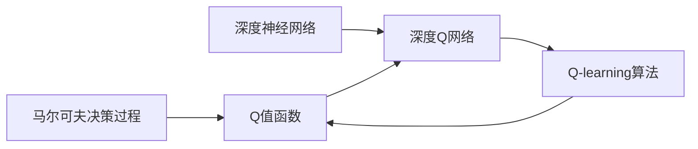
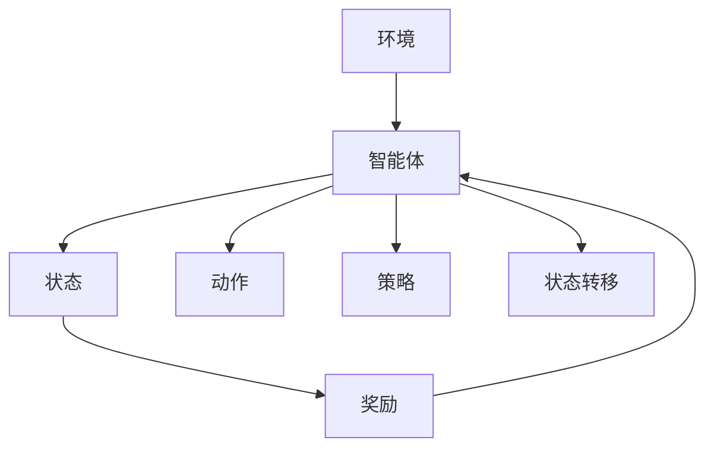
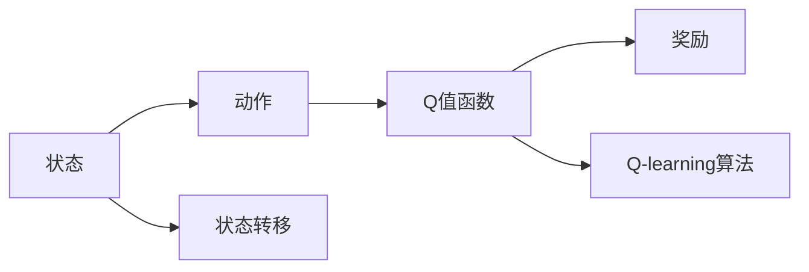
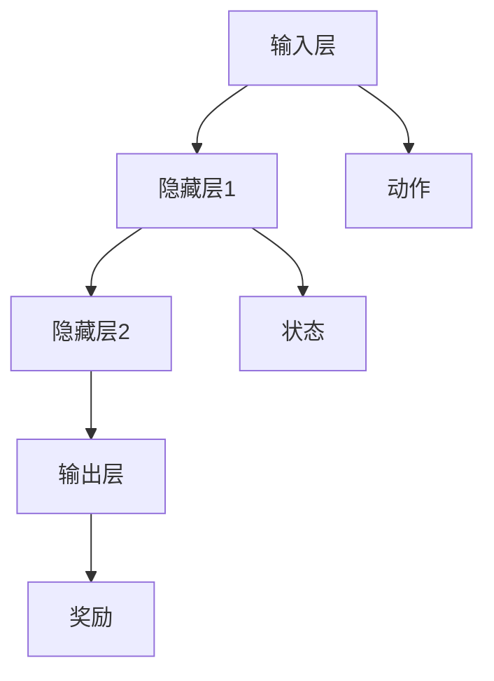

                 

# 大语言模型原理与工程实践：DQN 训练：基本思想

> 关键词：强化学习, 深度Q网络, 马尔可夫决策过程, 探索与利用矛盾, 经验回放

## 1. 背景介绍

### 1.1 问题由来
在计算机视觉、自然语言处理等高维数据领域，传统的监督学习、无监督学习等方法面临巨大挑战。数据的样本规模和复杂度不断增加，使得这些方法在计算资源和模型复杂度上难以应对。与此同时，以强化学习为代表的序列决策方法，通过与环境的交互获得奖励反馈，能够适应大规模、高维、动态变化的数据环境。因此，强化学习在许多实际应用中展示了强大的适应性和灵活性。

### 1.2 问题核心关键点
深度强化学习中的深度Q网络（Deep Q-Network, DQN）是一种重要的模型，它将传统的Q-learning算法与深度神经网络相结合，大大提升了算法的性能和鲁棒性。DQN的核心思想是通过神经网络逼近Q值函数，从而实现对动态环境的学习和决策。

## 2. 核心概念与联系

### 2.1 核心概念概述

为了深入理解DQN的基本思想，我们首先介绍几个关键概念：

- 马尔可夫决策过程（Markov Decision Process, MDP）：描述智能体（agent）在与环境的交互中，通过一系列动作选择和环境反馈，实现最优策略的目标。MDP包括状态空间（State Space）、动作空间（Action Space）、奖励函数（Reward Function）和转移概率（Transition Probability）等要素。

- Q值函数（Q-Value Function）：表示在给定状态下执行某个动作的长期期望奖励。Q值函数$Q(s, a)$代表在状态$s$下执行动作$a$的期望奖励。

- Q-learning算法：基于Q值函数的强化学习算法，通过不断迭代更新Q值函数，求解最优策略。

- 深度神经网络（Deep Neural Network, DNN）：由多层神经元组成的非线性映射网络，能够逼近任意复杂的函数映射。

- 深度Q网络（Deep Q-Network, DQN）：将深度神经网络与Q-learning算法相结合，用于学习和近似Q值函数，从而实现高效强化学习。

这些概念之间的关系可以通过以下Mermaid流程图来展示：



这个流程图展示了强化学习中几个核心概念的逻辑关系：

1. 马尔可夫决策过程（A）是描述智能体与环境交互的基本框架。
2. Q值函数（B）用于表示在特定状态下执行某个动作的期望奖励。
3. Q-learning算法（C）是求解最优策略的基本算法。
4. 深度神经网络（D）用于逼近Q值函数，提高模型的性能。
5. 深度Q网络（E）结合了深度神经网络和Q-learning算法，是DQN的基本模型结构。

### 2.2 概念间的关系

这些核心概念之间存在着紧密的联系，形成了强化学习的完整生态系统。下面通过几个Mermaid流程图来展示这些概念之间的关系。

#### 2.2.1 强化学习的基本流程



这个流程图展示了强化学习的基本流程：

1. 智能体（B）在环境中观察状态（C），并选择动作（D）。
2. 根据动作和环境反馈（E），智能体获得奖励，并观察到状态转移（G）。
3. 智能体根据当前状态和奖励，更新策略（F），并再次观察状态，选择动作。

#### 2.2.2 Q值函数与Q-learning算法的关系



这个流程图展示了Q值函数和Q-learning算法之间的关系：

1. Q值函数（C）表示在特定状态下执行某个动作的期望奖励。
2. Q-learning算法（F）通过迭代更新Q值函数，求解最优策略。
3. 智能体根据当前状态和动作选择，观察到奖励和状态转移，更新Q值函数。

#### 2.2.3 深度Q网络的结构



这个流程图展示了深度Q网络的结构：

1. 输入层（A）接受状态（F）和动作（E）信息。
2. 通过多个隐藏层（B、C）的传递，网络逼近Q值函数。
3. 输出层（D）输出在当前状态下执行特定动作的Q值。

这些流程图展示了不同概念之间的逻辑关系，帮助我们理解DQN的基本思想和算法流程。

## 3. 核心算法原理 & 具体操作步骤

### 3.1 算法原理概述

DQN的核心思想是通过深度神经网络逼近Q值函数，从而实现高效的强化学习。其基本步骤如下：

1. 初始化深度神经网络模型，将Q值函数映射为神经网络的输出。
2. 在给定的状态下，通过动作选择策略，执行动作并获得环境反馈（奖励和状态转移）。
3. 根据当前状态和动作，计算Q值，并使用Q-learning算法更新Q值函数。
4. 将最新更新后的Q值函数应用于后续的决策，直到学习达到预设的迭代次数或达到最优策略。

### 3.2 算法步骤详解

以下是DQN算法的详细步骤：

**Step 1: 初始化深度神经网络**

- 定义输入层、隐藏层和输出层的网络结构。
- 随机初始化权重参数。
- 定义损失函数（通常使用均方误差或交叉熵）和优化器（如Adam或SGD）。

**Step 2: 定义Q值函数**

- 在输入层输入当前状态和动作，通过网络传递得到Q值。
- 定义一个经验回放缓冲区（Experience Replay Buffer），存储历史状态-动作-奖励-状态转移数据。

**Step 3: 选择动作和执行动作**

- 在给定状态下，使用深度神经网络计算Q值，并根据ε-贪心策略选择动作。
- 执行动作并获得环境反馈，包括当前状态和奖励。

**Step 4: 更新Q值函数**

- 使用新的状态和奖励，更新经验回放缓冲区。
- 从缓冲区中随机采样一批数据，计算目标Q值。
- 使用当前Q值函数计算预测Q值，计算损失函数。
- 反向传播更新网络参数，最小化预测Q值与目标Q值的误差。

**Step 5: 重复执行**

- 重复执行Step 2至Step 4，直到达到预设的迭代次数或模型收敛。

### 3.3 算法优缺点

DQN具有以下优点：

- 通过神经网络逼近Q值函数，能够处理高维、复杂的数据环境。
- 结合经验回放和随机采样的技巧，减少了过拟合风险。
- 通过优先更新与当前状态最接近的历史数据，提高了学习效率。

但DQN也存在一些缺点：

- 模型的参数量较大，训练过程中可能出现梯度消失或爆炸的问题。
- 网络结构的复杂性可能增加计算复杂度和资源消耗。
- 对环境模型的准确性要求较高，需要仔细设计状态和奖励函数。

### 3.4 算法应用领域

DQN广泛应用于各种强化学习任务中，如游戏AI、机器人控制、自动驾驶等。例如：

- 在电子游戏中，DQN能够自主学习和适应复杂的决策环境，获得超人类的游戏水平。
- 在机器人控制中，DQN能够学习如何在动态环境中执行最优动作，实现自主导航和操作。
- 在自动驾驶中，DQN能够优化车辆的路径规划和动作执行，提高驾驶安全和效率。

## 4. 数学模型和公式 & 详细讲解

### 4.1 数学模型构建

假设智能体在环境中的状态空间为$S$，动作空间为$A$，奖励函数为$R$，转移概率为$P$。Q值函数$Q(s, a)$表示在状态$s$下执行动作$a$的期望奖励。

**目标**：在给定的状态-动作-奖励-状态转移序列中，求解最优的策略$\pi$，使得长期期望奖励最大。

### 4.2 公式推导过程

DQN的训练过程通过深度神经网络逼近Q值函数，并使用Q-learning算法进行优化。假设网络参数为$\theta$，当前状态为$s_t$，动作为$a_t$，奖励为$r_{t+1}$，下一个状态为$s_{t+1}$。目标是最小化预测Q值与目标Q值的误差。

1. 定义预测Q值函数$Q_{\theta}(s_t, a_t)$，通过网络计算得到。
2. 定义目标Q值函数$Q_{\theta}(s_{t+1})$，计算下一个状态的最优Q值。
3. 定义损失函数$L$，计算预测Q值与目标Q值的误差。
4. 使用梯度下降优化网络参数$\theta$，最小化损失函数$L$。

### 4.3 案例分析与讲解

考虑一个简单的环境，智能体可以向左或向右移动，每次移动获得1个奖励。环境有一个边界，智能体到达边界即游戏结束。智能体的目标是在有限的时间内最大化总奖励。

假设智能体的状态空间为$s=\{1,2,\dots,10\}$，动作空间为$a=\{\text{"left"}, \text{"right"}\}$。状态空间和动作空间可以用向量表示：$s=\begin{bmatrix}1\\2\\\vdots\\10\end{bmatrix}$，$a=\begin{bmatrix}1\\1\end{bmatrix}$。

定义Q值函数$Q(s, a)$，表示在状态$s$下执行动作$a$的期望奖励。通过DQN算法，智能体可以学习到最优策略，并在有限时间内最大化总奖励。

## 5. 项目实践：代码实例和详细解释说明

### 5.1 开发环境搭建

在进行DQN项目实践前，我们需要准备好开发环境。以下是使用Python进行TensorFlow开发的环境配置流程：

1. 安装Anaconda：从官网下载并安装Anaconda，用于创建独立的Python环境。

2. 创建并激活虚拟环境：
```bash
conda create -n dqn-env python=3.8 
conda activate dqn-env
```

3. 安装TensorFlow：从官网获取对应的安装命令。例如：
```bash
conda install tensorflow-gpu==2.7.0
```

4. 安装相关工具包：
```bash
pip install numpy scipy matplotlib scikit-learn gym tensorboard
```

5. 安装Gym环境：
```bash
pip install gym
```

6. 安装TensorBoard：
```bash
pip install tensorboard
```

完成上述步骤后，即可在`dqn-env`环境中开始DQN实践。

### 5.2 源代码详细实现

下面以玩CartPole环境为例，展示DQN的Python代码实现。

```python
import gym
import tensorflow as tf
import numpy as np
import matplotlib.pyplot as plt
import os

# 定义动作选择策略
def epsilon_greedy(q_values, epsilon=0.1):
    if np.random.rand() <= epsilon:
        return np.random.randint(len(q_values))
    else:
        return np.argmax(q_values)

# 定义神经网络结构
def build_model():
    model = tf.keras.Sequential([
        tf.keras.layers.Dense(24, input_shape=(4,), activation='relu'),
        tf.keras.layers.Dense(24, activation='relu'),
        tf.keras.layers.Dense(2)
    ])
    return model

# 定义DQN算法
class DQN:
    def __init__(self, state_size, action_size, learning_rate=0.001, discount_factor=0.99, epsilon=0.1, epsilon_decay=0.999):
        self.state_size = state_size
        self.action_size = action_size
        self.learning_rate = learning_rate
        self.discount_factor = discount_factor
        self.epsilon = epsilon
        self.epsilon_decay = epsilon_decay

        self.model = build_model()
        self.target_model = build_model()
        self.memory = []

        self.optimizer = tf.keras.optimizers.Adam(learning_rate=self.learning_rate)
        self.loss_fn = tf.keras.losses.MeanSquaredError()

    def act(self, state):
        if np.random.rand() < self.epsilon:
            return np.random.randint(self.action_size)
        q_values = self.model.predict(state)
        return np.argmax(q_values[0])

    def replay(self, batch_size):
        if len(self.memory) < batch_size:
            return

        minibatch = np.random.choice(len(self.memory), batch_size, replace=False)
        minibatch = self.memory[minibatch]

        states = np.vstack([state for (state, action, reward, next_state, done) in minibatch])
        actions = np.array([action for (state, action, reward, next_state, done) in minibatch])
        next_q_values = self.model.predict(next_state)

        q_values = []
        for state, action, reward, next_state, done in minibatch:
            target = reward
            if not done:
                target = reward + self.discount_factor * np.amax(next_q_values)
            q_values.append(target)

        q_values = np.array(q_values)
        q_values = self.loss_fn(y_true=q_values, y_pred=self.model.predict(states)).numpy()

        self.optimizer.minimize(q_values, self.model.trainable_variables)

    def remember(self, state, action, reward, next_state, done):
        self.memory.append((state, action, reward, next_state, done))

    def save_model(self, filename):
        self.model.save_weights(filename)
        self.target_model.set_weights(self.model.get_weights())

    def load_model(self, filename):
        self.model.load_weights(filename)

    def train(self, episode, render=False):
        for episode in range(episode):
            state = env.reset()
            state = np.reshape(state, [1, self.state_size])

            total_reward = 0

            while True:
                action = self.act(state)

                if render:
                    env.render()

                next_state, reward, done, _ = env.step(action)
                next_state = np.reshape(next_state, [1, self.state_size])

                total_reward += reward

                self.remember(state, action, reward, next_state, done)

                if done:
                    print('Episode: {} Total Reward: {}'.format(episode, total_reward))
                    break

                if np.random.rand() < self.epsilon_decay:
                    self.epsilon *= self.epsilon_decay

                state = next_state

            self.target_model = self.model
            self.target_model.load_weights(os.path.join('./', 'target_model.h5'))
```

### 5.3 代码解读与分析

让我们再详细解读一下关键代码的实现细节：

**DQN类**：
- `act`方法：根据状态计算Q值，并根据ε-贪心策略选择动作。
- `replay`方法：从记忆缓冲区中采样一批数据，并使用深度神经网络计算目标Q值和预测Q值，进行误差计算和模型更新。
- `remember`方法：将当前状态、动作、奖励、下一个状态和是否结束信息存储到内存中。
- `save_model`和`load_model`方法：用于保存和加载模型参数。

**训练过程**：
- 在每一轮训练中，智能体从环境中观察状态，选择动作，并根据奖励和状态转移更新经验缓冲区。
- 在每次训练中，智能体从经验缓冲区中随机采样一批数据，计算Q值和目标Q值，并使用深度神经网络进行优化。
- 通过逐渐降低ε-贪心策略的参数ε，智能体逐渐从随机策略过渡到确定性策略。

## 6. 实际应用场景

### 6.1 智能游戏AI

在电子游戏中，DQN可以自主学习和适应复杂的决策环境，获得超人类的游戏水平。例如，AlphaGo就是使用DQN和蒙特卡罗树搜索相结合，实现了在围棋领域的强大表现。

### 6.2 机器人控制

在机器人控制中，DQN能够学习如何在动态环境中执行最优动作，实现自主导航和操作。例如，机器人可以通过DQN学习如何躲避障碍物，抓取物品等。

### 6.3 自动驾驶

在自动驾驶中，DQN能够优化车辆的路径规划和动作执行，提高驾驶安全和效率。例如，车辆可以通过DQN学习如何根据交通信号和道路状况进行最优决策。

## 7. 工具和资源推荐

### 7.1 学习资源推荐

为了帮助开发者系统掌握DQN的理论基础和实践技巧，这里推荐一些优质的学习资源：

1. 《深度强化学习》书籍：由Ian Goodfellow等人编写，是强化学习领域的经典教材，系统讲解了强化学习的基本原理和算法。
2. 《Python深度学习》课程：由Ian Goodfellow和Yoshua Bengio等人编写，详细介绍了深度学习在强化学习中的应用。
3. 《强化学习入门》课程：由Vaibhav Tiwari等人开设，涵盖强化学习的核心概念和实践案例。
4. 《TensorFlow深度学习教程》书籍：由Vladimir Chebotarev等人编写，介绍了如何使用TensorFlow实现深度学习和强化学习。

通过对这些资源的学习实践，相信你一定能够快速掌握DQN的基本思想和应用方法，并用于解决实际的强化学习问题。

### 7.2 开发工具推荐

高效的开发离不开优秀的工具支持。以下是几款用于DQN开发的常用工具：

1. TensorFlow：由Google主导开发的深度学习框架，支持多种数据流图模型，易于构建复杂神经网络。
2. Keras：基于TensorFlow的高级API，简化深度学习模型的构建和训练。
3. OpenAI Gym：提供了丰富的环境库，方便开发者构建和测试强化学习算法。
4. TensorBoard：TensorFlow配套的可视化工具，可以实时监测模型训练状态，并提供丰富的图表呈现方式。
5. PyTorch：由Facebook主导的深度学习框架，支持动态图模型，适合快速迭代研究。

合理利用这些工具，可以显著提升DQN算法的开发效率，加快创新迭代的步伐。

### 7.3 相关论文推荐

DQN技术的发展源于学界的持续研究。以下是几篇奠基性的相关论文，推荐阅读：

1. Human-level Control through Deep Reinforcement Learning：使用DQN实现了在Atari游戏中的超级玩家表现。
2. DeepMind AlphaGo：通过DQN和蒙特卡罗树搜索相结合，实现了在围棋领域的强大表现。
3. Exploring the Limits of Deep Reinforcement Learning：探索了DQN在复杂的强化学习环境中的极限。
4. Asynchronous Methods for Deep Reinforcement Learning：提出了异步DQN算法，提高了训练效率和稳定性。

这些论文代表了大语言模型微调技术的发展脉络。通过学习这些前沿成果，可以帮助研究者把握学科前进方向，激发更多的创新灵感。

除上述资源外，还有一些值得关注的前沿资源，帮助开发者紧跟DQN技术的发展方向，例如：

1. arXiv论文预印本：人工智能领域最新研究成果的发布平台，包括大量尚未发表的前沿工作，学习前沿技术的必读资源。
2. 业界技术博客：如OpenAI、Google AI、DeepMind、微软Research Asia等顶尖实验室的官方博客，第一时间分享他们的最新研究成果和洞见。
3. 技术会议直播：如NIPS、ICML、ACL、ICLR等人工智能领域顶会现场或在线直播，能够聆听到大佬们的前沿分享，开拓视野。
4. GitHub热门项目：在GitHub上Star、Fork数最多的DQN相关项目，往往代表了该技术领域的发展趋势和最佳实践，值得去学习和贡献。
5. 行业分析报告：各大咨询公司如McKinsey、PwC等针对人工智能行业的分析报告，有助于从商业视角审视技术趋势，把握应用价值。

总之，对于DQN技术的学习和实践，需要开发者保持开放的心态和持续学习的意愿。多关注前沿资讯，多动手实践，多思考总结，必将收获满满的成长收益。

## 8. 总结：未来发展趋势与挑战

### 8.1 总结

本文对基于深度强化学习的DQN算法进行了全面系统的介绍。首先阐述了DQN的基本思想和算法流程，明确了其在强化学习中的应用前景。其次，从原理到实践，详细讲解了DQN的数学模型和关键步骤，给出了DQN算法开发的完整代码实例。同时，本文还广泛探讨了DQN算法在智能游戏、机器人控制、自动驾驶等多个行业领域的应用前景，展示了DQN算法的巨大潜力。

通过本文的系统梳理，可以看到，DQN算法在强化学习中展示了强大的适应性和灵活性，能够处理高维、复杂的数据环境，并实现高效的优化和决策。未来，伴随DQN算法的不断演进和优化，将会有更多新颖的应用场景和创新突破，推动强化学习技术的进一步发展。

### 8.2 未来发展趋势

展望未来，DQN算法将呈现以下几个发展趋势：

1. 模型的可解释性增强：通过引入可解释性技术，如梯度回溯、特征重要性分析等，增强DQN模型的可解释性和透明性，提高算法在实际应用中的可信度和可操作性。

2. 多智能体学习（Multi-Agent Learning）：通过DQN算法实现多智能体协同决策，提高整体系统的效率和稳定性。

3. 元学习（Meta-Learning）：通过DQN算法实现模型快速适应新任务的能力，实现更好的泛化效果。

4. 分布式训练：通过分布式深度学习框架，如TensorFlow分布式训练模块，提高DQN算法的训练效率和鲁棒性。

5. 模型压缩与优化：通过模型压缩、模型裁剪等技术，降低DQN算法的计算复杂度和资源消耗，实现轻量级、实时性的部署。

6. 算法自动化调参：通过自动化调参工具，如Hyperopt、Optuna等，提高DQN算法的训练效率和模型性能。

以上趋势凸显了DQN算法的广阔前景。这些方向的探索发展，必将进一步提升DQN算法的性能和应用范围，为人工智能技术在实际应用中的落地提供坚实的基础。

### 8.3 面临的挑战

尽管DQN算法已经取得了瞩目成就，但在迈向更加智能化、普适化应用的过程中，它仍面临着诸多挑战：

1. 训练过程的不稳定性：DQN算法在训练过程中可能出现梯度消失、收敛速度慢等问题，需要通过算法优化和技术改进提高训练稳定性。

2. 模型的可扩展性问题：DQN算法在处理大规模、高维环境时，网络结构的复杂性可能增加计算复杂度和资源消耗。

3. 样本效率问题：DQN算法需要大量的样本来保证训练效果，在数据分布不均衡、样本稀疏的环境中，训练效率和效果可能大打折扣。

4. 模型泛化能力问题：DQN算法在处理新环境、新任务时，模型的泛化能力可能不足，需要进一步改进模型的迁移能力和泛化能力。

5. 伦理和安全性问题：DQN算法可能存在对抗性攻击、公平性问题等伦理和安全风险，需要进一步加强模型的可解释性和鲁棒性。

6. 模型解释和调试问题：DQN算法作为“黑盒”模型，难以对其内部工作机制和决策逻辑进行解释和调试，需要进一步发展可解释性技术和工具。

这些挑战需要研究者们不断创新和探索，才能将DQN算法推向更加广泛的应用场景，实现更加智能、普适的系统。

### 8.4 研究展望

面对DQN算法所面临的挑战，未来的研究需要在以下几个方面寻求新的突破：

1. 可解释性增强：通过引入可解释性技术，如梯度回溯、特征重要性分析等，增强DQN模型的可解释性和透明性，提高算法在实际应用中的可信度和可操作性。

2. 多智能体学习：通过DQN算法实现多智能体协同决策，提高整体系统的效率和稳定性。

3. 元学习：通过DQN算法实现模型快速适应新任务的能力，实现更好的泛化效果。

4. 分布式训练：通过分布式深度学习框架，如TensorFlow分布式训练模块，提高DQN算法的训练效率和鲁棒性。

5. 模型压缩与优化：通过模型压缩、模型裁剪等技术，降低DQN算法的计算复杂度和资源消耗，实现轻量级、实时性的部署。

6. 算法自动化调参：通过自动化调参工具，如Hyperopt、Optuna等，提高DQN算法的训练效率和模型性能。

这些研究方向的探索，必将引领DQN算法迈向更高的台阶，为构建智能、高效的系统提供坚实的基础。

## 9. 附录：常见问题与解答

**Q1：DQN算法的参数量较大，如何提高训练效率？**

A: 可以通过以下方法提高DQN算法的训练效率：

1. 模型压缩与优化：通过模型压缩、模型

