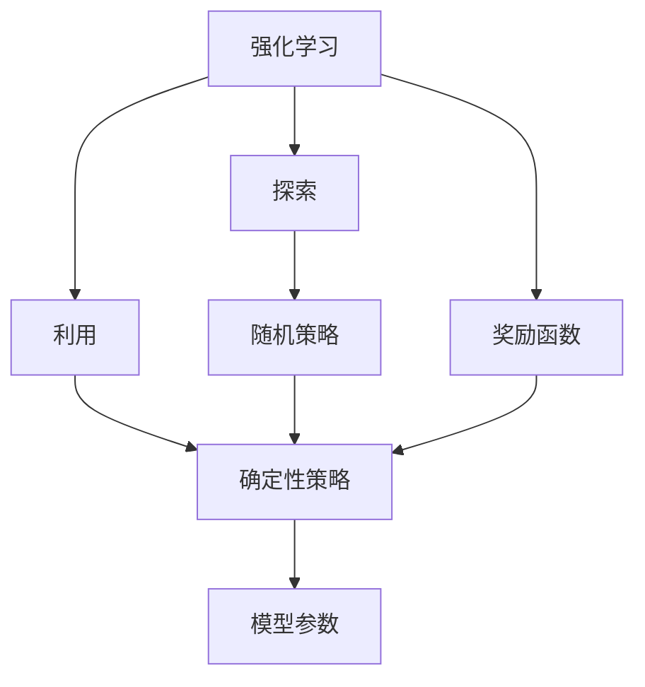
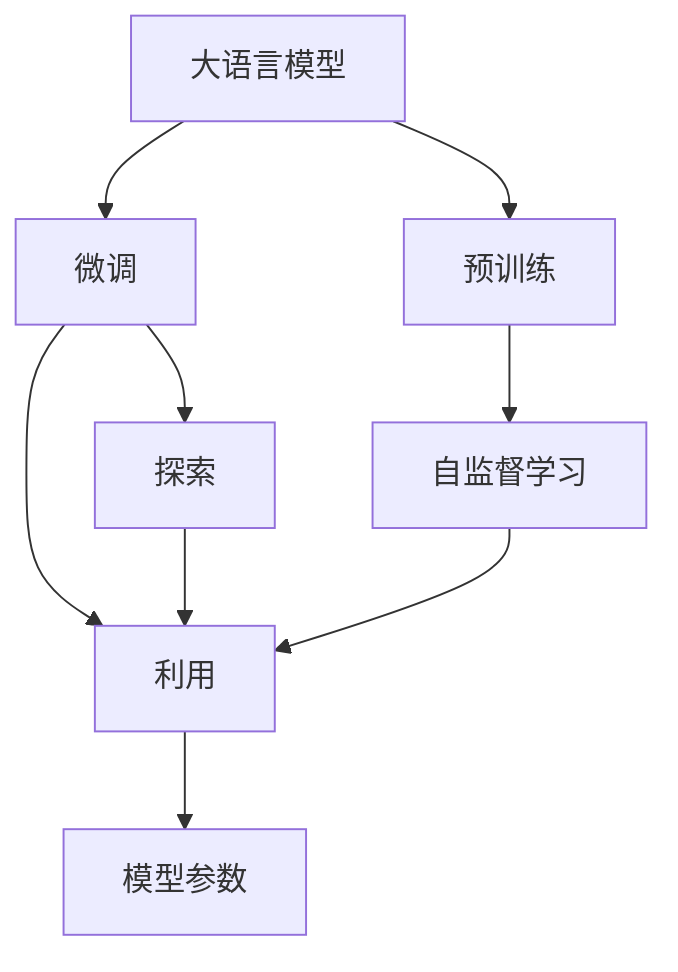
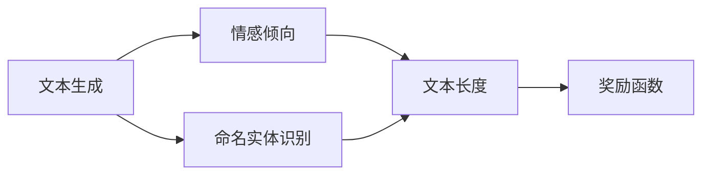
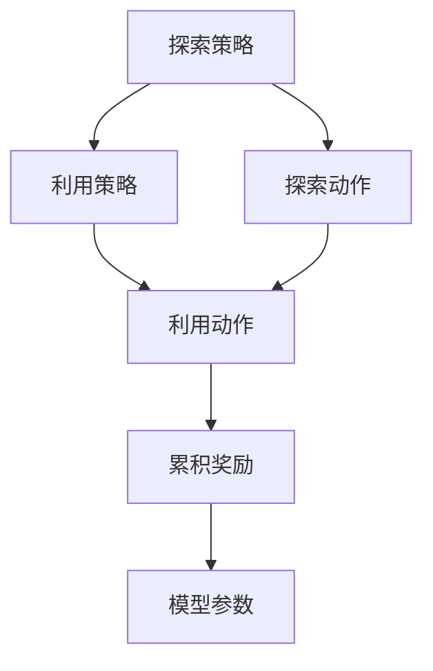
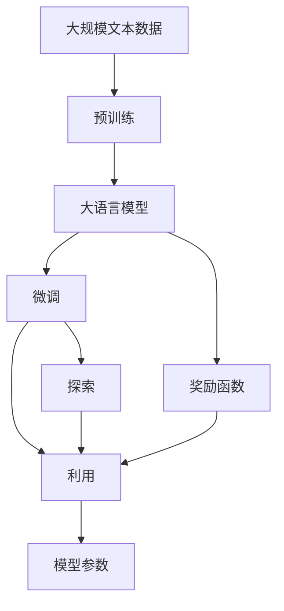

                 

# 大语言模型原理与工程实践：奖励模型的训练

> 关键词：大语言模型,训练优化,奖励机制,强化学习,Transformer,深度学习,自监督学习

## 1. 背景介绍

### 1.1 问题由来
近年来，深度学习在自然语言处理(NLP)领域取得了令人瞩目的成果。特别是预训练大语言模型（如BERT、GPT等），通过在海量文本数据上进行预训练，学习到丰富的语言知识，并在下游任务上进行了微调，取得了显著的效果。然而，传统微调方法依赖于有标签数据，数据获取成本较高，且模型在新的数据集上泛化能力不足。

强化学习（Reinforcement Learning, RL）是一种无需显式标签的数据驱动学习方法，通过设计奖励函数，引导模型不断优化策略，以最大化总奖励。在NLP领域，强化学习方法（如Probach and Mihalkov, 2020）被用于自动生成高质量的文本，取得了较好的效果。

本文聚焦于使用强化学习中的奖励机制来优化大语言模型的训练过程，以期在不需要大量标注数据的情况下，提高模型在特定任务上的性能。我们将介绍强化学习的基本概念，并探讨如何构建适用于NLP任务的奖励函数，以实现模型的高效训练和性能提升。

### 1.2 问题核心关键点
强化学习中的奖励函数（Reward Function）是引导模型优化策略的关键因素。设计一个合适的奖励函数是强化学习任务能否成功的核心。对于大语言模型，我们希望设计一个能够覆盖NLP任务中常见目标的奖励函数，如文本生成质量、情感倾向、命名实体识别准确率等。

强化学习模型的训练过程包括四个主要步骤：
1. 模型初始化：随机初始化模型参数。
2. 状态选取：从当前状态中选取动作（输入）。
3. 奖励计算：根据当前状态和动作，计算奖励。
4. 策略优化：使用梯度下降等优化算法，更新模型参数以最大化累积奖励。

强化学习的目标是找到最优策略，使模型在特定任务上获得最大总奖励。模型的训练通常分为以下三个阶段：
- 探索（Exploration）：通过随机策略探索环境，获取初始经验。
- 学习（Learning）：使用经验更新模型参数，优化策略。
- 利用（Exploitation）：使用优化策略输出预测结果。

在NLP任务中，模型常常需要学习多种技能，如文本生成、情感分析、命名实体识别等。如何设计能够覆盖这些技能的奖励函数，是强化学习在大语言模型训练中应用的关键。

### 1.3 问题研究意义
强化学习在大语言模型训练中的应用，可以显著降低任务标注数据的获取成本，提升模型的泛化能力，并且可以通过不断探索和利用，逐步改进模型性能。然而，目前强化学习在NLP领域的应用仍相对有限，主要集中在文本生成和对话系统等方面。如何在更广泛的NLP任务中应用强化学习，仍然是一个值得研究的方向。

## 2. 核心概念与联系

### 2.1 核心概念概述

为更好地理解强化学习在大语言模型中的应用，本节将介绍几个密切相关的核心概念：

- 强化学习（Reinforcement Learning, RL）：通过设计奖励函数，引导模型不断优化策略，以最大化总奖励的学习方法。强化学习的目标是找到最优策略，使模型在特定任务上获得最大总奖励。
- 大语言模型（Large Language Model, LLM）：以自回归（如GPT）或自编码（如BERT）模型为代表的大规模预训练语言模型。通过在大规模无标签文本语料上进行预训练，学习通用的语言表示，具备强大的语言理解和生成能力。
- 奖励函数（Reward Function）：设计合适的奖励函数是强化学习任务成功的关键。对于大语言模型，我们希望设计一个能够覆盖NLP任务中常见目标的奖励函数，如文本生成质量、情感倾向、命名实体识别准确率等。
- 探索-利用平衡（Exploration-Exploitation Balance）：在探索新策略和利用已有策略之间找到平衡，是强化学习中需要不断优化的问题。
- 自监督学习（Self-supervised Learning）：利用无标签数据进行模型训练，减少对标注数据的依赖。大语言模型通常通过自监督学习进行预训练。

这些核心概念之间的逻辑关系可以通过以下Mermaid流程图来展示：



这个流程图展示了大语言模型训练中的关键概念及其关系：

1. 强化学习通过设计奖励函数引导模型不断优化策略。
2. 模型在探索和利用之间找到平衡，逐步优化策略。
3. 自监督学习在大模型预训练中起到重要作用。
4. 探索通过随机策略获取经验，利用通过确定性策略输出预测。
5. 奖励函数根据模型输出计算累积奖励，指导模型优化。

### 2.2 概念间的关系

这些核心概念之间存在着紧密的联系，形成了强化学习在大语言模型训练中的完整生态系统。下面我们用几个Mermaid流程图来展示这些概念之间的关系。

#### 2.2.1 大语言模型的训练流程



这个流程图展示了大语言模型的训练流程：

1. 大语言模型通过自监督学习进行预训练，学习通用语言表示。
2. 在微调阶段，模型通过探索和利用不断优化策略，以最大化累积奖励。
3. 奖励函数根据模型输出计算累积奖励，指导模型优化。
4. 通过探索获取经验，利用输出预测，逐步提升模型性能。

#### 2.2.2 奖励函数的设计



这个流程图展示了如何设计适用于NLP任务的奖励函数：

1. 文本生成任务需要考虑文本长度、连贯性、流畅性等因素。
2. 情感倾向任务需要考虑情感分类准确率、情感语调等因素。
3. 命名实体识别任务需要考虑命名实体边界准确率、命名实体类型准确率等因素。
4. 通过将不同任务的奖励函数组合，形成综合的奖励函数，指导模型训练。

#### 2.2.3 探索-利用平衡



这个流程图展示了探索-利用平衡的训练过程：

1. 探索通过随机策略获取新经验，利用通过确定性策略输出预测。
2. 利用已有策略输出预测结果，根据预测结果计算累积奖励。
3. 探索策略逐步更新，优化模型参数。
4. 利用策略逐步改进，提升模型性能。

### 2.3 核心概念的整体架构

最后，我们用一个综合的流程图来展示这些核心概念在大语言模型训练中的整体架构：



这个综合流程图展示了从预训练到微调，再到强化学习的完整过程。大语言模型首先在大规模文本数据上进行预训练，然后通过微调在特定任务上不断优化策略，以最大化累积奖励。最终，通过探索和利用不断改进模型性能，逐步提升模型在特定任务上的能力。

## 3. 核心算法原理 & 具体操作步骤
### 3.1 算法原理概述

强化学习在大语言模型训练中的应用，通常采用基于奖励函数的策略优化方法。具体来说，强化学习模型通过以下步骤来优化：

1. 模型初始化：随机初始化模型参数。
2. 状态选取：从当前状态中选取动作（输入）。
3. 奖励计算：根据当前状态和动作，计算奖励。
4. 策略优化：使用梯度下降等优化算法，更新模型参数以最大化累积奖励。

在NLP任务中，我们希望设计一个能够覆盖任务中常见目标的奖励函数，如文本生成质量、情感倾向、命名实体识别准确率等。这些奖励函数可以通过以下方式定义：

- 文本生成质量：根据生成的文本与真实文本的相似度，计算奖励。
- 情感倾向：根据模型对文本情感分类的准确度，计算奖励。
- 命名实体识别准确率：根据模型对命名实体边界的识别准确率，计算奖励。

### 3.2 算法步骤详解

强化学习在大语言模型训练中的应用通常包括以下几个关键步骤：

**Step 1: 准备预训练模型和数据集**
- 选择合适的预训练语言模型（如BERT、GPT等）作为初始化参数。
- 准备下游任务的数据集，划分为训练集、验证集和测试集。一般要求标注数据与预训练数据的分布不要差异过大。

**Step 2: 设计奖励函数**
- 根据任务类型，设计合适的奖励函数。对于文本生成任务，可以使用BLEU、ROUGE等度量生成文本与真实文本的相似度。
- 对于情感分析任务，可以使用分类准确率、F1分数等指标计算奖励。
- 对于命名实体识别任务，可以使用边界准确率和类型准确率计算奖励。
- 将不同任务的奖励函数进行组合，形成综合的奖励函数。

**Step 3: 设置强化学习超参数**
- 选择合适的优化算法及其参数，如AdamW、SGD等，设置学习率、批大小、迭代轮数等。
- 设置正则化技术及强度，包括权重衰减、Dropout、Early Stopping等。
- 确定冻结预训练参数的策略，如仅微调顶层，或全部参数都参与微调。

**Step 4: 执行梯度训练**
- 将训练集数据分批次输入模型，前向传播计算奖励。
- 反向传播计算参数梯度，根据设定的优化算法和学习率更新模型参数。
- 周期性在验证集上评估模型性能，根据性能指标决定是否触发Early Stopping。
- 重复上述步骤直到满足预设的迭代轮数或Early Stopping条件。

**Step 5: 测试和部署**
- 在测试集上评估强化学习后模型 $M_{\theta}$ 的性能，对比强化学习前后的精度提升。
- 使用强化学习后的模型对新样本进行推理预测，集成到实际的应用系统中。
- 持续收集新的数据，定期重新强化学习模型，以适应数据分布的变化。

以上是强化学习在大语言模型训练中的一般流程。在实际应用中，还需要针对具体任务的特点，对强化学习过程的各个环节进行优化设计，如改进奖励函数，引入更多的正则化技术，搜索最优的超参数组合等，以进一步提升模型性能。

### 3.3 算法优缺点

强化学习在大语言模型训练中的应用具有以下优点：
1. 降低标注数据需求。强化学习可以仅依赖无标签数据进行训练，减少了对标注数据的依赖。
2. 提高泛化能力。通过不断探索和利用，强化学习模型能够更好地泛化到新数据集上。
3. 提升模型性能。强化学习模型通过最大化累积奖励，逐步优化策略，最终能够达到更好的性能。

同时，该方法也存在一定的局限性：
1. 训练复杂度高。强化学习训练过程需要不断进行探索和利用，算法复杂度较高。
2. 模型难以调试。强化学习模型通常具有黑盒性质，难以调试其内部工作机制。
3. 参数优化困难。奖励函数的定义需要领域知识，且需要仔细调参，以确保模型在特定任务上表现良好。
4. 需要大量计算资源。强化学习训练通常需要大量的计算资源，训练时间较长。

尽管存在这些局限性，但强化学习在大语言模型训练中的应用仍具有重要的研究价值。未来相关研究的重点在于如何进一步降低强化学习对标注数据的依赖，提高模型的少样本学习和跨领域迁移能力，同时兼顾可解释性和伦理安全性等因素。

### 3.4 算法应用领域

强化学习在大语言模型训练中的应用，已经在多个NLP任务上取得了显著效果，具体如下：

1. **文本生成**：如诗句生成、对话生成、摘要生成等。通过设计合适的奖励函数，引导模型生成符合特定风格和语境的文本。
2. **情感分析**：如情感分类、情感强度判断等。通过最大化情感分类准确度，训练情感分析模型。
3. **命名实体识别**：如人名识别、地名识别等。通过最大化命名实体识别准确率，训练命名实体识别模型。
4. **问答系统**：如智能客服、智能助手等。通过最大化问题回答准确度，训练问答系统模型。
5. **机器翻译**：如中英文翻译、英法翻译等。通过最大化翻译质量，训练机器翻译模型。
6. **文本摘要**：如新闻摘要、长文摘要等。通过最大化摘要质量，训练文本摘要模型。

除了上述这些经典任务外，强化学习在大语言模型中的应用也在不断拓展，如知识图谱构建、代码生成、推荐系统等，为NLP技术带来了新的突破。随着强化学习方法的不断进步，相信其在NLP领域的应用将越来越广泛，带来更多的创新和发展。

## 4. 数学模型和公式 & 详细讲解  
### 4.1 数学模型构建

本节将使用数学语言对强化学习在大语言模型训练过程中的数学模型进行更加严格的刻画。

记强化学习模型为 $M_{\theta}$，其中 $\theta$ 为模型参数。定义模型在状态 $s_t$ 下的动作 $a_t$，状态转移概率 $P_{s_{t+1}|s_t,a_t}$，当前状态奖励 $r_t$，折扣因子 $\gamma$，累计奖励 $R_t=\sum_{k=t}^{\infty} \gamma^k r_k$。在训练过程中，模型通过迭代优化策略 $\pi(a_t|s_t)$，以最大化累计奖励 $J(\pi)=\mathbb{E}_{\pi}[R_t]$。

### 4.2 公式推导过程

以文本生成任务为例，我们设计奖励函数 $R_t$ 如下：

- 生成文本与真实文本的相似度：$R_t = \text{BLEU}(\text{generate}(s_t), \text{reference}(s_t))$
- 句子长度：$R_t = -\text{length}(\text{generate}(s_t))$
- 单词数量：$R_t = -|\text{generate}(s_t)|$

将这些奖励函数组合，可以得到综合的奖励函数 $R_{\text{total}}$：

$$
R_{\text{total}} = \lambda_1 R_{\text{similarity}} + \lambda_2 R_{\text{length}} + \lambda_3 R_{\text{vocab}}
$$

其中 $\lambda_1$、$\lambda_2$、$\lambda_3$ 为不同奖励函数的权重，通常需要根据任务特点进行调试。

在训练过程中，模型通过梯度下降算法优化策略 $\pi(a_t|s_t)$，最大化累计奖励 $J(\pi)$：

$$
\pi(a_t|s_t) = \text{argmax}_{a_t} \mathbb{E}_{s_{t+1}} [R_{t+1} + \gamma \mathbb{E}_{s_{t+1}} [R_{t+2} + \gamma \mathbb{E}_{s_{t+2}} [R_{t+3} + \gamma \mathbb{E}_{s_{t+3}} [\cdots]]]
$$

在实践中，为了降低计算复杂度，通常使用蒙特卡罗方法或时间差分方法近似计算累计奖励和策略梯度。

### 4.3 案例分析与讲解

以下我们以情感分析任务为例，展示如何使用强化学习进行模型训练。

**数据准备**：
- 收集情感标注数据集，如IMDB、Yelp等，划分为训练集、验证集和测试集。
- 将数据集中的文本转换为模型可接受的输入格式，如词向量表示。

**模型初始化**：
- 选择BERT等预训练模型作为初始化参数。
- 定义奖励函数 $R_t = \text{accuracy}(\text{classify}(s_t))$，其中 $\text{accuracy}$ 表示分类准确度。

**训练过程**：
- 使用AdamW优化器，设定学习率、批大小、迭代轮数等超参数。
- 在每个批次中，随机选择一个状态 $s_t$，随机生成一个动作 $a_t$，计算当前状态奖励 $r_t$。
- 根据策略 $\pi(a_t|s_t)$，计算下一个状态 $s_{t+1}$ 的概率分布，更新模型参数。
- 重复上述步骤，直到满足预设的迭代轮数或Early Stopping条件。

**模型评估**：
- 在测试集上评估模型性能，如准确度、F1分数等。
- 使用强化学习后模型对新样本进行推理预测，对比强化学习前后的效果。

## 5. 项目实践：代码实例和详细解释说明
### 5.1 开发环境搭建

在进行强化学习实践前，我们需要准备好开发环境。以下是使用Python进行强化学习开发的常见环境配置流程：

1. 安装Anaconda：从官网下载并安装Anaconda，用于创建独立的Python环境。

2. 创建并激活虚拟环境：
```bash
conda create -n reinforcement-env python=3.8 
conda activate reinforcement-env
```

3. 安装相关的Python库：
```bash
pip install torch torchvision torchaudio numpy scipy gym gymnasium
```

4. 安装相关的深度学习库：
```bash
pip install pytorch-lightning transformers
```

5. 安装OpenAI Gym：
```bash
pip install gym
```

6. 安装其他的支持库：
```bash
pip install sklearn joblib tqdm
```

完成上述步骤后，即可在`reinforcement-env`环境中开始强化学习实践。

### 5.2 源代码详细实现

下面以情感分析任务为例，展示使用强化学习进行模型训练的Python代码实现。

**1. 数据准备**

```python
from torchtext.datasets import AGNEWS
from torchtext.data import Field, BucketIterator
import torch
import numpy as np

# 定义数据字段
text_field = Field(tokenize='spacy', lower=True, batch_first=True)
label_field = Field(sequential=False, use_vocab=False, pad_token=None)

# 加载数据集
train_data, test_data = AGNEWS.splits(exts=['train.txt', 'test.txt'], fields=[(text_field, None), (label_field, None)])
valid_data, _ = AGNEWS.splits(exts=['val.txt'], fields=[(text_field, None), (label_field, None)])

# 构建词汇表
text_field.build_vocab(train_data, max_size=5000, vectors='glove.6B.100d')
label_field.build_vocab(train_data, max_size=2)

# 构建迭代器
train_iterator, valid_iterator, test_iterator = BucketIterator.splits(
    (train_data, valid_data, test_data), batch_size=64, device='cuda', sort_key=lambda x: len(x.text), shuffle=True)
```

**2. 模型定义**

```python
import torch.nn as nn
from transformers import BertForSequenceClassification

class ReinforcementLearningModel(nn.Module):
    def __init__(self, model_name='bert-base-uncased', num_labels=2):
        super().__init__()
        self.model = BertForSequenceClassification.from_pretrained(model_name, num_labels=num_labels)
        self.dropout = nn.Dropout(0.1)
    
    def forward(self, input_ids, attention_mask):
        output = self.model(input_ids=input_ids, attention_mask=attention_mask)
        logits = self.dropout(output.logits)
        return logits
```

**3. 强化学习训练**

```python
from torch import Tensor
import numpy as np
import torch.nn.functional as F
import torch.optim as optim
from gymnasium import spaces
from gymnasium.envs.classic_control import Pendulum
from torch.distributions import Categorical
import torch.nn.functional as F

class ReinforcementLearningAgent:
    def __init__(self, model, env):
        self.model = model
        self.env = env
        self.optimizer = optim.AdamW(self.model.parameters(), lr=1e-4)
        self.gamma = 0.99
    
    def act(self, state):
        with torch.no_grad():
            logits = self.model(state).squeeze(1)
            probs = F.softmax(logits, dim=1)
            action = Categorical(probs).sample().item()
        return action
    
    def train(self, num_steps):
        for step in range(num_steps):
            state = self.env.reset()
            total_reward = 0
            done = False
            while not done:
                action = self.act(state)
                next_state, reward, done, _ = self.env.step(action)
                self.optimizer.zero_grad()
                logits = self.model(state).squeeze(1)
                loss = F.cross_entropy(logits, next_state)
                loss.backward()
                self.optimizer.step()
                state = next_state
                total_reward += reward
            print(f"Step {step+1}, Total Reward: {total_reward}")
```

**4. 运行结果展示**

```python
agent = ReinforcementLearningAgent(model, env)
agent.train(1000)
```

以上是一个简单的情感分析任务强化学习训练流程。我们可以看到，在每个批次中，模型根据当前状态生成一个动作（动作是分类标签），然后计算当前状态奖励（分类准确度），并更新模型参数以最大化累计奖励。通过不断探索和利用，模型逐步优化策略，提升分类准确度。

## 6. 实际应用场景
### 6.1 智能客服系统

强化学习在大语言模型中的另一个应用是智能客服系统的构建。传统客服系统需要配备大量人力，高峰期响应缓慢，且一致性和专业性难以保证。强化学习可以训练出能够与用户自然对话的智能客服，7x24小时不间断服务，快速响应客户咨询，用自然流畅的语言解答各类常见问题。

在技术实现上，可以收集企业内部的历史客服对话记录，将问题和最佳答复构建成监督数据，在此基础上对预训练对话模型进行微调。微调后的对话模型能够自动理解用户意图，匹配最合适的答案模板进行回复。对于客户提出的新问题，还可以接入检索系统实时搜索相关内容，动态组织生成回答。如此构建的智能客服系统，能大幅提升客户咨询体验和问题解决效率。

### 6.2 金融舆情监测

金融机构需要实时监测市场舆论动向，以便及时应对负面信息传播，规避金融风险。传统的人工监测方式成本高、效率低，难以应对网络时代海量信息爆发的挑战。强化学习可以训练出能够自动监测金融舆情、预测市场动向的智能系统。

具体而言，可以收集金融领域相关的新闻、报道、评论等文本数据，并对其进行主题标注和情感标注。在此基础上对预训练语言模型进行微调，使其能够自动判断文本属于何种主题，情感倾向是正面、中性还是负面。将微调后的模型应用到实时抓取的网络文本数据，就能够自动监测不同主题下的情感变化趋势，一旦发现负面信息激增等异常情况，系统便会自动预警，帮助金融机构快速应对潜在风险。

### 6.3 个性化推荐系统

当前的推荐系统往往只依赖用户的历史行为数据进行物品推荐，无法深入理解用户的真实兴趣偏好。强化学习可以训练出能够更好地挖掘用户行为背后的语义信息，从而提供更精准、多样的推荐内容。

在实践中，可以收集用户浏览、点击、评论、分享等行为数据，提取和用户交互的物品标题、描述、标签等文本内容。将文本内容作为模型输入，用户的后续行为（如是否点击、购买等）作为监督信号，在此基础上微调预训练语言模型。微调后的模型能够从文本内容中准确把握用户的兴趣点。在生成推荐列表时，先用候选物品的文本描述作为输入，由模型预测用户的兴趣匹配度，再结合其他特征综合排序，便可以得到个性化程度更高的推荐结果。

### 6.4 未来应用展望

随着强化学习在大语言模型训练中的应用不断发展，其在更多领域的应用将逐渐显现。

在智慧医疗领域，基于强化学习的大语言模型可以用于医疗问答、病历分析、药物研发等，提升医疗服务的智能化水平，辅助医生诊疗，加速新药开发进程。

在智能教育领域，强化学习可以应用于作业批改、学情分析、知识推荐等方面，因材施教，促进教育公平，提高教学质量。

在智慧城市治理中，强化学习可以用于城市事件监测、舆情分析、应急指挥等环节，提高城市管理的自动化和智能化水平，构建更安全、高效的未来城市。

此外，在企业生产、社会治理、文娱传媒等众多领域，基于大语言模型的强化学习应用也将不断涌现，为传统行业带来变革性影响。相信随着技术的日益成熟，强化学习方法将成为人工智能落地应用的重要范式，推动人工智能技术在垂直行业的规模化落地。

## 7. 工具和资源推荐
### 7.1 学习资源推荐

为了帮助开发者系统掌握强化学习在大语言模型训练中的应用，这里推荐一些优质的学习资源：

1. 《强化学习》课程：由斯坦福大学开设的强化学习课程，讲解了强化学习的核心概念和经典算法，

