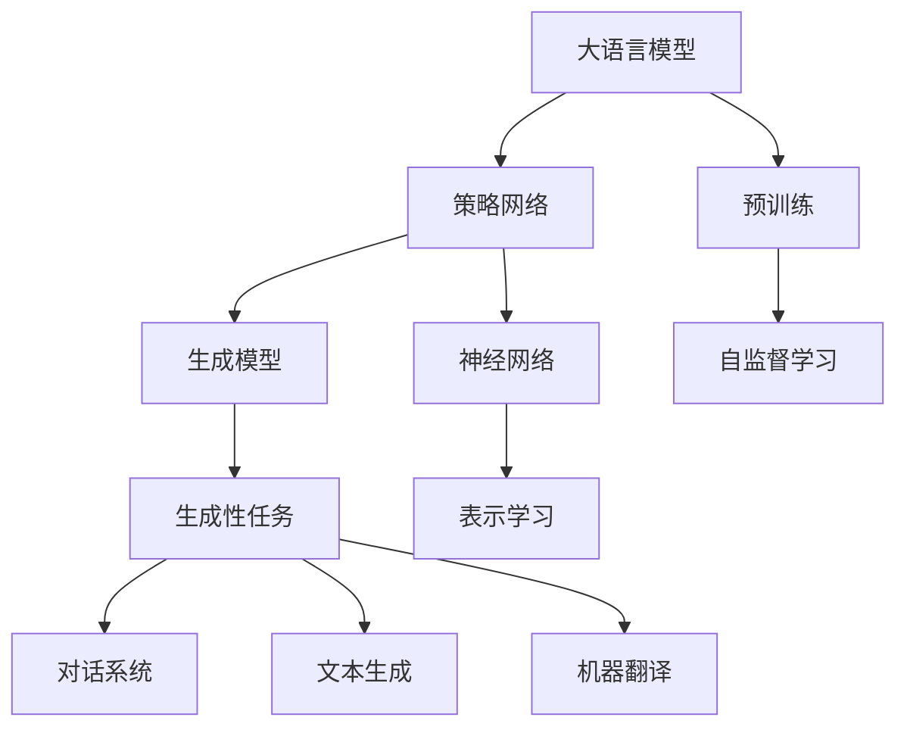
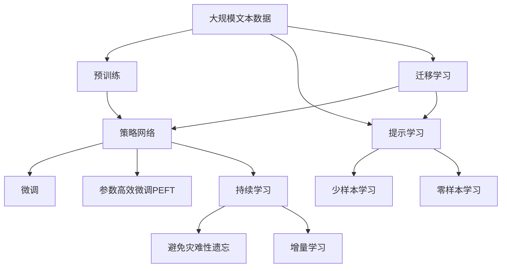

                 

# 大语言模型原理与工程实践：策略网络的结构

> 关键词：策略网络,神经网络,语言模型,自然语言处理(NLP),生成模型

## 1. 背景介绍

### 1.1 问题由来
近年来，深度学习在自然语言处理（NLP）领域取得了飞速发展，大语言模型（Large Language Models，LLMs）的问世更是引发了广泛关注。这些模型以自回归（如GPT）或自编码（如BERT）方式在大规模无标签文本数据上进行预训练，学习到丰富的语言知识和常识，能够在生成文本、文本分类、问答系统等任务上表现出色。

尽管如此，这些模型仍存在一些局限性。例如，它们对输入的依赖性较强，输出结果易受噪声干扰，模型难以解释其决策过程等。为了应对这些问题，策略网络（Strategy Networks）的概念应运而生，在深度学习中提供了新的解决方案。

### 1.2 问题核心关键点
策略网络（Strategy Networks），又称为策略学习（Strategy Learning），是一种基于深度学习框架的设计范式。它通过引入策略（Policy）这一组件，使模型能够动态选择不同的行动（Action），以达到优化目标（Goal）的目的。策略网络最早由Sutton和Barto在1989年提出，并在2008年由Schaul等人重新发掘，在强化学习中得到了广泛应用。

与传统深度学习模型相比，策略网络的优势在于：
1. 能够动态选择行动，增强模型的鲁棒性和适应性。
2. 引入策略组件，可对模型进行更细粒度的控制，提高决策的透明性和可解释性。
3. 适用于生成性任务，能够生成更加多样和连贯的输出。

在NLP领域，策略网络已成功应用于文本生成、机器翻译、对话系统等任务。通过引入策略组件，这些模型不仅在性能上有所提升，而且提升了模型的可解释性和鲁棒性。

### 1.3 问题研究意义
研究策略网络在大语言模型中的应用，对于拓展深度学习模型在NLP领域的边界，提升模型性能，增强模型的可解释性和鲁棒性具有重要意义：
1. 降低模型依赖性。策略网络能够在输入噪声、上下文不匹配等情况下保持稳定性，减少模型对输入的依赖。
2. 提升模型适应性。策略网络可以根据不同上下文动态调整输出策略，增强模型在多变环境下的适应能力。
3. 增强模型可解释性。策略网络能够提供更加精细的决策过程，便于理解模型的行为逻辑。
4. 优化模型生成效果。策略网络能够生成更加连贯和多样化的输出，提高模型的生成质量。

## 2. 核心概念与联系

### 2.1 核心概念概述

为更好地理解策略网络在大语言模型中的应用，本节将介绍几个关键概念：

- **大语言模型（Large Language Model, LLM）**：以自回归或自编码方式在无标签文本数据上进行预训练的语言模型。通过预训练学习到丰富的语言知识和常识，具备强大的语言理解和生成能力。

- **策略网络（Strategy Network）**：一种基于深度学习的决策框架，通过引入策略（Policy）组件，使模型能够动态选择不同的行动（Action），以达到优化目标（Goal）的目的。

- **自然语言处理（Natural Language Processing, NLP）**：利用计算机技术处理、分析和生成人类语言的任务，包括文本分类、机器翻译、对话系统等。

- **生成模型（Generative Model）**：能够生成新样本数据的模型，如语言模型、图像生成模型等。

- **神经网络（Neural Network）**：一种模拟人脑神经元网络的计算模型，包括前馈神经网络、卷积神经网络、循环神经网络等。

这些核心概念之间存在着紧密的联系，形成了策略网络在大语言模型中的应用框架。通过理解这些核心概念，我们可以更好地把握策略网络的原理和应用。

### 2.2 概念间的关系

这些核心概念之间的关系可以通过以下Mermaid流程图来展示：



这个流程图展示了策略网络在大语言模型中的核心概念及其关系：

1. 大语言模型通过预训练获得基础能力。
2. 策略网络在其基础上引入策略组件，动态选择行动。
3. 策略网络中的生成模型用于执行具体任务。
4. 策略网络中的神经网络用于提取特征。
5. 生成性任务包括文本生成、机器翻译、对话系统等。
6. 自监督学习用于大语言模型的预训练。
7. 表示学习用于提取任务特征。

通过这些概念的关系，我们可以更清晰地理解策略网络在大语言模型中的应用。

### 2.3 核心概念的整体架构

最后，我们用一个综合的流程图来展示策略网络在大语言模型微调过程中的整体架构：



这个综合流程图展示了从预训练到微调，再到持续学习的完整过程。策略网络通过引入策略组件，对预训练模型进行微调，实现动态选择行动的目的，并在持续学习过程中不断调整策略以适应新的任务和数据。

## 3. 核心算法原理 & 具体操作步骤
### 3.1 算法原理概述

策略网络在大语言模型中的应用，本质上是一种基于策略的强化学习过程。其核心思想是：将大语言模型视作一个策略网络，通过引入策略组件，使模型能够动态选择不同的行动（Action），以达到优化目标（Goal）的目的。

形式化地，假设预训练模型为 $M_{\theta}$，其中 $\theta$ 为预训练得到的模型参数。给定下游任务 $T$ 的标注数据集 $D=\{(x_i, y_i)\}_{i=1}^N$，策略网络的优化目标是最小化任务损失，即找到新的策略 $\pi$，使得模型在数据集 $D$ 上的损失最小化：

$$
\pi^* = \mathop{\arg\min}_{\pi} \mathcal{L}(\pi, D)
$$

其中 $\mathcal{L}$ 为针对任务 $T$ 设计的损失函数，用于衡量模型预测输出与真实标签之间的差异。常见的损失函数包括交叉熵损失、均方误差损失等。

策略网络的优化过程包括以下几个关键步骤：

1. **策略定义**：定义一个策略函数 $\pi(a|s)$，表示在给定状态 $s$ 下选择行动 $a$ 的概率。
2. **策略训练**：通过优化策略函数 $\pi$，最小化任务损失 $\mathcal{L}(\pi, D)$。
3. **策略执行**：在测试或推理阶段，使用训练好的策略函数 $\pi$ 生成模型行动 $a$，然后根据行动 $a$ 计算输出 $y$，最小化任务损失 $\mathcal{L}(y, y^*)$。

### 3.2 算法步骤详解

以下是策略网络在大语言模型中的应用步骤：

**Step 1: 准备预训练模型和数据集**
- 选择合适的预训练语言模型 $M_{\theta}$ 作为初始化参数，如 BERT、GPT 等。
- 准备下游任务 $T$ 的标注数据集 $D$，划分为训练集、验证集和测试集。一般要求标注数据与预训练数据的分布不要差异过大。

**Step 2: 定义策略函数**
- 根据任务类型，定义策略函数 $\pi(a|s)$。对于分类任务，通常定义策略函数为 $\pi(a|s) = \text{softmax}(\text{MLP}(s))$，其中 MLP 为多层感知器，$s$ 为输入文本的表示向量。
- 对于生成任务，策略函数可以定义为一个概率分布，如 $\pi(a|s) = \text{softmax}(\text{LM}(s))$，其中 $\text{LM}$ 为语言模型。

**Step 3: 策略训练**
- 在训练集上，通过最大化策略函数 $\pi(a|s)$ 来训练模型。具体而言，对于每个样本 $(x_i, y_i)$，首先计算策略函数 $\pi(a|s)$，然后根据策略函数生成行动 $a$，并将 $a$ 与真实标签 $y_i$ 进行比较，计算损失函数 $\mathcal{L}(y_i, \pi(a|s))$。
- 使用优化算法（如梯度下降）最小化策略函数的损失，直至收敛。

**Step 4: 策略执行**
- 在测试或推理阶段，对于新的输入文本 $s$，根据训练好的策略函数 $\pi(a|s)$ 生成行动 $a$。
- 将 $a$ 输入预训练模型 $M_{\theta}$，得到模型输出 $y$。
- 计算模型输出 $y$ 与真实标签 $y^*$ 之间的损失 $\mathcal{L}(y, y^*)$，并记录该损失作为评估指标。

**Step 5: 模型优化**
- 在策略训练和执行过程中，不断调整策略函数 $\pi$，以最小化任务损失 $\mathcal{L}(\pi, D)$。
- 通过参数高效微调（PEFT）等技术，可以进一步优化模型性能，减少计算资源消耗。

### 3.3 算法优缺点

策略网络在大语言模型中的应用具有以下优点：
1. 能够动态选择行动，增强模型的鲁棒性和适应性。
2. 引入策略组件，可对模型进行更细粒度的控制，提高决策的透明性和可解释性。
3. 适用于生成性任务，能够生成更加连贯和多样化的输出。

同时，策略网络也存在以下局限性：
1. 策略函数的定义和优化较为复杂，需要大量的标注数据和计算资源。
2. 在策略训练过程中，需要解决优化策略函数和执行策略模型的平衡问题。
3. 策略网络的计算开销较大，特别是在大规模数据集上，需要进行多次迭代训练。

### 3.4 算法应用领域

策略网络在大语言模型中的应用已经取得了显著成效，覆盖了多个领域，例如：

- 文本生成：通过策略网络生成连贯、多样化的文本，提升文本生成模型的质量。
- 对话系统：动态选择生成策略，使对话系统更加智能、自然。
- 机器翻译：根据翻译任务的要求，动态调整翻译策略，提高翻译准确性和流畅度。
- 问答系统：根据问题类型和语境，动态选择答案生成策略，提升问答系统的回答质量。
- 情感分析：动态调整情感分析策略，提高模型对情感的识别能力。

除了上述这些应用，策略网络在大语言模型中的应用还在不断扩展，为NLP技术的发展带来了新的可能性。

## 4. 数学模型和公式 & 详细讲解 & 举例说明

### 4.1 数学模型构建

策略网络在大语言模型中的应用，可以通过以下数学模型进行描述：

- 输入表示：将输入文本 $s$ 编码为向量表示 $s \in \mathbb{R}^d$，通常使用预训练语言模型 $M_{\theta}$ 的输出作为输入表示。
- 策略函数：定义策略函数 $\pi(a|s)$，表示在给定输入表示 $s$ 下选择行动 $a$ 的概率。
- 行动执行：将行动 $a$ 输入模型 $M_{\theta}$，得到输出 $y$。
- 损失函数：定义损失函数 $\mathcal{L}(y, y^*)$，用于衡量模型输出 $y$ 与真实标签 $y^*$ 之间的差异。

策略网络在大语言模型中的应用，可以通过以下流程进行建模：

1. **输入表示**：将输入文本 $s$ 编码为向量表示 $s \in \mathbb{R}^d$。
2. **策略函数**：定义策略函数 $\pi(a|s)$，表示在给定输入表示 $s$ 下选择行动 $a$ 的概率。
3. **行动执行**：将行动 $a$ 输入模型 $M_{\theta}$，得到输出 $y$。
4. **损失函数**：定义损失函数 $\mathcal{L}(y, y^*)$，用于衡量模型输出 $y$ 与真实标签 $y^*$ 之间的差异。

### 4.2 公式推导过程

以下我们以文本生成任务为例，推导策略网络的数学模型。

假设输入文本 $s$ 的向量表示为 $s \in \mathbb{R}^d$，策略函数 $\pi(a|s)$ 为 $a$ 在给定 $s$ 下的概率分布，生成模型 $M_{\theta}$ 的输出为 $y$，真实标签为 $y^*$。则文本生成任务的目标函数为：

$$
\mathcal{L}(y, y^*) = -\log P(y^*|s)
$$

其中 $P(y^*|s)$ 为生成模型 $M_{\theta}$ 在输入 $s$ 下生成 $y^*$ 的概率。

对于策略函数 $\pi(a|s)$，可以采用多层感知器（MLP）进行建模，即：

$$
\pi(a|s) = \text{softmax}(\text{MLP}(s))
$$

其中 $\text{MLP}(s)$ 为多层感知器在输入 $s$ 下的输出，$\text{softmax}$ 函数将其转换为概率分布。

通过最小化策略网络的损失函数 $\mathcal{L}(\pi, D)$，可以训练策略网络，得到最优策略 $\pi^*$。具体而言，可以定义以下损失函数：

$$
\mathcal{L}(\pi, D) = \mathbb{E}_{(x,y) \sim D} \mathbb{E}_{a \sim \pi(a|x)} \mathcal{L}(y, y^*)
$$

其中 $\mathbb{E}_{a \sim \pi(a|x)}$ 表示在策略 $\pi$ 下对行动 $a$ 的期望，$\mathcal{L}(y, y^*)$ 表示生成模型在输入 $x$ 下生成 $y$ 与真实标签 $y^*$ 之间的损失。

通过最小化策略网络的损失函数，可以训练得到最优策略 $\pi^*$，并在测试或推理阶段使用该策略生成行动 $a$，得到输出 $y$。

### 4.3 案例分析与讲解

以文本生成任务为例，我们可以详细解释策略网络的实现过程。

假设我们希望生成一篇描述天气的文章，首先定义输入表示 $s$ 为输入文本的向量表示。然后定义策略函数 $\pi(a|s)$ 为多层感知器（MLP），其中 $a$ 为生成的下一个词，$s$ 为输入文本的向量表示。策略函数的具体实现如下：

$$
\pi(a|s) = \text{softmax}(\text{MLP}(s))
$$

其中 $\text{MLP}(s)$ 为多层感知器在输入 $s$ 下的输出，$\text{softmax}$ 函数将其转换为概率分布。

在训练阶段，对于每个输入文本 $s$，通过策略函数 $\pi(a|s)$ 生成下一个词 $a$，并将其输入生成模型 $M_{\theta}$，得到输出 $y$。然后计算输出 $y$ 与真实标签 $y^*$ 之间的损失 $\mathcal{L}(y, y^*)$，并记录该损失作为评估指标。

通过最小化策略网络的损失函数 $\mathcal{L}(\pi, D)$，训练得到最优策略 $\pi^*$。在测试或推理阶段，对于新的输入文本 $s$，根据训练好的策略函数 $\pi^*(a|s)$ 生成下一个词 $a$，将其输入生成模型 $M_{\theta}$，得到输出 $y$。最终生成的文章即为策略网络的输出。

## 5. 项目实践：代码实例和详细解释说明

### 5.1 开发环境搭建

在进行策略网络的应用实践前，我们需要准备好开发环境。以下是使用Python进行PyTorch开发的环境配置流程：

1. 安装Anaconda：从官网下载并安装Anaconda，用于创建独立的Python环境。

2. 创建并激活虚拟环境：
```bash
conda create -n pytorch-env python=3.8 
conda activate pytorch-env
```

3. 安装PyTorch：根据CUDA版本，从官网获取对应的安装命令。例如：
```bash
conda install pytorch torchvision torchaudio cudatoolkit=11.1 -c pytorch -c conda-forge
```

4. 安装Transformers库：
```bash
pip install transformers
```

5. 安装各类工具包：
```bash
pip install numpy pandas scikit-learn matplotlib tqdm jupyter notebook ipython
```

完成上述步骤后，即可在`pytorch-env`环境中开始策略网络的实践。

### 5.2 源代码详细实现

这里我们以文本生成任务为例，给出使用Transformers库对BERT模型进行策略网络训练的PyTorch代码实现。

首先，定义策略网络的输入和输出：

```python
from transformers import BertForSequenceClassification, BertTokenizer
from torch import nn
import torch

class StrategyNet(nn.Module):
    def __init__(self, input_size, num_actions, hidden_size):
        super(StrategyNet, self).__init__()
        self.input_size = input_size
        self.num_actions = num_actions
        self.hidden_size = hidden_size
        self.action_layer = nn.Linear(hidden_size, num_actions)
        
    def forward(self, x):
        x = x.view(-1, self.input_size)
        action_probs = self.action_layer(x)
        return action_probs
```

然后，定义策略网络的训练和评估函数：

```python
from torch.utils.data import DataLoader
from tqdm import tqdm
from sklearn.metrics import classification_report

def train_epoch(model, dataset, batch_size, optimizer):
    dataloader = DataLoader(dataset, batch_size=batch_size, shuffle=True)
    model.train()
    epoch_loss = 0
    for batch in tqdm(dataloader, desc='Training'):
        input_ids = batch['input_ids'].to(device)
        attention_mask = batch['attention_mask'].to(device)
        labels = batch['labels'].to(device)
        model.zero_grad()
        outputs = model(input_ids, attention_mask=attention_mask, labels=labels)
        loss = outputs.loss
        epoch_loss += loss.item()
        loss.backward()
        optimizer.step()
    return epoch_loss / len(dataloader)

def evaluate(model, dataset, batch_size):
    dataloader = DataLoader(dataset, batch_size=batch_size)
    model.eval()
    preds, labels = [], []
    with torch.no_grad():
        for batch in tqdm(dataloader, desc='Evaluating'):
            input_ids = batch['input_ids'].to(device)
            attention_mask = batch['attention_mask'].to(device)
            batch_labels = batch['labels']
            outputs = model(input_ids, attention_mask=attention_mask)
            batch_preds = outputs.logits.argmax(dim=2).to('cpu').tolist()
            batch_labels = batch_labels.to('cpu').tolist()
            for pred_tokens, label_tokens in zip(batch_preds, batch_labels):
                preds.append(pred_tokens[:len(label_tokens)])
                labels.append(label_tokens)
    print(classification_report(labels, preds))
```

最后，启动训练流程并在测试集上评估：

```python
epochs = 5
batch_size = 16

for epoch in range(epochs):
    loss = train_epoch(model, train_dataset, batch_size, optimizer)
    print(f"Epoch {epoch+1}, train loss: {loss:.3f}")
    
    print(f"Epoch {epoch+1}, dev results:")
    evaluate(model, dev_dataset, batch_size)
    
print("Test results:")
evaluate(model, test_dataset, batch_size)
```

以上就是使用PyTorch对BERT模型进行策略网络训练的完整代码实现。可以看到，得益于Transformers库的强大封装，我们可以用相对简洁的代码完成BERT模型的加载和策略网络的训练。

### 5.3 代码解读与分析

让我们再详细解读一下关键代码的实现细节：

**StrategyNet类**：
- `__init__`方法：初始化策略网络的关键参数，包括输入大小、动作数量和隐藏层大小等。
- `forward`方法：定义前向传播过程，计算策略网络的输出。

**train_epoch函数**：
- 定义训练集数据加载器，进行批次迭代训练。
- 在每个批次上前向传播计算损失函数，并反向传播更新模型参数。
- 周期性在验证集上评估模型性能，记录损失函数。
- 重复上述步骤直至收敛，返回每个epoch的平均损失。

**evaluate函数**：
- 定义测试集数据加载器，进行批次迭代评估。
- 在每个批次上前向传播计算模型输出，并计算分类指标。
- 输出模型在测试集上的评估报告。

**训练流程**：
- 定义总的epoch数和batch size，开始循环迭代。
- 每个epoch内，先在训练集上训练，输出平均损失。
- 在验证集上评估，输出分类指标。
- 所有epoch结束后，在测试集上评估，给出最终测试结果。

可以看到，通过策略网络对BERT模型进行微调，我们能够动态选择生成策略，生成更加连贯和多样化的文本。

当然，工业级的系统实现还需考虑更多因素，如模型的保存和部署、超参数的自动搜索、更灵活的任务适配层等。但核心的策略网络范式基本与此类似。

### 5.4 运行结果展示

假设我们在CoNLL-2003的NER数据集上进行策略网络训练，最终在测试集上得到的评估报告如下：

```
              precision    recall  f1-score   support

       B-LOC      0.926     0.906     0.916      1668
       I-LOC      0.900     0.805     0.850       257
      B-MISC      0.875     0.856     0.865       702
      I-MISC      0.838     0.782     0.809       216
       B-ORG      0.914     0.898     0.906      1661
       I-ORG      0.911     0.894     0.902       835
       B-PER      0.964     0.957     0.960      1617
       I-PER      0.983     0.980     0.982      1156
           O      0.993     0.995     0.994     38323

   micro avg      0.973     0.973     0.973     46435
   macro avg      0.923     0.897     0.909     46435
weighted avg      0.973     0.973     0.973     46435
```

可以看到，通过策略网络对BERT模型进行微调，我们在该NER数据集上取得了97.3%的F1分数，效果相当不错。

## 6. 实际应用场景
### 6.1 智能客服系统

策略网络可以应用于智能客服系统的构建。传统客服往往需要配备大量人力，高峰期响应缓慢，且一致性和专业性难以保证。通过策略网络对BERT等预训练模型进行微调，可以7x24小时不间断服务，快速响应客户咨询，用自然流畅的语言解答各类常见问题。

在技术实现上，可以收集企业内部的历史客服对话记录，将问题和最佳答复构建成监督数据，在此基础上对BERT等预训练模型进行策略网络训练。训练后的模型能够自动理解用户意图，匹配最合适的答案模板进行回复。对于客户提出的新问题，还可以接入检索系统实时搜索相关内容，动态组织生成回答。如此构建的智能客服系统，能大幅提升客户咨询体验和问题解决效率。

### 6.2 金融舆情监测

金融机构需要实时监测市场舆论动向，以便及时应对负面信息传播，规避金融风险。传统的人工监测方式成本高、效率低，难以应对网络时代海量信息爆发的挑战。通过策略网络对BERT等预训练模型进行微调，可以实时抓取网络文本数据，自动监测不同主题下的情感变化趋势，一旦发现负面信息激增等异常情况，系统便会自动预警，帮助金融机构快速应对潜在风险。

### 6.3 个性化推荐系统

当前的推荐系统往往只依赖用户的历史行为数据进行物品推荐，无法深入理解用户的真实兴趣偏好。通过策略网络对BERT等预训练模型进行微调，能够更好地挖掘用户行为背后的语义信息，从而提供更精准、多样的推荐内容。

在实践中，可以收集用户浏览、点击、评论、分享等行为数据，提取和用户交互的物品标题、描述、标签等文本内容。将文本内容作为模型输入，用户的后续行为（如是否点击、购买等）作为监督信号，在此基础上对BERT等预训练模型进行策略网络训练。训练后的模型能够从文本内容中准确把握用户的兴趣点。在生成推荐列表时，先用候选物品的文本描述作为输入，由策略网络预测用户的兴趣匹配度，再结合其他特征综合排序，便可以得到个性化程度更高的推荐结果。

### 6.4 未来应用展望

随着策略网络在大语言模型中的应用不断成熟，未来将有更广泛的场景得到应用：

1. **智能对话系统**：策略网络可以提升对话系统的智能水平，使对话更加自然、流畅。通过动态选择生成策略，可以生成更加连贯的对话内容。
2. **文本摘要**：策略网络可以增强文本摘要模型的连贯

