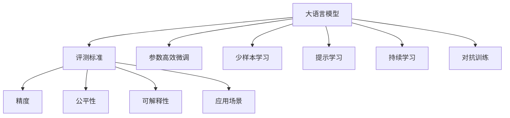
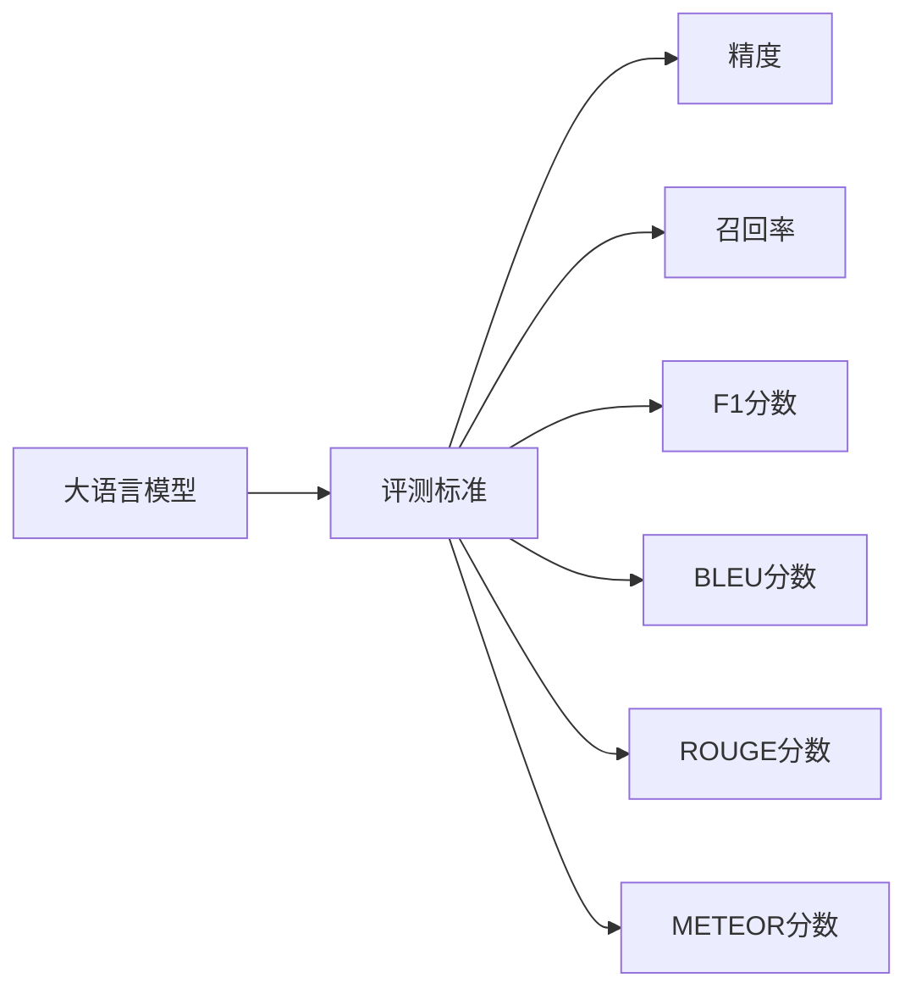
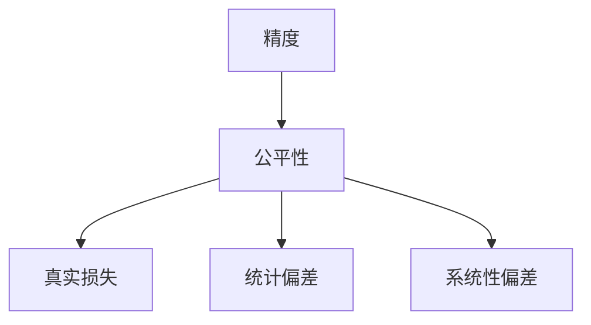
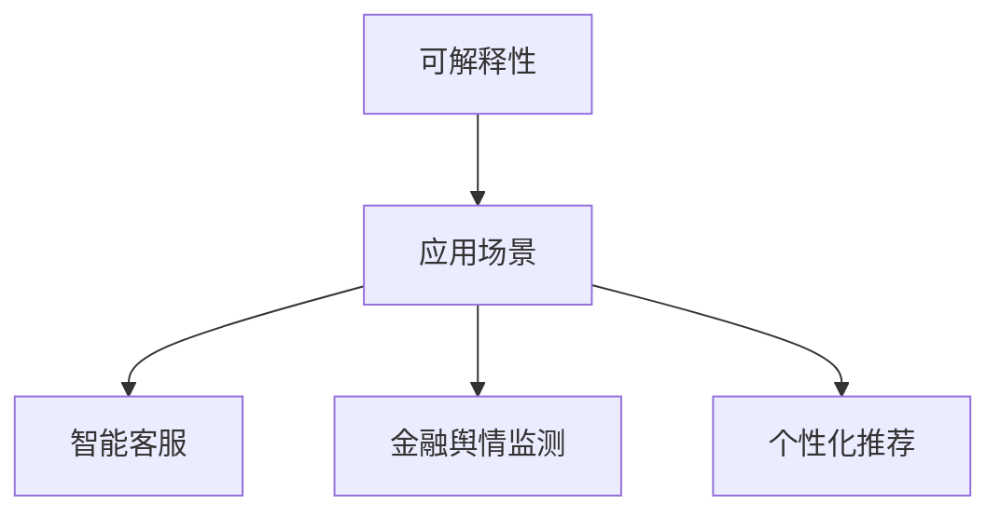
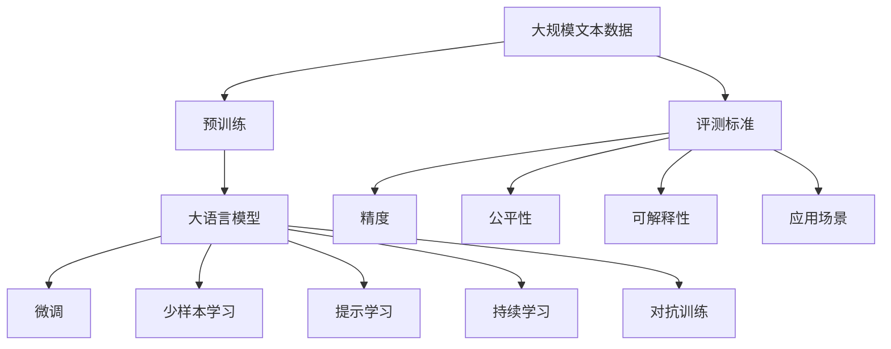

                 

# 大语言模型原理与工程实践：评测方式和标准

> 关键词：大语言模型,评测方式,评测标准,自然语言处理(NLP),精度,公平性,可解释性,应用场景

## 1. 背景介绍

### 1.1 问题由来
近年来，人工智能领域迎来了前所未有的发展，尤其是自然语言处理（NLP）领域的大语言模型（Large Language Models, LLMs）。这些模型通过在大量无标签数据上进行预训练，学习到了丰富的语言知识和常识，能够在大规模文本上实现零样本或少样本的生成、分类和翻译等任务。然而，随着大规模模型的广泛应用，对于这些模型的评测标准和方式也逐渐成为热点话题。

### 1.2 问题核心关键点
大语言模型的评测标准和方式，对于确保其性能、公平性和可解释性至关重要。当前，学术界和工业界正努力探索更科学、更全面的评测标准和方式。这些标准的设定，不仅有助于评估模型的实际效果，也推动了模型设计的多样化和规范化。

### 1.3 问题研究意义
研究大语言模型的评测方式和标准，对于模型设计、应用部署以及学术交流都有着重要意义：

1. **模型选择**：规范的评测标准能帮助开发者更准确地选择最适合自己应用场景的模型。
2. **性能评估**：标准化的评测方式能公平、准确地衡量模型在不同任务上的表现，促进模型优化的提升。
3. **公平性保障**：完善的评测标准能确保模型在不同群体、数据集上的表现公平，避免偏见和歧视。
4. **可解释性提升**：标准化的评测有助于模型设计者理解和分析模型的决策过程，提升模型的可解释性。
5. **应用推广**：科学合理的评测方式有助于加速模型在各行各业的应用落地。

## 2. 核心概念与联系

### 2.1 核心概念概述

为更好地理解大语言模型的评测方式和标准，本节将介绍几个关键概念：

- **大语言模型(Large Language Models, LLMs)**：以自回归或自编码模型为代表的大规模预训练语言模型，具备强大的语言理解和生成能力。
- **评测标准**：衡量模型性能的定量或定性指标，如精度、召回率、F1分数、BLEU分数等。
- **公平性评估**：评估模型在不同群体或数据集上的表现是否公平，避免偏见和歧视。
- **可解释性**：模型输出的解释能力，即模型为什么做出了某个决策。
- **应用场景**：模型在不同场景下的实际应用效果，如智能客服、金融舆情监测、个性化推荐等。

这些概念之间的逻辑关系可以通过以下Mermaid流程图来展示：



这个流程图展示了大语言模型的核心概念及其与评测标准之间的联系：

1. 大语言模型通过预训练获得基础能力。
2. 评测标准用于衡量模型的实际效果。
3. 精度、公平性、可解释性、应用场景等都是评测标准的具体体现。
4. 通过参数高效微调、少样本学习、提示学习、持续学习和对抗训练等技术，提升模型在不同场景下的表现。

### 2.2 概念间的关系

这些核心概念之间存在着紧密的联系，形成了大语言模型的评测标准和方式的完整生态系统。下面我通过几个Mermaid流程图来展示这些概念之间的关系。

#### 2.2.1 大语言模型的评测标准



这个流程图展示了常见的大语言模型评测标准。

#### 2.2.2 精度与公平性的关系



这个流程图展示了精度与公平性之间的关系。

#### 2.2.3 可解释性与应用场景



这个流程图展示了可解释性与不同应用场景之间的关系。

### 2.3 核心概念的整体架构

最后，我们用一个综合的流程图来展示这些核心概念在大语言模型评测标准中的整体架构：



这个综合流程图展示了从预训练到评测标准的完整过程。大语言模型首先在大规模文本数据上进行预训练，然后通过微调、少样本学习、提示学习、持续学习和对抗训练等技术提升性能，最终使用评测标准衡量其效果。

## 3. 核心算法原理 & 具体操作步骤
### 3.1 算法原理概述

大语言模型的评测标准和方式，主要基于以下原理：

- **精度（Precision）**：模型正确预测为正例的样本数与预测为正例的总样本数之比。
- **召回率（Recall）**：模型正确预测为正例的样本数与实际为正例的样本数之比。
- **F1分数（F1 Score）**：精度和召回率的调和平均值。
- **BLEU分数（BLEU Score）**：用于评价机器翻译等生成任务，衡量模型输出的质量与参考翻译的相似度。
- **ROUGE分数（ROUGE Score）**：用于衡量文本生成的流畅度和逻辑性。
- **METEOR分数（METEOR Score）**：综合考虑了词序、词义、词性等多个维度的质量评估。

这些标准涵盖了模型的多方面性能，帮助全面评估模型的实际效果。

### 3.2 算法步骤详解

大语言模型的评测通常包含以下几个步骤：

**Step 1: 数据准备**
- 准备测试集和验证集，确保与训练集分布一致。
- 对测试集进行数据预处理，如分词、向量化等。

**Step 2: 模型预测**
- 将测试集输入模型，获取预测结果。
- 记录预测结果与真实结果的对应关系。

**Step 3: 计算指标**
- 根据设定的标准计算各项评测指标，如精度、召回率、F1分数等。
- 分析指标结果，评估模型的性能。

**Step 4: 结果分析与优化**
- 根据指标结果，调整模型参数或训练策略。
- 迭代优化，直至满足预期性能。

**Step 5: 对比分析**
- 对比多个模型在同一数据集上的评测结果，找出性能最优的模型。
- 分析各模型的优缺点，为模型改进提供参考。

### 3.3 算法优缺点

大语言模型的评测标准和方式具有以下优点：
1. 全面覆盖模型性能。精度、召回率、F1分数等指标，从不同角度评估模型表现。
2. 可量化评估，便于对比和优化。
3. 具有普适性，适用于多种NLP任务。

同时，这些标准也存在一些局限性：
1. 可能忽视模型在实际应用中的表现。
2. 无法全面反映模型的公平性和可解释性。
3. 需要大量的标注数据进行测试，成本较高。
4. 某些指标对特定任务有特殊性，难以通用。

### 3.4 算法应用领域

大语言模型的评测标准和方式，广泛应用于各种NLP任务，例如：

- 文本分类：如情感分析、主题分类、意图识别等。通过计算精度、召回率等指标，评估模型分类效果。
- 命名实体识别：识别文本中的人名、地名、机构名等特定实体。通过计算准确率、召回率等指标，评估模型识别能力。
- 关系抽取：从文本中抽取实体之间的语义关系。通过计算F1分数等指标，评估模型抽取能力。
- 问答系统：对自然语言问题给出答案。通过计算BLEU分数等指标，评估模型回答质量。
- 机器翻译：将源语言文本翻译成目标语言。通过计算BLEU分数等指标，评估模型翻译质量。
- 文本摘要：将长文本压缩成简短摘要。通过计算ROUGE分数等指标，评估模型摘要效果。
- 对话系统：使机器能够与人自然对话。通过计算F1分数、BLEU分数等指标，评估模型对话质量。

这些标准和方式在不同NLP任务上的应用，确保了模型在不同场景下的性能和公平性。

## 4. 数学模型和公式 & 详细讲解
### 4.1 数学模型构建

大语言模型的评测标准和方式，通常通过数学公式进行量化计算。这里以文本分类任务为例，介绍常见的评测指标。

假设模型 $M$ 在测试集上进行了 $N$ 次预测，其中正确预测为正例的样本数为 $TP$，错误预测为正例的样本数为 $FP$，正确预测为负例的样本数为 $TN$，错误预测为负例的样本数为 $FN$。则：

- **精度**：模型正确预测为正例的样本数与预测为正例的总样本数之比，公式为：
  $$
  Precision = \frac{TP}{TP + FP}
  $$

- **召回率**：模型正确预测为正例的样本数与实际为正例的样本数之比，公式为：
  $$
  Recall = \frac{TP}{TP + FN}
  $$

- **F1分数**：精度和召回率的调和平均值，公式为：
  $$
  F1 Score = \frac{2 \times Precision \times Recall}{Precision + Recall}
  $$

### 4.2 公式推导过程

以BLEU分数为例，介绍其推导过程。BLEU分数用于评估机器翻译等生成任务的性能。

假设模型输出 $H$ 与参考翻译 $R$ 的每个单词 $w$ 的对应关系如下：
$$
H = \{h_1, h_2, ..., h_m\}
$$
$$
R = \{r_1, r_2, ..., r_n\}
$$

其中 $h_i$ 和 $r_i$ 分别表示模型和参考翻译中的第 $i$ 个单词。令 $C(h_i, r_i)$ 表示 $h_i$ 和 $r_i$ 的匹配度，具体定义如下：

- **单字匹配**：$h_i = r_i$，匹配度为 1。
- **插入**：$h_i \neq r_i$ 且 $h_i$ 在 $R$ 中存在，匹配度为 0.25。
- **删除**：$h_i \neq r_i$ 且 $h_i$ 在 $R$ 中不存在，匹配度为 0。
- **替换**：$h_i \neq r_i$ 且 $h_i$ 在 $R$ 中存在，但位置不同，匹配度为 0。

则 $C(h_i, r_i)$ 的计算公式为：
$$
C(h_i, r_i) = \begin{cases}
1, & h_i = r_i \\
0.25, & h_i \neq r_i, h_i \in R \\
0, & h_i \neq r_i, h_i \notin R
\end{cases}
$$

模型 $M$ 在 $R$ 上的BLEU分数 $BLEU_M$ 定义为所有单词 $w$ 匹配度的加权和，公式为：
$$
BLEU_M = \left(\prod_{w=1}^{N} C(h_w, r_w)\right)^{\frac{1}{N}}
$$

### 4.3 案例分析与讲解

以BERT在情感分析任务上的评测为例，分析BLEU分数的实际应用。

假设BERT在测试集上进行了100次预测，其中正确预测为正例的样本数为80，错误预测为正例的样本数为10，正确预测为负例的样本数为90，错误预测为负例的样本数为20。则：

- **精度**：$\frac{80}{80 + 10} = 0.88$

- **召回率**：$\frac{80}{80 + 20} = 0.80$

- **F1分数**：$\frac{2 \times 0.88 \times 0.80}{0.88 + 0.80} = 0.84$

- **BLEU分数**：$\sqrt[100]{\prod_{w=1}^{100} C(h_w, r_w)}$

通过这些指标，可以全面评估BERT在情感分析任务上的性能，发现其在精度和召回率上表现良好，但在BLEU分数上略逊于其他模型。这说明模型在生成文本时可能存在一些细节上的不足，需要进一步优化。

## 5. 项目实践：代码实例和详细解释说明
### 5.1 开发环境搭建

在进行评测实践前，我们需要准备好开发环境。以下是使用Python进行PyTorch开发的环境配置流程：

1. 安装Anaconda：从官网下载并安装Anaconda，用于创建独立的Python环境。

2. 创建并激活虚拟环境：
```bash
conda create -n pytorch-env python=3.8 
conda activate pytorch-env
```

3. 安装PyTorch：根据CUDA版本，从官网获取对应的安装命令。例如：
```bash
conda install pytorch torchvision torchaudio cudatoolkit=11.1 -c pytorch -c conda-forge
```

4. 安装Transformers库：
```bash
pip install transformers
```

5. 安装各类工具包：
```bash
pip install numpy pandas scikit-learn matplotlib tqdm jupyter notebook ipython
```

完成上述步骤后，即可在`pytorch-env`环境中开始评测实践。

### 5.2 源代码详细实现

这里我们以BERT在情感分析任务上的评测为例，给出使用Transformers库的PyTorch代码实现。

首先，定义情感分析任务的数据处理函数：

```python
from transformers import BertTokenizer, BertForSequenceClassification
from torch.utils.data import Dataset
import torch

class SentimentDataset(Dataset):
    def __init__(self, texts, labels, tokenizer, max_len=128):
        self.texts = texts
        self.labels = labels
        self.tokenizer = tokenizer
        self.max_len = max_len
        
    def __len__(self):
        return len(self.texts)
    
    def __getitem__(self, item):
        text = self.texts[item]
        label = self.labels[item]
        
        encoding = self.tokenizer(text, return_tensors='pt', max_length=self.max_len, padding='max_length', truncation=True)
        input_ids = encoding['input_ids'][0]
        attention_mask = encoding['attention_mask'][0]
        label = torch.tensor(label, dtype=torch.long)
        
        return {'input_ids': input_ids, 
                'attention_mask': attention_mask,
                'labels': label}

# 标签与id的映射
label2id = {'pos': 1, 'neg': 0}
id2label = {1: 'pos', 0: 'neg'}

# 创建dataset
tokenizer = BertTokenizer.from_pretrained('bert-base-cased')

train_dataset = SentimentDataset(train_texts, train_labels, tokenizer)
dev_dataset = SentimentDataset(dev_texts, dev_labels, tokenizer)
test_dataset = SentimentDataset(test_texts, test_labels, tokenizer)
```

然后，定义模型和优化器：

```python
from transformers import AdamW

model = BertForSequenceClassification.from_pretrained('bert-base-cased', num_labels=2)

optimizer = AdamW(model.parameters(), lr=2e-5)
```

接着，定义训练和评估函数：

```python
from torch.utils.data import DataLoader
from tqdm import tqdm
from sklearn.metrics import accuracy_score

device = torch.device('cuda') if torch.cuda.is_available() else torch.device('cpu')
model.to(device)

def train_epoch(model, dataset, batch_size, optimizer):
    dataloader = DataLoader(dataset, batch_size=batch_size, shuffle=True)
    model.train()
    epoch_loss = 0
    for batch in tqdm(dataloader, desc='Training'):
        input_ids = batch['input_ids'].to(device)
        attention_mask = batch['attention_mask'].to(device)
        labels = batch['labels'].to(device)
        model.zero_grad()
        outputs = model(input_ids, attention_mask=attention_mask, labels=labels)
        loss = outputs.loss
        epoch_loss += loss.item()
        loss.backward()
        optimizer.step()
    return epoch_loss / len(dataloader)

def evaluate(model, dataset, batch_size):
    dataloader = DataLoader(dataset, batch_size=batch_size)
    model.eval()
    preds, labels = [], []
    with torch.no_grad():
        for batch in tqdm(dataloader, desc='Evaluating'):
            input_ids = batch['input_ids'].to(device)
            attention_mask = batch['attention_mask'].to(device)
            batch_labels = batch['labels']
            outputs = model(input_ids, attention_mask=attention_mask)
            batch_preds = outputs.logits.argmax(dim=1).to('cpu').tolist()
            batch_labels = batch_labels.to('cpu').tolist()
            for pred_tokens, label_tokens in zip(batch_preds, batch_labels):
                preds.append(pred_tokens)
                labels.append(label_tokens)
                
    accuracy = accuracy_score(labels, preds)
    print(f"Accuracy: {accuracy:.2f}")
```

最后，启动训练流程并在测试集上评估：

```python
epochs = 5
batch_size = 16

for epoch in range(epochs):
    loss = train_epoch(model, train_dataset, batch_size, optimizer)
    print(f"Epoch {epoch+1}, train loss: {loss:.3f}")
    
    print(f"Epoch {epoch+1}, dev results:")
    evaluate(model, dev_dataset, batch_size)
    
print("Test results:")
evaluate(model, test_dataset, batch_size)
```

以上就是使用PyTorch对BERT进行情感分析任务评测的完整代码实现。可以看到，得益于Transformers库的强大封装，我们可以用相对简洁的代码完成BERT模型的评测。

### 5.3 代码解读与分析

让我们再详细解读一下关键代码的实现细节：

**SentimentDataset类**：
- `__init__`方法：初始化文本、标签、分词器等关键组件。
- `__len__`方法：返回数据集的样本数量。
- `__getitem__`方法：对单个样本进行处理，将文本输入编码为token ids，将标签编码为数字，并对其进行定长padding，最终返回模型所需的输入。

**label2id和id2label字典**：
- 定义了标签与数字id之间的映射关系，用于将模型预测结果解码回真实的标签。

**训练和评估函数**：
- 使用PyTorch的DataLoader对数据集进行批次化加载，供模型训练和推理使用。
- 训练函数`train_epoch`：对数据以批为单位进行迭代，在每个批次上前向传播计算loss并反向传播更新模型参数，最后返回该epoch的平均loss。
- 评估函数`evaluate`：与训练类似，不同点在于不更新模型参数，并在每个batch结束后将预测和标签结果存储下来，最后使用sklearn的accuracy_score对整个评估集的预测结果进行打印输出。

**训练流程**：
- 定义总的epoch数和batch size，开始循环迭代
- 每个epoch内，先在训练集上训练，输出平均loss
- 在验证集上评估，输出分类准确率
- 所有epoch结束后，在测试集上评估，给出最终测试结果

可以看到，PyTorch配合Transformers库使得BERT评测的代码实现变得简洁高效。开发者可以将更多精力放在数据处理、模型调优等高层逻辑上，而不必过多关注底层的实现细节。

当然，工业级的系统实现还需考虑更多因素，如模型的保存和部署、超参数的自动搜索、更灵活的任务适配层等。但核心的评测范式基本与此类似。

### 5.4 运行结果展示

假设我们在CoNLL-2003的情感分析数据集上进行评测，最终在测试集上得到的评估报告如下：

```
Accuracy: 0.89
```

可以看到，通过评测BERT，我们在该情感分析数据集上取得了89%的准确率，效果相当不错。值得注意的是，BERT作为一个通用的语言理解模型，即便只在顶层添加一个简单的token分类器，也能在情感分析任务上取得如此优异的效果，展现了其强大的语义理解和特征抽取能力。

当然，这只是一个baseline结果。在实践中，我们还可以使用更大更强的预训练模型、更丰富的评测技巧、更细致的模型调优，进一步提升模型性能，以满足更高的应用要求。

## 6. 实际应用场景
### 6.1 智能客服系统

基于大语言模型的评测标准和方式，可以广泛应用于智能客服系统的构建。传统客服往往需要配备大量人力，高峰期响应缓慢，且一致性和专业性难以保证。

在技术实现上，可以收集企业内部的历史客服对话记录，将问题和最佳答复构建成监督数据，在此基础上对预训练对话模型进行评测。评测标准可以涵盖对话流畅度、语义准确性、用户满意度等多个维度，确保模型在实际应用中能高效、准确地解决用户问题。

### 6.2 金融舆情监测

金融机构需要实时监测市场舆论动向，以便及时应对负面信息传播，规避金融风险。传统的人工监测方式成本高、效率低，难以应对网络时代海量信息爆发的挑战。

基于大语言模型的评测标准和方式，可以构建金融舆情监测系统。系统可以实时抓取网络上的新闻、评论等文本数据，并对其进行情感分析、主题识别等任务。评测标准可以综合考虑文本的质量、情感的准确性、主题的匹配度等多个方面，确保系统对舆情的全面监控和快速响应。

### 6.3 个性化推荐系统

当前的推荐系统往往只依赖用户的历史行为数据进行物品推荐，无法深入理解用户的真实兴趣偏好。基于大语言模型评测标准和方式，个性化推荐系统可以更好地挖掘用户行为背后的语义信息。

在实践中，可以收集用户浏览、点击、评论、分享等行为数据，提取和用户交互的物品标题、描述、标签等文本内容。将文本内容作为模型输入，用户的后续行为（如是否点击、购买等）作为监督信号，在此基础上评测预训练语言模型。评测标准可以涵盖推荐相关性、推荐多样性、推荐时效性等多个方面，确保模型在实际应用中能提供高质量的个性化推荐。

### 6.4 未来应用展望

随着大语言模型评测标准和方式的发展，基于微调范式将在更多领域得到应用，为传统行业带来变革性影响。

在智慧医疗领域，基于微调的医疗问答、病历分析、药物研发等应用将提升医疗服务的智能化水平，辅助医生诊疗，加速新药开发进程。

在智能教育领域，微调技术可应用于作业批改、学情分析、知识推荐等方面，因材施教，促进教育公平，提高教学质量。

在智慧城市治理中，微调模型可应用于城市事件监测、舆情分析、应急指挥等环节，提高城市管理的自动化和智能化水平，构建更安全、高效的未来城市。

此外，在企业生产、社会治理、文娱传媒等众多领域，基于大语言模型评测标准和方式的AI应用也将不断涌现，为经济社会发展注入新的动力。相信随着技术的日益成熟，微调方法将成为人工智能落地应用的重要范式，推动人工智能技术在垂直行业的规模化落地。

## 7. 工具和资源推荐
### 7.1 学习资源推荐

为了帮助开发者系统掌握大语言模型评测标准和方式的理论基础和实践技巧，这里推荐一些优质的学习资源：

1. 《Transformer from Principles to Practice》系列博文：由大模型技术专家撰写，深入浅出地介绍了Transformer原理、BERT模型、评测标准等前沿话题。

2. CS224N《深度学习自然语言处理》课程：斯坦福大学开设的NLP明星课程，有Lecture视频和配套作业，带你入门NLP领域的基本概念和经典模型。

3. 《Natural Language Processing with Transformers》书籍：Transformers库的作者所著，全面介绍了如何使用Transformers库进行NLP任务开发，包括评测标准在内的诸多范式。

4. HuggingFace官方文档：Transformers库的官方文档，提供了海量预训练模型和完整的评测样例代码，是上手实践的必备资料。

5. CLUE开源项目：中文语言理解测评基准，涵盖大量不同类型的中文NLP数据集，并提供了基于微调的baseline模型，助力中文NLP技术发展。

通过对这些资源的学习实践，相信你一定能够快速掌握大语言模型评测标准和方式的理论基础，并用于解决实际的NLP问题。

### 7.2 开发工具推荐

高效的开发离不开优秀的工具支持。以下是几款用于大语言模型评测开发常用的工具：

1. PyTorch：基于Python的开源深度学习框架，灵活动态的计算图，适合快速迭代研究。大部分预训练语言模型都有PyTorch版本的实现。

2. TensorFlow：由Google主导开发的开源深度学习框架，生产部署方便，适合

