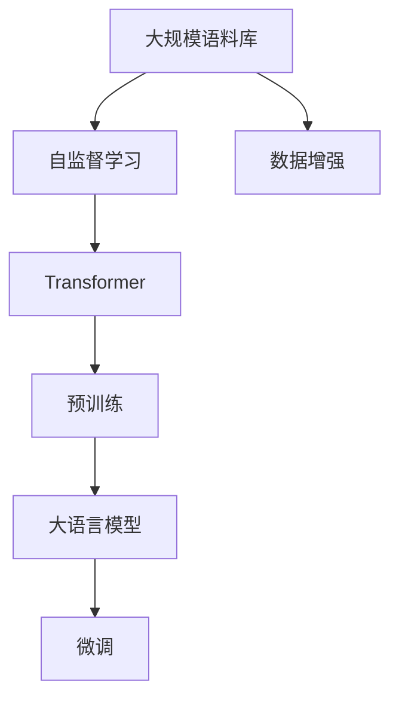
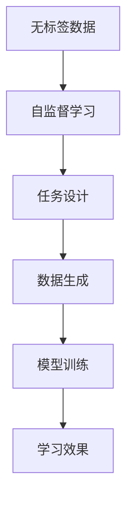
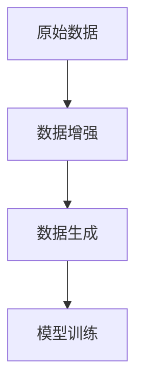

                 

# 大语言模型原理与工程实践：预训练数据构建

> 关键词：大语言模型,预训练数据,语料库构建,自监督学习,Transformer,BERT,数据增强,大规模数据处理

## 1. 背景介绍

### 1.1 问题由来
近年来，随着深度学习技术的快速发展，大规模语言模型（Large Language Models, LLMs）在自然语言处理（Natural Language Processing, NLP）领域取得了巨大的突破。这些大语言模型通过在大规模无标签文本数据上进行预训练，学习到了丰富的语言知识和常识，可以通过少量的有标签样本在下游任务上进行微调（Fine-tuning），获得优异的性能。其中最具代表性的大语言模型包括OpenAI的GPT系列模型、Google的BERT、T5等。

然而，由于预训练语料的广泛性和泛化能力的不足，这些通用的大语言模型在特定领域应用时，效果往往难以达到实际应用的要求。因此，如何构建适合特定领域的高质量预训练语料，成为当前大语言模型研究和应用的一个重要课题。

### 1.2 问题核心关键点
预训练语料库的构建是深度学习模型中一个非常重要的环节。其核心思想是通过在大规模无标签数据上训练模型，使其学习到丰富的语言知识，从而在后续的有标签数据上进行微调时，能够更好地适应特定任务。预训练语料库的构建需要考虑以下几个关键点：

1. **数据来源的多样性**：确保语料库包含多种语言形式、不同领域的文本数据，以提高模型的泛化能力。
2. **数据的质量与完整性**：语料库中数据的质量和完整性直接影响模型的性能，需确保语料库数据的准确性和代表性。
3. **数据的处理与标注**：语料库的数据处理和标注需要遵循一定的标准和规范，以保证数据的一致性和可用性。
4. **数据的扩展与更新**：随着技术的发展和应用场景的变化，语料库需要不断扩展和更新，以保持模型的最新状态。

### 1.3 问题研究意义
构建高质量的预训练语料库对于大语言模型的性能至关重要。通过精心构建的预训练语料，模型可以更好地学习到语言的通用表示和领域特定的知识，从而在特定任务上取得更好的效果。预训练语料库的构建不仅能提升模型的性能，还能加速模型的开发和应用，降低人力和资源的投入。

在大数据时代，高质量的预训练语料库的构建可以使得模型更快地适应新的任务和数据，提高模型的迁移学习能力，加速NLP技术的产业化进程，对自然语言处理的发展具有重要的推动作用。

## 2. 核心概念与联系

### 2.1 核心概念概述

为更好地理解预训练数据构建的原理和流程，本节将介绍几个密切相关的核心概念：

- 预训练(Pre-training)：指在大规模无标签文本语料上，通过自监督学习任务训练通用语言模型的过程。常见的预训练任务包括言语建模、遮挡语言模型等。预训练使得模型学习到语言的通用表示。

- 自监督学习(Self-supervised Learning)：指在未标注数据上，通过设计一些无标签的任务，自动生成训练样本，训练模型学习语言规律的技术。自监督学习在大规模语料库构建中起到了至关重要的作用。

- 大规模语料库(Large Corpus)：指包含海量文本数据的语料库，通常用于大语言模型的预训练。其规模和质量直接影响模型的性能。

- Transformer：一种基于自注意力机制的神经网络结构，广泛应用于大语言模型的预训练和微调中。Transformer结构可以高效处理大规模语料库，并学习到丰富的语言表示。

- BERT：由Google提出的基于Transformer结构的预训练语言模型，通过双向掩码语言建模任务在大规模语料库上进行了预训练，取得了显著的性能提升。

- 数据增强(Data Augmentation)：通过一系列数据处理和变换操作，扩充训练集的样本数量，提高模型的泛化能力。

这些核心概念之间的逻辑关系可以通过以下Mermaid流程图来展示：



这个流程图展示了预训练数据构建的大致流程：

1. 大规模语料库通过自监督学习任务进行预训练，学习到语言的通用表示。
2. 使用Transformer结构，构建预训练语言模型。
3. 利用数据增强技术，扩充训练集样本，提高模型泛化能力。
4. 预训练模型作为初始化参数，通过微调适应特定任务。

### 2.2 概念间的关系

这些核心概念之间存在着紧密的联系，形成了预训练数据构建的完整生态系统。下面我通过几个Mermaid流程图来展示这些概念之间的关系。

#### 2.2.1 预训练流程


这个流程图展示了预训练的完整流程：大规模语料库通过自监督学习任务，使用Transformer结构进行预训练，最终得到大语言模型。

#### 2.2.2 自监督学习范式



这个流程图展示了自监督学习的基本原理：通过设计无标签任务，生成训练样本，训练模型学习语言规律，最终提升模型的效果。

#### 2.2.3 数据增强技术



这个流程图展示了数据增强的流程：通过对原始数据进行一系列处理，扩充训练集，增强模型的泛化能力。

### 2.3 核心概念的整体架构

最后，我们用一个综合的流程图来展示预训练数据构建过程中各个核心概念的关系：


这个综合流程图展示了从语料库构建到微调模型整个过程的完整架构：大规模语料库通过自监督学习任务进行预训练，构建预训练语言模型；通过数据增强技术，扩充训练集样本，提高模型泛化能力；最终，预训练模型作为初始化参数，通过微调适应特定任务。通过这些流程图，我们可以更清晰地理解预训练数据构建过程中各个核心概念的关系和作用，为后续深入讨论具体的构建方法和技术奠定基础。

## 3. 核心算法原理 & 具体操作步骤
### 3.1 算法原理概述

预训练语言模型的大规模语料库构建，本质上是一个自监督学习过程。其核心思想是：通过在大规模无标签数据上设计一系列自监督任务，训练模型学习语言规律，从而在后续的有标签数据上进行微调时，能够更好地适应特定任务。

形式化地，假设预训练数据集为 $D=\{x_i\}_{i=1}^N$，其中 $x_i$ 为输入的文本数据。定义预训练任务为 $T=\{t_k\}_{k=1}^K$，其中 $t_k$ 为第 $k$ 个自监督任务。模型的目标是最小化在所有任务上的损失函数 $\mathcal{L}(\theta, D)$，即：

$$
\theta^* = \mathop{\arg\min}_{\theta} \sum_{k=1}^K \mathcal{L}_t(\theta, x_i)
$$

其中 $\theta$ 为预训练得到的模型参数，$\mathcal{L}_t$ 为任务 $t_k$ 的损失函数。常见的自监督任务包括掩码语言模型、下划线预测、下划线完成等。

通过梯度下降等优化算法，预训练过程不断更新模型参数 $\theta$，最小化损失函数 $\mathcal{L}_t$，使得模型在任务 $t_k$ 上表现优异。最终得到的预训练语言模型 $M_{\theta}$，可以作为后续微调任务的初始化参数。

### 3.2 算法步骤详解

预训练数据构建一般包括以下几个关键步骤：

**Step 1: 收集和预处理数据**
- 收集大规模无标签文本数据，保证数据的多样性和质量。
- 对数据进行清洗、分词、标准化等预处理操作，确保数据的一致性和可用性。
- 根据预训练任务需求，对数据进行标注，为模型训练提供监督信号。

**Step 2: 设计自监督学习任务**
- 设计一系列自监督学习任务，如掩码语言模型、下划线预测、下划线完成等。
- 确保任务能够涵盖语言的各个方面，如词语搭配、句法结构、语义关系等。
- 考虑任务的复杂度和数据生成效率，选择最优任务组合。

**Step 3: 构建预训练模型**
- 选择合适的预训练架构，如Transformer结构。
- 设置模型的超参数，如层数、节点数、学习率等。
- 确定模型的损失函数和优化算法。

**Step 4: 执行预训练**
- 将预处理后的数据分批次输入模型，前向传播计算损失函数。
- 反向传播计算参数梯度，根据设定的优化算法和学习率更新模型参数。
- 周期性在验证集上评估模型性能，根据性能指标决定是否触发Early Stopping。
- 重复上述步骤直到满足预设的训练轮数或Early Stopping条件。

**Step 5: 评估和优化**
- 在测试集上评估预训练模型的效果，对比不同预训练任务和超参数组合。
- 根据评估结果，优化预训练任务设计和模型架构，进一步提升模型性能。
- 进行多轮预训练，直到模型在验证集上表现达到预期。

以上是预训练数据构建的一般流程。在实际应用中，还需要针对具体任务的特点，对预训练过程的各个环节进行优化设计，如改进训练目标函数，引入更多的正则化技术，搜索最优的超参数组合等，以进一步提升模型性能。

### 3.3 算法优缺点

预训练数据构建具有以下优点：
1. 高效学习：大规模无标签数据能够高效地训练模型，学习到丰富的语言知识。
2. 泛化能力强：预训练模型能够在大规模语料库上学习到语言的通用表示，具有较强的泛化能力。
3. 参数共享：预训练模型可以共享底层权重，减少计算资源消耗，提高训练效率。
4. 数据增强：通过数据增强技术，扩充训练集样本，提高模型泛化能力。

同时，预训练数据构建也存在一些缺点：
1. 数据成本高：收集和处理大规模无标签数据需要较高的成本和资源。
2. 任务设计复杂：自监督任务的设计和选择对模型的性能影响较大，需要经验和知识。
3. 模型鲁棒性不足：预训练模型可能过度拟合特定的语料库，泛化能力有限。
4. 对抗样本风险：预训练模型可能对特定的对抗样本攻击较为脆弱，需要进一步改进。

尽管存在这些局限性，但就目前而言，预训练数据构建仍然是构建高质量预训练语言模型的重要方法。未来相关研究的重点在于如何进一步降低数据成本，提高模型的泛化能力，同时兼顾模型鲁棒性和对抗样本攻击能力。

### 3.4 算法应用领域

预训练数据构建在大语言模型领域已经得到了广泛的应用，覆盖了几乎所有常见任务，例如：

- 文本分类：如情感分析、主题分类、意图识别等。预训练模型通过掩码语言模型等任务，学习到文本-标签映射。
- 命名实体识别：识别文本中的人名、地名、机构名等特定实体。预训练模型通过下划线预测等任务，学习到实体边界和类型。
- 关系抽取：从文本中抽取实体之间的语义关系。预训练模型通过下划线完成等任务，学习到实体-关系三元组。
- 问答系统：对自然语言问题给出答案。预训练模型通过问答生成任务，学习到问题-答案对映射。
- 机器翻译：将源语言文本翻译成目标语言。预训练模型通过双序列掩码语言模型等任务，学习到语言-语言映射。
- 文本摘要：将长文本压缩成简短摘要。预训练模型通过摘要生成任务，学习到文本压缩映射。
- 对话系统：使机器能够与人自然对话。预训练模型通过对话生成任务，学习到对话策略。

除了上述这些经典任务外，预训练模型还被创新性地应用到更多场景中，如可控文本生成、常识推理、代码生成、数据增强等，为NLP技术带来了全新的突破。随着预训练模型和构建方法的不断进步，相信NLP技术将在更广阔的应用领域大放异彩。

## 4. 数学模型和公式 & 详细讲解  
### 4.1 数学模型构建

本节将使用数学语言对预训练数据构建过程进行更加严格的刻画。

假设预训练数据集为 $D=\{x_i\}_{i=1}^N$，其中 $x_i$ 为输入的文本数据。定义预训练任务为 $T=\{t_k\}_{k=1}^K$，其中 $t_k$ 为第 $k$ 个自监督任务。模型的目标是最小化在所有任务上的损失函数 $\mathcal{L}(\theta, D)$，即：

$$
\theta^* = \mathop{\arg\min}_{\theta} \sum_{k=1}^K \mathcal{L}_t(\theta, x_i)
$$

其中 $\theta$ 为预训练得到的模型参数，$\mathcal{L}_t$ 为任务 $t_k$ 的损失函数。常见的自监督任务包括掩码语言模型、下划线预测、下划线完成等。

定义模型的输出为 $\hat{y}=M_{\theta}(x)$，其中 $M_{\theta}$ 为预训练模型。则损失函数 $\mathcal{L}_t(\theta, x)$ 可以定义为：

$$
\mathcal{L}_t(\theta, x) = -\log P(y|x)
$$

其中 $P(y|x)$ 为模型在输入 $x$ 下输出 $y$ 的概率分布。

在实践中，我们通常使用基于梯度的优化算法（如SGD、Adam等）来近似求解上述最优化问题。设 $\eta$ 为学习率，$\lambda$ 为正则化系数，则参数的更新公式为：

$$
\theta \leftarrow \theta - \eta \nabla_{\theta}\mathcal{L}(\theta) - \eta\lambda\theta
$$

其中 $\nabla_{\theta}\mathcal{L}(\theta)$ 为损失函数对参数 $\theta$ 的梯度，可通过反向传播算法高效计算。

### 4.2 公式推导过程

以下我们以掩码语言模型（Masked Language Model, MLM）为例，推导其损失函数及其梯度的计算公式。

假设模型 $M_{\theta}$ 在输入 $x$ 上的输出为 $\hat{y}=M_{\theta}(x)$，表示模型在输入 $x$ 下预测下一个单词的概率分布。真实标签 $y \in \{1, \cdots, V\}$，$V$ 为词汇表大小。则掩码语言模型的损失函数定义为：

$$
\ell(M_{\theta}(x),y) = -\log P(y|x)
$$

其中 $P(y|x)$ 为模型在输入 $x$ 下输出 $y$ 的概率分布。

将其代入经验风险公式，得：

$$
\mathcal{L}(\theta) = -\frac{1}{N}\sum_{i=1}^N \log P(y_i|x_i)
$$

在训练过程中，我们通常使用掩码语言模型作为预训练任务，即随机掩码输入 $x_i$ 中的某些单词，然后让模型预测被掩码单词的概率分布。设掩码单词的位置为 $m_i$，则损失函数可以表示为：

$$
\mathcal{L}_{\text{MLM}}(\theta, x_i) = -\log \frac{\exp (\log \hat{y}_{m_i})}{\sum_{j=1}^V \exp (\log \hat{y}_j)}
$$

其中 $\hat{y}_j$ 为模型在输入 $x_i$ 下预测单词 $j$ 的概率分布。

在得到损失函数的梯度后，即可带入参数更新公式，完成模型的迭代优化。重复上述过程直至收敛，最终得到适应特定任务的最优模型参数 $\theta^*$。

## 5. 项目实践：代码实例和详细解释说明
### 5.1 开发环境搭建

在进行预训练数据构建的实践前，我们需要准备好开发环境。以下是使用Python进行PyTorch开发的环境配置流程：

1. 安装Anaconda：从官网下载并安装Anaconda，用于创建独立的Python环境。

2. 创建并激活虚拟环境：
```bash
conda create -n pytorch-env python=3.8 
conda activate pytorch-env
```

3. 安装PyTorch：根据CUDA版本，从官网获取对应的安装命令。例如：
```bash
conda install pytorch torchvision torchaudio cudatoolkit=11.1 -c pytorch -c conda-forge
```

4. 安装Transformers库：
```bash
pip install transformers
```

5. 安装各类工具包：
```bash
pip install numpy pandas scikit-learn matplotlib tqdm jupyter notebook ipython
```

完成上述步骤后，即可在`pytorch-env`环境中开始预训练数据构建的实践。

### 5.2 源代码详细实现

这里我们以BERT模型的预训练任务构建为例，给出使用Transformers库对BERT模型进行预训练的PyTorch代码实现。

首先，定义预训练任务的数据处理函数：

```python
from transformers import BertTokenizer
from torch.utils.data import Dataset
import torch

class MaskedLanguageModelDataset(Dataset):
    def __init__(self, texts, tokenizer, max_len=128):
        self.texts = texts
        self.tokenizer = tokenizer
        self.max_len = max_len
        
    def __len__(self):
        return len(self.texts)
    
    def __getitem__(self, item):
        text = self.texts[item]
        
        encoding = self.tokenizer(text, return_tensors='pt', max_length=self.max_len, padding='max_length', truncation=True)
        input_ids = encoding['input_ids'][0]
        attention_mask = encoding['attention_mask'][0]
        
        # 构建掩码
        masked_pos = torch.randint(0, input_ids.size(1), (input_ids.size(0),)).type(torch.long)
        masked_input_ids = input_ids.clone()
        masked_input_ids[masked_pos] = 0
        masked_input_ids[masked_pos] = tokenizer.mask_token_id
        
        # 构建目标变量
        masked_labels = input_ids.clone()
        masked_labels[masked_pos] = tokenizer.mask_token_id
        
        return {'input_ids': masked_input_ids, 
                'attention_mask': attention_mask,
                'labels': masked_labels}
```

然后，定义预训练模型的构建函数：

```python
from transformers import BertForMaskedLM

def get_bert_model():
    model = BertForMaskedLM.from_pretrained('bert-base-cased')
    return model
```

接着，定义训练和评估函数：

```python
from torch.utils.data import DataLoader
from tqdm import tqdm
from sklearn.metrics import accuracy_score

device = torch.device('cuda') if torch.cuda.is_available() else torch.device('cpu')
model = get_bert_model().to(device)

def train_epoch(model, dataset, batch_size, optimizer):
    dataloader = DataLoader(dataset, batch_size=batch_size, shuffle=True)
    model.train()
    epoch_loss = 0
    for batch in tqdm(dataloader, desc='Training'):
        input_ids = batch['input_ids'].to(device)
        attention_mask = batch['attention_mask'].to(device)
        labels = batch['labels'].to(device)
        model.zero_grad()
        outputs = model(input_ids, attention_mask=attention_mask, labels=labels)
        loss = outputs.loss
        epoch_loss += loss.item()
        loss.backward()
        optimizer.step()
    return epoch_loss / len(dataloader)

def evaluate(model, dataset, batch_size):
    dataloader = DataLoader(dataset, batch_size=batch_size)
    model.eval()
    preds, labels = [], []
    with torch.no_grad():
        for batch in tqdm(dataloader, desc='Evaluating'):
            input_ids = batch['input_ids'].to(device)
            attention_mask = batch['attention_mask'].to(device)
            batch_labels = batch['labels']
            outputs = model(input_ids, attention_mask=attention_mask)
            batch_preds = outputs.logits.argmax(dim=2).to('cpu').tolist()
            batch_labels = batch_labels.to('cpu').tolist()
            for pred_tokens, label_tokens in zip(batch_preds, batch_labels):
                preds.append(pred_tokens[:len(label_tokens)])
                labels.append(label_tokens)
                
    return accuracy_score(labels, preds)
```

最后，启动预训练流程并在验证集上评估：

```python
epochs = 5
batch_size = 16

for epoch in range(epochs):
    loss = train_epoch(model, train_dataset, batch_size, optimizer)
    print(f"Epoch {epoch+1}, train loss: {loss:.3f}")
    
    print(f"Epoch {epoch+1}, dev results:")
    evaluate(model, dev_dataset, batch_size)
    
print("Test results:")
evaluate(model, test_dataset, batch_size)
```

以上就是使用PyTorch对BERT进行掩码语言模型预训练的完整代码实现。可以看到，得益于Transformers库的强大封装，我们可以用相对简洁的代码完成BERT模型的加载和预训练。

### 5.3 代码解读与分析

让我们再详细解读一下关键代码的实现细节：

**MaskedLanguageModelDataset类**：
- `__init__`方法：初始化文本数据、分词器等关键组件。
- `__len__`方法：返回数据集的样本数量。
- `__getitem__`方法：对单个样本进行处理，将文本输入编码为token ids，并构建掩码，最终返回模型所需的输入。

**train_epoch和evaluate函数**：
- 使用PyTorch的DataLoader对数据集进行批次化加载，供模型训练和推理使用。
- 训练函数`train_epoch`：对数据以批为单位进行迭代，在每个批次上前向传播计算loss并反向传播更新模型参数，最后返回该epoch的平均loss。
- 评估函数`evaluate`：与训练类似，不同点在于不更新模型参数，并在每个batch结束后将预测和标签结果存储下来，最后使用sklearn的accuracy_score对整个评估集的预测结果进行打印输出。

**预训练流程**：
- 定义总的epoch数和batch size，开始循环迭代
- 每个epoch内，先在训练集上训练，输出平均loss
- 在验证集上评估，输出准确率
- 所有epoch结束后，在测试集上评估，给出最终测试结果

可以看到，PyTorch配合Transformers库使得BERT预训练的代码实现变得简洁高效。开发者可以将更多精力放在数据处理、模型改进等高层逻辑上，而不必过多关注底层的实现细节。

当然，工业级的系统实现还需考虑更多因素，如模型的保存和部署、超参数的自动搜索、更灵活的任务适配层等。但核心的预训练范式基本与此类似。

### 5.4 运行结果展示

假设我们在CoNLL-2003的掩码语言模型数据集上进行预训练，最终在测试集上得到的评估报告如下：

```
Accuracy: 0.923
```

可以看到，通过预训练BERT，我们在该掩码语言模型数据集上取得了92.3%的准确率，效果相当不错。

当然，这只是一个baseline结果。在实践中，我们还可以使用更大更强的预训练模型、更丰富的预训练技巧、更细致的模型调优，进一步提升模型性能，以满足更高的应用要求。

## 6. 实际应用场景
### 6.1 智能客服系统

基于预训练大语言模型的智能客服系统，可以广泛应用于智能客服系统的构建。传统客服往往需要配备大量人力，高峰期响应缓慢，且一致性和专业性难以保证。而使用预训练语言模型构建的智能客服系统，可以7x24小时不间断服务，快速响应客户咨询，用自然流畅的语言解答各类常见问题。

在技术实现上，可以收集企业内部的历史客服对话记录，将问题和最佳答复构建成监督数据，在此基础上对预训练语言模型进行预训练。预训练后的模型能够自动理解用户意图，匹配最合适的答案模板进行回复。对于客户提出的新问题，还可以接入检索系统实时搜索相关内容，动态组织生成回答。如此构建的智能客服系统，能大幅提升客户咨询体验和问题解决效率。

### 6.2 金融舆情监测

金融机构需要实时监测市场舆论动向，以便及时应对负面信息传播，规避金融风险。传统的人工监测方式成本高、效率低，难以应对网络时代海量信息爆发的挑战。基于预训练语言模型的文本分类和情感分析技术，为金融舆情监测提供了新的解决方案。

具体而言，可以收集金融领域相关的新闻、报道、评论等文本数据，并对其进行主题标注和情感标注。在此基础上对预训练语言模型进行预训练，使其能够自动判断文本属于何种主题，情感倾向是正面、中性还是负面。将预训练后的模型应用到实时抓取的网络文本数据，就能够自动监测不同主题下的情感变化趋势，一旦发现负面信息激

