                 

# 大语言模型原理基础与前沿 指令生成

> 关键词：大语言模型,指令生成,强化学习,自监督学习,Transformer,BERT,预训练,自回归,自编码

## 1. 背景介绍

### 1.1 问题由来
随着深度学习技术的发展，大语言模型（Large Language Models, LLMs）在自然语言处理（Natural Language Processing, NLP）领域取得了巨大的进展。这些大模型，如GPT系列、BERT等，通过在大规模无标签文本数据上进行预训练，学习到了丰富的语言知识和常识，具备强大的语言理解和生成能力。

然而，大语言模型在特定领域的应用时，效果往往难以达到实际需求。为了应对这一问题，研究者们提出了一种新的方法，即基于指令生成的微调。这种方法通过预训练模型作为初始化参数，使用少量标注数据进行微调，使得模型能够根据特定指令生成符合预期结果的文本，显著提升了模型在特定任务上的性能。

### 1.2 问题核心关键点
指令生成微调的核心思想是：将大语言模型作为生成器，通过指令作为输入，生成符合预期输出结果的文本。这种微调方法能够在不改变模型预训练参数的情况下，通过优化顶层结构，使得模型能够适应特定的生成任务。

指令生成微调的关键在于：
- 选择合适的任务描述和标注数据，构建适当的损失函数。
- 采用合适的优化算法和正则化技术，防止过拟合和梯度消失。
- 设计有效的提示模板，引导模型进行特定任务的推理和生成。
- 通过细粒度的训练，逐步提升模型的生成能力。

### 1.3 问题研究意义
指令生成微调方法对于拓展大语言模型的应用范围，提升模型的生成性能，加速NLP技术的产业化进程，具有重要意义：

1. 降低应用开发成本。基于大模型的指令生成微调，可以显著减少从头开发所需的数据、计算和人力等成本投入。
2. 提升模型效果。微调使得通用大模型更好地适应特定任务，在生成场景中取得更优表现。
3. 加速开发进度。standing on the shoulders of giants，微调使得开发者可以更快地完成任务适配，缩短开发周期。
4. 带来技术创新。指令生成微调范式促进了对预训练-微调的深入研究，催生了提示学习、少样本学习等新的研究方向。
5. 赋能产业升级。指令生成微调使得NLP技术更容易被各行各业所采用，为传统行业数字化转型升级提供新的技术路径。

## 2. 核心概念与联系

### 2.1 核心概念概述

为更好地理解指令生成微调方法，本节将介绍几个密切相关的核心概念：

- 大语言模型(Large Language Model, LLM)：以自回归(如GPT)或自编码(如BERT)模型为代表的大规模预训练语言模型。通过在大规模无标签文本语料上进行预训练，学习通用的语言表示，具备强大的语言理解和生成能力。

- 预训练(Pre-training)：指在大规模无标签文本语料上，通过自监督学习任务训练通用语言模型的过程。常见的预训练任务包括言语建模、遮挡语言模型等。预训练使得模型学习到语言的通用表示。

- 指令生成(Instruction Generation)：指模型根据特定任务描述（即指令），生成符合预期结果的文本。指令生成通常用于对话系统、文本摘要、代码生成等任务。

- 微调(Fine-tuning)：指在预训练模型的基础上，使用下游任务的少量标注数据，通过有监督学习优化模型在特定任务上的性能。通常只需要调整顶层结构或解码器，并以较小的学习率更新全部或部分的模型参数。

- 自监督学习(Self-supervised Learning)：指在没有标注数据的情况下，通过设计自监督任务，让模型从无标签数据中学习知识。自监督学习在大模型的预训练中起到了关键作用。

- 强化学习(Reinforcement Learning)：指通过与环境的交互，让模型学习最优策略。指令生成微调中，可以通过奖励机制引导模型生成符合预期的文本。

- 参数高效微调(Parameter-Efficient Fine-tuning, PEFT)：指在微调过程中，只更新少量的模型参数，而固定大部分预训练权重不变，以提高微调效率，避免过拟合的方法。

- 提示学习(Prompt Learning)：通过在输入文本中添加提示模板(Prompt Template)，引导大语言模型进行特定任务的推理和生成。可以在不更新模型参数的情况下，实现零样本或少样本学习。

- 少样本学习(Few-shot Learning)：指在只有少量标注样本的情况下，模型能够快速适应新任务的学习方法。在大语言模型中，通常通过在输入中提供少量示例来实现，无需更新模型参数。

- 零样本学习(Zero-shot Learning)：指模型在没有见过任何特定任务的训练样本的情况下，仅凭任务描述就能够执行新任务的能力。大语言模型通过预训练获得的广泛知识，使其能够理解任务指令并生成相应输出。

- 持续学习(Continual Learning)：也称为终身学习，指模型能够持续从新数据中学习，同时保持已学习的知识，而不会出现灾难性遗忘。这对于保持大语言模型的时效性和适应性至关重要。

这些核心概念之间的逻辑关系可以通过以下Mermaid流程图来展示：

```mermaid
graph TB
    A[大语言模型] --> B[预训练]
    A --> C[指令生成]
    B --> D[自监督学习]
    C --> E[有监督学习]
    D --> F[自回归模型]
    F --> G[自编码模型]
    G --> A
    E --> H[零样本学习]
    E --> I[少样本学习]
    H --> C
    I --> C
    C --> J[参数高效微调]
    J --> A
    C --> K[强化学习]
    K --> J
```



这个流程图展示了大语言模型的核心概念及其之间的关系：

1. 大语言模型通过预训练获得基础能力。
2. 指令生成是通过微调范式进行特定任务的生成，可以是全参数微调或参数高效微调。
3. 强化学习是另一种生成范式，通过奖励机制引导模型进行生成。
4. 零样本和少样本学习是基于预训练知识的生成方法。
5. 自回归和自编码模型是大语言模型的两种基本架构。
6. 持续学习使得模型能够不断学习新知识，避免遗忘旧知识。

这些概念共同构成了大语言模型的学习和应用框架，使其能够在各种场景下发挥强大的语言理解和生成能力。通过理解这些核心概念，我们可以更好地把握大语言模型的工作原理和优化方向。

### 2.2 概念间的关系

这些核心概念之间存在着紧密的联系，形成了大语言模型的生成微调生态系统。下面我通过几个Mermaid流程图来展示这些概念之间的关系。

#### 2.2.1 大语言模型的学习范式


这个流程图展示了大语言模型的三种主要生成范式：预训练、自监督学习和指令生成。自监督学习涉及多种生成任务，如掩码语言模型等，可以提升模型的语言理解能力。指令生成微调则是通过有监督学习的过程，使得模型能够根据特定任务指令进行生成。

#### 2.2.2 指令生成与微调的关系


这个流程图展示了指令生成与微调的关系。预训练模型在指令生成任务中扮演生成器角色，任务适配层根据具体任务定义生成器的输出形式和损失函数。微调过程通过优化顶层结构，使得模型能够生成符合特定任务要求的文本。

#### 2.2.3 参数高效微调方法


这个流程图展示了几种常见的参数高效微调方法，包括适配器微调、提示微调、LoRA和BitFit。这些方法的共同特点是冻结大部分预训练参数，只更新少量参数，从而提高微调效率。

#### 2.2.4 持续学习在大语言模型中的应用


这个流程图展示了持续学习在大语言模型中的应用。持续学习的主要目标是避免灾难性遗忘和实现增量学习。通过正则化方法、记忆重放、动态架构和知识蒸馏等技术，可以使大语言模型持续适应新的任务和数据。

### 2.3 核心概念的整体架构

最后，我们用一个综合的流程图来展示这些核心概念在大语言模型指令生成微调过程中的整体架构：


这个综合流程图展示了从预训练到微调，再到持续学习的完整过程。大语言模型首先在大规模文本数据上进行预训练，然后通过指令生成微调，使得模型能够生成符合特定任务的文本。最后，通过持续学习技术，模型可以不断更新和适应新的任务和数据。 通过这些流程图，我们可以更清晰地理解大语言模型指令生成微调过程中各个核心概念的关系和作用，为后续深入讨论具体的微调方法和技术奠定基础。

## 3. 核心算法原理 & 具体操作步骤
### 3.1 算法原理概述

指令生成微调本质上是一种有监督的细粒度迁移学习过程。其核心思想是：将预训练的大语言模型作为生成器，通过指令作为输入，生成符合预期输出结果的文本。指令生成微调的具体步骤如下：

1. 收集特定任务的少量标注数据，构建训练集、验证集和测试集。
2. 选择适当的预训练语言模型，作为指令生成的基础模型。
3. 根据任务类型，在预训练模型顶层设计合适的输出层和损失函数。
4. 使用训练集对模型进行有监督学习，优化模型在特定任务上的生成能力。
5. 在验证集上评估模型性能，根据性能指标调整模型参数。
6. 在测试集上最终评估模型效果，使用生成的文本进行实际应用。

### 3.2 算法步骤详解

指令生成微调的具体操作步骤如下：

**Step 1: 准备预训练模型和数据集**
- 选择合适的预训练语言模型 $M_{\theta}$ 作为初始化参数，如 BERT、GPT等。
- 准备指令生成任务 $T$ 的标注数据集 $D=\{(x_i, y_i)\}_{i=1}^N$，其中 $x_i$ 为输入指令，$y_i$ 为预期生成的文本。

**Step 2: 添加任务适配层**
- 根据任务类型，在预训练模型顶层设计合适的输出层和损失函数。
- 对于生成文本任务，通常在顶层添加解码器，使用交叉熵损失函数。

**Step 3: 设置微调超参数**
- 选择合适的优化算法及其参数，如 AdamW、SGD 等，设置学习率、批大小、迭代轮数等。
- 设置正则化技术及强度，包括权重衰减、Dropout、Early Stopping 等。
- 确定冻结预训练参数的策略，如仅微调顶层，或全部参数都参与微调。

**Step 4: 执行梯度训练**
- 将训练集数据分批次输入模型，前向传播计算损失函数。
- 反向传播计算参数梯度，根据设定的优化算法和学习率更新模型参数。
- 周期性在验证集上评估模型性能，根据性能指标决定是否触发 Early Stopping。
- 重复上述步骤直到满足预设的迭代轮数或 Early Stopping 条件。

**Step 5: 测试和部署**
- 在测试集上评估微调后模型 $M_{\hat{\theta}}$ 的性能，对比微调前后的生成效果。
- 使用微调后的模型对新指令进行生成，集成到实际的应用系统中。
- 持续收集新的指令数据，定期重新微调模型，以适应数据分布的变化。

以上是基于监督学习的大语言模型指令生成微调的一般流程。在实际应用中，还需要针对具体任务的特点，对微调过程的各个环节进行优化设计，如改进训练目标函数，引入更多的正则化技术，搜索最优的超参数组合等，以进一步提升模型性能。

### 3.3 算法优缺点

指令生成微调方法具有以下优点：
1. 简单高效。只需准备少量标注数据，即可对预训练模型进行快速适配，生成符合预期的文本。
2. 通用适用。适用于各种NLP生成任务，如对话、文本摘要、机器翻译等，设计简单的任务适配层即可实现微调。
3. 参数高效。利用参数高效微调技术，在固定大部分预训练参数的情况下，仍可取得不错的生成效果。
4. 效果显著。在学术界和工业界的诸多任务上，基于指令生成的微调方法已经刷新了多项生成任务SOTA。

同时，该方法也存在一定的局限性：
1. 依赖标注数据。生成任务对标注数据的质量和数量要求较高，获取高质量标注数据的成本较高。
2. 迁移能力有限。当目标任务与预训练数据的分布差异较大时，指令生成微调的性能提升有限。
3. 负面效果传递。预训练模型的固有偏见、有害信息等，可能通过微调传递到下游任务，造成负面影响。
4. 可解释性不足。指令生成微调模型的决策过程通常缺乏可解释性，难以对其推理逻辑进行分析和调试。

尽管存在这些局限性，但就目前而言，基于监督学习的指令生成微调方法仍是大语言模型应用的重要范式。未来相关研究的重点在于如何进一步降低指令生成对标注数据的依赖，提高模型的少样本学习和跨领域迁移能力，同时兼顾可解释性和伦理安全性等因素。

### 3.4 算法应用领域

指令生成微调方法在NLP领域已经得到了广泛的应用，覆盖了几乎所有常见任务，例如：

- 对话系统：对自然语言问题生成合适的回答。将问题-回答对作为微调数据，训练模型学习生成对话。
- 文本摘要：将长文本压缩成简短摘要。将文章-摘要对作为微调数据，使模型学习抓取要点。
- 机器翻译：将源语言文本翻译成目标语言。通过微调使模型学习语言-语言映射。
- 文本生成：生成符合特定主题、风格或语调的文本。使用提示模板作为微调数据，训练模型学习生成指定类型的文本。

除了上述这些经典任务外，指令生成微调还被创新性地应用到更多场景中，如可控文本生成、常识推理、代码生成、数据增强等，为NLP技术带来了全新的突破。随着预训练模型和微调方法的不断进步，相信NLP技术将在更广阔的应用领域大放异彩。

## 4. 数学模型和公式 & 详细讲解
### 4.1 数学模型构建

本节将使用数学语言对基于监督学习的大语言模型指令生成微调过程进行更加严格的刻画。

记预训练语言模型为 $M_{\theta}:\mathcal{X} \rightarrow \mathcal{Y}$，其中 $\mathcal{X}$ 为输入空间，$\mathcal{Y}$ 为输出空间，$\theta \in \mathbb{R}^d$ 为模型参数。假设指令生成任务 $T$ 的训练集为 $D=\{(x_i,y_i)\}_{i=1}^N, x_i \in \mathcal{X}, y_i \in \mathcal{Y}$。

定义模型 $M_{\theta}$ 在输入 $x$ 上的输出为 $\hat{y}=M_{\theta}(x) \in \mathcal{Y}$。指令生成任务的损失函数定义为：

$$
\ell(M_{\theta}(x),y) = -\log \mathbb{P}(M_{\theta}(x)=y)
$$

其中 $\mathbb{P}(M_{\theta}(x)=y)$ 表示模型 $M_{\theta}$ 在输入 $x$ 上生成 $y$ 的概率。

指令生成任务的微调目标是最小化损失函数，即找到最优参数：

$$
\theta^* = \mathop{\arg\min}_{\theta} \frac{1}{N}\sum_{i=1}^N \ell(M_{\theta}(x_i),y_i)
$$

在实践中，我们通常使用基于梯度的优化算法（如SGD、Adam等）来近似求解上述最优化问题。设 $\eta$ 为学习率，$\lambda$ 为正则化系数，则参数的更新公式为：

$$
\theta \leftarrow \theta - \eta \nabla_{\theta}\mathcal{L}(\theta) - \eta\lambda\theta
$$

其中 $\nabla_{\theta}\mathcal{L}(\theta)$ 为损失函数对参数 $\theta$ 的梯度，可通过反向传播算法高效计算。

### 4.2 公式推导过程

以下我们以文本生成任务为例，推导基于交叉熵损失函数的梯度计算公式。

假设模型 $M_{\theta}$ 在输入 $x$ 上的输出为 $\hat{y}=M_{\theta}(x) \in \mathcal{V}$，其中 $\mathcal{V}$ 为词汇表。则文本生成任务的交叉熵损失函数定义为：

$$
\ell(M_{\theta}(x),y) = -\log \mathbb{P}(M_{\theta}(x)=y)
$$

其中 $y$ 为生成文本的词汇序列。假设 $y$ 的长度为 $T$，则 $y$ 可以表示为 $y=[y_1, y_2, ..., y_T]$，其中 $y_t$ 表示第 $t$ 个词的标签。

将损失函数代入微调目标，得：

$$
\theta^* = \mathop{\arg\min}_{\theta} \frac{1}{N}\sum_{i=1}^N \sum_{t=1}^T -\log \mathbb{P}(M_{\theta}(x_i)=y_i)
$$

利用链式法则，损失函数对参数 $\theta_k$ 的梯度为：

$$
\frac{\partial \mathcal{L}(\theta)}{\partial \theta_k} = \frac{1}{N}\sum_{i=1}^N \sum_{t=1}^T -\frac{y_{i,t}}{\mathbb{P}(M_{\theta}(x_i)=y_i)} \frac{\partial \mathbb{P}(M_{\theta}(x_i)=y_i)}{\partial \theta_k}
$$

其中 $\frac{\partial \mathbb{P}(M_{\theta}(x_i)=y_i)}{\partial \theta_k}$ 为模型在输入 $x_i$ 上生成词汇 $y_i$ 的概率对参数 $\theta_k$ 的梯度。通过模型定义和求解，可以得到：

$$
\frac{\partial \mathbb{P}(M_{\theta}(x_i)=y_i)}{\partial \theta_k} = \sum_{t=1}^T \frac{y_{i,t}}{Z} \frac{\partial \mathbb{P}(M_{\theta}(x_i)=y_i, y_t=y_{i,t})}{\partial \theta_k}
$$

其中 $Z$ 为归一化因子，$\frac{\partial \mathbb{P}(M_{\theta}(x_i)=y_i, y_t=y_{i,t})}{\partial \theta_k}$ 为模型在输入 $x_i$ 上生成词汇 $y_i$ 和 $y_t=y_{i,t}$ 的概率对参数 $\theta_k$ 的联合梯度。通过模型定义和求解，可以得到：

$$
\frac{\partial \mathbb{P}(M_{\theta}(x_i)=y_i, y_t=y_{i,t})}{\partial \theta_k} = \frac{1}{\mathbb{P}(M_{\theta}(x_i)=y_i)} \frac{\partial \mathbb{P}(y_t|M_{\theta}(x_i)=y_i)}{\partial \theta_k}
$$

其中 $\frac{\partial \mathbb{P}(y_t|M_{\theta}(x_i)=y_i)}{\partial \theta_k}$ 为在给定上下文 $x_i$ 和输出前缀 $y_i$ 的情况下，生成词汇 $y_t$ 的概率对参数 $\theta_k$ 的梯度。通过模型定义和求解，可以得到：

$$
\frac{\partial \mathbb{P}(y_t|M_{\theta}(x_i)=y_i)}{\partial \theta_k} = \sum_{w \in \mathcal{V}} \frac{y_{i,t}}{\mathbb{P}(M_{\theta}(x_i)=y_i)} \frac{\partial \mathbb{P}(y_t=w|M_{\theta}(x_i)=y_i)}{\partial \theta_k}
$$

其中 $\frac{\partial \mathbb{P}(y_t=w|M_{\theta}(x_i)=y_i)}{\partial \theta_k}$ 为在给定上下文 $x_i$ 和输出前缀 $y_i$ 的情况下，生成词汇 $w$ 的概率对参数 $\theta_k$ 的梯度。通过模型定义和求解，可以得到：

$$
\frac{\partial \mathbb{P}(y_t=w|M_{\theta}(x_i)=y_i)}{\partial \theta_k} = \frac{\exp(\mathbb{E}[\log \mathbb{P}(w|M_{\theta}(x_i), y_i) + \log \mathbb{P}(y_i|x_i)])}{\sum_{v \in \mathcal{V}} \exp(\mathbb{E}[\log \mathbb{P}(v|M_{\theta}(x_i), y_i) + \log \mathbb{P}(y_i|x_i)])} \frac{\partial \mathbb{P}(w|M_{\theta}(x_i), y_i)}{\partial \theta_k}
$$

其中 $\mathbb{E}[\log \mathbb{P}(w|M_{\theta}(x_i), y_i) + \log \mathbb{P}(y_i|x_i)]$ 表示模型在输入 $x_i$ 上生成词汇 $y_i$ 和 $w$ 的联合概率的期望，可以通过最大似然估计求得。

综上所述，指令生成微调模型在输入 $x_i$ 上生成词汇序列 $y_i$ 的梯度计算公式为：

$$
\frac{\partial \mathcal{L}(\theta)}{\partial \theta_k} = \frac{1}{N}\sum_{i=1}^N \sum_{t=1}^T -\frac{y_{i,t}}{\mathbb{P}(M_{\theta}(x_i)=y_i)} \frac{\partial \mathbb{P}(M_{\theta}(x_i)=y_i, y_t=y_{i,t})}{\partial \theta_k}
$$

在实践中，为了方便计算，通常会将损失函数转化为对数似然函数，即将 $\log \mathbb{P}(M_{\theta}(x_i)=y_i)$ 替换为交叉熵损失函数 $-\log \mathbb{P}(y_i|M_{\theta}(x_i))$。这使得梯度计算更加高效，同时保留了微调过程的优化目标。

### 4.3 案例分析与讲解

下面我们以文本生成任务为例，给出使用Transformer库对GPT模型进行指令生成微调的PyTorch代码实现。

首先，定义文本生成任务的数据处理函数：

```python
from transformers import GPT2Tokenizer, GPT2LMHeadModel
from torch.utils.data import Dataset
import torch

class TextGenerationDataset(Dataset):
    def __init__(self, texts, tokenizer):
        self.texts = texts
        self.tokenizer = tokenizer
        
    def __len__(self):
        return len(self.texts)
    
    def __getitem__(self, item):
        text = self.texts[item]
        
        encoding = self.tokenizer(text, return_tensors='pt')
        input_ids = encoding['input_ids'][0]
        attention_mask = encoding['attention_mask'][0]
        
        return {'input_ids': input_ids, 
                'attention_mask': attention_mask}
```

然后，定义模型和优化器：

```python
from transformers import AdamW

model = GPT2LM

