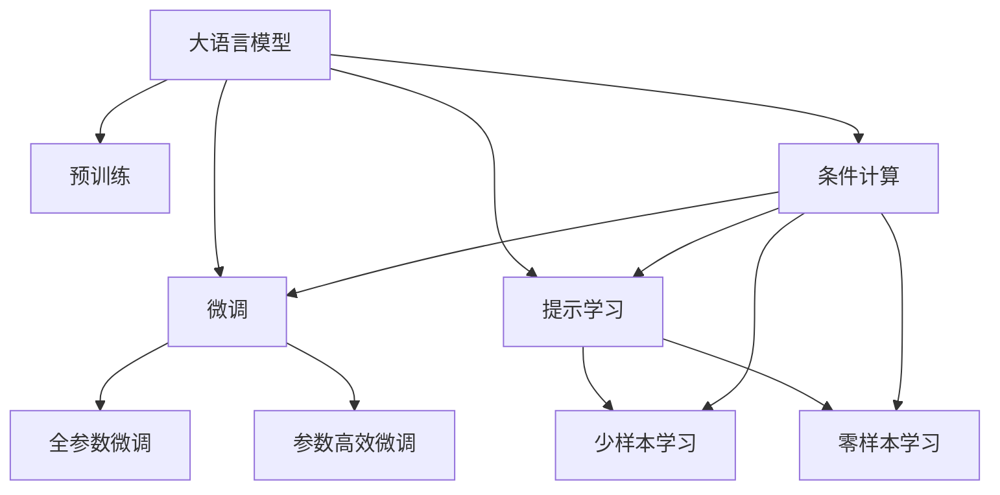
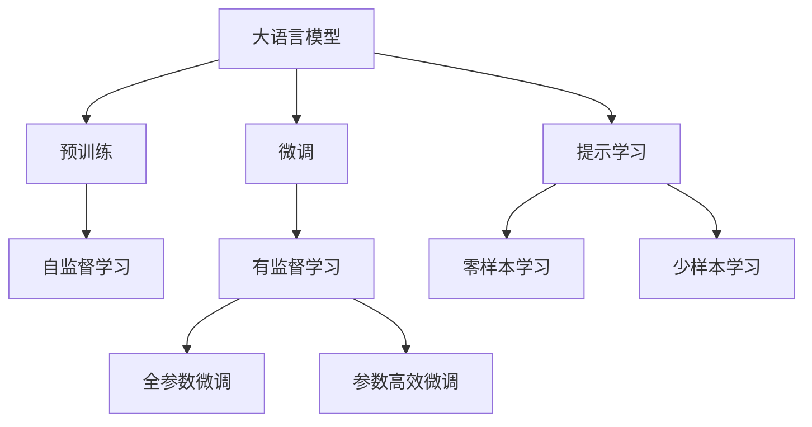
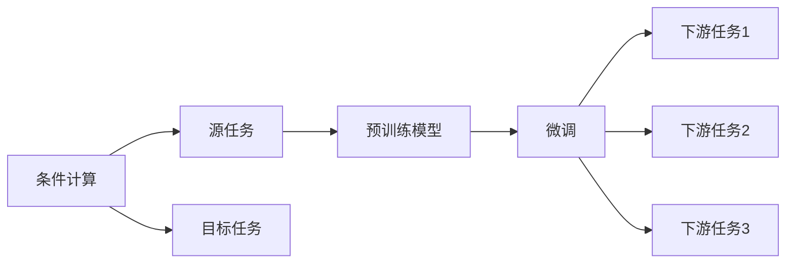
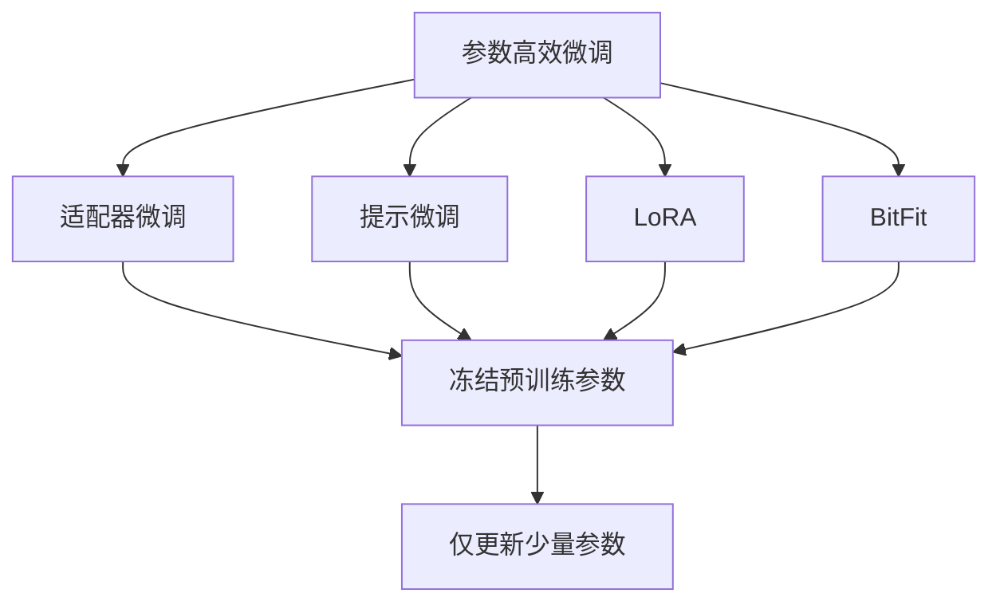
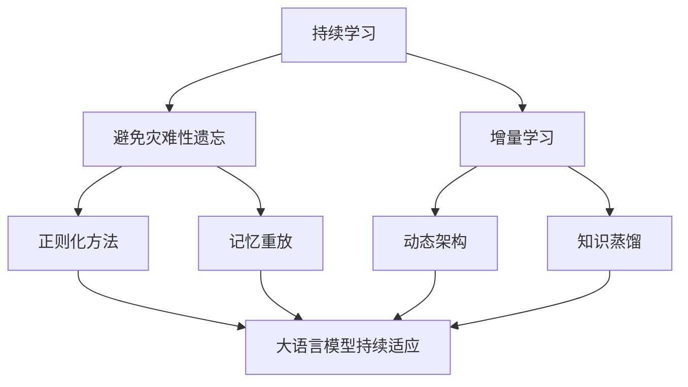
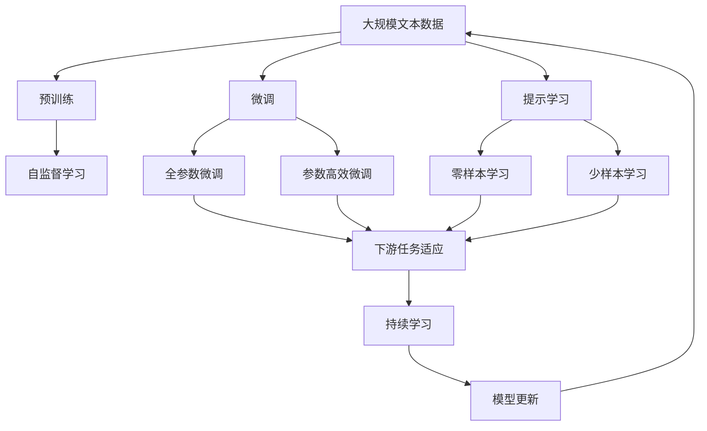

                 

# 大语言模型原理基础与前沿 条件计算

> 关键词：大语言模型,条件计算,预训练,微调,Transformer,BERT,自监督学习,监督学习,自然语言处理(NLP)

## 1. 背景介绍

### 1.1 问题由来
近年来，深度学习技术在自然语言处理(NLP)领域取得了巨大突破。特别是大语言模型（Large Language Models, LLMs）的兴起，使得模型在各种NLP任务上取得了前所未有的性能。这些模型通过在无标签的大规模语料上进行预训练，学习到丰富的语言知识和常识，然后通过微调(Fine-tuning)应用于特定任务，比如问答、对话、翻译、情感分析等。

但这些通用大语言模型在特定领域的应用效果往往不够理想，难以满足实际应用要求。因此，如何针对特定任务进行大模型微调，提升模型性能，成为当前NLP研究和应用的热点问题。本文聚焦于条件计算（Conditional Computing）在大语言模型微调中的应用，以期对大语言模型微调实践提供更全面的指导。

### 1.2 问题核心关键点
条件计算是指在预训练模型的基础上，通过有条件的微调（Fine-tuning）来适应特定任务。这种微调方法可以显著提升模型在特定任务上的表现，尤其是在少样本、弱监督或无监督的情况下。条件计算通常包括以下几个关键步骤：

1. 选择合适的预训练模型，如BERT、GPT等。
2. 准备下游任务的少量标注数据，划分为训练集、验证集和测试集。
3. 在预训练模型的基础上，添加任务适配层，如分类头、解码器等。
4. 设置微调超参数，如学习率、批大小、迭代轮数等。
5. 通过梯度下降等优化算法进行训练，更新模型参数以适应下游任务。
6. 在测试集上评估模型性能，比较微调前后的性能提升。

条件计算方法简单高效，能够在大规模预训练模型的基础上快速提升模型在特定任务上的效果。然而，这种方法也存在一定的局限性，如依赖标注数据、泛化能力有限等。

### 1.3 问题研究意义
条件计算方法对于拓展大语言模型的应用范围，提升下游任务的性能，加速NLP技术的产业化进程具有重要意义：

1. 降低应用开发成本。通过微调预训练模型，可以快速获得高性能模型，减少从头开发所需的数据、计算和人力等成本投入。
2. 提升模型效果。微调使得通用大模型更好地适应特定任务，在应用场景中取得更优表现。
3. 加速开发进度。利用预训练模型进行微调，可以加快任务适配，缩短开发周期。
4. 带来技术创新。微调范式促进了对预训练-微调的深入研究，催生了提示学习、少样本学习等新的研究方向。
5. 赋能产业升级。微调使得NLP技术更容易被各行各业采用，为传统行业数字化转型升级提供新的技术路径。

## 2. 核心概念与联系

### 2.1 核心概念概述

为更好地理解条件计算方法，本节将介绍几个密切相关的核心概念：

- 大语言模型(Large Language Model, LLM)：以自回归(如GPT)或自编码(如BERT)模型为代表的大规模预训练语言模型。通过在大规模无标签文本语料上进行预训练，学习通用的语言表示，具备强大的语言理解和生成能力。

- 预训练(Pre-training)：指在大规模无标签文本语料上，通过自监督学习任务训练通用语言模型的过程。常见的预训练任务包括言语建模、遮挡语言模型等。预训练使得模型学习到语言的通用表示。

- 微调(Fine-tuning)：指在预训练模型的基础上，使用下游任务的少量标注数据，通过有监督学习优化模型在特定任务上的性能。通常只需要调整顶层分类器或解码器，并以较小的学习率更新全部或部分的模型参数。

- 条件计算(Conditional Computing)：指在预训练模型的基础上，通过有条件的微调（Fine-tuning）来适应特定任务。这种微调方法可以显著提升模型在特定任务上的表现，尤其是在少样本、弱监督或无监督的情况下。

- 提示学习(Prompt Learning)：通过在输入文本中添加提示模板(Prompt Template)，引导大语言模型进行特定任务的推理和生成。可以在不更新模型参数的情况下，实现零样本或少样本学习。

- 少样本学习(Few-shot Learning)：指在只有少量标注样本的情况下，模型能够快速适应新任务的学习方法。在大语言模型中，通常通过在输入中提供少量示例来实现，无需更新模型参数。

- 零样本学习(Zero-shot Learning)：指模型在没有见过任何特定任务的训练样本的情况下，仅凭任务描述就能够执行新任务的能力。大语言模型通过预训练获得的广泛知识，使其能够理解任务指令并生成相应输出。

- 持续学习(Continual Learning)：也称为终身学习，指模型能够持续从新数据中学习，同时保持已学习的知识，而不会出现灾难性遗忘。这对于保持大语言模型的时效性和适应性至关重要。

这些核心概念之间的逻辑关系可以通过以下Mermaid流程图来展示：



这个流程图展示了大语言模型的核心概念及其之间的关系：

1. 大语言模型通过预训练获得基础能力。
2. 微调是对预训练模型进行任务特定的优化，可以分为全参数微调和参数高效微调两种方式。
3. 提示学习是一种不更新模型参数的方法，可以实现零样本和少样本学习。
4. 条件计算是在微调过程中通过引入条件变量，优化模型以适应特定任务。
5. 少样本学习和零样本学习可以在提示模板的引导下，利用大模型的知识进行快速推理。
6. 持续学习旨在使模型能够不断学习新知识，同时避免遗忘旧知识。

这些概念共同构成了大语言模型的学习和应用框架，使其能够在各种场景下发挥强大的语言理解和生成能力。通过理解这些核心概念，我们可以更好地把握大语言模型的工作原理和优化方向。

### 2.2 概念间的关系

这些核心概念之间存在着紧密的联系，形成了大语言模型的完整生态系统。下面我通过几个Mermaid流程图来展示这些概念之间的关系。

#### 2.2.1 大语言模型的学习范式



这个流程图展示了大语言模型的三种主要学习范式：预训练、微调和提示学习。预训练主要采用自监督学习方法，而微调则是有监督学习的过程。提示学习可以实现零样本和少样本学习，无需更新模型参数。

#### 2.2.2 条件计算与微调的关系



这个流程图展示了条件计算的基本原理，以及它与微调的关系。条件计算涉及源任务和目标任务，预训练模型在源任务上学习，然后通过微调适应各种下游任务（目标任务）。

#### 2.2.3 参数高效微调方法



这个流程图展示了几种常见的参数高效微调方法，包括适配器微调、提示微调、LoRA和BitFit。这些方法的共同特点是冻结大部分预训练参数，只更新少量参数，从而提高微调效率。

#### 2.2.4 持续学习在大语言模型中的应用



这个流程图展示了持续学习在大语言模型中的应用。持续学习的主要目标是避免灾难性遗忘和实现增量学习。通过正则化方法、记忆重放、动态架构和知识蒸馏等技术，可以使大语言模型持续适应新的任务和数据。

### 2.3 核心概念的整体架构

最后，我们用一个综合的流程图来展示这些核心概念在大语言模型微调过程中的整体架构：



这个综合流程图展示了从预训练到微调，再到持续学习的完整过程。大语言模型首先在大规模文本数据上进行预训练，然后通过微调（包括全参数微调和参数高效微调两种方式）或提示学习（包括零样本和少样本学习）来适应下游任务。最后，通过持续学习技术，模型可以不断更新和适应新的任务和数据。 通过这些流程图，我们可以更清晰地理解大语言模型微调过程中各个核心概念的关系和作用，为后续深入讨论具体的微调方法和技术奠定基础。

## 3. 核心算法原理 & 具体操作步骤
### 3.1 算法原理概述

条件计算方法本质上是在预训练模型的基础上，通过有条件的微调（Fine-tuning）来优化模型在特定任务上的性能。其核心思想是：将预训练的大语言模型视作一个强大的"特征提取器"，通过在有条件数据集上进行有监督的微调，使得模型输出能够匹配任务标签，从而获得针对特定任务优化的模型。

形式化地，假设预训练模型为 $M_{\theta}$，其中 $\theta$ 为预训练得到的模型参数。给定下游任务 $T$ 的标注数据集 $D=\{(x_i, y_i)\}_{i=1}^N, x_i \in \mathcal{X}, y_i \in \mathcal{Y}$。如果任务 $T$ 的条件变量为 $c$，则条件计算的目标是找到新的模型参数 $\hat{\theta}$，使得：

$$
\hat{\theta}=\mathop{\arg\min}_{\theta} \mathcal{L}(M_{\theta}, D, c)
$$

其中 $\mathcal{L}$ 为针对任务 $T$ 设计的条件损失函数，用于衡量模型预测输出与真实标签之间的差异。常见的条件损失函数包括交叉熵损失、均方误差损失等。

通过梯度下降等优化算法，条件计算过程不断更新模型参数 $\theta$，最小化条件损失函数 $\mathcal{L}$，使得模型输出逼近真实标签。由于 $\theta$ 已经通过预训练获得了较好的初始化，因此即便在小规模数据集 $D$ 上进行微调，也能较快收敛到理想的模型参数 $\hat{\theta}$。

### 3.2 算法步骤详解

条件计算方法的具体实施步骤如下：

**Step 1: 准备预训练模型和数据集**
- 选择合适的预训练语言模型 $M_{\theta}$ 作为初始化参数，如 BERT、GPT 等。
- 准备下游任务 $T$ 的少量标注数据集 $D$，划分为训练集、验证集和测试集。一般要求标注数据与预训练数据的分布不要差异过大。

**Step 2: 添加条件适配层**
- 根据任务类型，在预训练模型顶层设计合适的输出层和损失函数。
- 对于分类任务，通常在顶层添加线性分类器和交叉熵损失函数。
- 对于生成任务，通常使用语言模型的解码器输出概率分布，并以负对数似然为损失函数。
- 如果任务涉及多个条件变量 $c_1, c_2, ..., c_n$，则模型需要相应增加条件适配层。

**Step 3: 设置微调超参数**
- 选择合适的优化算法及其参数，如 AdamW、SGD 等，设置学习率、批大小、迭代轮数等。
- 设置正则化技术及强度，包括权重衰减、Dropout、Early Stopping 等。
- 确定冻结预训练参数的策略，如仅微调顶层，或全部参数都参与微调。

**Step 4: 执行梯度训练**
- 将训练集数据分批次输入模型，前向传播计算损失函数。
- 反向传播计算参数梯度，根据设定的优化算法和学习率更新模型参数。
- 周期性在验证集上评估模型性能，根据性能指标决定是否触发 Early Stopping。
- 重复上述步骤直到满足预设的迭代轮数或 Early Stopping 条件。

**Step 5: 测试和部署**
- 在测试集上评估条件计算后模型 $M_{\hat{\theta}}$ 的性能，对比微调前后的精度提升。
- 使用条件计算后的模型对新样本进行推理预测，集成到实际的应用系统中。
- 持续收集新的数据，定期重新条件计算模型，以适应数据分布的变化。

以上是条件计算方法的一般流程。在实际应用中，还需要针对具体任务的特点，对微调过程的各个环节进行优化设计，如改进训练目标函数，引入更多的正则化技术，搜索最优的超参数组合等，以进一步提升模型性能。

### 3.3 算法优缺点

条件计算方法具有以下优点：

1. 简单高效。只需准备少量标注数据，即可对预训练模型进行快速适配，获得较大的性能提升。
2. 通用适用。适用于各种NLP下游任务，包括分类、匹配、生成等，设计简单的任务适配层即可实现条件计算。
3. 参数高效。利用参数高效微调技术，在固定大部分预训练参数的情况下，仍可取得不错的提升。
4. 效果显著。在学术界和工业界的诸多任务上，条件计算方法已经刷新了最先进的性能指标。

同时，该方法也存在一定的局限性：

1. 依赖标注数据。条件计算的效果很大程度上取决于标注数据的质量和数量，获取高质量标注数据的成本较高。
2. 迁移能力有限。当目标任务与预训练数据的分布差异较大时，条件计算的性能提升有限。
3. 负面效果传递。预训练模型的固有偏见、有害信息等，可能通过条件计算传递到下游任务，造成负面影响。
4. 可解释性不足。条件计算模型的决策过程通常缺乏可解释性，难以对其推理逻辑进行分析和调试。

尽管存在这些局限性，但就目前而言，条件计算方法仍是大语言模型应用的主流范式。未来相关研究的重点在于如何进一步降低条件计算对标注数据的依赖，提高模型的少样本学习和跨领域迁移能力，同时兼顾可解释性和伦理安全性等因素。

### 3.4 算法应用领域

条件计算方法在NLP领域已经得到了广泛的应用，覆盖了几乎所有常见任务，例如：

- 文本分类：如情感分析、主题分类、意图识别等。通过条件计算使模型学习文本-标签映射。
- 命名实体识别：识别文本中的人名、地名、机构名等特定实体。通过条件计算使模型掌握实体边界和类型。
- 关系抽取：从文本中抽取实体之间的语义关系。通过条件计算使模型学习实体-关系三元组。
- 问答系统：对自然语言问题给出答案。将问题-答案对作为条件变量，训练模型学习匹配答案。
- 机器翻译：将源语言文本翻译成目标语言。通过条件计算使模型学习语言-语言映射。
- 文本摘要：将长文本压缩成简短摘要。通过条件计算使模型学习抓取要点。
- 对话系统：使机器能够与人自然对话。将多轮对话历史作为条件变量，微调模型进行回复生成。

除了上述这些经典任务外，条件计算方法也被创新性地应用到更多场景中，如可控文本生成、常识推理、代码生成、数据增强等，为NLP技术带来了全新的突破。随着预训练模型和条件计算方法的不断进步，相信NLP技术将在更广阔的应用领域大放异彩。

## 4. 数学模型和公式 & 详细讲解  
### 4.1 数学模型构建

本节将使用数学语言对条件计算方法进行更加严格的刻画。

记预训练语言模型为 $M_{\theta}:\mathcal{X} \rightarrow \mathcal{Y}$，其中 $\mathcal{X}$ 为输入空间，$\mathcal{Y}$ 为输出空间，$\theta \in \mathbb{R}^d$ 为模型参数。假设条件计算任务的条件变量为 $c$，任务 $T$ 的训练集为 $D=\{(x_i, y_i, c_i)\}_{i=1}^N, x_i \in \mathcal{X}, y_i \in \mathcal{Y}, c_i \in \mathcal{C}$。

定义模型 $M_{\theta}$ 在输入 $x$ 和条件 $c$ 上的条件损失函数为 $\ell(M_{\theta}(x, c),y_i)$，则在数据集 $D$ 上的条件经验风险为：

$$
\mathcal{L}(\theta) = \frac{1}{N} \sum_{i=1}^N \ell(M_{\theta}(x_i, c_i),y_i)
$$

条件计算的目标是最小化条件经验风险，即找到最优参数：

$$
\theta^* = \mathop{\arg\min}_{\theta} \mathcal{L}(\theta)
$$

在实践中，我们通常使用基于梯度的优化算法（如SGD、Adam等）来近似求解上述最优化问题。设 $\eta$ 为学习率，$\lambda$ 为正则化系数，则参数的更新公式为：

$$
\theta \leftarrow \theta - \eta \nabla_{\theta}\mathcal{L}(\theta) - \eta\lambda\theta
$$

其中 $\nabla_{\theta}\mathcal{L}(\theta)$ 为条件损失函数对参数 $\theta$ 的梯度，可通过反向传播算法高效计算。

### 4.2 公式推导过程

以下我们以二分类任务为例，推导条件交叉熵损失函数及其梯度的计算公式。

假设模型 $M_{\theta}$ 在输入 $x$ 和条件 $c$ 上的输出为 $\hat{y}=M_{\theta}(x, c) \in [0,1]$，表示样本属于正类的概率。真实标签 $y \in \{0,1\}$。则条件二分类交叉熵损失函数定义为：

$$
\ell(M_{\theta}(x, c),y) = -[y\log \hat{y} + (1-y)\log (1-\hat{y})]
$$

将其代入条件经验风险公式，得：

$$
\mathcal{L}(\theta) = -\frac{1}{N}\sum_{i=1}^N [y_i\log M_{\theta}(x_i, c_i)+(1-y_i)\log(1-M_{\theta}(x_i, c_i))]
$$

根据链式法则，条件损失函数对参数 $\theta_k$ 的梯度为：

$$
\frac{\partial \mathcal{L}(\theta)}{\partial \theta_k} = -\frac{1}{N}\sum_{i=1}^N (\frac{y_i}{M_{\theta}(x_i, c_i)}-\frac{1-y_i}{1-M_{\theta}(x_i, c_i)}) \frac{\partial M_{\theta}(x_i, c_i)}{\partial \theta_k}
$$

其中 $\frac{\partial M_{\theta}(x_i, c_i)}{\partial \theta_k}$ 可进一步递归展开，利用自动微分技术完成计算。

在得到条件损失函数的梯度后，即可带入参数更新公式，完成模型的迭代优化。重复上述过程直至收敛，最终得到适应下游任务的条件计算模型参数 $\theta^*$。

## 5. 项目实践：代码实例和详细解释说明
### 5.1 开发环境搭建

在进行条件计算实践前，我们需要准备好开发环境。以下是使用Python进行PyTorch开发的环境配置流程：

1. 安装Anaconda：从官网下载并安装Anaconda，用于创建独立的Python环境。

2. 创建并激活虚拟环境：
```bash
conda create -n pytorch-env python=3.8 
conda activate pytorch-env
```

3. 安装PyTorch：根据CUDA版本，从官网获取对应的安装命令。例如：
```bash
conda install pytorch torchvision torchaudio cudatoolkit=11.1 -c pytorch -c conda-forge
```

4. 安装Transformers库：
```bash
pip install transformers
```

5. 安装各类工具包：
```bash
pip install numpy pandas scikit-learn matplotlib tqdm jupyter notebook ipython
```

完成上述步骤后，即可在`pytorch-env`环境中开始条件计算实践。

### 5.2 源代码详细实现

下面我们以命名实体识别(NER)任务为例，给出使用Transformers库对BERT模型进行条件计算的PyTorch代码实现。

首先，定义NER任务的条件变量表示函数：

```python
from transformers import BertTokenizer
from torch.utils.data import Dataset
import torch

class NERDataset(Dataset):
    def __init__(self, texts, tags, tokenizers, max_len=128):
        self.texts = texts
        self.tags = tags
        self.tokenizers = tokenizers
        self.max_len = max_len
        
    def __len__(self):
        return len(self.texts)
    
    def __getitem__(self, item):
        text = self.texts[item]
        tags = self.tags[item]
        
        encoding = self.tokenizers(text, return_tensors='pt', max_length=self.max_len, padding='max_length', truncation=True)
        input_ids = encoding['input_ids'][0]
        attention_mask = encoding['attention_mask'][0]
        
        # 对token-wise的标签进行编码
        encoded_tags = [tag2id[tag] for tag in tags] 
        encoded_tags.extend([tag2id['O']] * (self.max_len - len(encoded_tags)))
        labels = torch.tensor(encoded_tags, dtype=torch.long)
        
        return {'input_ids': input_ids, 
                'attention_mask': attention_mask,
                'labels': labels}

# 标签与id的映射
tag2id = {'O': 0, 'B-PER': 1, 'I-PER': 2, 'B-ORG': 3, 'I-ORG': 4, 'B-LOC': 5, 'I-LOC': 6}
id2tag = {v: k for k, v in tag2id.items()}

# 创建dataset
tokenizer = BertTokenizer.from_pretrained('bert-base-cased')

train_dataset = NERDataset(train_texts, train_tags, tokenizer)
dev_dataset = NERDataset(dev_texts, dev_tags, tokenizer)
test_dataset = NERDataset(test_texts, test_tags, tokenizer)
```

然后，定义条件变量和模型：

```python
from transformers import BertForTokenClassification, AdamW

condition = 'B-PER'  # 设置条件变量

model = BertForTokenClassification.from_pretrained('bert-base-cased', num_labels=len(tag2id))

optimizer = AdamW(model.parameters(), lr=2e-5)
```

接着，定义训练和评估函数：

```python
from torch.utils.data import DataLoader
from tqdm import tqdm
from sklearn.metrics import classification_report

device = torch.device('cuda') if torch.cuda.is_available() else torch.device('cpu')
model.to(device)

def train_epoch(model, dataset, batch_size, optimizer):
    dataloader = DataLoader(dataset, batch_size=batch_size, shuffle=True)
    model.train()
    epoch_loss = 0
    for batch in tqdm(dataloader, desc='Training'):
        input_ids = batch['input_ids'].to(device)
        attention_mask = batch['attention_mask'].to(device)
        labels = batch['labels'].to(device)
        model.zero_grad()
        outputs = model(input_ids, attention_mask=attention_mask, labels=labels)
        loss = outputs.loss
        epoch_loss += loss.item()
        loss.backward()
        optimizer.step()
    return epoch_loss / len(dataloader)

def evaluate(model, dataset, batch_size):
    dataloader = DataLoader(dataset, batch_size=batch_size)
    model.eval()
    preds, labels = [], []
    with torch.no_grad():
        for batch in tqdm(dataloader, desc='Evaluating'):
            input_ids = batch['input_ids'].to(device)
            attention_mask = batch['attention_mask'].to(device)
            batch_labels = batch['labels']
            

