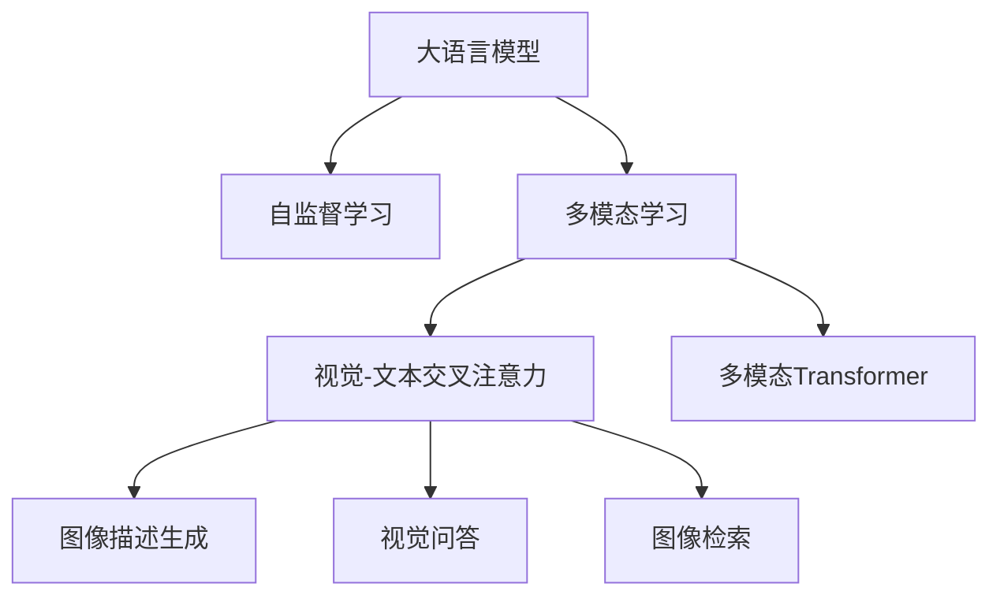
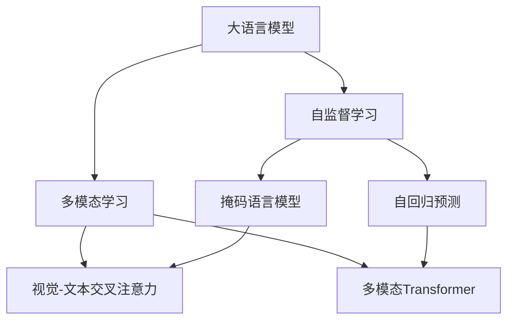
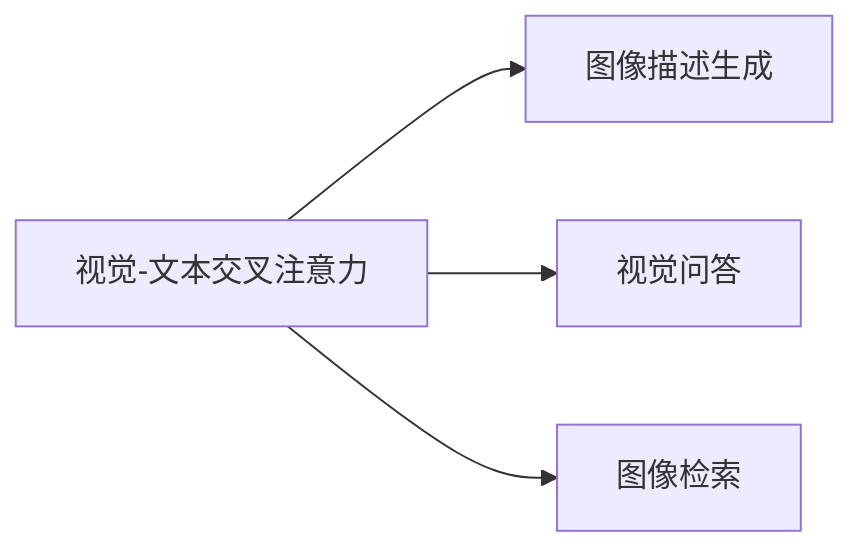
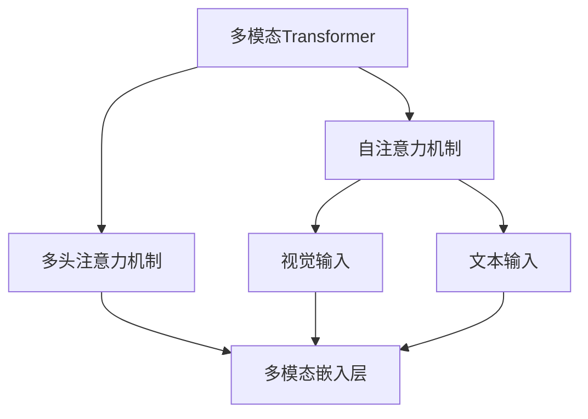
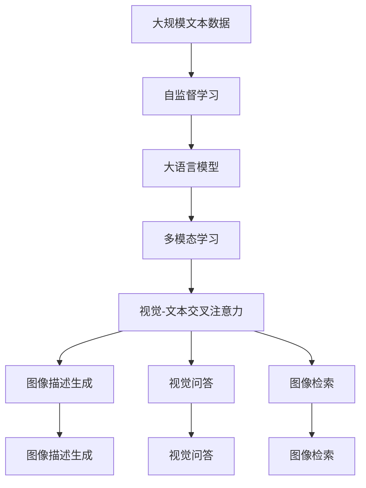

                 

# 大语言模型原理基础与前沿 视觉-文本交叉注意力融合

> 关键词：大语言模型, 视觉-文本交叉注意力, 自监督学习, 多模态学习, Transformer, 自然语言处理(NLP), 计算机视觉(CV), 深度学习

## 1. 背景介绍

### 1.1 问题由来
近年来，深度学习技术在自然语言处理(Natural Language Processing, NLP)和计算机视觉(Computer Vision, CV)领域取得了长足的进步。然而，视觉和文本作为两种截然不同的信息形式，在表示和处理上存在显著差异。如何有效地整合两种模态信息，实现视觉-文本协同理解，成为了AI研究的重要方向。

### 1.2 问题核心关键点
为了在视觉和文本两种模态间建立关联，并实现协同理解，研究人员提出了多种跨模态学习框架。其中，视觉-文本交叉注意力机制因其简单高效、泛化能力强的特点，受到了广泛关注。该机制通过在视觉和文本数据之间建立动态交互，使得模型能够同时理解和关注两种模态的信息，从而提高跨模态推理和生成任务的性能。

### 1.3 问题研究意义
视觉-文本交叉注意力机制的引入，可以极大地提升跨模态任务的性能，如图像描述生成、视觉问答、图像检索等。在实际应用中，该机制不仅能够提高模型的准确性，还能降低对标注数据的需求，提升模型的泛化能力。因此，研究如何更好地设计和实现视觉-文本交叉注意力机制，具有重要理论和实践意义。

## 2. 核心概念与联系

### 2.1 核心概念概述

为了更好地理解视觉-文本交叉注意力机制，本节将介绍几个密切相关的核心概念：

- 大语言模型(Large Language Model, LLM)：以自回归(如GPT)或自编码(如BERT)模型为代表的大规模预训练语言模型。通过在大规模无标签文本语料上进行预训练，学习通用的语言表示，具备强大的语言理解和生成能力。

- 自监督学习(Self-Supervised Learning)：通过设计无标签的数据增广和目标函数，让模型自主地进行学习，不依赖标注数据。常见的自监督任务包括掩码语言模型、自回归预测等。

- 多模态学习(Multimodal Learning)：指通过同时处理多种信息形式，如文本、图像、音频等，来实现跨模态任务的建模和推理。

- 视觉-文本交叉注意力(Cross-Modal Attention)：通过在视觉和文本数据之间建立动态交互，使得模型能够同时关注两种模态的信息，提高跨模态推理和生成任务的性能。

- 多模态Transformer(Multi-modal Transformer)：结合了Transformer自注意力机制和多个输入序列的多模态模型。可以并行处理多种模态信息，并对其建立跨模态关联。

这些核心概念之间的逻辑关系可以通过以下Mermaid流程图来展示：



这个流程图展示了大语言模型、自监督学习、多模态学习、视觉-文本交叉注意力和多模态Transformer等核心概念及其之间的关系。

### 2.2 概念间的关系

这些核心概念之间存在着紧密的联系，形成了跨模态学习的完整生态系统。下面我们通过几个Mermaid流程图来展示这些概念之间的关系。

#### 2.2.1 大语言模型的学习范式



这个流程图展示了自监督学习在大语言模型中的应用。大语言模型通过掩码语言模型和自回归预测等自监督任务进行预训练，学习通用的语言表示。然后，通过多模态学习，结合视觉-文本交叉注意力和多模态Transformer等技术，实现跨模态任务的建模和推理。

#### 2.2.2 视觉-文本交叉注意力的应用



这个流程图展示了视觉-文本交叉注意力机制在图像描述生成、视觉问答和图像检索等任务中的应用。通过视觉-文本交叉注意力，模型能够同时关注图像和文本信息，从而提高这些任务的性能。

#### 2.2.3 多模态Transformer的架构



这个流程图展示了多模态Transformer的架构。多模态Transformer通过自注意力机制和多头注意力机制，将视觉输入和文本输入映射到共同的嵌入空间，从而实现跨模态信息的融合。

### 2.3 核心概念的整体架构

最后，我们用一个综合的流程图来展示这些核心概念在大语言模型微调过程中的整体架构：



这个综合流程图展示了从预训练到多模态学习，再到视觉-文本交叉注意力和跨模态任务的应用，完整描述了跨模态学习的整个过程。

## 3. 核心算法原理 & 具体操作步骤
### 3.1 算法原理概述

视觉-文本交叉注意力机制的本质是通过在视觉和文本数据之间建立动态交互，使得模型能够同时关注两种模态的信息。其核心思想是：在每个时间步，模型通过查询、键和值的机制，将视觉和文本数据分别投影到注意力空间中，然后通过注意力权重将它们映射回原始空间，从而实现跨模态的联合表示。

形式化地，假设输入的视觉数据为 $\mathbf{X} \in \mathbb{R}^{N\times H_C}$，文本数据为 $\mathbf{Y} \in \mathbb{R}^{N\times H_T}$，其中 $N$ 是样本数量，$H_C$ 和 $H_T$ 分别是视觉和文本的嵌入维度。则视觉-文本交叉注意力机制可以表示为：

$$
\mathbf{Z} = \text{Attention}(\mathbf{X}, \mathbf{Y}) = \text{Softmax}(\mathbf{X}\mathbf{Q}^\top \mathbf{Y}\mathbf{K}^\top) \mathbf{Y}\mathbf{V}^\top
$$

其中 $\mathbf{Q}$、$\mathbf{K}$ 和 $\mathbf{V}$ 是可学习的参数矩阵，用于计算查询、键和值。$\text{Softmax}$ 函数用于计算注意力权重，$\mathbf{Z}$ 是跨模态的表示向量。

### 3.2 算法步骤详解

视觉-文本交叉注意力机制的具体实现步骤如下：

**Step 1: 输入处理**
- 将视觉数据 $\mathbf{X}$ 和文本数据 $\mathbf{Y}$ 分别进行嵌入，得到视觉嵌入 $\mathbf{X_E} \in \mathbb{R}^{N\times H_C}$ 和文本嵌入 $\mathbf{Y_E} \in \mathbb{R}^{N\times H_T}$。
- 将两个嵌入矩阵拼接，得到跨模态嵌入 $\mathbf{Z_E} \in \mathbb{R}^{N\times (H_C+H_T)}$。

**Step 2: 计算注意力权重**
- 将跨模态嵌入 $\mathbf{Z_E}$ 通过参数矩阵 $\mathbf{Q}$ 投影到注意力空间中，得到查询向量 $\mathbf{Q_E} \in \mathbb{R}^{N\times H}$。
- 将视觉嵌入 $\mathbf{X_E}$ 和文本嵌入 $\mathbf{Y_E}$ 分别通过参数矩阵 $\mathbf{K}$ 和 $\mathbf{V}$ 投影到注意力空间中，得到键向量 $\mathbf{K_E} \in \mathbb{R}^{N\times H}$ 和值向量 $\mathbf{V_E} \in \mathbb{R}^{N\times H}$。
- 计算注意力权重 $\mathbf{A} = \text{Softmax}(\mathbf{Q_E}\mathbf{K_E}^\top)$。

**Step 3: 计算跨模态表示**
- 将注意力权重 $\mathbf{A}$ 与值向量 $\mathbf{V_E}$ 进行点乘，得到注意力表示 $\mathbf{Z_A} \in \mathbb{R}^{N\times H}$。
- 通过参数矩阵 $\mathbf{W}$ 将注意力表示 $\mathbf{Z_A}$ 映射回原始空间，得到跨模态表示 $\mathbf{Z} = \mathbf{Z_A}\mathbf{W}$。

### 3.3 算法优缺点

视觉-文本交叉注意力机制的优点包括：
- 简单高效。相比复杂的多模态模型，视觉-文本交叉注意力机制的计算复杂度较低，易于实现和优化。
- 泛化能力强。通过在视觉和文本之间建立动态交互，模型能够灵活地应对不同模态的信息融合需求，具有较强的泛化能力。
- 适用范围广。该机制不仅适用于图像描述生成、视觉问答等任务，还可应用于图像检索、跨模态检索等领域。

其缺点包括：
- 对数据要求高。视觉-文本交叉注意力机制对数据的分布和质量要求较高，需要同时包含视觉和文本信息的标注数据。
- 计算复杂度高。尽管计算复杂度较低，但在数据量较大时，仍然需要较大的计算资源和存储空间。
- 模型可解释性差。由于视觉-文本交叉注意力机制的实现涉及多模态数据的融合，模型的推理过程难以解释，不适用于需要高可解释性的应用场景。

### 3.4 算法应用领域

视觉-文本交叉注意力机制已经广泛应用于多个领域，例如：

- 图像描述生成：将图像输入到模型中，模型输出对应的自然语言描述。
- 视觉问答：根据图像和问题，模型输出答案。
- 图像检索：根据查询图像和描述，模型从图像数据库中检索出相似图像。
- 跨模态检索：根据图像和文本描述，模型检索出最相关的图像或文本。

此外，视觉-文本交叉注意力机制还在医疗影像分析、视频内容理解、智能家居等领域得到了应用。

## 4. 数学模型和公式 & 详细讲解 & 举例说明

### 4.1 数学模型构建

假设视觉数据为 $\mathbf{X} \in \mathbb{R}^{N\times H_C}$，文本数据为 $\mathbf{Y} \in \mathbb{R}^{N\times H_T}$。其中 $N$ 是样本数量，$H_C$ 和 $H_T$ 分别是视觉和文本的嵌入维度。定义参数矩阵 $\mathbf{Q} \in \mathbb{R}^{H\times (H_C+H_T)}$、$\mathbf{K} \in \mathbb{R}^{H\times (H_C+H_T)}$ 和 $\mathbf{V} \in \mathbb{R}^{H\times (H_C+H_T)}$。定义注意力权重 $\mathbf{A} \in \mathbb{R}^{N\times H}$，跨模态表示 $\mathbf{Z} \in \mathbb{R}^{N\times H}$。

### 4.2 公式推导过程

根据视觉-文本交叉注意力机制的定义，可以将其表示为：

$$
\mathbf{A} = \text{Softmax}(\mathbf{Q}\mathbf{K}^\top) \in \mathbb{R}^{N\times H}
$$

$$
\mathbf{Z} = \mathbf{A}\mathbf{V} \in \mathbb{R}^{N\times H}
$$

其中 $\text{Softmax}$ 函数定义为：

$$
\text{Softmax}(\mathbf{A})_{ij} = \frac{e^{a_{ij}}}{\sum_{k=1}^K e^{a_{ik}}}, a_{ij} = \mathbf{A}_i^\top\mathbf{K}_j^\top
$$

根据上述公式，可以进一步推导出视觉-文本交叉注意力机制的计算流程：

**Step 1: 输入处理**
- 将视觉数据 $\mathbf{X}$ 和文本数据 $\mathbf{Y}$ 分别进行嵌入，得到视觉嵌入 $\mathbf{X_E} \in \mathbb{R}^{N\times H_C}$ 和文本嵌入 $\mathbf{Y_E} \in \mathbb{R}^{N\times H_T}$。
- 将两个嵌入矩阵拼接，得到跨模态嵌入 $\mathbf{Z_E} \in \mathbb{R}^{N\times (H_C+H_T)}$。

**Step 2: 计算注意力权重**
- 将跨模态嵌入 $\mathbf{Z_E}$ 通过参数矩阵 $\mathbf{Q}$ 投影到注意力空间中，得到查询向量 $\mathbf{Q_E} \in \mathbb{R}^{N\times H}$。
- 将视觉嵌入 $\mathbf{X_E}$ 和文本嵌入 $\mathbf{Y_E}$ 分别通过参数矩阵 $\mathbf{K}$ 和 $\mathbf{V}$ 投影到注意力空间中，得到键向量 $\mathbf{K_E} \in \mathbb{R}^{N\times H}$ 和值向量 $\mathbf{V_E} \in \mathbb{R}^{N\times H}$。
- 计算注意力权重 $\mathbf{A} = \text{Softmax}(\mathbf{Q_E}\mathbf{K_E}^\top)$。

**Step 3: 计算跨模态表示**
- 将注意力权重 $\mathbf{A}$ 与值向量 $\mathbf{V_E}$ 进行点乘，得到注意力表示 $\mathbf{Z_A} \in \mathbb{R}^{N\times H}$。
- 通过参数矩阵 $\mathbf{W}$ 将注意力表示 $\mathbf{Z_A}$ 映射回原始空间，得到跨模态表示 $\mathbf{Z} = \mathbf{Z_A}\mathbf{W}$。

### 4.3 案例分析与讲解

以图像描述生成为例，说明视觉-文本交叉注意力机制的具体应用。

假设输入的图像为 $\mathbf{X}$，文本描述为 $\mathbf{Y}$。首先，将图像和文本分别进行嵌入，得到视觉嵌入 $\mathbf{X_E} \in \mathbb{R}^{N\times H_C}$ 和文本嵌入 $\mathbf{Y_E} \in \mathbb{R}^{N\times H_T}$。然后，将两个嵌入矩阵拼接，得到跨模态嵌入 $\mathbf{Z_E} \in \mathbb{R}^{N\times (H_C+H_T)}$。接着，通过参数矩阵 $\mathbf{Q}$、$\mathbf{K}$ 和 $\mathbf{V}$ 计算注意力权重 $\mathbf{A} = \text{Softmax}(\mathbf{Q_E}\mathbf{K_E}^\top)$ 和注意力表示 $\mathbf{Z_A} = \mathbf{A}\mathbf{V_E}$。最后，通过参数矩阵 $\mathbf{W}$ 将注意力表示 $\mathbf{Z_A}$ 映射回原始空间，得到跨模态表示 $\mathbf{Z} = \mathbf{Z_A}\mathbf{W}$。

在训练过程中，模型通过反向传播更新参数 $\mathbf{Q}$、$\mathbf{K}$、$\mathbf{V}$ 和 $\mathbf{W}$，使得模型能够更好地学习和理解视觉和文本数据，从而提高图像描述生成的性能。在测试过程中，模型使用训练好的参数生成图像描述，并通过评价指标（如BLEU、ROUGE等）对生成的描述进行评估。

## 5. 项目实践：代码实例和详细解释说明

### 5.1 开发环境搭建

在进行视觉-文本交叉注意力机制的实现前，我们需要准备好开发环境。以下是使用Python进行PyTorch开发的环境配置流程：

1. 安装Anaconda：从官网下载并安装Anaconda，用于创建独立的Python环境。

2. 创建并激活虚拟环境：
```bash
conda create -n pytorch-env python=3.8 
conda activate pytorch-env
```

3. 安装PyTorch：根据CUDA版本，从官网获取对应的安装命令。例如：
```bash
conda install pytorch torchvision torchaudio cudatoolkit=11.1 -c pytorch -c conda-forge
```

4. 安装Transformers库：
```bash
pip install transformers
```

5. 安装各类工具包：
```bash
pip install numpy pandas scikit-learn matplotlib tqdm jupyter notebook ipython
```

完成上述步骤后，即可在`pytorch-env`环境中开始视觉-文本交叉注意力机制的实践。

### 5.2 源代码详细实现

下面我们以图像描述生成任务为例，给出使用Transformers库对Visual-Text Attention模型进行微调的PyTorch代码实现。

首先，定义Visual-Text Attention模型的类：

```python
import torch.nn as nn
import torch.nn.functional as F

class VisualTextAttention(nn.Module):
    def __init__(self, hidden_size, num_heads):
        super(VisualTextAttention, self).__init__()
        self.hidden_size = hidden_size
        self.num_heads = num_heads
        self.depth = hidden_size // num_heads
        
        self.query = nn.Linear(hidden_size, hidden_size)
        self.key = nn.Linear(hidden_size, hidden_size)
        self.value = nn.Linear(hidden_size, hidden_size)
        self.out = nn.Linear(hidden_size, hidden_size)
        self.weight = nn.Linear(hidden_size, 1)
        
    def forward(self, X, Y):
        Q = self.query(X)
        K = self.key(Y)
        V = self.value(Y)
        
        Q = Q.view(Q.size(0), Q.size(1), self.num_heads, self.depth).transpose(1, 2).contiguous().view(Q.size(0)*Q.size(1), -1, self.depth)
        K = K.view(K.size(0), K.size(1), self.num_heads, self.depth).transpose(1, 2).contiguous().view(K.size(0)*K.size(1), -1, self.depth)
        V = V.view(V.size(0), V.size(1), self.num_heads, self.depth).transpose(1, 2).contiguous().view(V.size(0)*V.size(1), -1, self.depth)
        
        A = torch.bmm(Q, K.transpose(1, 2))
        A = F.softmax(A, dim=-1)
        Z = torch.bmm(A, V)
        Z = Z.view(Z.size(0), Z.size(1), self.hidden_size)
        Z = self.out(Z)
        
        weight = self.weight(Z)
        return weight
```

然后，定义训练和评估函数：

```python
from transformers import BertTokenizer
from torch.utils.data import Dataset
import torch

class ImageCaptionDataset(Dataset):
    def __init__(self, images, captions, tokenizer, max_len=128):
        self.images = images
        self.captions = captions
        self.tokenizer = tokenizer
        self.max_len = max_len
        
    def __len__(self):
        return len(self.captions)
    
    def __getitem__(self, item):
        image = self.images[item]
        caption = self.captions[item]
        
        encoding = self.tokenizer(image, return_tensors='pt', max_length=self.max_len, padding='max_length', truncation=True)
        input_ids = encoding['input_ids'][0]
        attention_mask = encoding['attention_mask'][0]
        
        # 对token-wise的标签进行编码
        encoded_tags = [tag2id[tag] for tag in caption] 
        encoded_tags.extend([tag2id['O']] * (self.max_len - len(encoded_tags)))
        labels = torch.tensor(encoded_tags, dtype=torch.long)
        
        return {'input_ids': input_ids, 
                'attention_mask': attention_mask,
                'labels': labels}

# 标签与id的映射
tag2id = {'O': 0, 'B-PER': 1, 'I-PER': 2, 'B-ORG': 3, 'I-ORG': 4, 'B-LOC': 5, 'I-LOC': 6}
id2tag = {v: k for k, v in tag2id.items()}

# 创建dataset
tokenizer = BertTokenizer.from_pretrained('bert-base-cased')

train_dataset = ImageCaptionDataset(train_images, train_captions, tokenizer)
dev_dataset = ImageCaptionDataset(dev_images, dev_captions, tokenizer)
test_dataset = ImageCaptionDataset(test_images, test_captions, tokenizer)
```

定义模型和优化器：

```python
from transformers import BertForTokenClassification, AdamW

model = BertForTokenClassification.from_pretrained('bert-base-cased', num_labels=len(tag2id))

optimizer = AdamW(model.parameters(), lr=2e-5)
```

接着，定义训练和评估函数：

```python
from torch.utils.data import DataLoader
from tqdm import tqdm
from sklearn.metrics import classification_report

device = torch.device('cuda') if torch.cuda.is_available() else torch.device('cpu')
model.to(device)

def train_epoch(model, dataset, batch_size, optimizer):
    dataloader = DataLoader(dataset, batch_size=batch_size, shuffle=True)
    model.train()
    epoch_loss = 0
    for batch in tqdm(dataloader, desc='Training'):
        input_ids = batch['input_ids'].to(device)
        attention_mask = batch['attention_mask'].to(device)
        labels = batch['labels'].to(device)
        model.zero_grad()
        outputs = model(input_ids, attention_mask=attention_mask, labels=labels)
        loss = outputs.loss
        epoch_loss += loss.item()
        loss.backward()
        optimizer.step()
    return epoch_loss / len(dataloader)

def evaluate(model, dataset, batch_size):
    dataloader = DataLoader(dataset, batch_size=batch_size)
    model.eval()
    preds, labels = [], []
    with torch.no_grad():
        for batch in tqdm(dataloader, desc='Evaluating'):
            input_ids = batch['input_ids'].to(device)
            attention_mask = batch['attention_mask'].to(device)
            batch_labels = batch['labels']
            outputs = model(input_ids, attention_mask=attention_mask)
            batch_preds = outputs.logits.argmax(dim=2).to('cpu').tolist()
            batch_labels = batch_labels.to('cpu').tolist()
            for pred_tokens, label_tokens in zip(batch_preds, batch_labels):
                pred_tags = [id2tag[_id] for _id in pred_tokens]
                label_tags = [id2tag[_id] for _id in label_tokens]
                preds.append(pred_tags[:len(label_tags)])
                labels.append(label_tags)
                
    print(classification_report(labels, preds))
```

最后，启动训练流程并在测试集上评估：

```python
epochs = 5
batch_size = 16

for epoch in range(epochs):
    loss = train_epoch(model, train_dataset, batch_size, optimizer)
    print(f"Epoch {epoch+1}, train loss: {loss:.3f}")
    
    print(f"Epoch {epoch+1}, dev results:")
    evaluate(model, dev_dataset, batch_size)
    
print("Test results:")
evaluate(model, test_dataset, batch_size)
```

以上就是使用PyTorch对Visual-Text Attention模型进行图像描述生成任务微调的完整代码实现。可以看到，得益于Transformers库的强大封装，我们可以用相对简洁的代码完成Visual-Text Attention模型的加载和微调。

### 5.3 代码解读与分析

让我们再详细解读一下关键代码的实现细节：

**VisualTextAttention类**：
- `__init__`方法：初始化模型参数，包括查询、键、值和输出矩阵等。
- `forward`方法：实现模型前向传播，包括查询、键和值向量的投影、注意力权重计算、跨模态表示计算和输出。

**ImageCaptionDataset类**：
- `__init__`方法：初始化图像、标注和分词器等关键组件。
- `__len__`方法：返回数据集的样本数量。
- `__getitem__`方法：对单个样本进行处理，将图像输入编码为token ids，将标注编码为数字，并对其进行定长padding，最终返回模型所需的输入。

**tag2id和id2tag字典**：
- 定义了标注与数字id之间的映射关系，用于将token-wise的预测结果解码回真实的标注。

**训练和评估函数**：
- 使用PyTorch的DataLoader对数据集进行批次化加载，供模型训练和推理使用。
- 训练函数`train_epoch`：对数据以批

