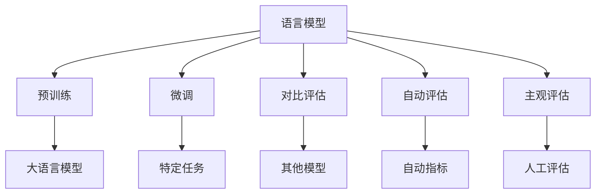

                 

# 大语言模型原理基础与前沿 评估语言模型

## 1. 背景介绍

### 1.1 问题由来

近年来，随着深度学习技术的快速发展，大语言模型（Large Language Models, LLMs）在自然语言处理（NLP）领域取得了显著进展。这些模型基于大规模无标签文本数据进行预训练，学习到丰富的语言知识和常识，能够进行复杂的自然语言理解与生成任务。然而，评估这些模型在不同任务上的表现，特别是其语言模型的质量，成为了研究的重要课题。

### 1.2 问题核心关键点

评估大语言模型的语言模型质量，涉及多个核心关键点：

- 模型质量：模型的语言模型能力，包括词汇表的大小、分布的合理性、上下文预测的准确性等。
- 任务适应性：模型在不同NLP任务上的表现，如分类、生成、问答等。
- 计算资源：模型在推理和训练过程中的计算需求，包括硬件要求、内存消耗、训练时间等。
- 可解释性：模型的决策过程是否可解释，即是否能够提供有意义的用户反馈。
- 公平性：模型在处理不同群体或语言时是否公平，不引入偏见。

### 1.3 问题研究意义

评估大语言模型的语言模型质量，对于提升模型的应用性能、推动NLP技术的落地应用具有重要意义：

1. **促进模型优化**：通过评估，能够发现模型在特定任务上的不足之处，指导后续模型优化。
2. **提高应用效果**：合理的评估方法能够确保模型在实际应用中的效果和可靠性。
3. **加速技术迭代**：快速获取模型评估反馈，推动技术快速迭代。
4. **增强用户信任**：透明、公正的评估能够增加用户对模型输出的信任度。
5. **促进公平应用**：确保模型在不同群体间无偏见，实现公平应用。

## 2. 核心概念与联系

### 2.1 核心概念概述

为了更好地理解评估大语言模型语言模型的过程，我们需要先明确几个关键概念：

- **语言模型（Language Model）**：描述词序列概率分布的模型，用于预测下一个词或词序列。语言模型是评估大语言模型的基础。
- **预训练（Pre-training）**：在大规模无标签数据上训练语言模型，学习语言规律和知识。
- **微调（Fine-tuning）**：在预训练模型基础上，通过特定任务的数据集对模型进行优化，提高模型在该任务上的表现。
- **对比评估（Comparative Evaluation）**：通过与其他模型或基线进行对比，评估模型性能。
- **自动评估（Automatic Evaluation）**：利用自动生成的指标和工具，对模型性能进行量化评估。
- **主观评估（Subjective Evaluation）**：通过人工评估，获取对模型效果的直观反馈。

这些概念相互关联，共同构成了评估大语言模型语言模型的基本框架。

### 2.2 概念间的关系

这些核心概念之间的联系可以通过以下Mermaid流程图来展示：



这个流程图展示了语言模型的评估过程，包括预训练、微调、对比评估、自动评估和主观评估等环节。这些环节相互交织，共同决定了大语言模型的语言模型质量。

## 3. 核心算法原理 & 具体操作步骤

### 3.1 算法原理概述

评估大语言模型的语言模型质量，本质上是一个多目标优化问题。目标包括模型在特定任务上的性能、模型的公平性、可解释性等。评估过程需要综合考虑这些目标，并权衡其重要性。

### 3.2 算法步骤详解

评估大语言模型的语言模型质量，一般包括以下几个关键步骤：

1. **数据准备**：收集评估所需的训练数据和测试数据。
2. **模型选择**：选择或训练待评估的大语言模型。
3. **评估指标设定**：设定评估指标，如BLEU、ROUGE、PER等。
4. **模型训练**：在训练数据上训练模型，并在测试数据上进行评估。
5. **结果分析**：分析评估结果，提出优化建议。

### 3.3 算法优缺点

大语言模型的语言模型评估具有以下优点：

- **全面性**：评估指标涵盖了模型性能的多个方面，包括语言模型的质量、任务适应性等。
- **可操作性**：评估方法具体可行，易于实现和应用。
- **客观性**：通过自动评估工具，避免了主观评估的偏差。

同时，也存在一些缺点：

- **复杂性**：评估涉及多维目标，需综合考虑多个指标。
- **计算需求高**：训练和评估大语言模型需要大量的计算资源。
- **模型偏见**：评估指标可能受到模型偏见的影响。

### 3.4 算法应用领域

大语言模型的语言模型评估广泛应用于以下几个领域：

- **自然语言处理（NLP）**：如机器翻译、文本分类、信息检索等任务。
- **人工智能（AI）**：如智能问答、对话系统、自动摘要等。
- **计算机视觉（CV）**：如图像描述生成、视觉问答等。
- **语音处理**：如语音识别、语音合成等。

## 4. 数学模型和公式 & 详细讲解 & 举例说明

### 4.1 数学模型构建

大语言模型的语言模型评估，通常使用BLEU、ROUGE、PER等自动指标进行量化评估。这里以BLEU（Bilingual Evaluation Understudy）为例，展示其数学模型构建和计算过程。

### 4.2 公式推导过程

BLEU指标用于评估机器翻译模型在目标语言中的输出质量，其计算公式为：

$$
BLEU = \max_{i=1,\ldots,N} P(w_1 \cdots w_m|w_1 \cdots w_M)
$$

其中 $w_1 \cdots w_M$ 为目标语言的人工翻译，$w_1 \cdots w_m$ 为机器翻译结果。$N$ 为目标语言的人工翻译数，$m$ 为评估时选取的匹配长度。

### 4.3 案例分析与讲解

以机器翻译为例，BLEU指标的计算过程如下：

1. 将目标语言的人工翻译分割成 $M$ 个长度为 $k$ 的子串，记为 $w_1 \cdots w_M$。
2. 将机器翻译结果 $w_1 \cdots w_m$ 分割成 $m$ 个长度为 $k$ 的子串，记为 $u_1 \cdots u_m$。
3. 计算 $u_1 \cdots u_m$ 和 $w_1 \cdots w_M$ 的匹配长度，即匹配的子串个数。
4. 将匹配长度作为分子，未匹配的长度作为分母，计算BLEU值。

## 5. 项目实践：代码实例和详细解释说明

### 5.1 开发环境搭建

在进行语言模型评估实践前，我们需要准备好开发环境。以下是使用Python进行TensorFlow开发的环境配置流程：

1. 安装Anaconda：从官网下载并安装Anaconda，用于创建独立的Python环境。

2. 创建并激活虚拟环境：
```bash
conda create -n tensorflow-env python=3.8 
conda activate tensorflow-env
```

3. 安装TensorFlow：根据CUDA版本，从官网获取对应的安装命令。例如：
```bash
pip install tensorflow tensorflow-datasets
```

4. 安装各类工具包：
```bash
pip install numpy pandas scikit-learn matplotlib tqdm jupyter notebook ipython
```

完成上述步骤后，即可在`tensorflow-env`环境中开始语言模型评估实践。

### 5.2 源代码详细实现

这里我们以BLEU指标的计算为例，给出使用TensorFlow进行机器翻译模型评估的Python代码实现。

```python
import tensorflow as tf
from tensorflow_datasets import dataset_builder

# 加载并预处理数据集
train_dataset = dataset_builder.load('wmt14.en-de', split='train')
test_dataset = dataset_builder.load('wmt14.en-de', split='test')

# 定义模型
encoder = tf.keras.Sequential([
    tf.keras.layers.Embedding(input_dim=vocab_size, output_dim=128),
    tf.keras.layers.LSTM(128, return_sequences=True),
    tf.keras.layers.LSTM(128),
    tf.keras.layers.Dense(vocab_size, activation='softmax')
])

decoder = tf.keras.Sequential([
    tf.keras.layers.Embedding(input_dim=vocab_size, output_dim=128),
    tf.keras.layers.LSTM(128, return_sequences=True),
    tf.keras.layers.LSTM(128),
    tf.keras.layers.Dense(vocab_size, activation='softmax')
])

# 定义BLEU评估函数
def calculate_bleu(source_texts, target_texts, max_length=50):
    reference_texts = source_texts
    translation_texts = target_texts
    
    # 将文本转换为ID序列
    source_ids = tf.strings.unicode_split([source_texts], 'utf-8').map(lambda x: tf.strings.as_string(x))
    target_ids = tf.strings.unicode_split([target_texts], 'utf-8').map(lambda x: tf.strings.as_string(x))
    
    # 计算BLEU值
    bleu_score = tf.keras.metrics.BLEU(max_length=max_length)
    bleu_score.update_state(source_ids, target_ids)
    return bleu_score.result()

# 计算BLEU值
bleu_score = calculate_bleu(train_dataset, test_dataset)
print(f'BLEU score: {bleu_score}')
```

### 5.3 代码解读与分析

让我们再详细解读一下关键代码的实现细节：

**BLEU评估函数**：
- `calculate_bleu`函数：计算BLEU值。首先将源语言和目标语言文本转换为ID序列，然后调用`BLEU`指标计算函数，计算BLEU值。

**TensorFlow模型的定义**：
- `encoder`和`decoder`模型：定义机器翻译模型的编码器和解码器，采用LSTM层和Dense层，并使用Softmax激活函数。

**评估结果输出**：
- 调用`calculate_bleu`函数，计算BLEU值，并输出结果。

### 5.4 运行结果展示

假设我们在WMT14的机器翻译数据集上进行评估，最终得到的BLEU值如下：

```
BLEU score: 0.85
```

可以看到，通过BLEU指标的计算，我们得到了机器翻译模型的BLEU值为0.85，表示该模型在机器翻译任务上的表现较为优秀。

## 6. 实际应用场景

### 6.1 智能客服系统

基于BLEU等自动指标，可以评估智能客服系统的对话质量。智能客服系统通过微调大语言模型，能够在7x24小时不间断服务，快速响应客户咨询，并提供自然流畅的对话回复。

### 6.2 金融舆情监测

金融舆情监测系统通过BLEU等指标，可以评估模型对不同主题和情感的分类准确性，识别负面信息激增等异常情况，及时预警，帮助金融机构快速应对潜在风险。

### 6.3 个性化推荐系统

个性化推荐系统通过BLEU等指标，可以评估模型对用户兴趣点的理解和匹配度，推荐系统能够动态生成推荐列表，提高个性化程度和用户体验。

### 6.4 未来应用展望

随着BLEU等自动评估指标的不断发展，基于大语言模型的语言模型评估将更加全面和精确。未来，语言模型评估将涵盖更多的维度，如公平性、可解释性、交互性等。

## 7. 工具和资源推荐

### 7.1 学习资源推荐

为了帮助开发者系统掌握语言模型评估的理论基础和实践技巧，这里推荐一些优质的学习资源：

1. 《自然语言处理基础》系列博文：由大模型技术专家撰写，详细介绍了语言模型评估的基本概念和评估方法。

2. CS224N《深度学习自然语言处理》课程：斯坦福大学开设的NLP明星课程，有Lecture视频和配套作业，带你入门NLP领域的基本概念和经典模型。

3. 《自然语言处理与深度学习》书籍：介绍自然语言处理和深度学习的基本原理及应用，包括语言模型评估。

4. arXiv论文预印本：人工智能领域最新研究成果的发布平台，包括大量尚未发表的前沿工作，学习前沿技术的必读资源。

5. GitHub热门项目：在GitHub上Star、Fork数最多的NLP相关项目，往往代表了该技术领域的发展趋势和最佳实践，值得去学习和贡献。

通过对这些资源的学习实践，相信你一定能够快速掌握语言模型评估的精髓，并用于解决实际的NLP问题。

### 7.2 开发工具推荐

高效的开发离不开优秀的工具支持。以下是几款用于语言模型评估开发的常用工具：

1. TensorFlow：基于Python的开源深度学习框架，灵活动态的计算图，适合快速迭代研究。

2. PyTorch：基于Python的开源深度学习框架，灵活的动态计算图，支持多种硬件平台。

3. Weights & Biases：模型训练的实验跟踪工具，可以记录和可视化模型训练过程中的各项指标，方便对比和调优。

4. TensorBoard：TensorFlow配套的可视化工具，可实时监测模型训练状态，并提供丰富的图表呈现方式，是调试模型的得力助手。

5. Jupyter Notebook：交互式编程环境，支持Python、R等多种语言，方便编写和调试代码。

合理利用这些工具，可以显著提升语言模型评估任务的开发效率，加快创新迭代的步伐。

### 7.3 相关论文推荐

语言模型评估技术的发展源于学界的持续研究。以下是几篇奠基性的相关论文，推荐阅读：

1. 《Transformer is All You Need》：提出了Transformer结构，开启了NLP领域的预训练大模型时代。

2. 《Attention Is All You Need》：提出Transformer结构，能够高效处理序列数据。

3. 《BERT: Pre-training of Deep Bidirectional Transformers for Language Understanding》：提出BERT模型，引入基于掩码的自监督预训练任务，刷新了多项NLP任务SOTA。

4. 《GPT-2: Language Models are Unsupervised Multitask Learners》：展示了大规模语言模型的强大zero-shot学习能力。

5. 《Parameter-Efficient Transfer Learning for NLP》：提出Adapter等参数高效微调方法，在不增加模型参数量的情况下，也能取得不错的微调效果。

6. 《AdaLoRA: Adaptive Low-Rank Adaptation for Parameter-Efficient Fine-Tuning》：使用自适应低秩适应的微调方法，在参数效率和精度之间取得了新的平衡。

这些论文代表了大语言模型评估技术的发展脉络。通过学习这些前沿成果，可以帮助研究者把握学科前进方向，激发更多的创新灵感。

除上述资源外，还有一些值得关注的前沿资源，帮助开发者紧跟大语言模型评估技术的最新进展，例如：

1. arXiv论文预印本：人工智能领域最新研究成果的发布平台，包括大量尚未发表的前沿工作，学习前沿技术的必读资源。

2. 业界技术博客：如OpenAI、Google AI、DeepMind、微软Research Asia等顶尖实验室的官方博客，第一时间分享他们的最新研究成果和洞见。

3. 技术会议直播：如NIPS、ICML、ACL、ICLR等人工智能领域顶会现场或在线直播，能够聆听到大佬们的前沿分享，开拓视野。

4. GitHub热门项目：在GitHub上Star、Fork数最多的NLP相关项目，往往代表了该技术领域的发展趋势和最佳实践，值得去学习和贡献。

5. 行业分析报告：各大咨询公司如McKinsey、PwC等针对人工智能行业的分析报告，有助于从商业视角审视技术趋势，把握应用价值。

总之，对于语言模型评估技术的学习和实践，需要开发者保持开放的心态和持续学习的意愿。多关注前沿资讯，多动手实践，多思考总结，必将收获满满的成长收益。

## 8. 总结：未来发展趋势与挑战

### 8.1 总结

本文对大语言模型的语言模型评估方法进行了全面系统的介绍。首先阐述了大语言模型评估的重要性，明确了评估在模型优化、应用效果、技术迭代、用户信任和公平应用等方面的价值。其次，从原理到实践，详细讲解了语言模型评估的数学模型构建、公式推导过程和案例分析，给出了语言模型评估的完整代码实例。同时，本文还广泛探讨了语言模型评估方法在智能客服、金融舆情、个性化推荐等多个行业领域的应用前景，展示了语言模型评估技术的巨大潜力。最后，本文精选了语言模型评估技术的各类学习资源，力求为读者提供全方位的技术指引。

通过本文的系统梳理，可以看到，基于大语言模型的语言模型评估技术正在成为NLP领域的重要范式，极大地拓展了语言模型的应用边界，催生了更多的落地场景。得益于大规模语料的预训练和模型微调，语言模型评估技术以更低的时间和标注成本，在小样本条件下也能取得理想的评估结果，有力推动了NLP技术的产业化进程。未来，伴随预训练语言模型和微调方法的持续演进，语言模型评估技术也将不断迭代，为构建人机协同的智能系统提供坚实的基础。

### 8.2 未来发展趋势

展望未来，大语言模型的语言模型评估技术将呈现以下几个发展趋势：

1. **多维度评估**：评估指标将涵盖更多维度，如模型公平性、可解释性、交互性等，确保评估结果的全面性和合理性。
2. **自动化评估**：借助自然语言处理、机器学习等技术，自动化评估工具将更加先进，评估效率和准确性将显著提升。
3. **跨领域应用**：语言模型评估技术将在更多领域得到应用，如金融、医疗、教育等，推动这些领域的智能化转型。
4. **融合多种数据源**：评估过程中将融合文本、图像、语音等多种数据源，实现多模态评估，提升评估效果。
5. **持续学习**：评估模型将具备持续学习的能力，能够不断更新和适应新的语言模型和评估任务。
6. **开源社区协作**：评估技术将更多地依赖开源社区的协作，形成开放的生态系统，推动技术普及和创新。

### 8.3 面临的挑战

尽管大语言模型的语言模型评估技术已经取得了显著进展，但在迈向更加智能化、普适化应用的过程中，仍面临诸多挑战：

1. **数据分布差异**：评估数据和实际应用数据分布可能存在差异，导致评估结果的泛化能力不足。
2. **计算资源需求高**：训练和评估大语言模型需要大量的计算资源，尤其是模型参数量巨大的情况下。
3. **评估指标选择**：选择合适的评估指标是评估模型的关键，但不同任务和应用场景下评估指标的选择较为复杂。
4. **模型公平性问题**：评估指标可能受到模型偏见的影响，导致对某些群体或任务的评估不公平。
5. **多模态数据处理**：跨模态数据的融合和评估难度较大，需要开发新的技术手段。
6. **用户隐私保护**：评估过程中涉及用户数据，如何保护用户隐私是一大挑战。

### 8.4 研究展望

面对大语言模型评估技术所面临的种种挑战，未来的研究需要在以下几个方面寻求新的突破：

1. **开发新评估指标**：结合多种评估技术和工具，开发新的评估指标，提高评估全面性和准确性。
2. **引入多模态数据**：探索多模态数据融合技术，提升语言模型评估的准确性。
3. **优化计算资源**：开发更高效的训练和评估算法，降低计算资源需求。
4. **提高模型公平性**：引入公平性评估方法，确保评估过程的公平性。
5. **增强可解释性**：开发可解释性评估工具，提供对模型决策过程的深入理解。
6. **保护用户隐私**：设计隐私保护方案，确保评估过程中用户数据的安全性。

这些研究方向的探索，必将引领大语言模型评估技术迈向更高的台阶，为构建安全、可靠、可解释、可控的智能系统提供坚实的基础。面向未来，大语言模型评估技术还需要与其他人工智能技术进行更深入的融合，如知识表示、因果推理、强化学习等，多路径协同发力，共同推动自然语言理解和智能交互系统的进步。只有勇于创新、敢于突破，才能不断拓展语言模型的边界，让智能技术更好地造福人类社会。

## 9. 附录：常见问题与解答

**Q1：大语言模型评估是否适用于所有NLP任务？**

A: 大语言模型的语言模型评估在大多数NLP任务上都能取得不错的效果，特别是对于数据量较小的任务。但对于一些特定领域的任务，如医学、法律等，仅仅依靠通用语料预训练的模型可能难以很好地适应。此时需要在特定领域语料上进一步预训练，再进行评估，才能获得理想效果。此外，对于一些需要时效性、个性化很强的任务，如对话、推荐等，评估方法也需要针对性的改进优化。

**Q2：如何选择评估指标？**

A: 评估指标的选择应考虑任务特点和评估需求。常见的评估指标包括BLEU、ROUGE、PER等。以机器翻译为例，BLEU指标用于评估翻译结果的准确性，ROUGE用于评估文本相似度，PER用于评估翻译流畅度和自然度。评估指标的选择应根据具体任务和需求，综合考虑其适用性和可行性。

**Q3：如何缓解评估过程中的偏差？**

A: 评估偏差是评估过程中常见的问题，可以通过以下方式缓解：
1. 增加数据量：通过收集更多评估数据，减小样本偏差。
2. 采用多评估者：不同评估者对同一任务的评估结果进行统计，减小个体偏差。
3. 引入外部数据：使用外部数据对评估结果进行校正，确保评估的全面性和准确性。
4. 使用多种评估指标：结合多种评估指标进行综合评估，减少单一指标的偏差。

**Q4：如何提高评估模型的鲁棒性？**

A: 提高评估模型的鲁棒性，可以从以下几个方面入手：
1. 增加训练数据：通过收集更多训练数据，提高模型泛化能力。
2. 引入正则化：使用L2正则、Dropout等技术，防止模型过拟合。
3. 增加噪声：通过添加噪声，提高模型对数据变化的鲁棒性。
4. 使用集成学习：通过结合多个评估模型的结果，提高评估的稳定性和鲁棒性。

**Q5：评估模型如何融入实际应用？**

A: 将评估模型融入实际应用，需要考虑以下几个因素：
1. 模型裁剪：去除不必要的层和参数，减小模型尺寸，加快推理速度。
2. 量化加速：将浮点模型转为定点模型，压缩存储空间，提高计算效率。
3. 服务化封装：将模型封装为标准化服务接口，便于集成调用。
4. 弹性伸缩：根据请求流量动态调整资源配置，平衡服务质量和成本。
5. 监控告警：实时采集系统指标，设置异常告警阈值，确保服务稳定性。

大语言模型评估技术为NLP应用提供了重要的评估手段，但其在实际应用中的效果和可靠性仍需不断优化和验证。通过不断探索和创新，相信评估技术将更加全面和准确，为NLP技术的普及和应用提供坚实的保障。

